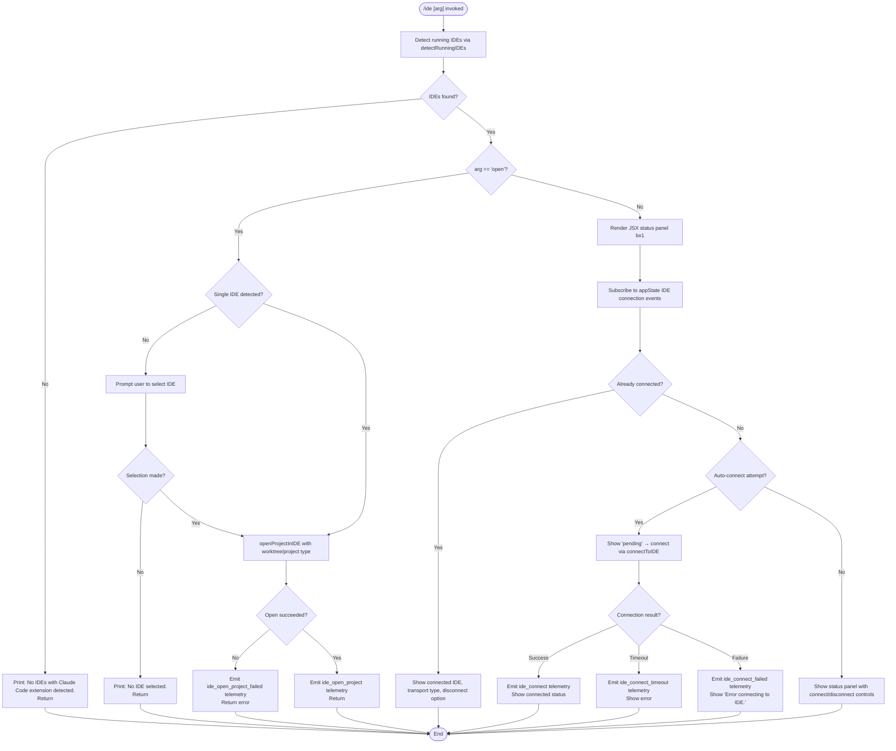

# `/ide`

> Analysis basis: CC v2.1.160 bundle.js (AST extraction + Claude interpretation)
> Minimum version: v2.1.160

---

## Overview

The `/ide` command manages IDE integrations for Claude Code — detecting running IDE instances (VS Code, Cursor, Windsurf, JetBrains family), connecting to or disconnecting from them via SSE or WebSocket transports, and displaying live connection status. When invoked with the optional `open` sub-command, it attempts to open the current project directory inside the selected IDE.

---

## Registration

| Field | Value |
|---|---|
| type | `local-jsx` |
| name | `ide` |
| description | `Manage IDE integrations and show status` |
| argumentHint | `[open]` |
| module_id | `xx1` |
| load_inline | `true` |
| loc_byte | `11424219` |
| loc_byte_end | `11424375` |
| loc_line | `7379` |
| arbor_handler.name | `q3f` |
| arbor_handler.fqn | `claude-2.1.160::q3f` |
| arbor_handler.kind | `AsyncFunction` |
| arbor_handler.resolution_path | `module_id` |
| arbor_handler.n_hits | `0` |

Analysis basis: CC v2.1.160 bundle.js:+11424219

---

## Input Branching

The handler has five or more distinct execution paths determined by the argument string, IDE detection result, connection state, and sub-command.



Analysis basis: CC v2.1.160 bundle.js:+11420333 (handler entry `q3f`), +11420550 (no-IDE message), +11420688 (no-selection message), +11420888 (open telemetry), +11420995 (open-failed telemetry), +11422438 (connect telemetry), +11422525 (connect-failed telemetry), +11422632 (connect-timeout telemetry)

---

## Behavioral Spec

### 1. Entry Point — `ideCommandHandler` (`q3f`)

```
async function ideCommandHandler(args, context):
    emit telemetry("tengu_ext_ide_command")          // +11420335
    get current working directory from context
    subcommand = args[0] ?? null

    ideList = await detectRunningIDEs(cwd)           // calls TM8

    if ideList is empty:
        print "No IDEs with Claude Code extension detected."
        return

    if subcommand == "open":
        await openProjectFlow(ideList, cwd)
    else:
        render IdeStatusPanel(ideList, context)      // calls bx1
```

Analysis basis: CC v2.1.160 bundle.js:+11420333 (`q3f` entry), +11420441 (literal `"open"`), +11420479 (`S6` call for cwd), +11420493 (`TM8` call for detection)

---

### 2. IDE Detection — `detectRunningIDEs` (`TM8`)

```
async function detectRunningIDEs(cwd):
    port = parseInt(envOrConfig("IDE_PORT")) ?? defaultPort  // TM8 → Y_
    knownPaths = await resolveIDESocketPaths(cwd)            // WM8 → naL
    results = await Promise.all(knownPaths.map(probeIDEPath)) // caL → L4_

    for each result:
        if result.type starts with "ws:":
            classify as WebSocket transport
        normalise platform path (Windows uppercase drive, NFC unicode)

    filter out unreachable entries
    emit "ide_detect" telemetry on success                   // +5374078
    emit "ide_detect_failed" telemetry on error              // +5374142
    return reachable IDE list
```

Detection scans for the following IDE families:

| IDE | Literal constant |
|---|---|
| VS Code | `"vscode"` (+11420748) |
| Cursor | `"cursor"` (+11420789) |
| Windsurf | `"windsurf"` (+11420830) |
| JetBrains family | `"jetbrains"` (+5369185) |

On Linux, a shell command is executed to enumerate running processes:

> Pattern (truncated): `ps aux | grep -E "code|cursor|windsurf|idea|…"` — see literal at +5377611

Analysis basis: CC v2.1.160 bundle.js:+5372735 (`TM8` start), +5374075 (`hH` error branch), +5374120 (`yH` render branch), +5373455 (platform prefix check)

---

### 3. Socket-Path Resolution — `resolveIDESocketPaths` (`WM8` + `naL`)

```
async function resolveIDESocketPaths(cwd):
    candidates = []
    homedir = os.homedir()

    // naL: scan ~/.claude/ide directory for socket files
    claudeDir = path.join(homedir, ".claude")
    ideDir    = path.join(claudeDir, "ide")

    for each entry in ideDir:
        if entry.isDirectory():
            socketPath = path.join(ideDir, entry, "socket")
            realpath   = await fs.realpath(socketPath)
            if not already_seen(realpath):
                candidates.push(realpath)

    // Filter out WSL system paths (e.g. /mnt/c/Users/Public, /mnt/c/Users/Default)
    candidates = candidates.filter(not_wsl_system_path)

    return Promise.all(candidates.map(resolveWorkspaceForSocket))
```

WSL path exclusions (literals): `"/mnt/c/Users"` (+5370826), `"Public"` (+5370920), `"Default"` (+5370939), `"Default User"` (+5370959), `"All Users"` (+5370984)

Analysis basis: CC v2.1.160 bundle.js:+5369289 (`naL`), +5370605 (homedir call), +5370619 (`.claude` literal), +5371281 (realpath call)

---

### 4. Open-Project Flow — `openProjectFlow`

```
async function openProjectFlow(ideList, cwd):
    if ideList.length == 1:
        selectedIDE = ideList[0]
    else:
        selectedIDE = await promptUserSelectIDE(ideList)    // bW → user prompt
        if selectedIDE is null:
            print "No IDE selected."
            return

    type = hasWorktree(cwd) ? "worktree" : "project"        // literals +11420922, +11420933
    result = await openIDEProject(selectedIDE, cwd, type)   // kN_ → eaL → kX → jEH

    if failed:
        emit "ide_open_project_failed" telemetry            // +11420995
        log bold error message
    else:
        emit "ide_open_project" telemetry                   // +11420888

    if selectedIDE.type == "vscode"|"cursor"|"windsurf":
        hint "restart your IDE" on certain errors           // literal +11421553
```

Analysis basis: CC v2.1.160 bundle.js:+11421418 (`kN_`), +11421462 (`onInstallIDEExtension` callback), +11421489 (`ja`), +11421528 (`bW` selection), +11421285 (literal "Exited without opening IDE")

---

### 5. Status Panel — `IdeStatusPanel` (`bx1`)

The status panel is a JSX component that:

1. Reads IDE connection state from `appState` via `useAppState` (`J6`).
2. Uses `useEffect` to initiate a connection attempt when the panel mounts if no IDE is currently connected (state `"pending"`).
3. Displays the transport type:
   - `"sse-ide"` (SSE transport, literal +11418320)
   - `"ws-ide"` (WebSocket transport, literal +11418340)
4. On successful connection, shows connected IDE name and a disconnect option.
5. On failure, shows `"Error connecting to IDE."` (literal +11422750).
6. Filters active connections via `mcp__ide__` prefix (literal +11423028).
7. Emits `ide_disconnect` telemetry when the user disconnects (literal +11423131).
8. Displays `"Connecting to …"` text while connection is in progress (literal +11423468).
9. Cancellation shows `"IDE selection cancelled"` (literal +11423601).

```
function IdeStatusPanel(ideList, appState):
    [status, setStatus] = useState("pending")               // +11422394
    ideConnectionRef    = useRef(null)
    currentConnections  = appState.filter(k => k.startsWith("mcp__ide__"))

    useEffect:
        if already connected:
            setStatus("connected")
            return
        attempt = connectToIDE(selectedIDE)
        attempt.on("success"):
            emit "ide_connect"                              // +11422438
            setStatus("connected")
        attempt.on("timeout"):
            emit "ide_connect_timeout"                      // +11422632
            setStatus("error")
        attempt.on("error"):
            emit "ide_connect_failed"                       // +11422525
            setStatus("error")

    render:
        if status == "pending":    show spinner + "Connecting to <IDE>"
        if status == "connected":  show IDE name + transport type + [Disconnect]
        if status == "error":      show "Error connecting to IDE."
```

Analysis basis: CC v2.1.160 bundle.js:+11422221 (bx1 start), +11422241 (`J6`), +11422299 (useRef), +11422313 (useEffect), +11422435 (hH branch), +11422508 (RH branch), +11422594 (bf), +11422720 (useCallback), +11423121 (K), +11423235 (startsWith check)

---

### 6. IDE Open Implementation — `openIDEProject` (`kX` → `jEH`)

```
async function openIDEProject(ide, projectPath, type):
    // kX dispatches a command to the running IDE extension over the active socket
    response = await sendIDECommand(ide.socket, {
        command: "openProject",
        path:    projectPath,
        type:    type          // "worktree" | "project"
    })
    return response
```

The underlying socket command uses the `jEH` function, which handles MCP IDE transport framing (SSE or WebSocket), including Promise rejection paths and retry logic.

Analysis basis: CC v2.1.160 bundle.js:+11421418 (`kN_`), +5376722 (`eaL` start), +5376756 (`kX`), +1049331 (`kX` → `jEH`), +1045849 (`jEH` start)

---

### 7. Path Normalisation — `normaliseIDEPath` (`Se_`)

```
function normaliseIDEPath(rawPath, ideList):
    sliced    = rawPath.slice(0, 100)                  // limit +11423677, value 100
    floor     = Math.floor(rawPath.length / 3)         // +11423781
    normalNFC = rawPath.normalize("NFC")               // +11423818

    mapped = ideList.map(entry => entry.normalize("NFC"))
    wsEntries  = mapped.filter(e => e.startsWith("ws:"))   // +11423867
    sseEntries = mapped.slice(…)                           // +11423893

    truncated summary = first 3 entries + ", …" if more    // literals +11423975, +11423989
    return summary
```

Analysis basis: CC v2.1.160 bundle.js:+11423677 (value `100`), +11423696 (value `0`), +11423750 (value `3`), +11423806 (`A.normalize`), +11423845 (`Y.normalize`), +11423867 (`startsWith("ws:")`), +11423952 (`Y.slice`)

---

## State & Side Effects

| Item | Detail |
|---|---|
| Telemetry — `tengu_ext_ide_command` | Fired at the very start of every `/ide` invocation (+11420335) |
| Telemetry — `ide_detect` | Fired when IDE detection succeeds (+5374078) |
| Telemetry — `ide_detect_failed` | Fired when IDE detection throws (+5374142) |
| Telemetry — `ide_open_project` | Fired after a successful `open` sub-command (+11420888) |
| Telemetry — `ide_open_project_failed` | Fired after a failed `open` sub-command (+11420995) |
| Telemetry — `ide_connect` | Fired after a successful IDE connection in the status panel (+11422438) |
| Telemetry — `ide_connect_failed` | Fired on connection error (+11422525) |
| Telemetry — `ide_connect_timeout` | Fired on connection timeout (+11422632) |
| Telemetry — `ide_disconnect` | Fired when user disconnects from the IDE panel (+11423131) |
| appState changes | IDE connection entries are stored under the `mcp__ide__*` key prefix in appState (+11423028) |
| Filesystem reads | Scans `~/.claude/ide/` for socket files during detection (+5370619) |
| Socket / IPC | Opens a Unix socket or WebSocket connection to the IDE extension daemon using transport type `"sse-ide"` or `"ws-ide"` (+11418320, +11418340) |
| Hook registration | `onInstallIDEExtension` callback fired when the user accepts an extension install prompt (+11421462) |
| Process spawn (Linux) | Spawns `sh -c "ps aux | grep -E …"` to enumerate IDE processes on Linux (+5377611) |
| Sound | None observed in depth-2 traversal |

---

## Version History

| Version | Change |
|---|---|
| v2.1.160 | Initial analysis |

---

## Common Mistakes

1. **Omitting the extension**: `/ide open` will print `"No IDEs with Claude Code extension detected."` if the Claude Code extension is not installed and active in the target IDE — not a bug in CC itself.
2. **Multiple IDEs without selection**: When more than one IDE is detected and `/ide open` is invoked, CC presents a selection prompt. Pressing Ctrl-C or sending an empty response yields `"No IDE selected."` and no project is opened.
3. **WSL path confusion**: Socket paths under `/mnt/c/Users/Public`, `/mnt/c/Users/Default`, and similar Windows system-user directories are explicitly excluded during detection; user-owned WSL paths are still scanned.
4. **Transport mismatch**: The status panel distinguishes `sse-ide` from `ws-ide` transport; switching network conditions (e.g. firewall blocking WebSocket upgrade) can cause `ide_connect_failed` even when the IDE is running.
5. **Unicode normalisation**: Project paths are normalised to NFC form before comparison; paths encoded in NFD (common on macOS HFS+) are coerced automatically, but callers providing raw bytes may see unexpected mismatches.

---

## Appendix — Identifier Mapping

> For bundle debugging only. Identifiers change across versions.

| Identifier | Role |
|---|---|
| `q3f` | Main async handler for `/ide` (arbor resolved, `AsyncFunction`) |
| `Se_` | Path normalisation / summary builder for IDE path lists |
| `S6` | Get current working directory from context |
| `sF6` | Context store accessor (reads from async-local store) |
| `Ki` | Context fallback / default value helper |
| `Y_` | IDE port / config reader |
| `zN` | General config getter |
| `TM8` | `detectRunningIDEs` — top-level IDE detection orchestrator |
| `WM8` | Resolve IDE socket paths and workspace entries |
| `naL` | Scan `~/.claude/ide` directory for socket candidates |
| `caL` | Map each socket path to an IDE descriptor object |
| `L4_` | Probe a single IDE socket path for reachability |
| `v_` | Execute a shell sub-command with timeout |
| `bW` | Parse / classify an IDE process entry (name, path, type) |
| `oq` | Extract substring index helper |
| `eaL` | Enumerate known IDE socket connections and match against processes |
| `kX` | Send an open-project command to the IDE extension over MCP socket |
| `jEH` | Low-level MCP IDE transport dispatcher (SSE + WS framing) |
| `kN_` | `openProjectFlow` orchestrator (selects IDE, determines type, calls `kX`) |
| `ja` | User IDE-selection prompt helper |
| `bx1` | `IdeStatusPanel` JSX component |
| `J6` | `useAppState` hook — reads IDE connection entries from app state store |
| `LX_` | App-state context accessor (throws `ReferenceError` outside provider) |
| `fA` | Secondary app-state accessor variant |
| `bf` | Render context / theme helper used inside the status panel |
| `wk` | MCP tool-configuration hash helper |
| `T86` | MCP config hash wrapper |
| `xoH` | SHA-256 hash of MCP config object |
| `O` | Background session / C8 accessor |
| `C8` | Background session state container |
| `h8` | IDE sub-panel renderer helper |
| `s$f` | IDE status list renderer (maps IDE entries to display rows) |
| `W89` | Regex match helper for IDE process names |
| `X29` | Process-kill helper (used during IDE cleanup) |
| `FH` | String coercion / display label builder |
| `H9` | Filesystem error classifier |
| `W6` | Background worker / daemon connection manager |
| `px` | Background session frame builder |
| `HA8` | Background session deduplication tracker |
| `R6` | Daemon connection health-check dispatcher |
| `gh8` | Low-memory background-session guard |
| `w$A` | Background session claim sender |
| `rKA` | Auth-file writer for background sessions |
| `eI6` | Auth-file path resolver |
| `qe_` | Auth directory path builder |
| `W85` | Background session claim retry orchestrator |
| `T85` | Socket connection probe (connect + once + end) |
| `X85` | Claim-frame builder wrapper |
| `VF` | Binary frame encoder (Buffer + UInt32BE/UInt8 write) |
| `T$A` | Background session worker lifecycle manager |
| `nK` | Job-state directory path resolver |
| `_1` | Job-state file reader / writer |
| `UD` | Active-job state accessor |
| `gV` | Active-job state value getter |
| `z5` | Job-state atomic writer |
| `Nj` | Job-state cache-delete helper |
| `X_6` | Roster file reader / writer with timestamp |
| `SF` | Roster file parser |
| `xMf` | Roster file atomic-write helper |
| `S5H` | PTY PID file path builder |
| `GCH` | PTY PID directory path builder |
| `aE` | PTY PID list splitter |
| `hF` | PTY socket path resolver |
| `He_` | PTY socket directory locator |
| `J_6` | PTY socket file name builder |
| `k85` | Background attach / MCP protocol message handler (large function) |
| `bkK` | Attach back-off timer with retry |
| `I85` | Attach stall-detection and respawn trigger |
| `N85` | Attach stall progress-bar width calculator |
| `P$A` | Protocol message serialiser |
| `Dz` | Background-service label constant accessor |
| `YC6` | Socket write-and-destroy helper |
| `y85` | Protocol-specific frame helper |
| `p` | Repaint write-with-clear-timeout helper |
| `x` | Interval-clear helper |
| `TqH` | Timeout-queue helper |
| `R` | Rate-limit event emitter |
| `Wn1` | Rate-limit event type constant |
| `y` | Chokidar / file-watcher queue |
| `y6` | General async logger / notification emitter |
| `fj6` | `pins.json` reader — loads pinned file list |
| `wSL` | Directory-level pin scanner |
| `Aq9` | Pin-file sync writer |
| `yH` | UI notification / log-error helper |
| `lmK` | Log-file write helper |
| `ADA` | Log rotation helper |
| `rmK` | File-append log sink |
| `QuH` | Debounced log flush |
| `R$H` | Log-file header writer |
| `imK` | Log-file directory creator and appender |
| `gwA` | Log file path builder |
| `FwA` | Log file rotation (rename / unlink) |
| `A46` | Log directory stat helper |
| `O9` | Process-exit hook registrar |
| `d6` | Path existence / stat helper |
| `v5` | Generic error-code classifier |
| `GH` | String coercion wrapper |
| `m6` | Safe JSON parser |
| `V8` | Filesystem error handler |
| `G8` | POSIX error-code set |
| `SH` | JSON serialiser helper |
| `gq` | Model / provider name parser |
| `GHH` | Provider classification dispatcher |
| `lQ` | Provider name tokeniser |
| `K1` | Model string normaliser |
| `C0` | Model family classifier |
| `DKH` | Provider prefix checker |
| `dN` | Model descriptor builder |
| `tT` | Token count estimator |
| `XDq` | Token-count wrapper |
| `xM` | Provider-specific model object factory |
| `xa6` | Model capability set checker |
| `AgH` | Model feature-flag accessor |
| `yP` | Full model-resolution pipeline |
| `R0` | Resolved model descriptor aggregator |
| `Ce` | Model-ID set membership checker |
| `wj` | Model-ID string sanitiser |
| `t6` | CLI argument / debug flag reader |
| `D` | Daemon supervisor writer / config-reload dispatcher |
| `jWH` | Daemon write-frame builder |
| `Z_K` | Daemon column-width calculator |
| `E` | Daemon remote-control-at-startup handler |
| `ekK` | Heartbeat sender |
| `f` | Daemon session map (open/close/get/set) |
| `S` | Daemon session write + kill |
| `I` | Away-summary generator |
| `o` | Toggle-silence voice timeout handler |
| `a` | Focus-silence voice timeout handler |
| `i` | Socket allow/pass-through handler |
| `c` | Socket rI6/lC1 connection pair |
| `g` | Daemon write-with-timeout helper |
| `l` | Filter active sessions helper |
| `j` | Kill all background workers helper |
| `T` | SDK repaint / Yu8 trigger |
| `X` | Full repaint orchestrator |
| `P` | MCP background protocol reader |
| `i5` | MCP socket end-and-serialize helper |
| `M` | Temp-file cleanup (qC6 / M0.rm) |
| `W` | Platform uppercase / j7 helper |

Note: index built via Arbor fallback; some signals (telemetry, literals) may be missing — see arbor-fallback.js.