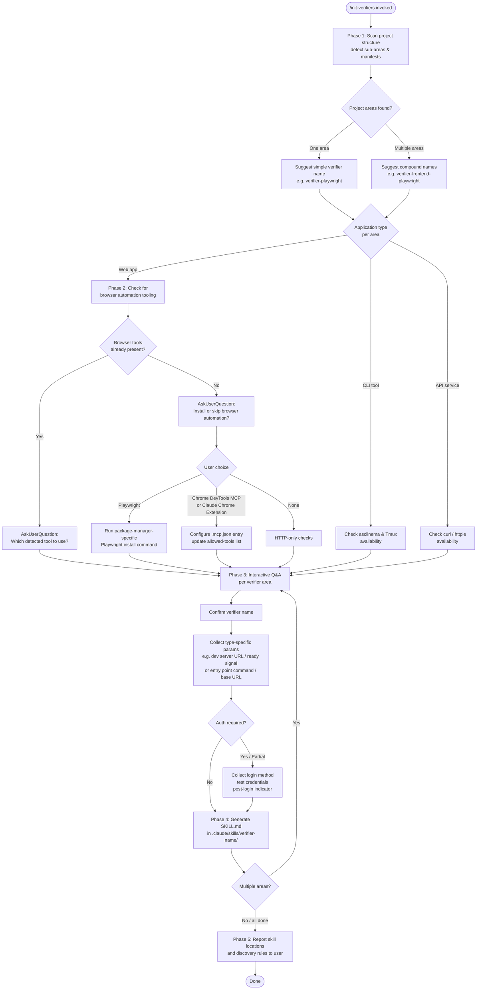

# `/init-verifiers`

> Analysis basis: CC v2.1.142 bundle.js (AST extraction + Claude interpretation)
> Minimum version: v2.1.142

---

## Overview

`/init-verifiers` is a multi-phase prompt command that guides the agent through auto-detecting project structure, configuring appropriate browser/CLI/HTTP verification tooling, gathering project-specific parameters via interactive Q&A, and writing one or more `SKILL.md` verifier skill files into `.claude/skills/`. The resulting skills are consumed by a separate Verify agent that discovers them by scanning for the substring `"verifier"` in skill folder names. The command is explicitly scoped to **functional** verification (Playwright, Tmux, HTTP) and explicitly excludes unit tests and type-checking.

---

## Registration

| Field | Value |
|---|---|
| type | `prompt` |
| name | `init-verifiers` |
| description | `Create verifier skill(s) for automated verification of code changes` |
| loc_byte | `10625802` |
| loc_byte_end | `10635933` |
| loc_line | `6071` |
| handler_method | `getPromptForCommand` |
| handler_method_start | `10626024` |
| handler_method_end | `10635932` |
| prompt_body.length | `9757` characters |
| prompt_body.trace | `inline template` |
| arbor_handler.name | `getPromptForCommand` |
| arbor_handler.kind | `Method` |
| arbor_handler.resolution_path | `direct` |
| arbor_handler.fqn | `claude-2.1.142::getPromptForCommand` |
| arbor_handler.n_hits | `1` |

Analysis basis: CC v2.1.142 bundle.js:+10625802

---

## Input Branching

The command drives a 5-phase workflow with branching at multiple points (browser tool availability, package manager selection, verifier type, authentication requirements, single vs. multiple project areas). A Mermaid flowchart is used because there are well over 3 distinct paths.



Analysis basis: CC v2.1.142 bundle.js:+10625802

---

## Behavioral Spec

### Phase 1 — Project Auto-Detection

```
function autoDetectProjectAreas(workingDirectory):
    areas = []
    topLevelEntries = scanDirectory(workingDirectory, depth=1)

    for each entry in topLevelEntries:
        manifests = findAny(entry, [
            "package.json", "Cargo.toml",
            "pyproject.toml", "go.mod"
        ])
        if manifests is not empty:
            area = {
                path: entry,
                manifests: manifests,
                type: inferApplicationType(manifests),
                packageManager: inferPackageManager(manifests),
                existingE2ETools: detectE2ETools(entry),
                devServerConfig: extractDevServerConfig(entry)
            }
            areas.append(area)

    return areas
```

The agent inspects manifest files in each subdirectory to classify each area as one of: **web app** (React, Next.js, Vue, etc.), **CLI tool**, or **API service** (Express, FastAPI, etc.).
It also checks `.mcp.json` at the project root for pre-configured browser automation MCP servers (Playwright MCP, Chrome DevTools MCP, Claude Chrome Extension MCP).

Analysis basis: CC v2.1.142 bundle.js:+10625802

---

### Phase 2 — Verification Tool Setup

```
function setupVerificationTooling(area):
    if area.type == WEB_APP:
        detected = area.existingE2ETools + readMCPConfig(".mcp.json")

        if detected is not empty:
            choice = AskUserQuestion(
                "Detected tools: " + detected + ". Which to use?"
            )
        else:
            choice = AskUserQuestion(
                "No browser automation detected. Install one?",
                options=["Playwright", "Chrome DevTools MCP",
                         "Claude Chrome Extension", "None"]
            )

        if choice == "Playwright":
            cmd = buildPlaywrightInstallCommand(area.packageManager)
            // package-manager dispatch:
            // npm  → "npm install -D @playwright/test && npx playwright install"
            // yarn → "yarn add -D @playwright/test && yarn playwright install"
            // pnpm → "pnpm add -D @playwright/test && pnpm exec playwright install"
            // bun  → "bun add -D @playwright/test && bun playwright install"
            runShellCommand(cmd)

        else if choice in ["Chrome DevTools MCP", "Claude Chrome Extension"]:
            if AskUserQuestion("Add MCP server entry to .mcp.json?") == YES:
                appendMCPConfig(".mcp.json", choice)
            if choice == "Claude Chrome Extension":
                notifyUser("Extension must be installed from Chrome Web Store")

    else if area.type == CLI_TOOL:
        verifyAvailable("tmux")
        checkOptionalTool("asciinema")   // informational only; not required

    else if area.type == API_SERVICE:
        checkAvailable(["curl", "http"])  // usually system-installed; no install needed
```

Analysis basis: CC v2.1.142 bundle.js:+10625802

---

### Phase 3 — Interactive Q&A Per Verifier

```
function collectVerifierParameters(area, totalAreas):
    // Name convention
    if totalAreas == 1:
        suggestedName = "verifier-" + inferTypeSuffix(area.type)
        // e.g. "verifier-playwright", "verifier-cli", "verifier-api"
    else:
        suggestedName = "verifier-" + area.shortId + "-" + inferTypeSuffix(area.type)
        // e.g. "verifier-frontend-playwright", "verifier-backend-api"

    name = AskUserQuestion("Verifier name?", default=suggestedName)
    // CONSTRAINT: name MUST contain the substring "verifier"
    // (Verify agent discovery depends on this)

    // Type-specific parameters
    if area.type == WEB_APP:
        devServerCmd = AskUserQuestion("Dev server command?")
        devServerURL = AskUserQuestion("Dev server URL?")
        readySignal  = AskUserQuestion("Text in output that signals server is ready?")

    else if area.type == CLI_TOOL:
        entryPoint   = AskUserQuestion("Entry point command?")
        useAsciinema = AskUserQuestion("Record with asciinema?")

    else if area.type == API_SERVICE:
        serverCmd = AskUserQuestion("API server command?")
        baseURL   = AskUserQuestion("Base URL?")

    // Authentication
    authStatus = AskUserQuestion(
        "Does your app require authentication?",
        options=["No auth needed",
                 "Yes, login required",
                 "Some pages require auth"]
    )

    authConfig = {}
    if authStatus != "No auth needed":
        loginMethod = AskUserQuestion(
            "Login method?",
            options=["Form-based", "API token/key", "OAuth/SSO", "Other"]
        )
        loginURL         = AskUserQuestion("Login URL?")
        testCredentials  = AskUserQuestion(
            "Test credentials? (suggest env vars TEST_USER / TEST_PASSWORD)"
        )
        postLoginSignal  = AskUserQuestion("How to confirm login succeeded?")
        authConfig = { loginMethod, loginURL, testCredentials, postLoginSignal }

    return VerifierSpec {
        name, area, devParams, authConfig
    }
```

Analysis basis: CC v2.1.142 bundle.js:+10626030

---

### Phase 4 — Skill File Generation

```
function generateSkillFile(spec):
    outputPath = ".claude/skills/" + spec.name + "/SKILL.md"

    frontmatter = buildFrontmatter(
        name        = spec.name,
        description = deriveDescription(spec.area.type),
        allowedTools = selectAllowedTools(spec.area.type, spec.toolChoice)
    )
    // Allowed-tool sets by verifier type:
    //   playwright : Bash(npm*), Bash(yarn*), Bash(pnpm*), Bash(bun*),
    //                mcp__playwright__*, Read, Glob, Grep
    //   cli        : Tmux, Bash(asciinema*), Read, Glob, Grep
    //   api        : Bash(curl*), Bash(http*), Bash(npm*), Bash(yarn*),
    //                Read, Glob, Grep

    body = buildSkillBody(
        projectContext   = summariseDetectionResults(spec.area),
        setupInstructions = spec.devParams,
        authSection      = spec.authConfig,   // omitted if no auth
        reportingBlock   = PASS_FAIL_format,
        cleanupBlock     = [stopServers, closeBrowsers, reportSummary],
        selfUpdateBlock  = instructionsForSelfPatch
        // Self-update: if skill instructions are STALE (not a feature bug),
        // agent should AskUserQuestion to confirm and then edit SKILL.md inline
    )

    writeFile(outputPath, frontmatter + body)
```

The skill is always written under `.claude/skills/<name>/SKILL.md` at the **project root**, never elsewhere.
Analysis basis: CC v2.1.142 bundle.js:+10626088

---

### Phase 5 — Post-Creation Summary

```
function reportCreation(createdSkills):
    for each skill in createdSkills:
        print "Created: .claude/skills/" + skill.name + "/SKILL.md"

    print "Discovery rule: folder name must contain 'verifier' (case-insensitive)"
    print "Skills are editable; re-run /init-verifiers to add more"
    print "Each verifier will self-update if its own instructions become stale"
```

Analysis basis: CC v2.1.142 bundle.js:+10626088

---

### Handler Dispatch

The command handler is the `getPromptForCommand` method resolved directly (Arbor `direct` path) on the registration object at byte range `(10625802, 10635933)`. At invocation, the handler calls the progress-tracking helper (`nY`, role: `buildTextContent`) to wrap the entire prompt body as a `"text"` content block before returning it to the agent runtime. The `"text"` literal at bundle.js:+10626065 is the content-type discriminator for that wrapping.

```
function dispatchInitVerifiers(commandInput):
    promptString = getPromptForCommand(commandInput)   // inline template, 9757 chars
    contentBlock = buildTextContent("text", promptString)
    return contentBlock
```

Analysis basis: CC v2.1.142 bundle.js:+10626030, +10626065, +10626088

---

## State & Side Effects

| Item | Detail |
|---|---|
| Telemetry | None found in depth-2 traversal <!-- TODO: not found in depth-2 traversal; needs --depth 4 --> |
| Files written | `.claude/skills/<verifier-name>/SKILL.md` (one per detected area) |
| Files modified (conditional) | `.mcp.json` — if user selects an MCP-based browser tool |
| Packages installed (conditional) | `@playwright/test` + playwright browsers — if user selects Playwright |
| Hook registration | None detected |
| appState changes | None detected |
| Sound | None detected |
| AskUserQuestion calls | Multiple interactive prompts across Phases 2–3; exact count depends on project structure and user choices |

---

## Version History

| Version | Change |
|---|---|
| v2.1.142 | Initial analysis |

---

## Common Mistakes

1. **Naming a skill without the `verifier` substring.** The Verify agent's discovery logic scans folder names for the string `"verifier"` (case-insensitive). A skill named `"ui-checker"` will be silently ignored.
2. **Creating verifiers for unit tests or type-checking.** The prompt body explicitly prohibits this; such verifiers add noise and duplicate the standard build/test workflow.
3. **Hardcoding credentials in SKILL.md.** The command instructs the agent to suggest environment variables (`TEST_USER`, `TEST_PASSWORD`). Hardcoded secrets will be committed to version control.
4. **Running `/init-verifiers` from a sub-directory.** Skills are written relative to the project root under `.claude/skills/`. Running from a nested folder may place skills where the Verify agent does not look.
5. **Skipping Phase 2 tool setup then referencing Playwright in the skill.** If Playwright is listed in `allowed-tools` but was never installed, the verifier skill will fail at runtime. Always complete Phase 2 before proceeding.
6. **Assuming a single verifier is sufficient for a monorepo.** The command is designed to generate one skill per distinct project area. A monorepo with a frontend and a backend needs at minimum `verifier-frontend-playwright` and `verifier-backend-api`.

---

## Appendix — Identifier Mapping

> For bundle debugging only. Identifiers change across versions.

| Identifier | Role |
|---|---|
| `__handler_init-verifiers` | Synthetic BFS entry point representing the `getPromptForCommand` method call; not a real bundle symbol |
| `nY` | `buildTextContent` — wraps a string value into a typed content block `{type:"text", ...}` |
| `Nq` | `coerceToString` — low-level string coercion utility called by `buildTextContent`; delegates to `String()` |

---

Note: index built via Arbor fallback; some signals (telemetry, literals) may be missing — see arbor-fallback.js.