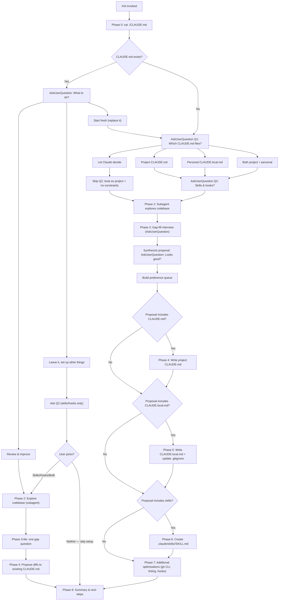

# `/init`

> Analysis basis: CC v2.1.160 bundle.js (AST extraction + Claude interpretation)
> Minimum version: v2.1.160

---

## Overview

`/init` bootstraps a project's Claude Code configuration by generating `CLAUDE.md` (and optionally `CLAUDE.local.md`), skills, and hooks through a structured multi-phase agent workflow. It first inspects the existing state of the repository, interactively gathers user preferences via `AskUserQuestion`, then writes the requested artifacts. The command is implemented as a `prompt`-type command: invoking it injects a large structured prompt (≈22 449 characters) into the agent's context, which drives all subsequent phases autonomously.

---

## Registration

| Field | Value |
|---|---|
| type | `prompt` |
| name | `init` |
| description | `Initialize new CLAUDE.md file(s) and optional skills/hooks with codebase documentation \| Initialize a new CLAUDE.md file with codebase documentation` |
| loc_byte | `11447488` |
| loc_byte_end | `11447881` |
| loc_line | `7621` |
| handler_method | `getPromptForCommand` |
| handler_method_start | `11447804` |
| handler_method_end | `11447880` |
| prompt_body.length | `22449` characters |
| prompt_body.trace | `conditional; identifier→M3f (var template, 20850 chars); identifier→f3f (var template, 1592 chars)` |
| arbor_handler.name | `getPromptForCommand` |
| arbor_handler.kind | `Method` |
| arbor_handler.fqn | `claude-2.1.160::getPromptForCommand` |
| arbor_handler.resolution_path | `direct` |
| arbor_handler.n_hits | `2` |

Analysis basis: CC v2.1.160 bundle.js:+11447488

---

## Input Branching

The command drives an 8-phase interactive workflow with multiple discrete decision branches. A Mermaid flowchart is used because there are well over three distinct input paths.



---

## Behavioral Spec

### Handler dispatch (`getPromptForCommand`)

The handler method `getPromptForCommand` is called at `bundle.js:+11447810`. It selects the correct prompt template from one of two string variables (the longer, ~20 850-character template and a shorter ~1 592-character variant) through a conditional branch. The selected template is returned as a `text`-typed prompt body (literal `"text"` at `bundle.js:+11447852`).

Analysis basis: CC v2.1.160 bundle.js:+11447804

```
function getPromptForCommand(context):
    if useExtendedTemplate(context):
        body = EXTENDED_INIT_TEMPLATE   // ~20850 chars (M3f)
    else:
        body = SHORT_INIT_TEMPLATE      // ~1592 chars (f3f)
    return { type: "text", content: body }
```

### Phase 0 — Existing-file detection

The agent checks for `./CLAUDE.md` at the project root using a shell `cat` command before issuing any user-visible output. Only the project-root file counts; subdirectory files are not read during this phase.

### Phase 1 — Interactive setup questions

The agent calls `AskUserQuestion` with one question at a time:

- **Q1** (if no existing CLAUDE.md or user chose "Start fresh"): selects scope — project, personal, both, or "Let Claude decide".
- **Q2** (if Q1 did not produce "Let Claude decide"): selects artifact types — skills + hooks, skills only, hooks only, or neither.

"Let Claude decide" suppresses Q2 and treats the scope as project-only with no skills/hooks constraint.

When CLAUDE.md already exists the three-way fork (Review / Leave / Start fresh) replaces Q1/Q2 as described in the flowchart.

Analysis basis: CC v2.1.160 bundle.js:+11447488

### Phase 2 — Codebase exploration (subagent)

A subagent reads manifest files (`package.json`, `Cargo.toml`, `pyproject.toml`, `go.mod`, `pom.xml`, etc.), `README`, `Makefile`, CI configs, existing `CLAUDE.md`, `.claude/rules/`, `AGENTS.md`, `.cursor/rules`, `.cursorrules`, `.github/copilot-instructions.md`, `.windsurfrules`, `.clinerules`, `.mcp.json`. It also runs `git worktree list` when personal configuration is requested. Items the agent cannot determine from code alone are surfaced as gap-fill questions in Phase 3.

### Phase 3 — Gap-fill interview and proposal synthesis

The agent issues one or more `AskUserQuestion` calls covering only information code cannot answer. After collecting answers, it synthesises a proposal of artifacts (files, skills, hooks, notes), prints it as plain assistant text, then asks for approval via `AskUserQuestion`. The accepted proposal populates an internal **preference queue** consumed by Phases 4–7.

Each artifact type is selected by a simple rule:

```
function classifyArtifact(evidence):
    if evidence.isDeterministic and evidence.isFast and evidence.isPerEdit:
        return HOOK
    if evidence.isOnDemand and evidence.isMultiStep:
        return SKILL
    else:
        return CLAUDE_MD_NOTE
```

### Phase 4 — Write project `CLAUDE.md`

Written at the project root. Every line is tested against: *"Would removing this cause Claude to make mistakes?"* Lines that fail the test are excluded.

On the "Review and improve" path the agent reads the existing file, computes diff proposals with one-line reasons, presents them via `AskUserQuestion`, and writes only after approval.

The file is prefixed with the canonical header (fragment: `"# CLAUDE.md\n\nThis file provides guidance to Claude Code"`).

`note`-type queue entries targeting `CLAUDE.md` (team-level) are consumed here. Personal-targeted notes are deferred to Phase 5.

### Phase 5 — Write `CLAUDE.local.md`

Written at the project root; `CLAUDE.local.md` is appended to `.gitignore` immediately after creation. Consumes personal-targeted `note` entries from the preference queue.

When Phase 2 detected sibling/external git worktrees, the actual personal content is written to `~/.claude/<project-name>-instructions.md` and `CLAUDE.local.md` becomes a one-line stub importing that path. This import is never placed in the shared `CLAUDE.md`.

### Phase 6 — Create skills

Skills are written to `.claude/skills/<skill-name>/SKILL.md` with YAML frontmatter (`name`, `description`) followed by instruction prose. Queue entries of type `skill` are consumed first; the agent may additionally suggest skills it identifies from the codebase. Existing skills are reviewed but never overwritten.

Workflows with side effects receive `disable-model-invocation: true` in their frontmatter so only the user can invoke them.

### Phase 7 — Additional optimisations

Three checks run unconditionally:

1. **GitHub CLI presence**: `which gh` (or `where gh` on Windows). If missing and the project uses GitHub (`git remote -v` shows `github.com`), the user is asked whether to install it.
2. **Lint configuration**: If no linter config file was found for the project's language(s), the user is asked whether to set one up.
3. **Hook creation**: `hook`-type queue entries are consumed here. If a formatter was found in Phase 2 and no formatting hook is in the queue, a format-on-edit hook is offered as a fallback.

For each hook the agent:
- Determines the target settings file based on Phase 1 scope: project → `.claude/settings.json`; personal → `.claude/settings.local.json`.
- Maps the user's preference to an event/matcher pair:
  - "after every edit" → `PostToolUse` / `Write|Edit`
  - "when Claude finishes" → `Stop`
  - "before running bash" → `PreToolUse` / `Bash`
  - "before committing" (literal git-commit gate) → routed to a git pre-commit hook, not a CC hooks entry.
- Invokes the `update-config` Skill with `[hooks-only]` prefix (once per `/init` run) to load the hooks schema.
- Follows the skill's "Constructing a Hook" flow: dedup → construct → pipe-test → wrap → write JSON → `jq -e` validate → live-proof → cleanup → handoff.

### Phase 8 — Summary

Recaps all written files and their key contents, then emits a prioritised to-do list of remaining recommendations (plugins, linting, test frameworks, `skill-creator` plugin, `/plugin` browser).

### Onboarding telemetry emission

After the preference-queue setup path (via `ylH` → `hH`), the `"onboarding_project_complete"` event is emitted (literal at `bundle.js:+3992553`).

Analysis basis: CC v2.1.160 bundle.js:+3992550

### Config persistence helpers

The call path `ylH` → `az` → `xY_` / `ZDH` covers config read/write operations used to persist project configuration. Key guard strings observed in this path:

- Lock acquisition warning threshold corresponds to the literal `100` (attempts) at `bundle.js:+3245676`, with warning text "Lock acquisition took longer than expected…" (`bundle.js:+3245682`).
- Auth-loss guard string: fragment `"saveConfigWithLock: re-read config is missing auth"` at `bundle.js:+3246098` — refuses to write when cached auth would be wiped.
- Backup rotation retains the most recent `5` backup files (literal `5` at `bundle.js:+3246701`); backups are stored under the `"backups"` subdirectory (`bundle.js:+3247283`). Backup filenames contain the `".backup."` infix (`bundle.js:+3246568`).
- Config lock timeout: `60000` ms (`bundle.js:+3246452`).
- File mode for new config files: octal `0600` (literal `384` decimal at `bundle.js:+3246983`).

Analysis basis: CC v2.1.160 bundle.js:+3245471

### CLAUDE.md detection helper (`aX_`)

The helper that resolves the `CLAUDE.md` path joins the current working directory with the literal `"CLAUDE.md"` string (`bundle.js:+3992041`) and checks for a `"workspace"` context (`bundle.js:+3992079`). When no project file is found, a prompt string "Run /init to create a CLAUDE.md file with instructions for Claude" is referenced (`bundle.js:+3992216`).

Analysis basis: CC v2.1.160 bundle.js:+3992011

### Experiment / feature-flag integration (`L3f` → `W6`)

The `L3f` call (from `__handler_init` at `bundle.js:+11447864`) feeds into a Growthbook experiment subsystem (`W6`). The telemetry event `"tengu_slate_harbor_experiment"` is emitted at `bundle.js:+11424449`. Feature-flag state is keyed on `"firstParty"` (`bundle.js:+3218346`) and emits a `"GrowthbookExperimentEvent"` (`bundle.js:+3218435`) with event name `"growthbook_experiment"` (`bundle.js:+3218862`).

Analysis basis: CC v2.1.160 bundle.js:+11447864

---

## State & Side Effects

| Item | Detail |
|---|---|
| Telemetry: `tengu_config_parse_error` | Fired when config JSON cannot be parsed (`bundle.js:+3248346`) |
| Telemetry: `tengu_config_lock_contention` | Fired when config lock takes longer than expected (`bundle.js:+3245771`) |
| Telemetry: `tengu_config_stale_write` | Fired when a stale write is detected during config save (`bundle.js:+3245907`) |
| Telemetry: `tengu_config_auth_loss_prevented` | Fired when a write is refused to prevent wiping cached auth (`bundle.js:+3246250`) |
| Telemetry: `tengu_feature_sad` | Feature-flag evaluation failure path (`bundle.js:+966258`) |
| Telemetry: `tengu_feature_ok` | Feature-flag evaluation success path (`bundle.js:+966123`) |
| Telemetry: `tengu_slate_harbor_experiment` | Growthbook experiment event for `/init` (`bundle.js:+11424449`) |
| File writes | `CLAUDE.md` (project root), optionally `CLAUDE.local.md`, `.claude/skills/*/SKILL.md`, `.claude/settings.json` or `.claude/settings.local.json` |
| `.gitignore` mutation | `CLAUDE.local.md` appended when Phase 5 runs |
| Config backup | Up to 5 rotating backups written under the `backups/` directory with `.backup.` infix |
| onboarding event | `"onboarding_project_complete"` literal emitted after queue setup (`bundle.js:+3992553`) |
| Subagent launch | Phase 2 spawns a subagent for codebase exploration |
| Skill tool invocation | Phase 7 invokes `update-config` skill (once per run) with `[hooks-only]` prefix |
| Sound | <!-- TODO: not found in depth-2 traversal; needs --depth 4 --> |
| appState changes | <!-- TODO: not found in depth-2 traversal; needs --depth 4 --> |

---

## Version History

| Version | Change |
|---|---|
| v2.1.160 | Initial analysis |

---

## Common Mistakes

1. **Running `/init` in a subdirectory**: The command checks `./CLAUDE.md` relative to the current working directory. If invoked from a subdirectory, the project-root file will not be found and a duplicate file may be created in the wrong location.
2. **Choosing "Let Claude decide" then expecting hooks or skills**: "Let Claude decide" skips Q2 entirely and places no constraint on artifact types, but the final proposal still requires explicit approval — users sometimes expect artifacts to be written without an approval step.
3. **Expecting `/init` to overwrite existing skills**: Phase 6 explicitly reviews `.claude/skills/` and only proposes new files; existing `SKILL.md` files are never silently overwritten.
4. **Placing personal content in `CLAUDE.md`**: The command routes personal notes to `CLAUDE.local.md` (or `~/.claude/<project-name>-instructions.md` for sibling worktrees). Manually adding personal references to the shared `CLAUDE.md` breaks the privacy model and may expose personal details to collaborators.
5. **Interpreting "before committing" as a CC hook**: Phase 7 explicitly routes git-commit gates to a git pre-commit hook (`.git/hooks/pre-commit`, husky, etc.) because CC hook matchers cannot filter Bash by command content. Expecting a `PostToolUse` hook to intercept `git commit` will not work.
6. **Re-running `/init` expecting a clean slate without choosing "Start fresh"**: If `CLAUDE.md` already exists and the user selects "Review and improve" or "Leave it", the existing file is preserved. Only "Start fresh" triggers a full replacement flow.

---

## Appendix — Identifier Mapping

> For bundle debugging only. Identifiers change across versions.

| Identifier | Role |
|---|---|
| `__handler_init` | Synthetic BFS entry point for the `/init` command handler |
| `ylH` | Top-level init orchestrator; dispatches to config I/O and project-config helpers |
| `gO` | File-watcher / config-load coordinator |
| `R6` | Config file reader and watcher setup |
| `d6` | Logging / debug utility |
| `hY_` | Config path resolver helper |
| `ZDH` | Config read helper (reads UTF-8, handles ENOENT/EEXIST, writes backups) |
| `ojL` | File-watch registration helper (uses `DA8.watchFile` / `DA8.unwatchFile`) |
| `l89` | CLAUDE.md existence probe helper |
| `aX_` | CLAUDE.md path resolver (joins cwd + `"CLAUDE.md"`) |
| `S6` | Workspace / project-root detector |
| `jg6` | Path join utility wrapper |
| `az` | Project-config save orchestrator |
| `xY_` | Config save with lock (handles backup rotation, auth-loss guard, 60 s timeout) |
| `_` | General string / value utility |
| `L` | Async operation tracker (add/delete/finally) |
| `qYq` | Config object merge helper (uses `Object.assign`) |
| `N` | Log-level / log-format dispatcher |
| `d` | Core logger / output emitter |
| `G8` | Config serialiser (JSON write) |
| `fY6` | Auth-field presence checker |
| `A` | String lowercasing utility |
| `SH` | JSON.stringify wrapper |
| `uY_` | Backup path builder (joins `backups/` directory) |
| `V` | String prefix checker (`startsWith`) |
| `X` | MCP / SDK connection manager |
| `Z` | Array/string slicer |
| `If6` | Atomic file writer (temp-file + rename, fchmod, fsync, symlink resolution) |
| `f` | File handle / stream manager |
| `H` | Bootstrap fetch helper (fetches JSON with `Content-Type`/`User-Agent` headers) |
| `o$` | Cache accessor for bootstrap data |
| `Ce` | Feature-flag existence checker (`F64.has`) |
| `wj` | String replacement utility |
| `gq` | Growthbook experiment runner |
| `t6` | Feature-flag evaluator (calls core logger `d`) |
| `SdH` | Stale-write detection helper |
| `RdH` | Timestamp helper (`Date.now`) |
| `bY_` | Current-project config writer (delegates to `If6`) |
| `hH` | Onboarding-complete event emitter |
| `L3f` | Experiment / feature-flag dispatch for `/init` |
| `FH` | String coercion utility |
| `W6` | Growthbook feature-flag lookup and experiment assignment |
| `HY6` | Experiment variant resolver |
| `_Y6` | Experiment fallback handler |
| `px` | Feature-flag value fetcher |
| `mx` | Growthbook rule matcher |
| `HA8` | Experiment dedup guard (uses `jY_` Set and `WDH` Map) |
| `wY_` | Experiment assignment writer (emits `GrowthbookExperimentEvent`, calls `Ur.emit`) |
| `WY_` | Experiment result broadcaster |

---

Note: index built via Arbor fallback; some signals (telemetry, literals) may be missing — see arbor-fallback.js.