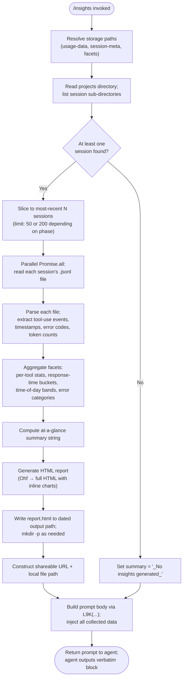

# `/insights`

> Analysis basis: CC v2.1.160 bundle.js (AST extraction + Claude interpretation)
> Minimum version: v2.1.160

---

## Overview

The `/insights` command analyzes all Claude Code sessions stored on disk, computes multi-dimensional usage statistics ("facets"), assembles them into a shareable HTML report file, and then presents a pre-composed summary message to the user via a prompt injection. The command is fully automated: the user runs it with no arguments and receives a ready-made report URL and local file path along with an at-a-glance summary compiled entirely by the handler before Claude's response turn begins.

---

## Registration

| Field | Value |
|---|---|
| type | `prompt` |
| name | `insights` |
| description | `Generate a report analyzing your Claude Code sessions` |
| loc_byte | `12979320` |
| loc_byte_end | `12980624` |
| loc_line | `10430` |
| handler_method | `getPromptForCommand` |
| handler_method_start | `12979494` |
| handler_method_end | `12980623` |
| prompt_body.length | `513` characters |
| prompt_body.trace | `call→L9K(...) (1 literals)` |
| arbor_handler.name | `getPromptForCommand` |
| arbor_handler.fqn | `claude-2.1.160::getPromptForCommand` |
| arbor_handler.kind | `Method` |
| arbor_handler.resolution_path | `direct` |
| arbor_handler.n_hits | `1` |

Analysis basis: CC v2.1.160 bundle.js:+12979320

---

## Input Branching

The command takes no user-supplied arguments. All branching is internal to the data-collection and report-generation pipeline. The handler follows a linear setup phase followed by parallel session processing, then conditional HTML generation, and finally prompt construction.



Analysis basis: CC v2.1.160 bundle.js:+12979500 (handler entry), +12966363 (session listing), +12966459 (parallel read), +12968648 (HTML write)

---

## Behavioral Spec

### 1. Storage Path Resolution

```
function resolveStoragePaths(baseDir):
    usageDataDir  = path.join(baseDir, "usage-data")
    sessionMetaDir = path.join(baseDir, "session-meta")
    facetsDir      = path.join(baseDir, "facets")
    return { usageDataDir, sessionMetaDir, facetsDir }
```

The sub-directory names are fixed string constants: `"usage-data"` (bundle.js:+12905315), `"session-meta"` (bundle.js:+12905411), and `"facets"` (bundle.js:+12905365). Path joining is performed by the `path` module alias (`tF`/`AS8`/`xh6`).

Analysis basis: CC v2.1.160 bundle.js:+12905302–12905411

---

### 2. Session Discovery (`listSessionDirectories`)

```
async function listSessionDirectories(usageDataDir):
    entries = await fs.readdir(usageDataDir)
    dirs    = entries.filter(entry => entry.stat().isDirectory())
    sorted  = dirs.sort()                     // lexicographic → chronological
    return sorted
```

- Uses `fs.readdir` then `isDirectory()` filter.
- Entries below index `0` (bundle.js:+12966019) are skipped.
- An intermediate `setImmediate` (bundle.js:+12966270) yields control to the event loop between heavy listing operations; the sort call follows (bundle.js:+12966294).
- Early-limit constants: `10` and `9` appear at bundle.js:+12966240/+12966245 (likely minimum session thresholds), while `50` and `200` at bundle.js:+12966382/+12966387 bound the slice sizes for "recent sessions" and "all sessions" passes respectively.

Analysis basis: CC v2.1.160 bundle.js:+12965971–12966294

---

### 3. Per-Session JSONL Ingestion (`readSessionFacets`)

```
async function readSessionFacets(sessionDir):
    jsonlPath = path.join(sessionDir, <facets-file>)   // *.jsonl filter (bundle.js:+13050061)
    raw       = await fs.readFile(jsonlPath, "utf-8")  // bundle.js:+12911446
    parsed    = JSON.parse(raw)                        // via m6
    return parsed
```

- Files are filtered by the `.jsonl` extension constant (bundle.js:+13050061).
- File-stat metadata (size, mtime) is also collected via `fs.stat` (bundle.js:+13050264) to support staleness checks and the 30-minute (1 800 000 ms, bundle.js:+12913788) session-window heuristic.
- A `4096`-character limit (bundle.js:+12913264) is applied to certain text fields extracted from sessions.
- Sessions older than 3 600 seconds (bundle.js:+12906812 — `3600` constant) are treated as a separate aging bucket in the time-of-day facet.

Analysis basis: CC v2.1.160 bundle.js:+12911379–12911467, +13050061–13050264

---

### 4. Facet Computation (`computeAllFacets`)

This is the core analytics function (primary call-chain: `K9K` → `q9K` → `A9K` → `qhf` → `Ohf`).

```
function computeAllFacets(sessions):
    toolStats     = {}   // per-tool invocation counts, error rates
    responseTime  = {}   // bucketed: "2-10s","10-30s","30s-1m","1-2m","2-5m","5-15m",">15m"
    timeOfDay     = {}   // bands: Morning(6-12), Afternoon(12-18), Evening(18-24), Night(0-6)
    errorMap      = {}   // categorized tool error strings
    tokenCounts   = {}   // per-session token usage

    for session in sessions:
        for event in session.events:
            if event.type == "tool_use":              // bundle.js:+12905894
                toolName = event.name                 // bundle.js:+12905906
                classify tool: mcp__, WebSearch,
                               WebFetch, Edit, Write  // bundle.js:+12905987–12906151
                increment toolStats[toolName]
            if event has timestamp:
                hour = new Date(ts).getHours()        // bundle.js:+12906698
                assign to timeOfDay band
            if event has responseTimeMs:
                assign to responseTime bucket
            if event has errorText:
                classify error:
                  "Command Failed", "User Rejected",
                  "Edit Failed", "File Changed",
                  "File Too Large", "File Not Found"  // bundle.js:+12907026–12907422
                increment errorMap[category]

    atAGlance = buildAtAGlanceSummary(toolStats, responseTime, tokenCounts)
    // key "at_a_glance" — bundle.js:+12919560
    return { toolStats, responseTime, timeOfDay, errorMap, tokenCounts, atAGlance }
```

- Response-time bucket boundaries include 120 s (bundle.js:+12922753) and 900 s (bundle.js:+12922835).
- Numeric rounding uses `Math.round` throughout (bundle.js:+12917332, +12908139, +12918479).
- When no sessions exist the at-a-glance value defaults to the literal `"None captured"` (bundle.js:+12918894).

Analysis basis: CC v2.1.160 bundle.js:+12915151–12917418, +12922533–12923534

---

### 5. HTML Report Generation (`generateHTMLReport`)

```
function generateHTMLReport(facets):
    html = buildHTMLSkeleton()     // inline CSS, chart colors
    // Chart palette (bundle.js):
    //   primary blue  #2563eb (+12960198)
    //   cyan          #0891b2 (+12960336)
    //   green         #10b981 (+12960508)
    //   purple        #8b5cf6 (+12960651)
    //   red (errors)  #dc2626 (+12963914)
    //   green (ok)    #16a34a (+12964163)
    //   yellow        #eab308 (+12964656)

    for section in ["toolStats", "responseTime", "timeOfDay", "errors"]:
        if section is empty:
            html += emptyPlaceholder   // e.g. "<p class=\"empty\">No data</p>" (+12922024)
        else:
            html += renderBarChart(section)

    html += renderSuggestionsBlock()   // "Add to CLAUDE.md" CTA (+12927877)
    return escapeAndWrap(html)         // HTML-entity escaping via xf/w7
```

- HTML entity escaping replaces `&`, `<`, `>`, `"`, `'` with `&amp;`, `&lt;`, `&gt;`, `&quot;`, `&apos;` (bundle.js:+4750191–4750314).
- Bold markdown is converted to `<strong>$1</strong>` (bundle.js:+12924239); bullet `• ` and `<br>` tags are inserted for list items (bundle.js:+12924282, +12924312).
- The report maximum HTML body size is capped at `8192` characters for the inline section (bundle.js:+12921702).
- The output filename is the fixed string `"report.html"` (bundle.js:+12968620).

Analysis basis: CC v2.1.160 bundle.js:+12924109–12965254, +12960176–12963840

---

### 6. Report File Writing (`writeReport`)

```
async function writeReport(reportDir, reportHTML):
    now       = new Date()
    datePart  = String(now.getFullYear()) + pad(now.getMonth()+1)
                + pad(now.getDate())
    timePart  = pad(now.getHours()) + pad(now.getMinutes()) + pad(now.getSeconds())
    outputDir = path.join(reportDir, datePart + "-" + timePart)
    await fs.mkdir(outputDir, { recursive: true })
    filePath  = path.join(outputDir, "report.html")
    await fs.writeFile(filePath, reportHTML)
    return filePath
```

- Date-stamp components extracted via `getFullYear`, `getMonth`, `getDate`, `getHours`, `getMinutes`, `getSeconds` (bundle.js:+12968452–12968550).
- `fs.mkdir` with recursive flag (bundle.js:+12968361); `fs.writeFile` at bundle.js:+12968648.

Analysis basis: CC v2.1.160 bundle.js:+12968421–12968648

---

### 7. Prompt Construction (`getPromptForCommand` / `L9K`)

```
function getPromptForCommand(context):
    facets   = computeAllFacets(...)   // already run
    filePath = writeReport(...)        // already written
    reportURL = deriveURL(filePath)    // shareable link

    promptText = L9K(                  // bundle.js:+12980526
        insightsData,
        reportURL,
        filePath,
        facetsDir,
        atAGlanceSummary
    )
    // Prompt instructs the agent to output the <message>…</message>
    // block verbatim as its entire response.
    // The block contains the report URL and a follow-up offer.

    if atAGlanceSummary is empty:
        summaryLine = "_No insights generated_"  // bundle.js:+12980391
    else:
        summaryLine = atAGlanceSummary

    return { role: "user", content: promptText }
```

- The at-a-glance summary is included in the prompt purely for Claude's context; the spec states it is not yet visible to the user ("for your context only").
- The `" · "` separator literal (bundle.js:+12979952) is used in the at-a-glance display string.
- `Math.round` (bundle.js:+12979881) is applied to numeric values embedded in the at-a-glance string before prompt serialization via `SH` (JSON.stringify, bundle.js:+12980544).

Analysis basis: CC v2.1.160 bundle.js:+12979494–12980623

---

## State & Side Effects

| Item | Detail |
|---|---|
| Filesystem reads | Reads all `*.jsonl` files under the `usage-data` directory tree (bundle.js:+13050061) |
| Filesystem reads | Also reads `session-meta` files and `facets` directory contents (bundle.js:+12905411, +12905365) |
| Filesystem writes | Creates a dated subdirectory under the insights output root and writes `report.html` (bundle.js:+12968361, +12968648) |
| Telemetry | No `tengu_insights_*` event was found in the depth-2 traversal; daemon-level events listed below are collateral from shared infrastructure |
| Collateral telemetry (infrastructure) | `tengu_daemon_config_reload`, `tengu_daemon_idle_exit`, `tengu_daemon_control`, `tengu_bg_dispatch_sigkill_escalate`, `tengu_bg_dispatch_low_mem`, `tengu_bg_spare_enable`, `tengu_bg_spare_claim`, `tengu_bg_spare_claim_fail`, `tengu_transcript_phantom_parent`, `tengu_relink_walk_broken`, `tengu_transcript_parent_cycle`, `tengu_chain_parent_cycle`, `tengu_chain_timestamp_fallback`, `tengu_chain_parallel_tr_recovered`, `tengu_daemon_yield`, `tengu_skill_file_changed`, `tengu_voice_*` (various) |
| Hook registration | None specific to `/insights` found in traversal |
| appState changes | None observed; command is read-heavy with one file write side-effect |
| Sound | None |
| Network | None (fully local computation) |
| `record_facets` mode | The literal `"record_facets"` (bundle.js:+12966820) and `"warmup_minimal"` (bundle.js:+12968178) suggest the facet-collection pipeline can operate in a minimal warm-up mode that skips full report generation |

---

## Version History

| Version | Change |
|---|---|
| v2.1.160 | Initial analysis |

---

## Common Mistakes

1. **Running `/insights` in a workspace with no prior sessions** — The handler will produce the `"_No insights generated_"` fallback message (bundle.js:+12980391) and write an empty `report.html`. There is no error, but the report contains no meaningful data.

2. **Expecting streaming output** — The command is a `prompt`-type command; the agent's response is the verbatim `<message>` block. The user will not see any incremental progress lines during data collection.

3. **Assuming the report URL is a remote URL** — The report is written to a local dated directory alongside the `facets` data directory. The "shareable" URL in the message refers to the local `file://` path or a localhost server URL; no data is uploaded.

4. **Modifying `.jsonl` files while `/insights` runs** — The command reads all session JSONL files during `Promise.all` parallel I/O (bundle.js:+12966459, +13050196). Concurrent writes to those files from another Claude Code session may produce incomplete facets.

5. **Confusing the `facets` directory with the report output** — The `facets` sub-directory (constant `"facets"`, bundle.js:+12905365) is the data-source input; `report.html` is written to a separate dated output path under the insights root.

6. **Expecting the at-a-glance summary in the terminal output** — The summary is injected into the prompt solely for Claude's context. The agent's reply is the fixed `<message>` block which does not include the raw at-a-glance data.

---

## Appendix — Identifier Mapping

> For bundle debugging only. Identifiers change across versions.

| Identifier | Role |
|---|---|
| `__handler_insights` | Synthetic BFS entry point for the `/insights` command handler (callGraph bookkeeping) |
| `K9K` | Main insights orchestrator — coordinates session listing, parallel read, facet computation, HTML generation, and file write |
| `Dhf` | Session directory lister — calls `fs.readdir`, filters for directories, sorts results |
| `nc` | Path joiner / `"projects"` sub-directory resolver |
| `jq6` | Per-session JSONL file reader — lists `.jsonl` files, stats them, collects file metadata |
| `va` | JSONL filename validator (regex test against file extension pattern) |
| `eyf` | Single-session facets file reader (reads UTF-8 content and hands off to JSON parser) |
| `E1A` | Session metadata path resolver (`session-meta` directory joiner) |
| `xh6` | Base storage path resolver (`usage-data` / `facets` sub-directory joiner) |
| `_9K` | Post-parse session data sanitizer/normalizer |
| `m6` | JSON parse wrapper (thin wrapper around `JSON.parse`) |
| `qS8` | Facet aggregation entry point — iterates sessions and delegates to sub-aggregators |
| `mAH` | Full application-state initializer reached during facet map construction |
| `hhf` | Facet map setup helper (initializes per-key Map entries) |
| `oC` | Session-event classifier helper |
| `kwA` | Recursive data-structure walker used during facet aggregation |
| `pj` | Project-key extractor |
| `a9K` | Per-key accumulator (get/set on aggregation maps) |
| `mfH` | Message-chain builder — reconstructs session conversation chains from JSONL |
| `dhf` | Timestamp NaN guard and chain-values iterator |
| `chf` | Conversation-chain classifier and deduplicator |
| `ghf` | Session-chain sorter and deduplication pass |
| `YH6` | Tool-use event mapper |
| `d1A` | Compact-summary text extractor (strips `isCompactSummary` markers) |
| `Dy6` | Message-content text normalizer |
| `l1A` | Attachment-type filter (image/document exclusion) |
| `lhf` | Array-or-string trimmer helper |
| `nhf` | Content-block type checker |
| `wS8` | Per-session stat writer (get/set on session stat maps) |
| `jS8` | Session values iterator (`Array.from(H.values())`) |
| `lyf` | NaN guard for numeric facets (wraps `Number.isNaN`) |
| `Z1A` | Session-record normalizer — flattens timestamps, applies `Math.round` to durations |
| `H9K` | Per-event classifier — dispatches on tool name, error text, git ops (`git commit`, `git push`) |
| `bh6` | Error-category sub-classifier |
| `cyf` | File-extension extractor (wraps `path.extname`) |
| `kjH` | Diff-computation helper (calls `U29.diff`) |
| `LL` | String indexOf utility wrapper |
| `E$` | Numeric-duration formatter |
| `G1A` | Session group-by helper |
| `Hhf` | Facets-to-disk writer — mkdir + writeFile for facets JSON (bundle.js:+12911963) |
| `SH` | JSON stringify wrapper |
| `syf` | Per-session facets cache reader/writer (read existing facets, delete stale) |
| `AS8` | Facets directory path resolver |
| `f9K` | Facets file deletion helper (unlink stale facets files) |
| `_hf` | HTML report builder coordinator — calls `ayf` (chart data prep) then `VXH` (template fill) |
| `ayf` | Chart-data aggregator — slices sessions, calls `iyf` per chunk, then assembles with `Promise.all` |
| `iyf` | Per-chunk session data aggregator |
| `VXH` | HTML template filler — inserts chart blobs, calls `AbH` for section blocks |
| `bK` | HTML base template string holder |
| `JZ8` | SHA-1 hash + UUID report-ID generator (uses `av6.createHash("sha1")`, writes HTML to `M5H`) |
| `I8` | Report ID and path helper |
| `AbH` | Per-section HTML block builder |
| `wE` | Report post-processor / wrapper |
| `eqK` | Insights report-type resolver (selects `"firstParty"` vs other template types) |
| `tT` | Template-type constants holder |
| `IK` | Tool-use event filter |
| `d_` | Error message extractor (converts Error objects to strings) |
| `tyf` | Session summary JSON writer (mkdir + writeFile for session-meta) |
| `Yhf` | Object.keys enumerator for facet report keys |
| `q9K` | Per-facet statistics computer — handles percentiles, `Math.floor`, `K.reduce` |
| `wq6` | Object.entries enumerator for facet stats |
| `oq` | Substring slice helper (indexOf + slice) |
| `A9K` | Sorted-numeric-array builder — pushes, sorts, manages Sets for dedup |
| `qhf` | Final report data assembler — JSON stringify facets, calls `tqK` for HTML generation |
| `tqK` | Per-session HTML snippet generator (calls `VXH`, `bK`, `IK`) |
| `Fyf` | Template-type resolver for per-session snippets |
| `Ohf` | Full HTML document generator — handles all section rendering, chart colors, time bands |
| `xf` | HTML entity escape function (calls `w7`) |
| `w7` | String `replaceAll` entity encoder (`&`, `<`, `>`, `"`, `'`) |
| `_S8` | Secondary HTML escape helper |
| `$hf` | JSON-stringify helper inside HTML generation |
| `jMH` | Bar-chart HTML renderer (Object.entries → max → K.map → replaceAll) |
| `fhf` | Multi-series chart data extractor (Object.values, Object.entries, Math.max) |
| `Mhf` | Stacked-chart section renderer |
| `L9K` | Prompt-body template function — injects all insights data into the 513-char prompt skeleton |
| `qC6` | Plugin path resolver (shared infrastructure, not insights-specific) |
| `KC6` | Plugin synced-directory path builder |
| `ekK` | Daemon heartbeat emitter |
| `jWH` | Daemon supervisor write handler |
| `Z_K` | Daemon column-width calculator |
| `FH` | String coercion wrapper (`String(...)`) |
| `_Sf` | Binary JSONL reader (low-level Buffer operations for large files) |
| `ASf` | Synchronous JSONL header reader |
| `HSf` | Streaming JSONL parser (Buffer concat/indexOf/compare) |
| `ZEH` | Compression/encoding helper |
| `R` | Rate-limit event enqueuer |
| `H9` | G8-based hash helper |
| `yH` | Async logger / error reporter |
| `b9K` | Session relink walker — repairs broken parent-chain references |
| `SH` | JSON serializer alias (also listed above) |
| `E` | Keyboard-event stop-propagation handler |
| `D` | Daemon write/stop/start/config-update coordinator |
| `g` | Daemon idle-exit timer (setTimeout/clearTimeout loop) |
| `p` | Write-queue flush handler |
| `$` | Write-stream wrapper (`aHK`) |
| `S` | Daemon foreground-yield handler |
| `C` | Daemon channel writer with yH logging |
| `y` | Chokidar file-watcher wrapper |
| `W` | Daemon background-worker coordinator |
| `Q` | Audio read buffer |
| `I` | Away-summary generator |
| `h` | Away-summary scheduler |
| `t` | Voice-recording session manager |
| `a` | Voice-focus silence timer |
| `c` | Permission allow/deny handler |
| `i` | Permission chain resolver |
| `e` | Notification emitter |
| `z` | Daemon control (stop/start/abort) |
| `Y` | Process exit coordinator |
| `w` | Background-process lifecycle manager |
| `j` | Background-process SIGTERM sender |
| `O` | Background-session status tracker |
| `J` | Subprocess stdio stream |
| `P` | Subprocess stdout line-buffer reader |
| `X` | MCP SDK connection handler |
| `T` | MCP transport layer |
| `M` | Plugin file-removal coordinator |
| `N` | HTTP fetch helper (bootstrap) |
| `H` | HTTP response body parser |
| `K` | Async task-runner with padding display |
| `L` | Task queue item |
| `f` | File descriptor / stream wrapper |
| `A` | String lowercaser wrapper |
| `F` | Task collection |
| `d` | Shared debug/log helper |
| `V` | Map get/set helper |
| `Z` | Daemon lifecycle controller |