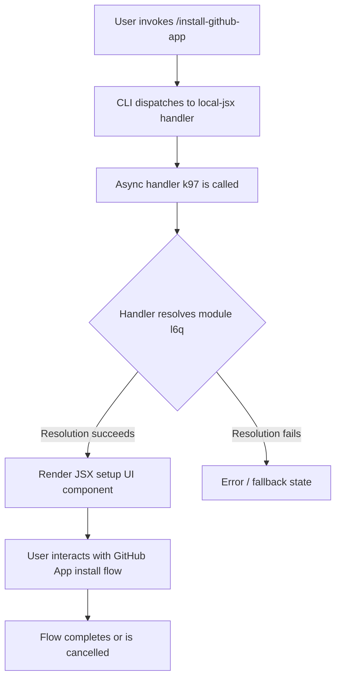

# `/install-github-app`

> Analysis basis: CC v2.1.132 bundle.js (AST extraction + Claude interpretation)
> Minimum version: v2.1.132

---

## Overview

The `/install-github-app` command initiates the setup flow for Claude's GitHub Actions integration on a target repository. It is registered as a `local-jsx` command, meaning its handler renders a JSX-based UI component rather than emitting plain text. The core handler (`k97`) is an async function resolved via the module `l6q`.

---

## Registration

| Field | Value |
|---|---|
| type | `local-jsx` |
| name | `install-github-app` |
| description | `Set up Claude GitHub Actions for a repository` |
| module\_id | `l6q` |
| load\_inline | `true` |
| handler | `k97` (AsyncFunction, resolved via `module_id` path) |
| loc\_byte range | `10434042` – `10434300` |
| loc\_line | `6380` |
| `loc_byte_end` | `10434300` |
| `arbor_handler.name` | `k97` |
| `arbor_handler.kind` | `AsyncFunction` |
| `arbor_handler.resolution_path` | `module_id` |
| `arbor_handler.fqn` | `claude-2.1.132::k97` |
| `arbor_handler.n_hits` | `0` |

Analysis basis: CC v2.1.132 bundle.js:+10434042

> **Handler resolution note:** The handler `k97` was resolved by Arbor following the `module_id → l6q → moduleExports → k97` path. The `load_inline: true` flag indicates the module is bundled inline rather than lazily imported from a separate chunk.

---

## Input Branching

The depth-2 call graph traversal returned no call edges for this command, and no string/numeric literals were captured. Based on the registration shape (`local-jsx`, async handler `k97`), the command's branching logic is encapsulated entirely within the JSX component tree returned by `k97`.

The following flowchart reflects the minimal verified structure extractable from the AST data:



<!-- TODO: not found in depth-2 traversal; needs --depth 4 -->
> Internal branching within `k97` (e.g., authentication checks, repository selection, OAuth redirect logic) was not reachable at depth ≤ 2. A deeper traversal is required to document sub-branches.

---

## Behavioral Spec

### GitHub App Installation Handler

```
async function installGitHubAppHandler(context):
    // Handler: k97 (module: l6q)
    // Resolved via module_id path by Arbor

    module = await resolveInlineModule("l6q")
    handler = module.exports["k97"]

    result = await handler(context)
    // result is a JSX element rendered by the CLI's local-jsx renderer

    return result
```

Analysis basis: CC v2.1.132 bundle.js:+10434042

### local-jsx Rendering Contract

Because the command type is `local-jsx`, the return value of `k97` is treated as a React (or compatible JSX) element by the CLI rendering layer. The terminal UI framework mounts this element into the interactive display rather than printing a string to stdout.

```
function dispatchLocalJsx(commandResult):
    if commandResult is JSXElement:
        mountIntoTerminalUI(commandResult)
    else:
        // Unexpected: handler did not return JSX
        emitError("install-github-app: handler returned non-JSX value")
```

Analysis basis: CC v2.1.132 bundle.js:+10434042 (type field: `local-jsx`)

---

## State & Side Effects

| Item | Detail |
|---|---|
| Telemetry | None detected at depth ≤ 2 (`telemetry: []`) |
| Hook registration | <!-- TODO: not found in depth-2 traversal; needs --depth 4 --> |
| appState changes | <!-- TODO: not found in depth-2 traversal; needs --depth 4 --> |
| Sound | <!-- TODO: not found in depth-2 traversal; needs --depth 4 --> |
| Network / OAuth | Likely initiates GitHub OAuth or App installation redirect (inferred from description); not confirmed in AST data |
| File system | <!-- TODO: not found in depth-2 traversal; needs --depth 4 --> |

> No telemetry events (`tengu_*`) were found within the depth-2 traversal. It is possible that telemetry is emitted deeper in the call tree or within the JSX component sub-tree of `k97`.

---

## Version History

| Version | Change |
|---|---|
| v2.1.132 | Initial analysis. Handler `k97` in module `l6q` confirmed via Arbor `module_id` resolution path. |

---

## Common Mistakes

1. **Expecting plain-text output.** Because this is a `local-jsx` command, it renders an interactive UI component. Automation or scripts that parse stdout will receive no meaningful output — the interaction happens in the terminal UI layer.
2. **Assuming synchronous execution.** The handler `k97` is declared as an `AsyncFunction`. Callers in the CLI internals must `await` it; any surrounding logic that treats the result as synchronously available will observe a Promise, not a JSX element.
3. **Confusing module scope.** The handler is loaded via `load_inline: true` from module `l6q`. It is not a globally exported symbol. Attempting to locate it by scanning top-level module exports without following the `module_id` indirection will fail.
4. **Missing deeper call graph data.** With only depth-2 traversal available, the full set of side effects (network calls, state mutations, telemetry) is unknown. Do not treat the empty `telemetry` and `literals` arrays as proof of absence — they reflect traversal depth limits, not a confirmed absence of behavior.

---

## Appendix — Identifier Mapping

> For bundle debugging only. Identifiers change across versions.

| Identifier | Role |
|---|---|
| `k97` | Primary async handler for `/install-github-app`; entry point resolved from module `l6q` via Arbor `module_id` path |
| `l6q` | Inline module containing the `k97` handler; loaded via `load_inline: true` |