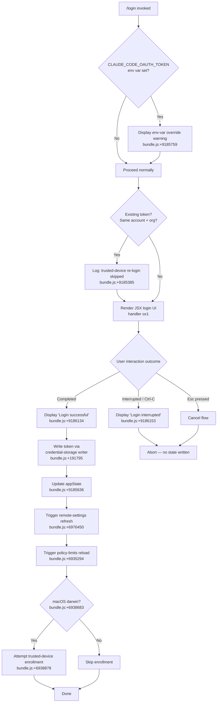

# `/login`

> Analysis basis: CC v2.1.160 bundle.js (AST extraction + Claude interpretation)
> Minimum version: v2.1.160

---

## Overview

The `/login` command initiates an interactive OAuth-based authentication flow that allows the user to sign in with an Anthropic account or switch between accounts. It renders a local JSX UI component that guides the user through credential acquisition, writes the resulting token to persistent storage, and updates the global application state to reflect the new authentication context. On completion, it triggers downstream side effects including remote-settings refresh, policy-limits reload, and trusted-device enrollment.

---

## Registration

| Field | Value |
|---|---|
| type | `local-jsx` |
| name | `login` |
| description | `Switch Anthropic accounts \| Sign in with your Anthropic account` |
| module_id | `BM1` |
| load_inline | `true` |
| loc_byte | `11459407` |
| loc_byte_end | `11459627` |
| loc_line | `7863` |
| arbor_handler.name | `ox1` |
| arbor_handler.fqn | `claude-2.1.160::ox1` |
| arbor_handler.kind | `Function` |
| arbor_handler.resolution_path | `direct` |
| arbor_handler.n_hits | `2` |

Analysis basis: CC v2.1.160 bundle.js:+11459407

---

## Input Branching

The command exhibits more than three distinct execution branches depending on environment-variable state, existing token state, and user interaction outcome. A Mermaid flowchart is used below.



---

## Behavioral Spec

### Top-Level Command Handler (`ox1`)

The Arbor-resolved handler `ox1` (resolved via `direct` path, n_hits = 2) is the root entry point rendered as a local JSX component.

```
function loginCommandHandler(appContext):
    # Check for environment-variable token conflict
    if env.CLAUDE_CODE_OAUTH_TOKEN is set:
        display warning message about env-var override
        # bundle.js:+9185759

    # Check for trusted-device re-login shortcut
    existingToken = appContext.getAppState().oauthToken
    if existingToken present AND same account AND same org:
        log "[trusted-device] Same account+org re-login, skipping re-enrollment"
        # bundle.js:+9185385

    # Render interactive login UI (JSX)
    renderLoginUI(appContext)
```

Analysis basis: CC v2.1.160 bundle.js:+9185383, +9185385, +9185540

---

### JSX Login UI Component (`YXH` / `_B7`)

The outer React component (`YXH`) wraps an inner component (`_B7`) and manages local UI state using `useState` (hook slot `21`, bundle.js:+9186205) and React memo caching (sentinel `"react.memo_cache_sentinel"`, bundle.js:+9186269).

```
component LoginUI(props):
    [loginState, setLoginState] = useState(initial)  # slot 21

    # Register keyboard handlers
    registerHandler("confirm:no", ...)    # bundle.js:+9186536
    registerHandler("Esc", cancelAction)  # bundle.js:+9186757

    # Render flow selector and action buttons
    render:
        if loginState == IDLE:
            show "Login" title       # bundle.js:+9187241
            show "continue" / "cancel" options  # bundle.js:+9186777, +9186788
        elif loginState == SUCCESS:
            show "Login successful"  # bundle.js:+9186134
        elif loginState == INTERRUPTED:
            show "Login interrupted" # bundle.js:+9186153
        elif loginState == CONFIRM_EXIT:
            show "Press [key] again to exit"  # bundle.js:+9186651, +9186670
```

Analysis basis: CC v2.1.160 bundle.js:+9186199, +9186218, +9186229, +9186627

---

### OAuth Flow Execution (`faH`)

The core OAuth exchange is handled by the function mapped to `faH`. It respects policy enforcement, constructs the OAuth endpoint URL, posts credentials, and stores the resulting token.

```
function executeOAuthFlow(appState, policyChecker):
    # Policy guard
    if NOT policyChecker.isPolicyAllowed():
        # bundle.js:+6938237
        return error

    if policyChecker.isPolicyEnforced():
        # bundle.js:+6938260
        enforce restrictions

    # Essential-traffic guard for trusted-device
    if networkMode == "essential-traffic":
        log "[trusted-device] Essential traffic only, skipping enrollment"
        # bundle.js:+6938374
        return

    # Resolve OAuth endpoint
    hostname = resolveOAuthHostname()  # bundle.js:+6938660
    # Environment-based endpoint selection (prod / staging / local)
    # prod  → default anthropic endpoint  (bundle.js:+950089)
    # local → http://localhost:8000 etc.  (bundle.js:+950363)

    # POST to OAuth endpoint
    response = httpClient.post(oauthEndpoint, credentials)
    # bundle.js:+6938588

    # Handle response status
    if response.status == 201:          # bundle.js:+6938964
        token = response.body.device_token
        if token missing:
            log error "missing_token"   # bundle.js:+6939262
            return error
        writeTokenToStorage(token)
    elif response.status is HTTP error:
        log "http_error"                # bundle.js:+6939083
    elif storageWrite fails:
        log "storage_failed"            # bundle.js:+6939470

    # Trusted-device enrollment (macOS only)
    if platform == "darwin":            # bundle.js:+6938683
        wait up to 10000 ms             # bundle.js:+6938776
        with 500 ms retry interval      # bundle.js:+6938802
        emit telemetry: bridge_trusted_device_enroll  # bundle.js:+6938878
```

Analysis basis: CC v2.1.160 bundle.js:+6937797, +6938237, +6938588, +6938683, +6938776, +6938878

---

### API Key Validation and Credential Normalisation (`N` / `x4`)

Before an API key is accepted, the credential string goes through normalisation:

```
function normaliseApiKey(rawInput):
    trimmed = rawInput.trim()           # bundle.js:+204372
    upper   = trimmed.toUpperCase()     # bundle.js:+204349
    masked  = upper.replace(sensitive, "[REDACTED]")  # bundle.js:+196350
    # Last two characters are kept for display (slice depth 2, bundle.js:+196379)
    suffix  = getLastNChars(masked, 2)  # bundle.js:+196408
    return { masked, suffix }
```

Analysis basis: CC v2.1.160 bundle.js:+204349, +204372, +196350, +196379, +196408

---

### Token Persistence (`PmH` / `ZwA`)

```
function writeCredentialFile(token, path):
    # Atomic write using stream
    stream.write(token)                 # bundle.js:+191795
    # File extension: ".txt"           # bundle.js:+203195
    # Write flags: 4 (O_WRONLY)        # bundle.js:+203217
    if file exists and ends with ".txt":
        rename to backup before overwrite  # bundle.js:+203247
    on error:
        unlink partial file            # bundle.js:+203287
```

Analysis basis: CC v2.1.160 bundle.js:+191795, +203195, +203217, +203247, +203287

---

### Bootstrap / API Reachability Check (`H` → `N`)

After login completes, a bootstrap fetch verifies API connectivity:

```
function bootstrapFetch(endpoint):
    log "[Bootstrap] Fetching"          # bundle.js:+15451800
    set headers:
        "Content-Type": "application/json"  # bundle.js:+15451885, +15451900
        "User-Agent": <agent string>        # bundle.js:+15451919
    timeout: 5000 ms                    # bundle.js:+15451991
    if fetch succeeds:
        log "[Bootstrap] Fetch ok"      # bundle.js:+15452164
    else:
        emit event "api_bootstrap_fetch" with reason "parse_failed"
        # bundle.js:+15452112, +15452134
```

Analysis basis: CC v2.1.160 bundle.js:+15451800, +15451991, +15452112

---

### Remote Settings Refresh After Login (`YS_` / `K57`)

On successful login, remote managed settings are re-fetched:

```
function refreshRemoteSettingsAfterAuth():
    log "Remote settings: Refreshed after auth change"  # bundle.js:+6976450

    response = fetchRemoteSettings(authToken)
    if response.status == 304:
        log "Remote settings: Cache still valid (304 Not Modified)"  # bundle.js:+6975108
    elif response.status == 200:
        validate format                    # bundle.js:+6973235
        if valid:
            applySettings()
            log "Remote settings: Applied new settings successfully"  # bundle.js:+6975476
        else:
            log "Invalid remote settings format"
    elif response.status == 401:
        emit telemetry: tengu_remote_settings_401_force_refresh_retry
        # bundle.js:+6973826
    elif response.status == 404:
        deleteLocalCache()
        log "Remote settings: Deleted cached file (404 response)"  # bundle.js:+6975641
```

Analysis basis: CC v2.1.160 bundle.js:+6976450, +6975108, +6975476, +6973826

---

### Policy Limits Reload After Login (`CW6` / `vO8` / `Lb9`)

```
function refreshPolicyLimitsAfterAuth():
    log "Policy limits: Refreshed after auth change"  # bundle.js:+6935294
    emit telemetry: tengu_policy_limits_fetch          # bundle.js:+6933986

    response = fetchPolicyLimits(authToken)
    if response.status == 304:
        log "Policy limits: Cache still valid (304 Not Modified)"  # bundle.js:+6934399
    elif fetch fails:
        if stale cache available:
            log "Policy limits: Using stale cache after fetch failure"  # bundle.js:+6934228
        else:
            log "Policy limits: Using stale cache after error"    # bundle.js:+6934689
    elif success:
        if empty:
            log "Policy limits: No restrictions (cached empty)"   # bundle.js:+6934612
        else:
            log "Policy limits: Applied new restrictions"         # bundle.js:+6934557
```

Analysis basis: CC v2.1.160 bundle.js:+6935294, +6933986, +6934399, +6934557

---

### Security Dialog for Managed Settings (`nb9` / `af7`)

When incoming remote settings arrive after login, a security check may be displayed:

```
function managedSettingsSecurityCheck(newSettings):
    emit telemetry: tengu_managed_settings_security_dialog_shown  # bundle.js:+6969884

    result = awaitUserDecision(timeout)
    if timeout:
        throw "managed-settings security dialog requester wait timed out"
        # bundle.js:+6969382

    if result == "approved":
        emit telemetry: tengu_managed_settings_security_dialog_accepted  # bundle.js:+6969568
        applySettings(newSettings)
    elif result == "rejected":
        emit telemetry: tengu_managed_settings_security_dialog_rejected  # bundle.js:+6969618
        log "Remote settings: User rejected new settings, using cached settings"
        # bundle.js:+6975346
        revertToCachedSettings()
```

Analysis basis: CC v2.1.160 bundle.js:+6969382, +6969568, +6969618, +6969884

---

## State & Side Effects

| Item | Detail |
|---|---|
| Telemetry: `tengu_feature_ok` | Emitted on successful feature flag evaluation (bundle.js:+966123) |
| Telemetry: `tengu_feature_bad` | Emitted on feature flag failure (bundle.js:+966181) |
| Telemetry: `tengu_feature_sad` | Emitted on feature flag degraded path (bundle.js:+966258) |
| Telemetry: `tengu_remote_settings_401_force_refresh_retry` | Emitted when remote settings returns HTTP 401 after login (bundle.js:+6973826) |
| Telemetry: `tengu_managed_settings_security_dialog_shown` | Emitted when security dialog is presented to user (bundle.js:+6969884) |
| Telemetry: `tengu_managed_settings_security_dialog_accepted` | Emitted when user accepts new managed settings (bundle.js:+6969568) |
| Telemetry: `tengu_managed_settings_security_dialog_rejected` | Emitted when user rejects new managed settings (bundle.js:+6969618) |
| Telemetry: `tengu_policy_limits_fetch` | Emitted on every policy-limits network request (bundle.js:+6933986) |
| Telemetry: `tengu_disable_bypass_permissions_mode` | Emitted if bypass-permissions mode is disabled as a result of new policy (bundle.js:+10529126) |
| Telemetry: `tengu_auto_mode_config` | Emitted when auto-mode configuration is evaluated post-login (bundle.js:+10527016) |
| Telemetry: `tengu_daemon_config_reload` | Emitted on daemon config reload triggered by the new session (bundle.js:+15862022) |
| Telemetry: `bridge_trusted_device_enroll` | Emitted during trusted-device enrollment attempt on macOS (bundle.js:+6938878) |
| `appState` changes | `setAppState` called with new credentials/session after successful login (bundle.js:+9185636) |
| Credential file write | Token written to `.txt` credential file via atomic stream write (bundle.js:+191795, +203195) |
| Remote settings | Full re-fetch and optional cache invalidation after auth change (bundle.js:+6976450) |
| Policy limits | Full re-fetch after auth change; stale-cache fallback if fetch fails (bundle.js:+6935294) |
| Hook registration | Keyboard handler registered for `"confirm:no"` and `"Esc"` keys inside JSX component (bundle.js:+9186536, +9186757) |
| Process listeners | `process.off` and `process.removeListener` called on cleanup (bundle.js:+3225719, +3226411) |
| Timers | `setTimeout` (10 000 ms trusted-device wait, bundle.js:+6938776); `setInterval` / `clearInterval` for polling (bundle.js:+6930597, +6930665) |
| Sound | None detected in depth-2 traversal |
| Secure storage | Credential written via secure-storage writer; telemetry keys `secure_storage_credentials_write`, `plaintext_fallback_used`, `primary_and_fallback_failed` observed (bundle.js:+2270720, +2270967, +2271070) |
| Warning display | Warning shown if `CLAUDE_CODE_OAUTH_TOKEN` env var is set (bundle.js:+9185759) |

---

## Version History

| Version | Change |
|---|---|
| v2.1.160 | Initial analysis |

---

## Common Mistakes

1. **Environment variable conflict**: If `CLAUDE_CODE_OAUTH_TOKEN` is set in the shell environment, it will silently override any token obtained through `/login` at runtime. The command emits a warning (bundle.js:+9185759) but does not block the flow — users must manually unset the variable for the new credentials to take effect.

2. **Trusted-device enrollment limited to macOS**: The `bridge_trusted_device_enroll` step only runs when the platform is `"darwin"` (bundle.js:+6938683). On Linux or Windows, trusted-device enrollment is skipped silently; this is expected behaviour, not a bug.

3. **Re-login to the same account does not re-enroll the trusted device**: If the same account and organisation are detected from the existing token, the trusted-device enrollment step is bypassed (bundle.js:+9185385). To force re-enrolment, log out first or use a different account.

4. **Managed-settings security dialog can time out**: If the user does not respond to the managed-settings approval dialog within the allotted window, the operation throws a timeout error (bundle.js:+6969382) and the new settings are not applied. Cached settings continue to be used.

5. **`/login` does not validate the API key format interactively**: API key normalisation (upper-casing, masking) is applied after the user submits the key (bundle.js:+204349). Typing an incorrect key will not produce an immediate format error — the error surfaces only when the first API call fails.

---

## Appendix — Identifier Mapping

> For bundle debugging only. Identifiers change across versions.

| Identifier | Role |
|---|---|
| `ox1` | Arbor-resolved top-level login command handler (entry point) |
| `e08` | Core login execution function (orchestrates all side effects) |
| `YXH` | Outer React JSX component for the login UI |
| `_B7` | Inner React JSX component rendered inside `YXH` |
| `Qw` | Sub-component managing login state and model/command resolution |
| `bM1` | React hook component wiring `useReducer` + `useEffect` for login state |
| `faH` | OAuth flow executor (posts credentials, handles enrollment) |
| `JaH` | Auth-change propagation coordinator (settings + policy refresh) |
| `YS_` | Remote managed settings refresh function (called after auth change) |
| `K57` | Remote settings HTTP fetch with retry and cache logic |
| `tb9` | Remote settings HTTP request handler (ETag, status routing) |
| `N_H` | Exponential back-off / retry delay calculator |
| `CW6` | Policy limits refresh coordinator (called after auth change) |
| `vO8` | Policy limits fetch-and-apply dispatcher |
| `Lb9` | Policy limits HTTP request handler (cache, status routing) |
| `Rf7` | Policy limits retry-with-back-off controller |
| `nb9` | Managed-settings security check and user-approval gating |
| `af7` | Security dialog event queue handler |
| `faH` | Trusted-device enrollment request (also OAuth POST) |
| `Qh_` | Secure credential storage writer (primary + fallback paths) |
| `zYq` | Credential read/write dispatcher for keychain/plaintext fallback |
| `z4` | Credential storage coordinator |
| `N` | API key validation and normalisation pipeline |
| `x4` | API key string processing (masking, slicing, last-char extraction) |
| `xwA` | API key prefix mapper |
| `PmH` | Credential file write wrapper |
| `ZwA` | Raw stream writer for credential files |
| `rmK` | Atomic file write with rename-on-collision logic |
| `FwA` | File-stat + rename + unlink helper for atomic writes |
| `imK` | Mkdir + appendFile writer (bound to `rmK`) |
| `gwA` | Path-join helper for credential file locations |
| `A46` | Directory-creation guard for credential paths |
| `QuH` | Buffered I/O flush queue (setTimeout / setImmediate batching) |
| `R$H` | Credential record builder |
| `lmK` | API key parse-and-resolve entry point |
| `ADA` | API key lookup helpers (`lbK`, `nbK`) |
| `H` | Bootstrap fetch function (API reachability check after login) |
| `gq` | Command/model resolution pipeline |
| `GHH` | High-level command parser |
| `lQ` | Command token parser (trim, startsWith, includes routing) |
| `K1` | Model alias resolver (opusplan, sonnet, haiku, opus, best) |
| `C0` | Model string canonicaliser |
| `DKH` | Allowed-model-list checker |
| `dN` | Display-name renderer for model tokens |
| `tT` | Model token formatter |
| `XDq` | Token display wrapper |
| `yP` | Command-and-model combined resolver |
| `R0` | Full command object builder |
| `SuH` | Login timestamp recorder (`Date.now`) |
| `OS_` | Auth-state snapshot helper |
| `sSA` | Auth snapshot serialiser |
| `ba` | Session object builder |
| `rG` | Request metadata builder |
| `OD6` | Request metadata alternate builder |
| `e3` | Auth configuration resolver (API key, OAuth, WIF) |
| `eK` | Auth config helper (FH-based) |
| `sN` | Flag-settings extractor |
| `hJ` | Authentication profile resolver |
| `R6` | Auth usage recorder / rate-limit tracker |
| `kR` | Key-slice display formatter (last 20 chars, bundle.js:+2111356) |
| `zS_` | Change-notification broadcaster (`wC.notifyChange`) |
| `yH` | Notification queue processor |
| `n9` | Essential-traffic mode checker |
| `T14` | FIFO notification queue (shift/push) |
| `d3H` | Settings cache clear helper |
| `Af4` | Settings structure validator |
| `Uz` | Cache-map clearer (Cb6, nm8) |
| `wb9` | Settings hash computer (sha256/hex) |
| `lh_` | Recursive object-key traversal for hashing |
| `ab9` | Session clone builder |
| `GX` | Structured-clone wrapper |
| `Lx` | Session field mapper |
| `hO8` | Settings object key extractor |
| `zaH` | Settings entry normaliser (toUpperCase, Object.entries) |
| `Gb9` | Settings diff builder |
| `VG` | Settings validation guard |
| `lb9` | Settings apply-with-UI feedback |
| `nU` | Write-permission checker |
| `ql` | Settings-rejection recorder |
| `ib9` | Settings approval gate |
| `gK` | Approval dispatch function |
| `L57` | Settings file writer (BkH.open, writeFile, datasync, close) |
| `D56` | Settings path builder |
| `G8` | Generic error guard helper |
| `Hx9` | Auth-change re-poll launcher |
| `EO8` | Polling interval manager (setInterval / clearInterval) |
| `M57` | Poll-cycle executor (ba + d3H + YS_ + N) |
| `uh_` | Policy limits load initiator |
| `Uh_` | Policy limits load guard |
| `DLH` | Policy limits descriptor builder |
| `HDq` | Policy limits HTTP descriptor |
| `gQH` | Policy limits inclusion checker |
| `ZO8` | Policy limits timeout guard |
| `_C` | Policy limits response processor |
| `QlH` | File-path join + hash builder |
| `Yj6` | Policy limits file reader (`readFileSync`) |
| `Dj6` | Policy limits file validator |
| `hf7` | Policy limits cache hasher (Kb9.createHash) |
| `Sf7` | Policy limits auth-type dispatcher (wif / oauth / api_key) |
| `Rf7` | Policy limits retry scheduler |
| `Cf7` | Policy limits retry condition checker |
| `bf7` | Policy limits cache writer (RW6.writeFile) |
| `fb9` | Policy limits background poller |
| `xf7` | Policy limits poll-cycle executor |
| `wDH` | Login-state update dispatcher |
| `P6H` | Process-lifecycle cleanup (process.off, WDH/SU clear) |
| `VdH` | Full session teardown (clearInterval, removeListener, map clears) |
| `EY_` | Extended teardown helper |
| `px` | Session metadata builder |
| `mx` | Session context assembler |
| `BR` | Network request builder |
| `fL` | Request dispatcher (bD + R6) |
| `bD` | Request executor (eK, hJ, e3, cQH) |
| `bM` | Request body builder |
| `AD6` | Request context annotator |
| `cQH` | Request-context formatter |
| `G_` | Module initialiser / ES-module flag setter |
| `rC6` | Module export binder |
| `U7H` | App-state subscriber for login UI |
| `W6` | App-state update dispatcher |
| `HY6` | App-state getter |
| `_Y6` | App-state setter |
| `HA8` | App-state change handler |
| `cy` | Subscription-based state updater |
| `bQq` | Feature-value state resolver |
| `uf7` | Trusted-device UC checker |
| `Bh_` | Trusted-device Kf checker |
| `kq` | OAuth URL validator |
| `aVA` | OAuth environment selector |
| `z94` | OAuth client-ID resolver |
| `GH` | String coercion helper |
| `xM1` | Login app-state accessor |
| `LV6` | Permission-mode dispatcher |
| `t08` | Bypass-permissions mode evaluator |
| `TY_` | Permission-mode state reader |
| `pkH` | Permission-state updater |
| `D$` | Permission rule applier (allow / deny / alwaysAsk) |
| `hM` | Permission rule schema validator |
| `N_` | Last-message finder / tool-restriction reader |
| `Ov8` | Working-directory restriction extractor |
| `zv8` | Disallowed-tools restriction extractor |
| `GQ_` | Auto-gate denial handler |
| `fV6` | Auto-mode configuration dispatcher |
| `MV6` | Auto-mode full evaluator |
| `X6H` | Feature-flag auto-mode gate |
| `_A8` | Feature-flag resolver alias |
| `Co_` | Auto-mode circuit-breaker checker |
| `Ro_` | Auto-mode ZA state reader |
| `FQH` | Model-compatibility checker for auto mode |
| `aq` | Model string includes/prefix validator |
| `oz6` | Model FH coercion helper |
| `R86` | Auto-mode quota resolver |
| `GQ` | Auto-mode quota state |
| `D` | Supervisor / daemon write handler |
| `jWH` | Daemon message formatter |
| `Z_K` | Daemon column-layout calculator |
| `f` | Daemon I/O handle manager |
| `E` | Remote-control event handler |
| `Z` | Daemon lifecycle controller |
| `ekK` | Daemon heartbeat emitter |
| `V` | Daemon secondary lifecycle controller |
| `gs` | Auto-mode gate state reader |
| `aS` | Auto-mode secondary gate |
| `QLH` | Auto-mode event emitter |
| `v4` | Permission-mode-changed event builder |
| `P5H` | Auto-mode entry iterator |
| `Qh_` | Secure-storage write orchestrator |
| `IY` | Theme/context provider hook |
| `D_` | Key-handler registration hook |
| `Zj` | Dialog context reader |
| `mM` | Interrupt / exit signal handler |
| `SA9` | Signal-handler initialiser |
| `F2_` | Ctrl-C / Ctrl-D keyboard hook |
| `sR` | Debounced key-repeat handler |
| `M` | Tmp-file cleaner on exit |
| `SH` | `JSON.stringify` wrapper |
| `d6` | Directory path resolver |
| `O9` | `HDA.register` wrapper (hook registration) |
| `Ce` | Feature-flag set checker |
| `wj` | String replace utility |
| `t6` | Renderer `d` caller |
| `d` | Base renderer |
| `n3` | Logger / tracer utility |
| `jA` | `FH`-based JSX element builder |
| `FH` | `String` coercion base |
| `U0H` | Session user-object builder |
| `C7` | Credential type discriminator |
| `HD6` | Auth helper for API key file descriptor |
| `jP` | Auth helper for VS Code integration |
| `uuH` | Auth helper for claude-vscode (`x_` caller) |
| `w$6` | File-descriptor API key reader |
| `hJ` | Authentication profile dispatcher |
| `lQH` | Auth profile list builder |
| `d_` | Error/String normaliser |
| `T14` | Notification FIFO queue |
| `dUH` | Settings update debouncer |
| `hH` | Renderer helper (`d` caller, line 966121) |
| `RH` | Renderer helper (`d` caller, line 966179) |

---

Note: index built via Arbor fallback; some signals (telemetry, literals) may be missing — see arbor-fallback.js.