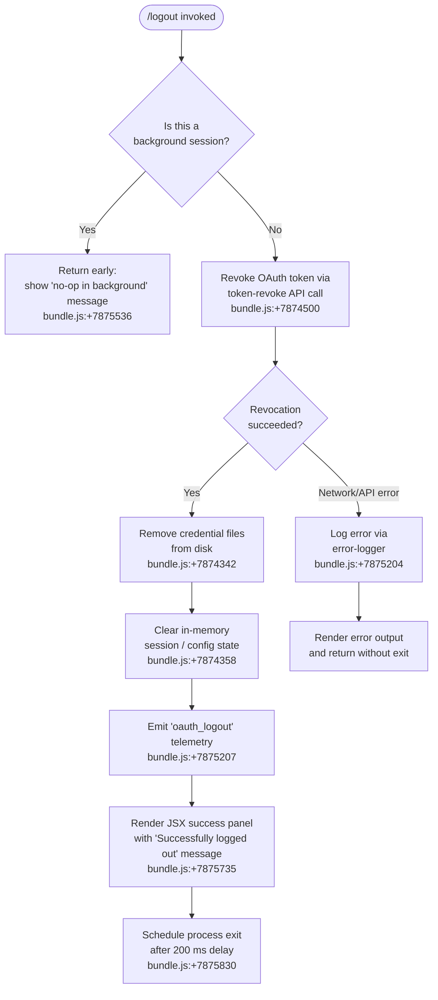

# `/logout`

> Analysis basis: CC v2.1.160 bundle.js (AST extraction + Claude interpretation)
> Minimum version: v2.1.160

---

## Overview

The `/logout` command signs the user out of their Anthropic account by revoking the OAuth token, removing stored credentials, clearing in-memory session state, and terminating the CLI process. It is a destructive, one-way operation: after completion the user must re-authenticate to use Claude Code. The command is blocked in background/daemon sessions and is only effective from a primary terminal session.

---

## Registration

| Field | Value |
|---|---|
| type | `local-jsx` |
| name | `logout` |
| description | Sign out from your Anthropic account |
| loc_byte | `11459688` |
| loc_byte_end | `11459972` |
| loc_line | `7863` |
| module_id | `ju_` |
| load_inline | `true` |
| arbor_handler.name | `PV7` |
| arbor_handler.fqn | `claude-2.1.160::PV7` |
| arbor_handler.kind | `AsyncFunction` |
| arbor_handler.resolution_path | `module_id` |
| arbor_handler.n_hits | `0` |

Analysis basis: CC v2.1.160 bundle.js:+11459688

---

## Input Branching

Four distinct execution branches are identified: background-session guard, token revocation attempt, success path, and error path. A Mermaid flowchart is used.



---

## Behavioral Spec

### Guard: Background Session Detection

```
function logoutHandler(context):
    sessionType = readSessionType(context)   // checks "bg", "daemon", "daemon-worker"
    if sessionType is background:
        return renderMessage(
            "This background session shares credentials…" +
            " Run /logout from your main terminal to sign out."
        )
    // proceed to token revocation
    performLogout(context)
```

Analysis basis: CC v2.1.160 bundle.js:+7875534 (background guard), +2242957 (literals "bg", "daemon", "daemon-worker")

---

### Token Revocation (`revokeTokenAndLogout` — handler `esH`)

```
async function revokeTokenAndLogout(context):
    await Promise.resolve()                        // yield to event loop

    authProvider = detectAuthProvider(context)     // reads "bedrock","foundry","anthropicAws",
                                                   // "mantle","vertex","firstParty" literals
    if authProvider is firstParty OAuth:
        refreshToken = readStoredRefreshToken()
        try:
            response = await postToOAuthRevoke(
                endpoint = buildOAuthEndpoint(context),   // resolves local/staging/prod URLs
                body     = { token: refreshToken,
                             token_type_hint: "refresh_token" }
            )
            emitTelemetry("oauth_token_revoke", outcome="ok")
        catch NetworkError:
            emitTelemetry("oauth_token_revoke", outcome="network")
            logError(error)
            // fall through — still clear local credentials

    removeCredentialFile()                         // ykK.unlinkSync  bundle.js:+15825505
    clearSessionState(context)                     // cT6 call chain  bundle.js:+7874358
    saveConfigWithLock()                           // W8 call chain   bundle.js:+7874830
    emitTelemetry("oauth_logout")                  //                  bundle.js:+7875207
```

Analysis basis: CC v2.1.160 bundle.js:+7874291 – +7875204

---

### Session State Teardown (`clearSessionState` — `cT6`)

```
function clearSessionState():
    clearKVStore(primaryStore)                     // pW6
    clearKVStore(gqhStore)                         // gQH
    clearEventEmitterMap()                         // r68 → ESq.clear  bundle.js:+2981356
    clearDaemonHandles()                           // wDH
    teardownProcessListeners()                     // P6H
        clearIntervals()                           // EY_ → clearInterval  bundle.js:+3226376
        process.removeListener("beforeExit", …)   // bundle.js:+3226434
        process.off("exit", …)                     // bundle.js:+3225777
        clearWeakMaps [WDH, t_8, tD6, jY_, SU]   // bundle.js:+3225838–3225886
    cleanupMCPSockets()                            // eb9 → BkH.unlink  bundle.js:+6974524
    cleanupPidFiles()                              // ph_ → RW6.unlink  bundle.js:+6935377
    flushQueuedRequests()                          // queue-path join + n8  bundle.js:+4145868
```

Analysis basis: CC v2.1.160 bundle.js:+7874358

---

### Credential File Removal (`removeCredentialFile` — `q`)

```
function removeCredentialFile():
    credPath = resolveCredentialPath()
    fs.unlinkSync(credPath)                        // ykK.unlinkSync  bundle.js:+15825505
    // ENOENT is swallowed silently
```

Analysis basis: CC v2.1.160 bundle.js:+7874342

---

### Config Persistence After Logout (`saveConfigWithLock` — `W8` / `xY_`)

```
function saveConfigWithLock():
    acquireLock()
    reRead = readConfigFromDisk()
    if reRead is missing auth AND cache has auth:
        // Safety guard — refuses to wipe credentials accidentally
        // literal: "saveGlobalConfig fallback: re-read config is missing auth…"
        emitTelemetry("tengu_config_auth_loss_prevented")
        return                                     // bundle.js:+3246250
    if lockAcquisitionDelayed:
        emitTelemetry("tengu_config_lock_contention")  // bundle.js:+3245771
    backupConfig(maxBackups=5)                     // bundle.js:+3246701
    writeConfigAtomically()                        // If6 atomic-write path
    releaseLock()
```

Analysis basis: CC v2.1.160 bundle.js:+7874830, +3245682, +3246250, +3246701

---

### JSX Render and Process Exit (`PV7` — Arbor-resolved handler)

```
async function PV7(context):
    sessionState = readAppState(context)           // N9 → OzH  bundle.js:+7875426

    if isBackgroundSession(sessionState):
        return renderWarningPanel(
            "This background session shares credentials…"
        )

    logoutResult = await revokeTokenAndLogout(context)   // esH  bundle.js:+7875499

    if logoutResult.error:
        return renderErrorPanel(logoutResult.error)

    panel = createElement(                         // wu_.createElement  bundle.js:+7875710
        type  = "system",
        props = {
            text: "Successfully logged out from your Anthropic account."
                  // bundle.js:+7875735
        }
    )
    render(panel)

    setTimeout(exitProcess, 200)                   // 200 ms delay  bundle.js:+7875830
    exitSession()                                  // gK call chain  bundle.js:+7875814
```

Analysis basis: CC v2.1.160 bundle.js:+7875426 – +7875830

---

### OAuth Endpoint Resolution (`buildOAuthEndpoint` — `kq`)

```
function buildOAuthEndpoint(env):
    baseEnv = process.env.CLAUDE_CODE_API_ENV ?? "prod"
    switch baseEnv:
        case "local":   return "http://localhost:8000"   // bundle.js:+950363
        case "staging": return "http://localhost:4000"   // bundle.js:+950450
        default:        return productionEndpoint
    customUrl = process.env.CLAUDE_CODE_CUSTOM_OAUTH_URL
    if customUrl is set and not in approved list:
        throw Error("CLAUDE_CODE_CUSTOM_OAUTH_URL is not an approved endpoint.")
                                                         // bundle.js:+951428
    return customUrl
```

Analysis basis: CC v2.1.160 bundle.js:+7874500, +951428

---

### Keychain Entry Cleanup (`deleteKeychainEntry` — `CLq` / `FN`)

```
function deleteKeychainEntry():
    key = computeKeychainKey()
        // NFC-normalize, sha256-hash (hex), first 8 chars  bundle.js:+2110312/+2110350/+2110396
        // username = "claude-code-user"  bundle.js:+2110530
    try:
        execKeychainDelete(key)
    catch:
        log("Failed to delete keychain entry")    // bundle.js:+2111289
```

Analysis basis: CC v2.1.160 bundle.js:+2111093 – +2111289

---

## State & Side Effects

| Item | Detail |
|---|---|
| Telemetry — `oauth_logout` | Fired after successful credential removal (bundle.js:+7875207) |
| Telemetry — `oauth_token_revoke` | Fired with outcome `"ok"` or `"network"` from `c9_` (bundle.js:+2099028) |
| Telemetry — `tengu_feature_ok` | Fired on success path via feature-tracking wrapper (bundle.js:+966123) |
| Telemetry — `tengu_feature_bad` | Fired on error path (bundle.js:+966181) |
| Telemetry — `tengu_feature_sad` | Fired on unexpected-exception path (bundle.js:+966258) |
| Telemetry — `tengu_config_lock_contention` | Fired if config lock acquisition is slow (bundle.js:+3245771) |
| Telemetry — `tengu_config_auth_loss_prevented` | Fired if post-logout write would erase auth (bundle.js:+3246250) |
| Telemetry — `tengu_config_stale_write` | Fired if config on disk is newer than cache (bundle.js:+3245907) |
| Credential file | Unlinked from disk via `ykK.unlinkSync` (bundle.js:+15825505) |
| Keychain entry | Deleted; failure is logged but non-fatal (bundle.js:+2111289) |
| MCP socket files | Unlinked via `BkH.unlink` (bundle.js:+6974524) |
| PID files | Unlinked via `RW6.unlink` (bundle.js:+6935377) |
| In-memory stores | Five WeakMap/Map stores cleared (`WDH`, `t_8`, `tD6`, `jY_`, `SU`) |
| Process listeners | `beforeExit` and `exit` listeners removed (bundle.js:+3226434, +3225777) |
| Config backup | Up to 5 rotating backups written before config update (bundle.js:+3246701) |
| Process exit | `setTimeout(exit, 200)` scheduled after JSX render (bundle.js:+7875830) |
| Background session | Command is a no-op; informational message returned; no state mutated (bundle.js:+7875536) |

---

## Version History

| Version | Change |
|---|---|
| v2.1.160 | Initial analysis |

---

## Common Mistakes

1. **Running `/logout` in a background or daemon session.** The command detects session type ("bg", "daemon", "daemon-worker") and returns an informational no-op message. You must run `/logout` from a primary interactive terminal to actually sign out.

2. **Expecting instant re-use after `/logout`.** The command schedules a 200 ms delay then exits the process entirely. Any pending work in the session is lost; there is no "confirm" prompt.

3. **Assuming network failure aborts the logout.** If the token-revocation API call fails with a network error, local credentials are still deleted. The user is effectively logged out locally even if the server-side token was not revoked.

4. **Assuming the keychain is always cleaned.** Keychain deletion failures are caught and logged, but do not abort the logout. A stale keychain entry may remain if the OS keychain is locked or unavailable.

5. **Re-authenticating immediately in the same process.** Because the command exits the process after 200 ms, any attempt to run `/login` in the same session will race against the scheduled exit.

---

## Appendix — Identifier Mapping

> For bundle debugging only. Identifiers change across versions.

| Identifier | Role |
|---|---|
| `PV7` | Main async logout handler (Arbor-resolved entry point for `/logout`) |
| `XV7` | Logout JSX render wrapper / outer shell |
| `esH` | Core logout execution function (token revocation + cleanup orchestrator) |
| `cT6` | Session state teardown (clears stores, listeners, sockets, PID files) |
| `P6H` | Process-listener teardown (removes `exit`/`beforeExit` hooks) |
| `EY_` | Interval and listener cleanup helper |
| `VdH` | WeakMap/Map store bulk-clear helper |
| `N9` | App-state reader (determines session type) |
| `OzH` | Session-type discriminator helper |
| `q` | Credential file unlink wrapper |
| `r68` | Event-emitter map clear (calls `ESq.clear`) |
| `pW6` | Primary KV-store clear |
| `gQH` | Secondary KV-store clear |
| `wDH` | Daemon handle cleanup |
| `eb9` | MCP socket / lock-file cleanup |
| `_x9` | MCP sub-helper |
| `OS_` | MCP state reset |
| `sSA` | MCP zero-state helper |
| `h1H` | Path join utility |
| `D56` | Lock-file path builder |
| `ph_` | PID-file cleanup orchestrator |
| `uh_` | PID-file unlink helper |
| `Uh_` | Daemon timeout clear helper |
| `DLH` | Daemon include/exclude filter |
| `QlH` | Queue path builder |
| `jA` | Auth-provider type classifier (bedrock/foundry/vertex/firstParty…) |
| `z4` | Config async-read orchestrator |
| `zYq` | Storage read/write/delete multiplexer |
| `bGH` | Storage write helper |
| `Xt4` | Storage write with retry/lock |
| `hH` | Storage error handler |
| `RH` | Storage delete error handler |
| `c9_` | OAuth token-revoke HTTP call wrapper |
| `kq` | OAuth endpoint URL resolver |
| `aVA` | OAuth base URL builder |
| `z94` | OAuth environment selector |
| `Me` | Telemetry event emitter helper |
| `Kz_` | Config-write scheduler |
| `CSq` | Config serializer |
| `CLq` | Keychain entry delete |
| `FN` | Keychain key computation (NFC + sha256) |
| `kX` | Keychain exec wrapper |
| `EV` | System user-info reader |
| `GH` | String-coerce helper |
| `W8` | Global config save-with-lock |
| `xY_` | Atomic config file write |
| `d6` | Directory existence check |
| `qYq` | Config merge helper |
| `G8` | ENOENT / error-code checker |
| `ZDH` | Config file reader (with backup) |
| `fY6` | Config validation |
| `SH` | JSON stringify helper |
| `uY_` | Backup path builder |
| `If6` | Atomic file write (temp → rename) |
| `SdH` | Config diff helper |
| `lQq` | Config entries iterator |
| `RdH` | Config timestamp recorder |
| `bY_` | Config fallback write |
| `Ds6` | Config dirty-flag tracker |
| `B0H` | App-state mutation dispatcher |
| `AIH` | OTEL telemetry attribute builder |
| `qj` | GH / string coerce |
| `v4` | OTEL metric emitter |
| `Bp8` | OTEL resource builder |
| `_IH` | OTEL span attribute setter |
| `kU` | Session ID generator |
| `y6` | zN / process-env helper |
| `Zf8` | FH string helper for OTEL |
| `fL` | bD / R6 local-agent auth helper |
| `l39` | AdL / _dL OTEL label helpers |
| `Gf8` | OTEL frozen-attribute set builder |
| `LK6` | OTEL metric label mapper |
| `gK` | Session exit orchestrator |
| `f9` | Main session teardown / process-exit function |
| `nIH` | Terminal unmount + final write |
| `lR` | Terminal restore helper |
| `U98` | Raw terminal write helper |
| `gN_` | Session-end status line renderer |
| `VG` | Dim / color helper |
| `ub` | Unicode helper |
| `z26` | Working-directory stat helper |
| `p$` | y6 / n4 env-check |
| `LW9` | Status line label builder |
| `QN_` | Process kill / exit dispatcher |
| `duH` | HDA drain helper |
| `D` | Supervisor / renderer loop |
| `jWH` | Render frame builder |
| `Z_K` | Column-width calculator |
| `E` | Input event stopper |
| `ekK` | Heartbeat helper |
| `zW9` | Promise.allSettled shutdown helper |
| `E46` | Startup profiling reporter |
| `dF8` | Profiling mark helper |
| `AjA` | Profiling JSON writer |
| `hM8` | Scroll summary emitter |
| `KW9` | Scroll counter |
| `qW9` | Scroll metric aggregator |
| `Lq` | Local-agent connection manager |
| `R16` | Cache eviction hint emitter |
| `SM8` | Parallel shutdown promise builder |
| `d8` | Timeout-with-abort helper |
| `n9` | Essential-traffic queue flusher |
| `T14` | Queue shift/push helper |
| `d_` | Error normaliser |
| `yH` | Error logger with queue |
| `o$` | HTTP response parser |
| `Ce` | Feature-flag cache checker |
| `wj` | URL path replacer |
| `gq` | Config cache reader |
| `t6` | Debug log helper |
| `_` | Generic utility placeholder |
| `H` | HTTP / storage abstraction |
| `N` | Config key normaliser |
| `L` | File-handle / stream abstraction |
| `f` | Stream / file object |
| `A` | Promise / process abstraction |
| `K` | Map / state-container abstraction |
| `V` | String / renderer abstraction |
| `X` | Session context object |
| `Z` | Renderer instance |
| `d` | Logger / debug sink |