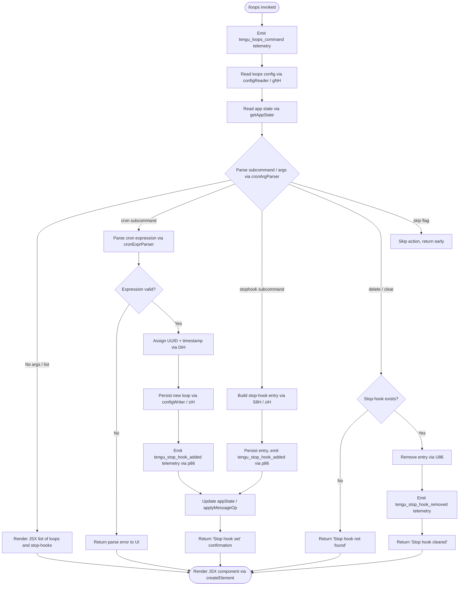

# `/loops`

> Analysis basis: CC v2.1.160 bundle.js (AST extraction + Claude interpretation)
> Minimum version: v2.1.160

---

## Overview

The `/loops` command provides a management interface for **recurring loops** (scheduled cron-style tasks) and **stop-hooks** (one-shot hooks that fire when an agent session terminates). It renders a JSX UI directly in the terminal, allowing users to list existing loops and stop-hooks, create new ones, and delete existing ones — all without leaving the Claude Code session.

---

## Registration

| Field | Value |
|---|---|
| type | `local-jsx` |
| name | `loops` |
| description | `List, create, and delete recurring loops and stop-hooks` |
| immediate | `true` |
| module_id | `Xo1` |
| load_inline | `true` |
| loc_byte | `12319425` |
| loc_byte_end | `12319607` |
| loc_line | `8626` |
| arbor_handler.name | `y0f` |
| arbor_handler.fqn | `claude-2.1.160::y0f` |
| arbor_handler.kind | `AsyncFunction` |
| arbor_handler.resolution_path | `module_id` |
| arbor_handler.n_hits | `0` |

Analysis basis: CC v2.1.160 bundle.js:+12319425

---

## Input Branching

The handler (`y0f`) has 5+ distinct execution paths depending on whether the invocation is a no-argument list, a cron creation, a stop-hook creation, a stop-hook deletion, or a skip/cancel. A Mermaid flowchart is therefore used.



Analysis basis: CC v2.1.160 bundle.js:+12318380 – +12319185

---

## Behavioral Spec

### 1. Handler Entry (`y0f` — main async handler)

```
async function loopsCommandHandler(context):
    emit telemetry("tengu_loops_command")           // +12318382
    config = await readLoopsConfig(context)         // calls configReader (+12318420)
    appState = context.getAppState()                // (+12318432)
    loopsList = appState.loops.map(formatLoop)      // (+12318460)
    stopHooksList = appState.stopHooks.map(...)     // (+12318544)

    subcommand = parseSubcommand(context.args)      // cronArgParser (+12318511)

    switch subcommand.type:
        case "list":     return renderLoopsList(loopsList, stopHooksList)
        case "cron":     return handleCronCreate(subcommand, context)
        case "stophook": return handleStopHookCreate(subcommand, context)
        case "delete":   return handleStopHookDelete(subcommand, context)
        case "skip":     return earlyExit()         // literal "skip" (+12319291)

    return createElement(...)                       // JSX render (+12319185)
```

Analysis basis: CC v2.1.160 bundle.js:+12318380

---

### 2. Config Reader (`gNH` — loops configuration loader)

```
async function readLoopsConfig(context):
    configPath = pathJoin(configDir, ...)           // CLH (+4832515)
    rawText = await fs.readFile(configPath, "utf-8") // (+4832534, literal +4832562)
    parsed = parseConfigText(rawText)               // yH (+4832606)
    if not Array.isArray(parsed):                   // (+4832678)
        return defaultConfig()
    validated = parsed.filter(isValidEntry)
    return validated
```

File-system errors matching `ENOENT`, `EACCES`, `EPERM`, `ENOTDIR`, `ELOOP`, `EROFS` are caught and mapped to structured error objects (literals at +174772–+174841).

Analysis basis: CC v2.1.160 bundle.js:+4832515

---

### 3. Cron Argument Parser (`sV` — schedule expression parser)

```
function parseCronExpression(rawInput):
    trimmed = rawInput.trim()                      // (+4830306)
    if trimmed matches "Every minute" pattern:     // literal +4830426
        return { type: "cron", schedule: "* * * * *" }
    if trimmed matches "Every hour" pattern:       // literal +4830643
        return { type: "cron", schedule: "0 * * * *" }

    // Generic numeric cron field parsing
    fields = trimmed.match(cronRegex)              // (+4830447)
    if not fields:
        return { error: true }

    minutes  = parseInt(fields[0])                 // (+4830482)
    // Range checks: minutes 0–59 (+12318147),
    //               hours   0–23 (+12318218),
    //               days    1–31 (+12318271)
    if outOfRange:
        return { error: true }

    // Weekday / UTC offset normalization via Date methods
    // getUTCDay (+4831183), setUTCDate (+4831202),
    // getUTCDate (+4831215), setUTCHours (+4831233), getDay (+4831262)
    normalizedSchedule = buildCronString(fields)
    return { type: "cron", schedule: normalizedSchedule }
```

Valid cron field ranges enforced:
- Minutes: 0–59 (bundle.js:+12318147)
- Hours: 0–23 (bundle.js:+12318218)
- Day-of-month: 1–31 (bundle.js:+12318271)
- Max schedule resolution: every 1 minute (bundle.js:+12318113, value `60`)

Analysis basis: CC v2.1.160 bundle.js:+4830306

---

### 4. Stop-Hook Entry Writer (`ziH` — config persistence)

```
async function writeLoopEntry(entry, configDir):
    dir = pathJoin(configDir, ".claude")           // literal ".claude" +4833703
    await fs.mkdir(dir, { recursive: true })       // (+4833682)
    filePath = pathJoin(dir, entryFileName)        // (+4833692)
    fileContent = entry.fields.map(serialize)      // (+4833743)
    await fs.writeFile(filePath, serialize(fileContent)) // (+4833779)
    configChecksum = computeChecksum(filePath)     // CLH (+4833793)
    return { path: filePath, checksum: configChecksum }
```

Analysis basis: CC v2.1.160 bundle.js:+4833671

---

### 5. Loop Creation (`DiH` — new loop constructor)

```
async function createNewLoop(parsedArgs, context):
    id = crypto.randomUUID()                       // r59.randomUUID +4833862
    createdAt = Date.now()                         // +4833924
    metadata = buildLoopMetadata(parsedArgs)       // g0H +4833970
    config = await readLoopsConfig(context)        // gNH +4834014
    config.loops.push({ id, createdAt, ...metadata }) // M.push +4834027
    await writeConfigToDisk(config)                // ziH +4834121
    context.navigate(newLoopRoute)                 // y6 +4834059
    return { success: true, id }
```

Analysis basis: CC v2.1.160 bundle.js:+4833862

---

### 6. Stop-Hook Set Operation (`p86` — stop-hook registration)

```
async function setStopHook(args, context):
    policyCheck = checkPolicyGate("hooks_gate")    // literal +10652146
    trustCheck  = checkTrustGate("trust_gate")     // literal +10652200
    if policyCheck.blocked or trustCheck.blocked:
        return { error: "blocked by policy" }

    goalId = context.getGoalId()                   // "goal" literal +10653035
    statusType = "goal_status"                     // literal +10653163

    appState = context.getAppState()               // +10652335
    timestamp = Date.now()                         // +10652499

    newEntry = {
        id:        randomUUID(),                   // EN1 +10652621
        prompt:    args.prompt,                    // literal "prompt" +10652065
        goalId,
        createdAt: timestamp,
    }

    appState = applyMessageOp(appState, "append", newEntry) // literal +10652970
    context.setAppState(appState)                  // +10652537
    emit telemetry("tengu_stop_hook_added")        // +10652636
    return { message: "Stop hook set" }            // literal +12319142
```

Analysis basis: CC v2.1.160 bundle.js:+10652250

---

### 7. Stop-Hook Delete / Clear (`U86` — stop-hook removal)

```
async function clearStopHook(hookId, context):
    appState = context.getAppState()               // +10652749
    existing = appState.stopHooks.find(h => h.id === hookId)
    if not existing:
        return { message: "Stop hook not found" }  // literal +12318824

    appState = applyMessageOp(appState, "delete", hookId) // +10652947
    context.setAppState(appState)                  // +10652878
    emit telemetry("tengu_stop_hook_removed")      // +10653004
    return { message: "Stop hook cleared" }        // literal +12318846
```

Analysis basis: CC v2.1.160 bundle.js:+10652738

---

### 8. Loop List Formatter (`m86` — display table builder)

```
function formatLoopsTable(loops):
    rows = loops.map(loop => {
        label = loop.label.padEnd(40, " ")         // literal 40 +15873361
        separator = "  "                           // literal +15871390
        return label + separator + loop.schedule
    })
    stopLabel = "Stop"                             // literal +10651958
    return { rows, stopLabel }
```

Analysis basis: CC v2.1.160 bundle.js:+10651950

---

### 9. Schedule Display Helper (`k0f` — next-run time calculator)

```
function computeNextRun(cronExpr, fromTime):
    parsed = cronExpr.match(cronPattern)           // +12317968
    minutes = parseInt(parsed.minutes)             // +12318005
    maxVal  = Math.max(minutes, 0)                 // +12318090
    nextMin = Math.ceil(maxVal / 1) * 1            // +12318101
    display = Math.round(nextMin)                  // +12318174
    // Applies weekday normalization: GI (+12318338)
    return display
```

Analysis basis: CC v2.1.160 bundle.js:+12317968

---

### 10. Stop-Hook Existence Check (`S8H` — pre-flight guard)

```
function validateStopHookTarget(hookRef, config):
    hookExists = config.has(hookRef)               // Oe.has +51969
    if not hookExists:
        return { valid: false }
    filtered = config.filter(h => h.id !== hookRef) // q.filter +4834250
    alreadySet = filtered.has(...)                 // A.has +4834265
    return { valid: true, filtered }
```

Analysis basis: CC v2.1.160 bundle.js:+4834192

---

## State & Side Effects

| Item | Detail |
|---|---|
| Telemetry: `tengu_loops_command` | Fired on every `/loops` invocation (bundle.js:+12318382) |
| Telemetry: `tengu_stop_hook_added` | Fired when a new cron loop or stop-hook is successfully registered (+10652636) |
| Telemetry: `tengu_stop_hook_removed` | Fired when a stop-hook is successfully deleted (+10653004) |
| Telemetry: `tengu_bg_dispatch_sigkill_escalate` | Fired if a background worker needs SIGKILL escalation during loop scheduling (+15847534) |
| Telemetry: `tengu_daemon_config_reload` | Fired when daemon re-reads config after a loop change (+15862022) |
| Telemetry: `tengu_daemon_yield` | Fired when daemon yields to a foreground/service daemon (+15866241) |
| Telemetry: `tengu_feature_bad` / `tengu_feature_ok` / `tengu_feature_sad` | Feature-gate probe events (+966181, +966123, +966258) |
| Telemetry: `tengu_bg_low_mem_mb` | Low-memory signal during background scheduling (+12846064) |
| Telemetry: `tengu_bg_dispatch_low_mem` | Low-memory dispatch guard (+15848113) |
| Telemetry: `tengu_bg_spare_enable` / `tengu_bg_spare_claim` / `tengu_bg_spare_claim_fail` | Spare-worker lifecycle events (+15848808, +15848929, +15849192) |
| Telemetry: `tengu_bg_sendclaim_failed` | IPC claim failure to daemon (+15828180) |
| Telemetry: `tengu_bg_state_read_transient` | Transient state file read during loop startup (+4127971) |
| Telemetry: `tengu_daemon_control` | Daemon control-plane event (+15883547) |
| Telemetry: `tengu_skill_file_changed` | Skills/config file watcher change (+13974724) |
| appState changes | `setAppState` called with updated loops list and stop-hooks after create/delete |
| appState messageOp | `applyMessageOp` with `"append"` on create, implicit delete on clear |
| File system | Writes loop config files under `.claude/` directory (literal +4833703); uses `mkdir` + `writeFile` |
| Config reads | `readFile` with encoding `"utf-8"` (literal +4832562) |
| JSX render | `createElement` called to render terminal UI (+12319185) |
| Daemon IPC | New loops may spawn background workers via `Hg.spawn` and `Hg.claim`/`Hg.buildClaimFrame` |
| Hook registration | Stop-hooks written to disk and indexed in appState under `goal_status` attachment type |
| Sound | None found in depth-2 traversal |

---

## Version History

| Version | Change |
|---|---|
| v2.1.160 | Initial analysis |

---

## Common Mistakes

1. **Providing an invalid cron expression** — The parser enforces strict numeric ranges (minutes 0–59, hours 0–23, day-of-month 1–31). Expressions outside these ranges are silently rejected with an error object; check the UI for feedback before assuming the loop was created.

2. **Expecting immediate execution** — Loops are scheduled recurring tasks. After `/loops` creates a cron entry, it will run at the next scheduled interval, not immediately.

3. **Trying to delete a non-existent stop-hook** — Issuing a delete for a hook ID not present in config returns `"Stop hook not found"` (bundle.js:+12318824) without error. Verify the hook ID with `/loops` (list view) first.

4. **Conflating "loops" (cron) with "stop-hooks"** — These are two distinct entity types managed by the same command. Cron entries use the `"cron"` subcommand path and contain schedule expressions; stop-hooks use the `"stophook"` subcommand path and fire once on session stop.

5. **Ignoring policy gates** — The stop-hook create path checks `hooks_gate` and `trust_gate` policy settings (literals +10652146, +10652200). In restricted environments these gates may silently block hook registration.

6. **Assuming instant disk reflection** — Config writes go through an async `writeFile` + checksum pipeline (`ziH`). Race conditions can occur if you query config immediately after creation in scripted contexts.

---

## Appendix — Identifier Mapping

> For bundle debugging only. Identifiers change across versions.

| Identifier | Role |
|---|---|
| `y0f` | Main async handler for `/loops` command |
| `d` | General async dispatcher / utility function |
| `R8H` | Config reader orchestrator (calls `gNH`) |
| `gNH` | Loops configuration file loader |
| `d6` | File path resolver helper |
| `CLH` | Config path builder (uses `k78.join`) |
| `tK` | Path normalization utility (calls `zN`) |
| `H9` | Config validation helper (calls `G8`) |
| `G8` | Generic object schema validator |
| `yH` | Config text parser / deserializer |
| `d_` | Error classifier (maps error codes) |
| `FH` | String coercion helper |
| `n9` | Network traffic filter (`essential-traffic`) |
| `T14` | Sliding-window queue manager (`lF6.shift`/`push`) |
| `N` | Fetch/bootstrap utility (HTTP fetch with User-Agent, Content-Type) |
| `lmK` | Bootstrap fetch sub-routine |
| `H` | HTTP fetch wrapper (bootstrap fetcher) |
| `SH` | JSON serializer (`JSON.stringify`) |
| `x4` | URL/path string manipulator |
| `PmH` | Response body reader (`ZwA`) |
| `rmK` | File byte-length and streaming utility (`Buffer.byteLength`) |
| `GI` | Schedule text tokenizer / trimmer |
| `nBL` | Schedule string parser (split, match, parseInt, Set operations) |
| `A` | Array/collection helper (lowercase normalizer) |
| `L` | File-handle cleanup tracker (`q.add`/`q.delete`) |
| `q` | Temp-file cleanup set (`ykK.unlinkSync`) |
| `f` | Stream / file handle (close, finally) |
| `uT` | Secondary config utility (calls `zN`) |
| `zN` | Core path/string primitive |
| `m86` | Loop list display table builder |
| `oPH` | Table cell setter (`K.set`) |
| `K` | Column map with `padEnd` formatter |
| `yL1` | Row mapper for display table (`H.map`) |
| `y6` | Navigation helper (calls `zN`) |
| `sV` | Cron expression / schedule argument parser |
| `w` | Background worker process manager |
| `S` | Worker write-channel handler (`D.write`) |
| `D` | Daemon supervisor session (`stop`, `start`, `updateConfig`) |
| `RH` | Worker "ready" signal handler |
| `hH` | Worker "heartbeat" signal handler |
| `gh8` | Memory usage sampler (macOS-specific, `macos` literal) |
| `W6` | Background worker dispatch gate (memory/dedup checks) |
| `fj6` | Loop state file loader (`pins.json`) |
| `o2_` | Pins file path resolver |
| `m6` | JSON parser wrapper (`JSON.parse`) |
| `V8` | Timestamp/date validator |
| `wSL` | Directory-based loop config scanner |
| `F` | Promise retire-if-settled helper |
| `w$A` | IPC claim-send routine (`Hg.claim`) |
| `rKA` | Roster file writer (`H9H.writeFile`, `JSON.stringify`) |
| `W85` | Claim timeout/error handler |
| `X85` | Claim frame builder (`Hg.buildClaimFrame`) |
| `v5` | Generic promise resolver |
| `GH` | String coercion helper |
| `VF` | Binary frame encoder (`Buffer.allocUnsafe`, `writeUInt32BE`) |
| `T$A` | Background worker lifecycle manager (start, stop, roster) |
| `nK` | Worker working-directory path resolver |
| `_1` | Worker state file reader/writer (`OLH`, `GYH` maps) |
| `UD` | Worker "active" state setter |
| `z5` | Worker state serializer (`SH`, `Nj`) |
| `X_6` | Worker async completion tracker (`Date.now`) |
| `S5H` | Stop-hook path builder (`g3.join`, `GCH`) |
| `aE` | Stop-hook split/path utility |
| `hF` | Stop-hook file locator (`He_`, `J_6`) |
| `eI6` | Stop-hook directory initializer (`qe_`) |
| `Y` | Forced-shutdown handler (`process.exit`, `z.abort`) |
| `LJ` | Shutdown logger |
| `z` | Abort-signal / process teardown controller |
| `R` | Rate-limit event emitter (`Wn1`, `y.enqueue`) |
| `Wn1` | Rate-limit queue head |
| `y` | Event enqueue worker |
| `j` | Active workers iterator (`A.values`, `y.kill`) |
| `$` | Telemetry/event sink (`aHK`) |
| `aHK` | Event batch sender (`$r`, `Date.now`, `SH`) |
| `$r` | Telemetry HTTP transport (`JKH`) |
| `L1` | Async-local storage accessor (`vyL.getStore`) |
| `ny6` | Status file path builder (`oHK.join`, `n8`) |
| `J` | UTC date calculator (used for cron next-run) |
| `S8H` | Stop-hook pre-flight validator (`Oe.has`, `gNH`) |
| `Oe` | Existence-check helper (`_.has`) |
| `ziH` | Loop config file writer (`.claude` dir, `writeFile`) |
| `U86` | Stop-hook delete / appState updater |
| `EN1` | UUID generator for new stop-hook entries |
| `k0f` | Next-run time calculator for cron expressions |
| `DiH` | New loop constructor (`randomUUID`, `Date.now`) |
| `g0H` | Loop metadata builder |
| `M` | Plugin/path registry entry helper |
| `qC6` | Plugin path normalizer (`.staging` guard) |
| `KC6` | Plugin base-path resolver |
| `p86` | Stop-hook registration handler (policy gates, appState, telemetry) |
| `Da_` | Policy / trust gate resolver |
| `CU` | Policy settings reader (`policySettings`) |
| `b8` | Policy rule evaluator (`RQ6`, `EQ`) |
| `vY` | Trust gate evaluator (`ZA`) |
| `x_` | Gate result transformer |
| `m7` | Daemon config loader (`cjL`) |
| `cjL` | Config file parser (FH, puH, N9, R6, bdH, wQ, S6) |
| `t6` | Async wrapper / error boundary (calls `d`) |
| `Aj` | Token usage aggregator (`NuH`, `Object.values`, `outputTokens`) |

---

Note: index built via Arbor fallback; some signals (telemetry, literals) may be missing — see arbor-fallback.js.