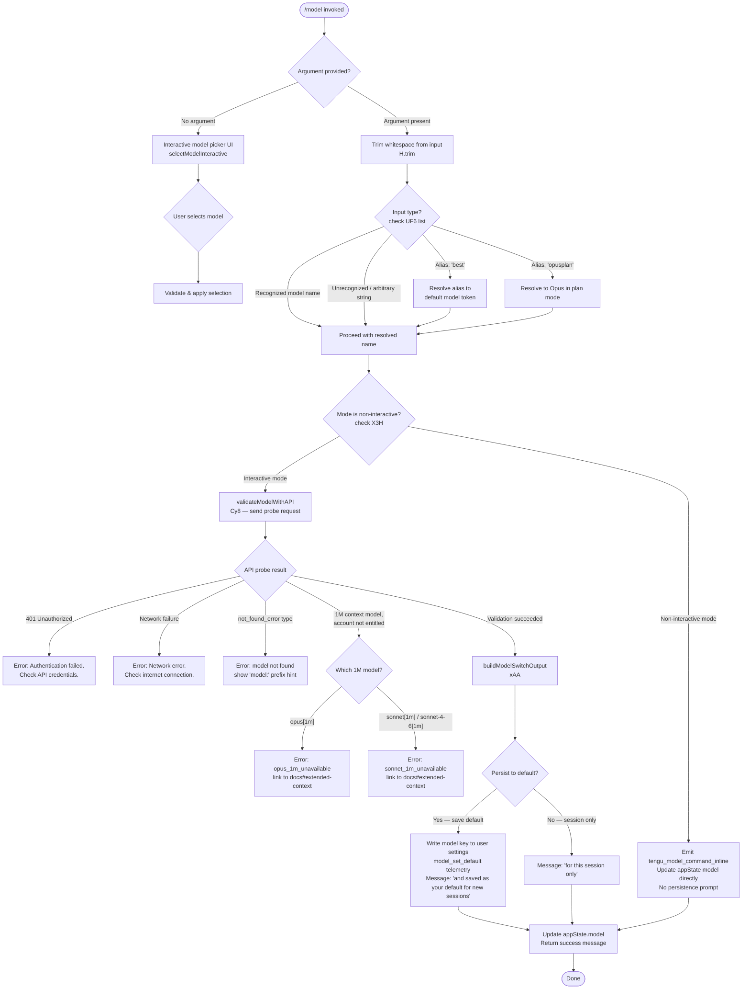

# `/model`

> Analysis basis: CC v2.1.160 bundle.js (AST extraction + Claude interpretation)
> Minimum version: v2.1.160

---

## Overview

The `/model` command sets the active AI model for the current Claude Code session. When invoked with a model name argument, it validates the requested model against account entitlements, optionally persists the selection to user settings, and updates the live session state. When invoked without an argument (interactive mode), it presents a selection UI listing all available models with contextual annotations.

---

## Registration

| Field | Value |
|---|---|
| type | `local` |
| name | `model` |
| description | Set the AI model for Claude Code |
| argumentHint | `<model>` |
| supportsNonInteractive | `true` |
| module_id | `Te1` |
| load_inline | `true` |
| loc_byte | `12515754` |
| loc_byte_end | `12515928` |
| loc_line | `8777` |
| arbor_handler.name | `gGf` |
| arbor_handler.fqn | `claude-2.1.160::gGf` |
| arbor_handler.kind | `AsyncFunction` |
| arbor_handler.resolution_path | `module_id` |
| arbor_handler.n_hits | `0` |

Analysis basis: CC v2.1.160 bundle.js:+12515754

---

## Input Branching

There are four or more distinct input/state branches handled by `gGf` and its call tree, so a Mermaid flowchart is used.



---

## Behavioral Spec

### 1. Top-level Handler — `handleModelCommand` (`gGf`)

```
async function handleModelCommand(input, context):
    trimmedInput = input.trim()                         // bundle.js:+12507361

    if trimmedInput in knownAliasSet:                   // bundle.js:+12507377
        trimmedInput = resolveAlias(trimmedInput)

    currentAppState = context.getAppState()             // bundle.js:+12507400

    if context.isNonInteractive:                        // bundle.js:+12507464
        emit telemetry("tengu_model_command_inline")    // bundle.js:+12507519
        updateAppStateModel(currentAppState, trimmedInput)
        return buildInlineResult(trimmedInput)

    // Interactive path
    selectedModel = await selectAndValidateModel(trimmedInput, currentAppState)  // ht1
    return selectedModel
```

Analysis basis: CC v2.1.160 bundle.js:+12507361

---

### 2. Available-Model Listing — `buildAvailableModelList` (`xy8`)

```
function buildAvailableModelList(appState):
    models = fetchModelCandidates(appState)   // GS -> g$6, R0
    // Retrieves structured model entries from internal registry
    // Each entry carries: id, display name, provider tag, fast-mode flag
    return models
```

Analysis basis: CC v2.1.160 bundle.js:+12507444

---

### 3. Alias / Short-name Resolution — `resolveModelAlias` (`K1`)

The function normalises user-supplied short names to canonical model identifiers:

```
function resolveModelAlias(raw):
    s = raw.trim().toLowerCase()             // bundle.js:+2233677, +2233688

    if s == "opusplan":                      // bundle.js:+2233773
        return OPUSPLAN_MODEL_TOKEN

    if s contains "[1m]":                    // bundle.js:+2233799
        return resolve1MVariant(s)

    if s == "sonnet":                        // bundle.js:+2233814
        return DEFAULT_SONNET_ID

    if s == "haiku":                         // bundle.js:+2233853
        return DEFAULT_HAIKU_ID

    if s == "opus":                          // bundle.js:+2233892
        return DEFAULT_OPUS_ID

    if s == "best":                          // bundle.js:+2233929
        return BEST_MODEL_TOKEN

    // Fallback: treat as literal model name
    // Apply anthropic. prefix check                  // bundle.js:+2227735
    // Apply provider-specific routing (DKH)          // bundle.js:+2233752
    return normalizedModelName(s)
```

The string `"Opus in plan mode, else Sonnet"` is the human-readable label for the `opusplan` token (bundle.js:+2232303).

Analysis basis: CC v2.1.160 bundle.js:+2233677

---

### 4. Model Validation via API Probe — `validateModelWithAPI` (`Cy8`)

```
async function validateModelWithAPI(modelName, appState):
    if modelName.trim() == "":
        throw UserError("Model name cannot be empty")   // bundle.js:+12468374

    normalized = modelName.toLowerCase()                // bundle.js:+12468497

    // Check provider deny-list (zKH)                  // bundle.js:+12468516
    if normalized in restrictedProviderSet:
        throw PolicyError("not_allowed")

    // Cache check: yt1 Map                            // bundle.js:+12468618
    if validationCache.has(normalized):
        return validationCache.get(normalized)

    // Send minimal probe message to the API (Uu)      // bundle.js:+12468663
    // Probe parameters:
    //   role: "user", content: "Hi"                   // bundle.js:+12468748, +12468782
    //   cache_control: "ephemeral"                    // bundle.js:+12468807
    //   telemetry label: "model_validation"           // bundle.js:+12468713

    response = await sendProbe(normalized)

    if response.status == 401:
        throw AuthError("Authentication failed. Please check your API credentials.")
                                                       // bundle.js:+12469073

    if networkFailure:
        throw NetworkError("Network error. Please check your internet connection.")
                                                       // bundle.js:+12469175

    if response.error.type == "not_found_error":       // bundle.js:+12469294
        throw ModelNotFoundError(response.error.message + " (model: ...)")
                                                       // bundle.js:+12469313, +12469376

    validationCache.set(normalized, result)            // bundle.js:+12468826
    return result
```

Analysis basis: CC v2.1.160 bundle.js:+12468337

---

### 5. Entitlement Check for 1M-Context Models — `check1MEntitlement` (`sEf`, `tEf`, `aEf`)

```
function checkOpus1MEntitlement(modelName, accountFlags):
    lower = modelName.toLowerCase()                    // bundle.js:+12472099
    // Check whether account has extended-context flag (ya)
    if not accountFlags.includes(EXTENDED_CTX_FLAG):
        emit event("opus_1m_unavailable")              // bundle.js:+12470366
        throw EntitlementError(
          "Opus with 1M context is not available for your account. " +
          "Learn more: https://code.claude.com/docs/en/model-config#extended-context-with-1m"
        )                                              // bundle.js:+12470404

function checkSonnet1MEntitlement(modelName, accountFlags):
    lower = modelName.toLowerCase()                    // bundle.js:+12472196
    // Checks for sonnet[1m] or sonnet-4-6[1m] variants   // bundle.js:+12472238, +12472264
    if not accountFlags.includes(EXTENDED_CTX_FLAG):
        emit event("sonnet_1m_unavailable")            // bundle.js:+12470583
        throw EntitlementError(
          "Sonnet 4.6 with 1M context is not available for your account. " +
          "Learn more: https://code.claude.com/docs/en/model-config#extended-context-with-1m"
        )                                              // bundle.js:+12470623
```

Analysis basis: CC v2.1.160 bundle.js:+12470334

---

### 6. Build Model-Switch Output & Persistence — `buildModelSwitchOutput` (`xAA`)

```
function buildModelSwitchOutput(validatedModel, appState, options):
    displayName = formatDisplayName(validatedModel)   // bold via j6.bold  // bundle.js:+12471324

    // Determine fast-mode annotation
    if isFastModeModel(validatedModel):
        suffix = " · Fast mode ON"                    // bundle.js:+12471507
    elif isUsageCreditModel(validatedModel):
        suffix = " · Draws from usage credits"        // bundle.js:+12471558
    else:
        suffix = " · Fast mode OFF"                   // bundle.js:+12471604

    // Determine whether model selection should be persisted
    if options.saveAsDefault:
        persistModelToSettings(validatedModel)        // xy6 -> F_ (settings writer)
        emit event("model_set_default")               // bundle.js:+12471701
        scopeLabel = " and saved as your default for new sessions"  // bundle.js:+12471343
    else:
        scopeLabel = " for this session only"         // bundle.js:+12471389

    // Update live appState
    appState.model = validatedModel                   // key "model"  // bundle.js:+12471748

    // Render output lines
    outputLines = [
        bold(displayName) + suffix,
        scopeLabel,
        renderModelDetails(validatedModel, appState)  // GS, a3, Y2H, FX
    ]

    // If managed/policy settings restrict model, show notice
    if isManagedSettings(appState):                   // bundle.js:+12471910
        outputLines.append("Managed settings")

    return formatOutput(outputLines)
```

Analysis basis: CC v2.1.160 bundle.js:+12471148

---

### 7. Settings Write Path — `writeSettingsFile` (`F_`)

```
async function writeSettingsFile(settingsType, key, value):
    // settingsType is one of:
    //   "userSettings"    -> ~/.claude/settings.json       // bundle.js:+1229986, +1220496, +1220506
    //   "projectSettings" -> <project>/.claude/settings.json  // bundle.js:+1230101
    //   "localSettings"   -> settings.local.json           // bundle.js:+1230124

    filePath = buildSettingsPath(settingsType)

    existingContent = readSettingsFile(filePath)     // EQ
    updatedContent = mergeKey(existingContent, key, value)

    // Atomic write: write to temp, then rename
    tmpPath = filePath + ".tmp"
    await fs.appendFile(tmpPath, serialize(updatedContent), "utf-8")  // bundle.js:+1230038
    await fs.rename(tmpPath, filePath)

    emit QUH event                                   // bundle.js:+1230558
```

Analysis basis: CC v2.1.160 bundle.js:+1229402

---

### 8. Model Display Formatting — `formatModelName` (`x4`)

```
function formatModelName(modelId):
    // Map internal/API model identifiers to display tokens
    parts = splitOnProviderPrefix(modelId)          // xwA -> BmK.map  // bundle.js:+195986
    display = modelId.replace(REDACTED_PATTERN, "")  // bundle.js:+196298, +196350
    // Truncate to last segment for display (index 2)  // bundle.js:+196379
    tail = parts.at(-1)                             // bundle.js:+196408
    lastDotIdx = tail.lastIndexOf(".")              // bundle.js:+196434
    shortName = tail.slice(lastDotIdx + 1)          // bundle.js:+196460
    return shortName
```

Analysis basis: CC v2.1.160 bundle.js:+196271

---

### 9. Bootstrap / Provider Detection — `bootstrapFetch` (`H` / `N`)

When provider detection is needed (e.g., for cloud providers), the handler issues a bootstrap fetch:

```
async function bootstrapFetch(url, context):
    log("[Bootstrap] Fetching")                      // bundle.js:+15451800
    response = await fetch(url, {
        headers: {
            "Content-Type": "application/json",      // bundle.js:+15451885, +15451900
            "User-Agent": <version string>           // bundle.js:+15451919
        },
        timeout: 5000                                // bundle.js:+15451991
    })
    if parse fails:
        emit telemetry("api_bootstrap_fetch", {result: "parse_failed"})  // bundle.js:+15452112, +15452134
        return null
    log("[Bootstrap] Fetch ok")                      // bundle.js:+15452164
    emit telemetry("api_bootstrap_fetch")            // bundle.js:+15452112
    return data
```

Analysis basis: CC v2.1.160 bundle.js:+15451798

---

### 10. Model Validation — Error-Path Telemetry (`bAA`)

```
function handleModelSwitchResult(result):
    switch result.outcome:
        case "default":                          // bundle.js:+12470164
            // normal success path
        case "not_allowed":                      // bundle.js:+12470219
            emit event("model_switch", {status: "not_allowed"})  // bundle.js:+12470204
        case "invalid_model":                    // bundle.js:+12470866
            // model rejected by API
        case "validate_exception":               // bundle.js:+12470963
            // unexpected exception during validation
        case "opus_1m_unavailable":              // bundle.js:+12470366
            // see checkOpus1MEntitlement
        case "sonnet_1m_unavailable":            // bundle.js:+12470583
            // see checkSonnet1MEntitlement
```

Analysis basis: CC v2.1.160 bundle.js:+12471079

---

## State & Side Effects

| Item | Detail |
|---|---|
| Telemetry — `tengu_model_command_inline` | Fired when `/model <name>` is used in non-interactive (piped/scripted) mode (bundle.js:+12507519) |
| Telemetry — `tengu_feature_ok` | Fired on successful feature path (bundle.js:+966123) |
| Telemetry — `tengu_feature_bad` | Fired on failed/error feature path (bundle.js:+966181) |
| Telemetry — `tengu_feature_sad` | Fired on degraded/partial feature path (bundle.js:+966258) |
| Telemetry — `tengu_api_success` | Fired when API probe for model validation returns successfully (bundle.js:+13285028) |
| appState changes | `appState.model` is updated to the newly selected model identifier (bundle.js:+12471748) |
| Settings persistence | When user confirms saving default, model key is written to `~/.claude/settings.json` via atomic rename (bundle.js:+12471701) |
| Validation cache | Successful API probe results are stored in an in-memory Map (`yt1`) to avoid repeated probes within the same session (bundle.js:+12468618, +12468826) |
| Hook registration | `O9` calls `HDA.register` (bundle.js:+59048); likely registers a settings-reload hook |
| Sound | None observed in traversal |
| Log output | `[Bootstrap] Fetching` and `[Bootstrap] Fetch ok` logged during provider bootstrap (bundle.js:+15451800, +15452164) |

---

## Version History

| Version | Change |
|---|---|
| v2.1.160 | Initial analysis |

---

## Common Mistakes

1. **Passing an empty string as the model argument** — The handler explicitly rejects empty-string input with the message `"Model name cannot be empty"` (bundle.js:+12468374). Ensure the argument is non-empty even in scripts.
2. **Expecting 1M-context variants to work without entitlement** — Both `opus[1m]` and `sonnet[1m]`/`sonnet-4-6[1m]` variants check account entitlements and will return a specific error with a docs link if your account does not have extended-context access (bundle.js:+12470404, +12470623).
3. **Assuming `/model` persists across sessions by default** — Without explicitly confirming persistence, the selection is scoped to the current session only (`"for this session only"`, bundle.js:+12471389). Use the save-as-default flow to make it permanent.
4. **Using a restricted provider name** — Certain provider-prefixed model strings are checked against an internal deny-list (`zKH`) and will be blocked with a `not_allowed` result (bundle.js:+12468516).
5. **Using `/model` in non-interactive mode expecting a prompt** — In piped/scripted (`--non-interactive`) mode, the command applies the model directly and emits `tengu_model_command_inline` without any interactive confirmation or picker UI (bundle.js:+12507464, +12507519).
6. **Confusing short aliases with full model IDs** — Aliases such as `"best"`, `"opus"`, `"sonnet"`, `"haiku"`, and `"opusplan"` are resolved internally. Passing a full API model string (e.g., `claude-opus-4-...`) also works but goes through the literal-name path.

---

## Appendix — Identifier Mapping

> For bundle debugging only. Identifiers change across versions.

| Identifier | Role |
|---|---|
| `gGf` | Top-level async handler for `/model` command (`handleModelCommand`) |
| `H` | Bootstrap / provider-fetch utility; also used as generic local variable in many call sites |
| `N` | Bootstrap fetch inner implementation (headers, timeout, parse) |
| `lmK` | Log/debug write helper (uses level `"debug"` literal) |
| `ADA` | Debug log entry formatter |
| `SH` | JSON serialization helper (calls `JSON.stringify`) |
| `x4` | Model display-name formatter (`formatModelName`) |
| `xwA` | Provider-prefix splitter (`BmK.map`) |
| `q` | Filesystem cleanup helper (calls `ykK.unlinkSync`) |
| `A` | Case-normalisation helper (`toLowerCase`) |
| `PmH` | stdout writer (calls `ZwA` → `H.write`) |
| `ZwA` | Raw write-to-stdout wrapper |
| `rmK` | Settings file write orchestrator |
| `QuH` | Debounced async write scheduler (`clearTimeout` / `setTimeout` / `setImmediate`) |
| `R$H` | Settings path builder (`je.join`, `n8`, `y6`) |
| `d6` | Directory ensure helper |
| `A46` | Directory stat / create helper (`G8`) |
| `gwA` | Settings path join helper |
| `FwA` | Atomic file rename helper (stat → endsWith `.txt` → rename / unlink) |
| `imK` | File append + rotation helper (`Hy.mkdir`, `Hy.appendFile`) |
| `O9` | Hook registrar (`HDA.register`) |
| `o$` | App-state accessor |
| `Ce` | Feature-flag set checker (`F64.has`) |
| `wj` | String sanitiser (`H.replace`) |
| `gq` | Model selection UI orchestrator (calls `GHH`, `K1`, `yP`) |
| `GHH` | Interactive picker renderer (`DN`, `p9H`, `ZA`, `lQ`) |
| `DN` | Picker item description renderer |
| `p9H` | Picker item highlight renderer |
| `lQ` | Model list formatter (prefix check, alias expansion, sorting) |
| `K1` | Alias resolver / model-name normaliser (`resolveModelAlias`) |
| `C0` | Model ID constructor (`wKH`) |
| `DKH` | Provider include-list checker (`zKH.includes`) |
| `dN` | Model option builder (`xM`, `Jf`) |
| `_gH` | Model detail builder (`Jf`) |
| `tT` | Model metadata composer (`xM`, `Jf`, `jA`) |
| `XDq` | Model wrapper (`tT`) |
| `xM` | Model token builder (`jA`) |
| `xa6` | Model availability filter (`Ss4.includes`) |
| `AgH` | Model annotation appender (`FH`) |
| `yP` | Model picker with extended info (`K1`, `R0`) |
| `R0` | Full model record builder (`EA`, `IHH`, `MzH`, `qgH`, `tT`, `FX`, `xM`, `jA`, `Jf`, `dN`) |
| `t6` | Telemetry event emitter wrapper (`d`) |
| `d` | Core telemetry dispatcher |
| `xy8` | Available-model list builder (`GS`, `_`) |
| `GS` | Model candidates fetcher (`g$6`, `R0`) |
| `g$6` | Model candidate factory (`FO`, `K1`) |
| `FO` | Fast-mode model factory (`fzH`) |
| `ht1` | Model-switch orchestrator (calls `bAA`, `xAA`) |
| `bAA` | Model-switch result handler / error dispatcher |
| `RH` | Result renderer helper (`d`) |
| `sEf` | Opus 1M entitlement checker (`checkOpus1MEntitlement`) |
| `ya` | Account flag reader (`wKH`, `EA`, `gC9`) |
| `FX` | Provider-aware model builder (`wKH`, `jKH`, `jA`, `EA`, `z1`) |
| `tEf` | Sonnet 1M entitlement checker (`checkSonnet1MEntitlement`) |
| `p7H` | Sonnet account flag reader (`wKH`, `EA`, `gC9`) |
| `aEf` | General provider restriction checker (`zKH.includes`, `toLowerCase`) |
| `Cy8` | API probe validator (`validateModelWithAPI`) |
| `Uu` | API probe sender (fetch, response parsing, telemetry) |
| `rEf` | Probe response parser (`oEf`, `String`) |
| `GH` | Generic string coercion helper (`String`) |
| `xAA` | Model-switch output builder (`buildModelSwitchOutput`) |
| `xy6` | Settings persistence dispatcher (`F_`, `hH`) |
| `F_` | Settings file write implementation (`writeSettingsFile`) |
| `hH` | Result message builder (`d`) |
| `cK` | Model token composer (`jA`, `FH`) |
| `jA` | Model field builder (`FH`) |
| `FH` | String value wrapper (`String`) |
| `KzH` | Known-model set constant |
| `a3` | Model record assembler (`cK`, `R0`, `K1`, `q.includes`) |
| `Y2H` | Extended model info builder (`EA`, `K1`, `yP`, `q.includes`, `a3`, `C0`) |
| `EA` | API error type classifier (`bD`, `IR`, `mq`) |
| `uAA` | Model display line composer (`REH`, `b8`, `fx`, `j6.dim`, `j6.bold`, `fr`) |
| `REH` | Managed-settings notice renderer (`zV`, `b8`) |
| `b8` | Settings path resolver (`RQ6`, `EQ`) |
| `fx` | Config file path builder (`RN.join`) |
| `fr` | Model info formatter (`DKH`, `FO`, `K1`) |

---

Note: index built via Arbor fallback; some signals (telemetry, literals) may be missing — see arbor-fallback.js.