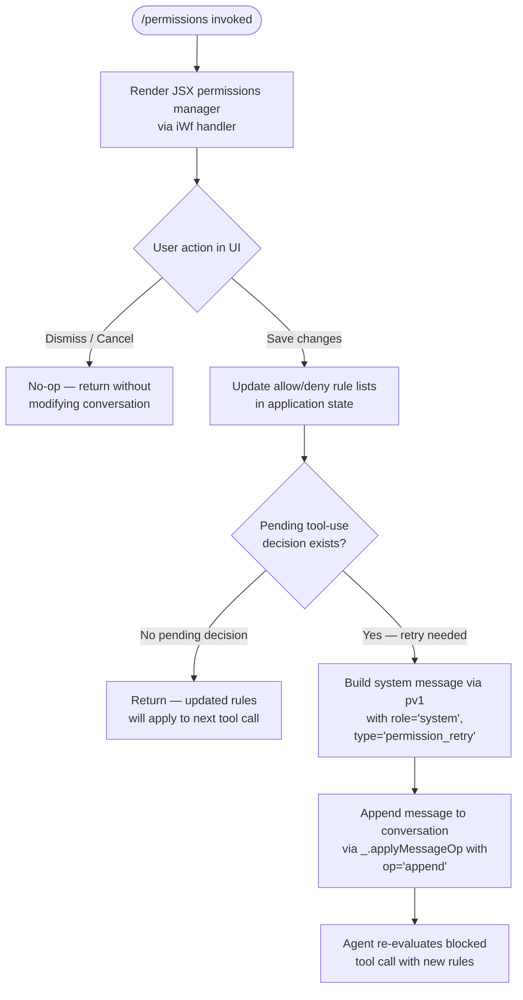

# `/permissions`

> Analysis basis: CC v2.1.160 bundle.js (AST extraction + Claude interpretation)
> Minimum version: v2.1.160

---

## Overview

The `/permissions` command (also accessible as `/allowed-tools`) provides an interactive JSX-based interface for managing the allow and deny lists for tool permission rules. It renders a React component inside the terminal UI and, when the user confirms changes, appends a system-level "permission_retry" message to the conversation so the agent can re-evaluate pending tool-use decisions with the updated ruleset.

---

## Registration

| Field | Value |
|---|---|
| type | `local-jsx` |
| name | `permissions` |
| description | `Manage allow & deny tool permission rules` |
| aliases | `["allowed-tools"]` |
| module_id | `Dr1` |
| load_inline | `true` |
| loc_byte | `12254225` |
| loc_byte_end | `12254395` |
| arbor_handler.name | `iWf` |
| arbor_handler.fqn | `claude-2.1.160::iWf` |
| arbor_handler.kind | `AsyncFunction` |
| arbor_handler.resolution_path | `module_id` |
| arbor_handler.n_hits | `0` |

Analysis basis: CC v2.1.160 bundle.js:+12254225

---

## Input Branching

The command exhibits three meaningful execution paths based on whether the user dismisses the UI, saves changes without a pending tool-use decision, or saves changes while there is an outstanding permission decision awaiting retry. A Mermaid flowchart is used accordingly.



Analysis basis: CC v2.1.160 bundle.js:+12254043, +12254096, +12254119, +12254138, +10601548, +10601565

---

## Behavioral Spec

### 1. Handler Entry Point — `permissionsCommandHandler` (`iWf`)

The handler is an `AsyncFunction` resolved via the `module_id` path (`Dr1`). It is loaded inline through a `load: () => Promise.resolve({call: iWf})` shape, meaning no separate dynamic `import()` is issued; the module is bundled synchronously and resolved at invocation time.

```
async function permissionsCommandHandler(context):
    element = createElement(PermissionsManagerComponent, context.props)
    // Renders the JSX UI to the terminal; user interacts with allow/deny lists
    return element
```

Analysis basis: CC v2.1.160 bundle.js:+12254043

### 2. Message Construction on Permission Retry — `buildPermissionRetryMessage` (`pv1`)

When the user saves updated permission rules and a retry is warranted, `pv1` constructs a system-level message payload:

```
function buildPermissionRetryMessage(toolContext):
    parts = toolContext.join(", ")          // join relevant tool names with ", "
    messageId = crypto.randomUUID()         // generate a fresh UUID for the message
    message = {
        role:    "system",
        type:    "permission_retry",
        content: parts,
        id:      messageId,
        level:   "info"
    }
    return message
```

Analysis basis: CC v2.1.160 bundle.js:+10601548, +10601565, +10601603, +10601610, +10601635, +10601692

### 3. Conversation Append — `applyMessageOp`

After the retry message is constructed, the handler calls `_.applyMessageOp` with an operation value of `"append"` to insert the system message at the tail of the current conversation transcript. This triggers the agent loop to reassess the blocked tool invocation under the newly configured rules.

```
function appendRetryMessage(conversationState, retryMessage):
    applyMessageOp(conversationState, {
        op:      "append",
        message: retryMessage
    })
```

Analysis basis: CC v2.1.160 bundle.js:+12254096, +12254119

### 4. Tool Name Normalization — `normalizeToolName` (`N`) and helpers

The permission manager normalizes tool identifiers before storing or comparing them. The pipeline is:

```
function normalizeToolName(rawName):
    upper = rawName.toUpperCase()           // uppercase pass
    trimmed = upper.trim()                  // strip surrounding whitespace
    // Branch: check membership in known tool set
    if knownToolSet.includes(trimmed):
        return trimmed                       // already canonical
    // Otherwise attempt slug-style reformat
    slug = reformatAsSlug(trimmed)          // via x4: replace, slice, lastIndexOf
    if slug is valid:
        return slug
    // Debug-level log for unrecognized tool names
    log("debug", trimmed)
    // Apply allow/deny-list pattern resolution (PmH → ZwA, rmK pipeline)
    resolved = resolvePermissionPattern(slug)
    return resolved
```

Analysis basis: CC v2.1.160 bundle.js:+204247, +204265, +204287, +204305, +204349, +204369, +204372, +204388, +204394, +204408, +204223

### 5. Slug / Pattern Reformatter — `reformatToolSlug` (`x4`)

```
function reformatToolSlug(name):
    replaced = name.replace(sensitivePattern, "[REDACTED]")  // redact sensitive substrings
    parts    = replaced.split(delimiter)                      // split on separator (index 0 or 2)
    tail     = parts.at(-1)                                   // last segment
    dotPos   = tail.lastIndexOf(".")                          // find extension boundary
    if dotPos >= 0:
        return tail.slice(0, dotPos)                          // strip extension
    return tail
```

The constant `"[REDACTED]"` is used as the replacement token for sensitive path components.
Analysis basis: CC v2.1.160 bundle.js:+196271, +196298, +196350, +196379, +196408, +196434, +196460

### 6. Permission Pattern Resolution — `resolvePermissionRule` (`rmK`)

This sub-function handles the heavier path of resolving glob-style allow/deny patterns against the tool name:

```
async function resolvePermissionRule(toolName, ruleSet):
    hash = computeRuleHash(ruleSet)          // QuH
    rootDir = path.dirname(configFilePath)   // je.dirname
    // Read rule config from disk if not cached
    raw = await readRuleFile(rootDir)        // _y, d6
    byteLen = Buffer.byteLength(raw)         // confirm non-empty
    // Limits: max 1000 rules (hard), max 100 rules warned
    if ruleSet.length > 1000: throw RuleLimitError
    if ruleSet.length > 100:  warnRuleCount()
    parsed = parseRuleEntries(raw)           // A46, gwA, FwA
    result = await matchToolAgainstRules(toolName, parsed, ruleSet)  // dwA, imK
    timeout = 1000  // ms — per-rule match timeout
    return result
```

Maximum rule count (hard limit): 1000 (CC v2.1.160 bundle.js:+204054)
Soft warning threshold: 100 rules (CC v2.1.160 bundle.js:+204073)

Analysis basis: CC v2.1.160 bundle.js:+203736, +203761, +203769, +203798, +203813, +203888, +203905, +203937, +203943, +203976, +203993, +204002, +204098, +204054, +204073

### 7. Model Alias Resolution — `resolveModelAlias` (`K1`) via `gq`

Called during the broader permissions flow to resolve any model-scoped permission tokens (e.g. `opusplan`, `sonnet`, `haiku`, `opus`, `best`) to their canonical model identifiers:

```
function resolveModelAlias(token):
    normalized = token.trim().toLowerCase()
    switch normalized:
        case "opusplan": return OPUS_PLAN_MODEL_ID
        case "sonnet":   return SONNET_MODEL_ID
        case "haiku":    return HAIKU_MODEL_ID
        case "opus":     return OPUS_MODEL_ID
        case "[1m]":     return LEGACY_1M_MODEL_ID
        case "best":     return BEST_AVAILABLE_MODEL_ID
        default:         return applyGenericReplacement(normalized)
```

Known alias literals: `"opusplan"` (+2233773), `"[1m]"` (+2233799), `"sonnet"` (+2233814), `"haiku"` (+2233853), `"opus"` (+2233892), `"best"` (+2233929).

Analysis basis: CC v2.1.160 bundle.js:+2233677, +2233688, +2233706, +2233716, +2233752, +2233791, +2233868, +2233906, +2233943, +2233961, +2233967, +2233975, +2234019

### 8. Bootstrap Fetch (Indirect dependency via `H` / `t6`)

The permissions command indirectly reaches the API bootstrap fetch path, which fetches remote configuration with the following fixed parameters:

- Timeout: 5000 ms (CC v2.1.160 bundle.js:+15451991)
- Request headers: `Content-Type: application/json`, `User-Agent: @anthropic-ai/claude-code`
- Telemetry event on parse failure: `"api_bootstrap_fetch"` / `"parse_failed"` (+15452112, +15452134)
- Log on success: `"[Bootstrap] Fetch ok"` (+15452164)
- Debug prefix: `"[Bootstrap] Fetching"` (+15451800)

Analysis basis: CC v2.1.160 bundle.js:+15451798, +15451836, +15451885, +15451900, +15451919, +15451932, +15451962, +15451973, +15451976, +15452000

---

## State & Side Effects

| Item | Detail |
|---|---|
| Telemetry | `tengu_feature_sad` (bundle.js:+966258) — fired via `d` through the `t6` call chain; signals a degraded/sad-path feature event |
| Conversation mutation | Appends a `{role:"system", type:"permission_retry"}` message via `_.applyMessageOp` with op `"append"` when a retry is needed (+12254096, +12254119) |
| appState changes | Updates the allow/deny tool rule lists stored in application state; changes take effect for subsequent tool-use decisions |
| Rule file I/O | Reads the permission rule config file from disk (`Buffer.byteLength` check at +203943); writes are performed on save |
| UUID generation | `crypto.randomUUID()` called per retry message to assign a unique message ID (+10601692) |
| Hook registration | <!-- TODO: not found in depth-2 traversal; needs --depth 4 --> |
| Sound | <!-- TODO: not found in depth-2 traversal; needs --depth 4 --> |

---

## Version History

| Version | Change |
|---|---|
| v2.1.160 | Initial analysis |

---

## Common Mistakes

1. **Expecting `/permissions` to immediately unblock a running tool** — The command appends a `permission_retry` system message, but agent re-evaluation only occurs if the conversation loop processes it. If no tool-use decision is currently pending, the message is a no-op for the current turn.
2. **Using `/allowed-tools` and `/permissions` interchangeably in scripts** — Both aliases resolve to the same handler (`iWf`), but only `permissions` is the canonical name stored in registration; tooling that inspects command names by string comparison may not recognize the alias.
3. **Exceeding the 1000-rule hard limit** — The `resolvePermissionRule` function enforces a hard cap of 1000 rules and will throw an error above this threshold. A soft warning is emitted at 100 rules; users should treat that as a signal to consolidate patterns.
4. **Assuming glob patterns are matched case-sensitively** — The normalization pipeline calls `.toUpperCase()` and `.trim()` on tool names before matching, so patterns must account for case normalization.
5. **Expecting model-scoped permission tokens to pass through verbatim** — Tokens like `"opus"`, `"sonnet"`, `"haiku"`, `"best"`, and `"opusplan"` are resolved through an alias table (`K1`) before being stored; the stored value will be the canonical model identifier, not the alias string.

---

## Appendix — Identifier Mapping

> For bundle debugging only. Identifiers change across versions.

| Identifier | Role |
|---|---|
| `iWf` | `permissionsCommandHandler` — async handler / entry point for `/permissions` |
| `pv1` | `buildPermissionRetryMessage` — constructs the system-level permission_retry message |
| `N` | `normalizeToolName` — top-level tool name normalization orchestrator |
| `lmK` | `parseToolNameComponents` — component parsing helper within normalization |
| `SH` | `serializeRuleEntry` — JSON.stringify wrapper for rule serialization |
| `x4` | `reformatToolSlug` — slug/path reformatter with [REDACTED] substitution |
| `PmH` | `resolveAllowPattern` — allow-list pattern resolution dispatcher (→ ZwA) |
| `rmK` | `resolvePermissionRule` — full glob/pattern rule resolution with file I/O |
| `o$` | `getBootstrapCacheEntry` — cache accessor in bootstrap fetch path |
| `Ce` | `checkKnownToolSet` — membership check against known tool set (F64.has) |
| `wj` | `sanitizeToolNameString` — string replacement sanitizer |
| `gq` | `parseModelScopedToken` — model-scoped permission token parser |
| `GHH` | `buildModelPermissionEntry` — constructs a model permission record (DN, p9H, ZA, lQ) |
| `K1` | `resolveModelAlias` — maps alias strings (sonnet/haiku/opus/best) to canonical IDs |
| `yP` | `processModelPermissionList` — iterates model permission entries (→ K1, R0) |
| `t6` | `reportFeatureTelemetry` — telemetry reporter; fires tengu_feature_sad on sad path |
| `d` | `emitTelemetryEvent` — low-level telemetry emit (tengu_feature_sad at +966258) |
| `H` | `bootstrapFetchConfig` — API bootstrap fetch and config hydration |

---

Note: index built via Arbor fallback; some signals (telemetry, literals) may be missing — see arbor-fallback.js.