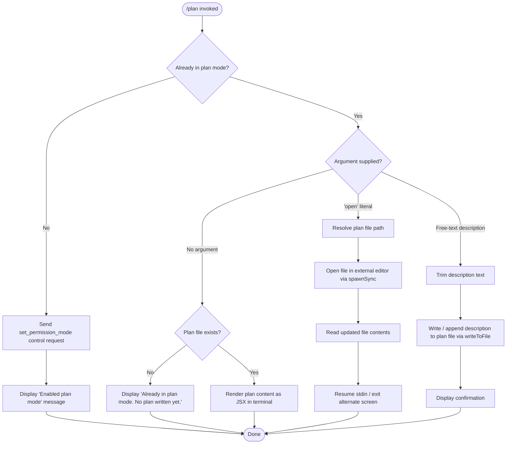

# `/plan`

> Analysis basis: CC v2.1.160 bundle.js (AST extraction + Claude interpretation)
> Minimum version: v2.1.160

---

## Overview

The `/plan` command enables **plan mode** for the current Claude Code session, or — when the session is already in plan mode — displays the existing session plan or opens it in an external editor. It works by sending a `set_permission_mode` control request to the agent, then branching on the current mode state and the argument supplied by the user.

---

## Registration

| Field | Value |
|---|---|
| type | `local-jsx` |
| name | `plan` |
| description | Enable plan mode or view the current session plan |
| argumentHint | `[open\|<description>]` |
| module_id | `Pr1` |
| load_inline | `true` |
| loc_byte | `12256276` |
| loc_byte_end | `12256475` |
| loc_line | `8528` |
| arbor_handler.name | `aWf` |
| arbor_handler.fqn | `claude-2.1.160::aWf` |
| arbor_handler.kind | `AsyncFunction` |
| arbor_handler.resolution_path | `module_id` |
| arbor_handler.n_hits | `0` |

Analysis basis: CC v2.1.160 bundle.js:+12256276

---

## Input Branching

The handler has four or more distinct paths depending on (a) whether the session is already in plan mode, (b) whether the user passed no argument, the literal `open`, or a free-text description, and (c) whether a plan file already exists. A Mermaid flowchart is therefore used.



Analysis basis: CC v2.1.160 bundle.js:+12255150 – +12256053

---

## Behavioral Spec

### Entry point — main handler (`aWf`)

The Arbor-resolved handler is `aWf` (an `AsyncFunction`), reached via `module_id` → `Pr1`.

```
async function planCommandHandler(context):
    sessionState   = readSessionState(context)          // De, K
    permissionMode = resolvePermissionMode(sessionState) // D$

    if not alreadyInPlanMode(permissionMode):
        sendControlRequest(context, "set_permission_mode") // M.sendControlRequest
        displayMessage("Enabled plan mode")                // literal @ +12255426
        return

    // Already in plan mode — branch on argument
    argument = trimArgument(context.args)                  // A.trim @ +12255656

    if argument == "open":                                 // literal @ +12255675
        planFilePath = resolvePlanFilePath(context)        // hZ / yZ / IXH
        openInExternalEditor(planFilePath)                 // CF → Ax1.spawnSync
        updatedContent = readFileSync(planFilePath, "utf-8")
        resumeTerminal(context)                            // CF: resumeStdin, resume
        return

    if argument is non-empty (free-text description):
        writeOrAppendToPlanFile(argument, context)         // rmK → imK / FwA
        displayConfirmation(context)
        return

    // No argument — display current plan
    planContent = loadPlanFileContent(context)             // hZ → yZ → IXH
    if planContent is null or empty:
        displayMessage("Already in plan mode. No plan written yet.") // literal @ +12255834
        return
    renderPlanContent(planContent)                         // BZ.createElement, do9 → HtH
```

Analysis basis: CC v2.1.160 bundle.js:+12255150

---

### Sub-feature: Permission-mode activation (`D$` → `N`)

When the session is not yet in plan mode, the handler dispatches a `set_permission_mode` control request (string literal at +12255388) via `M.sendControlRequest` (+12255358). The underlying permission-state machine (`D$`) validates the mode transition, guarding against `bypassPermissions` if that mode is disabled (literal warning at +4711087). Rule sets — `alwaysAllowRules`, `alwaysDenyRules`, `alwaysAskRules`, `addRules`, `replaceRules`, `removeRules`, `addDirectories`, `removeDirectories` — are all mutated through this path.

```
function applyPermissionModeChange(sessionState, modeRequest):
    if modeRequest.mode == "bypassPermissions" and bypassModeUnavailable:
        log("Ignoring permission update: setMode 'bypassPermissions' rejected …")
        return
    updateRuleSets(sessionState, modeRequest)  // D$.A.set, K.filter, L.has, A.delete
```

Analysis basis: CC v2.1.160 bundle.js:+4711085, +4711087, +4711021

---

### Sub-feature: Plan file path resolution (`hZ` / `yZ` / `IXH`)

```
function resolvePlanFilePath(context):
    sessionId  = lookupSessionId(context)          // IXH → q.get
    baseDir    = joinPaths(context.workDir, ...)   // IXH → eF.join
    sanitized  = sanitizePathComponent(sessionId)  // GY_ → H.replace
    formatted  = formatPathSegments(sanitized)     // vdH → AY6, qA8 → AY6
    filePath   = persistPath(baseDir, formatted)   // IXH → q.set, d6
    return filePath
```

Analysis basis: CC v2.1.160 bundle.js:+13058601 – +13058762

---

### Sub-feature: Opening plan file in external editor (`CF`)

```
function openInExternalEditor(filePath):
    inkInstance = resolveInkInstance()             // CF → ML.get
    if inkInstance is null:
        throw Error("Ink instance not found - cannot pause rendering") // literal @ +11397797
    editorName  = detectEditor(filePath)           // bW, Ge_
    enterAlternateScreen(inkInstance)              // CF → A.enterAlternateScreen
    pauseRendering(inkInstance)                    // CF → A.pause
    suspendStdin(inkInstance)                      // CF → A.suspendStdin
    args         = buildEditorArgs(filePath)       // CF → L.split, f.slice
    result       = spawnSync(editorName, args, {stdio: "inherit"}) // CF → Ax1.spawnSync
    content      = readFileSync(filePath, "utf-8") // CF → _.readFileSync; "utf-8" @ +13059064
    exitAlternateScreen(inkInstance)               // CF → A.exitAlternateScreen
    resumeStdin(inkInstance)                       // CF → A.resumeStdin
    resume(inkInstance)                            // CF → A.resume
    return content
```

Analysis basis: CC v2.1.160 bundle.js:+11397749 – +11398497

---

### Sub-feature: Writing / appending to plan file (`rmK` / `imK`)

```
function writeOrAppendToPlanFile(text, context):
    dir      = dirnameOf(planFilePath)             // rmK → je.dirname
    ensureDir(dir)                                 // imK → Hy.mkdir
    existing = loadCurrentFile(planFilePath)       // gwA → Hy.stat / y6
    if existing and not existing.endsWith(".txt"): // FwA → H.endsWith; ".txt" @ +203195
        renamed = renameToTxt(planFilePath)        // FwA → Hy.rename
    byteLen  = Buffer.byteLength(text)             // rmK → Buffer.byteLength
    appendFile(planFilePath, text)                 // imK → Hy.appendFile
    rotateIfNeeded(planFilePath)                   // FwA → V8 / Hy.unlink
    scheduleFlush(context)                         // rmK → vu6.then, imK.bind
    registerCleanupHook()                          // O9 → HDA.register
```

Analysis basis: CC v2.1.160 bundle.js:+203769 – +204098, +203490 – +203675

---

### Sub-feature: JSX rendering of plan content (`do9` / `HtH`)

When the plan file exists and no argument is given, the handler renders plan content using an Ink/React JSX component tree.

```
function renderPlanContent(content):
    stripped = stripANSI(content)                  // S4 → Bun.stripANSI
    element  = createElement(PlanComponent, {      // HtH → OAH.createElement
                  data: content                    // "data" @ +7882742
               })
    outputStream = resolveOutputStream(context)    // nU → Wo
    render(element, outputStream)                  // HtH → K.on, nU
```

Analysis basis: CC v2.1.160 bundle.js:+7882737 – +7882804

---

### Sub-feature: Tool-list and settings hydration (`hhH` / `um` / `P5H`)

Before returning any UI, the handler hydrates the current allowed-tools list and session settings. This involves iterating `Object.entries` over session tool maps, merging `policySettings`, `flagSettings`, `userSettings`, and `localSettings` (literals at +1232214 – +1232360), and filtering tools by `cliArg` / `--allowed-tools` (literals at +10519183, +10519232).

```
function hydrateSessionContext(sessionState):
    toolEntries  = Object.entries(sessionState.tools)  // P5H → Object.entries
    mergedRules  = applyPermissions(toolEntries)        // P5H → D$
    settingsTier = mergeSettingsTiers([                 // b8 → EQ / RQ6
                     "policySettings",
                     "flagSettings",
                     "userSettings",
                     "localSettings"
                   ])
    filteredTools = filterByCliArgs(mergedRules)        // um → oV1 → AAf
    return { mergedRules, settingsTier, filteredTools }
```

Analysis basis: CC v2.1.160 bundle.js:+10521440, +10530534, +1232211 – +1232360

---

## State & Side Effects

| Item | Detail |
|---|---|
| Telemetry | `tengu_feature_sad` (bundle.js:+966258) — fired on error path within logging/error-formatting utility |
| Control request | Sends `"set_permission_mode"` via `M.sendControlRequest` when activating plan mode (bundle.js:+12255358, +12255388) |
| Plan file I/O | Creates / appends to a per-session plan file via `Hy.mkdir`, `Hy.appendFile`, `Hy.rename`, `Hy.unlink`, `Hy.stat` |
| Cleanup hook | Registers a cleanup handler via `HDA.register` (`O9` path) at bundle.js:+59048 |
| Permission rule-set mutation | Modifies `alwaysAllowRules`, `alwaysDenyRules`, `alwaysAskRules`, `addRules`, `replaceRules`, `removeRules`, `addDirectories`, `removeDirectories` in app state |
| Terminal state | When `open` argument used: enters/exits alternate screen, suspends/resumes stdin, spawns external editor with `stdio: "inherit"` |
| JSX rendering | Renders plan content via Ink/React (`BZ.createElement`, `OAH.createElement`) when displaying plan without `open` |
| ANSI stripping | Output passed through `Bun.stripANSI` before display (bundle.js:+3809078) |
| Timeout management | `setTimeout` / `clearTimeout` / `setImmediate` used in the write-flush pipeline (`QuH`) |

---

## Version History

| Version | Change |
|---|---|
| v2.1.160 | Initial analysis |

---

## Common Mistakes

1. **Running `/plan open` when no plan exists** — the handler checks for file existence before attempting to open; if the file is absent the `ENOENT` code path is reached and the editor is never launched. Create at least a minimal plan description first.
2. **Passing a description argument when already outside plan mode** — the handler only writes a description when plan mode is already active. If the session is not yet in plan mode, the description argument is silently ignored and the command simply activates plan mode.
3. **Expecting `/plan` to persist across sessions** — the plan file path is keyed by session ID (`IXH → q.get/q.set`). A new session produces a new plan file; there is no cross-session inheritance.
4. **`bypassPermissions` mode conflicts** — attempting to activate plan mode while `disableBypassPermissionsMode` is set, or when the session was not launched in `bypassPermissions` mode, causes a silent rejection with a log warning rather than an error surfaced to the user.
5. **Editor detection failure** — the `CF` path calls `bW` and `Ge_` to detect the editor binary. If no recognised editor is found in `PATH`, `spawnSync` will throw and the terminal may be left in alternate-screen state until the cleanup hook fires.

---

## Appendix — Identifier Mapping

> For bundle debugging only. Identifiers change across versions.

| Identifier | Role |
|---|---|
| `aWf` | Main plan command handler (AsyncFunction, Arbor-resolved via module_id `Pr1`) |
| `q` | File-unlink / set utility (calls `ykK.unlinkSync`) |
| `b$` | Secondary init helper (calls `d0H`) |
| `d0H` | Downstream init step invoked by `b$` |
| `De` | Session-state reader called early in handler |
| `K` | Tool-list map helper (calls `L.map`, `f.padEnd`) |
| `L` | Task/stream set manager (add/delete/finally lifecycle) |
| `f` | Stream/connection object (close, toLowerCase) |
| `A` | State/screen object (various terminal and map methods) |
| `D$` | Permission-mode state machine |
| `N` | Logging / debug formatter (calls `Y46`, `lmK`, `SH`, `x4`, `PmH`, `rmK`) |
| `lmK` | Log-level router (calls `_y`, `cmK`, `ADA`) |
| `ADA` | Log appender (calls `lbK`, `nbK`) |
| `H` | HTTP / fetch utility (Bootstrap fetcher, header builder) |
| `o$` | Fetch option builder |
| `Ce` | Feature-flag checker (calls `F64.has`) |
| `wj` | URL normaliser (calls `H.replace`) |
| `gq` | Request dispatcher (calls `GHH`, `K1`, `yP`) |
| `t6` | Response transformer (calls `d`) |
| `SH` | JSON serialiser wrapper (calls `JSON.stringify`) |
| `_` | Generic utility / fs reference (statSync, toUpperCase, etc.) |
| `x4` | Path/argument extractor (calls `xwA`, `H.replace`, `q.at`, `A.lastIndexOf`, `A.slice`) |
| `xwA` | Argument-map builder (calls `BmK.map`) |
| `PmH` | Write-stream helper (calls `ZwA`) |
| `ZwA` | Low-level write wrapper (calls `H.write`) |
| `rmK` | Plan file write orchestrator |
| `QuH` | Async write-queue / flush scheduler |
| `R$H` | File rotation helper (calls `Iu6`, `je.join`, `n8`, `y6`) |
| `d6` | Path join / resolution utility |
| `A46` | File-size checker (calls `G8`) |
| `gwA` | File-stat path builder (calls `je.join`, `y6`) |
| `FwA` | File rename/unlink rotation helper |
| `imK` | mkdir + appendFile writer |
| `O9` | Cleanup hook registrar (calls `HDA.register`) |
| `hM` | String escaper / normaliser (calls `N74`) |
| `N74` | `replaceAll`-based escape helper |
| `hhH` | Session-context hydration entry point |
| `mo_` | Tool-list loader (calls `GQ`, `lE`, `ds8`) |
| `GQ` | Tool-list getter |
| `lE` | Tool-entry resolver (calls `Ro_`, `FQH`, `gq`) |
| `Ro_` | Tool resolver (calls `ZA`) |
| `FQH` | Model-capability checker (calls `aq`, `jA`, `oz6`, `_.includes`) |
| `ds8` | Settings-tier loader (calls `b8`) |
| `b8` | Settings merger (calls `RQ6`, `EQ`) |
| `aS` | Session-arg accessor |
| `P5H` | Permission-entry iterator (calls `Object.entries`, `D$`, `K.map`) |
| `um` | Allowed-tools merger (calls `Object.entries`, `o3`, `yo_`, `N`, `hM`, `oV1`) |
| `o3` | Tool-entry formatter (calls `k74`, `CG`, `y74`, `I74`, `H.substring`) |
| `k74` | Tool-name key extractor |
| `CG` | Own-property checker (calls `Object.hasOwn`) |
| `y74` | Tool-value transformer |
| `I74` | String replacement helper (calls `H.replaceAll`) |
| `yo_` | Tool-path resolver (calls `pRH`, `A.push`, `ko_`, `q.match`) |
| `pRH` | Tool-cache accessor (calls `GV1.get/set`, `jo_`, `Jo_`, `Po_`) |
| `ko_` | Relative-path resolver (calls `VP.includes`, `mO`, `lV1.relative`, `S6`) |
| `oV1` | Session-tool filter (calls `AAf`, `q.get/set`, `M.push`, `D$`) |
| `AAf` | Tool-inclusion checker (calls `jR.includes`) |
| `M` | File-system cleanup set (calls `qC6`, `f.has`, `M0.rm`) |
| `GA6` | Confirmation-message renderer (calls `j$H`, `y6`) |
| `j$H` | Message-component factory |
| `y6` | Path/string utility (calls `zN`) |
| `zN` | Low-level string formatter |
| `hZ` | Plan-file load/open orchestrator (calls `yZ`, `d6`, `V8`, `yH`) |
| `yZ` | Plan-file content reader (calls `IXH`, `y6`, `eF.join`, `DD`) |
| `IXH` | Session-keyed file-path resolver |
| `GY_` | Path sanitiser (calls `H.replace`) |
| `vdH` | Path segment formatter (calls `AY6`) |
| `qA8` | Secondary path formatter (calls `AY6`) |
| `V8` | File-existence checker (calls `G8`) |
| `G8` | Low-level stat/exists helper |
| `yH` | Error/log renderer (calls `d_`, `FH`, `n9`, `T14`, `LUH.push`, `mi.logError`) |
| `d_` | Error constructor wrapper |
| `FH` | String coercion utility |
| `n9` | Log-entry builder (calls `KNA`) |
| `KNA` | Log-format helper (calls `FH`) |
| `T14` | Rolling log buffer (calls `lF6.shift/push`) |
| `CF` | External-editor launcher (full terminal lifecycle) |
| `Fm` | Ink-instance resolver (calls `MY`, `h$f`) |
| `MY` | Ink instance store getter |
| `R$f` | Editor binary resolver (calls `Ge_`) |
| `Ge_` | Editor detection helper (calls `mN8.basename`, `oq`, `N$f.find`, `_.includes`) |
| `oq` | String index/slice utility |
| `bW` | Editor-name normaliser (calls `H.toLowerCase`, `oq`, `CI.basename`, `CIH`) |
| `do9` | JSX render launcher (calls `HtH`, `S4`) |
| `HtH` | Ink render helper (calls `K.on`, `f.toString`, `nU`, `OAH.createElement`) |
| `nU` | Output-stream resolver (calls `QP_`, `_X_`, `Wo`) |
| `_X_` | React element factory wrapper (calls `Weq.createElement`) |
| `Wo` | Stream/writer resolver (calls `FH`, `rcH`) |
| `S4` | ANSI-strip utility (calls `Bun.stripANSI`) |

---

Note: index built via Arbor fallback; some signals (telemetry, literals) may be missing — see arbor-fallback.js.