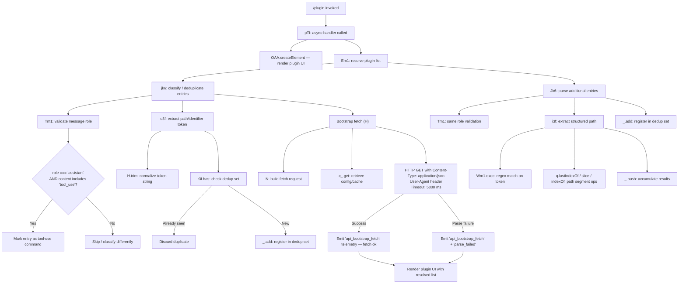

# `/plugin`

> Analysis basis: CC v2.1.160 bundle.js (AST extraction + Claude interpretation)
> Minimum version: v2.1.160

---

## Overview

The `/plugin` command (also accessible as `/plugins` and `/marketplace`) provides an interface for managing Claude Code plugins. It renders a JSX-based UI component that exposes plugin discovery, installation, and lifecycle operations. The command is handled by an async function that renders a React element and delegates plugin-list resolution to subordinate utilities that perform token parsing, deduplication, and bootstrap-fetch operations.

---

## Registration

| Field | Value |
|---|---|
| type | `local-jsx` |
| name | `plugin` |
| description | `Manage Claude Code plugins` |
| aliases | `plugins`, `marketplace` |
| immediate | `true` |
| module_id | `Hs1` |
| load_inline | `true` |
| loc_byte | `12408458` |
| loc_byte_end | `12408748` |
| arbor_handler.name | `pTf` |
| arbor_handler.fqn | `claude-2.1.160::pTf` |
| arbor_handler.kind | `AsyncFunction` |
| arbor_handler.resolution_path | `module_id` |
| arbor_handler.n_hits | `0` |

Analysis basis: CC v2.1.160 bundle.js:+12408458

---

## Input Branching

The command's internal call graph involves three or more distinct paths (plugin-list assembly, token classification, path extraction, and bootstrap fetch), so a Mermaid flowchart is used.



Analysis basis: CC v2.1.160 bundle.js:+12405889, +12405954, +11574460, +11573797, +15451798

---

## Behavioral Spec

### Top-level Handler

The primary handler (`pTf`) is an `AsyncFunction` resolved via the `Hs1` module.

```
async function pluginCommandHandler(context):
    pluginList = await resolvePluginList(context)
    element   = createElement(PluginUIComponent, { plugins: pluginList })
    return element
```

Analysis basis: CC v2.1.160 bundle.js:+12405889 (createElement call), +12405954 (resolvePluginList call)

---

### Plugin List Resolution (`Em1`)

`Em1` orchestrates two sub-passes over the available message history or plugin registry: one via `jk6` (classification + deduplication) and one via `Jk6` (structured-path parsing).

```
async function resolvePluginList(context):
    dedupSet = new Set()
    results  = []

    // Pass 1: classify and deduplicate
    classifiedEntries = classifyAndDeduplicate(context.messages, dedupSet)

    // Pass 2: parse structured paths
    parsedEntries = parseStructuredPaths(context.messages, dedupSet, results)

    return merge(classifiedEntries, parsedEntries)
```

Analysis basis: CC v2.1.160 bundle.js:+11574460, +11574477

---

### Entry Classification and Deduplication (`jk6` / `Tm1` / `o3f`)

`jk6` iterates over message entries. For each entry it:
1. Validates role/content type via `Tm1`.
2. Extracts a normalized path token via `o3f`.
3. Checks the dedup set; discards already-seen entries.

```
function classifyAndDeduplicate(messages, dedupSet):
    output = []
    for entry in messages:
        if isAssistantToolUseMessage(entry):          // Tm1
            token = extractAndNormalizeToken(entry)    // o3f → H.trim
            if not dedupSet.has(token):               // r3f.has
                dedupSet.add(token)                   // _.add
                output.push({ token, kind: "command" })
    return output
```

**Role validation (`Tm1`):**
- Checks `entry.role === "assistant"` (bundle.js:+11573521)
- Verifies `entry.content` is an array (`Array.isArray`) and includes an item with type `"tool_use"` (`zZ.includes`, bundle.js:+11573623)
- Returns `true` only when both conditions hold

**Token extraction (`o3f`):**
- Trims the raw token string (`H.trim`, bundle.js:+11574193)
- Checks the dedup registry (`r3f.has`, bundle.js:+11574271)

Analysis basis: CC v2.1.160 bundle.js:+11573797, +11573534, +11573623, +11574193, +11574271

---

### Structured-Path Parsing (`Jk6` / `i3f`)

`Jk6` runs a second pass that applies regex-based path extraction and index arithmetic to produce structured plugin path objects.

```
function parseStructuredPaths(messages, dedupSet, accumulator):
    for entry in messages:
        if isAssistantToolUseMessage(entry):           // Tm1 (same validation)
            pathRecord = extractStructuredPath(entry)  // i3f
            if pathRecord != null:
                accumulator.push(pathRecord)           // _.push
                dedupSet.add(pathRecord.key)           // _.add
    return accumulator
```

**Path extraction (`i3f`):**

```
function extractStructuredPath(entry):
    match = PATH_REGEX.exec(entry.rawToken)       // Wm1.exec  (index 1)
    if match is null: return null
    lastSep  = rawToken.lastIndexOf(separator)    // q.lastIndexOf
    segment  = rawToken.slice(0, lastSep)         // q.slice
    dotIndex = segment.indexOf(".")               // q.indexOf
    return buildPathRecord(segment, dotIndex)
```

Numeric constants used: index `0` (bundle.js:+11573897), index `1` (bundle.js:+11573937).

Analysis basis: CC v2.1.160 bundle.js:+11573908, +11573956, +11573987, +11574006, +11574051

---

### Bootstrap Fetch (`H`)

The bootstrap fetch function retrieves remote plugin registry data. It is called during list resolution when a cached result is absent.

```
async function bootstrapFetch(url, config):
    log("[Bootstrap] Fetching", url)               // bundle.js:+15451800
    cachedValue = configStore.get(cacheKey)        // c_.get
    if cachedValue is valid: return cachedValue

    response = await httpGet(url, {
        headers: {
            "Content-Type": "application/json",    // bundle.js:+15451885, +15451900
            "User-Agent":   userAgentString        // bundle.js:+15451919
        },
        timeout: 5000                              // bundle.js:+15451991
    })

    try:
        data = parseJSON(response.body)
        emit telemetry("api_bootstrap_fetch")      // bundle.js:+15452112
        log("[Bootstrap] Fetch ok")                // bundle.js:+15452164
        store(cacheKey, data)
        return data
    catch ParseError:
        emit telemetry("api_bootstrap_fetch", { status: "parse_failed" })
                                                   // bundle.js:+15452134
        return fallback
```

- **Timeout**: 5000 ms (bundle.js:+15451991)
- **Content-Type header**: `application/json` (bundle.js:+15451900)
- **User-Agent header**: set to a platform string (bundle.js:+15451919)
- On JSON parse failure the event tag `"parse_failed"` is appended to telemetry (bundle.js:+15452134)

Analysis basis: CC v2.1.160 bundle.js:+15451798, +15451836, +15451932, +15451962, +15451973, +15451976, +15452000, +15452109

---

## State & Side Effects

| Item | Detail |
|---|---|
| Telemetry | `api_bootstrap_fetch` emitted on each bootstrap fetch attempt (bundle.js:+15452112); sub-tag `parse_failed` appended when JSON parse fails (bundle.js:+15452134) |
| Hook registration | None detected in depth-2 traversal |
| appState changes | Dedup `Set` (`_`) updated in place during list resolution; config cache store updated via bootstrap fetch result |
| Network I/O | HTTP GET to bootstrap endpoint; timeout 5000 ms; headers `Content-Type: application/json`, `User-Agent` |
| File I/O | `ykK.unlinkSync` reachable via call-chain through `q` (bundle.js:+15825505) — cleanup path, exact trigger condition not resolved at depth 2 |
| Sound | None detected |
| Rendering | Returns a React element (`OAA.createElement`) for the plugin management UI (bundle.js:+12405889) |

---

## Version History

| Version | Change |
|---|---|
| v2.1.160 | Initial analysis |

---

## Common Mistakes

1. **Using `/plugin` expecting immediate output**: Because `immediate: true` is set, the command fires without waiting for a user-typed argument. Callers should not attempt to pass sub-commands as arguments in the same token — the UI is rendered immediately.
2. **Assuming `/marketplace` and `/plugins` are separate commands**: Both are aliases for `/plugin` and share identical behavior. There is no behavioral difference between them.
3. **Expecting telemetry for every interaction**: The only telemetry events emitted are around the bootstrap fetch. Local plugin operations (deduplication, path parsing) produce no telemetry events.
4. **Ignoring the 5000 ms network timeout**: In slow network environments the bootstrap fetch will abort after 5 seconds; the plugin UI may render with a partial or fallback list rather than failing loudly.
5. **Treating `parse_failed` as a hard error**: When the remote bootstrap response cannot be parsed as JSON, the command does not throw — it emits the `parse_failed` telemetry sub-tag and continues with a fallback value.

---

## Appendix — Identifier Mapping

> For bundle debugging only. Identifiers change across versions.

| Identifier | Role |
|---|---|
| `pTf` | Top-level async handler for `/plugin` command (AsyncFunction, resolved via module_id `Hs1`) |
| `Em1` | Plugin list resolution orchestrator — calls both classify/dedup and structured-path parse passes |
| `jk6` | Entry classifier and deduplicator — validates role, extracts token, checks dedup set |
| `Tm1` | Message role/content-type validator — checks `role === "assistant"` and `content` includes `"tool_use"` |
| `o3f` | Token extraction helper — trims raw token and checks dedup registry |
| `H` | Bootstrap fetch function — performs HTTP GET with headers, timeout, caching, and telemetry |
| `_` | Mutable dedup `Set` / accumulator array (context-dependent, shared across passes) |
| `Jk6` | Structured-path parse pass — applies regex and index arithmetic to produce path records |
| `i3f` | Path extraction helper — regex exec, lastIndexOf/slice/indexOf operations on raw token |
| `q` | File-system / string utility reference — `unlinkSync` cleanup path reachable from here |

---

Note: index built via Arbor fallback; some signals (telemetry, literals) may be missing — see arbor-fallback.js.