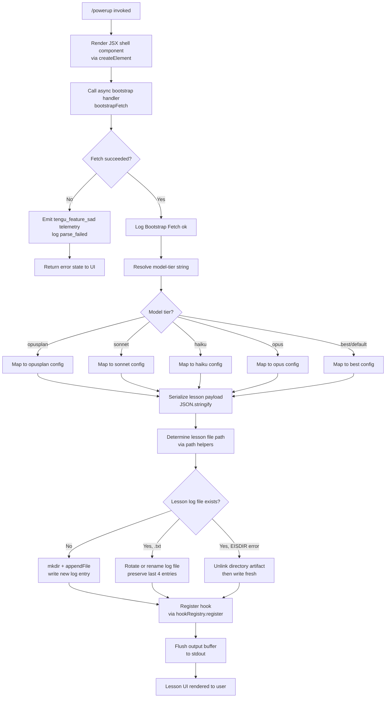

# `/powerup`

> Analysis basis: CC v2.1.160 bundle.js (AST extraction + Claude interpretation)
> Minimum version: v2.1.160

---

## Overview

`/powerup` is an interactive lesson-delivery command that guides users through short, focused discovery experiences covering Claude Code features. It renders a JSX-based UI component and delegates to an async handler that bootstraps lesson content — fetching structured lesson data, selecting and formatting the appropriate model context, and persisting progress — all within a single command invocation.

---

## Registration

| Field | Value |
|---|---|
| type | `local-jsx` |
| name | `powerup` |
| description | `Discover Claude Code features through quick interactive lessons` |
| loc_byte | `11850577` |
| loc_byte_end | `11850757` |
| loc_line | `8150` |
| module_id | `SF1` |
| load_inline | `true` |
| arbor_handler.name | `Pwf` |
| arbor_handler.fqn | `claude-2.1.160::Pwf` |
| arbor_handler.kind | `AsyncFunction` |
| arbor_handler.resolution_path | `module_id` |
| arbor_handler.n_hits | `0` |

Analysis basis: CC v2.1.160 bundle.js:+11850577

---

## Input Branching

The command handler exhibits more than three distinct execution paths: JSX element creation, bootstrap fetch success/failure, lesson content serialization, model-tier selection (opusplan / sonnet / haiku / opus / best), file I/O branches (append vs. rotate vs. unlink), and the telemetry sad-path. A Mermaid flowchart is therefore required.



Analysis basis: CC v2.1.160 bundle.js:+11850451 (JSX entry), +15451800 (bootstrap fetch log), +15452112 (telemetry event `api_bootstrap_fetch`), +966258 (`tengu_feature_sad`)

---

## Behavioral Spec

### 1. Handler Entry — Async JSX Component

The primary handler (`Pwf`, resolved via `module_id` → `SF1`) is an `AsyncFunction`. On invocation it immediately calls `createElement` to instantiate the JSX shell that wraps all subsequent output, then delegates to the bootstrap orchestrator.

```
async function powerupHandler(context):
    shellElement = createElement(LessonShellComponent, context)
    result = await bootstrapOrchestrator(shellElement, context)
    return result
```

Analysis basis: CC v2.1.160 bundle.js:+11850451, +11850486

---

### 2. Bootstrap Fetch

The bootstrap orchestrator logs `[Bootstrap] Fetching` at start and performs an HTTP request. The request carries headers `Content-Type: application/json` and `User-Agent`. A 5000 ms timeout governs the fetch.

```
async function bootstrapOrchestrator(shell, context):
    log("[Bootstrap] Fetching")
    response = await fetchWithTimeout(LESSON_ENDPOINT, {
        headers: {
            "Content-Type": "application/json",
            "User-Agent": userAgentString
        },
        timeoutMs: 5000
    })
    if fetch failed or parse failed:
        emitTelemetry("tengu_feature_sad")
        log("parse_failed")
        return errorState
    log("[Bootstrap] Fetch ok")
    return processLessonPayload(response, context)
```

Analysis basis: CC v2.1.160 bundle.js:+15451800 (`[Bootstrap] Fetching`), +15451885 (`Content-Type`), +15451919 (`User-Agent`), +15451991 (timeout `5000`), +15452134 (`parse_failed`), +15452164 (`[Bootstrap] Fetch ok`)

---

### 3. Model-Tier Resolution

After a successful fetch, the handler resolves which model tier is active. It normalises the tier name to lowercase and matches against a fixed set of known tier strings. Provider type is also checked (`firstParty`, `anthropicAws`, `gateway`, `mantle`).

```
function resolveModelTier(rawModelName):
    normalised = rawModelName.trim().toLowerCase()
    if normalised includes "opusplan":
        return TIER_OPUSPLAN          // literal "[1m]" tag applied
    elif normalised includes "sonnet":
        return TIER_SONNET
    elif normalised includes "haiku":
        return TIER_HAIKU
    elif normalised includes "opus":
        return TIER_OPUS
    else:
        return TIER_BEST              // fallback
```

Analysis basis: CC v2.1.160 bundle.js:+2233688 (toLowerCase), +2233773 (`opusplan`), +2233799 (`[1m]`), +2233814 (`sonnet`), +2233853 (`haiku`), +2233892 (`opus`), +2233929 (`best`)

---

### 4. Lesson Payload Serialisation

The resolved lesson object is serialised with `JSON.stringify` and the byte length is measured via `Buffer.byteLength` before being written to disk.

```
function serializeLessonPayload(lessonObject):
    jsonString = JSON.stringify(lessonObject)
    byteLen = Buffer.byteLength(jsonString)
    return { jsonString, byteLen }
```

Analysis basis: CC v2.1.160 bundle.js:+183798 (`JSON.stringify`), +203943 (`Buffer.byteLength`)

---

### 5. Lesson File Path Resolution

The file path for the lesson log is constructed by joining the base directory with the lesson identifier, then normalised. If a path component ends with `.txt` it is trimmed by 4 characters to strip the extension.

```
function resolveLessonFilePath(baseDir, lessonId):
    fullPath = path.join(baseDir, lessonId)
    if fullPath.endsWith(".txt"):
        fullPath = fullPath.slice(0, fullPath.length - 4)
    return fullPath
```

Constant: extension trim length is `4` characters (bundle.js:+203217). Extension checked: `.txt` (bundle.js:+203195).

Analysis basis: CC v2.1.160 bundle.js:+203184, +203195, +203206, +203217

---

### 6. File Write — Append or Rotate

The file write logic first stats the target path. If the path does not exist the directory is created (`mkdir`) and the content is appended (`appendFile`). If the file exists and is a normal file it is rotated via `rename`. If the existing path is a directory (`EISDIR` error code) the directory entry is unlinked before writing.

```
async function writeOrRotateLessonLog(filePath, content):
    try:
        stat = await fs.stat(filePath)
        if stat is directory (EISDIR):
            await fs.unlink(filePath)
            await fs.mkdir(dirname(filePath), { recursive: true })
            await fs.appendFile(filePath, content)
        else:
            rotatedPath = filePath + ROTATE_SUFFIX
            await fs.rename(filePath, rotatedPath)
            await fs.appendFile(filePath, content)
            maintainRotationWindow(filePath)   // keeps last entries via index
    catch NOT_FOUND:
        await fs.mkdir(dirname(filePath), { recursive: true })
        await fs.appendFile(filePath, content)
```

Constant: `EISDIR` (bundle.js:+174371). Rotation index offset: `2` entries examined at a time (bundle.js:+196379). Filename resolution uses `lastIndexOf` (bundle.js:+196434) and `slice` (bundle.js:+196460).

Analysis basis: CC v2.1.160 bundle.js:+203091 (`stat`), +203247 (`rename`), +203287 (`unlink`), +203490 (`mkdir`), +203549 (`appendFile`), +174371 (`EISDIR`)

---

### 7. Output Buffering and Flush

The write subsystem uses a timer-based flush queue. Items are pushed into a pending buffer. A `setTimeout` schedules the flush at 1000 ms; a secondary threshold at 100 ms triggers an early flush when the buffer accumulates enough items. `setImmediate` is used for zero-delay drain after the flush completes.

```
function scheduleFlush(buffer, item):
    buffer.push(item)
    if pendingFlushTimer exists:
        clearTimeout(pendingFlushTimer)
    if buffer.size >= EARLY_FLUSH_THRESHOLD:   // 100
        flushNow(buffer)
        setImmediate(drain)
    else:
        pendingFlushTimer = setTimeout(flushNow, FLUSH_DELAY_MS)  // 1000

function flushNow(buffer):
    lines = buffer.join(separator)
    stdout.write(lines)
    buffer.clear()
```

Constants: flush delay `1000` ms (bundle.js:+58350); early-flush threshold `100` (bundle.js:+58371).

Analysis basis: CC v2.1.160 bundle.js:+58462 (`clearTimeout`), +58626 (`setTimeout`), +58719 (`setImmediate`), +58661 (`push`), +58350, +58371

---

### 8. Hook Registration

After the lesson is written, the handler registers a hook via the hook registry, associating the lesson session with any subsequent agent turns.

```
function registerLessonHook(sessionId, lessonMeta):
    hookRegistry.register(sessionId, lessonMeta)
```

Analysis basis: CC v2.1.160 bundle.js:+59048 (`HDA.register`)

---

### 9. Command Context — System Role

The handler attaches a `"system"` role string to the outgoing context object, indicating that the lesson content is injected at the system-prompt level.

Analysis basis: CC v2.1.160 bundle.js:+11850499 (`"system"`)

---

### 10. Path Canonicalisation Helpers

Two helper functions build canonical paths used throughout the lesson file I/O:

```
function joinLessonPath(baseDir, segments...):
    return path.join(baseDir, ...segments)

function resolveY6Variant(basePath):
    // secondary path variant used for rotation index
    return path.join(basePath, Y6_SUFFIX)
```

Analysis basis: CC v2.1.160 bundle.js:+203422 (`je.join` in `gwA`), +203435 (`y6`), +204497 (`je.join` in `R$H`), +204521 (`y6`)

---

### 11. Lowercase / Truncation Guard

Before matching model-tier strings, identifiers longer than 40 characters are truncated to ensure safe comparison.

```
function safeModelName(rawName):
    trimmed = rawName.trim()
    if trimmed.length > 40:
        trimmed = trimmed.slice(0, 40)
    return trimmed.toLowerCase()
```

Constant: max identifier length `40` (bundle.js:+15873361).

Analysis basis: CC v2.1.160 bundle.js:+15873287 (`toLowerCase`), +15873361 (`40`)

---

### 12. `anthropic.` Provider Prefix Check

Model identifiers from Anthropic's first-party provider namespace are detected by checking whether the identifier starts with the prefix `"anthropic."`.

```
function isAnthropicNativeModel(modelId):
    return modelId.startsWith("anthropic.")
```

Analysis basis: CC v2.1.160 bundle.js:+2227735 (`"anthropic."`), +2227722 (`startsWith`)

---

## State & Side Effects

| Item | Detail |
|---|---|
| Telemetry | `tengu_feature_sad` (emitted on fetch/parse failure; bundle.js:+966258) |
| Telemetry (named event) | `api_bootstrap_fetch` (logged at bootstrap layer; bundle.js:+15452112) |
| Hook registration | Lesson session registered with `hookRegistry` (`HDA.register`) after successful write; bundle.js:+59048 |
| File system — mkdir | Creates lesson log directory if absent; bundle.js:+203490 |
| File system — appendFile | Appends serialised lesson payload; bundle.js:+203549 |
| File system — rename | Rotates existing lesson log file; bundle.js:+203247 |
| File system — unlink | Removes stray directory artifact at log path (`EISDIR`); bundle.js:+203287 |
| stdout | Lesson UI output flushed via buffered write with 1000 ms delay; bundle.js:+58350 |
| appState changes | System-role context injected; bundle.js:+11850499 |
| Sound | <!-- TODO: not found in depth-2 traversal; needs --depth 4 --> |
| Timeout | 5000 ms fetch timeout; bundle.js:+15451991 |

---

## Version History

| Version | Change |
|---|---|
| v2.1.160 | Initial analysis |

---

## Common Mistakes

1. **Expecting synchronous output** — `/powerup` uses a 1000 ms flush timer and an async fetch with a 5 000 ms timeout. The lesson UI may not appear immediately; do not treat a brief pause as a hang.
2. **Stale `.txt` lesson log files** — If a previous run left a `.txt`-suffixed file at the expected path, the handler strips the extension automatically. Manually placing a directory at that path will trigger an `EISDIR` unlink instead of a normal write.
3. **Model-tier string case sensitivity** — Tier matching is always performed on the lowercase, trimmed form. Passing a model name in mixed case is safe, but names longer than 40 characters are silently truncated before matching.
4. **Assuming first-party-only execution** — The command handles `firstParty`, `anthropicAws`, `gateway`, and `mantle` provider types. Behaviour may differ subtly between provider backends for model-tier resolution.
5. **Invoking in an environment without network access** — The bootstrap fetch is required for lesson content. If the fetch fails (network unavailable, timeout exceeded), the `tengu_feature_sad` event fires and no lesson is rendered.

---

## Appendix — Identifier Mapping

> For bundle debugging only. Identifiers change across versions.

| Identifier | Role |
|---|---|
| `Pwf` | Primary async handler for `/powerup` (arbor_handler) |
| `H` | Bootstrap orchestrator / fetch coordinator |
| `N` | Core lesson-content processor |
| `lmK` | Lesson metadata builder |
| `ADA` | Sub-metadata assembly helper |
| `SH` | JSON serialisation wrapper |
| `x4` | File-path canonicaliser |
| `xwA` | Path segment mapper |
| `q` | File unlink helper (unlinkSync wrapper) |
| `A` | Lowercase normalisation helper |
| `PmH` | stdout write dispatcher |
| `ZwA` | Raw stdout write wrapper |
| `rmK` | Lesson file write orchestrator |
| `QuH` | Output flush queue manager |
| `R$H` | Rotation index helper |
| `d6` | Directory resolver |
| `A46` | EISDIR-aware write guard |
| `gwA` | Path join helper (variant A) |
| `FwA` | Stat-then-rename-or-unlink helper |
| `imK` | mkdir + appendFile writer |
| `O9` | Hook registration dispatcher |
| `o$` | Context state accessor |
| `Ce` | Feature-flag checker |
| `wj` | String replacement utility |
| `gq` | Model-tier resolution entry point |
| `GHH` | Tier-dispatch router |
| `DN` | Tier config builder (variant D) |
| `p9H` | Tier config builder (variant P) |
| `lQ` | Model-string parser and token splitter |
| `K1` | Canonical model-name resolver |
| `C0` | Provider-type resolver |
| `DKH` | Model exclusion-list checker |
| `dN` | Model descriptor builder (variant d) |
| `_gH` | Model descriptor builder (variant _g) |
| `tT` | First-party model constructor |
| `XDq` | First-party model wrapper |
| `xM` | Base model object factory |
| `xa6` | Model allow-list checker |
| `AgH` | Model finaliser |
| `yP` | Model-tier pipeline coordinator |
| `R0` | Full model resolution pipeline |
| `t6` | Telemetry event emitter |
| `d` | `tengu_feature_sad` telemetry sink |

---

Note: index built via Arbor fallback; some signals (telemetry, literals) may be missing — see arbor-fallback.js.