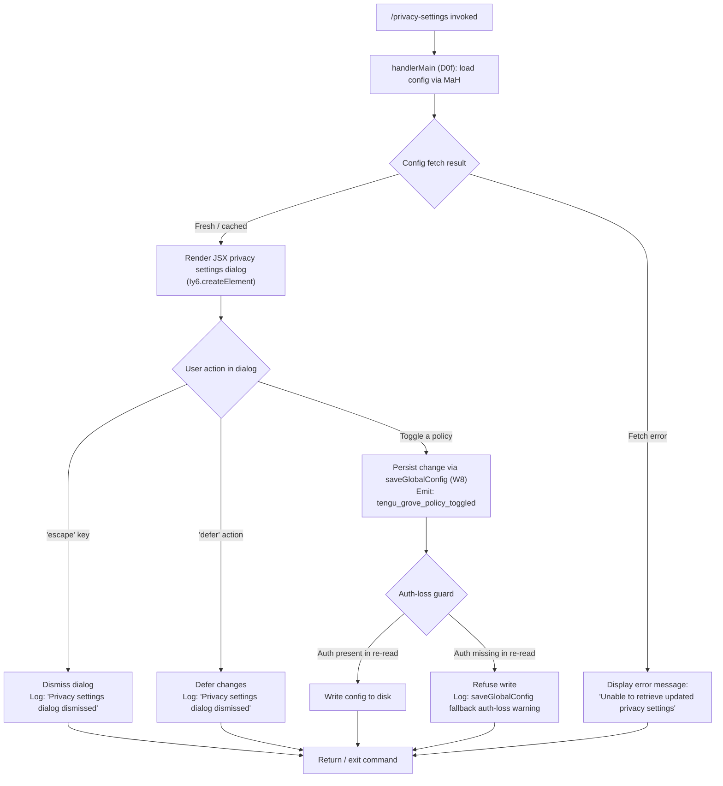

# `/privacy-settings`

> Analysis basis: CC v2.1.160 bundle.js (AST extraction + Claude interpretation)
> Minimum version: v2.1.160

---

## Overview

The `/privacy-settings` command opens an interactive dialog that allows the user to view and update their privacy preferences within Claude Code. It is implemented as a `local-jsx` command, meaning it renders a JSX-based UI element directly in the terminal rather than dispatching a text prompt to the model. The handler loads current privacy configuration, presents a settings panel, and persists any changes the user makes back to the global config file.

---

## Registration

| Field | Value |
|---|---|
| type | `local-jsx` |
| name | `privacy-settings` |
| description | `View and update your privacy settings` |
| module_id | `mr1` |
| load_inline | `true` |
| loc_byte | `12279366` |
| loc_byte_end | `12279558` |
| arbor_handler.name | `D0f` |
| arbor_handler.fqn | `claude-2.1.160::D0f` |
| arbor_handler.kind | `AsyncFunction` |
| arbor_handler.resolution_path | `module_id` |
| arbor_handler.n_hits | `0` |

Analysis basis: CC v2.1.160 bundle.js:+12279366

---

## Input Branching

The command has 4+ distinct branches: normal display, escape/dismiss, defer, settings retrieval failure, and policy toggle. A Mermaid flowchart is used.



---

## Behavioral Spec

### Main Handler — `handlerMain` (`D0f`)

The handler is an `AsyncFunction` resolved via `module_id → mr1` (Arbor resolution path: `module_id`).

```
async function handlerMain(context):
    // 1. Parallel initialisation
    await Promise.all([
        fetchConfigViaGrove(context),   // MaH
        loadCurrentIdentity(context)    // IJH / Ra
    ])

    // 2. Obtain current config state
    settings = await getGlobalConfig()  // H

    // 3. Render interactive settings dialog
    element = createJSXElement(          // Iy6.createElement
        PrivacySettingsDialog,
        {
            settings: settings,          // literal "settings" @ +12278967
            onEscape: handleDismiss,     // literal "escape"  @ +12278533
            onDefer:  handleDefer,       // literal "defer"   @ +12278547
            onToggle: handleToggle
        }
    )

    // 4. Handle dismissal (escape or defer)
    if action in ["escape", "defer"]:
        log("Privacy settings dialog dismissed")   // +12278558
        return

    // 5. Handle policy toggle
    if action == "toggle":
        emitTelemetry("tengu_grove_policy_toggled") // +12278906
        persistConfig(newSettings, type="system")   // literal "system" @ +12278603
```

Analysis basis: CC v2.1.160 bundle.js:+12278370, +12279013

---

### Config Fetch via Grove Cache — `groveConfigFetch` (`MaH`)

The Grove subsystem manages a time-based cache for remote configuration. Three cache states are handled:

```
function groveConfigFetch(context):
    now = Date.now()                                // +6941281

    if cacheIsMissing():
        log("Grove: No cache, fetching config in background (dialog skipped this session)")
        // +6941307
        fetchConfigInBackground(R6)
        return cachedData = null

    elif cacheIsStale(now):
        log("Grove: Cache stale, returning cached data and refreshing in background")
        // +6941427
        fetchConfigInBackground(R6)
        return cachedData   // stale but non-null

    else:
        log("Grove: Using fresh cached config")     // +6941533
        return cachedData
```

Analysis basis: CC v2.1.160 bundle.js:+6941213, +6941387

---

### Global Config Read — `readGlobalConfig` (`H6H` → `z1`)

```
function readGlobalConfig():
    raw = readFileWithLock()          // z1 → bD
    parsed = validateAndNormalize(raw)
    // Recognised plan literals: "max" (+3008184), "pro" (+3008195)
    checkApiKeyPresence()             // bD inspects "ANTHROPIC_API_KEY" (+2986630)
    checkApiKeyHelper()               // literal "apiKeyHelper" (+2986655)
    return parsedConfig
```

Analysis basis: CC v2.1.160 bundle.js:+6941192, +3008222

---

### Save Global Config with Lock — `saveGlobalConfig` (`W8`)

This function guards against data loss, specifically protecting authentication credentials from being silently overwritten. Identified via guard literal at +3242911.

```
function saveGlobalConfig(newConfig):
    // Determine installation context
    installState = classifyInstallation()
    // States: "unknown", "local", "migrated", "native",
    //         "installed", "disabled", "enabled",
    //         "no_permissions", "global", "not_configured"
    // (+3243364 … +3243570)

    reRead = readCurrentConfigFromDisk()

    if reRead.auth is missing AND cache.auth is present:
        log("saveGlobalConfig fallback: re-read config is missing auth "
            "that cache has; refusing to write. See GH #3117.")   // +3242911
        return  // refuse write

    acquireLock(timeout=60000)            // +3246452
    if lockTookTooLong:
        emitTelemetry("tengu_config_lock_contention")  // +3245771

    if configIsStale:
        emitTelemetry("tengu_config_stale_write")      // +3245907

    if authLossPrevented:
        emitTelemetry("tengu_config_auth_loss_prevented") // +3246250

    writeAtomically(newConfig)            // xY_ → copyFileSync, unlinkSync
    rotateSafeguardBackups(keepCount=5)   // +3246701
```

Analysis basis: CC v2.1.160 bundle.js:+3242704, +3242885

---

### Config File I/O — `configFileRead` (`ZDH`)

```
function configFileRead(path):
    if accessForbiddenBeforeAllowed:
        throw Error("Config accessed before allowed.")   // +3247715

    try:
        raw = fs.readFileSync(path, encoding="utf-8")   // +3247798
    except ENOENT:                                       // +3247945
        return defaultConfig

    try:
        parsed = JSON.parse(raw)
    except ParseError:
        emitTelemetry("tengu_config_parse_error")        // +3248346
        log("error", ...)                                // +3248266
        backupCorruptFile()                              // VY.basename, fs.copyFileSync

    if needsMkdir:
        fs.mkdirSync(dir)                                // EEXIST tolerated +3248560

    return parsed
```

Analysis basis: CC v2.1.160 bundle.js:+3247709, +3248196

---

### Log-Write Subsystem — `logWriter` (`rmK` / `N`)

The logging pipeline is reached transitively from `N` (logger dispatcher). Key behaviour:

```
function logWriter(level, message, ...args):
    if level == "debug":                 // +204223
        // may be suppressed in production
        pass

    entry = formatLogEntry(level, message.toUpperCase(), ...args)
    // Redacts sensitive values with "[REDACTED]"  // +196350
    // Truncates tokens to length 2 then appends …  // +2 @ +196379

    writeToRotatingFile(entry)           // rmK → FwA → Hy.appendFile
    // Rotation: max 1000 ms window, 100 entry threshold  // +58350, +58371
    // Files suffixed ".txt"  // +203195
    // Backup slice of 4 chars  // +203217
```

Analysis basis: CC v2.1.160 bundle.js:+204247, +203736

---

### Error Display — `errorRenderer` (`d`)

When the config fetch fails, the command surfaces the message:

> `"Unable to retrieve updated privacy settings"` (literal @ +12278684)

This is rendered as a system-type message (literal `"system"` @ +12278603) in the UI rather than crashing the command.

Analysis basis: CC v2.1.160 bundle.js:+12278904

---

## State & Side Effects

| Item | Detail |
|---|---|
| Telemetry: `tengu_grove_policy_toggled` | Emitted when the user successfully toggles a privacy policy setting (bundle.js:+12278906) |
| Telemetry: `tengu_config_parse_error` | Emitted when the on-disk config JSON cannot be parsed (bundle.js:+3248346) |
| Telemetry: `tengu_config_lock_contention` | Emitted when acquiring the config write-lock takes longer than expected (bundle.js:+3245771) |
| Telemetry: `tengu_config_stale_write` | Emitted when a stale config write is detected (bundle.js:+3245907) |
| Telemetry: `tengu_config_auth_loss_prevented` | Emitted when a write is refused because the re-read config is missing auth credentials that are present in cache (bundle.js:+3246250) |
| Telemetry: `tengu_feature_sad` | Emitted on unexpected feature-level error (bundle.js:+966258) |
| appState changes | Privacy policy toggles are persisted to the global config file (`~/.claude.json`) via the locked write path |
| Config write guard | Refuses to overwrite config if auth credentials would be lost (GH #3117 guard, bundle.js:+3242911 and +3246098) |
| Config backup rotation | Up to 5 timestamped backup copies of the config are retained; files prefixed `.backup.` (bundle.js:+3246568, +3246701) |
| Lock timeout | Config write-lock acquisition timeout: 60 000 ms (bundle.js:+3246452) |
| Log file max entry buffer | 1 000 ms window / 100 entry threshold before flush (bundle.js:+58350, +58371) |
| Log file extension | `.txt` (bundle.js:+203195) |
| Bootstrap fetch timeout | 5 000 ms (bundle.js:+15451991) |
| Hook registration | `O9` calls `HDA.register` (bundle.js:+59048) — standard exit-handler registration |
| File watch | `ojL` sets up `DA8.watchFile` / `DA8.unwatchFile` on the config path during Grove background refresh (bundle.js:+3244100, +3244433) |
| Sound | None detected in depth-2 traversal |

---

## Version History

| Version | Change |
|---|---|
| v2.1.160 | Initial analysis |

---

## Common Mistakes

1. **Expecting a model response** — `/privacy-settings` is a `local-jsx` command; it renders a UI panel, not a text reply from the AI model. Do not invoke it expecting conversational output.
2. **Running while another Claude instance holds the config lock** — Concurrent Claude Code sessions compete for the write-lock on `~/.claude.json`. If the lock takes longer than expected, the `tengu_config_lock_contention` event fires and the write may be delayed or skipped.
3. **Assuming auth settings survive a crash mid-write** — The auth-loss guard (`GH #3117`) prevents silent credential erasure, but a crash between backup creation and atomic rename can leave a `.backup.*` file. Check for stale backups if config appears corrupted.
4. **Treating "defer" and "escape" differently** — Both actions result in the same dismissal log message (`"Privacy settings dialog dismissed"`) and produce no config change; neither action persists a policy toggle.
5. **Expecting instant propagation of Grove-policy changes** — When the Grove cache is stale, the config is refreshed in the background. A change toggled immediately after launch may race with the background refresh.

---

## Appendix — Identifier Mapping

> For bundle debugging only. Identifiers change across versions.

| Identifier | Role |
|---|---|
| `D0f` | Main async handler for `/privacy-settings` (arbor_handler) |
| `MaH` | Grove config fetch coordinator (cache-aware, background refresh) |
| `H6H` | Global config read entry point |
| `z1` | Config read with lock and validation |
| `g9_` | Config field getter (sub-helper of `z1`) |
| `F9_` | Config field setter or transformer (sub-helper of `z1`) |
| `bD` | API-key / auth presence checker inside config read |
| `EA` | Config validation / array-include check |
| `IR` | Array membership check utility |
| `uSq` | Config normalisation utility (called from `H6H`) |
| `fL` | Config field loader (called from `MaH`) |
| `R6` | Background config fetch executor (file I/O + watch setup) |
| `d6` | Low-level file descriptor / path resolver |
| `hY_` | Config path helper |
| `ZDH` | Config file read with parse-error guard and backup |
| `ojL` | File-watch setup/teardown for config path |
| `N` | Logger dispatcher (formats and routes log entries) |
| `lmK` | Log formatter sub-routine |
| `ADA` | Log sink initialiser |
| `H` | Bootstrap fetch / HTTP utility (also used as array reference in some contexts) |
| `o$` | HTTP response handler |
| `Ce` | Feature-flag set membership check |
| `wj` | String replacement utility (used in log formatting) |
| `gq` | URL / header builder |
| `t6` | Feature-error reporter |
| `SH` | JSON serialiser wrapper |
| `_` | Generic underscore utility / identity/transform helper |
| `x4` | Sensitive-value redaction utility |
| `xwA` | Token-map builder for redaction |
| `q` | File-system module reference (Node `fs`) |
| `A` | String normalisation helper (toLowerCase context) |
| `PmH` | Terminal write helper |
| `ZwA` | Raw terminal output writer |
| `rmK` | Log write-to-file pipeline (rotating append) |
| `QuH` | Log flush scheduler (setTimeout/setImmediate batching) |
| `R$H` | Log entry finaliser and path joiner |
| `A46` | EISDIR error guard for log directory |
| `gwA` | Log file path builder |
| `FwA` | Log file rotation handler (stat / rename / unlink) |
| `imK` | Log file append with mkdir-on-demand |
| `O9` | Exit-hook registrar (`HDA.register`) |
| `Ob9` | Grove cache state machine (stale / fresh / missing branches) |
| `W8` | Save-global-config with auth-loss guard and lock |
| `xY_` | Atomic config write with backup rotation |
| `SdH` | Installation-state classifier entry point |
| `lQq` | Object.entries iterator for install-state map |
| `RdH` | Timestamp helper for backup filenames |
| `fY6` | Config merge / defaults applicator |
| `d` | UI renderer / error display component |
| `bY_` | Config write-path helper with dirname resolution |
| `M` | Plugin / staging-path resolver and cleanup |
| `qC6` | Plugin name sanitiser and path validator |
| `KC6` | Plugin base-path builder |
| `L` | Async resource tracker (add/delete/finally) |
| `f` | Resource cleanup handler (close + unref) |

---

Note: index built via Arbor fallback; some signals (telemetry, literals) may be missing — see arbor-fallback.js.