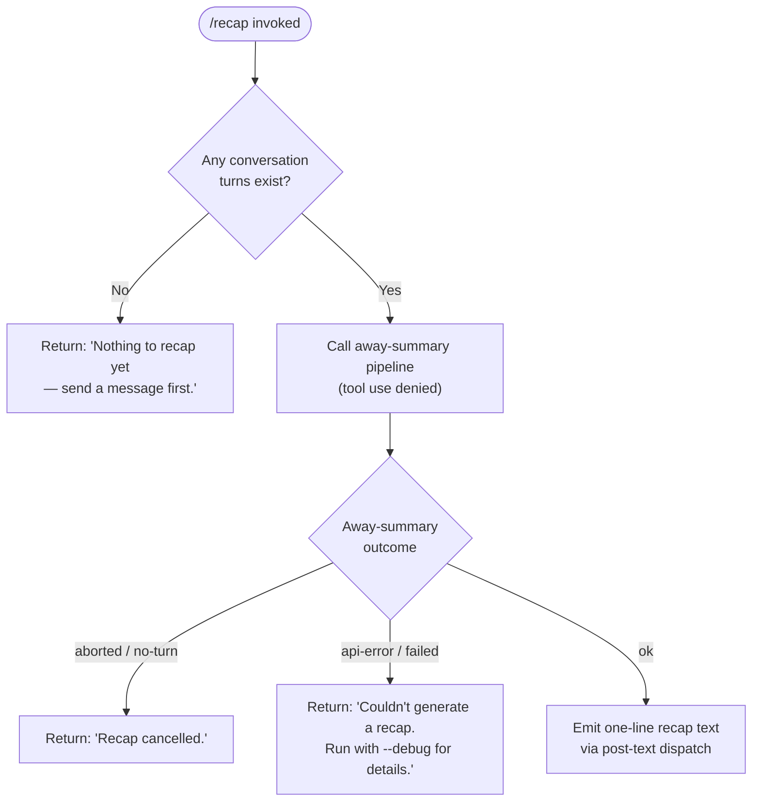

# `/recap`

> Analysis basis: CC v2.1.160 bundle.js (AST extraction + Claude interpretation)
> Minimum version: v2.1.160

---

## Overview

The `/recap` command triggers an immediate, on-demand generation of a single-line summary of the current session. It invokes the away-summary pipeline in a restricted mode (no tool use permitted) and emits the result as a post-text message. When no conversation turns exist yet, it short-circuits with a canned message rather than calling the model.

---

## Registration

| Field | Value |
|---|---|
| type | `local` |
| name | `recap` |
| description | `Generate a one-line session recap now` |
| loc_byte | `12791774` |
| loc_byte_end | `12791990` |
| loc_line | `9310` |
| supportsNonInteractive | `false` |
| thinClientDispatch | `post-text` |
| load_inline | `true` |
| load_ident | `SIf` |
| arbor_handler.name | `SIf` |
| arbor_handler.kind | `AsyncFunction` |
| arbor_handler.fqn | `claude-2.1.160::SIf` |
| arbor_handler.resolution_path | `load_ident` |
| arbor_handler.n_hits | `0` |

Analysis basis: CC v2.1.160 bundle.js:+12791774

---

## Input Branching

The handler has four distinct outcome branches depending on session state and model result.



Analysis basis: CC v2.1.160 bundle.js:+12791524, +12791616, +12791674, +12791382

---

## Behavioral Spec

### Top-level Handler (`SIf`)

```
async function recapHandler(context):
    result = await awaySummaryRunner(context)

    if result is null or no conversation turns exist:
        return userMessage("Nothing to recap yet — send a message first.")

    if result.status in ["aborted", "no-turn"]:
        return userMessage("Recap cancelled.")

    if result.status in ["api-error", "other", "failed"]:
        return userMessage("Couldn't generate a recap. Run with --debug for details.")

    // status == "ok"
    return postText(result.summary)
```

Analysis basis: CC v2.1.160 bundle.js:+12791382, +12791524, +12791616, +12791674

### Away-Summary Runner (`pM8`)

```
async function awaySummaryRunner(context):
    cacheSafeParams = loadCacheSafeParams()

    if cacheSafeParams is null:
        log("debug", "[awaySummary] no CacheSafeParams saved, skipping")
        return null   // triggers "Nothing to recap yet" path

    abortController = new AbortController()
    context.signal.addEventListener("abort", () => abortController.abort())

    summaryResult = await runAwayQuery(cacheSafeParams, abortController.signal)

    // summaryResult carries a status field:
    //   "no-turn"   — nothing queued
    //   "abort"     — user cancelled
    //   "deny"      — tools were blocked (always the case here)
    //   "other"     — unexpected failure
    //   "away_summary" / "ok" — success with text
    //   "aborted"   — stream aborted
    //   "api-error" — network / API failure

    match summaryResult.status:
        case "no-turn":
            return { status: "no-turn" }
        case "abort", "aborted":
            return { status: "aborted" }
        case "api-error":
            return { status: "api-error" }
        case "ok", "away_summary":
            return { status: "ok", summary: summaryResult.text }
        default:
            return { status: "other" }
```

Analysis basis: CC v2.1.160 bundle.js:+5434116, +5434137, +5434195, +5434251, +5434428, +5434443, +5434496, +5434511, +5434655, +5434744, +5434805

### Away-Query Core (`N` / `runAwayQuery`)

```
async function runAwayQuery(params, signal):
    // Build message list from current conversation history
    messages = buildMessageList(params)

    // Enforce tool-use denial for recap context
    toolPolicy = "deny"
    toolDenyReason = "Away summary cannot use tools"

    // Normalise role strings (uppercase conversion applied)
    // Write context to session log (ZwA)
    // Register a debounced session-writer (rmK → QuH)

    // Call model via streaming pipeline (N → V1f → Y.callModel)
    streamResult = await callModelStream(messages, {
        tools: [],
        toolPolicy: toolPolicy,
        signal: signal
    })

    return streamResult
```

Analysis basis: CC v2.1.160 bundle.js:+204223, +204247, +204265, +204287, +204305, +204349, +204369, +204372, +204388, +204394, +204408

### Session-File Writer (`rmK`)

```
async function sessionFileWriter(conversationDir, turnData):
    targetDir  = path.dirname(conversationDir)
    filePath   = buildFilePath(targetDir)        // gwA
    byteLength = Buffer.byteLength(serialized)

    if file exists:
        rotateLegacyIfNeeded(filePath)           // FwA — renames .txt → rotated, unlinks old
    else:
        await fs.mkdir(targetDir, { recursive: true })

    await fs.appendFile(filePath, serialized)
    updateFileSizeTracker(byteLength)            // A46 → G8

    registerCleanupHook(filePath)               // O9 → HDA.register
```

Analysis basis: CC v2.1.160 bundle.js:+203736, +203761, +203769, +203798, +203813, +203888, +203905, +203937, +203943, +203976, +203993, +204002, +204098

### Model-Call Pipeline (`V1f`)

The `V1f` function is the shared query-execution kernel used by both the main REPL loop and auxiliary callers such as `/recap`. Key steps observed in the call graph at depth ≤ 2:

```
async function modelCallKernel(params):
    // Phase 1 — setup
    emit("query_setup_start")
    loadConversationState()        // bI1, SI1
    resolveModel()                 // Q7, x2
    buildSystemPrompt()            // w39, tRH
    emit("query_setup_end")

    // Phase 2 — auto-compact check
    if tokenBudgetNearLimit():
        emit("query_autocompact_start")
        await runAutoCompact()
        emit("query_autocompact_end")

    // Phase 3 — API streaming loop
    emit("query_api_loop_start")
    loop:
        emit("query_api_streaming_start")
        stream = await Y.callModel(request)
        processStreamEvents(stream)
        emit("query_api_streaming_end")

        if toolsRequested and toolPolicy == "deny":
            injectDenyResult()
            continue

        break

    // Phase 4 — finalise
    persistResults()
    return outcome
```

Analysis basis: CC v2.1.160 bundle.js:+10746496, +10747325, +10747352, +10747384, +10747917, +10748215, +10750164, +10750353, +10751223, +10751317, +10757090, +10751366

---

## State & Side Effects

| Item | Detail |
|---|---|
| Telemetry (query layer) | `tengu_auto_compact_rapid_refill_breaker`, `tengu_auto_compact_succeeded`, `tengu_ptl_surfaced_to_user`, `tengu_refusal_fallback_prompt_shown`, `tengu_refusal_fallback_prompt_choice`, `tengu_refusal_fallback_triggered`, `tengu_orphaned_messages_tombstoned`, `tengu_model_fallback_triggered`, `tengu_query_error`, `tengu_model_response_keyword_detected`, `tengu_malformed_tool_use_response`, `tengu_stop_hook_block_count`, `tengu_loop_dynamic_wakeup_ends_turn`, `tengu_post_autocompact_turn`, `tengu_query_before_attachments`, `tengu_query_after_attachments`, `tengu_mcp_tools_refreshed_mid_turn` |
| Telemetry (feature health) | `tengu_feature_ok` (bundle.js:+966123), `tengu_feature_bad` (bundle.js:+966181), `tengu_feature_sad` (bundle.js:+966258) |
| Telemetry (forked-agent path) | `tengu_forked_agent_default_turns_exceeded` (bundle.js:+10791308), `tengu_fork_agent_query` (bundle.js:+10791751) |
| Tool use | Explicitly denied for the recap invocation; model receives policy `"deny"` with reason `"Away summary cannot use tools"` (bundle.js:+5434443) |
| Session log | `rmK` appends turn serialisation to the session file via `fs.appendFile`; creates directories as needed; rotates `.txt` legacy files (bundle.js:+203549, +203195) |
| Hook registration | `O9 → HDA.register` registers a cleanup hook for the session file path (bundle.js:+204098, +59048) |
| AbortController wiring | A new `AbortController` is created; parent signal's `abort` event is forwarded to it so cancellation propagates (bundle.js:+5434232, +5434263) |
| appState changes | `aT8` reads `getAppState` and calls `setAppState` during the query lifecycle (bundle.js:+10787287, +10788067) |
| Sound | <!-- TODO: not found in depth-2 traversal; needs --depth 4 --> |
| Debounce timers | `QuH` uses `clearTimeout` / `setTimeout` / `setImmediate` for debounced session-write flushing (bundle.js:+58462, +58626, +58719) |
| thinClientDispatch | Result text is dispatched as `post-text` (registration field) |

---

## Version History

| Version | Change |
|---|---|
| v2.1.160 | Initial analysis |

---

## Common Mistakes

1. **Running `/recap` before sending any message** — The handler short-circuits immediately with `"Nothing to recap yet — send a message first."` if no cached conversation parameters (`CacheSafeParams`) are found. No model call is made.
2. **Expecting tool use in the recap** — The away-summary pipeline unconditionally sets tool policy to `"deny"`. Any model attempt to invoke a tool is rejected with `"Away summary cannot use tools"`. The recap will never execute shell commands or file reads.
3. **Expecting interactivity** — `supportsNonInteractive` is `false`, so `/recap` must be invoked from an active interactive session; it cannot be driven via `--print` / non-interactive piped input.
4. **Misinterpreting `"Recap cancelled."`** — This message covers both explicit user-abort (Ctrl+C) and the internal `"no-turn"` / `"abort"` status codes from the streaming layer. It does not necessarily mean the user pressed cancel; the stream may simply have been aborted programmatically.
5. **Assuming instant output** — The recap goes through the full model-streaming pipeline (`V1f` / `Y.callModel`), including potential auto-compact checks. On a large context, the response may take several seconds.

---

## Appendix — Identifier Mapping

> For bundle debugging only. Identifiers change across versions.

| Identifier | Role |
|---|---|
| `SIf` | Top-level `/recap` async handler (arbor_handler; entry point via `load_ident`) |
| `pM8` | Away-summary orchestrator; wires AbortController, dispatches to query runner |
| `L_H` | CacheSafeParams loader (called by `pM8`) |
| `N` | Core away-query builder: assembles messages, applies tool-deny policy, invokes session writer and model |
| `lmK` | Message-list normaliser / role formatter |
| `ADA` | Role-string canonicaliser used inside `lmK` |
| `o$` | HTTP User-Agent / Content-Type header builder |
| `Ce` | Feature-flag / capability set checker |
| `wj` | String replace helper (URL / path sanitisation) |
| `gq` | JSON body assembler for API requests |
| `t6` | Logging utility (`d` wrapper) |
| `SH` | `JSON.stringify` wrapper |
| `x4` | Working-directory / path extractor |
| `xwA` | File-map iterator used by `x4` |
| `PmH` | Session-log write helper |
| `ZwA` | Raw file writer (`H.write` wrapper) |
| `rmK` | Session-file manager: mkdir, appendFile, rotate, register cleanup hook |
| `QuH` | Debounced flush scheduler (setTimeout / setImmediate) |
| `R$H` | Turn-record serialiser |
| `d6` | Directory-existence checker |
| `A46` | File-size tracker updater |
| `gwA` | Session file-path builder (`path.join` + `y6`) |
| `FwA` | Legacy file rotator (`fs.stat`, `fs.rename`, `fs.unlink`) |
| `imK` | Session-file append worker (mkdir + appendFile + rotate) |
| `O9` | Cleanup-hook registrar (`HDA.register`) |
| `a0` | Forked-agent query runner (called via `pM8` → model path) |
| `aT8` | Main query executor: appState read/write, model call, result dispatch |
| `jh` | Abort-signal propagation helper |
| `ULH` | Context loader/dumper (`ZC`, `_.load`, `H.dump`) |
| `IYH` | Pre-query context validator |
| `$39` | Token-budget / context-window calculator |
| `vV8` | Rapid-refill circuit-breaker check |
| `hh` | Random-bytes generator (`qR9.randomBytes`) |
| `sT8` | Post-query state updater |
| `nAH` | Notification / background-task dispatcher |
| `n4` | Hook-registration helper (calls `O9`) |
| `WRH` | Message filter for provider routing (`DS8`, `ZS8`, `fSf`) |
| `Zm` | Turn-wrapper: calls `V1f` and `s$8` |
| `V1f` | Model-call kernel: setup → auto-compact → streaming loop → finalise |
| `s$8` | Session-cache invalidator (`uu.get`, `uu.delete`, `fy_.delete`) |
| `hH` | Logger helper (`d` wrapper, `tengu_feature_ok`) |
| `RH` | Logger helper (`d` wrapper, `tengu_feature_bad`) |
| `gN6` | Feature-flag map lookup (`wAf.has`) |
| `JqH` | Post-turn notification emitter |
| `Dv8` | Compact-boundary marker |
| `fv1` | Conditional feature-flag re-checker |
| `Y` | Process-exit / abort orchestrator (forced-shutdown path) |
| `LJ` | Shutdown logger |
| `z` | Daemon-stop coordinator |
| `E7H` | Background-task set manager |
| `pj` | Background-task predicate |
| `R47` | Task-list searcher |
| `L` | Promise-tracking set (add / finally / delete) |
| `d` | Core logging primitive |
| `x1f` | Forked-agent result formatter |
| `I8` | IPC / subprocess session spawner (`mv.randomUUID`, `J`) |
| `P` | IPC message-frame reader / writer |
| `J` | IPC connection holder |
| `w` | Background-session pool manager (spawn, SIGKILL, memory checks) |
| `i5` | IPC write helper (`H.end`, `SH`) |
| `k85` | PTY / session lifecycle controller (resize, repaint, snapshots, leases) |
| `GH` | String coercion helper |
| `RW9` | Message flat-map transformer |