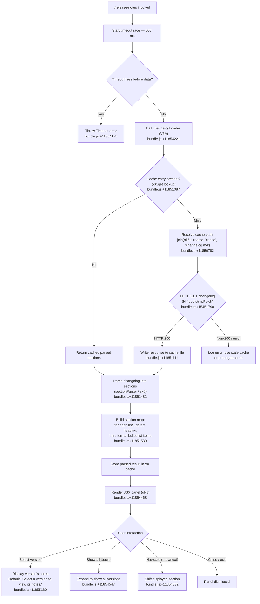

# `/release-notes`

> Analysis basis: CC v2.1.160 bundle.js (AST extraction + Claude interpretation)
> Minimum version: v2.1.160

---

## Overview

`/release-notes` opens an interactive, version-browsable panel that displays the bundled changelog for Claude Code. The command fetches or reads a cached `changelog.md` file, parses it into per-version sections, and renders them inside a columnar JSX component. Users can navigate between versions and read the release notes without leaving the CLI session.

---

## Registration

| Field | Value |
|---|---|
| type | `local-jsx` |
| name | `release-notes` |
| description | `View release notes` |
| loc_byte | `11855901` |
| loc_byte_end | `11856042` |
| loc_line | `8155` |
| module_id | `QF1` |
| load_inline | `true` |
| arbor_handler.name | `Ewf` |
| arbor_handler.fqn | `claude-2.1.160::Ewf` |
| arbor_handler.kind | `AsyncFunction` |
| arbor_handler.resolution_path | `module_id` |
| arbor_handler.n_hits | `0` |

Analysis basis: CC v2.1.160 bundle.js:+11855901

---

## Input Branching

The command has several distinct branches: (1) fast-path timeout/fallback, (2) cache hit vs. network fetch for the changelog, (3) successful parse vs. parse failure, and (4) UI interaction branches (version selection, "Show all" toggle, version navigation). A Mermaid flowchart is used.



---

## Behavioral Spec

### Handler Entry — `asyncReleaseNotesHandler` (`Ewf`)

The Arbor-resolved handler is `Ewf` (AsyncFunction), reached via `module_id → QF1`.

```
async function asyncReleaseNotesHandler(context):
    timeoutPromise = new Promise((_, reject) =>
        setTimeout(() => reject(new Error("Timeout")), 500)
    )
    // bundle.js:+11854157, +11854175, +11854193

    result = await Promise.race([
        changelogLoader(context),   // V6A
        timeoutPromise
    ])
    // bundle.js:+11854207

    sectionData = parseSections(result)   // nI8
    // bundle.js:+11854258

    return renderPanel(sectionData)       // Iw / JSX component
    // bundle.js:+11854289
```

Analysis basis: CC v2.1.160 bundle.js:+11854157

---

### Changelog Loader — `changelogLoader` (`V6A`)

```
async function changelogLoader(context):
    asyncStore = localStore.getStore()   // L1 → vyL.getStore
    // bundle.js:+11851165

    cacheDir  = path.dirname(ok6.dirname(...))
    cachePath = join(cacheDir, "cache", "changelog.md")
    // bundle.js:+11850782, +11850804

    cached = xX.get(cachePath)
    if cached exists:
        return cached
    // bundle.js:+11851087

    timestamp = Date.now()
    // bundle.js:+11851226

    response = await bootstrapFetch(...)   // H (bootstrapFetch)
    // bundle.js:+15451798

    if response.status != 200:
        handle error
    // bundle.js:+11851111

    rawText = await response.text()

    configManager.saveWithLock(cachePath, rawText)   // W8
    // bundle.js:+11851237

    return rawText
```

The `bootstrapFetch` helper (`H`) sets the following request headers:
- `Content-Type: application/json` (bundle.js:+15451885 / +15451900)
- `User-Agent` (bundle.js:+15451919)

A 5000 ms timeout guard also exists in the bootstrap fetch layer (bundle.js:+15451991), separate from the 500 ms outer race timeout (bundle.js:+11854193).

Analysis basis: CC v2.1.160 bundle.js:+11851042

---

### Section Parser — `sectionParser` (`nI8`) and `lineParser` (`sk6`)

```
function parseSections(rawText):
    lines = rawText.split("\n")           // sk6 → H.split
    // bundle.js:+11851481

    sections = {}
    currentVersion = null
    currentLines   = []

    for line in lines:
        trimmed = line.trim()             // sk6 → q.trim
        // bundle.js:+11851530

        if trimmed is a version heading:
            if currentVersion != null:
                sections[currentVersion] = currentLines

            // Extract version string using oq (indexOfSlicer)
            // Separator: " - "  (bundle.js:+11851612)
            versionKey = extractVersion(trimmed)   // oq
            currentVersion = versionKey
            currentLines   = []
        else:
            // Format bullet items; prepend "- " prefix (bundle.js:+11851690)
            formatted = formatBulletLine(trimmed)  // K.slice
            // bundle.js:+11851647
            currentLines.push(formatted)

    if currentVersion != null:
        sections[currentVersion] = currentLines

    return sections

function extractVersion(heading):
    idx    = heading.indexOf(" - ")       // oq → H.indexOf
    // bundle.js:+193841
    return heading.slice(0, idx)          // oq → H.slice
    // bundle.js:+193870
```

```
function buildSectionDisplay(sections):
    keys = Object.keys(sections)          // nI8 → Object.keys
    // bundle.js:+11852151

    filtered = keys.filter(...)           // nI8 → K.filter
    // bundle.js:+11852251

    renderedItems = filtered.map(renderVersionRow)   // nI8 → yH / d_
    // bundle.js:+11852349

    return renderedItems
```

Analysis basis: CC v2.1.160 bundle.js:+11851481

---

### JSX Panel Renderer — `renderPanel` (`gF1`)

```
function renderPanel(sectionData):
    // Layout uses a "column" flex direction (bundle.js:+11855122)

    initialLimit = 20     // bundle.js:+11854474
    pageSize     = 3      // bundle.js:+11854630

    versionList  = sectionData.versions.slice(0, initialLimit)
    // FF1 → H.slice   bundle.js:+11854032

    selectedIdx  = null   // default: no version selected

    onSelect(idx):
        selectedIdx = idx
        display sectionData.sections[idx]

    onShowAll():
        // renders "Show all" button (bundle.js:+11854547)
        versionList = sectionData.versions  // all entries

    onNavigate(direction):
        if direction == "skip":             // bundle.js:+11854852
            move selectedIdx by page
        else:
            selectedIdx += direction

    placeholderText = "Select a version to view its notes."
    // bundle.js:+11855189

    panelTitle = "Release notes"
    // bundle.js:+11855573

    return JSX column panel:
        header: panelTitle
        left:   versionList (scrollable, limit 20)
        right:  selectedVersion notes or placeholderText

    // React memo cache uses sentinel indices 7, 9, 10, 11–19
    // bundle.js:+11854922, +11855003, +11855031, +11855048
```

The list entries are formatted with `_.map` and `v6A` (bundle.js:+11853957), and version-row rendering calls `FF1` which slices via `H.slice` and delegates display to the `Iw` component (bundle.js:+11854058).

Analysis basis: CC v2.1.160 bundle.js:+11854468

---

### Config / Cache Management — `configSaveWithLock` (`W8`)

The changelog cache is written to disk via the same config-locking mechanism used by global settings. Key properties:

- Lock acquisition timeout: 60,000 ms (bundle.js:+3246452)
- Maximum backup copies retained: 5 (bundle.js:+3246701)
- Backup file suffix pattern: `.backup.` (bundle.js:+3246568)
- File permissions for new temp files: `0o600` / decimal 384 (bundle.js:+3246983)
- Auth-loss guard: if the re-read config is missing auth fields that the in-memory cache holds, the write is aborted with a log warning referencing GH #3117 (bundle.js:+3246098, +3242911)

Analysis basis: CC v2.1.160 bundle.js:+3242704

---

## State & Side Effects

| Item | Detail |
|---|---|
| Telemetry — `tengu_feature_sad` | Fired when a feature flag is evaluated negatively (bundle.js:+966258) |
| Telemetry — `tengu_config_lock_contention` | Fired when the config lock takes longer than expected (bundle.js:+3245771) |
| Telemetry — `tengu_config_stale_write` | Fired when a stale config write is detected and aborted (bundle.js:+3245907) |
| Telemetry — `tengu_config_parse_error` | Fired when config JSON fails to parse (bundle.js:+3248346) |
| Telemetry — `tengu_config_auth_loss_prevented` | Fired when a write would have erased auth credentials (bundle.js:+3246250) |
| Cache write | `changelog.md` written to the `cache/` subdirectory of the config directory via `configSaveWithLock` (`W8`) |
| Lock | In-process config lock acquired via `HDA.register` (`O9 → HDA.register`, bundle.js:+59048); cleared with `clearTimeout` in `QuH` (bundle.js:+58462) |
| Timers | Outer 500 ms race timeout (bundle.js:+11854193); inner bootstrap-fetch 5000 ms timeout (bundle.js:+15451991) |
| Filesystem | `Hy.stat`, `Hy.rename`, `Hy.unlink` used for atomic file rotation (bundle.js:+203091, +203247, +203287); `Hy.mkdir` / `Hy.appendFile` for appending writes (bundle.js:+203490, +203549) |
| Sound | <!-- TODO: not found in depth-2 traversal; needs --depth 4 --> |
| appState changes | <!-- TODO: not found in depth-2 traversal; needs --depth 4 --> |

---

## Version History

| Version | Change |
|---|---|
| v2.1.160 | Initial analysis |

---

## Common Mistakes

1. **Expecting live network data on first invocation** — The command reads from a local cache file (`cache/changelog.md`) when one exists. The network fetch only happens on a cache miss. Stale cache entries will show outdated notes.
2. **Assuming the 500 ms timeout is generous** — The outer race timeout is only 500 ms (bundle.js:+11854193). On a slow filesystem or cold-start, the panel may timeout before the changelog loads. The underlying bootstrap fetch has a separate 5-second guard and will still complete in the background to warm the cache.
3. **Running `/release-notes` in non-interactive mode** — The command renders a JSX panel intended for interactive terminal use. Piped or headless sessions will not display the panel correctly.
4. **Misreading the version list limit** — The initial display caps at 20 versions (bundle.js:+11854474). Use the "Show all" button to see the full list; it is not displayed by default.
5. **Modifying the cache file manually** — The config-lock mechanism may abort writes if it detects auth-field loss during re-read. Manually editing `changelog.md` in the cache directory could corrupt related config state if the path overlaps with config backup logic.

---

## Appendix — Identifier Mapping

> For bundle debugging only. Identifiers change across versions.

| Identifier | Role |
|---|---|
| `Ewf` | Async release-notes handler (Arbor-resolved entry point) |
| `V6A` | Changelog loader (cache lookup + network fetch orchestrator) |
| `FF1` | Version-row renderer helper (slices and formats a single changelog entry) |
| `v6A` | Version list mapper (maps raw version keys to display rows) |
| `gF1` | JSX panel renderer (full release-notes UI component) |
| `nI8` | Section builder (filters, maps, and returns rendered section list) |
| `sk6` | Line-by-line changelog parser (splits raw text, detects headings, formats bullets) |
| `oq` | Version-string extractor (indexOf + slice on " - " separator) |
| `Z6A` | Cache path builder (joins dirname + "cache" + "changelog.md") |
| `L1` | Async local-store accessor (vyL.getStore wrapper) |
| `W8` | Config save-with-lock (atomic write + backup rotation) |
| `xY_` | Core config-file writer (mkdirSync, copyFileSync, unlinkSync, backup management) |
| `ZDH` | Config file reader (readFileSync, JSON parse, copy-on-read) |
| `bY_` | Config atomic-write helper (If6 wrapper for safe file replacement) |
| `If6` | Safe file-write primitive (temp file + fchmod + fsync + rename) |
| `lQq` | Config entries iterator (Object.entries over config map) |
| `RdH` | Config timestamp recorder (Date.now stamp on writes) |
| `SdH` | Config serialiser / diff helper |
| `qYq` | Config object merger (R4_ + Object.assign) |
| `fY6` | Config field accessor / validator |
| `uY_` | Backup-path builder (join + n8 counter) |
| `rmK` | Append-log writer (QuH + R$H orchestration, Buffer.byteLength gating) |
| `QuH` | Buffered write scheduler (clearTimeout / setTimeout / setImmediate flush loop) |
| `R$H` | Log-line formatter (Iu6, je.join, n8, y6) |
| `gwA` | Log directory path builder (je.join + y6) |
| `FwA` | Log file rotator (Hy.stat + .txt check + Hy.rename + Hy.unlink) |
| `imK` | Log file appender (Hy.mkdir + Hy.appendFile + rotation) |
| `A46` | Log level gate / formatter |
| `d6` | Path-existence / error-code checker |
| `O9` | Process-exit / lock hook registrar (HDA.register) |
| `H` | Bootstrap fetch helper (HTTP GET with Content-Type / User-Agent headers) |
| `N` | HTTP response handler (status check, header inspection, body parse) |
| `lmK` | Response body reader / decoder |
| `ADA` | JSON body parser (lbK + nbK) |
| `SH` | JSON.stringify wrapper |
| `x4` | URL builder / query-string formatter |
| `xwA` | Query-parameter mapper (BmK.map) |
| `PmH` | Stream writer (ZwA → H.write) |
| `Ce` | Feature-flag checker (F64.has) |
| `wj` | Path sanitiser (H.replace) |
| `gq` | Markdown / model-name parser orchestrator |
| `GHH` | Top-level markdown section splitter (DN, p9H, ZA, lQ) |
| `lQ` | Markdown block tokeniser (heading detection, bullet handling) |
| `K1` | Model-name normaliser (trim, toLowerCase, token mapping) |
| `C0` | Model-name lookup table (wKH) |
| `DKH` | Disallowed-token checker (zKH.includes) |
| `dN` | Model sub-type resolver (xM + Jf) |
| `_gH` | Model alias expander (Jf) |
| `tT` | Model capability tester (xM + Jf + jA) |
| `XDq` | Model default selector (tT wrapper) |
| `xM` | Provider-type resolver (jA) |
| `xa6` | Model inclusion checker (Ss4.includes) |
| `AgH` | Model formatter (FH) |
| `yP` | Model-resolution pipeline (K1 + R0) |
| `R0` | Full model-descriptor builder (EA, IHH, MzH, qgH, tT, FX, xM, jA, Jf, dN) |
| `t6` | App-state writer (`d`) |
| `f` | Connection / socket lifecycle manager (A.close, q.close, L) |
| `L` | Active-request set manager (q.add, q.delete, f.finally) |
| `n9` | Traffic-category resolver (KNA) |
| `KNA` | Network-flag formatter (FH) |
| `FH` | String coercer (String()) |
| `W8` | (see configSaveWithLock above) |
| `ak6` | Secondary changelog accessor (Z6A + L1 path) |
| `lI8` | Section-list initialiser |
| `yH` | Row renderer with error boundary (d_, FH, n9, T14, LUH.push) |
| `d_` | Error normaliser (Error + String coercion) |
| `T14` | Render-queue manager (lF6.shift + lF6.push) |
| `aHK` | Telemetry event emitter ($r, Date.now, L1, ny6, SH) |
| `$` | Telemetry batch collector (aHK) |
| `K` | Column padding formatter (L.map + f.padEnd) |
| `o$` | App-context accessor |
| `G8` | EISDIR / filesystem-error handler |
| `V8` | Filesystem fallback handler |
| `Iw` | Ink/React JSX component for a single version row |
| `d` | App-state read/write primitive |

---

*Note: index built via Arbor fallback; some signals (telemetry, literals) may be missing — see arbor-fallback.js.*