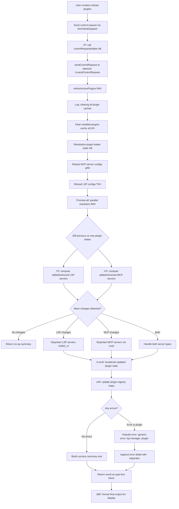

# `/reload-plugins`

> Analysis basis: CC v2.1.160 bundle.js (AST extraction + Claude interpretation)
> Minimum version: v2.1.160

---

## Overview

`/reload-plugins` activates any pending plugin changes within the current Claude Code session without requiring a full restart. It achieves this by clearing all plugin-related caches, re-scanning and resolving plugin definitions from disk, restarting affected MCP and LSP servers, and emitting a summary of the changes to the UI. The command dispatches a `control-request` to the thin-client layer before performing its work and is not available in non-interactive (CI/scripted) contexts.

---

## Registration

| Field | Value |
|---|---|
| type | `local` |
| name | `reload-plugins` |
| description | `Activate pending plugin changes in the current session` |
| supportsNonInteractive | `false` |
| thinClientDispatch | `control-request` |
| module_id | `Os1` |
| load_inline | `true` |
| loc_byte | `12412307` |
| loc_byte_end | `12412526` |
| loc_line | `8741` |
| arbor_handler.name | `iTf` |
| arbor_handler.fqn | `claude-2.1.160::iTf` |
| arbor_handler.kind | `AsyncFunction` |
| arbor_handler.resolution_path | `module_id` |
| arbor_handler.n_hits | `0` |

Analysis basis: CC v2.1.160 bundle.js:+12412307

---

## Input Branching

The command handler (`iTf`) follows multiple distinct paths depending on what changed between the previous and current plugin states. Five or more outcome branches exist (cache clear → reload → diff results → server reconciliation → result rendering), so a flowchart is used.



Analysis basis: CC v2.1.160 bundle.js:+12411329 (handler entry `iTf`), +12409213 (cache-clear log), +12409322 (`Promise.all`), +12410302 (`lc.emit`), +12411769 (`x5H`), +12411812 (`d8H`)

---

## Behavioral Spec

### 1. Handler Entry and Control Handshake (`iTf`)

```
async function reloadPluginsHandler(context):
    send controlRequest to daemon
        via: controlRequestHelper(context)         // b$
        calls: A.sendControlRequest                // loc_byte 12411366
    await refreshActivePlugins(context)            // fWH
    await updatePluginRegistry(context)            // x5H
    return formatOutput(context)                   // d8H
```

The handler is an `AsyncFunction` resolved by Arbor via `module_id` path on module `Os1`.
Analysis basis: CC v2.1.160 bundle.js:+12411329

---

### 2. Plugin Cache Refresh (`fWH` — `refreshActivePlugins`)

```
async function refreshActivePlugins(context):
    log("refreshActivePlugins: clearing all plugin caches")   // loc_byte 12409215
    await clearInstalledPluginsCache()              // aX1 → N
        // logs "Cleared installed plugins cache"   // loc_byte 9878638
    await reinitPluginLoader()                      // m$
        clearSkillIndexCache()                      // du → H.clearSkillIndexCache
        clearPendingPluginCache()                   // Wa → PG8.clear
    await reloadMcpConfigs()                        // pR9, $81, uj
    await reloadLspConfigs()                        // ThH
        // reads *.lsp.json files                   // loc_byte 8257570
    await Promise.all([
        resolveAllPluginSources(),                  // Ga
        resolveAllDependencies(),                   // WZ
    ])
    diffedLspChanges    = computeLspDiff()          // lTf
    diffedMcpChanges    = computeMcpDiff()          // nTf
    reconcileServers(diffedLspChanges, diffedMcpChanges)
        // H28 (LSP stop/start), O_H (MCP stop/start)
    emitPluginStateUpdate()                         // lc.emit  loc_byte 12410302
```

Analysis basis: CC v2.1.160 bundle.js:+12409213, +12409267, +12409273, +12409322, +12409872, +12409905, +12410031, +12410302

---

### 3. Installed-Plugins Cache Clear (`aX1` / `N`)

```
async function clearInstalledPluginsCache():
    // Delegates to the generic plugin-list fetcher N with cache-bust flag
    log("Cleared installed plugins cache")          // loc_byte 9878638
    // N uses HTTP with headers:
    //   Content-Type: application/json             // loc_byte 15451900
    //   User-Agent: <cli user-agent>
    // Timeout: 5000 ms                             // loc_byte 15451991
```

Analysis basis: CC v2.1.160 bundle.js:+9878636, +15451885

---

### 4. Plugin Source Resolution (`Ga`)

```
async function resolveAllPluginSources(context):
    sources = collectSourceDefinitions()            // IiH, PB
    for each source in sources:
        if source.path ends with ".mcpb":           // loc_byte 5222448
            processArchive(source)                  // hX6
        elif source.path ends with ".dxt":          // loc_byte 5222469
            processExtension(source)
        elif source is ".mcp.json":                 // loc_byte 6725951
            parseJsonConfig(source)                 // Py_ → m6 (JSON.parse)
        else:
            readFileConfig(source)
    return mergedSourceMap
```

Key file extensions handled: `.mcpb`, `.dxt`, `.mcp.json`, `.lsp.json`.
Analysis basis: CC v2.1.160 bundle.js:+6725940, +5222448, +5222469, +8257570

---

### 5. Dependency Resolution and Registry Update (`x5H`)

```
async function updatePluginRegistry(resolvedPlugins):
    for each plugin in resolvedPlugins:
        existing = registry.get(plugin.id)          // _.get  loc_byte 11579272
        registry.set(plugin.id, plugin)             // _.set  loc_byte 11579308
        activeSet.add(plugin.id)                    // $.add  loc_byte 11579330

        if plugin.hasDependencies:
            deps = resolveDependencies(plugin)      // j2 → NP6
                // classifies errors as:
                //   "dependency-unsatisfied"       // loc_byte 11579208
                //   "not-found"                    // loc_byte 11579245
                //   "dependency-resolution"        // loc_byte 11580219

        loadPluginDefinition(plugin)                // kE → ov_ → za
            // reads from plugin dir               // loc_byte 9871079
            // reads marketplace.json             // loc_byte 9871096

        if plugin.isVersioned:
            validateVersion(plugin)                 // yf8
                // uses semver: valid, coerce, satisfies  // loc_bytes 5032044–5032098
```

Analysis basis: CC v2.1.160 bundle.js:+11579272, +11579208, +11579245, +11580219, +9871079

---

### 6. Diff Computation (`lTf`, `nTf`)

```
function computeLspDiff(previous, current):
    added   = current.filter(p => !previous.has(p.id))     // lTf: H.filter, q.has
    removed = previous.filter(p => !current.has(p.id))
    // Filters server type: "lsp-manager"                   // loc_byte 12410717
    return { added, removed }

function computeMcpDiff(previous, current):
    added   = current.filter(p => !previous.has(p.id))     // nTf: H.filter, q.has
    removed = previous.filter(p => !current.has(p.id))
    // Filters server type: "plugin:"                       // loc_byte 12410752
    return { added, removed }
```

Analysis basis: CC v2.1.160 bundle.js:+12410692 (`lTf`), +12410967 (`nTf`)

---

### 7. Result Formatting and Output (`d8H`)

```
function formatOutput(results):
    lines = results.map(r => {
        prefix = r.serverType         // "plugin MCP server" or "plugin LSP server"
        status = r.status             // "error", "text"
        if r.hasError:
            return prefix + " · " + r.errorDetail   // separator " · " loc_byte 12411579
        else:
            return prefix + " ok"
    })
    // Truncate to first 5 items if list is large   // loc_byte 5035718
    return { type: "text", content: lines.join("\n") }
```

String constants used in output assembly:
- `"plugin MCP server"` — Analysis basis: CC v2.1.160 bundle.js:+12411552
- `"plugin LSP server"` — Analysis basis: CC v2.1.160 bundle.js:+12412045
- `" · "` — Analysis basis: CC v2.1.160 bundle.js:+12411579
- `"error"` type — Analysis basis: CC v2.1.160 bundle.js:+12411634
- `"text"` type — Analysis basis: CC v2.1.160 bundle.js:+12411709

---

### 8. MCP Server Reconciliation (`mX6`)

```
async function reconcileMcpServers(diff):
    for each removed server in diff.removed:
        stopServer(server)                          // z.set, J.add
        cleanupProcessHandles(server)               // w → S.kill, R.dispose
    for each added server in diff.added:
        validateSourcePath(server)                  // xX6
        resolveServerConfig(server)                 // XZ → gl_
        startServer(server)                         // C → AyK → Iu8.stat
        registerInRegistry(server)                  // T.set, YH.set
    updateConnectionState(diff)                     // WH, ZH
    // Errors classified as:
    //   "blocked-by-policy"                        // loc_byte 5245242
    //   "resolution-failed"                        // loc_byte 5246488
    //   "dependency-blocked-by-policy"             // loc_byte 5246607
    //   "generic-error"                            // loc_byte 12410864
```

Analysis basis: CC v2.1.160 bundle.js:+5246879, +5245242, +5246488, +12411769

---

## State & Side Effects

| Item | Detail |
|---|---|
| Telemetry | `tengu_feature_ok` (loc_byte 966123), `tengu_feature_bad` (loc_byte 966181), `tengu_feature_sad` (loc_byte 966258), `tengu_daemon_control` (loc_byte 15883547), `tengu_daemon_config_reload` (loc_byte 15862022), `tengu_mcp_list_changed` (loc_byte 15639354), `tengu_skill_file_changed` (loc_byte 13974724), `tengu_harbor` (loc_byte 8712573) |
| Control dispatch | Sends a `control-request` to the daemon before executing plugin reload logic (thinClientDispatch field) |
| Cache invalidation | Clears installed-plugins cache (`PG8.clear`), skill index cache (`H.clearSkillIndexCache`), and the internal plugin loader state |
| MCP servers | Stops removed servers (process kill), starts newly-added servers (spawns via `Hg.spawn`), updates tool list |
| LSP servers | Stops removed LSP servers, starts newly added LSP servers, re-reads `.lsp.json` configs |
| Event emission | `lc.emit` broadcasts updated plugin state to all listeners (loc_byte 12410302) |
| Plugin registry maps | `YH`, `T`, `z`, `J`, `$H` are mutated to reflect new plugin set |
| Filesystem reads | `.mcp.json`, `.lsp.json`, `manifest.json`, `marketplace.json`, `.claude-plugin/`, `plugin.json` |
| Non-interactive | Command is blocked (`supportsNonInteractive: false`) — cannot run in CI or headless mode |
| Telemetry control event | `"ccr"` (loc_byte 12411347), event name `"reload_plugins"` (loc_byte 12411396) |

---

## Version History

| Version | Change |
|---|---|
| v2.1.160 | Initial analysis |

---

## Common Mistakes

1. **Running in non-interactive mode**: `/reload-plugins` sets `supportsNonInteractive: false`. Invoking it in a script or CI pipeline will fail or be silently skipped. Use an interactive terminal session.
2. **Expecting immediate MCP tool availability**: After reload, MCP servers must re-handshake and re-register their tool lists. New tools may not appear instantaneously; wait for the `tools/list_changed` notification cycle to complete.
3. **Editing plugin files while reload is in progress**: The reload sequence reads configs, diffs state, and then restarts servers in distinct async phases. Modifying a plugin config file mid-reload may cause the new state to be missed until the next reload.
4. **Confusing `/reload-plugins` with a full restart**: The command reuses existing daemon infrastructure. Some low-level daemon state (e.g., background session pools) is not reset. A full `claude` process restart is still needed for changes that affect daemon startup configuration.
5. **Ignoring the `" · "` separator in error output**: When a plugin fails to load, the result line is formatted as `<server-type> · <error-detail>`. Parsing scripts that split on space rather than ` · ` will misparse error messages.

---

## Appendix — Identifier Mapping

> For bundle debugging only. Identifiers change across versions.

| Identifier | Role |
|---|---|
| `iTf` | Main handler for `/reload-plugins` (AsyncFunction, Arbor-resolved) |
| `b$` | Control-request helper — wraps the daemon IPC handshake |
| `d0H` | IPC transport utility called by control-request helper |
| `fWH` | `refreshActivePlugins` — orchestrates full plugin cache flush and reload |
| `N` | Generic plugin-list fetcher / HTTP bootstrap utility |
| `lmK` | Plugin list loader with retry and normalization |
| `ADA` | Plugin list post-processor (calls `lbK`, `nbK`) |
| `aX1` | Installed-plugins cache invalidator |
| `m$` | Plugin loader state reinitializer |
| `du` | Skill-index cache clearer |
| `Bi7` | Plugin loader core (orchestrates `i0`, `ik_`, `yH`, etc.) |
| `xC` | Plugin context factory (calls `du`, `VG8`, `hX1`, `jRH`) |
| `Wa` | Plugin pending-cache clearer (`PG8.clear`) |
| `QX6` | Plugin module resolver helper |
| `pR9` | MCP config reloader |
| `$81` | MCP config parser helper |
| `uj` | MCP server connection refresher |
| `Y_` | Async-util (calls `zN`) |
| `Ga` | Plugin source collector — scans `.mcp.json`, `.mcpb`, `.dxt` |
| `IiH` | Source-list builder |
| `PB` | Source path validator (checks `.mcpb`, `.dxt` endings) |
| `YQ` | Plugin source normalizer |
| `Py_` | JSON config file parser for MCP entries |
| `m6` | JSON.parse wrapper with error handling |
| `Dh9` | Plugin download-status evaluator |
| `hX6` | `.mcpb` archive extractor and manifest reader |
| `GH` | String coercion helper |
| `ThH` | LSP config loader (reads `.lsp.json`) |
| `fh7` | LSP plugin file validator and parser |
| `Lh7` | LSP path resolver (relative/absolute check) |
| `aHK` | Daemon-status JSON writer (`daemon.status.json`) |
| `ny6` | Status-file path builder |
| `L1` | Async-store accessor (`vyL.getStore`) |
| `O` | Background-session state container |
| `lTf` | LSP diff calculator (added/removed LSP servers) |
| `$s1` | LSP diff helper |
| `nTf` | MCP diff calculator (added/removed MCP servers) |
| `x5H` | Plugin registry updater (mutates registry maps) |
| `hI` | Plugin detail loader |
| `Q5` | Known-marketplaces reader (`known_marketplaces.json`) |
| `yG8` | Marketplace file path builder |
| `LIH` | Plugin entry iterator |
| `b8` | Plugin definition builder |
| `RQ6` | Plugin source validator |
| `EQ` | Plugin record constructor |
| `JZ` | Error factory for plugin errors |
| `QA` | Scope parser (`project` / `user` / `managed`) |
| `j2` | Dependency resolver entry point |
| `s$9` | Source-string parser (extracts protocol, path) |
| `NP6` | Dependency graph walker |
| `Hf8` | Policy-settings checker for dependencies |
| `t$9` | Host-pattern policy matcher |
| `e$9` | Path-pattern policy matcher |
| `NQL` | Dependency resolution composer |
| `F8H` | Policy-settings fetcher for plugin install |
| `_39` | Alternative dependency resolution path |
| `a$9` | Dependency node builder |
| `za` | Plugin directory reader (`.claude-plugin/marketplace.json`) |
| `Iv6` | Marketplace-entry loader |
| `Bl_` | Marketplace JSON parser with Zod schema |
| `kE` | Plugin definition file reader (orchestrates `ov_`, `Q5`, `Lv`) |
| `ov_` | Plugin-dir file reader |
| `AOf` | Plugin active-set membership checker |
| `mX6` | MCP server reconciler — stops removed, starts added servers |
| `yW` | Plugin install-scope validator |
| `n58` | Scope-aware dependency installer |
| `K56` | Local path prefix validator (`./`) |
| `z` | MCP server registry map |
| `hH` | Daemon feature-flag helper |
| `RH` | Daemon config-reload helper |
| `Qy` | Daemon process event emitter |
| `_p` | Daemon shutdown sequencer |
| `S6` | Async-local-store context reader |
| `sF6` | Store accessor with fallback |
| `XZ` | Server config loader (`gl_`, `Ql_`) |
| `gl_` | Server config file reader (sync) |
| `Ql_` | Server config entry iterator |
| `J` | Active-server set (MCP) |
| `w` | Background-session process manager |
| `T` | Server-config Map |
| `kN6` | Server-config key normalizer |
| `Yu8` | Server connection-state tracker |
| `qv` | Version range validator |
| `vI` | Version info fetcher |
| `yf8` | Semver constraint checker (`valid`, `coerce`, `satisfies`) |
| `E` | Event-listener registry for UI |
| `b` | UI event base handler |
| `x0` | User-settings accessor for remote-control flag |
| `D` | Supervisor/daemon writer |
| `HO9` | Plugin install policy enforcer |
| `M` | Plugin policy state set |
| `zV` | Flag-settings manager |
| `a16` | Flag-settings entry builder |
| `X` | MCP server connection runner |
| `d_` | Error string converter |
| `C` | MCP server filesystem validator |
| `AyK` | Filesystem stat/realpath checker |
| `SO` | MCP server socket opener |
| `l85` | MCP server startup logger |
| `p` | Output stream writer with timeout |
| `IP9` | Plugin-load queue manager |
| `R` | Rate-limit event emitter |
| `Wn1` | Rate-limit tracker |
| `y` | Readable stream enqueuer |
| `y6` | UUID-based event ID generator |
| `x` | Interval-timer registry |
| `F_` | Plugin file installer (writes to disk) |
| `mO` | Install pre-flight checker |
| `us8` | Archive unpacker |
| `NX` | Plugin install finalizer |
| `Ra8` | Install timestamp recorder |
| `SEH` | Settings-file updater after install |
| `If6` | Atomic file writer (symlink-safe) |
| `Uz` | Cache clearer (`Cb6.clear`, `nm8.clear`) |
| `Bg6` | Git-ignore rule updater |
| `fx` | Settings path builder (`.claude/settings.json`) |
| `lp` | Settings loader from disk |
| `xX6` | Source path absoluteness validator |
| `l` | Active-recording filter |
| `t` | Voice recording session manager |
| `$H` | Interactive prompt keyboard handler |
| `BbH` | Prompt key-binding registry |
| `GS6` | Prompt suggestion generator |
| `JH` | Prompt input field |
| `HH` | Voice toggle handler |
| `sH` | Hook-execution manager |
| `e` | Notification dispatcher |
| `OH` | Output stream handler |
| `CH` | Message batch writer |
| `ZS6` | Prompt suggestion renderer |
| `_H` | MCP tools-list refresher (on `list_changed`) |
| `A9H` | Prompt autocomplete handler |
| `dq6` | Suggestion debouncer |
| `VS6` | Prompt suggestion filter |
| `YH` | Server-state Map (keyed by server ID) |
| `uH` | Pending-install queue |
| `W` | Widget renderer |
| `o` | Silence-timeout ref |
| `fH` | Focus-event handler |
| `zH` | Install-result accumulator |
| `FP6` | Version-range conflict detector |
| `mZ_` | Version-range normalizer |
| `Q58` | Plugin-install queue processor |
| `PP9` | Queue worker |
| `d58` | npm/git remote version fetcher |
| `OoL` | npm registry query builder |
| `h8` | Shell command executor |
| `j` | Process kill helper |
| `uX6` | Plugin package downloader and extractor |
| `vrH` | Package archive handler |
| `r58` | Package manifest reader |
| `hP9` | Download progress tracker |
| `a8H` | Download integrity hasher |
| `yI` | Plugin type classifier (`t58`, `c0`) |
| `P` | Binary stream reader |
| `Cf8` | Node-modules directory scanner |
| `XB` | File-type detector |
| `JjH` | Plugin-type re-classifier |
| `l58` | Extracted-package cleaner |
| `Qv_` | Plugin-install state updater (Added/Updated) |
| `Q` | Read-stream consumer |
| `g` | Debounced write emitter |
| `BH` | MCP server configuration builder |
| `dH` | Server-config entry builder |
| `P6` | Tool-schema normalizer |
| `J_H` | Nested-tool filter |
| `H8` | Read-only MCP server checker |
| `dhH` | Harbor telemetry emitter |
| `$F_` | ZW8-format server config builder |
| `WH` | Connection-state updater |
| `vF` | Connection-state writer |
| `i` | Permission-allow-set manager |
| `ZH` | Connection-state extended tracker |
| `p$` | Extended connection state writer |
| `NH` | Tool-list concatenator |
| `V` | Tool-list segment |
| `JoL` | Plugin load orchestrator (full pipeline) |
| `c` | File-read/unlink pair |
| `rI6` | Plugin file reader |
| `lC1` | Plugin temp-file unlinker |
| `a` | Focus-silence timeout ref |
| `NI` | Platform-name normalizer (toLowerCase) |
| `S$` | String formatter |
| `FH` | String coercion utility |
| `v4` | OTEL metric emitter |
| `Bp8` | OTEL attribute builder |
| `_IH` | OTEL attribute set constructor |
| `LK6` | OTEL metric recorder |
| `qH` | Active-session list holder |
| `d8H` | Output line formatter (trims to first 5 results) |