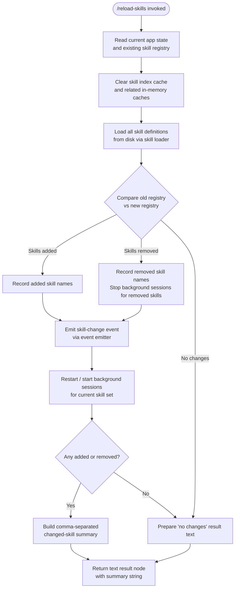

# `/reload-skills`

> Analysis basis: CC v2.1.160 bundle.js (AST extraction + Claude interpretation)
> Minimum version: v2.1.160

---

## Overview

`/reload-skills` rescans the disk for skill definitions that were added or modified during the current Claude Code session, then replaces the in-memory skill registry with the freshly loaded set. It clears all relevant caches, restarts any affected background skill sessions, and returns a human-readable summary of what changed (added, removed, or unchanged skills).

---

## Registration

| Field | Value |
|---|---|
| type | `local` |
| name | `reload-skills` |
| description | `Pick up skills added or changed on disk during this session` |
| supportsNonInteractive | `true` |
| thinClientDispatch | `post-text` |
| module_id | `Ys1` |
| load_inline | `true` |
| loc_byte | `12413076` |
| loc_byte_end | `12413293` |
| loc_line | `8741` |
| arbor_handler.name | `oTf` |
| arbor_handler.fqn | `claude-2.1.160::oTf` |
| arbor_handler.kind | `AsyncFunction` |
| arbor_handler.resolution_path | `module_id` |
| arbor_handler.n_hits | `0` |

Analysis basis: CC v2.1.160 bundle.js:+12413076

---

## Input Branching

The handler has 4+ distinguishable outcome paths (skills added, skills removed, skills unchanged, background-session management), so a Mermaid flowchart is used.



Analysis basis: CC v2.1.160 bundle.js:+12412598 – +12412960

---

## Behavioral Spec

### 1. Handler Entry — `reloadSkillsHandler` (`oTf`)

The registered async handler is resolved via `module_id` → `Ys1` → export `oTf`.

```
async function reloadSkillsHandler(context):
    // 1. Snapshot current skill registry from app state
    oldSkillSet  = readCurrentAppState()         // S6 → sF6 / Ki / Y_
    oldSkillMap  = getSkillRegistrySnapshot()    // CW

    // 2. Invalidate all skill-related caches
    clearSkillIndexCache()                       // xC → du → H.clearSkillIndexCache
    clearBackgroundSessionCache()                // Wa → PG8.clear

    // 3. Re-load skill definitions from disk
    newSkillList = loadSkillsFromDisk()          // xC → du → Ue_

    // 4. Identify delta
    addedSkills   = newSkillList.filter(s => NOT in oldSkillMap)
    removedSkills = oldSkillList.filter(s => NOT in newSkillList)

    // 5. Tear down background sessions for removed skills
    for each removedSkill in removedSkills:
        stopBackgroundSession(removedSkill)      // L → f → A.close / q.close

    // 6. Emit change event so subscribers react
    emitSkillChangeEvent()                       // lc.emit  (+12412705)

    // 7. Start / restart background sessions for surviving + new skills
    for each skill in newSkillList:
        startOrReuseBackgroundSession(skill)     // L.map  (+12412685)

    // 8. Build result text
    changedNames = [...addedSkills, ...removedSkills]
                    .map(s => s.name)
                    .join(", ")                  // O.join  (+12412877)

    if changedNames is empty:
        resultText = "no changes"               // literal  (+12412890)
    else:
        resultText = changedNames

    // 9. Return a "text"-typed result node
    return { type: "text", content: resultText } // literals (+12412915, +12412972)
```

Analysis basis: CC v2.1.160 bundle.js:+12412598

---

### 2. App-State Read — `readCurrentAppState` (`S6`)

```
function readCurrentAppState():
    store = asyncLocalStorage.getStore()         // sF6 → aF6.getStore  (+976326)
    if store is null:
        return getDefaultState()                 // sF6 → Ki  (+976347)
    return resolveStateFromStore(store)          // S6 → Y_ → zN  (+976396, +41481)
```

Analysis basis: CC v2.1.160 bundle.js:+976377

---

### 3. Skill Index Cache Invalidation — `clearSkillCaches` (`xC`)

```
async function clearSkillCaches():
    await resolveSkillLoader()                   // du → Promise.resolve  (+12984261)
    await runPreClearHook()                      // du → Ue_  (+12984291)
    await skillLoader.clearSkillIndexCache()     // du → H.clearSkillIndexCache  (+12984313)
    postClearCleanup1()                          // xC → VG8  (+12984365)
    postClearCleanup2()                          // xC → hX1  (+12984371)
    postClearCleanup3()                          // xC → jRH  (+12984377)
```

Analysis basis: CC v2.1.160 bundle.js:+12984360

---

### 4. Background-Session Cache Clear — `clearSessionCache` (`Wa`)

```
function clearSessionCache():
    sessionCacheMap.clear()                      // PG8.clear  (+9821367)
    // Internal counter reset to 1 follows       // literal 1  (+9821384)
```

Analysis basis: CC v2.1.160 bundle.js:+9821367

---

### 5. Bootstrap / Skill Loader Fetch — `fetchBootstrap` (`H` via `du`)

When the skill loader is cold (cache empty), it performs a network bootstrap call:

```
async function fetchBootstrap(endpoint):
    log("[Bootstrap] Fetching", endpoint)        // literal  (+15451800)
    response = await fetch(endpoint, {
        headers: {
            "Content-Type": "application/json",  // literal  (+15451885 / +15451900)
            "User-Agent":   <agent-string>,      // literal  (+15451919)
        },
        timeout: 5000                            // literal  (+15451991)
    })
    if response parse fails:
        emitTelemetry("api_bootstrap_fetch",
                      { status: "parse_failed" }) // literals (+15452112, +15452134)
        return null
    log("[Bootstrap] Fetch ok")                  // literal  (+15452164)
    return parsedData
```

Analysis basis: CC v2.1.160 bundle.js:+15451798

---

### 6. Background Session Lifecycle — `manageBackgroundSession` (`L`)

```
function manageBackgroundSession(skillEntry):
    trackingSet.add(skillEntry)                  // q.add  (+15852595)
    try:
        runSession(skillEntry)                   // (internal)
    finally:
        trackingSet.delete(skillEntry)           // q.delete  (+15852618)
        session.close()                          // f → A.close / q.close  (+15858587, +15858597)

function stopBackgroundSession(sessionHandle):
    if sessionHandle.status == "stopped":        // literal  (+15883381)
        return
    sessionHandle.kind = "background session"    // literal  (+15883424)
    sessionHandle.close()
```

Analysis basis: CC v2.1.160 bundle.js:+15852595

---

### 7. Skill Name Formatting for Display — `formatSkillNames` (`K`)

```
function formatSkillNames(skillList):
    return skillList
        .map(s => s.name.padEnd(40))             // f.padEnd  (+15871369), literal 40 (+15873361)
        .join("  ")                              // literal "  " (+15871390)
```

Analysis basis: CC v2.1.160 bundle.js:+15871356

---

## State & Side Effects

| Item | Detail |
|---|---|
| Telemetry | `tengu_feature_sad` fired inside the `d` utility reached from `t6` (bundle.js:+966258); indicates a "sad path" / error tracking event on skill bootstrap failures |
| `api_bootstrap_fetch` | Emitted inside `fetchBootstrap` when the skill index network fetch encounters a parse failure (bundle.js:+15452112) |
| Skill index cache | Fully cleared via `H.clearSkillIndexCache` on every invocation (bundle.js:+12984313) |
| Background session cache | Cleared via `PG8.clear` (`Wa`) on every invocation (bundle.js:+9821367) |
| Background sessions | Running sessions for removed skills are closed; sessions for all current skills are (re-)started via `L.map` (bundle.js:+12412685) |
| Event emission | Skill-change event emitted through `lc.emit` after cache invalidation (bundle.js:+12412705) |
| Return value | A plain `{ type: "text" }` result node; content is either a comma-separated list of changed skill names or the string `"no changes"` (bundle.js:+12412877, +12412890, +12412915) |
| `thinClientDispatch` | `post-text` — thin clients receive the text result via a POST rather than streaming |
| `supportsNonInteractive` | `true` — safe to invoke in non-TTY / scripted contexts |

---

## Version History

| Version | Change |
|---|---|
| v2.1.160 | Initial analysis |

---

## Common Mistakes

1. **Expecting granular add/remove output when nothing changed** — if the on-disk skill set is identical to what was loaded at session start, the command returns the literal string `"no changes"` with no further detail (bundle.js:+12412890).
2. **Running `/reload-skills` before saving skill files** — the command reads from disk at invocation time; unsaved editor buffers will not be picked up.
3. **Assuming the command is instantaneous** — when the skill index cache is cold, `fetchBootstrap` performs a network request with up to a 5 000 ms timeout (bundle.js:+15451991); the command may pause noticeably.
4. **Ignoring background session teardown** — removed skills have their background sessions closed synchronously before the result is returned; any in-flight work in those sessions is abandoned.
5. **Calling `/reload-skills` in a thin-client environment and expecting streamed output** — `thinClientDispatch` is `post-text`, meaning results are delivered as a single POST payload, not as a stream.

---

## Appendix — Identifier Mapping

> For bundle debugging only. Identifiers change across versions.

| Identifier | Role |
|---|---|
| `oTf` | Main async handler for `/reload-skills` (entry point, `AsyncFunction`) |
| `S6` | App-state reader; retrieves current skill registry snapshot |
| `sF6` | Async-local-storage accessor for app state |
| `Ki` | Default / fallback state factory when store is absent |
| `Y_` | State resolver when async-local-storage store is present |
| `zN` | Low-level state hydration utility called by `Y_` |
| `xC` | Skill cache invalidation orchestrator |
| `du` | Skill loader bootstrapper; calls `clearSkillIndexCache` and pre-clear hook |
| `H` | Skill loader / bootstrap fetcher module |
| `N` | Internal string/header normalisation utility used by `H` |
| `o$` | Auxiliary helper on `H` (role not fully resolved at depth 2) |
| `Ce` | Set-membership check helper (uses `F64.has`) |
| `wj` | String replacement helper (uses `H.replace`) |
| `gq` | URL / path construction helper used in bootstrap fetch |
| `t6` | Error/sad-path reporter; fires `tengu_feature_sad` telemetry |
| `VG8` | Post-clear cleanup step 1 called by `xC` |
| `hX1` | Post-clear cleanup step 2 called by `xC` |
| `jRH` | Post-clear cleanup step 3 called by `xC` |
| `Wa` | Background-session cache clearer; calls `PG8.clear` |
| `L` | Background-session lifecycle manager (start/stop/track) |
| `f` | Individual session handle with `close` / `finally` semantics |
| `A` | Session type discriminator (uses `toLowerCase` for kind checks) |
| `K` | Skill-name display formatter (`padEnd` + join) |
| `O` | Output accumulator array; collects changed skill name strings |
| `C8` | Result-node constructor; builds `{ type, content }` output object |
| `q` | Active-session tracking set (add / delete / filter operations) |