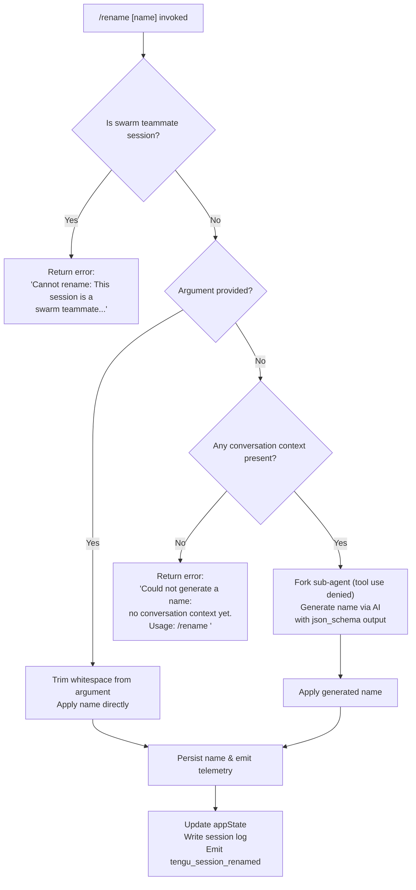

# `/rename`

> Analysis basis: CC v2.1.160 bundle.js (AST extraction + Claude interpretation)
> Minimum version: v2.1.160

---

## Overview

The `/rename` command renames the current Claude Code conversation session. When invoked with an explicit name argument, it applies that name directly; when invoked without arguments, it uses a forked sub-agent to auto-generate a name from the conversation context. The command persists the chosen name to the session log and emits telemetry.

---

## Registration

| Field | Value |
|---|---|
| type | `local-jsx` |
| name | `rename` |
| description | `Rename the current conversation` |
| argumentHint | `[name]` |
| immediate | `true` |
| aliases | `["name"]` |
| module_id | `sF1` |
| load_inline | `true` |
| loc_byte | `11861792` |
| loc_byte_end | `11861991` |
| loc_line | `8175` |
| arbor_handler.name | `Iwf` |
| arbor_handler.fqn | `claude-2.1.160::Iwf` |
| arbor_handler.kind | `AsyncFunction` |
| arbor_handler.resolution_path | `module_id` |
| arbor_handler.n_hits | `0` |

Analysis basis: CC v2.1.160 bundle.js:+11861792

---

## Input Branching

Four distinct execution paths exist depending on the session context and whether an explicit name was supplied.



Analysis basis: CC v2.1.160 bundle.js:+11860950, +11861055, +11861167, +11859174

---

## Behavioral Spec

### Top-Level Handler (`Iwf`)

The Arbor-resolved async handler `Iwf` is the command entry point. It receives the parsed command input and dispatches to the main implementation function.

```
async function renameCommandHandler(commandInput, context):
    call mainRenameImplementation(commandInput, context)
    call conversationLogWriter(context)
    call sessionStateChecker(context)
```

Analysis basis: CC v2.1.160 bundle.js:+11861488, +11861504, +11861546

---

### Swarm Teammate Guard (`aI8` inner logic)

Before any rename operation, the handler checks whether the current session is a swarm teammate. If so, it immediately returns an error message and takes no further action.

```
function checkSwarmTeammate(sessionContext):
    if sessionContext.isSwarmTeammate:
        return errorMessage(
            "Cannot rename: This session is a swarm teammate..."
        )
    proceed to name resolution
```

Analysis basis: CC v2.1.160 bundle.js:+11860950

---

### Explicit Name Path

When the user supplies a name argument, it is trimmed and applied directly without invoking the AI sub-agent.

```
function applyExplicitName(rawArgument, sessionState):
    trimmedName = rawArgument.trim()
    if trimmedName is non-empty:
        persistNameToSession(trimmedName, sessionState)
        updateAppState(sessionState, { title: trimmedName })
        emitTelemetry("tengu_session_renamed", { origin: "rename" })
```

Analysis basis: CC v2.1.160 bundle.js:+11861055, +11861295

---

### Auto-Name Generation via Forked Sub-Agent (`a_6` / `Nwf`)

When no argument is supplied, the implementation first verifies that conversation history exists. If history is empty, it returns the "no conversation context yet" error. Otherwise it forks a sub-agent to generate the name.

```
async function autoGenerateName(sessionContext, conversationHistory):
    if conversationHistory is empty:
        return error("Could not generate a name: no conversation context yet. Usage: /rename <name>")

    // Emit fork telemetry
    emit("tengu_rename_full_session_fork")

    // Record start timestamp for latency tracking
    startTime = Date.now()

    // Configure sub-agent: tool use is denied for name generation
    subAgentConfig = {
        toolPermission: "deny",
        reason: "Session name generation cannot use tools",
        outputFormat: "json_schema"
    }

    // Build message context from existing conversation
    contextMessages = buildContextSlice(conversationHistory)

    // Launch forked sub-agent with abort signal
    abortController = new AbortController()
    result = await forkSubAgent(contextMessages, subAgentConfig, abortController.signal)

    generatedName = extractTextFromResult(result)
    return generatedName
```

Analysis basis: CC v2.1.160 bundle.js:+11859635, +11858884, +11859080, +11859095, +11859198, +11859421, +11859638

---

### Name Persistence and Session Log Write (`rmK` / `imK` / `FwA`)

After a name is resolved (either from user input or AI generation), it is written to the session log file on disk.

```
async function persistSessionName(resolvedName, sessionContext):
    logDir = path.dirname(sessionContext.logPath)
    ensure directory exists (mkdir if needed)

    // Measure byte length for storage accounting
    nameByteLength = Buffer.byteLength(resolvedName)

    // Rename or rewrite the session log file
    newLogPath = computeNewLogPath(sessionContext.logPath, resolvedName)

    if currentLogFile.endsWith(".txt"):
        slicedPath = currentLogPath.slice(0, -4)  // remove .txt extension

    await fs.rename(currentLogPath, newLogPath)
    // If rename fails (e.g. cross-device), fall back to copy+unlink

    // Append name record to log
    await appendToSessionLog(newLogPath, { type: "name", value: resolvedName })

    // Register cleanup hook
    registerCleanupHook(newLogPath)
```

Analysis basis: CC v2.1.160 bundle.js:+203769, +203943, +203195, +203247, +203287, +203490, +203549, +204002

---

### App State Update and Title Notification (`aI8` → `_.setAppState`)

After persistence, the in-memory app state is updated so the UI reflects the new title immediately.

```
function updateConversationTitle(newName, appStateRef):
    currentState = appStateRef.getAppState()
    appStateRef.setAppState({
        ...currentState,
        title: newName
    })

    // Notify display layer via title formatter
    formattedTitle = formatSessionTitle(newName)
    dispatchTitleUpdate(formattedTitle)
```

Analysis basis: CC v2.1.160 bundle.js:+11861295, +11861314, +11861337

---

### Session Log Title Record Writers (`wS` / `E5H`)

Two complementary functions handle persisting a title annotation to the session log file. The first handles the "custom-title" origin (user-supplied name), the second handles the "ai-title" origin (AI-generated name).

```
async function writeCustomTitleRecord(logPath, titleValue):
    // origin: "custom-title"
    formattedRecord = formatLogEntry({ type: "name", value: titleValue })
    await fs.appendFileSync(logPath, formattedRecord)
    emit("tengu_session_renamed", { origin: "custom-title" })

async function writeAiTitleRecord(logPath, titleValue):
    // origin: "ai-title"
    formattedRecord = formatLogEntry({ type: "name", value: titleValue })
    await fs.appendFileSync(logPath, formattedRecord)
    emit("tengu_agent_name_set", { origin: "ai-title" })
```

Analysis basis: CC v2.1.160 bundle.js:+13024617, +13024781, +13024709, +13027737

---

### Context Slice Builder for Sub-Agent (`iI8`)

Prepares the message array passed to the forked sub-agent, filtering to human-origin non-meta messages and joining them as a single context string.

```
function buildContextSlice(conversationHistory):
    filtered = []
    for message in conversationHistory:
        if message.isMeta == false and message.origin == "human":
            filtered.push(message)

    if Array.isArray(filtered):
        joined = filtered.join(separator)
        return joined.slice(0, MAX_CONTEXT_LENGTH)
    return filtered
```

Analysis basis: CC v2.1.160 bundle.js:+11856314, +11856349, +11856389, +11856453, +11856471, +11856569, +11856601

---

### Session Filename Utility (`x4`)

Derives the on-disk filename for a session log from the session title, applying sanitization to produce a filesystem-safe name.

```
function computeSessionFilename(title, sessionMeta):
    // Redact any sensitive tokens
    sanitized = title.replace(SENSITIVE_PATTERN, "[REDACTED]")

    // Truncate to filesystem-safe length (max 40 chars for the base)
    parts = splitIntoWords(sanitized)
    baseName = parts.at(INDEX_POSITION)

    lastDot = baseName.lastIndexOf(".")
    if lastDot >= 0:
        baseName = baseName.slice(0, lastDot)

    return baseName.toUpperCase() + FILE_EXTENSION
```

Analysis basis: CC v2.1.160 bundle.js:+196271, +196298, +196350, +196408, +196434, +196460, +15873361

---

### Sub-Agent Abort and Lifecycle (`Nwf`)

The name-generation sub-agent registers an abort listener on the parent's AbortController, so that if the parent session is interrupted the forked query is also cancelled.

```
function launchNameGenerationSubAgent(contextMessages, config, parentSignal):
    abortController = new AbortController()
    parentSignal.addEventListener("abort", () => {
        abortController.abort()
    })

    subAgentPromise = runSubAgentQuery(contextMessages, config, abortController.signal)

    flattenedMessages = contextMessages.flatMap(expandAttachments)
    normalizedOutput = normalizeSubAgentResult(subAgentPromise)
    textResult = extractTextContent(normalizedOutput)
    return textResult
```

Analysis basis: CC v2.1.160 bundle.js:+11858834, +11858884, +11858915, +11858962, +11859320, +11859485, +11859515, +11859553

---

## State & Side Effects

| Item | Detail |
|---|---|
| Telemetry: `tengu_rename_full_session_fork` | Emitted when auto-name generation via sub-agent is triggered (no explicit argument supplied) — bundle.js:+11859638 |
| Telemetry: `tengu_session_renamed` | Emitted after a custom (user-supplied) title is successfully persisted — bundle.js:+13024709 |
| Telemetry: `tengu_agent_name_set` | Emitted after an AI-generated title is successfully persisted — bundle.js:+13027737 |
| Telemetry: `tengu_fork_agent_query` | Emitted during the sub-agent query lifecycle — bundle.js:+10791751 |
| Telemetry: `tengu_forked_agent_default_turns_exceeded` | Emitted if the forked sub-agent exceeds its default turn budget — bundle.js:+10791308 |
| Telemetry: `tengu_bg_state_read_transient` | Emitted during background state reads for session job ordering — bundle.js:+4127971 |
| appState changes | `title` field of current session's app state is updated with the new name via `_.setAppState` — bundle.js:+11861295 |
| Disk write: session log rename | The session log file is physically renamed on disk to reflect the new title; falls back to copy+unlink on cross-device errors — bundle.js:+203247, +203287 |
| Disk write: log append | A `{ type: "name", value: ... }` record is appended to the session log — bundle.js:+203549, +13023664 |
| Hook registration | Cleanup hook registered via `O9` → `HDA.register` after new log path is established — bundle.js:+204098, +59048 |
| Sub-agent tool permission | Tool use is explicitly denied (`"deny"`) for the name-generation sub-agent — bundle.js:+11859080 |
| Error: swarm teammate | Returns error string `"Cannot rename: This session is a swarm teammate. Teammate names are set by the team leader."` — bundle.js:+11860950 |
| Error: no context | Returns `"Could not generate a name: no conversation context yet. Usage: /rename <name>"` when history is empty and no argument is given — bundle.js:+11861167 |

---

## Version History

| Version | Change |
|---|---|
| v2.1.160 | Initial analysis |

---

## Common Mistakes

1. **Omitting the name argument on a fresh session**: If no conversation turns have occurred yet and no name is provided, the command will fail with the "no conversation context yet" error. Always pass an explicit `[name]` when renaming at the very start of a session.
2. **Expecting rename to work on swarm teammate sessions**: Teammate sessions are controlled by the team leader; issuing `/rename` on a teammate node will return an error and perform no action.
3. **Using `/rename` with the alias `/name` expecting different behavior**: The `name` alias is fully equivalent to `rename`; both invoke the same handler.
4. **Assuming the rename is instantaneous with AI generation**: When no argument is provided, a forked sub-agent must complete before the name is applied. This incurs an API round-trip and can be cancelled if the parent session is aborted.
5. **Special characters in names**: The filename derivation logic sanitizes sensitive patterns (replacing them with `[REDACTED]`) and truncates to approximately 40 characters for the filesystem base name. Very long or symbol-heavy names may be truncated silently.

---

## Appendix — Identifier Mapping

> For bundle debugging only. Identifiers change across versions.

| Identifier | Role |
|---|---|
| `Iwf` | Top-level async handler for `/rename` command (Arbor-resolved entry point) |
| `aI8` | Main rename implementation function; performs swarm guard, explicit vs auto-name branching, appState update |
| `oI8` | Outer wrapper / command dispatch shim called from `Iwf` |
| `a_6` | Sub-agent orchestration function; manages session fork, context preparation, and result assembly |
| `Nwf` | Forked sub-agent launcher for AI name generation; manages abort signal wiring |
| `iI8` | Context slice builder; filters conversation history for the sub-agent prompt |
| `rmK` | Session log persistence function; handles directory creation, file rename, and log append |
| `imK` | Bound variant of the log append path; used via `.bind` for promise chaining |
| `FwA` | File rename/copy+unlink helper; handles cross-device fallback |
| `gwA` | Log path join helper; constructs new session file path |
| `R$H` | Log record formatter; joins path segments and serialises the name entry |
| `QuH` | Debounced log flush scheduler; uses `setTimeout` / `setImmediate` / `clearTimeout` |
| `A46` | Error-type classifier for filesystem errors (e.g. `EISDIR`) |
| `wS` | Custom-title log writer; appends `custom-title` record and emits `tengu_session_renamed` |
| `E5H` | AI-title log writer; appends `ai-title` record and emits `tengu_agent_name_set` |
| `iRH` | Session log manager / state reader coordinating log file operations |
| `VYH` | Background job state manager; reads and updates persistent session job metadata |
| `Ij` | Session title formatter / basename extractor |
| `Nv8` | App state key enumerator used during state update |
| `x4` | Session filename sanitizer; derives filesystem-safe name from title |
| `xwA` | Word-split helper used during filename construction |
| `N` | Title generation prompt builder / AI query runner for name generation |
| `lmK` | Sub-component of title generation; prepares structured output schema |
| `ADA` | JSON schema field builder for `json_schema` output format |
| `PmH` | Result writer that dispatches generated title back to caller |
| `ZwA` | Write helper used by the title persistence layer |
| `AM` | App-state retrieval wrapper |
| `b0` | Store accessor (`O4_.getStore`) |
| `ra_` | Start-time recorder for sub-agent latency tracking |
| `C16` | Latency threshold checker |
| `a0` | Core sub-agent query executor; drives the API call and turn management |
| `aT8` | Agent turn runner; calls `getAppState` / `setAppState` during execution |
| `Zm` | Sub-agent completion handler; emits `command_lifecycle` and related lifecycle strings |
| `gN6` | Tombstone / message-type guard |
| `fv1` | Secondary tombstone checker |
| `E7H` | Stream-event filter for sub-agent output |
| `x1f` | Sub-agent result post-processor |
| `W6` | Session forking utility; creates or retrieves forked session records |
| `HA8` | Fork deduplication guard using `jY_` set and `WDH` map |
| `wY_` | New fork initialiser; assigns UUID, emits `GrowthbookExperimentEvent` |
| `R6` | Fork session runner; drives `ZDH` (config load) and `ojL` (file watcher) |
| `ZDH` | Session config loader; reads file, parses JSON, handles `ENOENT`/`EEXIST` |
| `ojL` | Session file watcher; uses `DA8.watchFile` / `DA8.unwatchFile` |
| `gX` | Token/provider type resolver used during sub-agent API client setup |
| `A4_` | Auth key classifier (`/login managed key`, `sk-ant-` prefix check) |
| `gq` | API client factory for sub-agent queries |
| `GHH` | Provider-routing helper |
| `K1` | Model alias resolver (`opusplan`, `sonnet`, `haiku`, `opus`, `best`) |
| `yP` | Model+provider combination dispatcher |
| `R0` | Request object assembler for API calls |
| `DKH` | Model-string validator (checks against `zKH` inclusion list) |
| `dN` | Thinking-mode configuration helper |
| `tT` | Token-budget calculator |
| `XDq` | Token-budget wrapper |
| `xM` | Provider-specific request adapter |
| `xa6` | Model capability checker (`Ss4.includes`) |
| `AgH` | Request header builder (`FH`) |
| `Dh` | Conversation message serialiser for sub-agent context |
| `AbH` | Message batch processor; calls `tn_` and `D4K` |
| `tn_` | Individual message transformer |
| `D4K` | Full query pipeline executor (tool schema, normalisation, streaming, retries) |
| `JZ8` | Conversation record builder; hashes messages, reads/writes JSON |
| `Zs7` | Message array normaliser |
| `yE` | Message content transformer (handles tool_use, tool_result, image, text blocks) |
| `S6` | Cache helper |
| `m6` | JSON.parse wrapper |
| `J01` | Conversation record validator |
| `G8` | Error re-thrower / fatal error handler |
| `L` | Promise lifecycle tracker (add/delete/finally) |
| `jA` | String formatter for display (`FH`) |
| `C7` | Context object builder |
| `wj` | String replacement utility |
| `Ce` | Feature-flag checker (`F64.has`) |
| `o$` | Unknown call in bootstrap path |
| `t6` | Bootstrap fetch wrapper |
| `d` | Generic async dispatcher |
| `bK` | Conversation history accessor |
| `IK` | Message filter (`.filter`) |
| `aF1` | Result aggregator combining `R9` and `wR` |
| `wR` | Text trimmer |
| `GH` | String coercer (`String(...)`) |
| `SH` | JSON serialiser (`JSON.stringify`) |
| `y6` | Log-level writer (`zN`) |
| `jk` | Log-level constant holder |
| `$M` | Structured log entry formatter |
| `iS` | Log sink writer |
| `Y_` | Log entry appender |
| `wS` | Custom-title session log writer (also listed above) |
| `JMH` | Filesystem log appender (`appendFileSync`, `mkdirSync`) |
| `n4` | Cleanup hook registrar (`O9`) |
| `ds` | Debug log writer variant |
| `FE` | Error formatter for sub-agent failures |
| `ys` | Sub-agent yield handler |
| `M` | Plugin/workspace path resolver (`qC6`) |
| `qC6` | Path sanitiser; validates against staging/plugins reserved paths |
| `KC6` | Plugin path builder |
| `f` | Socket/stream lifecycle manager |
| `iAH` | Interrupt handler for sub-agent |
| `rQ` | Session metadata reader/writer (`o$6`) |
| `o$6` | JSONL session file read/write helper |
| `b$` | Unknown sub-system call (`d0H`) |
| `d0H` | Dependency of `b$` |
| `jW` | Sub-agent output post-processor |
| `Nj` | Session record deleter (`OLH.delete`) |
| `z5` | Session record writer (`t3`) |
| `t3` | Atomic file writer (write → rename with random temp suffix) |
| `_1` | Session state loader; reads JSON, manages `OLH`/`GYH` caches |
| `V8` | Error handler for stat failures |
| `v5` | Secondary error handler |
| `yH` | Title update notifier; calls `d_`, `FH`, `n9`, `T14` |
| `d_` | Error/string coercer pair |
| `n9` | Notification queue item builder (`KNA`) |
| `KNA` | Notification formatter |
| `T14` | Notification queue rotator (`lF6.shift` / `lF6.push`) |
| `Ij` | Session title / basename formatter |
| `hY_` | Session metadata accessor |
| `ZDH` | Config file reader (also listed above) |
| `d6` | Path builder utility |
| `O9` | Cleanup hook registrar (calls `HDA.register`) |
| `p9H` | Provider config accessor |
| `lQ` | Model list builder |
| `DN` | Default model selector |