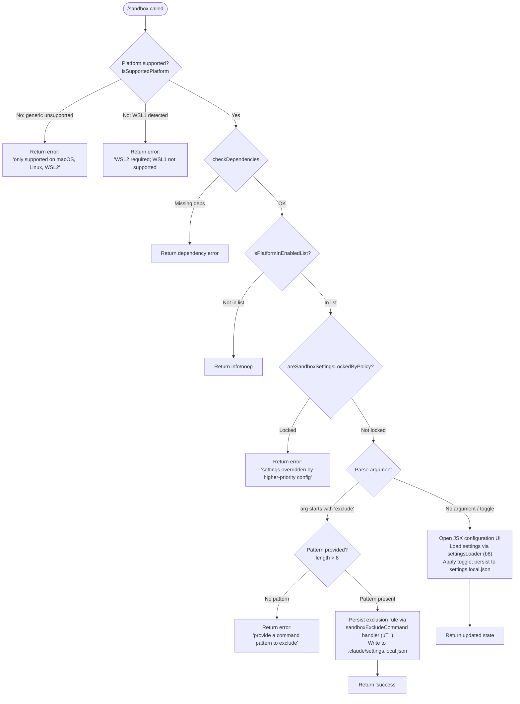

# `/sandbox`

> Analysis basis: CC v2.1.160 bundle.js (AST extraction + Claude interpretation)
> Minimum version: v2.1.160

---

## Overview

The `/sandbox` command configures the sandboxing behavior for Claude Code's tool execution environment. It supports inspecting the current sandbox state, toggling sandboxing on or off (subject to platform support checks and policy locks), and adding command-pattern exclusions that bypass the sandbox. The command targets macOS, Linux, and WSL2 platforms exclusively and persists changes to `.claude/settings.local.json`.

---

## Registration

| Field | Value |
|---|---|
| type | `local-jsx` |
| name | `sandbox` |
| description | ` ...   ...  (⏎ to configure)` |
| argumentHint | `exclude "command pattern"` |
| immediate | `true` |
| isHidden | `null` (not hidden) |
| module_id | `At1` |
| load_inline | `true` |
| loc_byte | `12451176` |
| loc_byte_end | `12451825` |
| loc_line | `8759` |
| arbor_handler.name | `GEf` |
| arbor_handler.fqn | `claude-2.1.160::GEf` |
| arbor_handler.kind | `AsyncFunction` |
| arbor_handler.resolution_path | `module_id` |
| arbor_handler.n_hits | `2` |

Analysis basis: CC v2.1.160 bundle.js:+12451176

---

## Input Branching

The handler distinguishes at least four distinct execution paths based on platform state and the sub-command argument supplied by the user, mandating a flowchart representation.



Analysis basis: CC v2.1.160 bundle.js:+12449795 – +12450844

---

## Behavioral Spec

### 1. Platform Guard

```
async function sandboxHandler(args, context):
    colorTheme = getColorTheme()              // ZA: detect "light"/"dark"
    currentPlatform = getPlatformInfo()       // r6: runtime platform lookup

    if not platformSupport.isSupportedPlatform(currentPlatform):
        if currentPlatform.type == "wsl" and currentPlatform.version < 2:
            return errorMessage("Error: Sandboxing requires WSL2. WSL1 is not supported.")
        return errorMessage("Error: Sandboxing is currently only supported on macOS, Linux, and WSL2.")

    depCheck = await platformSupport.checkDependencies()
    if depCheck.failed:
        return errorMessage(depCheck.reason)

    if not platformSupport.isPlatformInEnabledList(currentPlatform):
        return infoResult()
```

Analysis basis: CC v2.1.160 bundle.js:+12449826, +12449862, +12449868, +12449926, +12450043, +12450070

---

### 2. Policy Lock Check

```
    if platformSupport.areSandboxSettingsLockedByPolicy():
        return errorMessage(
            "Error: Sandbox settings are overridden by a higher-priority configuration and cannot be changed locally."
        )
```

Analysis basis: CC v2.1.160 bundle.js:+12450232, +12450291

---

### 3. Argument Dispatch — Exclude Sub-command

```
    argText = args.rawInput                  // full argument string
    parts   = argText.split(" ")

    if parts[0] == "exclude":               // literal "exclude" at +12450541
        patternBody = parts.slice(1).join(" ")
        if patternBody.length <= 8:         // minimum meaningful length guard +12450566
            return errorMessage(
                "Error: Please provide a command pattern to exclude (e.g., /sandbox exclude \"npm run test:*\")"
            )
        // Delegate to exclusion handler (uT_ / sandboxExcludeCommandHandler)
        result = await sandboxExcludeCommandHandler(patternBody, context)
        // Emits telemetry event "sandbox_exclude_command" at +4659698
        persistToLocalSettings(".claude/settings.local.json", result.rules)
        return successResult("success")
```

Analysis basis: CC v2.1.160 bundle.js:+12450518, +12450541, +12450558, +12450603, +12450751, +12450809, +12450844

---

### 4. Sandbox Exclusion Rule Persistence (`sandboxExcludeCommandHandler`)

```
async function sandboxExcludeCommandHandler(patternText, context):
    // Load all settings layers: policySettings, flagSettings, localSettings
    allSettings = await settingsLoader(context)           // b8 + full settings stack

    // Filter existing rules; match incoming pattern (WpL / patternMatcher)
    existingRules = allSettings.localSettings.addRules ?? []
    if existingRules.includes(patternText):
        return { rules: existingRules, duplicate: true }

    newRules = [...existingRules, patternText]

    // Persist to projectSettings path, localSettings layer
    settingsPath = resolveSettingsPath(".claude/settings.local.json")
    writeSettingsLayer(settingsPath, { addRules: newRules })

    emitTelemetry("sandbox_exclude_command", { pattern: patternText })
    return { rules: newRules, duplicate: false }
```

Analysis basis: CC v2.1.160 bundle.js:+12450751, +4659318, +4659389, +4659412, +4659563, +4659602, +4659695, +4659698

---

### 5. Settings Load Stack (`settingsLoader`)

```
function loadSettingsStack(context):
    // Layer priority (highest → lowest): policySettings, flagSettings,
    // userSettings, projectSettings, localSettings
    layers = [
        loadPolicySettings(),    // "policySettings" at +1224233
        loadFlagSettings(),      // "flagSettings"   at +1224312
        loadUserSettings(),      // "userSettings"   at +1220242
        loadProjectSettings(),   // "projectSettings" at +1220293
        loadLocalSettings()      // "localSettings"  at +4659321
    ]
    merged = mergeSettingsLayers(layers)
    emitTrace("settings_load_started")     // +1224654
    // ... resolve, validate, cache
    emitTrace("settings_load_completed")   // +1225379
    return merged
```

Analysis basis: CC v2.1.160 bundle.js:+1224233, +1224312, +1220242, +1220293, +4659321, +1224654, +1225379

---

### 6. Toggle / Interactive Configuration UI (no `exclude` argument)

```
    // No sub-command: open JSX configuration interface
    currentSettings = await settingsLoader(context)
    renderSandboxConfigUI(currentSettings)
    // User interaction is handled by the JSX component registered in module At1
    // State changes are persisted to .claude/settings.local.json via Ki helper
    // Relative path display uses Ht1.relative
```

Analysis basis: CC v2.1.160 bundle.js:+12450764, +12450788, +12450801

---

### 7. Daemon-Stop Side Path (`z` / daemonStopOrchestrator)

The call graph includes a daemon-stop orchestration path (function `z`) reached during certain sandbox state transitions. It follows a race between graceful shutdown and a hard `process.exit`, with a 500 ms guard timeout.

```
async function daemonStopOrchestrator():
    emitTrace("daemon_stop")
    try:
        await Promise.race([
            gracefulShutdown(),   // Wd → O4H.shutdown
            timeoutExit(500)      // Zd → clearTimeout + FY_
        ])
        await Promise.all([...])
    catch err:
        emitTrace("daemon_stop_failed")
        process.exit(1)
```

Analysis basis: CC v2.1.160 bundle.js:+15883469, +15883492, +15883544, +15883598, +15878559, +15878573, +15878591, +15878601, +15878640

---

## State & Side Effects

| Item | Detail |
|---|---|
| Telemetry — `tengu_feature_ok` | Emitted on successful feature toggle (bundle.js:+966123) |
| Telemetry — `tengu_feature_bad` | Emitted on feature failure path (bundle.js:+966181) |
| Telemetry — `tengu_feature_sad` | Emitted on feature sad/degraded path (bundle.js:+966258) |
| Telemetry — `tengu_daemon_control` | Emitted when daemon start/stop is triggered (bundle.js:+15883547) |
| Settings written | `.claude/settings.local.json` updated with sandbox toggle state or new `addRules` exclusion entries (bundle.js:+12450809) |
| Settings layers read | `policySettings`, `flagSettings`, `userSettings`, `projectSettings`, `localSettings` all loaded on each invocation |
| Platform guard | Hard-rejects on non-macOS/non-Linux/non-WSL2 hosts; also rejects WSL1 specifically |
| Policy lock | When `areSandboxSettingsLockedByPolicy()` returns true, all writes are blocked and an error is returned (bundle.js:+12450232) |
| Trace events | `loadSettingsFromDisk_start` / `loadSettingsFromDisk_end`, `settings_load_started` / `settings_load_completed`, `gitignore_global_rule`, `write_ineffective` emitted from settings infrastructure |
| Process side effect | Daemon-stop path may call `process.exit` (bundle.js:+15878640) |
| Sound | <!-- TODO: not found in depth-2 traversal; needs --depth 4 --> |

---

## Version History

| Version | Change |
|---|---|
| v2.1.160 | Initial analysis |

---

## Common Mistakes

1. **Running on an unsupported platform**: `/sandbox` will hard-fail on Windows (non-WSL) and WSL1. Users must be on macOS, Linux, or WSL2.
2. **Omitting the pattern after `exclude`**: `/sandbox exclude` with no quoted pattern (or a pattern ≤ 8 characters in length) triggers a usage error. Always supply a meaningful glob pattern, e.g., `/sandbox exclude "npm run test:*"`.
3. **Attempting to toggle when settings are policy-locked**: If an administrator has set a higher-priority configuration, local changes are rejected entirely. The error message explicitly states this; users must consult their org policy.
4. **Expecting changes in the project-level `settings.json`**: Sandbox state and exclusion rules are written exclusively to `.claude/settings.local.json`, not the shared `settings.json`.
5. **Re-adding a duplicate exclusion pattern**: The handler checks for existing rules; duplicate submissions are silently de-duplicated, which may cause confusion if a user expects a confirmation event.

---

## Appendix — Identifier Mapping

> For bundle debugging only. Identifiers change across versions.

| Identifier | Role |
|---|---|
| `GEf` | Main async handler for `/sandbox` command (arbor_handler) |
| `JA` | Output/display renderer for sandbox command results |
| `H` | Bootstrap/HTTP fetch utility (settings bootstrap fetch) |
| `N` | Log/trace message formatter |
| `lmK` | Debug-level log helper |
| `SH` | JSON serialization helper |
| `x4` | Argument string parser / token extractor |
| `PmH` | Prompt or display wrapper helper |
| `rmK` | Rule/config writer (persists sandbox rules to disk) |
| `o$` | Settings cache accessor |
| `Ce` | Feature-flag checker |
| `wj` | String replacement utility |
| `gq` | Model alias resolver |
| `GHH` | Model name dispatcher |
| `K1` | Model identifier normalizer (trim, lowercase, replace) |
| `yP` | Model resolution pipeline |
| `t6` | Generic async task runner |
| `d` | Error / result wrapper |
| `xDH` | ANSI color code mapper |
| `Id` | Identity / passthrough helper |
| `M` | Temporary-file manager (split/slice/rm) |
| `qC6` | Plugin path resolver |
| `KC6` | Plugin directory joiner |
| `L` | Temporary-file registry (add/delete/finally) |
| `q` | File unlink helper |
| `f` | Stream / handle closer |
| `z` | Daemon stop orchestrator |
| `hH` | Daemon stop trace emitter (success path) |
| `RH` | Daemon stop trace emitter (failure path) |
| `Qy` | Session / agent runner |
| `mx` | Agent bootstrap initializer |
| `BR` | Agent worker factory |
| `vVH` | Agent event dispatcher |
| `gy` | Worker event loop |
| `YY_` | Session startup coordinator |
| `i_8` | Full agent session runner (Promise.all tasks) |
| `kU` | Session token / random-bytes generator |
| `_p` | Process-race / shutdown coordinator |
| `Wd` | Graceful shutdown initiator |
| `Zd` | Timeout-based hard exit |
| `FY_` | Datadog post-flush helper |
| `d8` | Abort/timeout controller |
| `K` | Column layout formatter |
| `O` | Background session stop helper |
| `uT_` | Sandbox exclude command sub-handler |
| `b8` | Settings loader entry point |
| `RQ6` | Settings cache lookup |
| `yzA` | Settings cache get/has |
| `us8` | Settings validation / type-check layer |
| `hzA` | Settings cache set |
| `EQ` | Settings object constructor / merger |
| `Y_` | Settings schema validator |
| `a16` | Settings field: API key handler |
| `LU8` | Settings field handler (LU8) |
| `n16` | Settings field handler (n16) |
| `u0H` | Settings field handler (u0H) |
| `m0H` | Settings field handler (m0H) |
| `t16` | Settings field handler (t16) |
| `F3H` | Settings field handler (F3H) |
| `g3H` | Settings field handler (g3H) |
| `ys8` | Settings field handler (ys8) |
| `pSA` | Settings field handler (pSA) |
| `ci` | Settings field handler (ci) |
| `j56` | Settings field: model selector |
| `WpL` | Command pattern matcher (match against exclusion list) |
| `F_` | Core settings write / persist function |
| `mO` | Settings merge helper |
| `c3H` | Settings file path builder |
| `d6` | File existence / stat helper |
| `NX` | Settings file normalizer |
| `Ui` | Settings file reader (readFileSync + slice) |
| `V8` | Settings validation gate |
| `G8` | ENOENT / missing-file handler |
| `Ra8` | Settings write timestamp recorder |
| `SEH` | Settings effective-path resolver |
| `SQ6` | Settings path resolver (resolve + dirname) |
| `If6` | Atomic file write helper (temp + rename) |
| `Uz` | Settings cache clear |
| `Bg6` | Git-ignore rule writer |
| `S6` | Git check-ignore runner |
| `ja8` | Git executable locator |
| `A` | File extension / case normalizer |
| `Ug6` | Git check-ignore command builder |
| `NL4` | Git global excludes-file path resolver |
| `dyA` | Git ignore rule formatter |
| `cyA` | Git ignore append helper |
| `fx` | Settings join-path utility |
| `lp` | Settings load orchestrator (start/end trace) |
| `EG` | Settings load pre-check |
| `h9` | Memory-usage sampler during settings load |
| `ms8` | Settings load core (date, dedup, validate) |
| `bb6` | Settings load post-processor |
| `yH` | Settings write error handler |
| `d_` | Error code extractor |
| `FH` | String coercion helper |
| `n9` | Network-policy checker ("essential-traffic") |
| `T14` | Rolling log buffer manager |
| `Ki` | Final settings persistence helper (used by sandbox toggle UI) |

---

Note: index built via Arbor fallback; some signals (telemetry, literals) may be missing — see arbor-fallback.js.