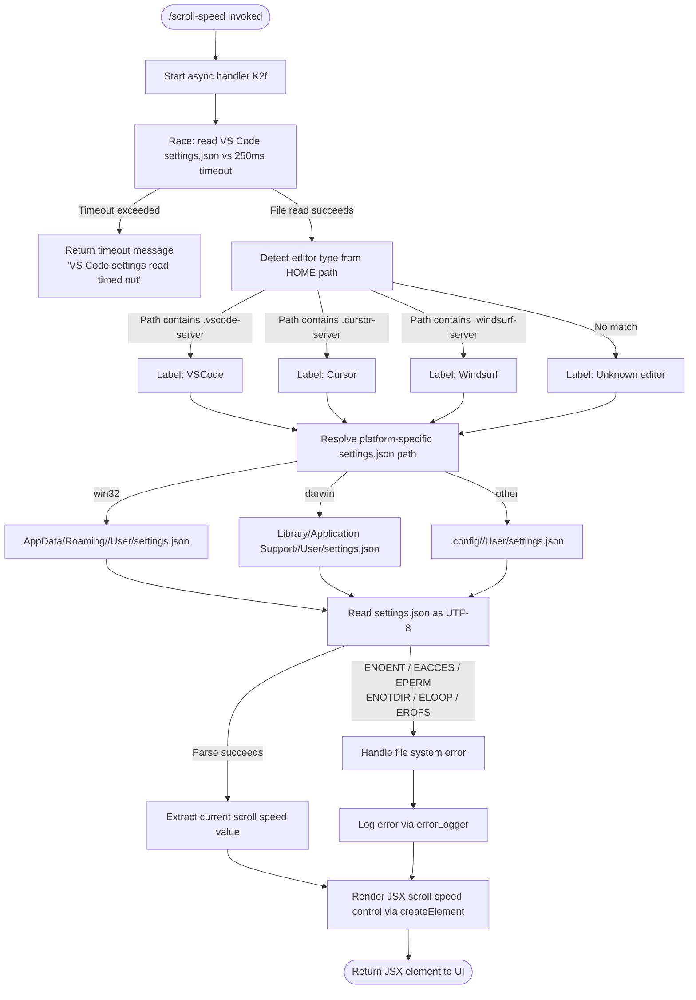

# `/scroll-speed`

> Analysis basis: CC v2.1.160 bundle.js (AST extraction + Claude interpretation)
> Minimum version: v2.1.160

---

## Overview

`/scroll-speed` is a local-JSX command that adjusts the mouse wheel scroll speed within the Claude Code terminal UI. It reads the current editor settings (VSCode, Cursor, or Windsurf `settings.json`) with a timeout guard, then renders a JSX control element that allows the user to modify the scroll speed preference. The command is implemented as an async function that combines settings file I/O with a React-based UI component.

---

## Registration

| Field | Value |
|---|---|
| type | `local-jsx` |
| name | `scroll-speed` |
| description | `Adjust mouse wheel scroll speed` |
| module_id | `yl1` |
| load_inline | `true` |
| loc_byte | `12076339` |
| loc_byte_end | `12076587` |
| loc_line | `8331` |
| arbor_handler.name | `K2f` |
| arbor_handler.fqn | `claude-2.1.160::K2f` |
| arbor_handler.kind | `AsyncFunction` |
| arbor_handler.resolution_path | `module_id` |
| arbor_handler.n_hits | `0` |

Analysis basis: CC v2.1.160 bundle.js:+12076339

---

## Input Branching

The command's execution involves 4+ distinct paths: timeout/success on settings read, editor-type detection (VSCode / Cursor / Windsurf / unknown), platform-specific path resolution (win32 / darwin / linux), and error-code handling (ENOENT, EACCES, EPERM, ENOTDIR, ELOOP, EROFS). A Mermaid flowchart is used.



Analysis basis: CC v2.1.160 bundle.js:+12076102, +12076111, +3996695, +4001076, +4001232, +4000793, +174772

---

## Behavioral Spec

### Main Handler — `scrollSpeedHandler` (bundle: `K2f`)

```
async function scrollSpeedHandler(commandInput):
    // Race settings read against a 250ms hard timeout
    settingsContent = await withTimeout(
        readEditorSettings(),
        250,
        "VS Code settings read timed out"
    )

    // Build JSX element for the scroll-speed UI control
    element = createElement(ScrollSpeedComponent, { settingsContent })
    return element
```

Analysis basis: CC v2.1.160 bundle.js:+12076102, +12076105, +12076111, +12076115, +12076173

---

### Timeout Guard — `timeoutRace` (bundle: `Hf`)

```
async function timeoutRace(promise, timeoutMs, timeoutMessage):
    timeoutHandle = null
    timeoutPromise = new Promise((_, reject) =>
        timeoutHandle = setTimeout(() => reject(timeoutMessage), timeoutMs)
    )
    try:
        result = await Promise.race([promise, timeoutPromise])
        clearTimeout(timeoutHandle)
        return result
    catch error:
        clearTimeout(timeoutHandle)
        throw error
```

- Hard timeout value: **250 ms** (bundle.js:+12076111)
- Timeout error message: `"VS Code settings read timed out"` (bundle.js:+12076115)
- Uses `setTimeout` (bundle.js:+2283438), `Promise.race` (bundle.js:+2283501), `clearTimeout` with `0` sentinel (bundle.js:+2283548, +2283546)

Analysis basis: CC v2.1.160 bundle.js:+2283438, +2283501, +2283548

---

### Settings Reader — `readEditorSettings` (bundle: `O2_`)

```
async function readEditorSettings():
    editorKind = detectEditorFromHomePath()      // calls o18
    settingsPath = resolveSettingsPath(editorKind) // calls s18
    rawText = await fs.readFile(
        path.join(settingsPath, "settings.json"),
        "utf-8"
    )
    parsed = parseSettingsJSON(rawText)           // calls $2_
    return parsed
```

- Settings filename literal: `"settings.json"` (bundle.js:+4000820)
- Encoding: `"utf-8"` (bundle.js:+4000793, +4000847)

Analysis basis: CC v2.1.160 bundle.js:+4000746, +4000793, +4000805, +4000813, +4000820, +4000847, +4000868

---

### Editor Detection — `detectEditorFromHomePath` (bundle: `o18`)

```
function detectEditorFromHomePath(homePath):
    if homePath.includes(".vscode-server"):
        return "VSCode"
    if homePath.includes(".cursor-server"):
        return "Cursor"
    if homePath.includes(".windsurf-server"):
        return "Windsurf"
    return null   // unknown / local install
```

- Detection strings: `.vscode-server` (bundle.js:+3996706), `.cursor-server` (bundle.js:+3996736), `.windsurf-server` (bundle.js:+3996766)
- Uses `H.includes` for path substring matching (bundle.js:+3996695)
- Also checks `_.includes` for a secondary include guard (bundle.js:+3996787)

Analysis basis: CC v2.1.160 bundle.js:+3996695, +3996706, +3996736, +3996766, +3996787

---

### Settings Path Resolver — `resolveSettingsPath` (bundle: `s18`)

```
function resolveSettingsPath(editorKind):
    home = os.homedir()
    platform = os.platform()
    editorDirName = editorDirFor(editorKind)  // "VSCode"→"Code", etc.

    if platform == "win32":
        return path.join(home, "AppData", "Roaming", editorDirName, "User")
    if platform == "darwin":
        return path.join(home, "Library", "Application Support", editorDirName, "User")
    // Linux / other
    return path.join(home, ".config", editorDirName, "User")
```

- Platform literals: `"win32"` (bundle.js:+4001271), `"darwin"` (bundle.js:+4001334)
- Windows path segments: `"AppData"` (bundle.js:+4001287), `"Roaming"` (bundle.js:+4001297), `"User"` (bundle.js:+4001309)
- macOS path segments: `"Library"` (bundle.js:+4001351), `"Application Support"` (bundle.js:+4001361)
- Linux path segment: `".config"` (bundle.js:+4001401)
- Editor display name mapping includes: `"VSCode"` → `"Code"` (bundle.js:+4001091, +4001216), `"Cursor"` → `"Cursor"` (bundle.js:+4001119), `"Windsurf"` → `"Windsurf"` (bundle.js:+4001149)
- Uses `os.homedir()` (bundle.js:+4001240) and `os.platform()` (bundle.js:+4001254)

Analysis basis: CC v2.1.160 bundle.js:+4001232, +4001240, +4001254, +4001271, +4001334, +4001401

---

### Settings JSON Parser — `parseSettingsJSON` (bundle: `$2_`)

```
function parseSettingsJSON(rawText):
    if Array.isArray(rawText):
        // unexpected array — handle gracefully
        return rawText
    // otherwise attempt JSON parse
    return JSON.parse(rawText)
```

- Uses `Array.isArray` guard (bundle.js:+4000702)

Analysis basis: CC v2.1.160 bundle.js:+4000702, +4000868

---

### Settings Parse Helper — `parseSettingsValue` (bundle: `if6`)

```
function parseSettingsValue(rawValue):
    normalized = normalizeLeadingSymbol(rawValue)  // calls Ax: strips leading char if needed
    // slice offset 1 used for symbol stripping (bundle.js:+1096192, +1096200)
    text = formatAsString(normalized)              // calls N for text normalization
    return String(text)
```

- Handles values beginning with special prefix characters via `startsWith` + `slice(1)` (bundle.js:+1096169, +1096192, +1096200)
- Falls back to `String(value)` coercion (bundle.js:+1096520)
- Error label `"error"` used in error-path branching (bundle.js:+1096539)

Analysis basis: CC v2.1.160 bundle.js:+1096436, +1096440, +1096463, +1096520, +1096539

---

### Error Handling — `errorHandler` (bundle: `yH`)

```
function errorHandler(err):
    code = extractErrorCode(err)   // calls d_: reads err.code or String(err)
    if isFatalCode(code):          // checks ENOENT, EACCES, EPERM, ENOTDIR, ELOOP, EROFS
        pushToErrorLog(err)        // calls T14: shift oldest + push new entry
        LUH.push(err)
        log.logError(err)          // calls mi.logError
    else:
        formatError(err)           // calls FH, n9, KNA for message formatting
```

- Fatal filesystem error codes: `ENOENT` (+174772), `EACCES` (+174786), `EPERM` (+174800), `ENOTDIR` (+174813), `ELOOP` (+174828), `EROFS` (+174841)
- Error code extraction uses `String(err)` coercion (bundle.js:+173730) and reads `err.code` property (bundle.js:+173844)
- Log rotation in `T14`: `lF6.shift()` evicts oldest entry, `lF6.push()` appends new (bundle.js:+971141, +971153)

Analysis basis: CC v2.1.160 bundle.js:+971461, +971474, +971720, +971803, +971821, +971861, +173724, +174772

---

### Text Normalization — `normalizeText` (bundle: `N`)

```
function normalizeText(input):
    if input includes debug marker:
        // "debug" path (bundle.js:+204223)
        return debugFormat(input)
    upperCase = input.toUpperCase()   // bundle.js:+204349
    trimmed = input.trim()            // bundle.js:+204372
    // additional locale/format passes via Y46, lmK, SH, x4, AR, PmH, rmK
    return formattedResult
```

Analysis basis: CC v2.1.160 bundle.js:+204223, +204247, +204265, +204287, +204305, +204349, +204372, +204388, +204394, +204408

---

### Bootstrap Fetch Utility — `bootstrapFetch` (bundle: `H`)

```
async function bootstrapFetch(url):
    log("[Bootstrap] Fetching", url)   // bundle.js:+15451800
    response = await fetch(url, {
        headers: {
            "Content-Type": "application/json",   // bundle.js:+15451885
            "User-Agent": <agentString>            // bundle.js:+15451919
        },
        timeout: 5000                              // bundle.js:+15451991
    })
    if parse fails:
        emitTelemetry("api_bootstrap_fetch", { result: "parse_failed" })
        // bundle.js:+15452112, +15452134
    else:
        log("[Bootstrap] Fetch ok")    // bundle.js:+15452164
    return data
```

- Timeout: **5000 ms** (bundle.js:+15451991)
- Telemetry event: `api_bootstrap_fetch` with `parse_failed` label on parse error (bundle.js:+15452112, +15452134)

Analysis basis: CC v2.1.160 bundle.js:+15451798, +15451836, +15451885, +15451900, +15451919, +15451932, +15451962, +15451973, +15451976, +15452000, +15452109, +15452112

---

## State & Side Effects

| Item | Detail |
|---|---|
| Telemetry | `tengu_feature_sad` fired on a sub-path inside `t6` → `d` (bundle.js:+966258); `api_bootstrap_fetch` / `parse_failed` on bootstrap fetch failure (bundle.js:+15452112) |
| Settings file I/O | Reads `settings.json` for VSCode / Cursor / Windsurf from platform-specific path; read is async, guarded by 250 ms timeout |
| Timeout side effect | A `setTimeout` handle is created and always cleared via `clearTimeout` to avoid handle leaks (bundle.js:+2283438, +2283548) |
| Error log mutation | On fatal FS error, error is pushed to the rotating error log buffer `lF6` (shift oldest + push new) and appended to `LUH` (bundle.js:+971141, +971153, +971821) |
| JSX rendering | Returns a `r8A.createElement(...)` tree (bundle.js:+12076173); no direct DOM writes — output is managed by the CC terminal UI renderer |
| appState changes | <!-- TODO: not found in depth-2 traversal; needs --depth 4 --> |
| Sound | <!-- TODO: not found in depth-2 traversal; needs --depth 4 --> |
| Hook registration | <!-- TODO: not found in depth-2 traversal; needs --depth 4 --> |

---

## Version History

| Version | Change |
|---|---|
| v2.1.160 | Initial analysis |

---

## Common Mistakes

1. **Expecting instant settings access**: The command imposes a hard 250 ms timeout on the settings read (bundle.js:+12076111). If the filesystem is slow (e.g., remote mount, cold SSD), the command will silently time out and surface the message `"VS Code settings read timed out"` rather than the actual settings value.
2. **Assuming a single editor**: Editor detection is based on the HOME path containing `.vscode-server`, `.cursor-server`, or `.windsurf-server`. On a local (non-remote) install, none of these substrings will match and the editor kind will fall back to `null`/unknown, which may cause the settings path resolver to produce an unexpected result.
3. **Mismatched platform path**: The platform check is `os.platform()` against the literal strings `"win32"` and `"darwin"`. Any other value (e.g., `"linux"`, `"freebsd"`) falls through to the `.config` branch. Providing a Windows-style path on a Linux host (or vice-versa) will produce a broken settings path.
4. **Treating the JSX output as plain text**: `/scroll-speed` returns a `local-jsx` component, not a text string. Invoking it in a context that expects plain-text command output will render nothing or throw a type mismatch.
5. **Expecting telemetry on every run**: The only unconditional telemetry in the call graph (`tengu_feature_sad`) is emitted inside a deeply nested utility (`t6` → `d`) and may only fire on error/sad paths, not on successful scroll-speed adjustments.

---

## Appendix — Identifier Mapping

> For bundle debugging only. Identifiers change across versions.

| Identifier | Role |
|---|---|
| `K2f` | Main async handler for `/scroll-speed` (scrollSpeedHandler) |
| `Hf` | Timeout race utility — wraps a promise with a `setTimeout`/`Promise.race` deadline |
| `O2_` | Editor settings reader — orchestrates editor detection, path resolution, and file read |
| `kyL` | Utility called at the start of `O2_` (exact role not determined at depth-2) |
| `o18` | Editor type detector — checks HOME path for `.vscode-server`, `.cursor-server`, `.windsurf-server` |
| `H` | Bootstrap fetch utility — performs an HTTP request with Content-Type and User-Agent headers |
| `N` | Text normalization — handles toUpperCase, trim, debug formatting, and locale passes |
| `o$` | Sub-utility called inside bootstrap fetch (exact role not determined at depth-2) |
| `Ce` | Capability/feature-flag checker using `F64.has` |
| `wj` | String replacement utility — calls `H.replace` |
| `gq` | String formatting utility — calls `GHH`, `K1`, `yP` |
| `t6` | Telemetry emitter utility — fires `tengu_feature_sad` |
| `_` | Generic string/array utility (context-dependent; seen with `.includes`, `.toUpperCase`) |
| `s18` | Platform-specific settings path resolver — uses `os.homedir()` and `os.platform()` |
| `if6` | Settings value parser — normalizes and string-coerces individual setting values |
| `Ax` | Leading-character normalizer — strips a prefix character via `startsWith`/`slice(1)` |
| `$2_` | Settings JSON parser — guards with `Array.isArray` before parsing |
| `H9` | Helper called after JSON parse in `O2_` (exact role not determined at depth-2) |
| `G8` | Sub-utility of `H9` (exact role not determined at depth-2) |
| `yH` | Error handler — routes FS errors by error code, logs, and updates error buffer |
| `d_` | Error code extractor — reads `.code` property or falls back to `String(err)` |
| `FH` | Error message formatter — coerces values via `String()` |
| `n9` | Secondary error formatter — calls `KNA` |
| `KNA` | Tertiary error formatter — calls `FH` |
| `T14` | Rotating error log manager — evicts oldest entry with `shift()`, appends with `push()` |

---

Note: index built via Arbor fallback; some signals (telemetry, literals) may be missing — see arbor-fallback.js.