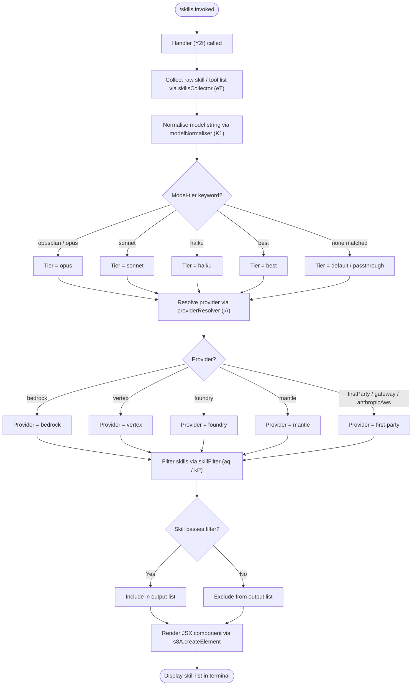

# `/skills`

> Analysis basis: CC v2.1.160 bundle.js (AST extraction + Claude interpretation)
> Minimum version: v2.1.160

---

## Overview

The `/skills` command lists the skills (capabilities/tools) currently available to the Claude Code agent. It is a `local-jsx` command that executes immediately without requiring an agent round-trip, rendering its output as a JSX component directly in the CLI terminal. The handler fetches available skill metadata, normalises model and provider identifiers, and presents them in a structured list.

---

## Registration

| Field | Value |
|---|---|
| type | `local-jsx` |
| name | `skills` |
| description | `List available skills` |
| immediate | `true` |
| module_id | `dl1` |
| load_inline | `true` |
| loc_byte | `12086071` |
| loc_byte_end | `12086203` |
| loc_line | `8331` |
| arbor_handler.name | `Y2f` |
| arbor_handler.fqn | `claude-2.1.160::Y2f` |
| arbor_handler.kind | `AsyncFunction` |
| arbor_handler.resolution_path | `module_id` |
| arbor_handler.n_hits | `0` |

Analysis basis: CC v2.1.160 bundle.js:+12086071

---

## Input Branching

The command has 3+ distinct internal branches (provider detection, model-tier normalisation, and skill-set filtering), so a Mermaid flowchart is used below.



---

## Behavioral Spec

### 1. Command Entry — Main Handler

The top-level async handler (`Y2f`) is resolved via the `module_id` → `dl1` path.
It immediately (no user prompt required, `immediate: true`) invokes the skill-collection pipeline and passes the result to a JSX renderer.

```
async function skillsCommandHandler(context):
    rawSkills = await skillsCollector(context)
    element = createJSXElement(SkillListComponent, { skills: rawSkills })
    return element
```

Analysis basis: CC v2.1.160 bundle.js:+12085886

---

### 2. Skill Collection — `skillsCollector`

`skillsCollector` (identifier `eT`) is the primary aggregation function. It:

1. Retrieves the full tool/skill registry entries via `rawSkillEntries` (identifier `er6`), which internally calls `Object.entries` over the skill registry and resolves the locale-aware label map (identifier `l_` → `lp`).
2. Applies the **model-name normaliser** (`K1`) to associate each skill with the current model tier.
3. Applies the **skill filter** (`aq`) to exclude skills that are not available for the current provider/model combination.
4. Checks the internal skill-availability set (`hs4.has`) — a `Set` used as an allowlist — and removes any skill whose key is absent.
5. Returns the filtered, normalised list (max structural depth: 4 levels, literal value `4` at bundle.js:+2231874; minimum 3 entries checked, literal `3` at bundle.js:+2231959).

```
async function skillsCollector(context):
    allEntries   = rawSkillEntries(context)          // Object.entries over registry
    normalised   = allEntries.map(e => modelNormaliser(e))
    filtered     = skillFilter(normalised, context)
    available    = filtered.filter(s => skillAllowSet.has(s.key))
    return available
```

Analysis basis: CC v2.1.160 bundle.js:+2231882, +2231946, +2231874, +2231959

---

### 3. Model-Name Normaliser — `modelNormaliser`

`modelNormaliser` (identifier `K1`) canonicalises the model string before tier-matching. Steps:

1. **Trim** whitespace from the raw model string (`H.trim` at bundle.js:+2233677).
2. **Lowercase** the trimmed value (`_.toLowerCase` at bundle.js:+2233688).
3. Apply **slug normalisation** (`C0` → `wKH` → `FH`), converting non-ASCII characters and run-length collapsing with a step value of `1` (literal bundle.js:+2969792).
4. **Replace** special characters via `A.replace` (bundle.js:+2233716).
5. Check against the **reserved-keyword list** (`DKH` → `zKH.includes`, bundle.js:+2226884).
6. Classify into model tier via keyword matching against:
   - `"opusplan"` (bundle.js:+2233773)
   - `"[1m]"` suffix marker (bundle.js:+2233799)
   - `"sonnet"` (bundle.js:+2233814)
   - `"haiku"` (bundle.js:+2233853)
   - `"opus"` (bundle.js:+2233892)
   - `"best"` (bundle.js:+2233929)
7. Apply `_.replace` for any remaining substitutions (bundle.js:+2234019).
8. Return the canonical model-tier string.

```
function modelNormaliser(rawModelString):
    s = rawModelString.trim()
    s = s.toLowerCase()
    s = slugNormalise(s)           // wKH / FH pipeline
    s = s.replace(specialChars, "")
    if reservedKeywords.includes(s): return s   // pass through
    tier = matchTier(s,
             ["opusplan", "[1m]", "sonnet", "haiku", "opus", "best"])
    s = s.replace(remainingPatterns, "")
    return tier ?? s
```

Analysis basis: CC v2.1.160 bundle.js:+2233677, +2233688, +2233706, +2233716, +2233773, +2233799, +2233814, +2233853, +2233892, +2233929

---

### 4. Provider Resolution — `providerResolver`

`providerResolver` (identifier `jA`) maps the current runtime environment to a provider token. It checks against the following string constants (in order):

| Priority | Token | Source literal loc_byte |
|---|---|---|
| 1 | `"bedrock"` | +2047861 |
| 2 | `"foundry"` | +2047911 |
| 3 | `"mantle"` | +2048021 |
| 4 | `"vertex"` | +2048069 |
| 5 | `"firstParty"` | +2048512 |
| 6 | `"anthropicAws"` | +2048530 |
| 7 | `"gateway"` | +2048550 |

It delegates to `FH` (string coercion helper, calls `String()` at bundle.js:+26899) for safe type conversion.

```
function providerResolver(runtimeContext):
    raw = String(runtimeContext.provider)
    for token in ["bedrock","foundry","mantle","vertex",
                  "firstParty","anthropicAws","gateway"]:
        if raw.includes(token): return token
    return "firstParty"   // default
```

Analysis basis: CC v2.1.160 bundle.js:+2047821, +2048512

---

### 5. Skill Filter — `skillFilter` and `modelIdFilter`

`skillFilter` (identifier `aq`) composes two sub-filters:

**5a. Raw skill entry builder (`rawSkillEntries` / `er6`)**
- Iterates `Object.entries` over the skill registry (bundle.js:+2049850).
- Calls the locale-label resolver `l_` → `lp` (bundle.js:+1227700) for each entry.

**5b. Model-ID filter (`modelIdFilter` / `kP`)**
- Lowercases the model ID (`H.toLowerCase`, bundle.js:+2230712).
- Checks for substring membership (`H.includes`, bundle.js:+2230728).
- Handles the `"application-inference-profile"` Bedrock ARN prefix (literal bundle.js:+2231764).
- Applies a replacement pass (`H.replace`, bundle.js:+2231676) to strip ARN decorators.
- Recognises the Claude Opus 4 family versions: `claude-opus-4-8` through `claude-opus-4-0` (bundle.js:+2230739–+2231056), Sonnet 4 family (bundle.js:+2231088–+2231244), Haiku 4-5 (bundle.js:+2231278), Claude 3.x family (bundle.js:+2231337–+2231628).

**5c. Availability check (`rU8`)**
- A boolean gate applied per-skill after model-ID filtering.
- Also applies the `wj` (string-replace normaliser, bundle.js:+2235309) pass.

```
function skillFilter(entries, context):
    modelId = context.modelId.toLowerCase()
    // strip Bedrock ARN prefix if present
    if modelId.includes("application-inference-profile"):
        modelId = modelId.replace(arnPattern, "")
    result = []
    for entry in entries:
        if modelIdFilter(modelId, entry) and availabilityGate(entry):
            result.append(entry)
    return result
```

Analysis basis: CC v2.1.160 bundle.js:+2231721, +2231744, +2231753, +2231764, +2231804, +2231808

---

### 6. Bootstrap Fetch (Background — `bootstrapFetcher`)

The call graph traversal reaches the bootstrap HTTP fetch path (`H` → `N`) which is responsible for loading skill metadata from a remote endpoint. Key facts:

- Log prefix: `"[Bootstrap] Fetching"` (bundle.js:+15451800) and `"[Bootstrap] Fetch ok"` (bundle.js:+15452164).
- HTTP headers sent: `Content-Type: application/json` (bundle.js:+15451885, +15451900) and `User-Agent` (bundle.js:+15451919).
- Fetch timeout: **5000 ms** (bundle.js:+15451991).
- Telemetry event on fetch: `api_bootstrap_fetch` (bundle.js:+15452112).
- On parse failure: emits `parse_failed` label (bundle.js:+15452134).
- Uses a cache map (`c_.get`, bundle.js:+15451836) to avoid repeated fetches.
- Debug logging controlled by `"debug"` literal (bundle.js:+204223).

```
async function bootstrapFetcher(url):
    if cache.has(url): return cache.get(url)
    log("[Bootstrap] Fetching", url)
    response = await fetch(url, {
        headers: { "Content-Type": "application/json",
                   "User-Agent": userAgentString },
        timeout: 5000
    })
    emit("api_bootstrap_fetch", { ... })
    try:
        data = parseJSON(response)
    catch:
        emit("parse_failed")
        return null
    cache.set(url, data)
    log("[Bootstrap] Fetch ok")
    return data
```

Analysis basis: CC v2.1.160 bundle.js:+15451800, +15451836, +15451885, +15451991, +15452112

---

### 7. String Normalisation Helpers

Several helper functions participate in text normalisation across the pipeline:

- **`slugNormaliser` (`C0` → `wKH`)**: converts strings to URL-safe slugs, step constant `1` (bundle.js:+2969792).
- **`stringReplacer` (`wj`)**: applies regex replacement to model name strings (bundle.js:+2235309).
- **`prefixMatcher` (`gq`)**: calls `GHH`, `K1`, and `yP` in sequence (bundle.js:+2229757–+2229807) to match known prefixes.
- **`truthy coercion` (`FH` → `String`)**: coerces values to string with `yes`/`on` booleans recognised (bundle.js:+26948, +26954).
- **Maximum model-name token length**: 40 characters (literal bundle.js:+15873361).

Analysis basis: CC v2.1.160 bundle.js:+2969779, +2235309, +26899, +26948, +15873361

---

## State & Side Effects

| Item | Detail |
|---|---|
| Telemetry | `tengu_feature_sad` (bundle.js:+966258) — emitted via `t6` → `d` path |
| Bootstrap fetch telemetry | `api_bootstrap_fetch` event (bundle.js:+15452112); `parse_failed` label on JSON parse error (bundle.js:+15452134) |
| HTTP fetch | Bootstrap fetch to remote endpoint with 5000 ms timeout; result cached in `c_` map |
| Cache | Skill metadata cached per-URL in a module-level Map (`c_.get`, bundle.js:+15451836) |
| Allowlist Set | `hs4` — a module-level `Set` acting as skill-availability allowlist (bundle.js:+2231946) |
| `F64` Set | Provider-class membership check (`Ce` → `F64.has`, bundle.js:+840632); initial index `0` (bundle.js:+840650) |
| appState changes | None detected in depth-2 traversal |
| Sound | None detected in depth-2 traversal |
| Hook registration | None detected in depth-2 traversal |
| Rendering | Returns a JSX element via `s8A.createElement` (bundle.js:+12085886) for terminal display |

---

## Version History

| Version | Change |
|---|---|
| v2.1.160 | Initial analysis |

---

## Common Mistakes

1. **Expecting a prompt round-trip**: `/skills` is `immediate: true` — it never sends a message to the model. Output is rendered inline without an agent turn.
2. **Assuming static skill lists**: Skills are gated by both the active model tier and the provider. Switching between `bedrock`, `vertex`, or first-party endpoints may change which skills appear.
3. **Ignoring the bootstrap cache**: The skill metadata is fetched once and cached. If you update your API configuration mid-session, the cached skill list may not reflect the change until the cache is cleared or the session is restarted.
4. **Model-ID case sensitivity**: The filter pipeline lowercases model IDs before comparison. Providing a mixed-case model ID in configuration is safe, but logging output will show the normalised form.
5. **Bedrock ARN model IDs**: If using an `application-inference-profile` ARN as your model ID, the filter strips the ARN prefix before tier-matching. Skills will be matched against the underlying model name, not the full ARN.

---

## Appendix — Identifier Mapping

> For bundle debugging only. Identifiers change across versions.

| Identifier | Role |
|---|---|
| `Y2f` | Main async command handler (`skillsCommandHandler`) — Arbor-resolved entry point |
| `eT` | Skill-collection aggregator (`skillsCollector`) |
| `K1` | Model-name normaliser (`modelNormaliser`) |
| `H` | Generic string operand / current model or URL string in context |
| `N` | Bootstrap fetch orchestrator (`bootstrapOrchestrator`) |
| `o$` | Auxiliary fetch helper called from bootstrap path |
| `Ce` | Provider-class membership checker (delegates to `F64.has`) |
| `wj` | String replacer / model-name decorator stripper (`stringReplacer`) |
| `gq` | Prefix matcher pipeline (`prefixMatcher`) |
| `t6` | Telemetry dispatcher (emits `tengu_feature_sad`) |
| `_` | Secondary string operand / intermediate value |
| `C0` | Slug-normalisation entry (`slugNormaliser`) |
| `wKH` | Slug-normalisation implementation (inner step) |
| `A` | String helper / model-ID carrier with `.replace` / `.toLowerCase` |
| `f` | Stream/connection object with `.close` methods |
| `DKH` | Reserved-keyword checker (`reservedKeywordChecker`) |
| `dN` | Skill-descriptor builder (`skillDescriptorBuilder`) |
| `xM` | Skill metadata accessor (`skillMetaAccessor`) |
| `Jf` | Skill-property resolver (aggregates `RuH`, `km4`, `i4q`, `tr6`, `jA`) |
| `_gH` | Alternate skill-property resolver path (delegates to `Jf`) |
| `tT` | Skill-tier matcher (`skillTierMatcher`, composes `xM`, `Jf`, `jA`) |
| `jA` | Provider resolver (`providerResolver`) |
| `XDq` | Skill-tier dispatcher (wraps `tT`) |
| `xa6` | Skill-key allowlist checker (delegates to `Ss4.includes`) |
| `AgH` | String coercion shim for skill attributes (delegates to `FH`) |
| `FH` | Primitive-to-string coercer (calls `String()`) |
| `aq` | Skill filter (`skillFilter`) |
| `er6` | Raw skill entry builder (`rawSkillEntries`, uses `Object.entries`) |
| `l_` | Locale-label resolver entry (`localeResolver`) |
| `kP` | Model-ID filter (`modelIdFilter`) |
| `rU8` | Per-skill availability gate (`availabilityGate`) |

---

Note: index built via Arbor fallback; some signals (telemetry, literals) may be missing — see arbor-fallback.js.