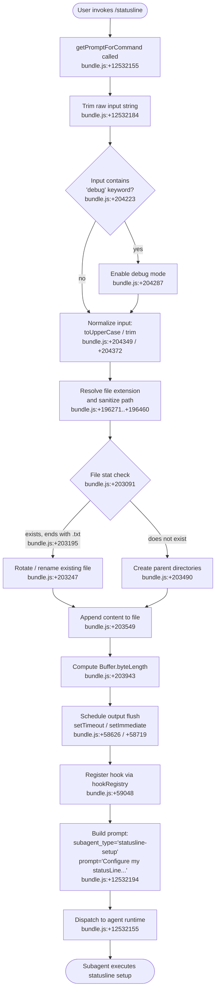

# `/statusline`

> Analysis basis: CC v2.1.160 bundle.js (AST extraction + Claude interpretation)
> Minimum version: v2.1.160

---

## Overview

The `/statusline` command instructs Claude Code to set up its status line UI by delegating to a subagent. It reads the user's shell PS1 configuration, then dispatches a prompt to a dedicated `statusline-setup` subagent that configures the terminal status line display accordingly. The command is a `prompt`-type command: it builds a short inline prompt and hands it to the agent runtime rather than executing logic directly.

---

## Registration

| Field | Value |
|---|---|
| type | `prompt` |
| name | `statusline` |
| description | Set up Claude Code's status line UI |
| aliases | *(none)* |
| loc_byte | `12531844` |
| loc_byte_end | `12532358` |
| handler_method | `getPromptForCommand` |
| handler_method_start | `12532149` |
| handler_method_end | `12532357` |
| prompt_body.length | 76 characters |
| prompt_body.trace | inline template |
| prompt_body.summary | Instructs the agent to create a subagent with `subagent_type` set to `"statusline-setup"` and provides a fixed prompt text (citing the literal `"Configure my statusLine from my shell PS1 configuration"` at bundle.js:+12532194) |
| arbor_handler.name | `getPromptForCommand` |
| arbor_handler.fqn | `claude-2.1.160::getPromptForCommand` |
| arbor_handler.kind | Method |
| arbor_handler.resolution_path | direct |
| arbor_handler.n_hits | 1 |

Analysis basis: CC v2.1.160 bundle.js:+12531844

---

## Input Branching

The command flow has more than three distinct branches once the prompt is dispatched: the input string is trimmed, checked for debug mode, normalized (extension stripping, casing), written to a file, and finally a subagent is dispatched with output routing. A Mermaid flowchart is used below.



---

## Behavioral Spec

### 1. Handler Entry — `getPromptForCommand`

The `getPromptForCommand` method is the sole handler for this command (Arbor resolution: `direct`, n_hits: 1). It is an inline ObjectMethod on the registration object.

```
function getPromptForCommand(inputString):
    trimmed = inputString.trim()                 // bundle.js:+12532184
    prompt  = buildStatuslinePrompt(trimmed)     // bundle.js:+12532155
    return prompt
```

Analysis basis: CC v2.1.160 bundle.js:+12532149–12532357

---

### 2. Prompt Construction

The handler constructs a fixed, template-driven prompt. The prompt body is 76 characters long and is rendered as an inline template string. Its content instructs the runtime to spawn a subagent of type `"statusline-setup"` with the embedded prompt text `"Configure my statusLine from my shell PS1 configuration"`.

```
function buildStatuslinePrompt(userInput):
    subagentType = "statusline-setup"
    subagentPrompt = "Configure my statusLine from my shell PS1 configuration"
    // prompt_body.length == 76
    // prompt references subagentType and subagentPrompt as template slots
    return templateString(subagentType, subagentPrompt)
```

Analysis basis: CC v2.1.160 bundle.js:+12532194 (literal), +12532265 (content type `"text"`)

---

### 3. Input Normalization Pipeline (function `normalizeInput`)

Before the prompt reaches the subagent dispatch layer, the raw input passes through a multi-step normalization pipeline rooted at the `N` function (internal identifier).

```
function normalizeInput(raw):
    step1 = raw.trim()                            // bundle.js:+204372
    step2 = step1.toUpperCase()                   // bundle.js:+204349

    if containsDebugMarker(step1):                // bundle.js:+204223 ("debug")
        enableDebugMode()                         // bundle.js:+204287

    sanitized = sanitizePath(step2)               // bundle.js:+204369
    return sanitized
```

Analysis basis: CC v2.1.160 bundle.js:+204223, +204287, +204349, +204369, +204372

---

### 4. Path Sanitization (function `sanitizePath`)

The sanitization helper (internal identifier `x4`) performs extension resolution and path trimming.

```
function sanitizePath(input):
    mapped    = extensionMap.map(input)           // bundle.js:+195986
    replaced  = input.replace("[REDACTED]", ...)  // bundle.js:+196298, 196350
    segment   = replaced.at(2)                    // bundle.js:+196408 (index 2)
    lastIdx   = segment.lastIndexOf(...)          // bundle.js:+196434
    result    = segment.slice(0, lastIdx)         // bundle.js:+196460
    return result
```

Note: The constant `2` at bundle.js:+196379 is the array index used in `.at()`. The string `"[REDACTED]"` at bundle.js:+196350 is a sanitized placeholder visible in the bundle.

Analysis basis: CC v2.1.160 bundle.js:+196271–196460

---

### 5. File Write Pipeline (function `writeOutputToFile`)

The output routing subsystem (internal identifier `rmK`) orchestrates file I/O for persisting statusline configuration.

```
function writeOutputToFile(content, targetDir):
    dirPath  = path.dirname(targetDir)            // bundle.js:+203769
    existing = statFile(dirPath)                  // bundle.js:+203091

    if existing.endsWith(".txt"):                 // bundle.js:+203195
        truncated = existing.slice(0, -4)         // bundle.js:+203206 (len 4 from +203217)
        renameFile(existing, truncated)           // bundle.js:+203247
        if errorCode == "EISDIR":                 // bundle.js:+174371
            handleDirError()                      // bundle.js:+174363
        unlinkOld()                               // bundle.js:+203287

    mkdirRecursive(dirPath)                       // bundle.js:+203490
    appendFile(dirPath, content)                  // bundle.js:+203549
    byteLen = Buffer.byteLength(content)          // bundle.js:+203943

    flushOutput(byteLen)                          // bundle.js:+203976
    promise.then(bindWriter)                      // bundle.js:+203993
```

Analysis basis: CC v2.1.160 bundle.js:+203769–204098

---

### 6. Output Flush Scheduler (function `scheduleFlush`)

The flush scheduler (internal identifier `QuH`) batches writes using a debounce-style timer pattern.

```
function scheduleFlush(segments, lines):
    clearTimeout(existingTimer)                   // bundle.js:+58462
    joined = segments.join(...)                   // bundle.js:+58536
    lineJoined = lines.join(...)                  // bundle.js:+58580

    timer = setTimeout(flushCallback, 1000)       // bundle.js:+58350, +58626
    // fallback limit: 100 items                  // bundle.js:+58371
    segments.push(newSegment)                     // bundle.js:+58661
    setImmediate(immediateFlush)                  // bundle.js:+58719
    lines.push(newLine)                           // bundle.js:+58810
```

Analysis basis: CC v2.1.160 bundle.js:+58350, +58371, +58462, +58626, +58719

---

### 7. Hook Registration (function `registerHook`)

After the file write pipeline completes, a hook is registered via the hook registry (internal identifier `O9`).

```
function registerHook(hookDef):
    hookRegistry.register(hookDef)                // bundle.js:+59048
```

Analysis basis: CC v2.1.160 bundle.js:+59048, +204098

---

### 8. Bootstrap / API Fetch (function `bootstrapFetch`)

The handler also reaches the bootstrap fetch layer (internal identifier `H` at the top of the call graph), which performs a network preflight before subagent dispatch.

```
function bootstrapFetch(url):
    log("[Bootstrap] Fetching", url)              // bundle.js:+15451800
    response = fetch(url, {
        headers: {
            "Content-Type": "application/json",   // bundle.js:+15451885, +15451900
            "User-Agent": <agent string>          // bundle.js:+15451919
        },
        timeout: 5000                             // bundle.js:+15451991
    })
    cacheMap.get(cacheKey)                        // bundle.js:+15451836

    if parseFailed:
        emitTelemetry("api_bootstrap_fetch",      // bundle.js:+15452112
                      "parse_failed")             // bundle.js:+15452134
    else:
        log("[Bootstrap] Fetch ok")               // bundle.js:+15452164
```

Analysis basis: CC v2.1.160 bundle.js:+15451798–15452164

---

### 9. Model Selection Pipeline (function `resolveModel`)

The call graph reaches a model-name normalization subsystem (internal identifier `K1`) that maps shorthand names to canonical model identifiers. This is invoked when building the subagent request.

```
function resolveModel(rawName):
    name = rawName.trim().toLowerCase()           // bundle.js:+2233677, +2233688

    switch name:
        case "opusplan":  return canonicalize("opusplan")  // bundle.js:+2233773
        case "[1m]":      return canonicalize("[1m]")      // bundle.js:+2233799
        case "sonnet":    return canonicalize("sonnet")    // bundle.js:+2233814
        case "haiku":     return canonicalize("haiku")     // bundle.js:+2233853
        case "opus":      return canonicalize("opus")      // bundle.js:+2233892
        case "best":      return canonicalize("best")      // bundle.js:+2233929
        default:
            replaced = name.replace(...)                   // bundle.js:+2233716
            return applyProviderMapping(replaced)          // bundle.js:+2233752

    // Provider backends checked: "firstParty", "anthropicAws",
    //   "gateway", "mantle"                               // bundle.js:+2229981, +2048530,
                                                           //   +2048550, +2230622
```

Analysis basis: CC v2.1.160 bundle.js:+2233677–2234019

---

## State & Side Effects

| Item | Detail |
|---|---|
| Telemetry | `tengu_feature_sad` (bundle.js:+966258) |
| Telemetry (bootstrap) | `api_bootstrap_fetch` with tag `parse_failed` (bundle.js:+15452112, +15452134) |
| Hook registration | `hookRegistry.register(...)` called after file write completes (bundle.js:+59048) |
| File I/O | Appends statusline configuration to a file under a resolved directory; renames existing `.txt` files before writing; creates parent directories recursively (bundle.js:+203490, +203549) |
| Timer side effects | `clearTimeout` / `setTimeout(_, 1000)` / `setImmediate` used for batched output flushing (bundle.js:+58462, +58626, +58719) |
| appState changes | <!-- TODO: not found in depth-2 traversal; needs --depth 4 --> |
| Sound | <!-- TODO: not found in depth-2 traversal; needs --depth 4 --> |
| Network | Bootstrap HTTP fetch with `Content-Type: application/json` and 5000 ms timeout (bundle.js:+15451885, +15451991) |
| Buffer tracking | `Buffer.byteLength` computed on written content for quota / limit tracking (bundle.js:+203943, +203642) |

---

## Version History

| Version | Change |
|---|---|
| v2.1.160 | Initial analysis |

---

## Common Mistakes

1. **Invoking `/statusline` without a shell PS1 context**: The embedded prompt explicitly references PS1 shell configuration (`"Configure my statusLine from my shell PS1 configuration"`, bundle.js:+12532194). If the environment has no PS1 variable set, the subagent may produce a generic or empty statusline.
2. **Expecting immediate output**: The write pipeline uses a `setTimeout` of 1000 ms (bundle.js:+58350) plus `setImmediate` for flushing. Output may not appear synchronously; do not chain commands that depend on the statusline file being present immediately.
3. **Collision with existing `.txt` files**: If a `.txt`-suffixed file already exists at the target path, it will be renamed and the original unlinked (bundle.js:+203195, +203247, +203287). Do not store unrelated `.txt` files in the statusline output directory.
4. **Confusing this command with a model-selection command**: The model normalization pipeline (`resolveModel`) is reached transitively because the subagent dispatch layer shares model-resolution infrastructure. `/statusline` does not directly accept a model name as input.
5. **Assuming the command accepts arbitrary user text**: The prompt body is a fixed 76-character inline template (bundle.js:+12532149–12532357). Any user-supplied argument beyond the command token is trimmed and used only as context; it does not override the embedded subagent prompt.

---

## Appendix — Identifier Mapping

> For bundle debugging only. Identifiers change across versions.

| Identifier | Role |
|---|---|
| `__handler_statusline` | Synthetic BFS entry point for the `/statusline` command handler |
| `H` | Bootstrap fetch / top-level HTTP request dispatcher |
| `N` | Input normalization pipeline (trim, uppercase, debug-check) |
| `lmK` | Normalization sub-step coordinator |
| `ADA` | Auxiliary normalization helper (calls `lbK`, `nbK`) |
| `SH` | JSON serialization helper (`JSON.stringify` wrapper) |
| `x4` | Path sanitization function (extension mapping, replace, slice) |
| `xwA` | Extension map builder (`BmK.map`) |
| `q` | File unlink helper (`ykK.unlinkSync`) |
| `A` | Lowercase filename utility (`f.toLowerCase`) |
| `PmH` | Output write dispatcher (calls `ZwA`) |
| `ZwA` | Low-level stdout/stream write (`H.write`) |
| `rmK` | File write pipeline orchestrator |
| `QuH` | Output flush scheduler (clearTimeout / setTimeout / setImmediate) |
| `R$H` | Path join and resolution helper (calls `Iu6`, `n8`, `y6`) |
| `d6` | Directory or path utility |
| `A46` | EISDIR error handler (calls `G8`) |
| `gwA` | Path join helper using `je.join` and `y6` |
| `FwA` | File stat / rename / unlink sequencer |
| `imK` | mkdir + appendFile writer (bound via `.bind`) |
| `O9` | Hook registration dispatcher (`HDA.register`) |
| `o$` | App state accessor |
| `Ce` | Feature-flag / capability set checker (`F64.has`) |
| `wj` | String replace utility |
| `gq` | Outer model + prompt orchestrator |
| `GHH` | Prompt composition helper (calls `DN`, `p9H`, `ZA`, `lQ`) |
| `DN` | Prompt fragment builder |
| `p9H` | Prompt metadata annotator |
| `lQ` | Prompt line parser / validator |
| `K1` | Model name normalizer (trim, lowercase, switch-case dispatch) |
| `C0` | Model canonicalization helper (`wKH`) |
| `DKH` | Provider inclusion check (`zKH.includes`) |
| `dN` | Model sub-resolver (calls `xM`, `Jf`) |
| `_gH` | Alternative model resolver (calls `Jf`) |
| `tT` | Model request builder (calls `xM`, `Jf`, `jA`) |
| `XDq` | Model request wrapper (calls `tT`) |
| `xM` | Model dispatch executor (calls `jA`) |
| `xa6` | Model capability inclusion check (`Ss4.includes`) |
| `AgH` | Final model handler (calls `FH`) |
| `yP` | Model pipeline coordinator (calls `K1`, `R0`) |
| `R0` | Full model resolution chain (calls `EA`, `IHH`, `MzH`, `qgH`, `tT`, `FX`, `xM`, `jA`, `Jf`, `dN`) |
| `t6` | Telemetry event emitter (calls `d`) |
| `d` | Telemetry sink (`tengu_feature_sad` at bundle.js:+966258) |

---

Note: index built via Arbor fallback; some signals (telemetry, literals) may be missing — see arbor-fallback.js.