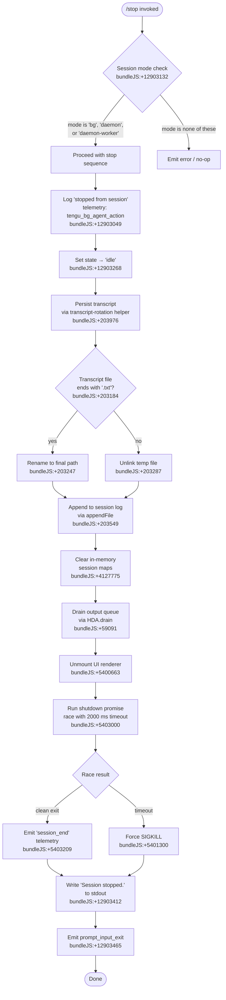

# `/stop`

> Analysis basis: CC v2.1.160 bundle.js (AST extraction + Claude interpretation)
> Minimum version: v2.1.160

---

## Overview

`/stop` terminates the currently running background session while preserving its transcript and worktree on disk. It is a `local-jsx` command that fires immediately (no confirmation prompt) and transitions the session state through a structured shutdown pipeline before emitting a telemetry event and returning a "Session stopped." message to the user.

---

## Registration

| Field | Value |
|---|---|
| type | `local-jsx` |
| name | `stop` |
| description | `Stop this background session; transcript and worktree are kept` |
| loc_byte | `12903911` |
| loc_byte_end | `12904095` |
| loc_line | `9532` |
| immediate | `true` |
| module_id | `QqK` |
| load_inline | `true` |
| arbor_handler.name | `byf` |
| arbor_handler.fqn | `claude-2.1.160::byf` |
| arbor_handler.kind | `AsyncFunction` |
| arbor_handler.resolution_path | `module_id` |
| arbor_handler.n_hits | `0` |

Analysis basis: CC v2.1.160 bundle.js:+12903911

---

## Input Branching

The command has multiple distinct branches: session-mode validation, state transition logic, file-system operations (transcript rotation, worktree preservation), and the final shutdown path. A Mermaid flowchart is used.



---

## Behavioral Spec

### 1. Entry point — stop command handler (`byf`)

Analysis basis: CC v2.1.160 bundle.js:+12903630

```
async function stopCommandHandler(context):
    emit telemetry("tengu_bg_agent_action", {action: "stop_command"})
    sessionState = readSessionState(context)           // HS8 helper
    validate sessionMode ∈ {"bg", "daemon", "daemon-worker"}
    if invalid:
        return early with no-op or error rendering
    call shutdownOrchestrator(context, sessionState)
    call exitTeardown(context)
```

### 2. Session state reader (`HS8`)

Analysis basis: CC v2.1.160 bundle.js:+12903047

```
function readSessionState(context):
    d()                          // log / debug helper
    sessionId = resolveSessionId(context)   // y6 → zN
    checkProcessMode(context)    // N9 → OzH validates bg/daemon/daemon-worker
    logEntry("stopped from session", sessionId)   // literal at +12903239
    setState("idle")                              // literal at +12903268
    return {sessionId, mode, stateSnapshot}
```

The string `"stopped from session"` (bundle.js:+12903239) is written to the session log entry. The session state is immediately set to `"idle"` (bundle.js:+12903268) before any filesystem work begins.

### 3. Session file / transcript manager (`_1`)

Analysis basis: CC v2.1.160 bundle.js:+4127808

```
async function sessionFileManager(sessionId, stateSnapshot):
    filePath = path.join(sessionDir, sessionId)      // f2.join
    await Promise.all([fs.stat(filePath), ...])      // L2.stat
    if stat error code === "ENOENT":
        handle missing file gracefully               // V8 → G8
    inMemoryMap.delete(sessionId)                    // OLH.delete
    deduplicationSet.delete(sessionId)               // GYH.delete
    basename = path.basename(filePath)               // f2.basename
    existingEntry = inMemoryMap.get(sessionId)       // OLH.get
    if not deduplicationSet.has(sessionId):
        deduplicationSet.add(sessionId)
        if file readable:
            raw = await fs.readFile(filePath, "utf-8")  // L2.readFile
            parsed = JSON.parse(raw)                    // m6 helper
            validate with Number.isFinite checks        // +4128549
            inMemoryMap.set(sessionId, parsed)          // OLH.set
    emit telemetry("tengu_bg_state_read_transient")     // +4127971
```

Session status values observed in literals: `"done"`, `"success"`, `"failed"`, `"failure"`, `"stopped"`, `"active"` (bundle.js:+4134427–+4134608).

### 4. State persistence / transcript rotation (`rmK`)

Analysis basis: CC v2.1.160 bundle.js:+203736

```
async function transcriptRotation(sessionId, transcript):
    dirPath = path.dirname(transcriptPath)           // je.dirname
    ensureDir(dirPath)                               // _y
    buildFinalPath(sessionId)                        // R$H → Iu6, je.join, n8, y6
    getGitWorktreePath()                             // gwA → je.join, y6
    result = await rotateFile(transcriptPath)        // FwA
        stat the file                                // Hy.stat
        if path ends with ".txt":                    // Hy.rename
            rename to final path (strip last 4 chars // H.slice, value 4 at +203217)
        else:
            Hy.unlink(tempPath)                      // Hy.unlink
    byteLen = Buffer.byteLength(transcript)          // +203943
    await appendWorker(sessionId, transcript)        // imK.bind → Hy.appendFile
    registerSignalHandler()                          // O9 → HDA.register
```

The `.txt` suffix check (bundle.js:+203195) determines whether the in-progress transcript file is renamed to its permanent name or deleted. A slice of 4 characters is applied (numeric literal `4`, bundle.js:+203217) to strip the `.txt` extension on rename.

### 5. Output queue flush helper (`QuH`)

Analysis basis: CC v2.1.160 bundle.js:+203736 (called via `rmK`)

```
function flushOutputQueue(queue):
    clearTimeout(existingTimer)
    if queue is non-empty:
        joined = queue.join(separator)           // $.join, L.join
        write(joined)                            // H (write)
        scheduleNextFlush()                      // setTimeout, setImmediate
        queue.push(nextChunk)                    // $.push
    finalize()                                   // J.join
    callPostFlushHook()                          // Y, w, D
```

Timer constants observed: `1000` ms and `100` ms (bundle.js:+58350, +58371).

### 6. Process shutdown / teardown (`f9`)

Analysis basis: CC v2.1.160 bundle.js:+5402718

```
async function processShutdown(options):
    await Promise.resolve()
    renderFinalOutput()                          // q7, K, f
    renderSessionSummary()                       // gN_ → hjH.writeSync, j6.dim
    clearTimeout(shutdownTimer)
    processMap = ML.get(sessionId)               // QN_ path
    if processMap:
        process.kill(pid, "SIGKILL")             // QN_ → process.kill, +5401300
    shutdownRaceTimeout = Math.max(3500, ...)    // literal at +5402822
    SjH.unref()                                  // unref timer
    drainOutputAdapter()                         // duH → HDA.drain
    result = await Promise.race([
        shutdownPromise,
        timeout(2000)                            // literal at +5403000
    ])
    clearTimeout(raceTimer)
    await cleanupAllSettled()                    // zW9 → Promise.allSettled
    emit telemetry("session_end")                // literal at +5403209
    emit telemetry("tengu_cache_eviction_hint")  // +5403174
    hjH.writeSync(finalMessage)                  // +5403278
```

The shutdown race uses a hard 2000 ms timeout (bundle.js:+5403000). If the graceful shutdown does not complete in time, the process is sent `SIGKILL` (bundle.js:+5401300). The 3500 ms value (bundle.js:+5402822) governs an earlier unref timer.

### 7. Bootstrap / model resolution helper (`H`, called from `byf`)

Analysis basis: CC v2.1.160 bundle.js:+15451798 and +15451800

```
async function bootstrapFetch(endpoint, options):
    log("[Bootstrap] Fetching", endpoint)         // literal at +15451800
    fetch(endpoint, {
        headers: {
            "Content-Type": "application/json",   // +15451885, +15451900
            "User-Agent": userAgentString          // +15451919
        },
        timeout: 5000                             // literal at +15451991
    })
    buildModelContext()                            // gq, K1, yP, R0
    resolveModelAlias(alias):                      // K1
        normalize to lowercase
        map aliases: "opusplan", "sonnet", "haiku", "opus", "best"
        // literals at +2233773, +2233814, +2233853, +2233892, +2233929
    emit telemetry("api_bootstrap_fetch")          // literal at +15452112
    if parse fails: tag "parse_failed"             // +15452134
    else: log("[Bootstrap] Fetch ok")              // +15452164
```

The bootstrap fetch is involved in resolving model/session configuration needed before the stop sequence commits its final state.

### 8. Telemetry emitter (`hH` / `d`)

Analysis basis: CC v2.1.160 bundle.js:+966121, +966258

```
function emitFeatureTelemetry(result):
    if success:
        emit("tengu_feature_ok")    // +966123
    else:
        emit("tengu_feature_sad")   // +966258
```

`"job_stop_self"` (bundle.js:+12903443) is the label passed to the feature telemetry call for this command's self-initiated stop action.

---

## State & Side Effects

| Item | Detail |
|---|---|
| Telemetry — `tengu_bg_agent_action` | Fired at command entry with action tag `"stop_command"` (bundle.js:+12903049, +12903644) |
| Telemetry — `tengu_bg_state_read_transient` | Fired during in-memory session map read (bundle.js:+4127971) |
| Telemetry — `tengu_feature_ok` / `tengu_feature_sad` | Success/failure outcome of the stop feature (bundle.js:+966123, +966258) |
| Telemetry — `tengu_daemon_config_reload` | Fired if daemon config changes during shutdown (bundle.js:+15862022) |
| Telemetry — `tengu_startup_perf` | Startup profiling report emitted if profiling was active (bundle.js:+215246) |
| Telemetry — `tengu_scroll_summary` | Summary scroll event fired during final render (bundle.js:+5402118) |
| Telemetry — `tengu_pewter_brook` | UI mode / fullscreen detection event (bundle.js:+3414742) |
| Telemetry — `tengu_cache_eviction_hint` | Cache cleanup hint fired at process exit (bundle.js:+5403174) |
| Telemetry — `session_end` | Canonical session end event (bundle.js:+5403209) |
| Session state | Set to `"idle"` immediately on invocation (bundle.js:+12903268) |
| Transcript file | Renamed from `.txt` temp path to permanent path, or unlinked if already finalized (bundle.js:+203247, +203287) |
| Worktree | **Preserved** — no deletion of git worktree occurs; description confirms this |
| In-memory session maps | `OLH` (session map) and `GYH` (deduplication set) entries deleted (bundle.js:+4127775, +4127789) |
| Output queue | Flushed via `HDA.drain` before process exit (bundle.js:+59091) |
| Signal handler | Registered via `HDA.register` at end of transcript rotation (bundle.js:+59048) |
| UI renderer | Unmounted via `H.unmount` during teardown (bundle.js:+5400663) |
| Process exit | `process.kill` with `SIGKILL` used as fallback if shutdown race exceeds 2000 ms (bundle.js:+5401275, +5403000) |
| stdout message | `"Session stopped."` written (bundle.js:+12903412) |
| Hook — `prompt_input_exit` | Fired as final step (bundle.js:+12903465) |

---

## Version History

| Version | Change |
|---|---|
| v2.1.160 | Initial analysis |

---

## Common Mistakes

1. **Expecting worktree deletion**: `/stop` explicitly preserves the transcript and worktree. Use a separate cleanup command if worktree removal is desired.
2. **Confusing `/stop` with process kill**: The command initiates a graceful shutdown pipeline; forced `SIGKILL` is only a 2000 ms fallback, not the primary mechanism.
3. **Running `/stop` outside a background session**: The command validates that the session mode is one of `"bg"`, `"daemon"`, or `"daemon-worker"` before proceeding. Invoking it in a foreground session will result in a no-op or error.
4. **Assuming immediate file cleanup**: Transcript rotation renames (not deletes) the in-progress `.txt` file. The file remains accessible at its permanent path after the command completes.
5. **Expecting a confirmation prompt**: The `immediate: true` registration flag means the command fires without user confirmation.

---

## Appendix — Identifier Mapping

> For bundle debugging only. Identifiers change across versions.

| Identifier | Role |
|---|---|
| `byf` | Stop command main handler (AsyncFunction, arbor_handler) |
| `H` | Bootstrap fetch / model context builder (also general write helper in some call sites) |
| `N` | Command text normalizer / argument parser |
| `lmK` | Low-level argument splitting helper |
| `ADA` | Argument delimiter analysis helper |
| `SH` | JSON serialization wrapper |
| `x4` | Path / argument manipulation utility |
| `xwA` | Argument map builder |
| `q` | File unlink / set helper (context-dependent) |
| `A` | Lowercase / slice string utility |
| `PmH` | Write-to-stream wrapper |
| `ZwA` | Stream write helper |
| `rmK` | Transcript rotation and persistence orchestrator |
| `QuH` | Output queue flush scheduler |
| `R$H` | Final transcript path builder |
| `d6` | Directory creation / ensure-dir helper |
| `A46` | Error code classifier (EISDIR / ENOENT) |
| `gwA` | Git worktree path resolver |
| `FwA` | Transcript file rename/unlink decision handler |
| `imK` | Session log append worker |
| `O9` | Signal handler registrar |
| `o$` | Session lookup helper |
| `Ce` | Feature-flag checker |
| `wj` | String replacement utility |
| `gq` | Model alias resolution dispatcher |
| `GHH` | Model context constructor |
| `DN` | Default model selector |
| `p9H` | Provider / model property extractor |
| `lQ` | Model alias list builder |
| `K1` | Model alias normalizer |
| `C0` | Model config key mapper |
| `DKH` | Provider domain inclusion checker |
| `dN` | Model descriptor factory |
| `_gH` | Model descriptor fallback helper |
| `tT` | Model token-budget builder |
| `XDq` | Token-budget wrapper |
| `xM` | Model provider resolver |
| `xa6` | Supported-model-list checker |
| `AgH` | Feature flag guard for model |
| `yP` | Model selection with fallback |
| `R0` | Full model resolution pipeline |
| `t6` | Generic async utility / timing helper |
| `d` | Debug logger / telemetry emitter |
| `HS8` | Session state reader and initial stop sequencer |
| `y6` | Session ID / path resolver |
| `zN` | Path normalization utility |
| `Cyf` | Session context extractor |
| `N9` | Process mode validator (bg/daemon/daemon-worker) |
| `OzH` | Mode validation inner helper |
| `_1` | Session file / in-memory map manager |
| `V8` | ENOENT error handler |
| `G8` | Error code extractor |
| `v5` | Stat error classifier |
| `m6` | JSON parse wrapper |
| `UD` | Session status reader |
| `gV` | Status value mapper |
| `vYH` | Status enum store |
| `z5` | Atomic file write coordinator |
| `t3` | Atomic write via temp-file + rename |
| `Nj` | Map deletion helper for atomic write |
| `na6` | Session name/label builder |
| `TqH` | "Session stopped." message renderer |
| `hH` | Feature telemetry success emitter (`tengu_feature_ok`) |
| `f9` | Process shutdown / exit orchestrator |
| `K` | Process map helper |
| `L` | Async task tracker |
| `f` | Stream close helper |
| `nIH` | UI unmount + final write helper |
| `lR` | Readline / terminal restore helper |
| `U98` | ANSI cursor save/restore writer |
| `gN_` | Final session summary renderer |
| `VG` | Viewport / terminal size helper |
| `ub` | Output buffer flusher |
| `z26` | Worktree stat checker |
| `p$` | Path sanitizer for display |
| `LW9` | Summary line formatter |
| `QN_` | Forced-kill handler (SIGKILL path) |
| `duH` | Output adapter drain caller |
| `D` | Supervisor / renderer lifecycle manager |
| `jWH` | Renderer state serializer |
| `Z_K` | Column width calculator |
| `E` | Input event interceptor |
| `Z` | Renderer lifecycle controller |
| `ekK` | Heartbeat scheduler |
| `V` | Secondary renderer start helper |
| `zW9` | Promise.allSettled cleanup runner |
| `E46` | Startup profiling reporter |
| `dF8` | Profiling data collector |
| `AjA` | Profiling report writer |
| `hM8` | Scroll summary telemetry emitter |
| `KW9` | Scroll position tracker |
| `qW9` | Scroll metrics calculator |
| `Lq` | Local-agent UI mode initializer |
| `R16` | Cache eviction hint emitter |
| `SM8` | Multi-promise shutdown coordinator |
| `d8` | Abort-signal / timeout promise factory |

---

Note: index built via Arbor fallback; some signals (telemetry, literals) may be missing — see arbor-fallback.js.