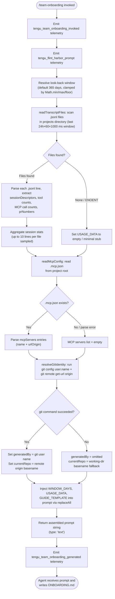

# `/team-onboarding`

> Analysis basis: CC v2.1.160 bundle.js (AST extraction + Claude interpretation)
> Minimum version: v2.1.160

---

## Overview

`/team-onboarding` scans the current user's local Claude Code transcript history (up to a configurable look-back window), derives a usage summary and session-type breakdown, and then sends a structured prompt to the Claude agent to co-author a `ONBOARDING.md` guide that teammates can paste into Claude Code for an interactive onboarding tour. The command is a `prompt`-type command whose handler is the `getPromptForCommand` method defined inline on the registration object; it performs data collection before the prompt is submitted, then injects the collected usage statistics and guide template into the prompt body.

---

## Registration

| Field | Value |
|---|---|
| type | `prompt` |
| name | `team-onboarding` |
| description | Help teammates ramp on Claude Code with a guide from your usage |
| isHidden | `false` |
| loc_byte | `12825221` |
| loc_byte_end | `12826270` |
| loc_line | `9452` |
| handler_method | `getPromptForCommand` |
| handler_method_start | `12825559` |
| handler_method_end | `12826269` |
| prompt_body.length | `4539` characters |
| prompt_body.trace | `identifier→$ (local→1 ext vars)` |
| arbor_handler.name | `getPromptForCommand` |
| arbor_handler.kind | `Method` |
| arbor_handler.fqn | `claude-2.1.160::getPromptForCommand` |
| arbor_handler.resolution_path | `direct` |
| arbor_handler.n_hits | `2` |

Analysis basis: CC v2.1.160 bundle.js:+12825221

---

## Input Branching

The handler's invocation path has three or more meaningful branches based on data-availability checks (transcript files found vs. not found, git user-name resolution success vs. failure, MCP config presence vs. absence). A flowchart is therefore used.



Analysis basis: CC v2.1.160 bundle.js:+12825559

---

## Behavioral Spec

### 1. Handler Entry and Telemetry Initialization

The `getPromptForCommand` method (resolved by Arbor as `claude-2.1.160::getPromptForCommand`, `direct` resolution) is the sole entry point.

```
function getPromptForCommand(context):
    emit("tengu_flint_harbor_prompt")           // bundle.js:+12825596
    emit("tengu_team_onboarding_invoked")       // bundle.js:+12825819

    windowDays = Math.floor(
        Math.max(1, Math.min(365, DEFAULT_WINDOW_DAYS))
    )                                           // bundle.js:+12825762–12825780
    windowMs   = windowDays * 24 * 60 * 1000   // literals: 24, 60, 1000
    cutoff     = Date.now() - windowMs          // bundle.js:+12825908
    ...
```

The look-back window defaults to **365 days** (bundle.js:+12825808) and is clamped via `Math.min` / `Math.max` / `Math.floor`.

Analysis basis: CC v2.1.160 bundle.js:+12825762

---

### 2. Transcript Discovery and Parsing (`transcriptScanner` / `CAK`)

The `transcriptScanner` function (`CAK`) reads the Claude Code projects directory, enumerates `.jsonl` files (extension filter: `".jsonl"`, bundle.js:+12814172), and for each file within the time window:

```
async function transcriptScanner(projectsDir, cutoffMs):
    entries = await readdir(projectsDir)
    jsonlFiles = entries.filter(e => extname(e) == ".jsonl")

    results = await Promise.all(
        jsonlFiles.map(async filename =>
            filePath = join(projectsDir, filename)
            stat = await stat(filePath)
            if NOT stat.isFile():
                return null

            raw = await readFile(filePath, "utf8")
            lines = raw.split("\n")
            // Sample up to 10 lines per file (literal: 10, bundle.js:+12814568)
            sampledLines = lines.slice(0, 10)

            sessionInfo = {
                title:           extractTitle(raw),
                prNumbers:       extractPrNumbers(raw),   // regex Jkf, Pkf
                firstUserMsg:    extractFirstUserMsg(raw), // regex Xkf
                toolCount:       countToolUses(raw),
                mcpCount:        countMcpCalls(raw),       // pattern "\"name\":\"mcp__"
                contentBlocks:   extractContentBlocks(raw) // pattern "\"content\":["
            }
            return sessionInfo
        )
    )
    return results.filter(r => r != null)
```

Key literals found:
- Files scanned: `.jsonl` extension (bundle.js:+12814172)
- Look-back: `24 * 60 * 1000` ms per day (bundle.js:+12814057–12814066)
- Lines sampled per file: **10** (bundle.js:+12814568)
- MCP detection pattern: `"name":"mcp__` (bundle.js:+12814751)
- Content-block detection pattern: `"content":[` (bundle.js:+12815101)
- Min content-block threshold: **3** (bundle.js:+12815204)

Analysis basis: CC v2.1.160 bundle.js:+12814044

---

### 3. MCP Configuration Reader (`mcpConfigReader` / `Ekf`)

```
async function mcpConfigReader(projectRoot):
    configPath = join(projectRoot, ".mcp.json")   // literal: ".mcp.json" bundle.js:+12816283
    try:
        raw    = await readFile(configPath, "utf8") // literal: "utf8" bundle.js:+12816296
        parsed = JSON.parse(raw)
        servers = parsed["mcpServers"] ?? {}        // literal: "mcpServers" bundle.js:+12816339
        return servers
    catch (ENOENT or parse error):
        return {}
```

Analysis basis: CC v2.1.160 bundle.js:+12816259

---

### 4. Git Identity Resolver (`gitIdentityResolver` / `Gkf` + `v_`)

`gitIdentityResolver` (`Gkf`) calls `v_` to spawn child processes:

```
async function gitIdentityResolver(cwd):
    userName = await runGitCommand(
        ["git", "config", "user.name"],    // literals bundle.js:+12816906–12816922
        cwd
    )
    remoteUrl = await runGitCommand(
        ["git", "remote", "get-url", "origin"],  // literals bundle.js:+12816978–12816997
        cwd
    )
    repoName = basename(remoteUrl) if remoteUrl else basename(cwd)
    return { generatedBy: userName, currentRepo: repoName }
```

`v_` (`processSpawner`) spawns subprocesses via `jEH`, applying a timeout of **1 000 000 ms** (bundle.js:+1050635) and streams stdout / stderr. `WEH` (`remoteUrlParser`) strips `git/` prefixes (bundle.js:+1067025) and parses the remote URL hostname via `vL4` / `oq`.

Analysis basis: CC v2.1.160 bundle.js:+12816584

---

### 5. Prompt Assembly and Template Injection

Once all data-collection steps complete, the handler assembles the final prompt by replacing three template placeholders:

```
function assemblePrompt(windowDays, usageData, guideTemplate, promptTemplate):
    result = promptTemplate
        .replaceAll("{{WINDOW_DAYS}}", String(windowDays))   // bundle.js:+12826006–12826037
        .replaceAll("{{USAGE_DATA}}", JSON.stringify(usageData))
        .replaceAll("{{GUIDE_TEMPLATE}}", guideTemplate)
    return { type: "text", content: result }                  // literal: "text" bundle.js:+12826253
```

Placeholder literals confirmed in bundle:
- `{{WINDOW_DAYS}}` (bundle.js:+12826019)
- `{{GUIDE_TEMPLATE}}` (bundle.js:+12826059)
- `{{USAGE_DATA}}` (bundle.js:+12826094)

Analysis basis: CC v2.1.160 bundle.js:+12826006

---

### 6. Prompt Body Intent (Summary — no verbatim quote)

The 4539-character prompt body (bundle.js:+12825559–12826269) instructs the agent to:

1. **Immediately** output a single acknowledgment line referencing the look-back window before any reasoning or tool calls — preventing a blank-screen experience for the guide creator.
2. **Classify** each session in `sessionDescriptors` into one of seven predefined task-type labels (`build_feature`, `debug_fix`, `improve_quality`, `analyze_data`, `plan_design`, `prototype`, `write_docs`), derive top 3–5 with rough percentages, and display them in title-case in the guide.
3. **Gather** repository name (from `currentRepo`), sibling repo directories, and MCP server access information.
4. **Write** a `ONBOARDING.md` file from a supplied `{{GUIDE_TEMPLATE}}`, filling real numbers (ASCII bar charts using `█` / `░` at 20 chars wide), using `generatedBy` for the author name.
5. **Render** the guide in a code block, then add a `---` separator and a `**Review**` heading with three numbered questions covering team name, starter task, and team tips.
6. **Apply revisions** from the guide creator and write the final file, closing with a fixed confirmation sentence referencing `ONBOARDING.md`.

Analysis basis: CC v2.1.160 bundle.js:+12825559

---

### 7. Completion Telemetry

```
function onPromptReturned():
    emit("tengu_team_onboarding_generated")   // bundle.js:+12826138
```

The `tengu_flint_harbor_share` event (bundle.js:+9669890) is emitted by the `h66` helper when the guide content is shared onward via the harbor/share subsystem.

Analysis basis: CC v2.1.160 bundle.js:+12826138

---

## State & Side Effects

| Item | Detail |
|---|---|
| Telemetry — invocation | `tengu_team_onboarding_invoked` (bundle.js:+12825819) |
| Telemetry — prompt dispatched | `tengu_flint_harbor_prompt` (bundle.js:+12825596) |
| Telemetry — guide generated | `tengu_team_onboarding_generated` (bundle.js:+12826138) |
| Telemetry — harbor share | `tengu_flint_harbor_share` (bundle.js:+9669890) |
| Telemetry — config parse error | `tengu_config_parse_error` (bundle.js:+3248346, from config subsystem) |
| Telemetry — config lock contention | `tengu_config_lock_contention` (bundle.js:+3245771) |
| Telemetry — config stale write | `tengu_config_stale_write` (bundle.js:+3245907) |
| Telemetry — config auth loss prevented | `tengu_config_auth_loss_prevented` (bundle.js:+3246250) |
| Filesystem reads | Async `readdir` + `readFile` on projects directory `.jsonl` files; `readFile` on `.mcp.json` |
| Filesystem writes | Agent writes `ONBOARDING.md` to working directory (after prompt is answered) |
| Child processes | Two `git` subprocesses spawned via `processSpawner` (`v_`/`jEH`): `git config user.name` and `git remote get-url origin` |
| appState changes | None observed in depth-2 traversal |
| Hook registration | `O9` calls `HDA.register` (bundle.js:+59048) — file-watch lifecycle hook via `ojL` |
| Sound | <!-- TODO: not found in depth-2 traversal; needs --depth 4 --> |

---

## Version History

| Version | Change |
|---|---|
| v2.1.160 | Initial analysis |

---

## Common Mistakes

1. **Running the command outside a Git repository**: the `gitIdentityResolver` will fail to obtain `user.name` and `origin` URL; the guide will omit `generatedBy` and fall back to the current directory basename for `currentRepo`. This is handled gracefully but produces a less complete guide.

2. **No recent transcripts**: if the projects directory contains no `.jsonl` files within the look-back window, the `sessionDescriptors` array is empty and the agent will leave the task-type breakdown as a `TODO` placeholder per the prompt instructions.

3. **Missing `.mcp.json`**: omitting the project-level MCP config file means the guide will not include MCP server onboarding steps. Place `.mcp.json` in the project root before running the command to get complete MCP setup instructions.

4. **Expecting an instant output**: the command collects transcript data and spawns git subprocesses synchronously before the prompt is sent. On large projects directories with many `.jsonl` files the pre-flight data collection may take several seconds.

5. **Treating the generated guide as final**: the prompt explicitly frames the output as a first draft and asks three follow-up questions (team name, starter task, team tips). Not answering these leaves `ONBOARDING.md` with incomplete sections.

---

## Appendix — Identifier Mapping

> For bundle debugging only. Identifiers change across versions.

| Identifier | Role |
|---|---|
| `__handler_team-onboarding` | Synthetic BFS entry node for the command handler (not a real bundle symbol) |
| `W6` | Prompt-dispatch / harbor-prompt orchestrator |
| `HY6` | Harbor prompt helper A |
| `_Y6` | Harbor prompt helper B |
| `px` | Prompt context builder |
| `FH` | String coercion / formatting utility |
| `mx` | Message serializer |
| `BR` | Message batch processor |
| `HA8` | Session deduplication / dispatch gate |
| `wY_` | Session record writer |
| `vVH` | Session ID generator helper |
| `kU` | Random-bytes / hex token generator |
| `SH` | JSON-stringify wrapper |
| `TjL` | Session metadata tagger |
| `WY_` | Session persistence coordinator |
| `dSq` | Session path resolver |
| `l_` | Local path helper |
| `CQq` | Session cache utility |
| `Ce` | Feature-flag / set membership checker |
| `R6` | Config reader (top-level) |
| `d6` | Config directory resolver |
| `hY_` | Config path helper |
| `ZDH` | Config file loader (reads, parses, backs up) |
| `q` | Filesystem module reference (sync I/O ops) |
| `m6` | JSON.parse wrapper |
| `Ax` | String prefix stripper |
| `_` | General-purpose utility / fs-like reference |
| `G8` | Error classifier / guard |
| `nQq` | Backup directory enumerator |
| `N` | Log / debug emitter |
| `d` | Platform / environment info accessor |
| `uY_` | Path join + normalize helper |
| `w` | Daemon background-session manager |
| `ojL` | File-watch lifecycle manager |
| `Br` | Watch callback handler |
| `O9` | Hook registrar (calls `HDA.register`) |
| `W8` | Config save-with-lock orchestrator |
| `xY_` | Config write-with-backup implementation |
| `L` | Locked-file set manager |
| `f` | File handle / stream reference |
| `qYq` | Config merge helper |
| `R4_` | Config defaults applicator |
| `fY6` | Config validation helper |
| `A` | Generic map/collection reference |
| `V` | Version or path segment reference |
| `X` | MCP connection manager |
| `Yu8` | MCP transport factory |
| `yH` | MCP server connector |
| `d_` | Error wrapper / normalizer |
| `Z` | Backup array slicer |
| `If6` | Atomic file writer (open/write/fsync/rename) |
| `O` | fs.Stats / lstat result reference |
| `V8` | Error category tester |
| `H` | Bootstrap fetcher / HTTP config loader |
| `o$` | HTTP response handler |
| `wj` | URL sanitizer (H.replace) |
| `gq` | Model-alias resolver |
| `GHH` | Model-alias map builder |
| `K1` | Model name normalizer |
| `yP` | Model selection helper |
| `t6` | Feature-flag evaluator |
| `SdH` | Config snapshot taker |
| `lQq` | Config entries iterator |
| `RdH` | Config timestamp recorder |
| `bY_` | Config write helper (alternate path) |
| `Gkf` | Team-onboarding data collector (orchestrator) |
| `Y_` | Crypto/random-seed initializer |
| `zN` | Seed helper |
| `Hx` | Project-path resolver |
| `GN` | Projects-directory locator |
| `Qz` | Project-ID / hash encoder |
| `qK4` | Hash math helper (Math.abs) |
| `CAK` | Transcript scanner (reads `.jsonl` files) |
| `H9` | Error guard for transcript scan |
| `K` | Array map / pad utility |
| `$` | Session-source / aHK dispatcher |
| `aHK` | Session-record factory |
| `z` | Daemon/process reference (includes hH, RH, Qy, _p) |
| `hH` | Daemon stop — normal path |
| `RH` | Daemon stop — failure path |
| `Qy` | Daemon control event emitter |
| `_p` | Process-exit race controller |
| `Y` | Abort controller / shutdown coordinator |
| `LJ` | Forced-shutdown label constant |
| `Ekf` | MCP config reader (reads `.mcp.json`) |
| `Tkf` | MCP server list formatter |
| `v_` | Process spawner (wraps `jEH`) |
| `jEH` | Child-process lifecycle manager |
| `DyA` | Process command builder |
| `Fo8` | Process stdout stream handler |
| `go8` | Process stderr stream handler |
| `do8` | Process exit handler |
| `TkA` | Timeout validator |
| `yf6` | Buffered-data collector |
| `Bo8` | Reflect-proxy for process events |
| `okA` | Process event listener binder |
| `WkA` | Timeout race wrapper |
| `EkA` | Process kill coordinator |
| `PkA` | Process stdin writer |
| `XkA` | Process SIGKILL sender |
| `ikA` | Promise-all process-wait helper |
| `Cf6` | Process cleanup helper |
| `lkA` | Pipe-stream connector |
| `nkA` | Process stream adder |
| `vkA` | stdout binding helper |
| `o44` | String coercion for process output |
| `SO` | Shell-output sanitizer |
| `WEH` | Remote-URL parser / git URL normalizer |
| `vL4` | URL hostname extractor |
| `oq` | String index/slice utility |
| `h66` | Harbor-share dispatcher (emits `tengu_flint_harbor_share`) |
| `n9` | Network-traffic category resolver |
| `KNA` | Traffic-category formatter |
| `rG` | Message-queue dispatcher (`mq`) |

---

Note: index built via Arbor fallback; some signals (telemetry, literals) may be missing — see arbor-fallback.js.