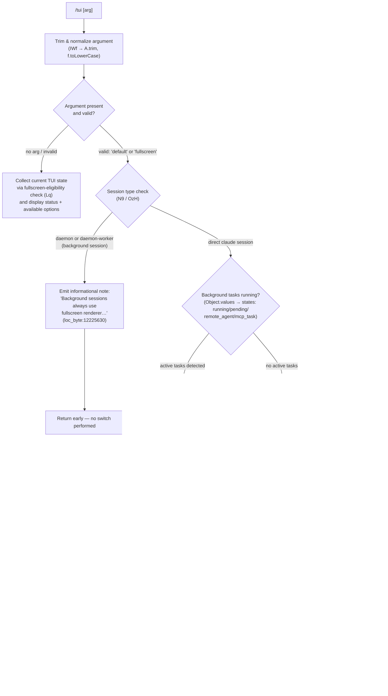

# `/tui`

> Analysis basis: CC v2.1.160 bundle.js (AST extraction + Claude interpretation)
> Minimum version: v2.1.160

---

## Overview

The `/tui` command switches the terminal UI renderer between `default` and `fullscreen` modes for the current Claude Code session. It validates environment compatibility (checking for tmux control-mode, Windows-over-SSH, and active background tasks), persists the chosen mode to user settings, and hot-relaunches the process so the new renderer takes effect immediately. Background sessions are always forced to the fullscreen renderer and are unaffected by this setting.

---

## Registration

| Field | Value |
|---|---|
| type | `local-jsx` |
| name | `tui` |
| description | `Set the terminal UI renderer (default \| fullscreen)` |
| argumentHint | `[default\|fullscreen]` |
| module_id | `Bi1` |
| load_inline | `true` |
| loc_byte | `12227410` |
| loc_byte_end | `12227592` |
| loc_line | `8526` |
| arbor_handler.name | `IWf` |
| arbor_handler.fqn | `claude-2.1.160::IWf` |
| arbor_handler.kind | `AsyncFunction` |
| arbor_handler.resolution_path | `module_id` |
| arbor_handler.n_hits | `0` |

Analysis basis: CC v2.1.160 bundle.js:+12227410

---

## Input Branching

The command has more than three distinct execution paths, so a Mermaid flowchart is used.



---

## Behavioral Spec

### 1. Argument Parsing

```
async function tuiCommandHandler(context, rawArg):
    trimmedArg = rawArg.trim()                     // IWf → A.trim  (loc:12225320)
    normalizedArg = trimmedArg.toLowerCase()       // A → f.toLowerCase  (loc:15873287)

    validModes = ["default", "fullscreen"]         // literals (loc:3414677, 3414651)

    if normalizedArg not in validModes:
        showCurrentStatus(context)                 // display mode + eligibility info
        return
```

Analysis basis: CC v2.1.160 bundle.js:+12225320

### 2. Background Session Guard

```
function checkSessionType(context):
    sessionKind = resolveSessionKind()            // N9 → OzH  (loc:12225616)

    if sessionKind in ["daemon", "daemon-worker"]:
        emitInfo("Background sessions always use the fullscreen renderer…")
        // literal text (loc:12225630)
        return BLOCKED
    return ALLOWED
```

Analysis basis: CC v2.1.160 bundle.js:+12225616

### 3. Active-Task Guard

```
function checkNoActiveTasks(context):
    tasks = Object.values(taskMap)                // (loc:12225987)
    blockedStates = ["running", "pending", "remote_agent", "mcp_task"]
    // literals (loc:12226026–12226094)

    for task in tasks:
        if task.status in blockedStates:
            emitError("Cannot switch renderers while background tasks are running…")
            // literal (loc:12226156)
            telemetry.fire("tengu_tui_refused")   // (loc:12226115)
            return BLOCKED
    return ALLOWED
```

Analysis basis: CC v2.1.160 bundle.js:+12225987

### 4. Fullscreen Compatibility Check

The eligibility resolver (`Lq` and its subordinate `SDH`) inspects the runtime environment and returns a reason code indicating whether fullscreen rendering is viable.

```
function resolveFullscreenEligibility():
    // Lq (loc:12225345) calls Ce, Hj_, FH, sr, N, ew_, l_, RXL, W6

    if isTmuxControlMode():
        // hXL checks H.startsWith for "screen"/"tmux" (loc:3413349)
        // SXL probes via clq.spawnSync "display-message -p #{client_control_mode}"
        // literal (loc:3413572, timeout:2000 loc:3413646)
        if not env.CLAUDE_CODE_NO_FLICKER:
            return reason("tmux_cc_auto_off",
                          "fullscreen disabled: tmux -CC (iTerm2 integration mode) detected…")
            // literal (loc:3414317, 3415182)

    if isWindowsOverSSH():
        // ew_ → r6, Boolean  (loc:3414443)
        // platform check for "windows" (loc:3413856)
        if not env.CLAUDE_CODE_NO_FLICKER:
            return reason("win_ssh_auto_off",
                          "fullscreen disabled: Windows over SSH (ConPTY re-rendering) detected…")
            // literal (loc:3414503, 3415216)

    // Additional reason codes emitted by SDH sub-check:
    // "bg_forced_on"   (loc:3415070)
    // "env_off"        (loc:3415100)
    // "env_on"         (loc:3415158)
    // "settings_on"    (loc:3415275)
    // "settings_off"   (loc:3415309)
    // "downsell_on"    (loc:3415382)
    // "gb_on"          (loc:3415447)
    // "gb_off"         (loc:3415455)

    return reason("compatible")
```

Analysis basis: CC v2.1.160 bundle.js:+12225345, +3414099, +3413349, +3413572

### 5. Settings Persistence

```
function persistTuiMode(mode):
    // F_ (loc:12226343) orchestrates settings read/write cycle
    settingsPath = resolveSettingsPath()          // c3H → SQ6 → RN.resolve  (loc:1220264)
    // Settings file: "settings.json" (loc:1220194) under ".claude" (loc:1220496)
    // Layers: userSettings, projectSettings, localSettings  (loc:1219858, 1219922, 1219944)

    currentSettings = loadFromDisk()             // us8 → ARA → TQ → Cs8  (loc:1224257)
    currentSettings["tui"] = mode
    writeSettings(currentSettings)               // NX → Ui → _.readFileSync / write (loc:977107)
    // Atomic write with rename + fsync: If6 (loc:1230005)
    invalidateSettingsCache()                    // Uz → Cb6.clear, nm8.clear  (loc:1230147)
```

Analysis basis: CC v2.1.160 bundle.js:+12226343, +1229437, +1230147

### 6. Terminal State Snapshot

Before relaunching, the handler calls the terminal introspection utility (`_I`) to capture the current viewport geometry and IDE-terminal type, so the relaunched process can inherit the correct dimensions.

```
function captureTerminalState():
    // _I (loc:12226454)
    checkJetBrainsIde()     // _I → BY6.isJetBrainsIdeTerminal  (loc:3486364)
    checkIDEType()          // _I → qr.includes  (loc:3486336)
    // IDE type strings: "cursor" (loc:3487041), "vscode" (loc:3487090)
    // xterm.js version range check: 1092000–1105000  (loc:3487166, 3487177)
    // platform checks: "darwin" (loc:3486574), "win32" (loc:3486621)

    terminalHeight = computeHeight()   // STL → parseFloat, Number.isNaN, Math.min (loc:3486661)
    // max height capped at 20 rows (loc:3487548)
    return terminalState
```

Analysis basis: CC v2.1.160 bundle.js:+12226454, +3486364

### 7. Process Relaunch

```
async function relaunch(context, newMode):
    uptime = Math.round(process.uptime())         // (loc:12226666, 12226677)

    telemetry.fire("tengu_tui_command", {mode: newMode, uptime})
    // (loc:12226587)

    rendererState = buildRendererState()           // mx (loc:12226897)
    globalConfig   = buildGlobalConfig()           // G9 (loc:12226903)

    // Ui1 → o2H (loc:12227025)
    await flushPendingIO()                         // duH → HDA.drain  (loc:12221224)
    await waitForAnalyticsFlush(timeout=30000)     // literal (loc:12221173)
    // "flush timeout (relaunch)" on expiry  (loc:12221179)

    // re-register signal handlers: SIGINT, SIGTERM, SIGHUP  (loc:12221646–12221665)
    process.removeAllListeners()                   // (loc:12221675)
    process.on(...)                                // (loc:12221705)

    bi1.spawnSync(process.argv, {stdio:"inherit"}) // (loc:12221732, inherit literal loc:12221767)
    // OR on platforms supporting execve: Ri1 → M.execve  (loc:12220609)

    process.exit(0)                                // (loc:12221981)
```

Analysis basis: CC v2.1.160 bundle.js:+12227025, +12226587, +12221732

### 8. Environment Variable Overrides

The following environment variables influence `/tui` behavior:

| Variable | Effect |
|---|---|
| `CLAUDE_CODE_NO_FLICKER` | Overrides `tmux_cc_auto_off` and `win_ssh_auto_off` guards; allows fullscreen even in those environments (loc:+12223159) |
| `CLAUDE_CODE_DISABLE_ALTERNATE_SCREEN` | Disables alternate-screen escape sequences (loc:+12223184) |
| `CLAUDE_CODE_FORCE_FULLSCREEN_UPSELL` | Forces display of the fullscreen upsell prompt (loc:+12223223) |

---

## State & Side Effects

| Item | Detail |
|---|---|
| Telemetry: `tengu_tui_command` | Fired on every successful mode switch; carries chosen mode and process uptime (loc:+12226587) |
| Telemetry: `tengu_tui_refused` | Fired when switch is blocked due to active background tasks (loc:+12226115) |
| Telemetry: `tengu_amber_creek` | Fired during fullscreen eligibility / renderer state resolution (loc:+3414834) |
| Telemetry: `tengu_pewter_brook` | Fired during renderer state resolution path (loc:+3414742) |
| Telemetry: `tengu_feature_ok` | General feature success path (loc:+966123) |
| Telemetry: `tengu_feature_bad` | General feature error path (loc:+966181) |
| Telemetry: `tengu_feature_sad` | General feature sad-path (loc:+966258) |
| Telemetry: `tengu_scroll_summary` | Scroll/render metrics during relaunch cleanup (loc:+5402118) |
| Telemetry: `tengu_bg_dispatch_sigkill_escalate` | Background dispatcher SIGKILL escalation (loc:+15847534) |
| Telemetry: `tengu_bg_dispatch_low_mem` | Background dispatcher low-memory event (loc:+15848113) |
| Telemetry: `tengu_bg_spare_enable` | Background spare-session enabled (loc:+15848808) |
| Telemetry: `tengu_bg_spare_claim` | Background spare-session claimed (loc:+15848929) |
| Telemetry: `tengu_bg_spare_claim_fail` | Background spare-session claim failure (loc:+15849192) |
| Telemetry: `tengu_daemon_control` | Daemon control-plane event (loc:+15883547) |
| Settings write | `tui` key written to `~/.claude/settings.json` (user layer) |
| Settings cache | `Cb6` and `nm8` caches cleared after write (loc:+26612, +26624) |
| Process relaunch | `bi1.spawnSync` or `M.execve` used to replace the current process image |
| Signal handlers | All existing listeners removed and re-registered before relaunch |
| Analytics drain | HDA queue drained before relaunch with 30 s timeout (loc:+12221173) |
| appState changes | `working_directory`, `allowed_tools`, `disallowed_tools`, `avoid_prompts`, `effort`, `model`, `max_thinking_tokens`, `flag_settings` read from app state during argument assembly (loc:+10792535–10793081) |
| Sound | <!-- TODO: not found in depth-2 traversal; needs --depth 4 --> |

---

## Version History

| Version | Change |
|---|---|
| v2.1.160 | Initial analysis |

---

## Common Mistakes

1. **Running `/tui` during active background tasks** — the command will refuse with "Cannot switch renderers while background tasks are running" and fire `tengu_tui_refused`. Use `/tasks` to inspect and stop tasks first.
2. **Expecting `/tui` to affect background (daemon) sessions** — background sessions are always locked to the fullscreen renderer. The command applies only to sessions started directly via `claude`.
3. **Forgetting `CLAUDE_CODE_NO_FLICKER=1`** when using iTerm2's tmux integration (`-CC` mode) or Windows over SSH — without this override, requesting `fullscreen` is silently downgraded with a warning message, which can be surprising.
4. **Not providing a valid argument** — passing any string other than `default` or `fullscreen` causes the command to display the current status without making any change.
5. **Expecting instant in-place rendering change** — `/tui` always triggers a full process relaunch; the terminal will briefly reset before the new renderer starts.

---

## Appendix — Identifier Mapping

> For bundle debugging only. Identifiers change across versions.

| Identifier | Role |
|---|---|
| `IWf` | Main async handler for `/tui` command (Arbor-resolved, module `Bi1`) |
| `Lq` | Fullscreen eligibility resolver — checks tmux/Windows/env/settings gates |
| `SDH` | Secondary eligibility sub-checker; emits reason codes (bg_forced_on, env_off, etc.) |
| `Ce` | Feature-flag / capability set membership check |
| `Hj_` | Boolean environment variable reader (yes/on → true) |
| `E1` | Environment variable string reader (truthy branch) |
| `FH` | Environment variable string reader (generic) |
| `sr` | Settings-layer accessor for renderer preference |
| `SXL` | tmux control-mode probe (spawns `tmux display-message -p #{client_control_mode}`) |
| `hXL` | tmux session-type detector (checks `H.startsWith` for "screen"/"tmux") |
| `N` | HTTP bootstrap / network utility (used in call graph depth-2) |
| `lmK` | Settings load orchestrator |
| `ADA` | Settings sub-loader (policy/flag layers) |
| `H` | HTTP fetch wrapper (bootstrap fetch) |
| `wj` | String replace utility |
| `gq` | Response parser / content-type handler |
| `SH` | JSON serializer wrapper |
| `x4` | Argument string formatter / truncator |
| `xwA` | Argument map helper |
| `PmH` | Output write wrapper |
| `ZwA` | Terminal write helper |
| `rmK` | Conversation/transcript manager |
| `QuH` | Debounced output flusher |
| `R$H` | Conversation record builder |
| `A46` | Log entry formatter |
| `gwA` | Log path resolver |
| `FwA` | Log file rotation handler |
| `imK` | Log append/mkdir writer |
| `O9` | Hook registration helper |
| `ew_` | Windows-over-SSH detector |
| `l_` | Settings-load-from-disk entry point |
| `lp` | Settings disk loader (inner) |
| `EG` | Settings event emitter |
| `h9` | Memory-usage sampler during settings load |
| `ms8` | Settings load dispatcher (policy/flag/user layers) |
| `EQ` | Settings merge / validation pipeline |
| `bb6` | Settings load finalizer |
| `RXL` | Renderer state builder (wraps W6) |
| `W6` | Renderer state resolver (checks WDH, SU caches) |
| `HY6` | Renderer state field: height |
| `_Y6` | Renderer state field: width |
| `px` | Renderer state: env-var reader combo |
| `HA8` | Renderer state: cache lookup/populate |
| `R6` | Renderer state: timestamp + metrics recorder |
| `fy8` | CLI argument array builder (adds --add-dir, --permission-mode flags) |
| `u16` | CLI argument helper |
| `N_` | App-state reader for tool lists (allowed_tools, disallowed_tools) |
| `Ov8` | App-state reader for working_directory |
| `eA` | JSX/React element factory |
| `zv8` | App-state reader for avoid_prompts |
| `U$` | App-state reader for model/effort/thinking settings |
| `N9` | Session-kind resolver (daemon / daemon-worker / direct) |
| `OzH` | Session-kind string enum |
| `d` | JSX rendering primitive |
| `F_` | Settings write pipeline (read → merge → atomic write) |
| `mO` | Settings context builder |
| `c3H` | Settings path resolver (user/project/local layers) |
| `SQ6` | Settings path: resolve from process argv / dirname |
| `Kf4` | Settings path: env-var override reader |
| `fx` | Settings path: `.claude` directory joiner |
| `qf4` | Settings path: managed-settings.json resolver |
| `us8` | Settings reader (loads and parses all layers) |
| `ARA` | Settings parser + validator |
| `_RA` | Per-layer settings validator |
| `TQ` | Settings cache get/set (nm8 map) |
| `CzA` | Settings cache get |
| `GX` | Structured-clone helper |
| `Cs8` | Settings object normalizer |
| `bzA` | Settings cache set |
| `eSA` | SDK inline settings injector |
| `Lx` | Settings merge helper (p74/B74/g74 sub-mergers) |
| `U3H` | Settings serializer for display / validation messages |
| `NX` | File read utility (detects encoding, BOM, CRLF) |
| `Ui` | Encoding-aware file reader (UTF-8/UTF-16LE detection) |
| `I$` | Filesystem realpath resolver |
| `tF6` | File read error code classifier |
| `eF6` | File content post-processor |
| `V8` | Error code classifier (ENOENT / EISDIR) |
| `G8` | Generic error wrapper |
| `Ra8` | Write-timestamp recorder (lg6 map) |
| `SEH` | Settings write path resolver |
| `If6` | Atomic file writer (open→write→fsync→rename, random temp name) |
| `Uz` | Settings cache invalidator (clears Cb6 and nm8) |
| `Bg6` | Gitignore-rule writer / checker |
| `S6` | Async-context store reader |
| `sF6` | Async-local-storage store accessor |
| `Y_` | zN-based utility (error/string helper) |
| `ja8` | m4-based helper |
| `Ug6` | v_-based git-ignore checker |
| `v_` | Git check-ignore spawner |
| `NL4` | Path normalizer (home-dir expansion, absolute resolution) |
| `dyA` | Git ls-files runner |
| `cyA` | Gitignore rule appender |
| `hH` | JSX render helper (d-based) |
| `RH` | JSX render helper variant |
| `yH` | Output formatter / queue flusher |
| `d_` | Error/string coercion helper |
| `n9` | Network category resolver (essential-traffic / no-telemetry) |
| `KNA` | Network category string map |
| `T14` | Output line ring-buffer manager |
| `_I` | Terminal introspection (IDE type, viewport dimensions) |
| `aY6` | Terminal capability helper |
| `MY` | Terminal mode flag reader |
| `rj_` | Terminal hTL-based sub-check |
| `hTL` | Terminal inner probe |
| `xD` | Terminal MY-based variant |
| `STL` | Terminal height calculator (parseFloat + Math.min clamp to 20) |
| `oj_` | Terminal height raw reader |
| `mx` | Renderer state factory (wraps BR) |
| `BR` | Renderer state builder (NwL + n3 + Wf6) |
| `NwL` | Renderer field: FH + bM |
| `bM` | Renderer field: jA (firstParty check) |
| `n3` | Renderer sub-field |
| `Wf6` | Renderer sub-field (KNA-based) |
| `G9` | Global config builder (Jq9 + vSL + _C + n9 + f4H + wj6) |
| `Jq9` | Global config sub-builder |
| `wj6` | Global config: _C + Yj6 + DLH |
| `_C` | Config: jA + C7 + e3 + hJ + mq |
| `Yj6` | Config: reads package JSON via wq9.readFileSync |
| `DLH` | Config: permission / include filter |
| `f4H` | Config: FH-based field |
| `Ui1` | Relaunch orchestrator (wraps o2H) |
| `o2H` | Full relaunch implementation (flush, cleanup, spawnSync/execve) |
| `KS` | Version / binary path resolver |
| `a08` | Version file reader |
| `zAH` | Binary path resolver (.local/bin) |
| `e$` | Array-check utility |
| `jk` | Relaunch path helper |
| `y6` | zN-based async logger |
| `O26` | Interval clear helper (iN_) |
| `iN_` | clearInterval wrapper |
| `nIH` | Terminal unmount / cleanup (writes sync, unmounts Ink) |
| `lR` | Terminal cleanup sub-step |
| `U98` | Alternate-screen restore (ESC-7 / ESC-8 sequences) |
| `hM8` | Scroll summary emitter + Lq reference |
| `VG` | Scroll metric field |
| `KW9` | Scroll metric field |
| `qW9` | Scroll timing calculator (Date.now, Math.max, Math.round) |
| `Hf` | Promise.race timeout helper |
| `iE` | Event-drain helper (wraps n4 → O9) |
| `n4` | Hook-drain inner |
| `duH` | Analytics queue drain (HDA.drain) |
| `SM8` | Async cleanup sequencer (Promise.all/race + NV + Vd + d8) |
| `d8` | Timeout-with-abort promise factory |
| `k_A` | Relaunch argument assembler (jk + Y_ + dirname + nO + tK) |
| `tK` | tK → zN path helper |
| `Ri1` | execve-based process replacement (bun:ffi, libSystem / libc.so.6) |
| `$` | Process map / aHK helper |
| `w` | Background task dispatcher / process monitor |
| `M` | Background task cleanup (rm temp files) |
| `z` | Cleanup helper (hH + RH + Qy + _p) |
| `GH` | String coercion helper |
| `wJ` | State file writer (jmH.writeFileSync) |