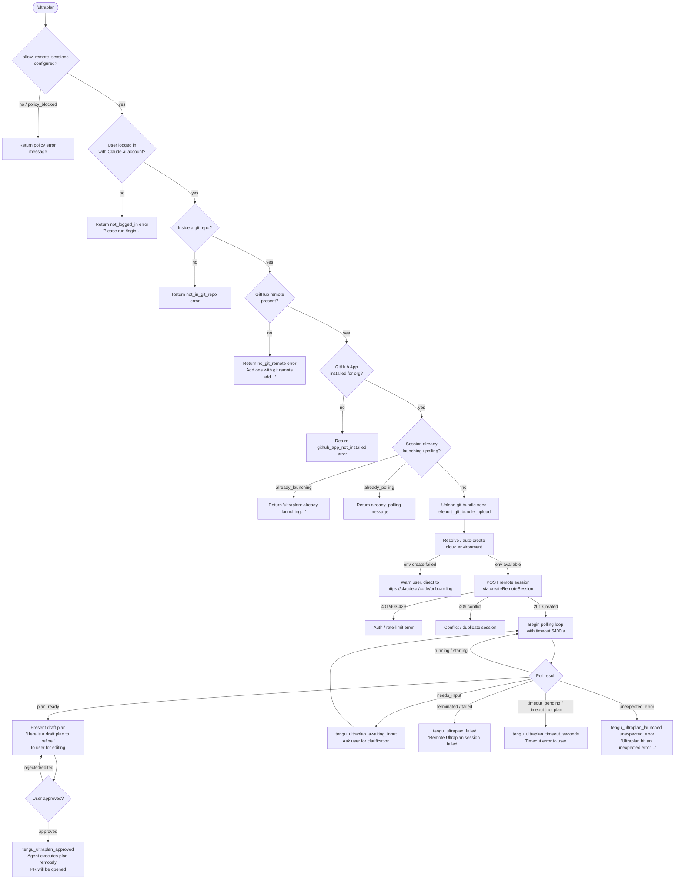

# `/ultraplan`

> Analysis basis: CC v2.1.160 bundle.js (AST extraction + Claude interpretation)
> Minimum version: v2.1.160

---

## Overview

`/ultraplan` launches a remote Claude Code web session that drafts an actionable plan for the given prompt. The session runs asynchronously on Anthropic's cloud infrastructure: it uploads a git bundle of the local repository, creates (or reuses) a remote cloud environment, polls the remote session until a plan is produced, then presents that draft to the user for editing and approval. Upon approval the full remote agent executes the plan and delivers results as a pull request.

---

## Registration

| Field | Value |
|---|---|
| type | `local-jsx` |
| name | `ultraplan` |
| description | `… Claude Code on the web drafts a plan you can edit and approve. See …` |
| argumentHint | `<prompt>` |
| load_inline | `true` |
| load_ident | `IXf` |
| loc_byte | `12057041` |
| loc_byte_end | `12057285` |
| loc_line | `8305` |
| arbor_handler.name | `IXf` |
| arbor_handler.fqn | `claude-2.1.160::IXf` |
| arbor_handler.kind | `AsyncFunction` |
| arbor_handler.resolution_path | `load_ident` |
| arbor_handler.n_hits | `1` |

Analysis basis: CC v2.1.160 bundle.js:+12057041

---

## Input Branching

The handler exhibits more than three distinct decision paths (authentication state, remote-sessions policy, git/GitHub preconditions, duplicate-launch guard, plan-ready vs. timeout vs. error outcomes), so a flowchart is used.



---

## Behavioral Spec

### 1. Top-level Handler (`IXf`)

The handler is an `AsyncFunction` resolved via the `load_ident` path (identifier `IXf`).

```
async function ultraplanHandler(context):
    prompt = extractPromptFromInput(context)          // zG8 → jl_
    eligibility = checkRemoteEligibility(context)     // G9
    if not eligibility.ok:
        emit tengu_ultraplan_create_failed
        return eligibility.errorMessage

    appState = context.getAppState()
    if appState has "already_launching" or "already_polling" flag:
        return ALREADY_LAUNCHING_MESSAGE               // "ultraplan: already launching…"

    launchResult = await launchRemoteSession(         // Jy6
        prompt, context, eligibility
    )
    if launchResult.error:
        emit tengu_ultraplan_create_failed
        return launchResult.errorMessage

    context.setAppState(launchResult.newState)
    return launchResult.userFacingOutput
```

Analysis basis: CC v2.1.160 bundle.js:+12055185

---

### 2. Prompt Extraction (`zG8` → `jl_`)

The raw input string is normalised before use.

```
function extractPromptText(rawInput):
    // jl_ performs startsWith / matchAll checks
    segments = rawInput.matchAll(regex, "gi")         // flags: "gi", loc +9788345
    cleaned  = []
    for each segment:
        if segment passes inclusion filter:
            cleaned.push(segment)
    // If the word "ultraplan" appears anywhere in the prompt it is
    // recognized as a trigger (literal "ultraplan" at +9788697)
    joined = cleaned.join("")
    // zG8 further slices (+9788925) and applies replace("$1$2") (+9789022)
    // to strip the command token; max replace depth: 5 (+9789045)
    return joined.trim()
```

Analysis basis: CC v2.1.160 bundle.js:+9788353 / +9788925 / +9789022

---

### 3. Remote-Session Eligibility Check (`G9`)

```
function checkRemoteEligibility(context):
    settings = readSettings()                         // _C, Yj6 → wq9.readFileSync, "utf-8"

    // Policy gate — literal "allow_remote_sessions" at +12055206
    if settings.allow_remote_sessions is falsy:
        if org policy blocks it:                      // "policy_blocked" +8993493
            return error("Remote sessions are disabled by your org's policy…")

    // Auth gate
    if not userLoggedIn():                            // n9 → KNA → FH
        return error("not_logged_in", "Please run /login…")  // +8992983

    // Plan-feedback gate
    if not settings.allow_product_feedback:           // "allow_product_feedback" +4146460
        // some features gated here

    // Git remote gate
    remoteUrl = getGitRemoteOriginUrl()               // YR → git config --get remote.origin.url
    if not remoteUrl:
        return error("no_git_remote", "Background tasks require a GitHub remote…")

    // GitHub App gate
    appInstalled = checkGithubAppInstalled(context)   // ihH
    if not appInstalled:
        return error("github_app_not_installed", …)

    return { ok: true, remoteUrl, … }
```

Analysis basis: CC v2.1.160 bundle.js:+4146429 / +12055206 / +8992983 / +8993084 / +8993222 / +8993339

---

### 4. Remote Session Launch (`Jy6`)

```
async function launchRemoteSession(prompt, context, eligibility):
    // Duplicate-launch guard
    if pollingAlreadyActive(context):                 // fl1 check, "already_polling" +12052700
        return error("already_polling")
    if launchAlreadyInFlight(context):                // "already_launching" +12052718
        return error(ALREADY_LAUNCHING_MESSAGE)       // +12051312

    // Validate prompt not empty
    if prompt is blank:
        return usageError(
            "Usage: /ultraplan <prompt>, or include \"ultraplan\" anywhere in your prompt"
        )                                             // +12052764

    // Upload git seed bundle
    bundleResult = await uploadGitSeedBundle()        // mk8 → uk8 → rF_
    // rF_: teleport_git_bundle_upload (+8906688), handles empty_repo, stash,
    //      refs/seed/stash, refs/seed/root, stash create, HEAD verify, ccr-seed.bundle

    // Resolve cloud environment
    env = await resolveOrCreateCloudEnvironment()     // NXf → ul
    // ul: list environments (Ys → teleport_environments_list),
    //     auto-create default if none (zH6 → teleport_default_environment_create)
    //     default spec: python 3.11, node 20, /home/user, anthropic_cloud (+8874507)
    if env is null:
        warn("Could not create a cloud environment…")  // +8924195
        emit tengu_ultraplan_create_failed

    // Build task payload
    taskPayload = buildTaskPayload(prompt, bundleResult, env)
    // fm7: title generation (teleport_generate_title +8910280),
    //      branch name, json_schema output with "title" and "branch" fields (+8910206/214)

    // POST session creation
    response = await postRemoteSession(taskPayload)   // c_.post
    // HTTP status handling: 201 → success (+8923358), 401/403/429 → auth errors,
    //                       409 → conflict (+8930689), 500 → server error (+8923320)
    if response.status not 201:
        return mapStatusToError(response.status)

    sessionId = response.data.sessionId
    if not sessionId:
        return error("Server returned a malformed session response (no session id)")  // +8923788

    emit tengu_ultraplan_launched                     // +12054155

    // Begin poll loop
    planResult = await pollUntilPlanReady(            // GXf → tc1
        sessionId, timeout=5400s                      // +12048123
    )
    return planResult
```

Analysis basis: CC v2.1.160 bundle.js:+12052483 / +12052700 / +12052764 / +12053520 / +12054155

---

### 5. Poll Loop (`GXf` → `tc1`)

```
async function pollUntilPlanReady(sessionId, timeoutSeconds):
    deadline = Date.now() + timeoutSeconds * 1000     // 5400 s (+12048123)
    poll = createRemoteSessionPoller(sessionId)       // Ok → In7 / vn7 / kn7 / yn7
    // Poller state lifecycle: pending → running → starting → idle →
    //                         plan_ready / needs_input / requires_action /
    //                         completed / archived / terminated / aborted

    loop:
        if Date.now() > deadline:
            emit tengu_ultraplan_timeout_seconds
            if plan not yet seen: return error("timeout_no_plan")
            else:                 return error("timeout_pending")

        status = await poll.next()

        switch status.state:
            case "plan_ready":
                emit tengu_ultraplan_plan_ready        // +12048801
                draftText = extractPlanDraft(status)
                return presentPlanForApproval(         // EXf → TXf → PXf
                    "Here is a draft plan to refine:",  // +12048430
                    draftText
                )

            case "needs_input":
                emit tengu_ultraplan_awaiting_input    // +12048733
                userInput = await askUser()
                await sendInputToSession(userInput)    // Wm → c_.post
                continue loop

            case "approved":
                emit tengu_ultraplan_approved          // +12049209
                return successMessage(
                    "Results will land as a pull request…"  // +12049695
                )

            case "terminated" | "failed" | "error":
                emit tengu_ultraplan_failed            // +12050082
                return error("Remote Ultraplan session failed…")  // +12050489

            case "running" | "starting" | "idle":
                sleep(1000 ms)                        // 1 s poll interval (+8999574)
                // max session wall-clock: 1 800 000 ms = 30 min (+8999581)
                // "remote session exceeded 30 minutes" (+9002223)
                continue loop

        // Network failure: retry up to exhaustion
        on network error:
            emit tengu_ultraplan_failed with "network_or_unknown"
            return error(
                "Lost connection to the remote session after repeated retries…"  // +12039447
            )
```

Analysis basis: CC v2.1.160 bundle.js:+12048089 / +12048801 / +12049209 / +12049695 / +12050082 / +12039447 / +8999574 / +8999581

---

### 6. Plan Presentation and Approval (`EXf`)

```
function buildDraftPlanMessage(planText):
    parts = []
    parts.push("Here is a draft plan to refine:")    // +12048430
    parts.push(planText)
    return parts.join(separator)                     // EXf → q.push → TXf → PXf → q.join

function handleApproval(userResponse):
    // User may edit the plan inline before approving
    // On approval: emit tengu_ultraplan_approved, proceed with remote execution
    // Label for UI button: "Refine local plan" (+12053608), category: "plan" (+12053643)
```

Analysis basis: CC v2.1.160 bundle.js:+12048423 / +12048483 / +12048513 / +12053608

---

### 7. Git Bundle Upload (`rF_`)

```
async function uploadGitSeedBundle(repoPath):
    emit tengu_ccr_bundle_upload                     // +8906981

    if not isGitRepo(repoPath):
        return error("Not in a git repository")      // +8906749

    // Clean up any previous seed refs
    git("update-ref", "-d", "refs/seed/stash")       // +8906840/853
    git("update-ref", "-d", "refs/seed/root")

    hasCommits = git("for-each-ref", "--count=1", "refs/")  // +8906891/906/918
    if not hasCommits:
        return error("Repository has no commits yet")  // +8907095

    stashRef = git("stash", "create")               // +8907173/181
    // Bundle file: ccr-seed.bundle (+8907976), _source_seed.bundle (+8908279)
    // Upload strategies: head, fallback_head, squashed, fallback_squashed
    // +8908637/676/711/754
    bundleMode = selectBundleMode(repoSize)
    emit tengu_teleport_bundle_mode                  // +8922448
    result = await httpUpload(bundleFile)
    if result.status == 200:
        return { strategy: bundleMode }
    else:
        return error("upload_failed")               // +8908424
```

Analysis basis: CC v2.1.160 bundle.js:+8906688 / +8906749 / +8907095 / +8907976 / +8908424

---

### 8. Cloud Environment Resolution (`ul` / `Ys` / `zH6`)

```
async function resolveOrCreateEnvironment(context):
    // List existing environments
    envList = await listEnvironments()               // Ys → teleport_environments_list
    // Requires Claude.ai account auth (not API key)
    // Error: "Claude Code web sessions require authentication with a Claude.ai account…" (+8873376)
    // Timeout: 15 000 ms (+8873807)

    if envList has suitable env:
        return envList.find(suitable)

    // Auto-create default
    newEnv = await createDefaultEnvironment()        // zH6 → teleport_default_environment_create
    // Spec: name="Default", type="anthropic_cloud", home="/home/user",
    //       python="3.11", node="20"                // +8874507 / +8874613 / +8874675 / +8874706
    if newEnv:
        log("[teleportToRemote] Auto-created default cloud env")  // +8924037
        return newEnv

    log("warn", "Could not create a cloud environment…")  // +8924195
    return null
```

Analysis basis: CC v2.1.160 bundle.js:+8873172 / +8874092 / +8874507 / +8924037 / +8924195

---

### 9. Error Handling and Cleanup

```
function handleUnexpectedError(err):
    if err is cancellation:                          // c_.isCancel (+8930220)
        return silently
    if err is AxiosError:                            // c_.isAxiosError (+8876259 / +8930220)
        map HTTP status to user-facing message
    emit tengu_ultraplan_launched with "unexpected_error"  // +12054564
    // Delay before surfacing: 1500 ms (+12054496)
    return error(
        "Ultraplan hit an unexpected error during launch. Wait for the user's next instructions."
    )                                               // +12054722

function archiveOrphanedSession(sessionId):
    // On handler teardown, archive any session not yet completed
    // Failure is logged: "ultraplan: failed to archive orphaned session"  // +12054870
    try: archiveSession(sessionId)
    catch: log warning
```

Analysis basis: CC v2.1.160 bundle.js:+12054492 / +12054564 / +12054722 / +12054870

---

## State & Side Effects

| Item | Detail |
|---|---|
| Telemetry — launch failed | `tengu_ultraplan_create_failed` (+12052485) |
| Telemetry — prompt identifier | `tengu_ultraplan_prompt_identifier` (+12048256) |
| Telemetry — launched | `tengu_ultraplan_launched` (+12054155) |
| Telemetry — timeout | `tengu_ultraplan_timeout_seconds` (+12048089) |
| Telemetry — awaiting input | `tengu_ultraplan_awaiting_input` (+12048733) |
| Telemetry — plan ready | `tengu_ultraplan_plan_ready` (+12048801) |
| Telemetry — approved | `tengu_ultraplan_approved` (+12049209) |
| Telemetry — failed | `tengu_ultraplan_failed` (+12050082) |
| Telemetry — bundle seed | `tengu_ccr_bundle_seed_enabled` (+8991528) |
| Telemetry — bundle upload | `tengu_ccr_bundle_upload` (+8906981) |
| Telemetry — bundle mode | `tengu_teleport_bundle_mode` (+8922448) |
| Telemetry — session link | `tengu_ccr_session_link` (+8916736) |
| Telemetry — teleport source decision | `tengu_teleport_source_decision` (+8927662) |
| Telemetry — generate title | `teleport_generate_title` (+8910280) |
| Telemetry — eligibility check | `bg_remote_eligibility_check` (+8991125) |
| Telemetry — env list | `teleport_environments_list` (+8873172) |
| Telemetry — env create | `teleport_default_environment_create` (+8874092) |
| Telemetry — bootstrap fetch | `api_bootstrap_fetch` (+15452112) |
| Telemetry — config parse error | `tengu_config_parse_error` (+3248346) |
| Telemetry — bg low mem | `tengu_bg_dispatch_low_mem` / `tengu_bg_low_mem_mb` |
| Telemetry — daemon | `tengu_daemon_yield`, `tengu_bg_dispatch_sigkill_escalate` |
| appState changes | Reads `getAppState` (+12055520); writes `setAppState` (+12055738) with launch/polling flags and plan result |
| Hook registration | `O9 → HDA.register` (+59048) — registers a task-notification hook (+12053465) |
| File I/O | Reads git config, creates/removes temp bundle files (`BZ6 → YL.unlink`), copies seed bundle (`q.copyFileSync`); reads local plan file if present |
| Network | Axios `c_.post` / `c_.get` to Anthropic API; WebSocket/socket connect for remote session stream (`w$A → Zu8.connect`); bootstrap fetch with 5 000 ms timeout (+15451991) |
| Polling interval | 1 000 ms (+8999574); max wall-clock 1 800 000 ms / 30 min (+8999581) |
| Session timeout | 5 400 s total poll budget (+12048123) |
| Sound | None detected in traversal |
| API version header | `anthropic-version: 2023-06-01` (+3189581); beta header `ccr-byoc-2025-07-29` (+8922044) |

---

## Version History

| Version | Change |
|---|---|
| v2.1.160 | Initial analysis |

---

## Common Mistakes

1. **Running without a Claude.ai login.** The command requires a Claude.ai web account (`/login`), not just an API key. API-key-only authentication is explicitly rejected with the message found at bundle.js:+8873376.
2. **No git repository or no GitHub remote.** The command requires both a git repo and a `remote.origin.url` pointing to a GitHub host. Running `/ultraplan` outside a git repo or before adding a remote will produce an immediate error.
3. **GitHub App not installed.** Even with a GitHub remote, the Anthropic GitHub App must be installed on the organisation. The command checks this via `ihH` (checkGithubAppInstalled) and fails fast if absent.
4. **Invoking while a session is already in flight.** Issuing `/ultraplan` a second time while a prior session is launching or polling returns the `already_launching` guard message immediately; the duplicate call is not queued.
5. **Organisation policy blocking remote sessions.** If `allow_remote_sessions` is disabled by an organisation admin the command fails with `policy_blocked` and instructs the user to contact their admin.
6. **Expecting synchronous results.** The plan drafting is asynchronous. The command enters a poll loop (up to 5 400 s) and the final result arrives as a pull request, not inline in the terminal session.
7. **Empty or uncommitted repository.** The git-bundle upload path requires at least one commit. An empty repo or one with no commits will be rejected at the `uploadGitSeedBundle` step.

---

## Appendix — Identifier Mapping

> For bundle debugging only. Identifiers change across versions.

| Identifier | Role |
|---|---|
| `IXf` | Top-level `ultraplan` command handler (AsyncFunction, Arbor-resolved) |
| `zG8` | Prompt extraction wrapper (calls `jl_`) |
| `OG8` | Inner normalisation helper called by `zG8` |
| `jl_` | Prompt tokeniser / segment filter (startsWith, matchAll) |
| `G9` | Remote-session eligibility checker |
| `Jq9` | Settings reader entry-point |
| `wj6` | Settings file loader (calls `Yj6`, `DLH`) |
| `_C` | Settings object constructor / field accessor |
| `Yj6` | Reads settings file via `readFileSync` |
| `DLH` | Settings validation / includes check |
| `n9` | Login-state checker |
| `KNA` | Token / credential resolver |
| `FH` | String-coercion / identifier utility |
| `f4H` | Secondary credential helper |
| `FfH` | App-state field accessor used by handler |
| `Jy6` | Remote session launch orchestrator |
| `fl1` | Already-polling / already-launching guard |
| `mk8` | Git bundle upload dispatcher |
| `uk8` | Bundle upload coordination (calls `W6`, `XXf`) |
| `W6` | Worker / spare-agent selector |
| `XXf` | Bundle upload finaliser |
| `NXf` | Full remote launch pipeline (environment + session + poll) |
| `AXH` | Eligibility aggregator wrapping `a71` |
| `a71` | Detailed eligibility sub-checks (git, GitHub, byoc, etc.) |
| `EXf` | Draft-plan message builder (`q.push`, `TXf`, `q.join`) |
| `TXf` | Plan segment formatter |
| `ul` | Cloud environment resolver (list + auto-create) |
| `S6` | API provider / auth context getter |
| `bM` | Auth token extractor |
| `E3` | OAuth query helper |
| `eF_` | HTTP auth-header builder |
| `yH` | Organisation UUID resolver |
| `jx` | HTTP request utility (with retry) |
| `kq` | OAuth endpoint selector (local / staging / prod) |
| `Wj` | Axios instance factory |
| `rF_` | Git seed bundle upload implementation |
| `y6` | Utility: environment variable / zN lookup |
| `N` | Message / string formatter (toUpperCase, trim, etc.) |
| `YR` | Git remote URL fetcher (`git config --get remote.origin.url`) |
| `X71` | Event / control-request builder (randomUUID, set_permission_mode) |
| `ZZ6` | Session-state serialiser |
| `SH` | JSON serialiser wrapper |
| `P71` | Session-link helper |
| `QW8` | Queue / batch utility |
| `Ys` | List remote environments (teleport_environments_list) |
| `zH6` | Create default cloud environment (teleport_default_environment_create) |
| `GH` | String coercion utility (wraps `String`) |
| `$` | Message/event array (map, find, findLast, some) |
| `fm7` | Task-payload / title generator (teleport_generate_title) |
| `cy` | Worker-agent spawner (calls `W6`, `R6`, etc.) |
| `ihH` | GitHub App installation checker |
| `VN` | Default git branch resolver (main / master) |
| `gq` | UI notification / gq-event emitter |
| `i` | Permission mode array (allow, etc.) |
| `ge` | Git remote URL parser / classifier (https/http, github.com) |
| `d_` | Error normaliser (Error + String coercion) |
| `VD` | Cancellation detector |
| `Fz` | Final error formatter |
| `hw` | Claude.ai base-URL resolver (localhost / staging / prod) |
| `G_` | Module initialiser (sets `__esModule`, registers handlers) |
| `qG_` | URL builder for Claude.ai web endpoint |
| `VXf` | Plan-approval state setter |
| `LSH` | Remote-session poller entry-point (iI, qH6, S2, Hf1) |
| `iI` | Random-bytes / nonce generator |
| `qH6` | Session open/status fetcher (Et.open) |
| `S2` | Pending-state initial poll |
| `Bm7` | Poll progress logger |
| `Hf1` | Main poll-loop body (result/hook handling, setTimeout) |
| `Ok` | Task-event dispatcher (In7, vn7, kn7, yn7, aAH) |
| `In7` | task_started event handler |
| `vn7` | task_updated event handler |
| `kn7` | local_workflow event handler |
| `yn7` | Object-keys event router |
| `aAH` | Active/aborted/user_typed state handler |
| `GXf` | Poll-loop coordinator (tc1, JXf, BZ6, Wm) |
| `tc1` | Core polling tick (status decode, timeout calc, plan extraction) |
| `JXf` | Worker-slot allocator (calls `W6`) |
| `vXf` | Poll state updater |
| `BZ6` | Temp-file cleanup (p1A, YL.unlink) |
| `K` | Column / pad formatter (padEnd, map) |
| `Wm` | Send user input to remote session (c_.post, kq, eF_, Wj) |
| `O9` | Hook registrar (`HDA.register`) |
| `ZXf` | Poll-abort / cleanup helper |
| `R6` | Config read/watch (ZDH, ojL, Date.now) |
| `d6` | Config file path resolver |
| `hY_` | Config path sub-resolver |
| `ZDH` | Config file reader (readFileSync, mkdirSync, copyFileSync) |
| `m6` | JSON.parse wrapper |
| `Ax` | Config key prefix handler (startsWith, slice) |
| `G8` | Config value getter |
| `nQq` | Config directory scanner (readdirStringSync, path helpers) |
| `uY_` | Config path join helper |
| `w` | Background-worker / daemon process manager |
| `S` | Subprocess wrapper (D.write) |
| `RH` | Process health check |
| `hH` | Process liveness check |
| `gh8` | Memory / macOS worker check (W6) |
| `fj6` | Process-list file reader (L2.readFile, m6, filter) |
| `F` | Worker future / promise (retireIfSettled) |
| `w$A` | Worker socket connector (Zu8.connect, f.on/once/write/end) |
| `T$A` | Worker lifecycle manager (add/delete/rm/unlink, rosterEntry) |
| `Y` | Forced-shutdown handler (process.exit, z.abort) |
| `R` | Rate-limit event emitter (Wn1, y.enqueue, KJ.randomUUID) |
| `ojL` | Config file watcher (DA8.watchFile/unwatchFile) |
| `Br` | Config watcher callback helper |
| `YA6` | Parallel pre-flight aggregator (Promise.all over YR, cy, m4, ihH) |