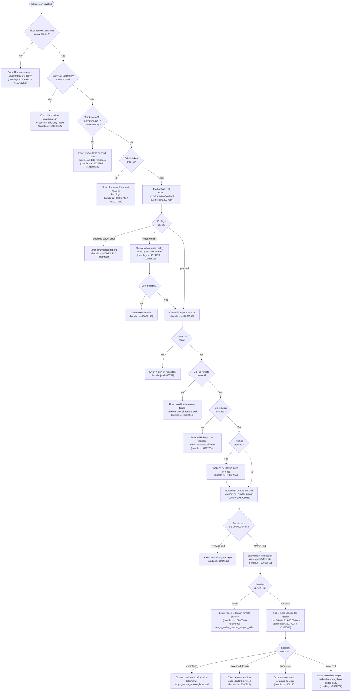

# `/ultrareview`

> Analysis basis: CC v2.1.160 bundle.js (AST extraction + Claude interpretation)
> Minimum version: v2.1.160

---

## Overview

`/ultrareview` is a deep bug-hunting command that runs as an alias of `/code-review ultra`. It dispatches a remote Claude Code session (hosted on the web) against the current Git branch, performs multi-pass verification of findings, and streams results back to the local terminal. Because the analysis runs in a cloud sandbox, the command requires a Claude.ai OAuth account, a GitHub remote, and organizational policy allowing remote sessions.

---

## Registration

| Field | Value |
|---|---|
| type | `local-jsx` |
| name | `ultrareview` |
| description | `Alias of /code-review ultra · … · Est. cost … USD · Finds and verifies bugs in your branch. Runs in Claude Code on the web. See …` |
| loc_byte | `12068565` |
| loc_byte_end | `12068856` |
| loc_line | `8330` |
| module_id | `Yl1` |
| load_inline | `true` |
| arbor_handler.name | `gXf` |
| arbor_handler.fqn | `claude-2.1.160::gXf` |
| arbor_handler.kind | `AsyncFunction` |
| arbor_handler.resolution_path | `module_id` |
| arbor_handler.n_hits | `1` |

Analysis basis: CC v2.1.160 bundle.js:+12068565

---

## Input Branching

The command has many distinct decision branches (policy check → auth check → Git checks → preflight API → repository upload → session launch → result streaming). A Mermaid flowchart is used.



---

## Behavioral Spec

### 1 — Handler Entry (`handlerMain` / `gXf`)

```
async function handlerMain(commandArgs, appState):
    # Check org policy
    if not appState.allow_remote_sessions:
        showError("Remote sessions are disabled by your organization's policy. ...")
        return

    # Check network mode
    networkMode = getNetworkMode()
    if networkMode == "essential-traffic-only":
        showError("Ultrareview runs in Claude Code on the web and is unavailable ...")
        return

    # Check provider type
    providerType = getProviderType()
    if providerType in ["zdr", "data-residency"] or isThirdPartyProvider():
        showError("Ultrareview runs in Claude Code on the web and is unavailable on third-party providers.")
        return

    # Check OAuth token
    if not hasOAuthToken():
        showError("Ultrareview requires a Claude.ai account. Run /login to authenticate.")
        return

    # Run preflight check
    preflightResult = await runPreflight()

    # Dispatch based on preflight
    await launchSession(preflightResult, commandArgs, appState)
```

Analysis basis: CC v2.1.160 bundle.js:+12066219, +12066222, +12066256

---

### 2 — Preflight Check (`preflightCheck` / `lc1`)

```
async function preflightCheck():
    emit telemetry("tengu_review_bughunter_config")
    response = await apiPost("/v1/ultrareview/preflight", {
        headers: { "teleport-org": orgUUID }
    })

    if response fails schema validation:
        emit telemetry("api_ultrareview_preflight", { reason: "schema_mismatch" })
        return { status: "blocked" }

    if request fails:
        emit telemetry("api_ultrareview_preflight", { reason: "request_failed" })
        return { status: "blocked" }

    return response.data   # contains status: "proceed" | "needs-confirm" | "server" | "blocked"
```

Analysis basis: CC v2.1.160 bundle.js:+12027283, +12027358, +12027979, +12028007, +12028168

---

### 3 — Overage / Confirmation Dialog (`overageDialog` / `U8A`)

```
function showOverageDialog(preflightData):
    emit telemetry("tengu_review_overage_dialog_shown")
    display:
        estimated cost:  "$10–$20"        # bundle.js:+12026823
        estimated time:  "~10–20 min"     # bundle.js:+12026915
        confirm / cancel prompt

    if user cancels:
        return CANCEL
    return CONFIRM
```

Analysis basis: CC v2.1.160 bundle.js:+12026823, +12026915, +12032033, +12066891

---

### 4 — Precondition Checks (`preconditionCheck` / `rc1` + `p8A`)

```
async function checkPreconditions(args):
    emit telemetry("tengu_review_remote_precondition_failed") on any failure

    # Parse flags from args
    flags = parseFlags(args)   # recognises "fix", "comment"
    # Verify alias keyword
    if not flags.has("/code-review ultra"):      # bundle.js:+12028974
        ...

    # Git repo check
    isRepo = await gitRevParse("--is-inside-work-tree")  # bundle.js:+8875395 / +8875407
    if not isRepo:
        return { reason: "not_in_git_repo" }

    # Determine remote URL
    remoteUrl = await getGitRemoteUrl()          # git config --get remote.origin.url
    if not remoteUrl:
        return { reason: "no_git_remote",
                 message: "Background tasks require a GitHub remote..." }

    # Determine default branch
    defaultBranch = await resolveDefaultBranch()  # symbolic-ref refs/remotes/origin/HEAD
    # merge-base
    mergeBase = await gitMergeBase(defaultBranch, "HEAD")   # bundle.js:+12030730

    # Diff stat
    diffStat = await gitDiff("--shortstat", mergeBase)      # bundle.js:+12031237 / +12031244

    # GitHub-specific checks (github.com host)  # bundle.js:+12029724
    if remoteUrl includes "github.com":
        if repoOwner in ["anthropics", "anthropic"]:        # bundle.js:+12029762 / +12029799
            ...   # internal handling

    return { status: "ok", mergeBase, diffStat, remoteUrl, flags }
```

Analysis basis: CC v2.1.160 bundle.js:+12028882, +12029006, +12029163, +12030730, +12031237

---

### 5 — Git Bundle Upload (`bundleUpload` / `rF_`)

```
async function uploadGitBundle(repoPath, mergeBase):
    emit telemetry("tengu_ccr_bundle_upload")

    # Check object count / size
    objectCount = await gitCountObjects("-v")   # bundle.js:+8903689
    maxBundleBytes = 5_000_000                  # bundle.js:+8904130
    emit telemetry("tengu_ccr_bundle_max_bytes", { size })

    if repoSize > maxBundleBytes:
        return { status: "too_large" }

    # Create stash seed ref
    stashRef = "refs/seed/stash"               # bundle.js:+8906789
    rootRef  = "refs/seed/root"                # bundle.js:+8906807
    bundleFile = "ccr-seed" + ".bundle"        # bundle.js:+8907976 / +8907987

    # Build bundle strategies in order:
    #   1. "head"            — full HEAD bundle
    #   2. "fallback_head"   — fallback HEAD variant
    #   3. "squashed"        — squash to single commit
    #   4. "fallback_squashed"
    for strategy in ["head", "fallback_head", "squashed", "fallback_squashed"]:
        try:
            buildBundle(strategy, bundleFile)
            uploadResult = await uploadBundle(bundleFile)
            if uploadResult.status == 200:
                emit telemetry("tengu_ccr_bundle_upload", { strategy: "success" })
                return { status: "success", bundleId: uploadResult.bundleId }
        catch:
            emit telemetry("tengu_ccr_bundle_upload", { strategy: "upload_failed" })

    return { status: "failed" }
```

Analysis basis: CC v2.1.160 bundle.js:+8903689, +8904130, +8906688, +8906789, +8907976, +8908573, +8908637

---

### 6 — Remote Session Launch (`teleportToRemote` / `ul`)

```
async function teleportToRemote(sessionParams):
    # Policy re-check
    if policyBlocked():
        emit reason "policy_blocked"
        return error

    # Provider check
    if not isFirstPartyProvider():
        return error("Remote sessions are only available on the first-party Anthropic API provider.")

    # OAuth token check
    accessToken = getAccessToken()
    if not accessToken:
        return error("No access token found for remote session creation")

    # Organization UUID check
    orgUUID = getOrgUUID()
    if not orgUUID:
        return error("Unable to get organization UUID for remote session creation")

    # Resolve or auto-create cloud environment (Teleport env)
    env = await resolveCloudEnvironment()
    if env == null:
        warnUser("Could not create a cloud environment. Set one up at https://claude.ai/code/onboarding?magic=env-setup")
        # bundle.js:+8924195

    # Send bundle mode telemetry
    emit telemetry("tengu_teleport_bundle_mode", { mode })

    # POST to create remote session
    sessionResponse = await apiPost(remoteSessionEndpoint, {
        headers: {
            "anthropic-beta": "ccr-byoc-2025-07-29",   # bundle.js:+8922044
            "x-organization-uuid": orgUUID              # bundle.js:+8922066
        },
        body: { bundleId, envId, prompt, ... }
    })

    if sessionResponse.status in [401, 403, 429]:
        emit telemetry reason accordingly
    if sessionResponse.status >= 500:
        return error

    sessionId = sessionResponse.data.sessionId
    if not sessionId:
        return error("Server returned a malformed session response (no session id)")
        # bundle.js:+8923788

    emit telemetry("tengu_ccr_session_link")
    return { sessionId }
```

Analysis basis: CC v2.1.160 bundle.js:+8921168, +8921269, +8921395, +8921705, +8922044, +8922066, +8923788

---

### 7 — Session Monitoring (`sessionMonitor` / `LSH` + `Hf1`)

```
async function monitorRemoteSession(sessionId):
    startTime = Date.now()
    maxDuration = 1_800_000   # 30 minutes in ms  (bundle.js:+8999581 / +12033395)
    pollInterval = 600–1800 ms range  # bundle.js:+12033391 / +12033395

    loop:
        if Date.now() - startTime > maxDuration:
            return error("remote session exceeded 30 minutes")

        sessionState = await pollSession(sessionId)

        switch sessionState.status:
            "pending":    continue polling
            "running":    stream hook_progress events to terminal
                          relay hook_response events
                          handle "hook_started", "SessionStart" events
            "completed":  extract result field
                          if no result:
                              warn("no review output — orchestrator may have exited early")
                          return success(result)
            "archived":   return success (treat as completed)
            "error":      return error("remote session returned an error")
```

Analysis basis: CC v2.1.160 bundle.js:+8999581, +9000100, +9000588, +9000771, +9000800, +9001207, +9002182, +9002223, +9002260

---

### 8 — Result Rendering (`resultRenderer` / `B8A` + `FXf`)

```
function renderResults(sessionResult, appState):
    # Collect findings from remote result payload
    findings = parseFindings(sessionResult)

    # Apply --fix if requested
    if args.fix:
        for finding in findings:
            applyPatch(finding)        # writes to local working tree

    # Render text output to terminal
    for finding in findings:
        displayFinding(finding, type="text")  # bundle.js:+12032225

    # Show cost summary and session link
    displayCostSummary(sessionResult)
    displaySessionLink("/ultrareview" + sessionId)  # bundle.js:+12034689

    emit telemetry("tengu_review_remote_launched")
```

Analysis basis: CC v2.1.160 bundle.js:+12032225, +12033726, +12034689, +12035040, +12065666

---

### 9 — GitHub App Check (`checkGithubAppInstalled` / `ihH`)

```
async function checkGithubAppInstalled():
    accessToken = getAccessToken()
    if not accessToken:
        log("checkGithubAppInstalled: No access token found, assuming app not installed")
        return false

    orgUUID = getOrgUUID()
    if not orgUUID:
        log("checkGithubAppInstalled: No org UUID found, assuming app not installed")
        return false

    response = await apiGet(githubAppCheckEndpoint)
    if response.status == 400:
        return false   # app not installed
    return true
```

Analysis basis: CC v2.1.160 bundle.js:+8875509, +8875540, +8875542, +8875635, +8875655, +8876313

---

## State & Side Effects

| Item | Detail |
|---|---|
| Telemetry: `tengu_review_bughunter_config` | Fired at preflight start (bundle.js:+12026706) |
| Telemetry: `tengu_review_remote_precondition_failed` | Fired when any precondition check fails (bundle.js:+12029021) |
| Telemetry: `tengu_review_overage_dialog_shown` | Fired when the cost-estimate confirmation dialog appears (bundle.js:+12066891) |
| Telemetry: `tengu_review_overage_blocked` | Fired if the user is blocked at the overage gate (bundle.js:+12066554) |
| Telemetry: `tengu_ccr_bundle_max_bytes` | Reports measured bundle size before upload (bundle.js:+8903604) |
| Telemetry: `tengu_ccr_bundle_seed_enabled` | Reports whether seed-bundle optimisation is active (bundle.js:+8991528) |
| Telemetry: `tengu_ccr_bundle_upload` | Reports outcome of each Git bundle upload attempt (bundle.js:+8906981) |
| Telemetry: `tengu_teleport_bundle_mode` | Reports which bundle mode was chosen (bundle.js:+8922448) |
| Telemetry: `tengu_ccr_session_link` | Fired after successful session creation (bundle.js:+8916736) |
| Telemetry: `tengu_teleport_source_decision` | Records the source strategy chosen for the sandbox (bundle.js:+8927662) |
| Telemetry: `tengu_review_remote_teleport_failed` | Fired when `teleportToRemote` fails (bundle.js:+12034517) |
| Telemetry: `tengu_review_remote_launched` | Fired when session is successfully launched and results rendered (bundle.js:+12035040) |
| Telemetry: `tengu_ccr_bundle_max_bytes` | Size gauge for the git bundle (bundle.js:+8903604) |
| Telemetry: `tengu_feature_ok` / `tengu_feature_sad` | Generic feature success/failure (bundle.js:+966123, +966258) |
| Telemetry: `tengu_daemon_config_reload` | Config-reload side effect when supervisor restarts (bundle.js:+15862022) |
| Git side effects | Creates temporary refs `refs/seed/stash` and `refs/seed/root`; writes a `ccr-seed.bundle` file then deletes it (bundle.js:+8906789, +8906807, +8907976) |
| File system | Writes `.bundle` temp file and removes it after upload via `fs.unlink` (bundle.js:+8908912) |
| appState changes | Reads `allow_remote_sessions` policy; may update supervisor config via `Z.updateConfig` (bundle.js:+15861626) |
| Network | POSTs to `/v1/ultrareview/preflight` and to the remote session creation endpoint; sets `anthropic-beta: ccr-byoc-2025-07-29` header |
| Hook registration | Registers progress hooks via `HDA.register` (bundle.js:+59048); hooks deliver `hook_progress` and `hook_response` events |
| Sound / UI | Displays cost/time estimate dialog before launch; streams findings as `text` blocks to the terminal |

---

## Version History

| Version | Change |
|---|---|
| v2.1.160 | Initial analysis |

---

## Common Mistakes

1. **Running without a Claude.ai account.** `/ultrareview` requires OAuth (not an API key). If you authenticate only with `ANTHROPIC_API_KEY`, the command will abort with "Ultrareview requires a Claude.ai account." Run `/login` first.
2. **Missing GitHub remote.** The command bundles the repository and uploads it to a cloud sandbox via a GitHub remote. Repositories without `origin` set to a `github.com` URL will fail at the precondition stage.
3. **Organization policy blocks remote sessions.** Enterprises may disable `allow_remote_sessions`. The error message instructs users to contact their organization admin; there is no user-side workaround.
4. **Essential-traffic-only mode.** When the network is restricted to essential traffic (e.g., air-gapped environments), the command exits immediately; no partial execution occurs.
5. **Repository too large.** Git bundles exceeding 5 000 000 bytes (bundle.js:+8904130) are rejected before the session is created. Reduce repository history or use a shallow clone.
6. **Cancelling the cost dialog resets everything.** Dismissing the `$10–$20` confirmation dialog emits `"Ultrareview cancelled."` and terminates the flow; nothing is uploaded and no charges are incurred.
7. **Third-party/ZDR/data-residency providers.** The command is hard-blocked on non-Anthropic-first-party API providers, including AWS Bedrock and Google Vertex configurations, as well as data-residency modes (bundle.js:+12027596, +12027607).

---

## Appendix — Identifier Mapping

> For bundle debugging only. Identifiers change across versions.

| Identifier | Role |
|---|---|
| `gXf` | Main handler (`handlerMain`) — async entry point for `/ultrareview` |
| `G9` | Remote-session eligibility checker called from handlerMain |
| `Jq9` | Inner eligibility sub-check |
| `wj6` | Reads and validates org/user feature flags |
| `_C` | Feature-flag evaluator (firstParty, enterprise, team checks) |
| `Yj6` | Reads feature-flag file via `readFileSync` (utf-8) |
| `DLH` | Checks `allow_product_feedback` and related flags |
| `n9` | Resolves network / traffic mode |
| `KNA` | Determines traffic-mode category ("essential-traffic", "no-telemetry", etc.) |
| `FH` | String coercion utility |
| `f4H` | Formats a human-readable flag value |
| `H` | Bootstrap / API fetch utility |
| `N` | API call dispatcher with auth headers |
| `lmK` | Logging helper |
| `ADA` | Log-level adapter |
| `SH` | JSON.stringify wrapper |
| `x4` | Redacts credentials from URLs ("[REDACTED]" at depth-2 index) |
| `xwA` | Builds redacted URL map |
| `PmH` | Writes to stdout stream |
| `ZwA` | Low-level stdout writer |
| `rmK` | Transcript / log-file manager |
| `QuH` | Debounced log-flush scheduler (uses setTimeout / setImmediate) |
| `R$H` | Log-line formatter |
| `d6` | Filesystem path helper |
| `A46` | Log directory initialiser |
| `gwA` | Constructs log file path via path.join |
| `FwA` | Log-file rotation (checks `.txt` suffix, renames, unlinks old files) |
| `imK` | Appends to log file (mkdir + appendFile) |
| `O9` | Registers a cleanup / exit hook via `HDA.register` |
| `o$` | Config store getter |
| `Ce` | Feature-flag set membership test |
| `wj` | URL sanitiser (H.replace) |
| `gq` | Model-alias resolver |
| `GHH` | Parses raw model string into structured model descriptor |
| `DN` | Default model selector |
| `p9H` | Model provider lookup |
| `lQ` | Full model resolution pipeline (handles "anthropic." prefix, aliases) |
| `K1` | Resolves a single model alias to canonical ID |
| `C0` | Checks model ID against known model map |
| `DKH` | Validates model ID against allowed list |
| `dN` | Constructs model metadata object |
| `_gH` | Builds model family descriptor |
| `tT` | Creates model-info record |
| `XDq` | Model-info factory wrapper |
| `xM` | Checks model provider (anthropicAws, gateway, etc.) |
| `xa6` | Validates model is in allowed set (`Ss4`) |
| `AgH` | Formats model display string |
| `yP` | Iterates model aliases and resolves each |
| `R0` | Builds complete resolved model object |
| `t6` | Date / timestamp formatter |
| `d` | Generic logger / debug emitter |
| `rc1` | Parses `/ultrareview` CLI argument string; extracts "fix"/"comment" flags |
| `Ck8` | Tokenises argument string (trim, split, replace) |
| `L` | Async resource-tracking Set (add/delete/finally) |
| `f` | Closeable resource handle |
| `JN` | Escapes special regex characters in strings |
| `K` | Column-padding utility |
| `M` | Plugin-path sanitiser and cleanup |
| `qC6` | Validates plugin path (checks staging suffix, reserved path, relative path) |
| `p8A` | Precondition orchestrator — runs all pre-launch checks |
| `cW8` | Checks whether CWD is inside a Git work-tree |
| `S6` | Runs a Git sub-command and captures stdout |
| `sF6` | Reads async-local-storage Git context |
| `Y_` | Resolves Git executable path |
| `v_` | Core Git command executor (spawns process) |
| `jEH` | Low-level process spawner with full option set |
| `Y` | Forced-shutdown handler (process.exit + abort) |
| `o44` | Stringifies spawn error |
| `SO` | Stream output collector |
| `G8` | Generic error formatter |
| `yH` | Handles Git command error and logs |
| `YR` | Resolves Git remote URL (runs `git config --get remote.origin.url`) |
| `_x` | Caches resolved remote URL |
| `_a8` | Reads cached remote URL from store |
| `VUH` | Sanitises remote URL (removes `://***@` credentials) |
| `ge` | Parses Git remote URL into host/owner/repo parts |
| `byA` | Splits remote URL string |
| `oq` | Extracts substring by index |
| `J71` | Checks Git object count / repository size |
| `j71` | Runs `git count-objects -v` and parses output |
| `w71` | Derives bundle-size estimate from object stats |
| `W6` | Retrieves or initialises remote-session config |
| `h8` | Reads session configuration from store |
| `D` | Supervisor / daemon config manager |
| `jWH` | Loads supervisor config (handles ENOENT) |
| `L1` | Reads supervisor config from async-local-storage |
| `P9A` | Parses supervisor config JSON |
| `GH` | String coercion (toString) |
| `Z_K` | Renders config table to terminal |
| `E` | Key-event handler (stop / update / start config) |
| `b` | Key-event source |
| `x0` | Opens userSettings panel |
| `Z` | Active supervisor process handle |
| `ekK` | Heartbeat emitter |
| `W6H` | Sends heartbeat payload |
| `V` | Starts supervisor process |
| `VN` | Resolves default branch via `git symbolic-ref` |
| `Aa8` | Reads cached default branch from store |
| `Kw` | Reads current branch via `git branch --abbrev-ref HEAD` |
| `eo8` | Reads cached current branch from store |
| `O` | Background-session status display |
| `C8` | Renders "stopped" / "background session" label |
| `U8A` | Overage-dialog orchestrator |
| `lc1` | Builds and shows the cost-estimate/confirm dialog |
| `m6` | JSON.parse wrapper |
| `x8A` | Formats cost estimate string |
| `hH` | Generic debug logger |
| `lCH` | Renders the bughunter config summary |
| `zA6` | Formats branch + config display block |
| `FH6` | Checks subscription/billing eligibility for remote review |
| `uG` | Reads current auth/session state |
| `YDH` | Subscription tier checker |
| `fL` | Builds subscription metadata record |
| `bD` | Reads API key, helper, and provider config |
| `R6` | Constructs provider-info record |
| `EA` | Subscription eligibility evaluator |
| `IR` | Checks subscription type membership |
| `wx` | Checks user role (max, pro, admin, billing, owner, primary_owner) |
| `z1` | Builds role-check record |
| `g9_` | Role resolution helper |
| `F9_` | Role eligibility sub-check |
| `Mt` | Renders branch-name display component |
| `FXf` | Top-level results renderer |
| `B8A` | Orchestrates full result display (findings, cost, link) |
| `AXH` | Assembles session parameters |
| `a71` | Pre-launch eligibility aggregator (runs G9, t6, YR, cW8, etc.) |
| `FfH` | Formats a single finding for display |
| `dc1` | Renders session cost summary |
| `ul` | `teleportToRemote` — creates remote session and handles all upload paths |
| `bM` | Builds message payload |
| `E3` | Constructs orchestrator prompt object |
| `eF_` | Formats model/provider fields for session request |
| `jx` | Sends HTTP request with retry |
| `kq` | Constructs OAuth endpoint URL (local/staging/prod) |
| `Wj` | Builds Anthropic API request headers |
| `rF_` | Uploads Git bundle to cloud endpoint |
| `y6` | Path normalisation helper |
| `X71` | Generates random UUID for session event |
| `ZZ6` | Serialises session parameters |
| `P71` | Logs session-link telemetry |
| `QW8` | Checks BYOC (bring-your-own-cloud) flag |
| `Ys` | Lists available Teleport environments |
| `zH6` | Creates a new default Teleport environment |
| `$` | Active-session registry |
| `fm7` | Generates a short task title via a lightweight model call |
| `cy` | Checks whether a Teleport env is available |
| `ihH` | Checks whether the GitHub App is installed for the org |
| `i` | Permission-mode config reader |
| `d_` | Error-message extractor |
| `VD` | Cancellation-error detector |
| `Fz` | Axios-cancel checker |
| `LSH` | Session-monitoring loop (polls until complete/error/timeout) |
| `iI` | Generates random session token (8 random bytes) |
| `qH6` | Opens the session URL in the browser (`Et.open`) |
| `S2` | Records session start time |
| `Bm7` | Formats session-state log line |
| `Hf1` | Inner session-polling handler (processes all event types) |
| `qXH` | Parses CLI-mode session events |
| `hw` | Routes CLI event to handler |
| `BXf` | Maps result findings array |
| `m8A` | Post-run cleanup / teardown |