# `/update`

> Analysis basis: CC v2.1.160 bundle.js (AST extraction + Claude interpretation)
> Minimum version: v2.1.160

---

## Overview

`/update` performs an in-place upgrade of the running Claude Code CLI to its latest available version without terminating the active conversation. It validates pre-conditions (no background tasks running, no cross-directory session mismatch), tears down the current process bridges, and uses `execve`-style process replacement (via `spawnSync` with inherited stdio) to relaunch under the new binary, passing `--resume` to restore session continuity.

---

## Registration

| Field | Value |
|---|---|
| type | `local` |
| name | `update` |
| description | `Switch to the latest version (conversation continues)` |
| supportsNonInteractive | `false` |
| isHidden | `true` |
| module_id | `$e1` |
| load_inline | `true` |
| loc_byte | `12501643` |
| loc_byte_end | `12501884` |
| loc_line | `8776` |
| arbor_handler.name | `SGf` |
| arbor_handler.fqn | `claude-2.1.160::SGf` |
| arbor_handler.kind | `AsyncFunction` |
| arbor_handler.resolution_path | `module_id` |
| arbor_handler.n_hits | `0` |

Analysis basis: CC v2.1.160 bundle.js:+12501643

---

## Input Branching

The command has 4+ distinct branches (background-task guard, project-directory mismatch guard, normal update path, and relaunch-with-resume), so a Mermaid flowchart is used.

```mermaid
flowchart TD
    A(["/update invoked"]) --> B[Locate 'claude' binary via which-lookup]
    B --> C[Resolve installed-versions path\n~/.local/share/versions + bin]
    C --> D{Background tasks\n'running' or 'pending'?}
    D -- Yes --> E[Emit tengu_update_refused\nReturn error message:\n'Cannot /update while background tasks...']
    D -- No --> F{Session resumed from\ndifferent project directory?}
    F -- Yes --> G[Return error message:\n'Cannot /update — this session was\nresumed from a different project...']
    F -- No --> H[Collect session state:\nworking_directory, allowed_tools,\ndisallowed_tools, avoid_prompts,\neffort, model, max_thinking_tokens,\nflag_settings]
    H --> I[Check pending hooks via jt / LSf.has]
    I --> J[Run rAA: append 'last-prompt'\nentry to conversation log]
    J --> K[Run yH: flush SDK output stream\ncapturing assistant-* messages]
    K --> L[Get current app state via\n_.getAppState]
    L --> M[Run FE: filter messages\nkeeping assistant- prefixed entries]
    M --> N[Set updated app state via\n_.setAppState]
    N --> O[Write SDK messages via\nO.writeSdkMessages]
    O --> P[Emit user-visible message:\n'Switching to latest Claude Code…\nreconnecting']
    P --> Q[Generate new UUID via\nBy8.randomUUID]
    Q --> R[Await bridge flush with\n2000 ms timeout]
    R --> S[Call O.flush then O.teardown]
    S --> T[Object.assign new process config\nwith ZYH string coercion]
    T --> U[Run o2H: full relaunch sequence]
    U --> V[Stat new binary path\nxi1.stat check]
    V --> W{Binary exists\nand accessible?}
    W -- No --> X[Timeout 30000 ms\n'flush timeout relaunch'\nLog error via mi.logError]
    W -- Yes --> Y[Remove all SIGINT/SIGHUP listeners\nRe-register process.on beforeExit/exit]
    Y --> Z[Build argv via fy8:\npreserve cliArg flags,\nadd --add-dir entries,\nappend --resume + session id,\nappend --allow-dangerously-skip-permissions\nif set, --effort, --permission-mode]
    Z --> AA[Run Ri1: execve-style replacement\nbi1.spawnSync with inherit stdio\nM.execve on completion]
    AA --> AB[process.exit with code 128\nor process.kill to self]
    AB --> AC([New binary takes over\nconversation continues])
```



---

## Behavioral Spec

### Pre-condition: Binary and Version Path Resolution

```
function resolveBinaryAndVersionPath():
    binaryPath = which("claude")          // CyA → Bun.which
    versionsDir = joinPath(
        homeDir(),                        // pJ8 → Da9.homedir
        ".local", "share", "versions"    // literals: ".local","share","versions"
    )
    binDir = joinPath(homeDir(), ".local", "share", "versions", "bin")
    return { binaryPath, versionsDir, binDir }
```

Analysis basis: CC v2.1.160 bundle.js:+12499449, +7917211, +7917484

---

### Pre-condition: Background Task Guard

```
function checkBackgroundTasks(appState):
    tasks = Object.values(appState.backgroundTasks)
    for task in tasks:
        if task.status == "running" or task.status == "pending":
            emit telemetry("tengu_update_refused")
            return Error(
                "Cannot /update while background tasks are running" +
                " — wait for them to finish, then try again."
            )
    return OK
```

Blocked states checked: `"running"` (bundle.js:+12499810) and `"pending"` (bundle.js:+12499832).
Error message literal: `"Cannot /update while background tasks are running…"` (bundle.js:+12499913).

Analysis basis: CC v2.1.160 bundle.js:+12499772

---

### Pre-condition: Project Directory Mismatch Guard

```
function checkProjectDirectoryMatch(sessionState):
    lastWorkingDir = findLastEntry(sessionState, field="working_directory")
    if lastWorkingDir != null and lastWorkingDir != currentWorkingDir():
        return Error(
            "Cannot /update — this session was resumed from a" +
            " different project directory. Restart manually with" +
            " --resume to continue on the latest version."
        )
    return OK
```

Error message literal: `"Cannot /update — this session was resumed…"` (bundle.js:+12500154).

Analysis basis: CC v2.1.160 bundle.js:+12500154, +10792535

---

### Session State Snapshot

```
function snapshotSessionState(appState):
    snapshot = {
        working_directory:     appState.working_directory,
        allowed_tools:         appState.allowed_tools,
        disallowed_tools:      appState.disallowed_tools,
        avoid_prompts:         appState.avoid_prompts,
        effort:                appState.effort,
        model:                 appState.model,
        max_thinking_tokens:   appState.max_thinking_tokens,
        flag_settings:         appState.flag_settings
    }
    return snapshot
```

All field names are literal strings found in the bundle.
Analysis basis: CC v2.1.160 bundle.js:+10792535, +10792590, +10792645, +10792706, +10793030, +10793043, +10793055, +10793081

---

### Conversation Log Append (last-prompt)

```
function appendLastPromptEntry(conversationLog):
    // rAA: appends a "last-prompt" sentinel entry so the resumed
    // session can locate where the conversation left off
    conversationLog.appendEntry({ type: "last-prompt" })
    // also re-invokes y6 (output helper) to flush pending text blocks
```

Literal `"last-prompt"` at bundle.js:+13011435.
Analysis basis: CC v2.1.160 bundle.js:+12500373

---

### SDK Output Flush and Message Preservation

```
async function flushAndPreserveMessages(sdkOutput, appState):
    // yH: drains SDK output stream; captures assistant-* typed messages
    messages = await sdkOutput.drain()
    // FE: filter step — keep only entries whose id starts with "assistant-"
    preserved = messages.filter(m => m.id.startsWith("assistant-"))
    updatedState = Object.assign({}, appState, { messages: preserved })
    _.setAppState(updatedState)
    return updatedState
```

Prefix literal `"assistant-"` at bundle.js:+12500455.
Analysis basis: CC v2.1.160 bundle.js:+12500389, +12500480, +12500555

---

### User-Visible Transition Message and UUID

```
function emitTransitionMessage(sdkWriter):
    newConversationId = crypto.randomUUID()   // fe1 → By8.randomUUID
    sdkWriter.writeSdkMessages([{
        role: "assistant",
        content: [{ type: "text",
                    text: "Switching to latest Claude Code… reconnecting" }]
    }])
    return newConversationId
```

Literal `"Switching to latest Claude Code… reconnecting"` at bundle.js:+12500665.
Analysis basis: CC v2.1.160 bundle.js:+12500641, +12500661

---

### Bridge Flush with Timeout

```
async function flushBridgeWithTimeout(bridge):
    await Promise.race([
        bridge.flush(),
        timeout(2000)          // 2000 ms literal at bundle.js:+12500745
    ])
    // on timeout: logs "bridge flush" warning
    await bridge.teardown()
```

Timeout value: 2000 ms (bundle.js:+12500745). Timeout label `"bridge flush"` at bundle.js:+12500750.
Analysis basis: CC v2.1.160 bundle.js:+12500732, +12500786

---

### Relaunch Sequence (o2H — full process replacement)

```
async function relaunchSequence(binaryPath, sessionSnapshot):
    // Phase 1: verify new binary exists
    stat = await xi1.stat(binaryPath)
    if not stat:
        await waitWithTimeout(30000, "flush timeout (relaunch)")
        // 30000 ms literal at bundle.js:+12221173

    // Phase 2: analytics flush
    await Promise.all([
        analyticsFlush(timeout=500),     // 500 ms at bundle.js:+5402407
        hookDrain(timeout=30000)
    ])
    // "analytics flush timeout" label at bundle.js:+12221291

    // Phase 3: cleanup leftover resources
    await cleanupWithTimeout("cleanup timeout")
    // "cleanup timeout" label at bundle.js:+12221235

    // Phase 4: signal handler reset
    process.removeAllListeners("SIGINT")   // bundle.js:+12221646
    process.removeAllListeners("SIGHUP")   // bundle.js:+12221665
    process.on("beforeExit", ...)          // bundle.js:+12221821
    process.on("exit", ...)                // bundle.js:+12221862

    // Phase 5: build argv
    argv = buildArgv(sessionSnapshot)

    // Phase 6: execve-style replacement
    result = bi1.spawnSync(binaryPath, argv, { stdio: "inherit" })
    // "inherit" literal at bundle.js:+12221767
    if result.error:
        writeFile(errorPath, "relaunch_spawn_error")
        // "relaunch_spawn_error" at bundle.js:+12221957
    M.execve(binaryPath, argv, env)
    process.exit(128)                      // 128 literal at bundle.js:+12222094
```

Analysis basis: CC v2.1.160 bundle.js:+12500908, +12221054, +12221732, +12221981

---

### Argument Vector Construction (fy8)

```
function buildArgv(sessionSnapshot):
    argv = Array.from(process.argv)        // starting from existing flags
    result = []

    // Preserve original cliArg flags
    for flag in argv:
        if flag.type == "cliArg":
            result.push(flag.value)

    // Re-add --add-dir entries from session
    for dir in sessionSnapshot.additionalDirs:
        result.push("--add-dir", dir)      // "--add-dir" at bundle.js:+12222630

    // Always append --resume <sessionId>
    result.push("--resume", sessionId)     // "--resume" at bundle.js:+12221106

    // Conditionally append permission/effort flags
    if sessionSnapshot.allowDangerouslySkipPermissions:
        result.push("--allow-dangerously-skip-permissions")
        // literal at bundle.js:+12222799
    if sessionSnapshot.effort:
        result.push("--effort", sessionSnapshot.effort)
        // "--effort" at bundle.js:+12222941
    if sessionSnapshot.permissionMode:
        result.push("--permission-mode", sessionSnapshot.permissionMode)
        // "--permission-mode" at bundle.js:+12222958

    return result
```

Analysis basis: CC v2.1.160 bundle.js:+12500967, +12222530, +12222551

---

### Execve Implementation Detail (Ri1)

On macOS, the handler loads `libSystem.B.dylib` via `bun:ffi` (literal at bundle.js:+12220210) and calls `execve` with pointer arguments. On Linux it loads `libc.so.6` (bundle.js:+12220283). This replaces the current process image so the PID is preserved and the terminal session continues uninterrupted. Environment variables are forwarded via `Object.entries` (bundle.js:+12220514).

Analysis basis: CC v2.1.160 bundle.js:+12221608, +12220202, +12220609

---

## State & Side Effects

| Item | Detail |
|---|---|
| Telemetry | `tengu_update_refused` (bundle.js:+12499549) — fired when pre-condition fails due to active background tasks |
| Telemetry (indirect) | `tengu_feature_sad`, `tengu_feature_bad`, `tengu_feature_ok` — fired by SDK output drain helper (yH) depending on outcome |
| Telemetry (indirect) | `tengu_scroll_summary` — fired during UI scroll/summary step inside relaunch render |
| Telemetry (indirect) | `tengu_config_parse_error` — fired if config read fails during relaunch |
| SDK message write | `O.writeSdkMessages` appends the transition message to the conversation stream (bundle.js:+12500641) |
| App state mutation | `_.setAppState` called with filtered message list prior to relaunch (bundle.js:+12500555) |
| App state read | `_.getAppState` called to snapshot current state (bundle.js:+12500401) |
| Log append | `_.appendEntry` writes a `"last-prompt"` sentinel (bundle.js:+13011415) |
| Process signals | `SIGINT` and `SIGHUP` listeners removed; `beforeExit` and `exit` re-registered before `spawnSync` |
| File system | New binary path stat-checked; on spawn error a file is written via `jmH.writeFileSync` (bundle.js:+191072) |
| Hook drain | `HDA.drain` awaited as part of cleanup (bundle.js:+59091) |
| Process replacement | `bi1.spawnSync` followed by `M.execve`; process exits with code `128` on failure |
| Timeout: bridge flush | 2000 ms (bundle.js:+12500745) |
| Timeout: relaunch flush | 30000 ms (bundle.js:+12221173) |
| Timeout: analytics flush | 500 ms (bundle.js:+5402407) |
| Conversation continuity | `--resume <sessionId>` passed to new process; session state fields forwarded via argv |
| Sound | <!-- TODO: not found in depth-2 traversal; needs --depth 4 --> |

---

## Version History

| Version | Change |
|---|---|
| v2.1.160 | Initial analysis |

---

## Common Mistakes

1. **Running `/update` while a background task is active.** The command will refuse with the "Cannot /update while background tasks are running" message and emit `tengu_update_refused`. Wait for all background agents to reach a terminal state before retrying.

2. **Running `/update` in a session that was resumed from a different project directory.** The directory-mismatch guard will block the update and instruct the user to restart manually with `--resume`. This cannot be bypassed from within the session.

3. **Expecting `/update` to work non-interactively.** `supportsNonInteractive: false` means the command is not available in headless or piped-input modes.

4. **Expecting `/update` to appear in the slash-command list.** `isHidden: true` means it will not surface in autocomplete or help output; it must be typed explicitly.

5. **Assuming the update is instantaneous.** The command performs sequential async phases — bridge flush (up to 2 s), analytics flush (up to 500 ms), and cleanup — before `execve`. Terminal output may appear to hang briefly during this window.

6. **Interrupting the session during the flush window.** Sending SIGINT between the `O.teardown` call and the `spawnSync` exec may leave the session in an inconsistent state; the binary swap may not complete cleanly.

---

## Appendix — Identifier Mapping

> For bundle debugging only. Identifiers change across versions.

| Identifier | Role |
|---|---|
| `SGf` | Main handler (AsyncFunction) — orchestrates the full `/update` flow |
| `Fy8` | Pre-condition checker — binary which-lookup and task-state validation entry point |
| `W3` | Binary locator — wraps `Bun.which("claude")` |
| `CyA` | Which-lookup helper — calls `Bun.which` |
| `KS` | Versions-path resolver — builds `~/.local/share/versions` directory tree |
| `a08` | Path join helper used by versions resolver |
| `e$` | Array normalization helper — calls `Array.isArray` |
| `$fH` | Home-relative path builder (`.local/share` segment) |
| `pJ8` | Home directory resolver — calls `Da9.homedir` |
| `zAH` | Bin-subdirectory path builder inside versions tree |
| `N9` | Background-task state reader — calls `OzH` |
| `OzH` | App-state accessor used by task reader |
| `d` | General utility / error helper |
| `Ij` | Basename / path utility used in session-path checks |
| `y6` | Output/render helper — text block emitter |
| `zN` | Low-level render primitive |
| `jk` | Path join wrapper |
| `k_A` | Process-config builder — assembles new session config object |
| `Y_` | String rendering helper used in config builder |
| `tK` | Dim-text renderer inside config builder |
| `cqH` | Message-type classifier |
| `jt` | Hook-pending checker — consults `LSf.has` |
| `DS8` | Hook state store accessor |
| `rAA` | Last-prompt log-entry appender — calls `_.appendEntry` |
| `n4` | Hook registration helper — calls `O9` |
| `O9` | Registers hook via `HDA.register` |
| `_` | Global state/utility namespace (getAppState, setAppState, appendEntry, etc.) |
| `yH` | SDK output drain / message capture function |
| `d_` | Error constructor wrapper |
| `FH` | String coercion wrapper |
| `n9` | Output chunking helper |
| `KNA` | Chunk formatter — calls `FH` |
| `T14` | Ring-buffer manager for output lines (`lF6.shift/push`) |
| `FE` | Message filter — keeps `assistant-` prefixed entries |
| `O` | SDK I/O object (`writeSdkMessages`, `flush`, `teardown`) |
| `C8` | SDK I/O factory |
| `fe1` | UUID generator — calls `By8.randomUUID` |
| `Hf` | Promise timeout wrapper — `Promise.race` + `setTimeout`/`clearTimeout` |
| `ZYH` | String coercion helper used in process-config assembly |
| `o2H` | Full relaunch sequence — stat check, cleanup, spawnSync, execve |
| `O26` | Interval clear helper — calls `iN_` |
| `iN_` | Clears a setInterval |
| `nIH` | Terminal unmount / final render flush |
| `H` | Terminal/render object (`unmount`, etc.) |
| `N` | Render normalizer / ANSI handler |
| `o$` | Render utility |
| `Ce` | Feature-flag set checker |
| `wj` | String replacement helper |
| `gq` | Graphics/render pipeline (`GHH`, `K1`, `yP`) |
| `t6` | Render teardown helper |
| `lR` | Post-unmount cleanup helper |
| `U98` | Terminal output writer — `Po.writeSync` |
| `$vH` | Terminal capability detector (ghostty, iTerm, version checks) |
| `AvH` | Alternate screen restore helper |
| `JW` | tmux / screen escape sequence handler |
| `hM8` | Scroll/summary renderer |
| `VG` | Scroll-state accessor |
| `KW9` | Scroll-state reader |
| `qW9` | Scroll timing calculator (`Date.now`, `Math.max`, `Math.round`) |
| `_W9` | Scroll state updater |
| `Lq` | Full-screen / render-mode controller |
| `Hj_` | Render-mode sub-helper |
| `sr` | Screen-mode selector |
| `ew_` | Platform/OS check (windows detection) |
| `l_` | Layout helper |
| `RXL` | Render-layout helper |
| `W6` | Render-queue dispatcher |
| `iE` | Hook-await helper — calls `n4` |
| `duH` | Hook drain — calls `HDA.drain` |
| `SM8` | Analytics / cleanup flush with timeout |
| `d8` | Process-cleanup orchestrator (unlink tmp files, clearTimeout) |
| `K` | Process-map formatter |
| `q` | File-unlink helper — `ykK.unlinkSync` |
| `L` | Tracked-promise set manager (add/delete/finally) |
| `Ri1` | Execve-style process replacement — loads FFI, calls `M.execve` |
| `f` | FFI library handle |
| `A` | Process/library map |
| `$` | Module push accumulator |
| `aHK` | Module loader callback |
| `w` | Background-worker/daemon process manager |
| `S` | Worker write helper |
| `RH` | Worker error logger |
| `hH` | Worker ok logger |
| `gh8` | Low-memory checker |
| `fj6` | Config file reader |
| `F` | Settled-promise reaper |
| `w$A` | Spare-worker claim/connect handler |
| `T$A` | Worker lifecycle state machine (done/killed/failed/crashed/blocked/working/active/idle) |
| `Y` | Forced-shutdown handler (`process.exit`, `z.abort`) |
| `G8` | General status helper |
| `R` | Rate-limit event dispatcher |
| `M` | Execve module wrapper + path sanitizer (`qC6`) |
| `qC6` | Path normalization / staging guard for execve target |
| `z` | Daemon-stop orchestrator |
| `Qy` | Daemon control event emitter |
| `_p` | Process-exit race (Promise.race + process.exit) |
| `GH` | String coercion utility (global) |
| `wJ` | Error file writer — `jmH.writeFileSync` |
| `fy8` | Argv builder — reconstructs CLI flag vector for resumed process |
| `u16` | Flag serializer helper |
| `R6` | Config watcher / file loader |
| `d6` | Config base-path resolver |
| `hY_` | Config path helper |
| `ZDH` | Config file reader + backup/migration logic |
| `m6` | JSON parser wrapper |
| `Ax` | String prefix stripper helper |
| `nQq` | Config directory scanner |
| `uY_` | Config path joiner |
| `ojL` | File-watch setup (DA8.watchFile/unwatchFile) |
| `Br` | Config change broadcaster |
| `N_` | Session-state extractor (working_directory, allowed_tools, etc.) |
| `Ov8` | Session allowed-tools reader |
| `eA` | Session field accessor |
| `zv8` | Session disallowed-tools reader |
| `U$` | Effort/model/flags extractor from app state |