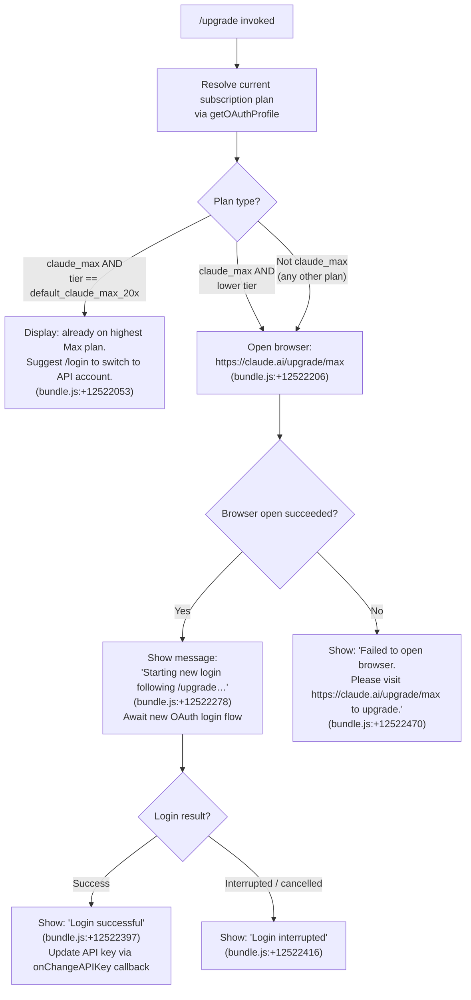

# `/upgrade`

> Analysis basis: CC v2.1.160 bundle.js (AST extraction + Claude interpretation)
> Minimum version: v2.1.160

---

## Overview

The `/upgrade` command guides the user through upgrading their Claude account to the **Max subscription plan**, which offers higher rate limits and more Opus model access. It first checks whether the user is already on a `claude_max` plan (and which tier), then either opens the browser to `https://claude.ai/upgrade/max` or triggers an inline OAuth login flow. If the browser cannot be opened, it surfaces a fallback message with the upgrade URL.

---

## Registration

| Field | Value |
|---|---|
| type | `local-jsx` |
| name | `upgrade` |
| description | `Upgrade to Max for higher rate limits and more Opus` |
| loc_byte | `12522677` |
| loc_byte_end | `12522924` |
| loc_line | `8777` |
| module_id | `LqA` |
| load_inline | `true` |
| arbor_handler.name | `Uy6` |
| arbor_handler.fqn | `claude-2.1.160::Uy6` |
| arbor_handler.kind | `AsyncFunction` |
| arbor_handler.resolution_path | `module_id` |
| arbor_handler.n_hits | `0` |

Analysis basis: CC v2.1.160 bundle.js:+12522677

---

## Input Branching

The handler has 4+ distinct paths depending on subscription plan tier and browser availability, so a Mermaid flowchart is used.



---

## Behavioral Spec

### 1. Handler Entry — `upgradeCommandHandler` (`Uy6`)

The main handler is an `AsyncFunction` resolved via `module_id → LqA`.

```
async function upgradeCommandHandler(context):
    plan = resolveCurrentPlan(context)           // calls getSubscriptionInfo (EA)
    tier = resolvePlanTier(context)              // checks literal "default_claude_max_20x"

    if plan == "claude_max" AND tier == "default_claude_max_20x":
        display("You are already on the highest Max subscription plan. "
                "For additional usage, run /login to switch to an API usage-billed account.")
        return

    opened = openBrowser("https://claude.ai/upgrade/max")  // calls browserOpenUtil (kK)

    if NOT opened:
        display("Failed to open browser. "
                "Please visit https://claude.ai/upgrade/max to upgrade.")
        return

    display("Starting new login following /upgrade. "
            "Exit with Ctrl-C to use existing account.")

    result = await performOAuthLogin(context)   // calls oauthLoginFlow (aOH)

    if result.success:
        context.onChangeAPIKey(result.newKey)
        display("Login successful")
    else:
        display("Login interrupted")
```

Analysis basis: CC v2.1.160 bundle.js:+12521722

---

### 2. Plan Resolution — `getSubscriptionInfo` (`EA`)

Reads the current account subscription plan using the auth/session state. Calls `getAuthState` (`bD`) which resolves the authentication mode and checks provider-specific fields.

```
function getSubscriptionInfo(context):
    authState = getAuthState(context)         // bD
    if authState.type in ["bedrock","foundry","anthropicAws","mantle","vertex","firstParty"]:
        return { plan: authState.plan, tier: authState.tier }
    return { plan: null, tier: null }
```

Key string constants used in auth provider discrimination:
- `"bedrock"` — bundle.js:+2047861
- `"foundry"` — bundle.js:+2047911
- `"anthropicAws"` — bundle.js:+2047967
- `"mantle"` — bundle.js:+2048021
- `"vertex"` — bundle.js:+2048069
- `"firstParty"` — bundle.js:+2048078

The plan string `"claude_max"` is compared at bundle.js:+12521952; the tier `"default_claude_max_20x"` is compared at bundle.js:+12521833.

Analysis basis: CC v2.1.160 bundle.js:+3004822

---

### 3. OAuth Profile Fetch — `getOAuthProfile` (`aOH`)

Called as part of the login flow to retrieve profile information after browser-based OAuth.

```
async function getOAuthProfile(token):
    headers = { "Content-Type": "application/json" }
    timeoutMs = 10000                             // bundle.js:+2094127

    try:
        response = await httpGet(oauthProfileEndpoint, headers, timeout=timeoutMs)
        emitTelemetry("oauth_profile_fetch")      // bundle.js:+2094143
        return response.profile
    catch error:
        emitTelemetry("oauth_profile_token_failed")   // bundle.js:+2094210
        logError(error)
        return null
```

Analysis basis: CC v2.1.160 bundle.js:+2093983

---

### 4. Browser Open Utility — `openUrlInBrowser` (`kK`)

Platform-aware URL launcher. Uses `open` (macOS), `xdg-open` (Linux), or `rundll32 url,OpenURL` (Windows).

```
function openUrlInBrowser(url):
    validateUrl(url)                  // vL7 — rejects non-http/https schemes
                                      // bundle.js:+6749865

    platform = process.platform
    if platform == "darwin":          // bundle.js:+6750224
        spawn("open", [url])
    else if platform == "win32":      // bundle.js:+6750240
        spawn("rundll32", ["url,OpenURL", url])   // bundle.js:+6750324
    else:
        spawn("xdg-open", [url])      // bundle.js:+6750405

    return success
```

URL validated for `"http:"` (bundle.js:+6749915) or `"https:"` (bundle.js:+6749937) schemes before launch.

Analysis basis: CC v2.1.160 bundle.js:+6750152

---

### 5. OAuth Login Flow — `performOAuthLogin` (`yH`)

Performs a new browser-based OAuth login following the upgrade redirect.

```
async function performOAuthLogin(context):
    token = await awaitOAuthCallback(context)     // n9/T14
    if token == null:
        return { success: false }

    profile = await getOAuthProfile(token)
    logResult(profile)

    pushToLoginHistory(token)                     // LUH.push — bundle.js:+971821
    if error:
        logError(error)                           // mi.logError — bundle.js:+971861
        return { success: false }

    return { success: true, newKey: token }
```

Analysis basis: CC v2.1.160 bundle.js:+971461

---

### 6. Auth State Resolution — `getAuthState` (`bD`)

Resolves the full authentication context, consulting environment variables, OAuth token file descriptors, and API key file descriptors.

Key environment variables inspected:
- `ANTHROPIC_API_KEY` — bundle.js:+2988369
- `CLAUDE_CODE_OAUTH_TOKEN_FILE_DESCRIPTOR` — bundle.js:+2109545
- `CLAUDE_CODE_API_KEY_FILE_DESCRIPTOR` — bundle.js:+2109688

Auth profile type `"user_oauth"` is identified at bundle.js:+2985414; `"profile-implicit"` at bundle.js:+2985341.

Error thrown when no recognized credential is present: `"ANTHROPIC_API_KEY, ANTHROPIC_AUTH_TOKEN, CLAUDE_CODE_OAUTH_TOKEN, or WIF env vars (ANTHROPIC_FEDERATION_RULE_ID + ANTHROPIC_ORGANIZATION_ID) required"` — bundle.js:+2988832.

Analysis basis: CC v2.1.160 bundle.js:+2986350

---

### 7. JSX Render Component

The command is registered as `local-jsx`, meaning it renders a React component tree via `KqA.createElement` (bundle.js:+12522239) rather than returning plain text. The component:

- Displays status messages inline in the CLI UI.
- Wires `onChangeAPIKey` callback (bundle.js:+12522374) to propagate new credentials to app state after a successful upgrade-login.
- Uses a `setTimeout` (bundle.js:+12522038) to schedule post-login state synchronization.

Analysis basis: CC v2.1.160 bundle.js:+12522239

---

## State & Side Effects

| Item | Detail |
|---|---|
| Telemetry — `tengu_feature_ok` | Emitted on successful OAuth feature call (bundle.js:+966123) |
| Telemetry — `tengu_feature_sad` | Emitted on failed OAuth feature call (bundle.js:+966258) |
| Telemetry — `oauth_profile_fetch` | Emitted when OAuth profile endpoint is successfully contacted (bundle.js:+2094143) |
| Telemetry — `oauth_profile_token_failed` | Emitted when OAuth profile fetch fails (bundle.js:+2094210) |
| Telemetry — `api_bootstrap_fetch` | Emitted during bootstrap config fetch (bundle.js:+15452112) |
| Browser launch | Opens `https://claude.ai/upgrade/max` in the system browser (bundle.js:+12522206) |
| `onChangeAPIKey` callback | Called with the new OAuth token string to update in-memory API key (bundle.js:+12522374) |
| Login history | New token pushed to `LUH` login history queue (bundle.js:+971821) |
| `setTimeout` | Short deferred callback registered post-login for state sync (bundle.js:+12522038) |
| Sound | <!-- TODO: not found in depth-2 traversal; needs --depth 4 --> |
| appState changes | API key credential updated in application state via `onChangeAPIKey`; subscription plan may be re-evaluated on next command |

---

## Version History

| Version | Change |
|---|---|
| v2.1.160 | Initial analysis |

---

## Common Mistakes

1. **Running `/upgrade` when already on `default_claude_max_20x`**: The command will immediately display an informational message and take no action. Use `/login` instead to switch to an API-billed account for additional quota.
2. **Browser unavailable in headless/SSH environments**: The command will fall back to displaying the upgrade URL as text, but cannot complete the OAuth flow automatically. You must visit `https://claude.ai/upgrade/max` manually.
3. **Interrupting the login prompt with Ctrl-C**: The OAuth callback is cancelled and the command reports "Login interrupted" without updating credentials. The existing session remains unchanged.
4. **Non-http(s) upgrade URLs in custom environments**: The browser-open utility validates the scheme; any non-HTTP(S) URL will be rejected with an error before the browser is launched.
5. **Assuming `/upgrade` applies to API-key–billed accounts**: The upgrade flow is specifically for `user_oauth` / `profile-implicit` account types. API key (`ANTHROPIC_API_KEY`) users are directed to manage billing via the Anthropic console, not this command.

---

## Appendix — Identifier Mapping

> For bundle debugging only. Identifiers change across versions.

| Identifier | Role |
|---|---|
| `Uy6` | `upgradeCommandHandler` — main async handler for `/upgrade` |
| `EA` | `getSubscriptionInfo` — reads current plan/tier from auth state |
| `bD` | `getAuthState` — resolves full authentication context |
| `eK` | `resolveCredentialType` — determines credential kind from env |
| `FH` | `formatErrorMessage` — generic error formatter |
| `hJ` | `buildAuthProfile` — assembles auth profile object |
| `$o6` | `readOAuthTokenStore` — reads OAuth token from store |
| `cQH` | `classifyAuthProvider` — classifies provider type string |
| `Kr` | `resolveOAuthScope` — resolves OAuth scope/permission set |
| `sN` | `loadFlagSettings` — loads feature flag settings |
| `IR` | `checkArrayIncludes` — array membership check utility |
| `bM` | `detectCloudProvider` — detects bedrock/vertex/etc. provider |
| `jA` | `formatProviderLabel` — formats provider display label |
| `jP` | `getProfileConfig` — fetches profile configuration object |
| `e3` | `resolveApiKeyCredential` — resolves API key from env/file |
| `HD6` | `resolveApiKeyHelper` — handles `apiKeyHelper` config |
| `uuH` | `detectVsCodeClient` — detects `claude-vscode` client type |
| `w$6` | `readApiKeyFileDescriptor` — reads key from file descriptor |
| `R6` | `recordAuthEvent` — records timestamped auth telemetry event |
| `kR` | `trimRecentHistory` — trims history array to last 20 entries |
| `AD6` | `wrapAuthProvider` — wraps provider with classification |
| `aOH` | `getOAuthProfile` — fetches OAuth profile from remote endpoint |
| `kq` | `buildOAuthUrl` — builds OAuth authorization URL |
| `aVA` | `getOAuthBaseUrl` — returns base OAuth URL for environment |
| `z94` | `getOAuthClientId` — returns OAuth client ID |
| `hH` | `fetchWithTimeout` — HTTP fetch with configurable timeout |
| `d` | `httpClient` — base HTTP client (axios or fetch wrapper) |
| `t6` | `parseHttpResponse` — parses and validates HTTP response |
| `Fz` | `getOAuthEndpoint` — resolves the OAuth profile endpoint URL |
| `N` | `writeConversationLog` — writes conversation/session log entry |
| `lmK` | `formatLogLine` — formats a single log line for writing |
| `ADA` | `getLogFilePath` — resolves log file path |
| `H` | `bootstrapFetch` — performs bootstrap API config fetch |
| `o$` | `getUserAgentString` — builds User-Agent header string |
| `Ce` | `checkFeatureFlag` — checks feature flag set membership |
| `wj` | `sanitizeBootstrapResponse` — sanitizes bootstrap response text |
| `gq` | `parseBootstrapJson` — parses bootstrap JSON payload |
| `SH` | `stableStringify` — JSON.stringify wrapper for stable output |
| `x4` | `redactApiKey` — redacts API key string for logging |
| `xwA` | `buildRedactionMap` — builds map of strings to redact |
| `q` | `unlinkTempFile` — removes a temporary file (unlinkSync) |
| `A` | `normalizeFilename` — lowercases filename string |
| `PmH` | `flushLogBuffer` — flushes buffered log lines to disk |
| `ZwA` | `writeLogChunk` — writes a buffer chunk to the log stream |
| `rmK` | `appendLogEntry` — appends a structured log entry to log file |
| `QuH` | `batchLogWriter` — batches log writes with setTimeout/setImmediate |
| `R$H` | `buildLogRecord` — builds a structured log record object |
| `d6` | `getLogDirectory` — returns the log directory path |
| `A46` | `ensureLogDirExists` — creates log directory if absent |
| `gwA` | `resolveLogFilePath` — joins dir + filename for log path |
| `FwA` | `rotateLargeLogFile` — renames/rotates log if over size limit |
| `imK` | `writeToLogFile` — mkdir + appendFile + rotation logic |
| `O9` | `registerAtExit` — registers an HDA at-exit handler |
| `yH` | `performOAuthLogin` — executes browser OAuth login flow |
| `d_` | `wrapError` — wraps arbitrary value into an Error object |
| `n9` | `awaitOAuthCallback` — waits for OAuth redirect callback |
| `KNA` | `formatOAuthCallbackMessage` — formats callback status message |
| `T14` | `manageLoginQueue` — manages login token FIFO queue (shift/push) |
| `kK` | `openUrlInBrowser` — platform-aware URL browser launcher |
| `vL7` | `validateBrowserUrl` — validates URL scheme before opening |
| `MY` | `getBrowserCommand` — selects OS-specific browser open command |
| `h8` | `spawnBrowserProcess` — spawns the browser child process |
| `v_` | `runCliSession` — orchestrates a full interactive CLI session |
| `jEH` | `initSessionComponents` — initialises all session subsystems |
| `Y` | `shutdownHandler` — handles forced shutdown / process.exit |
| `o44` | `formatSessionString` — converts session data to string |
| `SO` | `setupSignalHandlers` — registers OS signal handlers |
| `G8` | `getAppVersion` — returns the current app version string |
| `S6` | `getAsyncStore` — retrieves value from AsyncLocalStorage store |
| `sF6` | `readAsyncStore` — reads from `aF6` AsyncLocalStorage |
| `Y_` | `initZoneContext` — initialises zone/context (`zN`) |