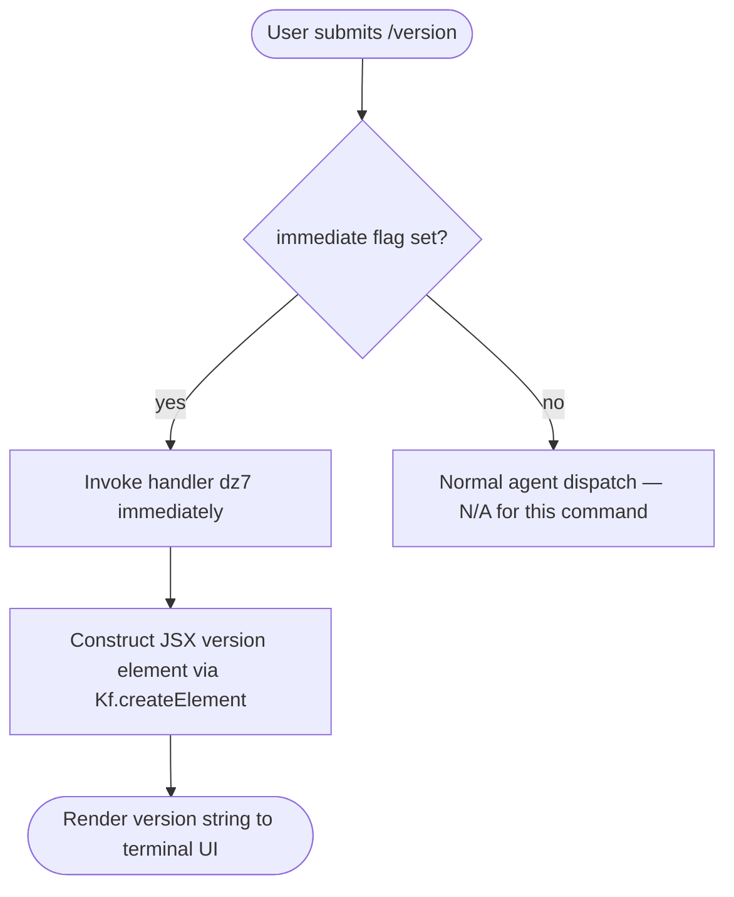

# `/version`

> Analysis basis: CC v2.1.132 bundle.js (AST extraction + Claude interpretation)
> Minimum version: v2.1.132

---

## Overview

The `/version` slash command is a local, immediately-executed command that displays the version of Claude Code currently running in the active session. Importantly, it reports the **session-active** version rather than any version that the auto-updater may have staged or downloaded in the background. The output is rendered as a JSX component returned directly by the handler, with no agent round-trip required.

---

## Registration

| Field | Value |
|---|---|
| type | `local-jsx` |
| name | `version` |
| description | `Print the version this session is running (not what autoupdate downloaded)` |
| immediate | `true` |
| load_inline | `true` |
| load_ident | `dz7` (resolved via `load:()=>Promise.resolve({call: dz7})` inline shape) |
| handler kind | `AsyncFunction` (Arbor resolution path: `load_ident`) |
| loc_byte span | `11277970` – `11278177` |
| `loc_byte_end` | `11278177` |
| `arbor_handler.name` | `dz7` |
| `arbor_handler.kind` | `AsyncFunction` |
| `arbor_handler.resolution_path` | `load_ident` |
| `arbor_handler.fqn` | `claude-2.1.132::dz7` |
| `arbor_handler.n_hits` | `0` |

Analysis basis: CC v2.1.132 bundle.js:+11277970

---

## Input Branching

Because `immediate: true` is set on the registration, the command fires the handler as soon as the user submits `/version` — no further argument parsing or confirmation step occurs. The command accepts no arguments; any text following `/version` is ignored at this layer.



Analysis basis: CC v2.1.132 bundle.js:+11277970 (registration flags), +11277784 (createElement call)

---

## Behavioral Spec

### Version Display Handler

The handler (`dz7`) is an `AsyncFunction` inlined directly into the registration object's `load` property. When invoked, it constructs and returns a React element (via the framework's `createElement` call) that displays the current session version string.

```
async function versionCommandHandler(commandContext):
    # Retrieve the version identifier bound at session startup
    sessionVersion = readSessionVersion(commandContext)

    # Build a renderable UI element containing the version string
    element = createJSXElement(
        componentType  = <version display component>,
        props          = { version: sessionVersion },
        children       = none
    )

    # Return element; the CLI shell renders it inline in the terminal
    return element
```

Key behavioral points:

- **Session-pinned version**: The version value is the one loaded when the current CLI process started. It will not reflect a newer binary that the auto-updater may have fetched since startup. This is explicitly called out in the command description.
- **No network I/O**: The handler makes no outbound calls. All data is available in-process at the time of invocation.
- **No user input consumed**: The handler ignores any trailing argument text; `immediate: true` means the shell dispatches straight to the handler.
- **JSX output path**: The `local-jsx` type signals that the return value is a React/JSX node rendered by the terminal UI layer, not a plain text string written to stdout.

Analysis basis: CC v2.1.132 bundle.js:+11277784 (`Kf.createElement` call edge from `dz7`), +11277970 (registration block)

### Auto-Update Version Distinction

The description explicitly distinguishes the session version from the auto-downloaded version. This implies the CLI has a mechanism by which a new binary can be staged without replacing the running process. The `/version` command intentionally does **not** query that staged artifact — it only reports what is currently executing.

```
function resolveDisplayVersion():
    # The running process has a version constant baked in at build time
    runningVersion = PROCESS_VERSION_CONSTANT

    # Auto-updater may have written a newer version to disk,
    # but /version deliberately ignores that path
    return runningVersion   # NOT stagedVersion
```

<!-- TODO: staged-version read path not found in depth-2 traversal; needs --depth 4 -->

---

## State & Side Effects

| Item | Detail |
|---|---|
| Telemetry | None detected in this command's implementation (telemetry array is empty) |
| Hook registration | None detected at depth ≤ 2 |
| appState changes | None — read-only operation |
| Network I/O | None |
| File I/O | None detected at depth ≤ 2 |
| Sound | None |
| Agent invocation | None — `immediate: true` bypasses the agent entirely |

Analysis basis: CC v2.1.132 bundle.js:+11277970

---

## Version History

| Version | Change |
|---|---|
| v2.1.132 | Initial analysis — `local-jsx`, `immediate`, inline `load_ident` handler `dz7` |

---

## Common Mistakes

1. **Assuming `/version` shows the latest downloaded version.** The command is explicitly scoped to the *running session's* version. If the auto-updater has staged a newer release, that version will not appear here until the CLI process is restarted.
2. **Passing arguments.** The command accepts no arguments. Any text after `/version` is silently ignored because `immediate: true` dispatches directly to the handler without argument parsing.
3. **Expecting plain-text stdout.** The `local-jsx` type means output is a rendered JSX component in the terminal UI, not a raw string written to standard output. Tooling that scrapes stdout may not capture the version display correctly.
4. **Confusing this with a `prompt`-type command.** `/version` never sends a message to the Claude agent. It resolves entirely within the CLI process.

---

## Appendix — Identifier Mapping

> For bundle debugging only. Identifiers change across versions.

| Identifier | Role |
|---|---|
| `dz7` | Async version command handler; inlined via `load:()=>Promise.resolve({call: dz7})`; constructs and returns the JSX version display element (Arbor FQN: `claude-2.1.132::dz7`) |
| `Kf` | React (or React-compatible) framework namespace; `Kf.createElement` is the JSX factory called by `dz7` to build the renderable output |

Analysis basis: CC v2.1.132 bundle.js:+11277784, +11277970