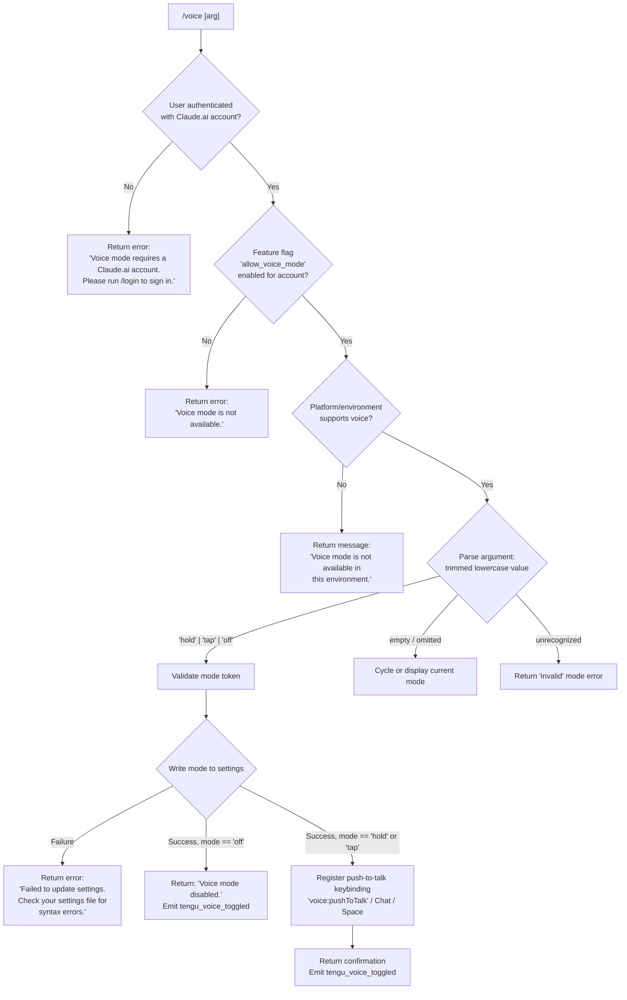

# `/voice`

> Analysis basis: CC v2.1.160 bundle.js (AST extraction + Claude interpretation)
> Minimum version: v2.1.160

---

## Overview

The `/voice` command toggles voice mode within Claude Code, allowing users to switch between `hold`, `tap`, and `off` activation modes for voice input. It checks authentication state, platform feature availability, and account permissions before persisting the chosen mode to settings and optionally registering a push-to-talk keybinding. The command emits telemetry on every successful toggle.

---

## Registration

| Field | Value |
|---|---|
| type | `local` |
| name | `voice` |
| description | `Toggle voice mode` |
| argumentHint | `[hold\|tap\|off]` |
| supportsNonInteractive | `false` |
| isHidden | `null` |
| module_id | `_AK` |
| load_inline | `true` |
| loc_byte | `12791059` |
| loc_byte_end | `12791301` |
| loc_line | `9310` |
| arbor_handler.name | `kIf` |
| arbor_handler.fqn | `claude-2.1.160::kIf` |
| arbor_handler.kind | `AsyncFunction` |
| arbor_handler.resolution_path | `module_id` |
| arbor_handler.n_hits | `1` |

Analysis basis: CC v2.1.160 bundle.js:+12791059

---

## Input Branching

The handler processes five distinct outcomes based on authentication, feature availability, environment capability, argument value, and settings-write success. A Mermaid flowchart is used.



Analysis basis: CC v2.1.160 bundle.js:+12788430, +12788442, +12788453, +12788474, +12788554, +12788653, +12788972, +12789110, +12789354

---

## Behavioral Spec

### 1. Entry point — `voiceCommandHandler` (bundle: `kIf`)

The handler is an `AsyncFunction` resolved via `module_id` → `_AK`.

```
async function voiceCommandHandler(args, context):
    authState = loadAuthState(context)              // calls authStateLoader (eA6 → v9A → bD)
    if not authState.hasClaudeAiAccount:
        return textMessage("Voice mode requires a Claude.ai account. Please run /login to sign in.")

    featureFlags = checkAccountFeatures(authState)  // checks "allow_voice_mode"
    if not featureFlags.allowVoiceMode:
        return textMessage("Voice mode is not available.")

    envCapable = checkEnvironmentVoiceCapability()  // platform/terminal check
    if not envCapable:
        return textMessage("Voice mode is not available in this environment.")

    rawArg = trimArgument(args)                     // H.trim (bundle: IIf → H.trim)
    mode   = parseVoiceMode(rawArg)                 // normalizeMode (IIf)

    result = applyVoiceMode(mode, context)          // settings write + keybinding
    emit("tengu_voice_toggled", { mode })           // telemetry
    return result
```

Analysis basis: CC v2.1.160 bundle.js:+12788513, +12788524, +12788691, +12788738, +12789053, +12789055

---

### 2. Authentication and feature-flag check — `authAndFlagCheck` (bundle: `eA6`, `v9A`, `N9A`)

```
function authAndFlagCheck(context):
    profile = loadAuthProfile(context)              // v9A → bD (profile loader)
    flags   = resolveAccountFeatureFlags(profile)   // N9A → G9
    voiceAllowed = flags.includes("allow_voice_mode")
    return { hasClaudeAiAccount: profile != null, allowVoiceMode: voiceAllowed }
```

The feature flag literal `"allow_voice_mode"` is confirmed present at:
Analysis basis: CC v2.1.160 bundle.js:+12778691

Account tier checks reference literals `"enterprise"` and `"team"` (bundle.js:+4146184, +4146219), indicating that `allow_voice_mode` may be restricted to those subscription tiers.

---

### 3. Argument normalization — `normalizeVoiceArg` (bundle: `IIf`)

```
function normalizeVoiceArg(rawInput):
    trimmed = rawInput.trim()
    lower   = trimmed.toLowerCase()
    if lower in {"hold", "tap", "off"}:
        return lower
    if lower == "":
        return CURRENT_MODE          // no-arg: reflect current or cycle
    return "invalid"
```

Valid mode tokens (confirmed literals):
- `"hold"` — bundle.js:+12788430
- `"tap"` — bundle.js:+12788442
- `"off"` — bundle.js:+12788453
- `"invalid"` sentinel — bundle.js:+12788474

Analysis basis: CC v2.1.160 bundle.js:+12788383 (`IIf` → `H.trim`), +12788805 (`kIf` → `H.trim`)

---

### 4. Settings persistence — `persistVoiceMode` (bundle: `F_` settings-writer chain)

The handler calls into the settings-write subsystem (`F_`) which:

```
async function persistVoiceMode(mode):
    settings = loadSettingsFromDisk()               // lp → ms8 chain
    settings.voiceMode = mode
    try:
        writeSettingsWithLock(settings)             // If6 → atomic write via temp file + rename
        return SUCCESS
    catch SyntaxError | IOError:
        return FAILURE
```

On failure the message `"Failed to update settings. Check your settings file for syntax errors."` is returned (bundle.js:+12788972).

On success with `mode == "off"`, the message `"Voice mode disabled."` is returned (bundle.js:+12789110).

The settings system uses an atomic write pattern (temp file → `fchmodSync` → `fsyncSync` → `renameSync`) to prevent corruption.

Analysis basis: CC v2.1.160 bundle.js:+12788874, +12789053

---

### 5. Keybinding registration — `registerPushToTalkKeybinding` (bundle: `mP`)

When voice mode is set to `"hold"` or `"tap"`, a push-to-talk keybinding is registered:

```
function registerPushToTalkKeybinding():
    action  = "voice:pushToTalk"   // bundle.js:+12790323
    context = "Chat"               // bundle.js:+12790342
    key     = "Space"              // bundle.js:+12790349
    mP(action, context, key)       // keybinding loader (D18 → kvH)
```

The keybinding subsystem (`kvH`) reads `keybindings.json` (literal at bundle.js:+3837244), validates the `"bindings"` array structure, and emits `tengu_custom_keybindings_loaded` on success or `tengu_keybinding_fallback_used` on action-not-found.

Analysis basis: CC v2.1.160 bundle.js:+12790320, +12790323, +12790342, +12790349

---

### 6. Microphone permission hint

When voice mode is activated on macOS, a permission hint referencing `"System Settings → Privacy & Security → Microphone"` is surfaced to the user (bundle.js:+12789861), indicating that the runtime performs or describes a native microphone permission check.

Analysis basis: CC v2.1.160 bundle.js:+12789279 (`kIf` → `Ph6`), +12789861

---

### 7. Environment capability check

The environment check (`kIf` → `y9A`) gates voice on whether the current terminal/platform supports audio capture. The message `"Voice mode is not available in this environment."` is returned when this check fails (bundle.js:+12789354).

Analysis basis: CC v2.1.160 bundle.js:+12789200, +12789354

---

## State & Side Effects

| Item | Detail |
|---|---|
| Telemetry | `tengu_voice_toggled` (bundle.js:+12789055) — emitted on every successful toggle including disable |
| Telemetry (secondary) | `tengu_feature_ok` / `tengu_feature_bad` / `tengu_feature_sad` (bundle.js:+966123, +966181, +966258) — general feature tracking |
| Telemetry (keybinding) | `tengu_custom_keybindings_loaded`, `tengu_keybinding_fallback_used`, `tengu_keybinding_customization_release` |
| Telemetry (config) | `tengu_config_parse_error`, `tengu_config_stale_write`, `tengu_config_auth_loss_prevented`, `tengu_config_lock_contention` |
| Settings write | Persists `voiceMode` value (`"hold"` / `"tap"` / `"off"`) to the user settings file (`~/.claude/settings.json`) via atomic rename |
| Keybinding registration | Registers `voice:pushToTalk` → `Space` in the `Chat` context when enabling hold or tap mode |
| appState changes | Voice mode field updated in application state; reflected in UI immediately |
| Sound | No audio output triggered by the command itself; microphone access is initiated after the command completes |

---

## Version History

| Version | Change |
|---|---|
| v2.1.160 | Initial analysis |

---

## Common Mistakes

1. **Running `/voice` without a Claude.ai account** — The command immediately returns an error pointing to `/login`. OAuth or API-key-only sessions are not sufficient; a Claude.ai account (enterprise or team tier implied by `allow_voice_mode` flag) is required.
2. **Passing an unrecognized mode string** — Any argument other than `hold`, `tap`, or `off` (case-insensitive after trimming) is treated as `"invalid"` and rejected. There is no fuzzy matching.
3. **Expecting voice in non-interactive mode** — `supportsNonInteractive: false` means `/voice` cannot be used in `--print` / pipe mode; it is silently unavailable or errors in that context.
4. **Settings file syntax errors blocking the toggle** — If `settings.json` is malformed, the write fails and the command returns an error without changing the voice state. Fix the file before retrying.
5. **Microphone permission not granted on macOS** — Even if the command succeeds, voice input will not function without granting microphone access via `System Settings → Privacy & Security → Microphone`.
6. **Assuming `/voice` alone disables voice** — With no argument the command may cycle or reflect the current state rather than disabling. Pass `off` explicitly to disable.

---

## Appendix — Identifier Mapping

> For bundle debugging only. Identifiers change across versions.

| Identifier | Role |
|---|---|
| `kIf` | Main voice command handler (AsyncFunction, Arbor-resolved) |
| `eA6` | Auth-and-feature-flag orchestrator |
| `v9A` | Auth profile loader (top-level) |
| `bD` | Auth profile resolver / credential dispatcher |
| `eK` | Credential validator helper |
| `hJ` | OAuth token / session profile handler |
| `bM` | First-party auth branch handler |
| `jP` | Auth parameter builder |
| `e3` | API-key auth path handler |
| `AD6` | Auth dispatch branch for alternate flow |
| `cQH` | Auth context formatter |
| `rG` | Auxiliary auth state reader |
| `Yh6` | Feature-flag fetch helper |
| `N9A` | Account feature-flag resolver |
| `G9` | Feature-flag set evaluator |
| `Jq9` | Flag set iterator |
| `_C` | Per-flag evaluation function |
| `n9` | Essential-traffic / network category checker |
| `f4H` | Feature flag string formatter |
| `wj6` | Flag apply / merge function |
| `IIf` | Argument trimmer and mode normalizer |
| `l_` | Settings load initiator |
| `lp` | Settings loader (disk read orchestrator) |
| `EG` | Settings load pre-check |
| `h9` | Performance mark recorder |
| `Bb` | Native module (`perf_hooks`) loader |
| `ms8` | Full settings-load pipeline |
| `D8` | Log-file append utility |
| `xb6` | Settings merge helper |
| `w56` | Flag-settings filter |
| `ARA` | Settings aggregator |
| `c3H` | Settings path resolver (`.claude/settings.json`) |
| `TQ` | SDK inline settings merger |
| `eSA` | Settings validation layer |
| `EQ` | Settings object builder |
| `Y_` | Platform detection utility |
| `bb6` | Settings load finalizer |
| `H` | Fetch/bootstrap HTTP utility (overloaded identifier) |
| `N` | Command argument/input normalizer |
| `lmK` | Argument detail parser |
| `SH` | JSON serializer utility |
| `x4` | Argument token extractor |
| `PmH` | Path sanitizer |
| `rmK` | File-based input reader |
| `o$` | HTTP response parser |
| `Ce` | Content-type checker |
| `wj` | Input string replacer |
| `gq` | Model name resolver |
| `GHH` | Model alias expander |
| `K1` | Model slug normalizer |
| `yP` | Model routing helper |
| `t6` | Terminal display helper |
| `d` | Core display/render primitive |
| `F_` | Settings write orchestrator |
| `mO` | Write pre-flight checker |
| `d6` | File-existence / stat utility |
| `us8` | Settings write pipeline |
| `NX` | File-path resolver for writes |
| `Ui` | File reader with encoding detection |
| `I$` | Real-path resolver |
| `tF6` | File open/read helper |
| `eF6` | File content slicer |
| `V8` | Error classifier |
| `G8` | Generic error constructor |
| `Ra8` | Write timestamp recorder |
| `SEH` | Settings path + event emitter wrapper |
| `SQ6` | Settings file path builder |
| `If6` | Atomic file writer (temp → rename) |
| `O` | Symlink/stat result object |
| `C8` | Background session state |
| `Uz` | Cache invalidation on settings write |
| `Bg6` | Gitignore / file-ignore checker |
| `S6` | AsyncLocalStorage context reader |
| `sF6` | Store getter |
| `ja8` | Git metadata reader |
| `A` | Generic array/collection utility (overloaded) |
| `Ug6` | Git check-ignore runner |
| `v_` | Git subprocess executor |
| `NL4` | Path normalizer with home-dir expansion |
| `dyA` | Gitignore file parser |
| `cyA` | Ignore-rule compiler |
| `fx` | Claude config directory path builder (`.claude`) |
| `hH` | Display helper for info messages |
| `RH` | Display helper for warning messages |
| `yH` | Error logger / UI error display |
| `d_` | Error string formatter |
| `FH` | String coercion utility |
| `T14` | Circular log buffer manager |
| `M` | Workspace path validator / staging cleaner |
| `qC6` | Plugin path resolver |
| `KC6` | Plugin synced-path builder |
| `$` | Top-level session/daemon context accessor |
| `aHK` | Daemon status reader |
| `$r` | Command context normalizer |
| `JKH` | Command string trimmer |
| `L1` | AsyncLocalStorage session getter |
| `ny6` | Daemon status file path builder (`daemon.status.json`) |
| `mP` | Keybinding registration entry point |
| `D18` | Keybinding loader orchestrator |
| `kvH` | Keybinding config parser (reads `keybindings.json`) |
| `wX_` | Keybinding entry builder |
| `rU` | Keybinding context registry |
| `o4H` | Keybinding file path builder |
| `m6` | JSON parse wrapper |
| `$18` | Keybinding block structure validator |
| `L18` | Keybinding entry iterator |
| `Feq` | Keybinding fallback display |
| `DX_` | Keybinding conflict/duplicate detector |
| `YX_` | Keybinding set compiler |
| `GH` | String coercion for keybinding labels |
| `Y18` | Keybinding apply / register function |
| `WX_` | Platform keybinding selector |
| `XX_` | Platform-specific binding builder |
| `Ceq` | Binding map formatter |
| `ZVL` | Modifier key serializer |
| `IuH` | Language/locale normalizer (`"en"`) |
| `R6` | Config-file watcher / change detector |
| `hY_` | Config stat helper |
| `ZDH` | Config file reader and backup manager |
| `Ax` | Config string prefix stripper |
| `nQq` | Config directory scanner |
| `uY_` | Backup path builder |
| `w` | Background daemon worker / session runner |
| `S` | Daemon write stream |
| `gh8` | Low-memory event helper |
| `fj6` | Session roster file reader |
| `F` | Promise/task retirement tracker |
| `W6` | Daemon session dispatcher |
| `w$A` | Daemon claim / connect handler |
| `T$A` | Background task lifecycle manager |
| `Y` | Forced-shutdown / process.exit handler |
| `R` | Rate-limit event emitter |
| `ojL` | File-watch watcher setup |
| `Br` | File-change debouncer |
| `O9` | FinalizationRegistry hook registrar |
| `W8` | Config save-with-lock orchestrator |
| `xY_` | Locked config writer (full pipeline) |
| `qYq` | Atomic write helper (Object.assign based) |
| `R4_` | Write-result assembler |
| `fY6` | Config re-read comparator |
| `V` | Path prefix checker |
| `X` | MCP server connection manager |
| `Yu8` | MCP server initializer |
| `Z` | Backup slice utility |
| `SdH` | Config save dispatcher |
| `lQq` | Config entry enumerator |
| `RdH` | Config save timestamp recorder |
| `bY_` | Fallback config writer |