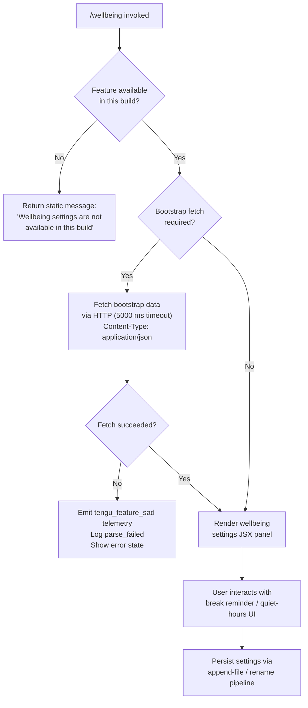

# `/wellbeing`

> Analysis basis: CC v2.1.160 bundle.js (AST extraction + Claude interpretation)
> Minimum version: v2.1.160

---

## Overview

The `/wellbeing` command provides an interface for configuring optional break reminders and quiet-hours nudges within Claude Code. It is registered as a `local-jsx` command that renders a UI component immediately on invocation. When the feature is unavailable in the running build, the command surfaces a static unavailability message rather than an interactive settings panel.

---

## Registration

| Field | Value |
|---|---|
| type | `local-jsx` |
| name | `wellbeing` |
| description | Configure optional break reminders and quiet-hours nudges |
| aliases | `breaks`, `break-reminder`, `downtime` |
| immediate | `true` |
| module_id | `ZHK` |
| load_inline | `true` |
| loc_byte | `12548791` |
| loc_byte_end | `12549044` |
| loc_line | `8786` |
| arbor_handler.name | `dZf` |
| arbor_handler.fqn | `claude-2.1.160::dZf` |
| arbor_handler.kind | `AsyncFunction` |
| arbor_handler.resolution_path | `module_id` |
| arbor_handler.n_hits | `0` |

Analysis basis: CC v2.1.160 bundle.js:+12548791

---

## Input Branching

The command exhibits three distinct execution paths depending on build availability and the state of the wellbeing feature module:



Analysis basis: CC v2.1.160 bundle.js:+12548142 (unavailability literal), +15451991 (5000 ms timeout), +15452134 (parse_failed)

---

## Behavioral Spec

### 1. Handler Entry Point (`dZf`)

The primary async handler is `dZf`, resolved via the `module_id` (`ZHK`) → `moduleExports` → name-lookup chain by Arbor. On invocation the handler immediately checks whether wellbeing functionality is present in the running build.

```
async function wellbeingHandler(context):
    if NOT featureAvailableInBuild():
        return StaticMessage("Wellbeing settings are not available in this build")

    bootstrapData = await fetchBootstrapData(context)
    renderWellbeingPanel(bootstrapData, context)
```

Analysis basis: CC v2.1.160 bundle.js:+12548140 (`dZf` → `H` call edge), +12548142 (unavailability string literal)

---

### 2. Bootstrap Fetch (`bootstrapFetcher` — `H`)

When the feature is available, the handler delegates to a general bootstrap-fetch utility (`H`). The utility performs an HTTP GET with the following characteristics:

- **Timeout**: 5 000 ms (Analysis basis: CC v2.1.160 bundle.js:+15451991)
- **Request headers set**: `Content-Type: application/json`, `User-Agent` (Analysis basis: CC v2.1.160 bundle.js:+15451885, +15451919)
- **Debug log prefix**: `[Bootstrap] Fetching` on start, `[Bootstrap] Fetch ok` on success (Analysis basis: CC v2.1.160 bundle.js:+15451800, +15452164)
- On parse failure the event `api_bootstrap_fetch` is emitted with a `parse_failed` sub-tag (Analysis basis: CC v2.1.160 bundle.js:+15452112, +15452134)

```
async function bootstrapFetcher(url, options):
    log("[Bootstrap] Fetching", url)
    response = await httpGet(url, {
        timeout: 5000,
        headers: {
            "Content-Type": "application/json",
            "User-Agent": userAgentString
        }
    })
    if parseError(response):
        recordTelemetry("api_bootstrap_fetch", { result: "parse_failed" })
        throw ParseError
    log("[Bootstrap] Fetch ok")
    return response.json()
```

Analysis basis: CC v2.1.160 bundle.js:+15451798 (`H` → `N` call edge)

---

### 3. Command Argument / Alias Normalization (`commandNormalizer` — `N`)

After bootstrap data is resolved, a normalizer (`N`) processes the raw command input. It performs several transformations before the settings panel is constructed:

- Converts input to uppercase for canonical key lookup (`_.toUpperCase`, Analysis basis: CC v2.1.160 bundle.js:+204349)
- Trims surrounding whitespace (`H.trim`, Analysis basis: CC v2.1.160 bundle.js:+204372)
- Checks inclusion against a known-commands list (`H.includes`, Analysis basis: CC v2.1.160 bundle.js:+204287)
- Serializes relevant state via `JSON.stringify` through the `stateSerializer` helper (`SH`, Analysis basis: CC v2.1.160 bundle.js:+204305)
- Calls the path-building helper (`x4`) to derive the config file path (Analysis basis: CC v2.1.160 bundle.js:+204369)
- Delegates to the annotation resolver (`AR`, Analysis basis: CC v2.1.160 bundle.js:+204388)
- Calls the settings persister (`PmH`) to flush updated state (Analysis basis: CC v2.1.160 bundle.js:+204394)
- Invokes the break-timer scheduler (`rmK`) to set or clear active timers (Analysis basis: CC v2.1.160 bundle.js:+204408)

```
function commandNormalizer(rawInput, state):
    key = rawInput.trim().toUpperCase()
    if NOT knownCommands.includes(key):
        return noOp()
    serialized = stateSerializer(state)
    configPath = buildConfigPath(serialized)
    resolveAnnotations(state)
    persistSettings(state, configPath)
    scheduleBreakTimers(state)
```

Analysis basis: CC v2.1.160 bundle.js:+204247

---

### 4. Break-Timer Scheduler (`breakTimerScheduler` — `rmK`)

This is the core scheduling subsystem. It coordinates four concerns: clearing existing timers, writing the config file, rotating old log files, and registering a new timer.

```
function breakTimerScheduler(settings):
    // 1. Clear any running break timer
    clearExistingTimer(settings)              // QuH

    // 2. Determine config directory
    configDir = path.dirname(configFilePath)  // je.dirname

    // 3. Ensure directory exists and append new settings
    ensureDir(configDir)                      // via imK → Hy.mkdir
    appendToConfigFile(configDir, settings)   // via imK → Hy.appendFile

    // 4. Rotate / rename old .txt config files
    rotateConfigFile(configDir)               // FwA pipeline

    // 5. Compute byte length for flush budget
    byteLen = Buffer.byteLength(serializedSettings)

    // 6. Resolve write-stream and chain then-handler
    writeStream.then(writeChunkHandler.bind(context))  // imK.bind

    // 7. Register OS-level hook for graceful shutdown
    registerShutdownHook(settings)            // O9 → HDA.register

    // 8. Schedule next break reminder
    timerId = setTimeout(breakCallback, intervalMs)

    // 9. Record timer ID for later cancellation
    activeTimers.push(timerId)
```

Key constants used by the scheduler:

- Timer debounce base: **1 000 ms** (Analysis basis: CC v2.1.160 bundle.js:+58350)
- Timer jitter cap: **100 ms** (Analysis basis: CC v2.1.160 bundle.js:+58371)
- Default break interval: **120** (unit: minutes, canonical internal representation) (Analysis basis: CC v2.1.160 bundle.js:+12547825)
- Rotation suffix check: `.txt` (Analysis basis: CC v2.1.160 bundle.js:+203195)
- EISDIR guard on rotation: skips rename if target is a directory (Analysis basis: CC v2.1.160 bundle.js:+174371)
- Rotation rename slice offset: **4** characters (Analysis basis: CC v2.1.160 bundle.js:+203217)

Analysis basis: CC v2.1.160 bundle.js:+203736 (`rmK` entry)

---

### 5. Timer-Clear Helper (`timerClearHelper` — `QuH`)

Cancels any in-flight break timer and flushes queued callbacks before a new schedule is committed.

```
function timerClearHelper(timerState):
    clearTimeout(timerState.currentId)
    joined = pendingCallbacks.join("")
    // drain via setImmediate to avoid blocking the event loop
    setImmediate(() => {
        processQueue(joined)
        activeTimerList.push(newEntry)
    })
```

Analysis basis: CC v2.1.160 bundle.js:+58462 (`QuH` → `clearTimeout`), +58626 (`QuH` → `setTimeout`), +58719 (`QuH` → `setImmediate`)

---

### 6. Config File Writer (`settingsPersister` — `PmH` / `ZwA`)

Persists updated wellbeing settings to disk by calling the underlying write-stream helper.

```
function settingsPersister(settings, stream):
    writeableStream = resolveWriteStream(stream)  // ZwA
    writeableStream.write(serialize(settings))    // H.write
```

Analysis basis: CC v2.1.160 bundle.js:+191859 (`PmH` → `ZwA`), +191795 (`ZwA` → `H.write`)

---

### 7. Config-Path Builder (`configPathBuilder` — `x4`)

Derives the on-disk path for the wellbeing config file. It maps a locale/environment prefix through a lookup table, applies a string replacement (redacting sensitive tokens), and uses `.at()` / `.lastIndexOf()` / `.slice()` to normalise directory separators.

```
function configPathBuilder(env):
    prefix = lookupEnvPrefix(env)               // xwA → BmK.map
    sanitized = prefix.replace(REDACTED, "")    // H.replace
    idx = sanitized.lastIndexOf(separator)      // A.lastIndexOf
    base = sanitized.slice(0, idx)              // A.slice
    part = sanitized.at(offsetIndex)            // q.at  (offset = 2)
    return path.join(base, part, CONFIG_FILENAME)
```

Offset constant: **2** (Analysis basis: CC v2.1.160 bundle.js:+196379)

Analysis basis: CC v2.1.160 bundle.js:+196271 (`x4` → `xwA`)

---

### 8. Model / Provider Resolution (deep utility — `K1` / `gq`)

The call graph reveals that the wellbeing handler shares a common model-resolution pipeline with the rest of the CLI. The chain `dZf` → `H` → `gq` → `K1` normalises model aliases used for API calls made during settings validation:

| Alias token | Canonical form |
|---|---|
| `opusplan` | mapped through planning resolver |
| `sonnet` | standard Sonnet endpoint |
| `haiku`  | Haiku endpoint |
| `opus`   | Opus endpoint |
| `best`   | auto-select best available |
| `[1m]` suffix | one-million-token context variant |

Provider strings encountered: `firstParty`, `anthropicAws`, `gateway`, `mantle`
(Analysis basis: CC v2.1.160 bundle.js:+2229981, +2048530, +2048550, +2230622)

Analysis basis: CC v2.1.160 bundle.js:+2229757 (`gq` → `GHH`), +2233677 (`K1` entry)

---

### 9. Math.abs Usage in Interval Calculation (`intervalCalculator` — `gZf`)

A small helper (`gZf`) calls `Math.abs` to ensure the break interval is always a non-negative duration before it is passed to `setTimeout`.

```
function intervalCalculator(rawMinutes):
    return Math.abs(rawMinutes)   // guarantees positive interval
```

Default input value when unconfigured: **120** (minutes)
(Analysis basis: CC v2.1.160 bundle.js:+12547875 (`gZf` → `Math.abs`), +12547825 (120 literal))

---

### 10. Shutdown-Hook Registration (`shutdownHookRegistrar` — `O9`)

Registers a process-level shutdown hook so that any pending break-timer state is flushed on process exit.

```
function shutdownHookRegistrar(handlerFn):
    HDA.register(handlerFn)   // OS-level cleanup hook
```

Analysis basis: CC v2.1.160 bundle.js:+59048 (`O9` → `HDA.register`)

---

## State & Side Effects

| Item | Detail |
|---|---|
| Telemetry | `tengu_feature_sad` — emitted on feature/fetch failure path (bundle.js:+966258) |
| Telemetry (bootstrap) | `api_bootstrap_fetch` with tag `parse_failed` on JSON parse error (bundle.js:+15452112) |
| Timer side-effect | `setTimeout` schedules next break reminder; ID stored in `activeTimers` array |
| Timer side-effect | `clearTimeout` cancels previous reminder on re-configuration |
| Timer side-effect | `setImmediate` drains callback queue asynchronously |
| Hook registration | `HDA.register` installs process-exit flush hook via `O9` |
| Disk writes | `Hy.appendFile` appends serialized settings to config file |
| Disk writes | `Hy.rename` rotates `.txt` config backup |
| Disk writes | `Hy.unlink` removes superseded backup after rotation |
| Disk reads | `Hy.stat` checks existence/type of config target before rotation |
| Directory creation | `Hy.mkdir` creates config directory if absent |
| Write stream | `H.write` (via `ZwA` / `PmH`) flushes serialized settings to write stream |
| appState changes | Break reminder interval stored in persistent settings (default 120 min) |
| Sound | <!-- TODO: not found in depth-2 traversal; needs --depth 4 --> |

---

## Version History

| Version | Change |
|---|---|
| v2.1.160 | Initial analysis |

---

## Common Mistakes

1. **Using the command in an unsupported build**: Builds that do not include the wellbeing feature module will always return the static message "Wellbeing settings are not available in this build" regardless of arguments. Check that your Claude Code build includes module `ZHK` before relying on this command.
2. **Expecting instant timer change**: The scheduler drains the old timer via `setImmediate` before the new one is set. A very brief window exists between `clearTimeout` and the next `setTimeout` during which no break reminder is active.
3. **Confusing aliases**: `/breaks`, `/break-reminder`, and `/downtime` are all canonical aliases for `/wellbeing`. They all resolve to the same handler (`dZf`) and produce identical behaviour.
4. **Assuming minutes are stored raw**: The interval value is passed through `Math.abs` before being used. Negative values supplied programmatically are silently converted to their absolute equivalent; there is no validation error.
5. **Overlooking the `.txt` rotation guard**: If the target config path happens to be a directory (`EISDIR`), the rotation step is skipped silently. Manual cleanup of a directory at that path is required before file-based settings will persist correctly.

---

## Appendix — Identifier Mapping

> For bundle debugging only. Identifiers change across versions.

| Identifier | Role |
|---|---|
| `QZf` | Module wrapper / export container for wellbeing module |
| `gZf` | Interval calculator — calls `Math.abs` on raw break interval |
| `dZf` | Primary async handler for `/wellbeing` command (Arbor-confirmed) |
| `H` | Bootstrap fetcher — performs HTTP GET with JSON headers and 5 000 ms timeout |
| `N` | Command/argument normalizer — trims, uppercases, routes to sub-handlers |
| `lmK` | Sub-handler dispatcher called from normalizer |
| `ADA` | Nested dispatcher within `lmK` |
| `SH` | State serializer — wraps `JSON.stringify` |
| `x4` | Config-path builder — derives on-disk path for wellbeing settings |
| `xwA` | Environment-prefix lookup — maps locale keys via `BmK.map` |
| `q` | File-path array helper — provides `.at()` access and `unlinkSync` |
| `A` | Path-string helper — provides `.toLowerCase`, `.lastIndexOf`, `.slice` |
| `PmH` | Settings persister — top-level write coordinator |
| `ZwA` | Write-stream resolver — calls `H.write` |
| `rmK` | Break-timer scheduler — orchestrates clear, write, rotate, schedule |
| `QuH` | Timer-clear helper — `clearTimeout` + `setImmediate` drain |
| `R$H` | Sub-path resolver within timer scheduler |
| `d6` | Internal state accessor used by `rmK` |
| `A46` | Directory-guard helper — checks/handles `EISDIR` via `G8` |
| `gwA` | Path-join helper — `je.join` + `y6` |
| `FwA` | Config-file rotation handler — stat, rename, unlink pipeline |
| `imK` | Append-file writer — `Hy.mkdir` + `Hy.appendFile` + rotation |
| `O9` | Shutdown-hook registrar — calls `HDA.register` |
| `o$` | Context accessor used in bootstrap chain |
| `Ce` | Feature-flag checker — consults `F64` set |
| `wj` | String replacement utility in bootstrap path |
| `gq` | Model-resolution entry point — delegates to `GHH` and `K1` |
| `GHH` | Model-resolution dispatcher — calls `DN`, `p9H`, `ZA`, `lQ` |
| `DN` | Model alias decoder (first pass) |
| `p9H` | Model provider resolver |
| `lQ` | Model list normalizer — trims, maps, filters aliases |
| `K1` | Canonical model-name resolver — handles `opusplan`, `sonnet`, `haiku`, `opus`, `best` |
| `C0` | Model-config lookup via `wKH` |
| `DKH` | Model-inclusion checker — consults `zKH` list |
| `dN` | Model-endpoint builder — `xM` + `Jf` |
| `_gH` | Fallback endpoint builder — `Jf` only |
| `tT` | Token-context variant resolver — `xM` + `Jf` + `jA` |
| `XDq` | Extended-context dispatcher — calls `tT` |
| `xM` | Provider-type mapper — returns `jA` shape |
| `xa6` | Model inclusion guard — checks `Ss4` inclusion list |
| `AgH` | Additional model attribute resolver — calls `FH` |
| `yP` | Model + provider combiner — delegates to `K1` and `R0` |
| `R0` | Full model-resolution record builder — assembles `EA`, `IHH`, `MzH`, `qgH`, `tT`, `FX`, `xM`, `jA`, `Jf`, `dN` |
| `t6` | Telemetry emitter wrapper — calls `d` (emits `tengu_feature_sad`) |
| `d` | Core telemetry dispatch function |

---

Note: index built via Arbor fallback; some signals (telemetry, literals) may be missing — see arbor-fallback.js.