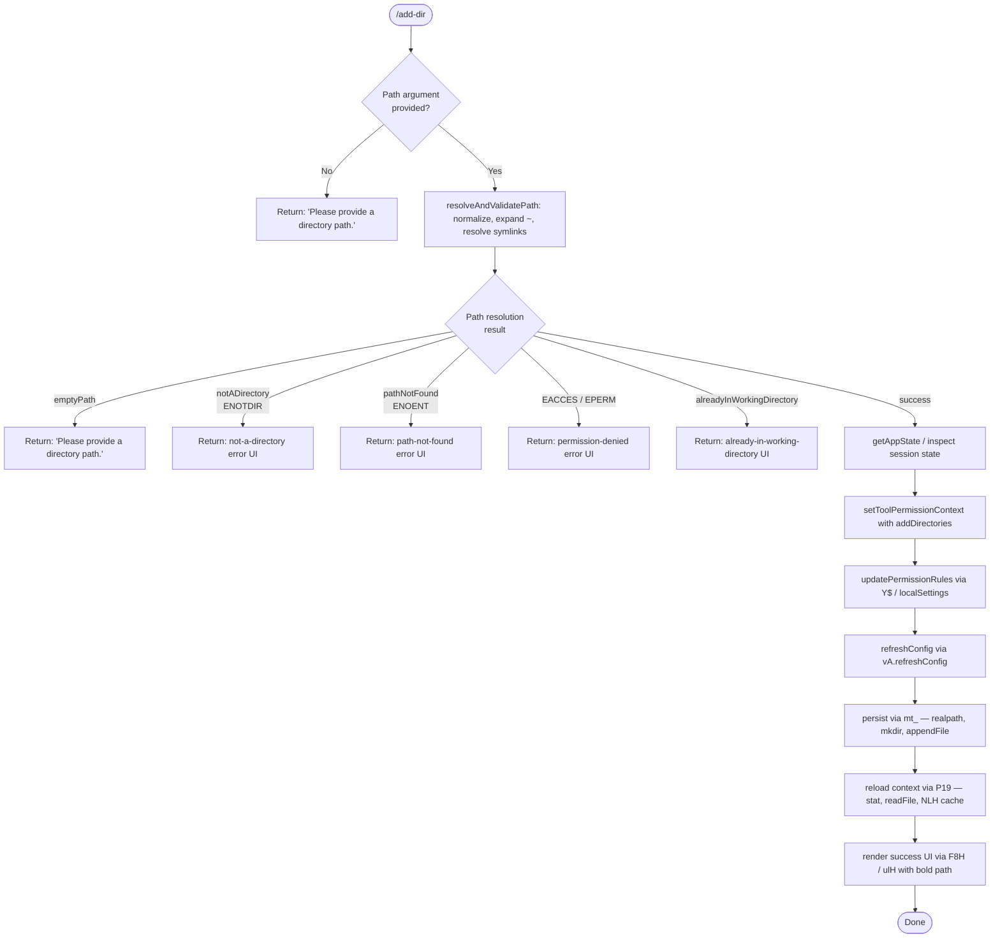

# `/add-dir`

> Analysis basis: CC v2.1.161 bundle.js (AST extraction + Claude interpretation)
> Minimum version: v2.1.161

---

## Overview

`/add-dir` adds a new working directory to the current Claude Code session. It accepts a filesystem path as its argument, validates and resolves that path, then registers it in the application's working-directory list and refreshes the tool-permission context accordingly. The command provides JSX-rendered feedback reflecting the outcome (success, duplicate, error, etc.).

---

## Registration

| Field | Value |
|---|---|
| type | `local-jsx` |
| name | `add-dir` |
| description | `Add a new working directory` |
| argumentHint | `<path>` |
| module_id | `uh1` |
| load_inline | `true` |
| loc_byte | `10826969` |
| loc_byte_end | `10827117` |
| arbor_handler.name | `f7f` |
| arbor_handler.fqn | `claude-2.1.161::f7f` |
| arbor_handler.kind | `AsyncFunction` |
| arbor_handler.resolution_path | `module_id` |
| arbor_handler.n_hits | `0` |

Analysis basis: CC v2.1.161 bundle.js:+10826969

---

## Input Branching

The command produces at least six distinct outcome branches based on path validation and state checks, so a Mermaid flowchart is used.



Analysis basis: CC v2.1.161 bundle.js:+10825750, +3822423, +3822521, +3822666, +3822791, +3822867, +3822952

---

## Behavioral Spec

### 1. Main Handler (`f7f`)

The Arbor-resolved handler is `f7f` (AsyncFunction, resolved via `module_id`).

```
async function addDirHandler(userInput, appContext):
    rawPath = userInput.argument   // the <path> token

    // Step 1 — retrieve session state
    sessionState = getSessionStateContext(appContext)   // C_ → H.getAppState
    workingDirEntry = sessionState.findLast("working_directory")
    allowedTools    = sessionState.findLast("allowed_tools")
    disallowedTools = sessionState.findLast("disallowed_tools")

    // Step 2 — validate and resolve the path
    resolvedResult = resolveAndValidatePath(rawPath)    // xlH → Pq

    if resolvedResult.status != "success":
        return renderErrorUI(resolvedResult.status, resolvedResult.detail)

    resolvedPath = resolvedResult.path

    // Step 3 — check for duplicate
    if resolvedPath already in workingDirEntry.addDirectories:
        return renderAlreadyPresent(resolvedPath)

    // Step 4 — update tool-permission context
    setToolPermissionContext({
        addDirectories: [resolvedPath],
        localSettings:  currentLocalSettings
    })                                                  // _.setToolPermissionContext

    // Step 5 — update permission rules
    updatePermissionRules(appContext)                   // Y$ (addRules / replaceRules / removeRules)

    // Step 6 — persist configuration
    persistDirectoryConfig(resolvedPath)                // mt_ → PL.realpath, PL.mkdir, PL.appendFile

    // Step 7 — reload context file cache
    reloadContextCache(appContext)                      // P19 → q1 (stat, readFile, NLH cache)

    // Step 8 — fire daemon config-reload side effect
    daemonConfigReload()                                // D → Z.stop/updateConfig/start

    // Step 9 — render outcome
    return renderSuccessUI(resolvedPath)                // F8H / ulH → w6.bold, w6.dim
```

Analysis basis: CC v2.1.161 bundle.js:+10825750, +10825860, +10825892, +10825944, +10825963, +10825970, +10826004

---

### 2. Path Resolution and Validation (`resolveAndValidatePath` — `xlH` → `Pq`)

```
function resolveAndValidatePath(rawPath):
    if rawPath is empty or null:
        return { status: "emptyPath" }

    path = rawPath.trim()

    if path contains null bytes:
        raise TypeError("Path contains null bytes")

    // Expand home directory shorthand
    if path.startsWith("~/"):
        homedir = os.homedir()
        path = join(homedir, path.slice(2))

    // Normalize and make absolute
    path = normalize(path)
    if not isAbsolute(path):
        path = resolve(cwd, path)

    // Platform adjustment (Windows drive letters etc.)
    path = applyPlatformNormalization(path)   // zI → nD (toLowerCase for windows)

    // Filesystem stat check
    try:
        stats = fs.stat(path)
    catch error:
        if error.code == "ENOTDIR":
            return { status: "notADirectory" }
        if error.code == "ENOENT":
            return { status: "pathNotFound" }
        if error.code in ["EACCES", "EPERM"]:
            return { status: "accessDenied" }
        return { status: "unknown", detail: error.message }

    if not stats.isDirectory():
        return { status: "notADirectory" }

    return { status: "success", path: path }
```

Analysis basis: CC v2.1.161 bundle.js:+3822442, +3822476, +3822521, +3822611, +3822626, +3822640, +3822666, +1009393, +1009456, +1009503, +1009616, +1009670

---

### 3. Session State Retrieval (`C_`)

```
function getSessionStateContext(appContext):
    state = appContext.getAppState()
    entry = state.findLast(item => item.type == "session")

    // Extracts sub-fields used downstream:
    //   "working_directory", "allowed_tools", "disallowed_tools",
    //   "avoid_prompts", "session", "effort", "model",
    //   "max_thinking_tokens", "flag_settings"
    return entry
```

Relevant string literals found: `"working_directory"`, `"allowed_tools"`, `"disallowed_tools"`, `"avoid_prompts"`, `"session"`, `"effort"`, `"model"`, `"max_thinking_tokens"`, `"flag_settings"`.

Analysis basis: CC v2.1.161 bundle.js:+10823513, +10823593, +10823618, +10823673, +10823728, +10823789

---

### 4. Permission Context Update (`Y$`)

```
function updatePermissionRules(rules, appContext):
    // Handles addRules, replaceRules, removeRules, removeDirectories
    // Validates against bypassPermissions mode guard:
    //   if mode == "bypassPermissions" and disableBypassPermissionsMode:
    //       log warning "Ignoring permission update: setMode …"
    //       return

    for rule in rules.allow:
        applyRule("alwaysAllowRules", rule)
    for rule in rules.deny:
        applyRule("alwaysDenyRules", rule)
    // ask rules go to "alwaysAskRules"
    persistRuleSet(appContext)
```

Analysis basis: CC v2.1.161 bundle.js:+4722402, +4722424, +4722490, +4722951, +4722991, +4723016, +4722766, +4723114, +4723771, +4724155

---

### 5. Configuration Persistence (`mt_`)

```
async function persistDirectoryConfig(resolvedPath):
    environment = readEnvironment()   // "production" vs "test"
    if environment == "test":
        skip persistence

    realPath = fs.realpath(resolvedPath)
    configDir = path.join(configBase, path.dirname(...))
    fs.mkdir(configDir, { recursive: true })

    // Write UTF-8 content (max line budget: 448 bytes / 384 bytes limits observed)
    fs.appendFile(configFilePath, serializedEntry, "utf8")

    // Log errors via yH → ri.logError
```

Numeric limits found: `448` (bundle.js:+13034722), `384` (bundle.js:+13034789).

Analysis basis: CC v2.1.161 bundle.js:+10825963, +13034397, +13034426, +13034510, +13034680, +13034689, +13034761

---

### 6. Context Cache Reload (`P19`)

```
async function reloadContextCache(appContext):
    // Clear stale NLH entries
    clearCacheEntries()   // Fj → NLH.delete

    // For each tracked context path:
    for contextPath in appContext.contextPaths:
        fullPath = path.join(base, contextPath)
        try:
            stats = fs.stat(fullPath)
        catch:
            removeFromCache(contextPath)
            continue

        rawContent = fs.readFile(fullPath)
        parsed = parseJSON(rawContent)   // m6 → JSON.parse
        updateCache(contextPath, parsed, stats.order, stats.stateOrder)

    // Emit transient-read telemetry
    emit("tengu_bg_state_read_transient")
```

Analysis basis: CC v2.1.161 bundle.js:+4140778, +4140796, +4140961, +4137303, +4137388, +4137401, +4137751

---

### 7. Result Rendering (`F8H`, `ulH`)

```
function renderSuccessUI(resolvedPath):
    // Bold-formatted path line
    boldLine = w6.bold(resolvedPath)
    // Dim hint for permissions management
    dimHint  = w6.dim("· /permissions to manage")
    return JSX layout combining boldLine and dimHint

function renderErrorUI(status, detail):
    switch status:
        case "emptyPath":
            return "Please provide a directory path."
        case "notADirectory":
            return not-a-directory error message
        case "pathNotFound":
            return path-not-found error message
        case "alreadyInWorkingDirectory":
            return already-present message
        default:
            return "Unknown error" + detail
```

The literal `"Did not add a working directory."` appears at bundle.js:+10826451 and is used as a fallback title in error cases. The literal `"· /permissions to manage"` at bundle.js:+10826315 is part of the success footer hint.

Analysis basis: CC v2.1.161 bundle.js:+10826004, +10826022, +10826207, +10826308, +10826315, +10826451, +3822867, +3822952

---

### 8. CLI Flag Alias

The literal `"--add-dir"` (bundle.js:+10825974) indicates the command is also accessible as a CLI flag `--add-dir`, passed via `P19` as part of the startup argument processing pipeline.

Analysis basis: CC v2.1.161 bundle.js:+10825974

---

## State & Side Effects

| Item | Detail |
|---|---|
| Telemetry: `tengu_feature_sad` | Fired on feature-error path inside `t6` / `h1H` (bundle.js:+966732) |
| Telemetry: `tengu_daemon_config_reload` | Fired after daemon config is updated via `D` (bundle.js:+15918997) |
| Telemetry: `tengu_bg_state_read_transient` | Fired when background state is read transiently during context-cache reload via `q1` (bundle.js:+4137751) |
| appState changes | Adds new entry to `addDirectories` list; updates `localSettings` |
| Tool permission context | `_.setToolPermissionContext` called with updated `addDirectories` array (bundle.js:+10825860) |
| Config file write | `PL.appendFile` writes resolved path to config file on disk (bundle.js:+13034761) |
| Config refresh | `vA.refreshConfig` is called to propagate changes to the running session (bundle.js:+10825944) |
| Daemon lifecycle | Daemon is stopped (`Z.stop`), config updated (`Z.updateConfig`), then restarted (`Z.start`) (bundle.js:+15918592–15918619) |
| NLH cache | Context-file cache (`NLH`) is cleared and rebuilt during `P19` execution |
| Sound | <!-- TODO: not found in depth-2 traversal; needs --depth 4 --> |
| Hook registration | <!-- TODO: not found in depth-2 traversal; needs --depth 4 --> |

---

## Version History

| Version | Change |
|---|---|
| v2.1.161 | Initial analysis |

---

## Common Mistakes

1. **Omitting the path argument** — running `/add-dir` with no argument returns `"Please provide a directory path."` immediately; always supply a `<path>`.
2. **Providing a file path instead of a directory** — the command validates via `fs.stat` and rejects non-directory paths with a `notADirectory` error.
3. **Providing a path that is already registered** — the command detects duplicates via the `alreadyInWorkingDirectory` check and will not add the directory a second time.
4. **Using a path with insufficient permissions** — `EACCES` or `EPERM` errors result in a permission-denied UI response; ensure the process has read access to the target directory.
5. **Expecting immediate tool-list changes without a permission review** — after `/add-dir` succeeds, use `/permissions` to manage allowed/denied tools for the new directory, as indicated by the `"· /permissions to manage"` hint in the success UI.
6. **Providing a non-existent path** — the command returns a `pathNotFound` result; the directory must exist before it can be added.

---

## Appendix — Identifier Mapping

> For bundle debugging only. Identifiers change across versions.

| Identifier | Role |
|---|---|
| `f7f` | Main handler for `/add-dir` (AsyncFunction, Arbor-resolved) |
| `C_` | Session state retrieval helper (reads `getAppState`, `findLast`) |
| `H` | App-state / bootstrap fetch module |
| `N` | Path normalisation / string sanitisation utility |
| `VBK` | Internal path-component validator |
| `SH` | JSON serialisation wrapper (`JSON.stringify`) |
| `Z4` | Path segment extractor (replace, lastIndexOf, slice) |
| `imH` | Path import helper (`GJA`) |
| `IBK` | File-reading / byte-length measurement utility |
| `s$` | Secondary state getter |
| `ne` | Permission-set membership check (`WA4.has`) |
| `Ij` | String replacement helper |
| `lq` | Model-alias resolution pipeline |
| `xHH` | Model normalisation sub-step |
| `s9` | Model string canonicalisation (trim, toLowerCase, replace) |
| `xP` | Model alias wrapper |
| `t6` | Feature-error reporter (emits `tengu_feature_sad`) |
| `d` | Generic debug/log utility |
| `h1H` | Feature-error inner logger (`Xa8`) |
| `A` | Session/file object (various map/close/stat operations) |
| `f` | File or stream object |
| `q` | Queue or stream object |
| `L` | Lifecycle set (add/delete/finally) |
| `BN8` | Allowed-tools state updater (`tA`) |
| `tA` | Tools-list merge helper |
| `FN8` | Disallowed-tools state updater (`tA`) |
| `Y$` | Permission-rules update dispatcher (addRules, replaceRules, removeRules) |
| `bM` | Rule escape/serialiser (`KM4`) |
| `KM4` | Backslash-escape replacer (`replaceAll`) |
| `K` | Rule-set collection (filter/has/map) |
| `ek` | Existence/enabled check |
| `D` | Daemon / supervisor lifecycle manager (stop/updateConfig/start) |
| `BWH` | Error-code inspector (`ENOENT` branch) |
| `$1` | Async-local-storage store getter (`yRL.getStore`) |
| `v8` | Logging / output sink |
| `MKA` | Error mapper (`fKA`) |
| `TH` | String coercion wrapper |
| `H9K` | Key-width calculator (`Object.keys`, `Math.max`) |
| `G` | Keyboard/event handler (stop propagation, `remoteControlAtStartup`) |
| `b` | Event object |
| `m0` | Config-load orchestrator (`l_`) |
| `l_` | Full settings-load pipeline (userSettings, projectSettings, flagSettings) |
| `Z` | Daemon instance (stop/updateConfig/start methods) |
| `USK` | Heartbeat helper (`h6H`) |
| `h6H` | Heartbeat sender |
| `V` | Secondary daemon or watcher instance |
| `lK6` | Initialization flag or loader |
| `mt_` | Configuration persistence handler (realpath, mkdir, appendFile) |
| `QWH` | Environment resolver (`production`/`test`) |
| `pH` | String formatter |
| `P4K` | Test-environment path helper |
| `Qb` | Config-check utility |
| `xO` | Unicode normalisation wrapper (`NFC`) |
| `k8` | Existence / truthy-value checker |
| `tS` | Yes/on flag parser (`XN`) |
| `XN` | Boolean-string recogniser |
| `P_` | Path formatter / printer |
| `yH` | Log-error router (`ri.logError`) |
| `a_` | Error-to-string converter |
| `r9` | Retry / queue helper (`qkA`) |
| `qkA` | Queue-item formatter |
| `s44` | Shift-and-push buffer manager |
| `P19` | Context-cache reload orchestrator (`q1`, `W5`) |
| `Fj` | Cache-entry deleter (`NLH.delete`) |
| `q1` | Per-path stat/readFile/NLH cache updater |
| `df` | Debug log wrapper (`v8`) |
| `m6` | JSON-parse wrapper |
| `W5` | Config-write helper (`t3`, `w2.join`, `SH`) |
| `t3` | Atomic file writer (randomBytes, writeFile, rename, copyFile, unlink) |
| `F8H` | JSX result renderer (success/error UI) |
| `QT_` | UI layout component |
| `s59` | Tool-list diff / context builder |
| `fP6` | File-path item builder (`m8`) |
| `m8` | Context item factory (`xd6`, `TQ`) |
| `zgL` | Path-context resolver (`BO`, `R$`, `F6`, `mX`) |
| `BO` | File object builder (`jOH`, `TQ`) |
| `R$` | Real-path resolver (`realpathSync`) |
| `F6` | Flag / feature-check helper |
| `mX` | File-metadata accessor (`ai`) |
| `wgL` | Additional context builder |
| `o3` | Rule-text formatter (`fM4`, `uT`, `MM4`, `LM4`) |
| `fM4` | Rule-item constructor |
| `uT` | Object-hasOwn guard |
| `MM4` | Rule-name formatter |
| `LM4` | Rule-text replacer (`replaceAll`) |
| `M` | Plugin/tool-name validator (`nC6`, `f.has`, `w0.rm`) |
| `nC6` | Plugin-name normaliser (replace, toLowerCase, isAbsolute, relative) |
| `xlH` | Path-resolution entry point (`XK8.resolve`, `Pq`, `u69.stat`) |
| `Pq` | Core path parser (trim, homedir expand, normalize, resolve, isAbsolute) |
| `h6` | Context store reader (`sg6`, `P_`) |
| `sg6` | Async-local-storage context getter (`ag6.getStore`, `ji`) |
| `xo` | Path fallback formatter (`P_`) |
| `zI` | Platform-aware path adjuster (Windows `/var/` → `/tmp$1`, toLowerCase) |
| `i4A` | Drive-letter / path-separator handler (`i6`, `DV`) |
| `nD` | Case-normalisation helper (`toLowerCase`) |
| `te` | Terminal path component helper |
| `ulH` | Success-UI renderer (`w6.bold`, `XK8.dirname`) |

---

Note: index built via Arbor fallback; some signals (telemetry, literals) may be missing — see arbor-fallback.js.