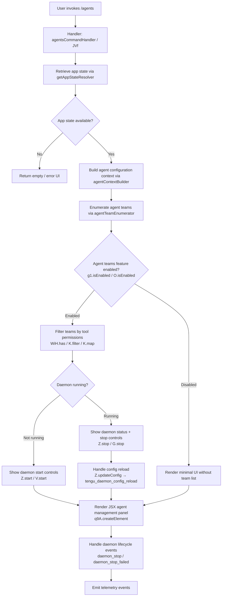

# `/agents`

> Analysis basis: CC v2.1.161 bundle.js (AST extraction + Claude interpretation)
> Minimum version: v2.1.161

---

## Overview

The `/agents` command provides a management interface for agent configurations within Claude Code. It renders a JSX-based UI component that allows users to inspect and manage agent teams, daemon lifecycle (start/stop), configuration reloading, and session state. The command is registered as a `local-jsx` type, meaning its output is a rendered UI panel rather than plain text.

---

## Registration

| Field | Value |
|---|---|
| type | `local-jsx` |
| name | `agents` |
| description | `Manage agent configurations` |
| loc_byte | `12447857` |
| loc_byte_end | `12447982` |
| loc_line | `8758` |
| module_id | `pe1` |
| load_inline | `true` |
| arbor_handler.name | `JVf` |
| arbor_handler.fqn | `claude-2.1.161::JVf` |
| arbor_handler.kind | `AsyncFunction` |
| arbor_handler.resolution_path | `module_id` |
| arbor_handler.n_hits | `0` |

Analysis basis: CC v2.1.161 bundle.js:+12447857

---

## Input Branching

The `/agents` command involves multiple distinct branches: app-state retrieval, agent-team enumeration, feature-flag gating, daemon control (stop/start/reload), and tool-permission filtering. A Mermaid flowchart is used to represent the primary execution paths.



---

## Behavioral Spec

### Top-Level Handler

The primary handler `agentsCommandHandler` (bundle identifier: `JVf`) is an `AsyncFunction` resolved via the `module_id` path (`pe1`). It is the entry point for all `/agents` invocations.

```
async function agentsCommandHandler(input):
    appState = getAppStateResolver(input)           // C_ → H.getAppState
    agentContext = buildAgentContext(appState)       // mv
    jsxElement = createElement(agentContext)         // q9A.createElement
    return jsxElement
```

Analysis basis: CC v2.1.161 bundle.js:+12447708

---

### App State Resolution

The `appStateResolver` function (bundle identifier: `C_`) retrieves the current application state and searches for the most recent relevant entry.

```
function appStateResolver(context):
    state = H.getAppState(context)
    lastEntry = A.findLast(state.entries)           // findLast for recency
    workingDir = state["working_directory"]         // literal at +10823618
    allowedTools = state["allowed_tools"]           // literal at +10823673
    disallowedTools = state["disallowed_tools"]     // literal at +10823728
    avoidPrompts = state["avoid_prompts"]           // literal at +10823789
    sessionInfo = state["session"]                  // literal at +10824088
    effortLevel = state["effort"]                   // literal at +10824113
    modelName = state["model"]                      // literal at +10824126
    maxThinkingTokens = state["max_thinking_tokens"]// literal at +10824138
    flagSettings = state["flag_settings"]           // literal at +10824164

    if bootstrapNeeded:
        log("[Bootstrap] Fetching")                 // literal at +15504122
        // HTTP fetch with Content-Type: application/json, User-Agent header
        // Timeout: 5000 ms                         // literal at +15504313
        // Emits: api_bootstrap_fetch               // literal at +15504434
        // On parse failure: "parse_failed"         // literal at +15504456

    configSnapshot = buildConfigSnapshot(state)    // BN8, FN8 → tA
    return configSnapshot
```

Analysis basis: CC v2.1.161 bundle.js:+10823513

---

### Agent Context Builder

The `agentContextBuilder` function (bundle identifier: `mv`) assembles the full data model for the agent management UI by collecting all relevant sub-components.

```
function agentContextBuilder(appState):
    // Resolve connection type (cli / remote)
    connectionType = resolveConnectionType()        // c0 → pH, v1, j6
    // Values: "cli" (literal +4764071), "remote" (literal +4764082)

    // Build team list push structure
    teamEntries = []
    teamEntries.push(buildSupervisorEntry())        // D.push, literal "supervisor" +15918204

    // Collect React component variants
    componentA = buildComponentVariantA()           // Cn_ → hX1, v_
    componentB = buildComponentVariantB()           // cP → fL8, y19, a0_, hbL
    toolFilter = buildToolFilter()                  // $qH → H.filter, dv6
    agentBundler = buildAgentBundler()              // bn_ → GC, eH6, v_
    teamEntry = buildTeamEntry()                    // X4 → i6, R1H

    // Enumerate z-stack (daemon + session control)
    z = []
    z.push(daemonStopHandler)                       // hH → d, h1H; literal "daemon_stop" +15940447
    z.push(daemonStopFailedHandler)                 // RH → d, h1H; literal "daemon_stop_failed" +15940484
    z.push(daemonLifecycleManager)                  // ly → gx, Ed.push, sVH, rw_

    // Daemon shutdown sequence
    shutdownSequence = buildShutdownSequence()      // qp → Promise.race, Promise.all, Gd, vd, n8
    // process.exit called on completion            // qp → process.exit +15935615
    // Timeout: 500 ms                              // literal +15935576

    // Run-session builder
    runSession = buildRunSession()                  // rs → X4, sP, pw, pH, A86, Cn_, F9, er7, Ho7, bn_, v21, gI

    // Feature flags
    featureEnabled = A.has(state) && K.some(flags) // mv +9739113, +9739141
    isEnabled_g1 = g1.isEnabled()                   // mv +9739164
    isEnabled_O = O.isEnabled()                     // mv +9739294

    // Filter agents by tool narrowing
    filteredAgents = K.filter(agents, WiH.has)      // mv +9739240, +9739255
    mappedAgents = K.map(filteredAgents, ...)        // mv +9739283

    // Connection check
    hasIncludes = $.includes(state)                 // mv +9739381

    return {
        connectionType, teamEntries, z,
        shutdownSequence, runSession,
        featureEnabled, filteredAgents,
        mappedAgents
    }
```

Analysis basis: CC v2.1.161 bundle.js:+9738746

---

### Model / Connection Resolution

The model resolution function (bundle identifier: `s9`) normalizes and resolves model aliases.

```
function resolveModelAlias(rawInput):
    trimmed = rawInput.trim().toLowerCase()
    // Model aliases recognized:
    // "opusplan" (literal +2236154)
    // "[1m]"     (literal +2236180)
    // "sonnet"   (literal +2236195)
    // "haiku"    (literal +2236234)
    // "opus"     (literal +2236273)
    // "best"     (literal +2236310)
    normalized = applyReplacements(trimmed)         // A.replace, _.replace
    validated = validateModel(normalized)           // NKH, aN, CgH, KG, Xwq, UM, Us6, bgH
    return validated
```

Analysis basis: CC v2.1.161 bundle.js:+2236058

---

### Tool Permission Filtering

The tool-filter function (bundle identifier: `$qH`) narrows the active tool list against session-level permissions.

```
function buildToolFilter(agentState):
    filtered = H.filter(agentState.tools, tool => {
        isDenied = tool.kind === "deny"             // literal "deny" +10532189
        isBlocked = tool.status === "blocked"       // literal "blocked" +9738148
        isCliArg = tool.source === "cliArg"         // literal "cliArg" +10532775
        isNarrowing = tool.mode === "toolsNarrowing"// literal "toolsNarrowing" +10532796
        return !(isDenied || isBlocked)
    })
    flatMapped = R5H.flatMap(filtered)              // HN8.flatMap +10532112
    result = buildToolResult(flatMapped)            // $s_ → Ft8, i56, GR
    return result
```

Analysis basis: CC v2.1.161 bundle.js:+9738087

---

### Agent Team Enumeration

The agent-bundler function (bundle identifier: `bn_`) collects and validates agent team configurations.

```
function buildAgentBundler(config):
    // Platform check: "windows" literal +4883178
    platformEntry = buildPlatformEntry(config)      // GC → i6, pH, v1, R1H, j6
    eventEntry = buildEventEntry(config)            // eH6
    componentEntry = buildComponentEntry(config)    // v_
    // Emits: tengu_cobalt_ridge at +4883272
    return { platformEntry, eventEntry, componentEntry }
```

Analysis basis: CC v2.1.161 bundle.js:+9738673

---

### Daemon Lifecycle Management

The daemon lifecycle manager (bundle identifier: `ly`) handles starting, stopping, and monitoring background agents.

```
function daemonLifecycleManager(daemonRef):
    graphState = gx(daemonRef)                      // gx → dR
    Ed.push(graphState)
    // Classify as "firstParty" (literal +3221563)
    sessionType = sVH(graphState)                   // sVH → cy
    eventId = rw_.randomUUID()                      // nw_.randomUUID +3221098
    enriched = NdH(eventId)                         // rw_ → NdH +3221145
    hU(enriched)                                    // rw_ → hU +3221173
    H.emit(enriched)                                // rw_ → H.emit +3221210
    // Emits: tengu_daemon_control at +15940522
    return enriched
```

The daemon stop path emits `"daemon_stop"` (literal +15940447) on success and `"daemon_stop_failed"` (literal +15940484) on failure, coordinated through `hH` and `RH` respectively.

Analysis basis: CC v2.1.161 bundle.js:+15940519

---

### Run-Session Builder

The run-session builder (bundle identifier: `rs`) constructs a runnable session object for an agent.

```
function buildRunSession(config):
    teamEntry = buildTeamEntry(config)              // X4 → i6, R1H
    sessionProvider = buildSessionProvider(config)  // sP → pH
    connectionProvider = buildConnectionProvider()  // pw → v1
    // SDK types recognized: "sdk-ts", "sdk-py", "sdk-cli", "local-agent"
    // literals at +5320698, +5320712, +5320726, +5320741
    agentTeamsFlag = "--agent-teams"                // literal +5447945

    // Standard / TST / TST-Auto routing
    // "standard" (literal +10110816), "tst" (literal +10110895), "tst-auto" (literal +10110945)
    routingMode = resolveRouting(config)             // gI → ur_ → hVH, RG1, GHf, pH, v1

    // Provider routing
    providerMap = resolveProvider(routingMode)       // PA → pH
    // Recognized providers: "bedrock" (+2049937), "foundry" (+2049987),
    // "anthropicAws" (+2050043), "mantle" (+2050097), "vertex" (+2050145)
    // Default API: "api.anthropic.com" (+2050828)

    // Vertex AI tool search note:
    // "[ToolSearch:optimistic] disabled: Vertex AI does not accept..." (+10111830)

    errorHandlers = { enter: er7, exit: Ho7 }       // OX1/JX1 → v_
    // Emits: tengu_amber_flint at +5448057

    return { teamEntry, sessionProvider, connectionProvider, routingMode, providerMap }
```

Analysis basis: CC v2.1.161 bundle.js:+9737443

---

### Feature / Workflow Gating

Feature flags and workflow permissions are checked before rendering the full agent panel.

```
function checkFeatureGates(state):
    // "allow_product_feedback" literal +4155678
    // "allow_workflows" literal +4156972
    // "pro" tier literal +4157418
    workflowEnabled = checkWorkflowPermission(state)// y19 → G9 → I19, ybL.has, qC, r9, Z4H, _J6
    // Emits: tengu_workflows_enabled at +4157173

    featureOk = checkFeatureOk(state)               // tengu_feature_ok at +966587
    featureSad = checkFeatureSad(state)             // tengu_feature_sad at +966732
    featureBad = checkFeatureBad(state)             // tengu_feature_bad at +966650
    // "pro" subscription check: SbL → pH, j6, v1, a9

    return { workflowEnabled, featureOk, featureSad, featureBad }
```

Analysis basis: CC v2.1.161 bundle.js:+4156645

---

### Supervisor / Config Reload

The supervisor entry (bundle identifier: `D`) manages the daemon configuration reload cycle.

```
function supervisorEntry(daemonHandle):
    writer = BWH(daemonHandle)                      // $1 → yRL.getStore, v8, MKA, TH, x9, fKA
    // On ENOENT: "ENOENT" literal +12786532
    columnKeys = Object.keys(writer)                // BWH +12786833
    maxWidth = H9K(columnKeys)                      // Object.keys, Math.max, GY
    paddedCols = K(columnKeys)                      // L.map, f.padEnd, "  " literal +15928365
    // column width: 40 (literal +15930336)

    daemonRef.stop()                                // G.stop +15918472
    daemonRef.updateConfig(newConfig)               // Z.updateConfig +15918601
    daemonRef.start()                               // Z.start, V.start +15918619, +15918777
    // USK → h6H: heartbeat literal "heartbeat" +15917425

    f.set(daemonHandle, writer)                     // +15918766
    // Emits: tengu_daemon_config_reload at +15918997
    return writer
```

Analysis basis: CC v2.1.161 bundle.js:+15918179

---

### Shutdown Sequence

The shutdown sequence (bundle identifier: `qp`) races a timeout against a full graceful shutdown.

```
async function shutdownSequence(daemonSet):
    result = await Promise.race([
        Promise.all(daemonSet.map(Gd)),             // Gd → I4H.shutdown +3220944
        timeoutPromise(500)                          // n8 → setTimeout, 500 ms literal +15935576
    ])
    // On abort: "aborted" literal +2286194, "abort" literal +2286272
    // L.unref() called on timeout handle           // n8 +2286460
    clearTimeout(handle)                            // vd → clearTimeout +3257962
    process.exit(code)                              // qp +15935615
```

Analysis basis: CC v2.1.161 bundle.js:+15935534

---

### Daemon Status File

The daemon status is read from a JSON file named `"daemon.status.json"` (literal +12601802). The status path is assembled by `daemonStatusPath` (`Fh6` → `k_K.join`, `r8`).

```
function readDaemonStatus():
    statusPath = joinPath(baseDir, "daemon.status.json")  // Fh6 → k_K.join +12601788
    raw = readFile(statusPath)                             // r8 +12601797
    parsed = JSON.parse(raw)                               // SH → JSON.stringify used for serialization
    timestamp = Date.now()                                 // y_K +12601914
    storeContext = yRL.getStore()                          // $1 +4004509
    return { parsed, timestamp, storeContext }
```

Analysis basis: CC v2.1.161 bundle.js:+12601899

---

## State & Side Effects

| Item | Detail |
|---|---|
| Telemetry: `tengu_feature_ok` | Emitted when feature gate check passes (bundle.js:+966587) |
| Telemetry: `tengu_feature_sad` | Emitted on degraded feature state (bundle.js:+966732) |
| Telemetry: `tengu_feature_bad` | Emitted on feature gate failure (bundle.js:+966650) |
| Telemetry: `tengu_slate_harbor` | Emitted during connection-type resolution (bundle.js:+4764101) |
| Telemetry: `tengu_daemon_config_reload` | Emitted when daemon configuration is reloaded (bundle.js:+15918997) |
| Telemetry: `tengu_workflows_enabled` | Emitted when workflow permission is confirmed (bundle.js:+4157173) |
| Telemetry: `tengu_cobalt_ridge` | Emitted during agent-bundler platform classification (bundle.js:+4883272) |
| Telemetry: `tengu_daemon_control` | Emitted on daemon lifecycle transitions (bundle.js:+15940522) |
| Telemetry: `tengu_amber_flint` | Emitted during run-session agent-team routing (bundle.js:+5448057) |
| Bootstrap HTTP fetch | `Content-Type: application/json`, `User-Agent` header, 5000 ms timeout; event `api_bootstrap_fetch` |
| Daemon status file | Reads `daemon.status.json` from the base directory |
| Daemon lifecycle | `stop()`, `updateConfig()`, `start()` calls on the daemon handle; heartbeat maintenance |
| Process exit | `process.exit()` called at end of graceful shutdown sequence |
| Random UUID generation | `nw_.randomUUID()` used during daemon lifecycle event creation |
| appState changes | Reads `working_directory`, `allowed_tools`, `disallowed_tools`, `avoid_prompts`, `session`, `effort`, `model`, `max_thinking_tokens`, `flag_settings` |
| JSX rendering | Produces a `local-jsx` panel via `q9A.createElement` |
| Tool narrowing | Filters tools tagged `"deny"`, `"blocked"`, `"cliArg"`, `"toolsNarrowing"` |
| Sound | <!-- TODO: not found in depth-2 traversal; needs --depth 4 --> |

---

## Version History

| Version | Change |
|---|---|
| v2.1.161 | Initial analysis |

---

## Common Mistakes

1. **Expecting plain text output**: `/agents` is registered as `local-jsx`, so it renders an interactive UI panel, not a text response. Piping the output to text processing tools will not behave as expected.
2. **Assuming synchronous execution**: The handler `JVf` is an `AsyncFunction`. Callers must await its result; the daemon lifecycle and bootstrap fetch are both asynchronous operations.
3. **Ignoring tool-permission filtering**: Agents are filtered against `WiH.has` and the `"deny"`/`"blocked"` tool lists before being presented. A tool not appearing in the UI may simply be filtered out rather than absent from configuration.
4. **Missing provider routing**: The run-session builder distinguishes among `"standard"`, `"tst"`, and `"tst-auto"` routing modes, and separately among `"bedrock"`, `"foundry"`, `"anthropicAws"`, `"mantle"`, and `"vertex"` providers. Mismatching these can cause silent routing fallback to `api.anthropic.com`.
5. **Vertex AI tool search**: When using the Vertex provider, the optimistic tool-search feature is automatically disabled unless `ENABLE_TOOL_SEARCH=true` is set; this is logged but does not raise an error.
6. **Daemon shutdown timing**: The graceful shutdown races against a hard 500 ms timeout before calling `process.exit`. Any daemon teardown logic exceeding this window will be abandoned.

---

## Appendix — Identifier Mapping

> For bundle debugging only. Identifiers change across versions.

| Identifier | Role |
|---|---|
| `JVf` | Top-level agents command handler (AsyncFunction, arbor_handler) |
| `C_` | App state resolver — reads working dir, tools, session, model fields |
| `H` | App state / config host object (getAppState, includes, replace, trim) |
| `N` | Config normalization function — handles debug mode, content hashing |
| `VBK` | Sub-config builder called within normalization |
| `SH` | JSON serialization helper (calls JSON.stringify) |
| `Z4` | String replacement / slice utility for config keys |
| `imH` | GJA-delegating helper within config normalization |
| `IBK` | File I/O helper — dirname, byteLength, Buffer operations |
| `s$` | Secondary state accessor |
| `ne` | WA4.has-based membership check |
| `Ij` | String replacement utility (H.replace) |
| `lq` | Model alias resolution entry point |
| `xHH` | Inner model resolution — NT, o9H, VA, nQ |
| `s9` | Full model alias normalizer (trim, toLowerCase, replace chain) |
| `xP` | Model resolution wrapper (calls s9, b0) |
| `t6` | Feature flag evaluator (calls d, h1H) |
| `d` | Low-level feature flag primitive |
| `h1H` | Feature flag helper (calls Xa8) |
| `A` | General array/string host object (findLast, toLowerCase, close, map) |
| `f` | File handle / stream object (close, get, set, delete, padEnd) |
| `q` | Set / queue object (close, write, unlinkSync, at, includes) |
| `L` | Set lifecycle manager (add, finally, delete) |
| `BN8` | Config snapshot builder A (calls tA) |
| `FN8` | Config snapshot builder B (calls tA) |
| `tA` | Shared config snapshot finalizer |
| `mv` | Agent context builder — orchestrates all sub-components |
| `pH` | String coercion / primitive builder (calls String) |
| `c0` | Connection-type resolver (cli / remote) |
| `QQ` | Connection-type constant holder |
| `v1` | String primitive constructor (calls String) |
| `j6` | Deduplication / caching registry (QDH, aw_, BY6, CU) |
| `gY6` | Registry getter A |
| `QY6` | Registry getter B |
| `Qx` | Registry lookup with pH fallback |
| `Lq8` | Registry add/get with ow_, Hj_ side effects |
| `y6` | Dated entry builder (Date.now, bXL) |
| `D` | Supervisor / daemon writer pipeline |
| `BWH` | Daemon writer constructor ($1, v8, MKA, TH, x9, fKA) |
| `$1` | Async store accessor (yRL.getStore) |
| `v8` | Writer field populator |
| `MKA` | Writer helper (calls fKA) |
| `TH` | String coercion helper for writer |
| `K` | Column formatter (L.map, f.padEnd) |
| `H9K` | Column width calculator (Object.keys, Math.max, GY) |
| `G` | Daemon stop controller (preventDefault, m0, D, H) |
| `m0` | User settings updater (calls l_, "userSettings") |
| `Z` | Daemon handle (stop, updateConfig, start methods) |
| `USK` | Heartbeat manager (calls h6H) |
| `h6H` | Heartbeat implementation |
| `V` | Secondary daemon/session handle (start method) |
| `Cn_` | Component variant builder A (hX1, v_) |
| `v_` | ESModule export initializer (_U8, ib6, rb6, FRK, rOA) |
| `rb6` | Bound callback registered in v_ |
| `cP` | Component variant builder B (fL8, y19, a0_, hbL) |
| `fL8` | Form/field layout builder (pH, ZT) |
| `ZT` | Layout primitive |
| `y19` | Workflow permission checker entry |
| `G9` | Inner workflow checker (I19, ybL, qC, r9, Z4H, _J6) |
| `a0_` | Subscription/pro tier resolver (SbL) |
| `SbL` | Pro-tier entry builder (pH, j6, v1, a9) |
| `hbL` | Alternate layout builder (calls ZT) |
| `$qH` | Tool filter builder (H.filter, dv6) |
| `dv6` | Tool filter delegator (R5H, $s_, zI1) |
| `R5H` | Tool flat-map expander (HN8.flatMap, o3) |
| `$s_` | Tool result builder (Ft8, i56, GR) |
| `zI1` | Tool filter finalizer |
| `bn_` | Agent bundler orchestrator (GC, eH6, v_) |
| `GC` | Platform-specific agent entry builder (i6, pH, v1, R1H, j6) |
| `X4` | Team entry builder (i6, R1H) |
| `z` | Daemon + session z-stack array |
| `hH` | Daemon stop success handler (d, h1H; "daemon_stop") |
| `RH` | Daemon stop failure handler (d, h1H; "daemon_stop_failed") |
| `ly` | Daemon lifecycle manager (gx, Ed, sVH, rw_) |
| `gx` | Graph state builder (calls dR) |
| `sVH` | Session type classifier ("firstParty") |
| `rw_` | Lifecycle event emitter (randomUUID, NdH, hU, H.emit) |
| `qp` | Graceful shutdown orchestrator (Promise.race, Promise.all, process.exit) |
| `Gd` | Individual daemon shutdown initiator (I4H.shutdown) |
| `vd` | Timeout canceller (clearTimeout, Zj_) |
| `n8` | Timeout promise factory (setTimeout, Error, clearTimeout, L.unref) |
| `rs` | Run-session builder |
| `sP` | Session provider builder (calls pH) |
| `pw` | Connection provider builder (calls v1) |
| `A86` | Run-session auxiliary helper |
| `F9` | Agent-teams flag handler (pH, QH7, j6; "--agent-teams") |
| `QH7` | Flag value resolver |
| `er7` | Session enter handler (OX1, v_) |
| `Ho7` | Session exit handler (JX1, v_) |
| `gI` | Routing mode resolver (ur_, N, PA, l7) |
| `ur_` | Routing inner resolver (hVH, RG1, GHf, pH, v1) |
| `PA` | Provider route mapper (calls pH; bedrock/foundry/anthropicAws/mantle/vertex) |
| `l7` | Routing finalizer |
| `v4` | Feature version checker |
| `O` | Feature flag object (isEnabled, u8) |
| `u8` | Feature flag backing store |
| `$` | Session includes checker (y_K) |
| `y_K` | Session state enricher (Zr, Date.now, $1, Fh6, SH) |
| `Zr` | Session state base builder (hKH) |
| `Fh6` | Daemon status path builder (k_K.join, r8; "daemon.status.json") |