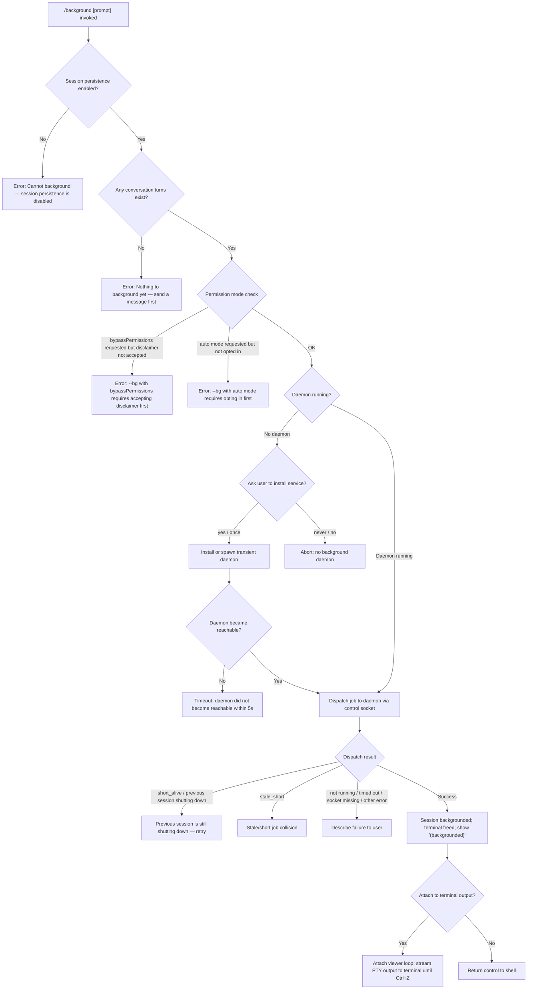

# `/background`

> Analysis basis: CC v2.1.161 bundle.js (AST extraction + Claude interpretation)
> Minimum version: v2.1.161

---

## Overview

`/background` (alias `/bg`) sends the current interactive Claude Code session to a background daemon process and frees the terminal for other use. It packages the current session state, dispatches a job to the background daemon, and — if necessary — installs or spawns the daemon on first use. An optional `[prompt]` argument may be supplied to seed the backgrounded session with an immediate task.

---

## Registration

| Field | Value |
|---|---|
| type | `local-jsx` |
| name | `background` |
| description | `Send this session to the background and free the terminal` |
| aliases | `["bg"]` |
| argumentHint | `[prompt]` |
| immediate | `null` |
| module_id | `XKK` |
| load_inline | `true` |
| loc_byte | `12939875` |
| loc_byte_end | `12940115` |
| loc_line | `9543` |
| arbor_handler.name | `rRf` |
| arbor_handler.fqn | `claude-2.1.161::rRf` |
| arbor_handler.kind | `AsyncFunction` |
| arbor_handler.resolution_path | `module_id` |
| arbor_handler.n_hits | `0` |

Analysis basis: CC v2.1.161 bundle.js:+12939875

---

## Input Branching

The command has more than three distinct decision paths depending on session persistence state, daemon availability, permission mode, and current session activity. A Mermaid flowchart is used below.



Analysis basis: CC v2.1.161 bundle.js:+12935212, +12939297, +12939473, +12932693, +12932855, +12919910

---

## Behavioral Spec

### Top-level handler (`rRf`)

The Arbor-resolved handler is `rRf` (AsyncFunction, `claude-2.1.161::rRf`). It is the entry point for the `/background` command.

```
async function backgroundCommandHandler(context):
    // Guard 1: persistence must be enabled
    if not sessionPersistenceEnabled(context):
        display error "Cannot background — session persistence is disabled..."
        return

    // Guard 2: session must have at least one turn
    if conversationIsEmpty(context):
        display error "Nothing to background yet — send a message first."
        return

    // Guard 3: permission-mode compatibility checks (lRf)
    validatePermissionModeForBackground(context)
    // raises descriptive error if bypassPermissions or auto mode gating fails

    // Build dispatch descriptor (kn)
    jobDescriptor = buildBackgroundJobDescriptor(context)
    //   - generate UUID (first 8 chars) for job ID
    //   - resolve shell type ("shell")
    //   - build argument list (uRf): resume token, session-id, prompt, flags
    //   - write dispatch file to jobs directory

    // Ensure daemon is running (Kg)
    daemonHandle = await ensureDaemonRunning(context)
    //   - if service binary stale: telemetry tengu_bg_daemon_service_stale_exec, fall back to transient spawn
    //   - if no daemon at all: ask user "Install as a service now? [y/N/never, or 'once' just for now]"
    //     - "yes"/"once": install or spawn; telemetry tengu_bg_daemon_cold_start_ask_answer
    //     - "never": abort
    //   - poll for reachability with 30 s / 60 s timeout
    //   - if unreachable: tengu_bg_daemon_service_poll_fallthrough / tengu_bg_daemon_transient_unreachable

    // Dispatch job to daemon (H4A → _k8 / qz)
    dispatchResult = await dispatchToDaemon(jobDescriptor, daemonHandle)
    //   - connect to control socket
    //   - write dispatch message "cli-bg-dispatch"
    //   - await ack within 6000 ms timeout
    //   - handle errors: EALIVE (collision), ESTALE, ESTARTING, ENOCONN

    // Handle dispatch errors (uRf / S6H)
    if dispatchResult is error:
        mapErrorToUserMessage(dispatchResult)
        // short_alive  → "Previous session is still shutting down — try again in a moment"
        // stale_short  → stale/short job collision message
        // not_running  → "not running"
        // timed_out    → "timed out"
        // socket missing → "socket missing"
        // service still starting → "service still starting"
        // dispatch-write failure → "couldn't write dispatch file"
        // EALIVE collision → "id collision with a prior job"
        telemetry tengu_background_spawn_failed
        return

    // Success path
    telemetry tengu_background
    display "(backgrounded)" marker
    releaseTerminal(context)
    // Optionally attach terminal viewer (Y95 / P) if caller requests
```

Analysis basis: CC v2.1.161 bundle.js:+12939216, +12939228, +12939264, +12939282, +12939434, +12939543

---

### Permission-mode pre-flight check (`lRf`)

```
function validatePermissionModeForBackground(args, settings):
    // Check for "--permission-mode bypassPermissions" in arg list
    if "--permission-mode" in args and next token is "bypassPermissions":
        if not disclaimerAccepted(settings):
            throw "--bg with bypassPermissions requires accepting the disclaimer first. " +
                  "Run `claude --dangerously-skip-permissions` once interactively."

    // Check for "--permission-mode auto" without prior opt-in
    permMode = resolvePermissionMode(args, settings)
    if permMode == "auto" and not autoModeOptedIn(settings):
        throw "--bg with auto mode requires opting in first. " +
              "Run `claude --permission-mode auto` once interactively."
```

Analysis basis: CC v2.1.161 bundle.js:+12932450, +12932490, +12932693, +12932855

---

### Background job descriptor builder (`uRf` / `kn`)

```
function buildBackgroundJobDescriptor(context):
    sessionId = currentSessionId(context)
    jobId     = randomUUID().slice(0, 8)        // 8-char hex prefix
    workDir   = resolveWorkdir(context)

    // Create jobs directory: <configDir>/jobs/<jobId>/tmp
    mkdir("<configDir>/jobs/<jobId>")

    // Assemble CLI argument list for daemon worker process
    args = [
        "--agent",
        "--name", sessionName,
        "--resume=<sessionId>",             // or "-r=<id>"
    ]

    // Propagate relevant flags from current invocation (uRf):
    //   --fork-session, --session-id, -c / --continue
    //   --allowed-tools, --disallowed-tools, --model, --effort
    //   --add-dir, --reply-on-resume
    //   permission-mode flags

    // Propagate relevant env vars:
    //   CLAUDE_CONFIG_DIR, CLAUDE_INTERNAL_FC_OVERRIDES,
    //   ANTHROPIC_MODEL, AWS_REGION, AWS_DEFAULT_REGION,
    //   AWS_PROFILE, GOOGLE_APPLICATION_CREDENTIALS,
    //   GOOGLE_CLOUD_PROJECT, GCLOUD_PROJECT

    // Determine launch mode (exec / bg / fleet / spare)
    launchMode = determineLaunchMode(context)   // literals: "exec", "bg", "fleet", "spare"

    // Write dispatch file as JSON (JSON.stringify) to jobs directory
    writeDispatchFile(jobId, args, workDir, launchMode)

    return { jobId, args, workDir, launchMode }
```

Analysis basis: CC v2.1.161 bundle.js:+12915493, +12915558, +12915595, +12915618, +12915628, +12915668, +12916057, +12933471

---

### Daemon ensure-running (`Kg`)

```
async function ensureDaemonRunning(context):
    telemetry tengu_bg_daemon_ensure_running   // literal "daemon_ensure_running"

    if daemonServiceBinaryIsStale():
        telemetry tengu_bg_daemon_service_stale_exec
        // log: "daemon service exec path is stale (binary deleted) — falling back to transient spawn"
        mode = "transient"

    status = checkDaemonStatus()              // "up" or absent
    if status == "up":
        return existingDaemonHandle

    // No running daemon
    if installMode == "ask":
        answer = prompt("Install as a service now? [y/N/never, or 'once' just for now] ")
        telemetry tengu_bg_daemon_cold_start_ask_answer
        if answer in ["yes", "once"]:
            installOrSpawnDaemon(context)
        elif answer == "never":
            abort("No background daemon is running. Run 'claude daemon install' to set it up as a persistent service.")
        // else: fall through to transient spawn

    // Spawn transient daemon if not installed
    spawnResult = spawnTransientDaemon(["run", "--origin", "--spawned-by", ...])
    if spawnResult.error == "EACCES":
        telemetry tengu_bg_daemon_spawn_failed
        throw spawn failed error

    // Poll for reachability (30 000 ms initial / 60 000 ms extended)
    reachable = await pollDaemonReachable(timeouts: [30000, 60000])
    if not reachable:
        telemetry tengu_bg_daemon_service_poll_fallthrough
        telemetry tengu_bg_daemon_transient_unreachable
        throw "service installed but the daemon did not become reachable within 5s — check 'claude daemon status'"

    return newDaemonHandle
```

Analysis basis: CC v2.1.161 bundle.js:+12874168, +12874228, +12874276, +12874306, +12874349, +12875196, +12875645, +12876004, +12876026

---

### Dispatch to daemon (`H4A`)

```
async function dispatchToDaemon(jobDescriptor, daemonHandle):
    // Create unique socket path for this dispatch
    socketPath = join(configDir, "cli-bg-dispatch", randomBytes(…))

    // Connect to daemon control socket via IPC (qz / _k8)
    socket = await connectControlSocket(daemonHandle.socketPath)
    socket.setTimeout(6000)   // 6-second ack timeout

    // Send dispatch command with job descriptor JSON
    socket.write(JSON.stringify({ type: "dispatch", ...jobDescriptor }))

    // Await acknowledgement
    ackResult = await waitForAck(socket, timeout: 6000)
    if ackResult.code == "EALIVE":   // collision with existing job
        return { error: "EALIVE" }
    if ackResult.code == "ESTALE":
        return { error: "ESTALE" }
    if ackResult.code == "ESTARTING":
        return { error: "ESTARTING" }

    // After 200 ms post-ack grace (literal 200)
    await sleep(200)
    return { success: true, jobId: jobDescriptor.jobId }
```

Analysis basis: CC v2.1.161 bundle.js:+12911262, +12911347, +12911358, +12911503, +12911544, +12911584, +12912158, +12912285

---

### Session list / status helper (`SR8`)

`SR8` is the component that enumerates active background sessions and formats their status for display (used by `/bg` list sub-command and the post-dispatch status line).

```
function listBackgroundSessions():
    sessions = Array.from(sessionMap.values())   // collect all live job entries
    // Filter by Boolean(session) to drop stale entries
    // Format each session: pad name to 40 chars, 2-space separator
    //   columns: id, state, name
    // States visible in literals: "idle", "blocked", "user", "working", "active", "running"
    return formattedTable
```

Analysis basis: CC v2.1.161 bundle.js:+12935212, +12935250, +12935447, +12935654, +15930336, +15928365

---

### Attach / terminal viewer loop (`Y95`)

After a successful dispatch the command may attach the terminal to the backgrounded session's PTY output, streaming it back until the user detaches with Ctrl+Z.

```
async function attachToBackground(jobId, daemonHandle):
    telemetry tengu_bg_attach

    // Connect attach socket
    attachSocket = await connectAttachSocket(daemonHandle, jobId)

    // Attach phases:
    // "starting" → display "Session is starting — it will appear once ready. Ctrl+Z to detach"
    // "adopted"  → session adopted by supervisor
    // Stall detection: tengu_bg_attach_stall_ms if PTY silent for too long
    //   → "Waiting for session to redraw… Ctrl+Z to detach"
    //   → if stall_gave_up: tengu_bg_attach_stall_gave_up → restart worker
    //   → tengu_bg_attach_stall_respawn

    loop:
        event = readDaemonEvent(attachSocket)
        switch event.type:
            "snapshot"   → repaint terminal from PTY snapshot
            "stream"     → write PTY data to stdout
            "state"      → update local session state
            "settled"    → session reached stable state
            "resize"     → handle terminal resize
            "EKICKED"    → "Session opened in another window" → exit loop
            "ENOJOB"     → "job not found — it may have already exited" → exit loop
            Ctrl+Z       → detach without killing job

    releaseTerminal()
```

Analysis basis: CC v2.1.161 bundle.js:+15896557, +15897039, +15897073, +15897099, +15897172, +15897514, +15898832, +15894220

---

## State & Side Effects

| Item | Detail |
|---|---|
| Telemetry — primary | `tengu_background` (success), `tengu_background_spawn_failed` (dispatch error), `tengu_background_already_bg` (session already in background) |
| Telemetry — daemon lifecycle | `tengu_bg_daemon_cold_start_ask`, `tengu_bg_daemon_cold_start_ask_answer`, `tengu_bg_daemon_service_stale_exec`, `tengu_bg_daemon_install`, `tengu_bg_daemon_service_poll_fallthrough`, `tengu_bg_daemon_spawn_failed`, `tengu_bg_daemon_ensure_running` |
| Telemetry — dispatch | `tengu_bg_dispatch`, `tengu_bg_dispatch_fallback`, `tengu_bg_dispatch_rescued`, `tengu_bg_dispatch_sigkill_escalate`, `tengu_bg_dispatch_stale_drop`, `tengu_bg_dispatch_low_mem` |
| Telemetry — attach | `tengu_bg_attach`, `tengu_bg_attach_legacy_autorespawn`, `tengu_bg_attach_stall_ms`, `tengu_bg_attach_stall_gave_up`, `tengu_bg_attach_stall_respawn`, `tengu_bg_attach_kick` |
| Telemetry — spare pool | `tengu_bg_spare_enable`, `tengu_bg_spare_claim`, `tengu_bg_spare_claim_fail`, `tengu_bg_sendclaim_failed` |
| Telemetry — other | `tengu_bg_low_mem_mb`, `tengu_bg_proto_mismatch`, `tengu_bg_state_read_transient`, `tengu_daemon_yield`, `tengu_daemon_idle_exit`, `tengu_daemon_config_reload`, `tengu_daemon_control`, `tengu_scheduled_task_fire`, `tengu_scheduled_task_expired` |
| Filesystem side effects | Creates `<configDir>/jobs/<jobId>/` directory; writes dispatch file; may write to `<configDir>/tmp`; reads/writes `daemon.status.json` |
| Daemon install | Optionally installs a persistent OS service (macOS/Linux); prompts user interactively if first use |
| IPC | Connects to the daemon control socket (`cli-bg-dispatch` channel); sends dispatch JSON; awaits ack |
| appState changes | Frees the terminal; transitions UI state to `(backgrounded)` |
| Process signals | Daemon spawn path may send SIGKILL during escalation (`tengu_bg_dispatch_sigkill_escalate`) |
| Sound | None observed in call graph |

---

## Version History

| Version | Change |
|---|---|
| v2.1.161 | Initial analysis |

---

## Common Mistakes

1. **Running `/background` before sending any message** — the command guards against empty sessions and returns "Nothing to background yet — send a message first." Users must have at least one completed turn.
2. **Using `--permission-mode bypassPermissions` non-interactively without prior acceptance** — the disclaimer must be accepted once via `claude --dangerously-skip-permissions` in an interactive session before `/bg` can be used with that permission mode.
3. **Using `--permission-mode auto` without prior opt-in** — similarly, auto mode must be activated interactively once with `claude --permission-mode auto`.
4. **No daemon running and answering "never" to the install prompt** — answering "never" to the service-install prompt permanently suppresses the offer; the session cannot be backgrounded until `claude daemon install` is run manually.
5. **Running `/background` when session persistence is disabled** — some embedded or SDK-driven configurations disable persistence; the command will always fail in such environments.
6. **Detaching via Ctrl+Z does not kill the background job** — it only disconnects the terminal viewer; the session continues running in the daemon.

---

## Appendix — Identifier Mapping

> For bundle debugging only. Identifiers change across versions.

| Identifier | Role |
|---|---|
| `rRf` | Main `/background` command handler (AsyncFunction; Arbor-resolved) |
| `SR8` | Background session list / status formatter |
| `RR8` | JSX render helper for background command output |
| `kn` | Background job descriptor builder (creates job dir, assembles CLI args) |
| `lRf` | Permission-mode pre-flight validator |
| `uRf` | Argument list assembler for daemon worker process |
| `H4A` | Dispatch-to-daemon orchestrator |
| `Kg` | Daemon ensure-running (installs/spawns/polls daemon) |
| `JS6` | Daemon service installer sub-routine |
| `_k8` | Low-level control socket connection (IPC connect + event loop) |
| `qz` | Control socket write/read protocol handler |
| `eCH` | Dispatch file path resolver |
| `qKK` | Dispatch ack/timeout state machine |
| `tKA` | Dispatch error classifier / user message mapper |
| `Y95` | Attach / terminal viewer loop (PTY streaming) |
| `D95` | Attach stall detector and respawn trigger |
| `z95` | Attach stall metric helper |
| `XOA` | Background job lifecycle manager (done/killed/stopped/crashed states) |
| `DOA` | Spare worker claim sender |
| `W9` | Daemon-worker identity resolver |
| `B5H` | Detach-request handler |
| `kR1` | Daemon task type classifier |
| `Mt` | Daemon write helper |
| `QWH` | Background command environment builder |
| `P4K` | Dispatch file writer |
| `Qb` | Dispatch file content serialiser |
| `SR8` | Session enumeration and display |
| `NT` | Session map accessor |
| `DM` | Session filter helper |
| `O4A` | Feature-gate check for background command |
| `a4` | Feature flag resolver |
| `Y9` | Feature flag registrar |
| `u7` | Flush-timeout utility (2000 ms, literal "flush timeout") |
| `eG` | Session-state accessor |
| `yn` | Argument token slicer |
| `YKK` | Resume-flag parser (`--resume=`, `-r=`) |
| `iRf` | Permission-set membership checker |
| `dRf` | Fork-session flag parser |
| `wKK` | Session-id flag parser |
| `jKK` | Continue-flag parser |
| `GZ` | Spare-pool mode resolver |
| `h6` | Logger / debug output helper |
| `sg6` | Async-storage-backed logger |
| `P_` | Platform capability checker |
| `q1` | Job state reader |
| `W5` | Job state writer |
| `t3` | Atomic file writer (randomBytes temp + rename) |
| `Fj` | Job state cache invalidator |
| `P8H` | Working/active state resolver |
| `Z4` | Path extension stripper |
| `_KK` | Session name formatter |
| `TH` | String coercer |
| `xRf` | Shell command builder (cmd.exe / /bin/sh) |
| `qQ6` | Platform shell resolver |
| `cRf` | Session-id flag injector |
| `H4A` | Full dispatch pipeline (daemon connect → ack → cleanup) |
| `Kg` | Daemon poller / installer orchestrator |
| `tKA` | Path-bearing argument formatter |
| `_k8` | IPC socket lifecycle (connect/on/once/unref) |
| `eCH` | Dispatch directory path builder |
| `qKK` | Ack state machine with Date.now timestamps |
| `n8` | Abortable timer utility |
| `Fg` | Daemon status JSON reader |
| `jz` | Background service error wrapper |
| `dDH` | Amber-anchor telemetry emitter |
| `pRf` | Dispatch status categoriser |
| `S6H` | User-facing error message mapper |
| `h4H` | Background service error display component |
| `TK6` | Reply-on-resume flag injector |
| `Y` | Forced-shutdown / process.exit wrapper |
| `WJ` | Session abort trigger |
| `z` | Daemon stop orchestrator |
| `hH` | Feature-ok telemetry emitter |
| `h1H` | Feature telemetry base emitter |
| `RH` | Feature-bad telemetry emitter |
| `ly` | Daemon control event dispatcher |
| `gx` | Daemon control socket path resolver |
| `sVH` | First-party shutdown handler |
| `rw_` | Daemon control event emitter |
| `qp` | Daemon shutdown sequencer (Promise.race + process.exit) |
| `Gd` | IPC shutdown caller |
| `vd` | Timeout-clearing shutdown helper |
| `P` | PTY frame reader / buffer parser |
| `J` | PTY byte-stream accumulator |
| `w` | Background session worker manager |
| `S` | Daemon write-to-PTY helper |
| `ER8` | Low-memory telemetry emitter |
| `rj6` | Allowed-tools file reader |
| `yH` | MCP server update applicator |
| `B` | Session retry/settle tracker |
| `j6` | File-watch context manager |
| `DOA` | Spare-worker claim sender |
| `XOA` | Job state transition handler |
| `v8` | Debug/verbose logger |
| `C` | Rate-limit event dispatcher |
| `e5` | PTY end-of-stream handler |
| `Y95` | Full attach-to-background implementation |
| `w95` | PTY write helper within attach loop |
| `M` | Plugin path safety checker |
| `nC6` | Plugin name normaliser |
| `jOA` | Attach socket message dispatcher |
| `WSK` | Attach message throttle / backpressure controller |
| `X` | Terminal repaint dispatcher |
| `j` | Worker kill enumerator |
| `h` | Terminal scroll/focus state tracker |
| `lfA` | Vim-mode state machine (operator/find/indent etc.) |
| `se` | Context-file scanner |
| `sz` | Realpath resolver |
| `Mx` | Directory stat helper |
| `iE` | Recursive directory reader |
| `xL4` | File line scanner |
| `z95` | Stall-millisecond measurer |
| `u` | PTY write timer |
| `b` | Attach stall interval handle |
| `bqH` | Attach phase display component |
| `D95` | Stall-triggered respawn orchestrator |
| `I` | Away-summary rate-limit checker |
| `FG8` | App state getter for away-summary |
| `yH5` | Away-summary cache params accessor |
| `UTK` | Away-summary throttle helper |
| `A38` | Away-summary turn generator |
| `Jk1` | Away-summary UUID generator |
| `a` | Voice recording state accessor |
| `E` | MCP server state holder |
| `m` | Attach interval clearer |
| `o` | MCP pending-update processor |
| `MB` | Async iterable mapper |
| `H_6` | MCP version integer parser |
| `Cv8` | MCP capability integer parser |
| `HH` | Voice max-duration cap handler |
| `G3A` | MCP server reconnect orchestrator |
| `l` | Scheduled-task dispatcher |
| `BP6` | Scheduled-task time-window checker |
| `of8` | Scheduled-task slot calculator |
| `lVK` | Scheduled-task boolean guard |
| `Ve` | Feature-flag set membership checker |
| `c8H` | Scheduled-task eligibility filter |
| `_b6` | Attach snapshot write helper |
| `eS` | Extra-dirs flag builder |
| `t26` | Model-flag injector |
| `WkH` | Effort-flag injector |
| `CA6` | Full REPL turn executor |
| `ut_` | REPL turn timestamp recorder |
| `WK6` | REPL watchdog timer |
| `oPf` | Agent turn runner |
| `W_H` | AbortController factory |
| `t0` | Main agent query loop |
| `GT8` | App-state mutation handler |
| `TT8` | Post-turn state reconciler |
| `Rh` | Random-bytes generator wrapper |
| `fqH` | Feature-gate query before turn |
| `Nm` | Subagent exit reason classifier |
| `RI6` | Tombstone / special-message type checker |
| `hqH` | Hook-agent invocation helper |
| `gN8` | Streaming-idle-timeout setup |
| `xI1` | Tombstone inserter |
| `m7H` | Tool-deferred state updater |
| `K7f` | Fork-agent telemetry emitter |
| `C8` | AbortSignal + UUID bundler |
| `vd1` | User-message trimmer |
| `XR` | Input string trimmer |
| `vy8` | Message origin / type tagger |
| `jh` | Conversation message builder |
| `uK` | System-prompt composer |
| `FV8` | Tool schema builder / file hasher |
| `BV8` | Tool schema cache key builder |
| `xG` | Full tool-schema + context assembler |
| `RHf` | Tool result formatter |
| `xG1` | Tool schema file writer |
| `pH` | String coerce-to-string utility |
| `mbH` | Assistant response extractor |
| `Ur_` | Tool-schema push helper |
| `p7K` | Core API query function |
| `tX` | API client factory |
| `PA` | Provider-type resolver |
| `l7` | Base-URL builder |
| `pL_` | Auth-key extractor |
| `CgH` | Credential formatter |
| `EG` | Extra-headers builder |
| `hK` | Tool permission filter |
| `jO` | Compact-boundary marker resolver |
| `ON8` | Session-id extractor |
| `sj` | Compact boundary string builder |
| `aYH` | Session-state snapshot reader |
| `RR8` | Background command JSX renderer |
| `bB` | Array.isArray guard |
| `O` | Background session type switcher |
| `u8` | Background session UI component |
| `KN8` | Tool-name set membership checker |
| `xh` | Tool-schema hash checker |
| `Ql` | Tool-hash array validator |
| `yqH` | MCP tool-name prefix checker |
| `Q$` | Notification helper |
| `N6` | React element factory wrapper |
| `XN` | Base React element creator |
| `RF` | React fragment factory |