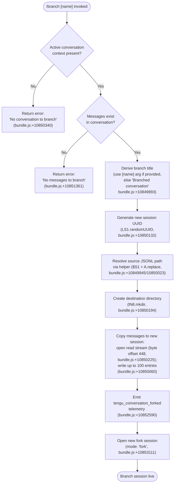

# `/branch`

> Analysis basis: CC v2.1.161 bundle.js (AST extraction + Claude interpretation)
> Minimum version: v2.1.161

---

## Overview

The `/branch` command creates a divergent copy of the current conversation at the point it is invoked — forking all messages up to that moment into a new, independent session. It optionally accepts a name argument used to title the branch. The underlying mechanism copies conversation history from the current session's storage file into a freshly created session directory, then launches that session.

---

## Registration

| Field | Value |
|---|---|
| type | `local-jsx` |
| name | `branch` |
| description | `Create a branch of the current conversation at this point` |
| argumentHint | `[name]` |
| module_id | `ct_` |
| load_inline | `true` |
| loc_byte | `12361126` |
| loc_byte_end | `12361303` |
| loc_line | `8645` |
| arbor_handler.name | `I7f` |
| arbor_handler.fqn | `claude-2.1.161::I7f` |
| arbor_handler.kind | `AsyncFunction` |
| arbor_handler.resolution_path | `module_id` |
| arbor_handler.n_hits | `0` |

Analysis basis: CC v2.1.161 bundle.js:+12361126

---

## Input Branching

The command has four distinct control-flow paths depending on presence of existing conversation data and message content, warranting a Mermaid flowchart.



---

## Behavioral Spec

### Top-Level Handler — `branchCommandHandler` (Arbor: `I7f`)

The handler is an `AsyncFunction` resolved via `module_id` → `ct_`.

```
async function branchCommandHandler(commandInput, appState):

    # 1. Guard: require active conversation
    currentConversation = lookupCurrentConversation(appState)
    if currentConversation is null:
        return errorResult("No conversation to branch")

    # 2. Guard: require at least one message
    messages = getMessagesFromConversation(currentConversation)
    if messages is empty:
        return errorResult("No messages to branch")

    # 3. Derive branch title
    branchName = commandInput.argument or "Branched conversation"
    title = sanitizeName(branchName)   # via $S1 / A.replace

    # 4. Prepare new session identity
    newSessionId = crypto.randomUUID()   # LS1.randomUUID
    newSessionPath = buildSessionPath(newSessionId)   # N6 / P_ helpers

    # 5. Locate source conversation file
    sourceFilePath = resolveSourcePath(currentConversation)   # $S1 + A.replace

    # 6. Create destination directory
    await fs.mkdir(newSessionPath, { recursive: true })

    # 7. Stream-copy messages
    readStream = fs.createReadStream(sourceFilePath, {
        encoding: "utf8",
        start: 448          # skip header region
    })
    lineInterface = readline.createInterface(readStream)
    linesWritten = 0
    writeStream = fs.createWriteStream(destinationFile)
    for each line in lineInterface:
        if linesWritten >= 100: break
        writeStream.write(line)
        linesWritten++
    await streamFinished(writeStream)

    # 8. Finalise metadata
    writeSessionMetadata(newSessionId, {
        title: title,
        type: "fork",
        parentId: currentConversation.id
    })

    # 9. Emit telemetry
    emit("tengu_conversation_forked")

    # 10. Launch branch
    openSession(newSessionId, mode="fork")
```

Analysis basis: CC v2.1.161 bundle.js:+10853375 (I7f entry), +10852394 (zS1 orchestration)

---

### Source-Path Resolution — `sourcePathResolver` (internal: `$S1`)

```
function sourcePathResolver(conversation):
    entry = _.find(allConversations, c => c.id == conversation.id)
    path  = entry.filePath.replace(pattern, replacement)
    return path
```

Analysis basis: CC v2.1.161 bundle.js:+10849945, +10850023

---

### New Session Scaffolding — `sessionScaffold` (internal: `OS1`)

Responsible for the actual file I/O pipeline:

```
async function sessionScaffold(params):
    { sourceFile, destDir, title, sessionId } = params

    # Verify source exists; throw "No conversation to branch" otherwise
    try:
        await verifyFile(sourceFile)
    catch ENOENT:
        throw Error("No conversation to branch")

    await fs.mkdir(destDir, { recursive: true })

    readStream  = fs.createReadStream(sourceFile, {
        encoding: "utf8",
        highWaterMark: 384,   # bundle.js:+10850435
        start: 448            # bundle.js:+10850225
    })
    writeStream = fs.createWriteStream(destFile)

    lineReader  = readline.createInterface({ input: readStream })
    count = 0
    lineReader.on("line", line => {
        if count >= 100: readStream.destroy(); return   # bundle.js:+10850060
        writeStream.write(line + "\n")
        count++
    })

    readStream.once("open", ...)   # bundle.js:+10850302
    await streamFinished(writeStream)

    writeSessionManifest(destDir, { title, type: "fork", id: sessionId })
    return sessionId
```

Analysis basis: CC v2.1.161 bundle.js:+10850194 through +10851757

---

### Fork Orchestrator — `forkOrchestrator` (internal: `zS1`)

Coordinates `sessionScaffold`, name sanitisation, and launch:

```
async function forkOrchestrator(rawName, conversationContext):

    sanitizedTitle = sanitizeTitle(rawName)   # via ZN / eq helpers
    sessionId = await sessionScaffold(...)

    # Determine name mode
    titleMode = rawName ? "custom-title" : "auto"    # bundle.js:+10852544, +13061772

    writeConversationLog(sessionId, titleMode, sanitizedTitle)   # JS / m5H

    emit("tengu_conversation_forked")   # bundle.js:+10852590

    openNewSession({ id: sessionId, mode: "fork" })   # bundle.js:+10853111
```

Analysis basis: CC v2.1.161 bundle.js:+10852286 through +10853119

---

### Completion Suggestion Provider — `completionProvider` (internal: `fn` / `N7f`)

Provides autocomplete candidates for the optional `[name]` argument:

```
function completionProvider(partialInput, appState):
    worktrees = listGitWorktrees(appState)   # VbH → "worktree" prefix scan
    # bundle.js:+12061302, "--porcelain" bundle.js:+12061320

    existing = listExistingSessionTitles()
    filtered = existing.filter(t => t.toLowerCase().startsWith(partialInput.toLowerCase()))
    sorted   = [...worktrees, ...filtered].sort(localeCompare)

    # Deduplicate via Set (K.add / K.has, bundle.js:+10852158, +10852211)
    return deduped(sorted).slice(0, maxCompletions)
```

Analysis basis: CC v2.1.161 bundle.js:+10851963 (N7f entry), +10853375 (fn entry), +12061258 (VbH)

---

### Session Logging Helpers

#### `sessionTitleWriter` (internal: `JS`)

Writes a `custom-title` metadata entry to the conversation log.

Analysis basis: CC v2.1.161 bundle.js:+13061751; literal `"custom-title"` at +13061772

#### `agentNameWriter` (internal: `m5H`)

Writes an `agent-name` metadata entry when applicable.

Analysis basis: CC v2.1.161 bundle.js:+13064773; literal `"agent-name"` at +13064794

---

## State & Side Effects

| Item | Detail |
|---|---|
| Telemetry | `tengu_conversation_forked` (bundle.js:+10852590) — fired once per successful branch |
| Telemetry (infrastructure) | `tengu_session_renamed` (+13061864), `tengu_agent_name_set` (+13064892) — fired by session-metadata helpers reused here |
| New session directory | Created under CC data directory via `lN8.mkdir` (+10850194) |
| Source file read | Up to 100 lines copied from source JSONL; `start` offset 448 bytes (+10850225, +10850060) |
| Destination file written | New JSONL written at highWaterMark 384 bytes (+10850435) |
| Session manifest | Written with `type: "fork"` and derived title (+10853111) |
| appState changes | New session entry added to session roster; existing session unaffected |
| Sound | <!-- TODO: not found in depth-2 traversal; needs --depth 4 --> |
| Hook registration | `Y9` → `tYA.register` found in call graph (+59405); likely a process-exit cleanup hook to close open streams |

---

## Version History

| Version | Change |
|---|---|
| v2.1.161 | Initial analysis |

---

## Common Mistakes

1. **Invoking `/branch` with no active conversation** — the command will immediately return the error `"No conversation to branch"` (+10850340). Ensure at least one message exists in the current session.
2. **Expecting the branch to share future state with the parent** — the branch is a one-time snapshot copy; changes in either session are independent after forking.
3. **Names with special characters** — the `[name]` argument is sanitised through `ZN` / `eq` helpers (string replacement, +193134); special shell or path characters are escaped or stripped.
4. **Branching very long conversations** — only the first 100 lines of the source JSONL are copied (+10850060). Later messages will not appear in the branch.
5. **Assuming the branch title defaults to the argument exactly** — if no argument is supplied, the title defaults to the literal string `"Branched conversation"` (+10849893), not any summary of the conversation content.

---

## Appendix — Identifier Mapping

> For bundle debugging only. Identifiers change across versions.

| Identifier | Role |
|---|---|
| `I7f` | Top-level async handler for `/branch` (Arbor-resolved entry point) |
| `zS1` | Fork orchestrator — coordinates scaffolding, logging, launch |
| `OS1` | Session scaffolding — directory creation, file stream copy pipeline |
| `$S1` | Source-path resolver — locates source JSONL for current conversation |
| `N7f` | Completion candidate assembler — deduplicates and sorts suggestions |
| `fn` | Completion source builder — enumerates sessions and worktrees |
| `VbH` | Git worktree enumerator — parses `git worktree --porcelain` output |
| `k4K` | Filesystem autocomplete scanner — reads directories for tab-complete |
| `_xH` | Binary buffer builder — used in file-copy internals |
| `JS` | Session title logger — writes `custom-title` metadata entry |
| `CMH` | Conversation log append helper — low-level JSONL file writer |
| `m5H` | Agent-name metadata writer — writes `agent-name` entry |
| `oQ` | Conversation state persistence helper |
| `u36` | Atomic file read/write helper with locking |
| `Q$` | Session path builder helper |
| `a4` | Session directory utilities |
| `ZN` | String sanitiser — escapes special regex/path characters |
| `eq` | Substring extractor — index-of + slice helper |
| `N6` | Path join utility |
| `XN` | Path resolution utility |
| `P_` | Path helper (secondary) |
| `cv` | Conversation metadata builder |
| `wM` | Session metadata serialiser |
| `Gk` | Conversation state getter |
| `k8` | Error-code checker |
| `v8` | Error constructor helper |
| `yH` | Log-error dispatcher |
| `a_` | Error wrapper / String coercer |
| `pH` | String converter |
| `r9` | Telemetry queue helper |
| `qkA` | Telemetry payload builder |
| `s44` | Ring-buffer shift/push helper |
| `SH` | JSON stringify wrapper |
| `TH` | String cast helper |
| `df` | Error value wrapper |
| `lN8` | Filesystem `mkdir` / `unlink` binding |
| `cN8` | Filesystem `createReadStream` / `createWriteStream` binding |
| `fS1` | `readline.createInterface` binding |
| `MS1` | Stream `finished` promise binding |
| `LS1` | `crypto.randomUUID` binding |
| `dt_` | Event emitter `once` binding |
| `Y9` | Process-exit hook registrar (`tYA.register`) |
| `Z$` | Session roster lookup |
| `wO` | Working directory resolver |

---

Note: index built via Arbor fallback; some signals (telemetry, literals) may be missing — see arbor-fallback.js.