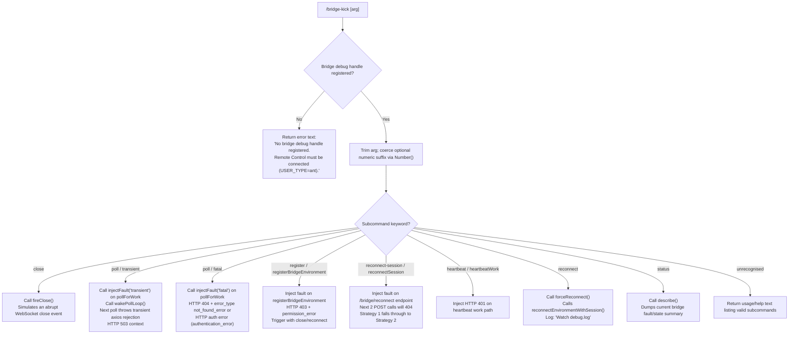

# `/bridge-kick`

> Analysis basis: CC v2.1.161 bundle.js (AST extraction + Claude interpretation)
> Minimum version: v2.1.161

---

## Overview

`/bridge-kick` is a developer/QA diagnostic command that injects specific bridge failure states into a live Remote Control session, enabling manual testing of error recovery paths without requiring a real network fault. It is only operational when a bridge debug handle is registered (i.e., the process is running under `USER_TYPE=ant`), and it dispatches one of several distinct fault scenarios depending on a subcommand keyword supplied as its argument.

---

## Registration

| Field | Value |
|---|---|
| type | `local` |
| name | `bridge-kick` |
| description | Inject bridge failure states for manual recovery testing |
| supportsNonInteractive | `false` |
| load_inline | `true` |
| load_ident | `FVf` |
| loc_byte | `12471763` |
| loc_byte_end | `12471947` |
| arbor_handler.name | `FVf` |
| arbor_handler.fqn | `claude-2.1.161::FVf` |
| arbor_handler.kind | `AsyncFunction` |
| arbor_handler.resolution_path | `load_ident` |
| arbor_handler.n_hits | `0` |

Analysis basis: CC v2.1.161 bundle.js:+12471763

---

## Input Branching

The handler recognises **7 or more distinct subcommand branches** derived from the trimmed input string. A Mermaid flowchart is required.



Analysis basis: CC v2.1.161 bundle.js:+12469522 – +12471676

---

## Behavioral Spec

### Guard: Bridge Debug Handle Check

The very first action of the handler is to call `getBridgeDebugHandle()` (obfuscated: `WHK`). If the handle is absent (falsy), the command returns immediately with a static error message of type `"text"`:

> "No bridge debug handle registered. Remote Control must be connected (USER_TYPE=ant)."

Analysis basis: CC v2.1.161 bundle.js:+12469522, +12469546, +12469559

```
async function bridgeKickHandler(context):
    handle = getBridgeDebugHandle()
    if not handle:
        return { type: "text", content: NO_HANDLE_ERROR_MESSAGE }

    rawArg = context.userInput.trim()
    numericSuffix = Number(rawArg.split(" ").last())
    countArg = Number.isFinite(numericSuffix) ? numericSuffix : undefined

    subcommand = extractSubcommand(rawArg)
    dispatch(handle, subcommand, countArg)
```

Analysis basis: CC v2.1.161 bundle.js:+12469658, +12469709, +12469723

---

### Subcommand: `close`

Calls `handle.fireClose()`. This simulates an abrupt WebSocket / transport close event on the bridge connection, exercising the close-and-reconnect recovery path.

Analysis basis: CC v2.1.161 bundle.js:+12469694, +12469811

```
case "close":
    handle.fireClose()
    return confirmationMessage("Bridge close event fired.")
```

---

### Subcommand: `poll` — transient fault injection

Sets a one-shot transient fault on the `pollForWork` endpoint and immediately wakes the poll loop so the fault is consumed on the very next iteration.

- Fault type string: `"transient"` (bundle.js:+12469940)
- Fault scope: `"pollForWork"` (bundle.js:+12469981)
- Expected HTTP status on next poll: `503` (bundle.js:+12470019)
- Confirmation message: "Next poll will throw a transient (axios rejection). Poll loop woken." (bundle.js:+12470069)

```
case "poll", faultType="transient":
    handle.injectFault("pollForWork", "transient")
    handle.wakePollLoop()
    return confirmationMessage(TRANSIENT_CONFIRMATION)
```

Analysis basis: CC v2.1.161 bundle.js:+12469925, +12469940, +12469959, +12470033

---

### Subcommand: `poll` — fatal fault injection

Injects a fatal (non-recoverable) fault on the poll path. The injected error can surface as an HTTP `404` with `error_type = "not_found_error"` or as an `"authentication_error"`.

- HTTP 404 code (bundle.js:+12470269)
- `not_found_error` (bundle.js:+12470273)
- `authentication_error` (bundle.js:+12470291)
- Fault label: `"fatal"` (bundle.js:+12470363)

```
case "poll", faultType="fatal":
    handle.injectFault("pollForWork", "fatal", { statusCode: 404, errorType: "not_found_error" })
    return confirmationMessage(FATAL_CONFIRMATION)
```

Analysis basis: CC v2.1.161 bundle.js:+12470269, +12470273, +12470291, +12470363

---

### Subcommand: `register` / `registerBridgeEnvironment`

Injects a `403 permission_error` fault onto the next call to `registerBridgeEnvironment`. The fault is latched and consumed when the bridge attempts re-registration after a close or reconnect.

- Fault scope label: `"registerBridgeEnvironment"` (bundle.js:+12470569)
- HTTP status: `403` (bundle.js:+12470617)
- Error type: `"permission_error"` (bundle.js:+12470631)
- Confirmation: "Next registerBridgeEnvironment will 403. Trigger with close/reconnect." (bundle.js:+12470679)

```
case "register":
    handle.injectFault("registerBridgeEnvironment", { statusCode: 403, errorType: "permission_error" })
    return confirmationMessage(REGISTER_FAULT_CONFIRMATION)
```

Analysis basis: CC v2.1.161 bundle.js:+12470513, +12470569, +12470617, +12470631, +12470679

---

### Subcommand: `reconnect-session` / `reconnectSession`

Injects a `404` fault on the next **two** consecutive `POST /bridge/reconnect` calls. This exercises the multi-strategy reconnect logic: Strategy 1 fails and falls through to Strategy 2.

- Scope label: `"reconnectSession"` (bundle.js:+12471037)
- Alias: `"reconnect-session"` (bundle.js:+12470988)
- Fault count: `2` consecutive calls (bundle.js:+12471137)
- Confirmation: "Next 2 POST /bridge/reconnect calls will 404. doReconnect Strategy 1 falls through to Strategy 2." (bundle.js:+12471137)

```
case "reconnect-session":
    handle.injectFault("reconnectSession", { statusCode: 404, count: 2 })
    return confirmationMessage(RECONNECT_SESSION_FAULT_CONFIRMATION)
```

Analysis basis: CC v2.1.161 bundle.js:+12470988, +12471037, +12471137

---

### Subcommand: `heartbeat`

Injects an HTTP `401` error on the heartbeat work path (`heartbeatWork`).

- HTTP status: `401` (bundle.js:+12471272)
- Scope: `"heartbeatWork"` (bundle.js:+12471305)
- Alias: `"heartbeat"` (bundle.js:+12471242)

```
case "heartbeat":
    handle.injectFault("heartbeatWork", { statusCode: 401 })
    return confirmationMessage(HEARTBEAT_FAULT_CONFIRMATION)
```

Analysis basis: CC v2.1.161 bundle.js:+12471242, +12471272, +12471305

---

### Subcommand: `reconnect`

Calls `handle.forceReconnect()` directly, which internally calls `reconnectEnvironmentWithSession()`. The user is instructed to observe `debug.log` for the outcome.

- Method called: `forceReconnect()` (bundle.js:+12471538)
- Confirmation: "Called reconnectEnvironmentWithSession(). Watch debug.log." (bundle.js:+12471576)

```
case "reconnect":
    handle.forceReconnect()
    return confirmationMessage(RECONNECT_CONFIRMATION)
```

Analysis basis: CC v2.1.161 bundle.js:+12471519, +12471538, +12471576

---

### Subcommand: `status`

Calls `handle.describe()`, which returns a human-readable dump of active fault states and current bridge connection status.

- Method: `describe()` (bundle.js:+12471676)
- Subcommand label: `"status"` (bundle.js:+12471642)

```
case "status":
    summary = handle.describe()
    return { type: "text", content: summary }
```

Analysis basis: CC v2.1.161 bundle.js:+12471642, +12471676

---

## State & Side Effects

| Item | Detail |
|---|---|
| Telemetry | `tengu_feature_sad` (bundle.js:+966732) — fired from the call chain via `d` / `t6`; not directly in the core handler path |
| Hook registration | `tYA.register` called via `Y9` (bundle.js:+59405) — part of the logging/write subsystem reached through `IBK` |
| appState changes | No direct appState mutations observed in depth-2 traversal |
| Bridge debug handle | One-shot fault latches are written into the bridge debug handle object; consumed on next matching bridge operation |
| Poll loop | `wakePollLoop()` is called for transient poll faults, causing the pending poll interval timer to fire immediately |
| Sound | <!-- TODO: not found in depth-2 traversal; needs --depth 4 --> |
| File I/O | `IBK` call chain includes `Ay.appendFile`, `Ay.mkdir`, `Ay.rename`, `Ay.unlink`, `Ay.stat` — part of the logging subsystem (bundle.js:+203840–+203986) |
| Timer management | `WmH` manipulates `clearTimeout` / `setTimeout` / `setImmediate` (bundle.js:+58819–+59234) — part of the log-flush subsystem |

---

## Version History

| Version | Change |
|---|---|
| v2.1.161 | Initial analysis |

---

## Common Mistakes

1. **Running without `USER_TYPE=ant`**: The command silently fails with an error message if no bridge debug handle is registered. The handle is only installed when the Remote Control bridge is active, which requires the ant user type. Ensure the session was started under the correct user type.
2. **Confusing `reconnect` with `reconnect-session`**: `reconnect` triggers an immediate live reconnect call; `reconnect-session` pre-arms a two-hit 404 fault for the *next* reconnect attempt without triggering it. Using the wrong one will not exercise the intended code path.
3. **Forgetting to trigger the latched fault**: Subcommands like `register` and `reconnect-session` only *latch* a fault; the fault fires on the next qualifying bridge operation. Users must subsequently trigger a close or reconnect to consume the latched state and observe the error recovery behaviour.
4. **Misreading `status` output**: `status` calls `describe()` which returns the current fault latch state. An empty or clean status after a `/bridge-kick` means the fault has already been consumed by a prior bridge operation.
5. **Non-interactive sessions**: `supportsNonInteractive: false` — the command must not be invoked in scripted or piped (non-TTY) sessions; it is only valid in interactive terminal sessions.

---

## Appendix — Identifier Mapping

> For bundle debugging only. Identifiers change across versions.

| Identifier | Role |
|---|---|
| `FVf` | Main async handler for `/bridge-kick` (Arbor-resolved, load_ident path) |
| `WHK` | `getBridgeDebugHandle` — retrieves the bridge debug handle; returns null if not registered |
| `H` | Polymorphic utility / bootstrap fetch function (used in multiple contexts) |
| `N` | Command argument parser / subcommand dispatcher |
| `VBK` | Log level / verbosity routing helper |
| `HwA` | Log channel initialiser |
| `SH` | JSON serialisation wrapper around `JSON.stringify` |
| `_` | Context/state object (bridge handle or similar carrier) |
| `Z4` | Path / string normalisation utility |
| `CJA` | String segment mapper (calls `.map` on a string-parts array) |
| `q` | File unlink / cleanup helper (calls `wSK.unlinkSync`) |
| `A` | Lowercase filename normaliser |
| `imH` | Write-to-handle wrapper (calls `GJA` → `H.write`) |
| `GJA` | Raw stream write helper |
| `IBK` | Log-file write orchestrator (mkdir, appendFile, rotate, register) |
| `WmH` | Log-flush timer manager (clearTimeout / setTimeout / setImmediate) |
| `_3H` | Log entry formatter / joiner |
| `F6` | File path resolver helper |
| `d46` | EISDIR error classifier |
| `BJA` | Log file path builder (path.join + N6) |
| `UJA` | Log file rotation helper (stat / rename / unlink) |
| `NBK` | Bound log-append worker (mkdir → appendFile → rotate) |
| `Y9` | Hook/listener registrar (calls `tYA.register`) |
| `s$` | Session or state accessor |
| `ne` | Feature-flag check (calls `WA4.has`) |
| `Ij` | String replacement utility |
| `lq` | Model/provider resolution entry point |
| `xHH` | Model string parser (NT, o9H, VA, nQ branches) |
| `NT` | Model name token extractor |
| `o9H` | Model option flag parser |
| `nQ` | Anthropic model family classifier |
| `s9` | Model alias resolver (opusplan, sonnet, haiku, opus, best) |
| `x0` | Model key lookup (`kKH`) |
| `NKH` | Model variant inclusion checker (`vKH.includes`) |
| `aN` | Model tier resolver (calls UM, Vf) |
| `CgH` | Model capability resolver (calls Vf) |
| `KG` | First-party model builder (UM, Vf, PA, firstParty) |
| `Xwq` | Model alias expander (delegates to KG) |
| `UM` | Model object constructor (calls PA) |
| `Us6` | Model whitelist check (`wHL.includes`) |
| `bgH` | Model profile helper (calls pH) |
| `xP` | Model resolution pipeline (s9 → b0) |
| `b0` | Full model descriptor builder (wA, BHH, RzH, xgH, KG, sX, UM, PA, Vf, aN) |
| `t6` | Bootstrap telemetry / api_bootstrap_fetch event emitter |
| `d` | Core telemetry event emitter (`tengu_feature_sad` origin) |
| `h1H` | Bootstrap result handler (calls Xa8) |
| `Xa8` | Bootstrap completion callback |

---

Note: index built via Arbor fallback; some signals (telemetry, literals) may be missing — see arbor-fallback.js.