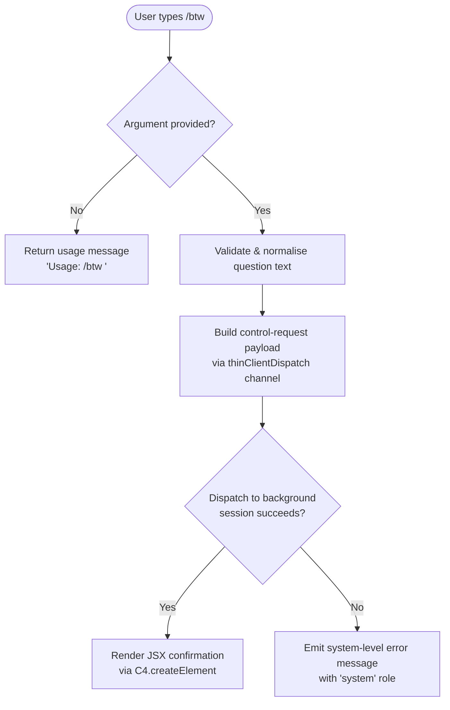

# `/btw`

> Analysis basis: CC v2.1.161 bundle.js (AST extraction + Claude interpretation)
> Minimum version: v2.1.161

---

## Overview

The `/btw` ("by the way") command lets the user inject a quick side question or remark into the active Claude Code session without fully interrupting the primary conversation thread. It is dispatched immediately as a `control-request` over the thin-client channel, meaning the question is routed through the daemon/background-session infrastructure rather than being appended as a normal user turn. The handler is an async function (`u7f`) resolved via the `wS1` module.

---

## Registration

| Field | Value |
|---|---|
| type | `local-jsx` |
| name | `btw` |
| description | Ask a quick side question without interrupting the main conversation |
| argumentHint | `<question>` |
| immediate | `true` |
| thinClientDispatch | `control-request` |
| module_id | `wS1` |
| load_inline | `true` |
| loc_byte | `10859334` |
| loc_byte_end | `10859573` |
| loc_line | `7132` |
| arbor_handler.name | `u7f` |
| arbor_handler.fqn | `claude-2.1.161::u7f` |
| arbor_handler.kind | `AsyncFunction` |
| arbor_handler.resolution_path | `module_id` |
| arbor_handler.n_hits | `0` |

Analysis basis: CC v2.1.161 bundle.js:+10859334

---

## Input Branching

Three distinct paths exist: no argument supplied (usage error), argument present with successful dispatch, and argument present but dispatch fails.



Analysis basis: CC v2.1.161 bundle.js:+10858930 (handler entry `u7f`), +10858932 (usage string), +10858971 (system role literal)

---

## Behavioral Spec

### 1. Argument Validation

```
async function handleBtw(context, args):
    question = args.trim()
    if question is empty:
        return systemMessage("Usage: /btw <your question>")
    proceed to dispatchControlRequest(context, question)
```

The usage hint string `"Usage: /btw <your question>"` is emitted as a `"system"`-role message when no argument is provided.

Analysis basis: CC v2.1.161 bundle.js:+10858932, +10858971

### 2. Control-Request Dispatch (`thinClientDispatch`)

Because `thinClientDispatch` is set to `"control-request"`, the command does not enqueue a standard user message. Instead it:

1. Calls the bootstrap fetcher (`bootstrapFetcher`) to obtain the current session endpoint, using the `"[Bootstrap] Fetching"` log prefix and a 5 000 ms timeout.
2. Posts a JSON body (`Content-Type: application/json`) carrying the question text and a `User-Agent` header.
3. On HTTP success, logs `"[Bootstrap] Fetch ok"`.
4. On parse failure, records the `"parse_failed"` sub-event under the `"api_bootstrap_fetch"` telemetry event group.

Analysis basis: CC v2.1.161 bundle.js:+15504120 (`bootstrapFetcher`), +15504122, +15504207, +15504222, +15504241, +15504313 (5000 ms timeout), +15504434, +15504456, +15504486

### 3. Conversation-State Integration (`conversationStateUpdater`)

After successful dispatch the state updater (`N`, called from `u7f` → `H` → `N`) performs the following steps:

```
function conversationStateUpdater(state, question):
    sanitised = redact(question)           // replaces sensitive spans with "[REDACTED]"
    upper    = question.toUpperCase()      // normalise for dedup key
    trimmed  = question.trim()
    entry    = buildConversationEntry(sanitised, upper, trimmed)
    writeEntry(entry)                      // imH / GJA path
    persistEntry(entry)                    // IBK path (file-backed persistence)
    registerHook(entry)                    // Y9 / tYA.register
```

- The `"[REDACTED]"` literal appears in the context of path/content sanitisation before the entry is stored.
- `Z4` (pathExtractor) computes the last segment of the stored path using `lastIndexOf` + `slice`, with a depth limit of `2` levels.

Analysis basis: CC v2.1.161 bundle.js:+204597 (`e46`), +204615 (`VBK`), +196705 (`[REDACTED]`), +196734 (depth `2`), +204738 (`imH`), +204758 (`IBK`), +204719 (`Z4`)

### 4. File-Backed Persistence (`filePersistenceHandler`)

`IBK` (filePersistenceHandler) orchestrates durable storage of the side-question record:

```
function filePersistenceHandler(entry, baseDir):
    dir      = path.dirname(baseDir)
    ensure   = ensureDirectoryExists(dir)      // qy
    logPath  = buildLogPath(dir, entry)        // BJA → path.join + N6
    size     = Buffer.byteLength(serialised)
    if existingFile needs rotation:            // UJA: stat, endsWith(".txt"), rename, unlink
        rotateFile(logPath)
    appendFile(logPath, serialised)            // NBK → fs.appendFile
    debounce(flushTimer, 1000ms, 100ms)        // WmH: clearTimeout / setTimeout / setImmediate
    registerWriteHook()                        // Y9 → tYA.register
```

Key limits observed in the traversal:
- Debounce leading delay: `1000` ms (bundle.js:+58707)
- Debounce trailing window: `100` ms (bundle.js:+58728)
- File extension for log files: `".txt"` (bundle.js:+203545)
- Rotation keep count: `4` files (bundle.js:+203567)

Analysis basis: CC v2.1.161 bundle.js:+204086 (`WmH`), +204111 (`_3H`), +204119, +204148, +204163, +204255 (`BJA`), +204287 (`UJA`), +204293, +204326, +204352 (`NBK`), +204448 (`Y9`)

### 5. Config Lock & Backup Subsystem (indirect, via `W8` / `Pj_`)

The handler chain reaches the global-config writer (`W8` / `Pj_`), which:

```
function configWriter(configPath):
    acquireLock(configPath)
    if lockDelay > threshold:
        warn("Lock acquisition took longer than expected …")
    backupDir = path.join(configDir, "backups")
    rotate backups, keeping 5 copies      // literals: 5, 384 (permission bits)
    if re-read config is missing auth fields that cache holds:
        emit telemetry(tengu_config_auth_loss_prevented)
        abort write                       // "refusing to write to avoid wiping ~/.claude.json"
    atomicWrite via Y56 (writeAtomicFile):
        randomBytes(6) → hex temp name
        writeFileSync → fchmodSync → fsyncSync → renameSync
```

Analysis basis: CC v2.1.161 bundle.js:+3246230 (`Pj_`), +3249208 (lock warning string), +3249624 (auth-loss guard string), +3250809 ("backups"), +3250227 (5 copies), +3250509 (384 permission bits), +1013744 (randomBytes), +1013772 ("hex")

### 6. JSX Output Rendering

On success, `u7f` calls `C4.createElement` to produce a React/JSX element that is rendered in the terminal UI, providing inline visual feedback to the user without replacing the existing conversation view.

Analysis basis: CC v2.1.161 bundle.js:+10859040

---

## State & Side Effects

| Item | Detail |
|---|---|
| Telemetry: `tengu_feature_sad` | Fired when a feature-level sad-path is hit (bundle.js:+966732) |
| Telemetry: `tengu_config_lock_contention` | Fired when config lock acquisition is slow (bundle.js:+3249297) |
| Telemetry: `tengu_config_stale_write` | Fired when a stale write is detected (bundle.js:+3249433) |
| Telemetry: `tengu_config_parse_error` | Fired when config JSON cannot be parsed (bundle.js:+3251872) |
| Telemetry: `tengu_config_auth_loss_prevented` | Fired when a write that would erase auth fields is blocked (bundle.js:+3249776) |
| Telemetry: `tengu_bg_dispatch_sigkill_escalate` | Fired when a background session is force-killed (bundle.js:+15904509) |
| Telemetry: `tengu_bg_dispatch_low_mem` | Fired when background dispatch detects low memory (bundle.js:+15905088) |
| Telemetry: `tengu_bg_spare_enable` | Fired when a spare background session is enabled (bundle.js:+15905783) |
| Telemetry: `tengu_bg_spare_claim` | Fired when a spare session is successfully claimed (bundle.js:+15905904) |
| Telemetry: `tengu_bg_spare_claim_fail` | Fired when spare-session claim fails (bundle.js:+15906167) |
| Telemetry: `tengu_daemon_control` | Fired on daemon start/stop control operations (bundle.js:+15940522) |
| Telemetry: `tengu_daemon_config_reload` | Fired when daemon reloads its config (bundle.js:+15918997) |
| Hook registration | `tYA.register` is called (`Y9`) after each successful persistence cycle (bundle.js:+59405) |
| File side effects | Appends to a `.txt` log file under the session directory; rotates to keep ≤ 4 files; writes to the `backups/` directory for config (bundle.js:+203545, +203567, +3250809) |
| Config write | Atomic file write via temp-file → rename pattern; permission bits `0o600` (384 decimal) applied (bundle.js:+3250509) |
| Debounce timers | `clearTimeout` / `setTimeout` (1 000 ms) / `setImmediate` used inside file-flush debouncer (bundle.js:+58707, +58728) |
| appState changes | Conversation state updated via `N` (conversationStateUpdater); new entry written and indexed |
| Sound | <!-- TODO: not found in depth-2 traversal; needs --depth 4 --> |

---

## Version History

| Version | Change |
|---|---|
| v2.1.161 | Initial analysis |

---

## Common Mistakes

1. **Omitting the argument** — `/btw` with no text returns the usage hint `"Usage: /btw <your question>"` and performs no dispatch. Always supply a non-empty question.
2. **Expecting a normal conversation turn** — because `thinClientDispatch` is `"control-request"`, the question is routed through the daemon channel, not appended as a user message. The conversation history visible in the main thread is not modified in the same way as a standard message.
3. **Assuming synchronous persistence** — the file-flush is debounced (1 000 ms / 100 ms). Data may not be flushed to disk immediately after the command returns.
4. **Running a second Claude instance simultaneously** — the config-lock mechanism emits a warning and may delay the side-question if another Claude instance holds the write lock (see `"Lock acquisition took longer than expected"` message, bundle.js:+3249208).
5. **Expecting output in a separate window** — `/btw` renders its response inline via JSX in the existing terminal UI, not in a new pane or shell.

---

## Appendix — Identifier Mapping

> For bundle debugging only. Identifiers change across versions.

| Identifier | Role |
|---|---|
| `u7f` | Main async handler for `/btw` (Arbor-resolved, FQN: `claude-2.1.161::u7f`) |
| `H` | Bootstrap fetcher / generic utility dispatcher |
| `N` | Conversation state updater |
| `VBK` | Conversation entry builder |
| `HwA` | Sub-builder helper (calls `NmK`, `ImK`) |
| `SH` | JSON serialiser wrapper (`JSON.stringify`) |
| `Z4` | Path segment extractor (lastIndexOf + slice) |
| `CJA` | Path mapper (iterates `WBK`) |
| `imH` | Entry writer (calls `GJA`) |
| `GJA` | Raw write helper (`H.write`) |
| `IBK` | File-backed persistence handler |
| `WmH` | Debounced file-flush scheduler (clearTimeout / setTimeout / setImmediate) |
| `_3H` | Log-path builder helper (calls `Im6`, `he.join`, `r8`, `N6`) |
| `F6` | Filesystem existence/access checker |
| `d46` | Directory validator (calls `v8`) |
| `BJA` | Log-path constructor (`path.join` + `N6`) |
| `UJA` | File rotator (`fs.stat`, rename, unlink) |
| `NBK` | Append-and-rotate writer (`fs.mkdir`, `fs.appendFile`) |
| `Y9` | Write-hook registrar (`tYA.register`) |
| `s$` | Session state accessor |
| `ne` | Session set membership checker (`WA4.has`) |
| `Ij` | String sanitiser (`H.replace`) |
| `lq` | Message normaliser / lexer entry |
| `xHH` | Lexer core (calls `NT`, `o9H`, `VA`, `nQ`) |
| `NT` | Token type classifier |
| `o9H` | Token offset calculator |
| `nQ` | Message preprocessor (trim, startsWith, anthropic-prefix checks) |
| `s9` | Model-name resolver (trim, toLowerCase, pattern matching) |
| `x0` | Model-key lookup (`kKH`) |
| `NKH` | Model inclusion checker (`vKH.includes`) |
| `aN` | Model alias resolver (calls `UM`, `Vf`) |
| `CgH` | Alias fallback resolver (`Vf`) |
| `KG` | Primary model resolver (`UM`, `Vf`, `PA`) |
| `Xwq` | Model resolver wrapper (calls `KG`) |
| `UM` | Provider mapper (`PA`) |
| `Us6` | Provider allowlist checker (`wHL.includes`) |
| `bgH` | Provider fallback handler (`pH`) |
| `xP` | Message pipeline coordinator (calls `s9`, `b0`) |
| `b0` | Message enricher (calls `wA`, `BHH`, `RzH`, `xgH`, `KG`, `sX`, `UM`, `PA`, `Vf`, `aN`) |
| `t6` | Feature-sad reporter (calls `d`, `h1H`) |
| `d` | Telemetry event emitter |
| `h1H` | Feature-sad event builder (`Xa8`) |
| `Xa8` | Sad-path payload constructor |
| `W8` | Global config writer orchestrator |
| `Pj_` | Atomic config save with lock and backup rotation |
| `L` | Filesystem resource tracker (add/delete/finally) |
| `f` | Resource handle (close, finally) |
| `qjq` | Config merge helper (`Y7_`, `Object.assign`) |
| `Y7_` | Config schema validator (`Ajq`) |
| `v8` | EISDIR error handler |
| `nDH` | Config file reader with backup recovery |
| `m6` | JSON parser wrapper (`JSON.parse`) |
| `Ox` | BOM/prefix stripper (`startsWith`, `slice`) |
| `rcq` | Backup directory scanner (`readdirStringSync`, `RY.join`, etc.) |
| `Xj_` | Backup path joiner (`RY.join`, `r8`) |
| `w` | Background session process manager (spawn, kill, SIGKILL, memory check) |
| `iY6` | Config cache accessor |
| `V` | UI viewport / display state |
| `X` | Editor / input widget (NFC normalise, INSERT mode, onChange, setOffset) |
| `J` | Session orchestrator (calls `w`) |
| `j` | Process killer (`A.values`, `y.kill`) |
| `z` | Daemon lifecycle manager (hH, RH, ly, qp) |
| `D` | Daemon config hot-reloader (stop/updateConfig/start cycle) |
| `h` | Input history manager (Date.now, Math.min, blurred/focused states) |
| `lfA` | Vim-mode operator registry (operator, operatorCount, find, replace, indent, etc.) |
| `C` | Request queue executor (`y.enqueue`, `fj.randomUUID`, `N6`) |
| `Z` | Daemon supervisor (stop, updateConfig, start) |
| `Y56` | Atomic file writer (randomBytes → hex temp, writeFileSync, fchmodSync, fsyncSync, renameSync) |
| `O` | Symlink resolver (`isSymbolicLink`) |
| `k8` | Error code mapper (calls `v8`) |
| `McH` | Config change detector |
| `icq` | Object entries iterator (`Object.entries`) |
| `$cH` | Timestamp stamper (`Date.now`) |
| `Jj_` | Config directory helper (`RY.dirname`, `F6`, `v0`, `SH`, `Y56`) |

---

Note: index built via Arbor fallback; some signals (telemetry, literals) may be missing — see arbor-fallback.js.