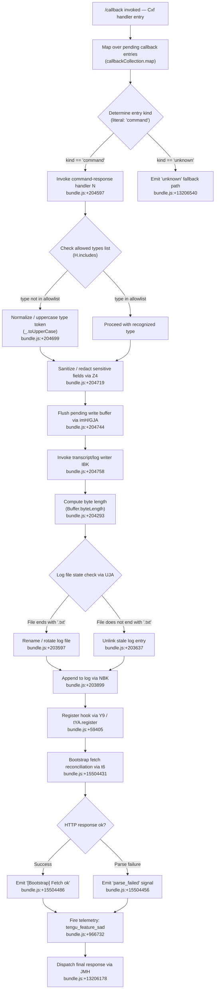

# `/callback`

> Analysis basis: CC v2.1.161 bundle.js (AST extraction + Claude interpretation)
> Minimum version: v2.1.161

---

## Overview

The `/callback` command is an internal slash command of type `callback` that serves as a programmatic re-entry point for the Claude Code CLI. Rather than being directly invoked by end users for conversational purposes, it acts as a dispatcher that routes incoming callback payloads (identified by a `"command"` kind literal) through a multi-stage pipeline: payload normalization, transcript/log flushing, and bootstrap-fetch reconciliation. Its handler (`Cxf`) maps over a collection of pending callback entries and delegates to a response-handler chain.

---

## Registration

| Field | Value |
|---|---|
| type | `callback` |
| name | `callback` |
| description | `null` |
| loc_byte | `13206494` |
| loc_byte_end | `13206527` |
| loc_line | `10540` |
| arbor_handler.name | `Cxf` |
| arbor_handler.fqn | `claude-2.1.161::Cxf` |
| arbor_handler.kind | `Function` |
| arbor_handler.resolution_path | `direct` (symbol falls inside registration byte range) |
| arbor_handler.n_hits | `1` |

Analysis basis: CC v2.1.161 bundle.js:+13206494

---

## Input Branching

The handler traverses multiple distinct paths based on the kind of callback payload received, the state of pending log/transcript buffers, and the success or failure of a bootstrap fetch. Four or more distinguishable branches are present across the call graph, so a Mermaid flowchart is used.



---

## Behavioral Spec

### 1. Handler Entry and Callback Collection Mapping

The primary handler `Cxf` (resolved via Arbor `direct` path) iterates over a collection of pending callback records using a map operation.

```
function callbackHandler(callbackCollection):
    results = callbackCollection.map(entry =>
        dispatchCallbackEntry(entry)
    )
    return results
```

Analysis basis: CC v2.1.161 bundle.js:+13206107

---

### 2. Entry Dispatch by Kind

Each entry is examined for its `kind` field. The literal `"command"` (bundle.js:+13206138) is the recognized kind. Entries not matching a known kind fall through to the `"unknown"` path (bundle.js:+13206540).

```
function dispatchCallbackEntry(entry):
    if entry.kind == "command":
        return commandResponsePipeline(entry)
    else:
        return handleUnknownKind(entry)   // fallback
```

Analysis basis: CC v2.1.161 bundle.js:+13206138, +13206540

---

### 3. Command Response Pipeline (commandResponseHandler / `N`)

The command response handler performs type normalization, allowlist checking, and field sanitization before passing to downstream writers.

```
function commandResponsePipeline(entry):
    // Step 1: normalize via typeValidator (e46)
    validated = typeValidator(entry)

    // Step 2: check if type is in the recognized-types list
    if not allowedTypes.includes(entry.type):
        entry.type = entry.type.toUpperCase()   // bundle.js:+204699

    // Step 3: sanitize/redact sensitive subfields via fieldSanitizer (Z4)
    //   - replaces sensitive content with "[REDACTED]" marker (bundle.js:+196705)
    //   - uses lastIndexOf and slice for field boundary detection (bundle.js:+196789, +196815)
    sanitized = fieldSanitizer(entry)

    // Step 4: trim trailing whitespace
    sanitized.body = sanitized.body.trim()      // bundle.js:+204722

    // Step 5: flush pending write buffer
    pendingFlush(sanitized)                     // imH/GJA, bundle.js:+204744

    // Step 6: write to transcript/log
    transcriptWriter(sanitized)                 // IBK, bundle.js:+204758

    return sanitized
```

Analysis basis: CC v2.1.161 bundle.js:+204597, +204615, +204637, +204655, +204699, +204719, +204722, +204738, +204744, +204758

---

### 4. Field Sanitizer (`Z4`)

Locates sensitive field boundaries using a character-map lookup (`CJA` / `WBK.map`) and replaces content with a `"[REDACTED]"` literal.

```
function fieldSanitizer(entry):
    boundaries = charMapLookup(entry.rawBody)   // CJA, bundle.js:+196626
    redacted = entry.rawBody.replace(sensitivePattern, "[REDACTED]")  // bundle.js:+196705
    // navigate to position 2 (bundle.js:+196734) from the end via .at()
    tail = redacted.at(-2)                      // bundle.js:+196763
    return buildSanitizedEntry(redacted, tail)
```

Analysis basis: CC v2.1.161 bundle.js:+196626, +196653, +196705, +196734, +196763, +196789, +196815

---

### 5. Debug Logging (`VBK` / `HwA`)

A debug-level log call (literal `"debug"`, bundle.js:+204573) is emitted during the normalization phase. A queue-depth check (literal `1`, bundle.js:+203220) gates deduplication before the log line is emitted via `NmK` and `ImK`.

```
function debugLogger(payload):
    if queue.length >= 1:
        deduplicateQueue(payload)   // NmK, bundle.js:+60538
    emitDebugLine(payload)          // ImK, bundle.js:+60552
    log("debug", payload)           // literal "debug", bundle.js:+204573
```

Analysis basis: CC v2.1.161 bundle.js:+204573, +203208, +203322, +203335, +60538, +60552

---

### 6. Transcript / Log Writer (`IBK`)

Manages the lifecycle of the on-disk log file: computes byte length, determines whether to rotate, appends, and registers the post-write hook.

```
function transcriptWriter(entry):
    dir = path.dirname(logFilePath)             // bundle.js:+204119

    // check existence and detect EISDIR condition
    stat = fileSystem.stat(logFilePath)         // UJA/Ay.stat, bundle.js:+203441
    if stat.isEISDIR:                           // literal "EISDIR", bundle.js:+174728
        handleDirectoryConflict()               // d46/v8, bundle.js:+174720

    // rotation: if current log filename ends with ".txt" (bundle.js:+203545)
    //   rename with 4-char suffix (bundle.js:+203567), then unlink old copy
    if logFilePath.endsWith(".txt"):
        rotatedPath = logFilePath.slice(0, -4) + suffix
        fileSystem.rename(logFilePath, rotatedPath)   // bundle.js:+203597
    else:
        fileSystem.unlink(logFilePath)                // bundle.js:+203637

    // build full path via pathJoiner (BJA) and nodePathResolver (N6)
    fullPath = pathJoiner(dir, logFilePath)           // bundle.js:+203772, +203785

    // compute payload byte size
    byteLen = Buffer.byteLength(entry.serialized)     // bundle.js:+204293

    // schedule async append (NBK)
    appendScheduler(fullPath, entry, byteLen).then(postWriteCallback.bind(ctx))
    // NBK steps: mkdir, appendFile, re-check rotation, update size tracker
    //   (bundle.js:+203840, +203899, +203931, +203948, +203986, +203992, +204025)

    // serialize debug subfield via JSON.stringify (SH)
    debugStr = JSON.stringify(entry.debugField)       // bundle.js:+184155

    // register post-write hook (Y9 / tYA.register)
    hookRegistry.register(postWriteHook)              // bundle.js:+59405

    // build content summary (_3H)
    summary = buildSummary(entry)                     // bundle.js:+204111
    //   uses Im6, path.join (he.join), r8, N6 sub-helpers
```

Analysis basis: CC v2.1.161 bundle.js:+204086, +204111, +204119, +204148, +204163, +204238, +204255, +204287, +204293, +204326, +204343, +204352, +204448

---

### 7. Debounced Write Buffer (`WmH`)

A debounce mechanism wraps the actual write to prevent excessive I/O. It uses a 1000 ms debounce window with a 100-item queue limit.

```
function debouncedWriteBuffer(data):
    clearTimeout(existingTimer)                // bundle.js:+58819
    pendingQueue.push(data)                    // bundle.js:+59018

    if pendingQueue.length >= 100:             // literal 100, bundle.js:+58728
        flushNow(pendingQueue.join(""))        // bundle.js:+58893
        pendingQueue = []
    else:
        existingTimer = setTimeout(
            () => flushNow(pendingQueue.join("")),
            1000                               // literal 1000, bundle.js:+58707
        )

    setImmediate(() => drainRemaining())       // bundle.js:+59076
```

Analysis basis: CC v2.1.161 bundle.js:+58707, +58728, +58819, +58860, +58893, +58937, +58958, +58983, +59018, +59076, +59116, +59167, +59189, +59211, +59234

---

### 8. Bootstrap Fetch (`t6` / `H`)

After the transcript write completes, a bootstrap HTTP fetch is performed to reconcile server-side state. The fetch uses a 5000 ms timeout.

```
function bootstrapFetch(context):
    log("[Bootstrap] Fetching")                // literal, bundle.js:+15504122

    headers = {
        "Content-Type": "application/json",   // bundle.js:+15504207, +15504222
        "User-Agent": userAgentString          // bundle.js:+15504241
    }

    response = await fetch(endpoint, { headers, timeout: 5000 })  // bundle.js:+15504313

    sessionCache = sessionStore.get(sessionKey)  // s_.get, bundle.js:+15504158

    if parseSucceeds(response):
        log("[Bootstrap] Fetch ok")            // literal, bundle.js:+15504486
        emitTelemetry("api_bootstrap_fetch")   // literal, bundle.js:+15504434
    else:
        emitTelemetry("api_bootstrap_fetch", { status: "parse_failed" })  // bundle.js:+15504456

    // apply MCP tool / prompt / agent / http / callback type routing
    //   (literals: "prompt", "agent", "http", "mcp_tool", "callback"
    //    bundle.js:+12321120, +12321149, +12321177, +12321201, +12321263)
    routeByType(response.type)
```

Analysis basis: CC v2.1.161 bundle.js:+15504120, +15504122, +15504158, +15504207, +15504222, +15504241, +15504254, +15504284, +15504295, +15504298, +15504313, +15504322, +15504431, +15504434, +15504456, +15504486

---

### 9. Model / Provider Resolution (`lq` / `s9`)

During bootstrap reconciliation, model identifiers are resolved and normalized. Known shorthand aliases are mapped to canonical model strings.

```
function resolveModel(rawModelString):
    trimmed = rawModelString.trim().toLowerCase()   // bundle.js:+2236058, +2236069

    // alias table (literals found in implementation):
    aliases = {
        "opusplan": resolveOpusPlan,    // bundle.js:+2236154
        "[1m]":     resolve1M,          // bundle.js:+2236180
        "sonnet":   resolveSonnet,      // bundle.js:+2236195
        "haiku":    resolveHaiku,       // bundle.js:+2236234
        "opus":     resolveOpus,        // bundle.js:+2236273
        "best":     resolveBest,        // bundle.js:+2236310
    }

    // provider routing (UM / PA):
    //   "anthropicAws"  → AWS-backed provider  (bundle.js:+2050606)
    //   "gateway"       → gateway provider      (bundle.js:+2050626)
    //   "firstParty"    → direct Anthropic API  (bundle.js:+2232362)
    //   "mantle"        → mantle provider       (bundle.js:+2233003)

    // validate against known provider set (NKH / vKH.includes, bundle.js:+2229265)
    if not knownProviders.includes(trimmed):
        trimmed = trimmed.replace(normPattern, "")  // bundle.js:+2236097

    // check for "anthropic." prefix (bundle.js:+2230116)
    if trimmed.startsWith("anthropic."):
        return firstPartyModel(trimmed)

    return canonicalModel(trimmed)
```

Analysis basis: CC v2.1.161 bundle.js:+2232138, +2232175, +2232188, +2236058, +2236069, +2236087, +2236097, +2236133, +2236154, +2236172, +2236180, +2236195, +2236215, +2236234, +2236249, +2236273, +2236287, +2236310, +2236324, +2236342, +2236348, +2236356, +2236400

---

### 10. Final Dispatch (`JMH`)

After all pipeline stages complete, `Cxf` invokes a final dispatcher to deliver the processed result.

```
function finalDispatch(processedResult):
    // JMH receives the fully processed callback result
    // and routes it to the appropriate UI / session consumer
    deliver(processedResult)
```

Analysis basis: CC v2.1.161 bundle.js:+13206178

---

### 11. Telemetry Event: `tengu_feature_sad`

A single telemetry event is fired within the `t6` → `d` call edge, suggesting it is emitted when a feature degradation or error condition is detected during bootstrap or response processing.

```
function featureDegradationTelemetry(context):
    emit("tengu_feature_sad", { context })   // bundle.js:+966732
```

Analysis basis: CC v2.1.161 bundle.js:+966732

---

## State & Side Effects

| Item | Detail |
|---|---|
| Telemetry | `tengu_feature_sad` (bundle.js:+966732); `api_bootstrap_fetch` with optional `parse_failed` sub-status (bundle.js:+15504434, +15504456) |
| Hook registration | `tYA.register` called via `Y9` after each successful transcript write (bundle.js:+59405) |
| appState changes | Session cache lookup via `s_.get` (bundle.js:+15504158); session flag update via `s$` (bundle.js:+15504254) |
| File I/O | Log file created via `Ay.mkdir` + `Ay.appendFile` (bundle.js:+203840, +203899); rotation via `Ay.rename` (bundle.js:+203597); stale-file removal via `Ay.unlink` (bundle.js:+203637); sync unlink via `wSK.unlinkSync` (bundle.js:+15882480) |
| Debounce timers | `setTimeout` (1000 ms window, bundle.js:+58707) and `clearTimeout` + `setImmediate` (bundle.js:+58819, +59076) managing the write-buffer flush cycle |
| Serialization | `JSON.stringify` used for debug-field serialization (bundle.js:+184155); `Buffer.byteLength` for size accounting (bundle.js:+204293) |
| Path truncation | Filename suffix limited to 40 characters (literal `40`, bundle.js:+15930336) during `toLowerCase` normalization |
| Sound | <!-- TODO: not found in depth-2 traversal; needs --depth 4 --> |

---

## Version History

| Version | Change |
|---|---|
| v2.1.161 | Initial analysis |

---

## Common Mistakes

1. **Treating `/callback` as a user-facing conversational command.** It is an internal programmatic re-entry point. Invoking it manually without a properly structured callback payload will route to the `"unknown"` fallback path (bundle.js:+13206540) and produce no meaningful output.

2. **Assuming the description field is set.** The `description` field is `null` in the registration object (bundle.js:+13206494–13206527). Any tooling that relies on a non-null description string for display or filtering will silently drop this command.

3. **Ignoring the `.txt` rotation check.** The log writer (`IBK`) only renames (rotates) files whose names end with `".txt"` (bundle.js:+203545). Files using other extensions are unconditionally unlinked (bundle.js:+203637), which can cause data loss if external tooling writes non-`.txt` log files into the same directory.

4. **Exceeding the write-queue limit.** The debounced write buffer (`WmH`) flushes immediately when the queue reaches 100 items (bundle.js:+58728). Systems that push more than 100 callback payloads in rapid succession will bypass the 1000 ms debounce window and trigger synchronous flushes.

5. **Expecting model aliases to pass through unmodified.** The model-resolution layer (`lq` / `s9`) normalizes aliases such as `"best"`, `"sonnet"`, `"haiku"`, `"opus"`, `"opusplan"`, and `"[1m]"` into canonical internal identifiers before any API call is made. Downstream code should never depend on receiving the raw alias string.

---

## Appendix — Identifier Mapping

> For bundle debugging only. Identifiers change across versions.

| Identifier | Role |
|---|---|
| `Cxf` | Primary handler for `/callback` — maps callback collection and dispatches entries |
| `H` | Bootstrap fetch orchestrator / collection being mapped |
| `N` | Command response pipeline handler |
| `VBK` | Debug-log gating wrapper |
| `HwA` | Debug line emitter (calls `NmK`, `ImK`) |
| `SH` | JSON serializer for debug fields (wraps `JSON.stringify`) |
| `_` | Type token subject to `toUpperCase` normalization |
| `Z4` | Field sanitizer / redactor |
| `CJA` | Character-map boundary lookup (used by `Z4`) |
| `q` | Sync-unlink wrapper (calls `wSK.unlinkSync`) |
| `A` | Path / filename subject to `toLowerCase` and `slice` |
| `imH` | Pending write-buffer flush initiator |
| `GJA` | Low-level write flusher (calls `H.write`) |
| `IBK` | Transcript / log writer (main log-file lifecycle manager) |
| `WmH` | Debounced write buffer (setTimeout / clearTimeout / setImmediate) |
| `_3H` | Summary builder (calls `Im6`, `he.join`, `r8`, `N6`) |
| `F6` | Internal sub-helper called during transcript write setup |
| `d46` | EISDIR conflict handler (calls `v8`) |
| `BJA` | Path joiner (calls `he.join`, `N6`) |
| `UJA` | Log-file stat checker and rotation decision point |
| `NBK` | Async append scheduler (mkdir → appendFile → re-check → size update) |
| `Y9` | Post-write hook registrar (calls `tYA.register`) |
| `s$` | Session flag updater |
| `ne` | Checked-set membership tester (calls `WA4.has`) |
| `Ij` | String replacement utility (calls `H.replace`) |
| `lq` | Model resolution entry point |
| `xHH` | Model string parser (calls `NT`, `o9H`, `VA`, `nQ`) |
| `NT` | Sub-parser within model string resolution |
| `o9H` | Sub-parser within model string resolution |
| `nQ` | Detailed model-token classifier (alias detection, prefix checks) |
| `s9` | Core model normalizer (trim, toLowerCase, alias dispatch) |
| `x0` | Lookup helper within model normalization (calls `kKH`) |
| `NKH` | Known-provider validator (calls `vKH.includes`) |
| `aN` | Model alias resolver for `[1m]` / opusPlan variants (calls `UM`, `Vf`) |
| `CgH` | Haiku model resolver (calls `Vf`) |
| `KG` | Sonnet / firstParty model resolver (calls `UM`, `Vf`, `PA`) |
| `Xwq` | "best" alias resolver (calls `KG`) |
| `UM` | Provider router (anthropicAws / gateway / firstParty logic) |
| `Us6` | Provider allowlist checker (calls `wHL.includes`) |
| `bgH` | Mantle provider resolver (calls `pH`) |
| `xP` | Model resolution coordinator (calls `s9`, `b0`) |
| `b0` | Full model-build assembler (calls `wA`, `BHH`, `RzH`, `xgH`, `KG`, `sX`, `UM`, `PA`, `Vf`, `aN`) |
| `t6` | Bootstrap fetch + telemetry wrapper |
| `d` | Inner telemetry emitter for `tengu_feature_sad` |
| `h1H` | Bootstrap response handler (calls `Xa8`) |
| `Xa8` | Final bootstrap result processor |
| `JMH` | Final callback result dispatcher |

---

Note: index built via Arbor fallback; some signals (telemetry, literals) may be missing — see arbor-fallback.js.