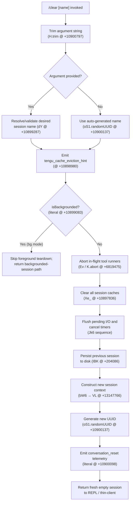

# `/clear`

> Analysis basis: CC v2.1.161 bundle.js (AST extraction + Claude interpretation)
> Minimum version: v2.1.161

---

## Overview

`/clear` (also aliased as `/reset` and `/new`) starts a new, empty conversation session while preserving the previous session on disk so it can be resumed later with `/resume`. The command tears down all in-flight state belonging to the current session — including running sub-processes, tool outputs, timers, and caches — then initialises a fresh session with a newly generated UUID.

---

## Registration

| Field | Value |
|---|---|
| type | `local` |
| name | `clear` |
| description | `Start a new session with empty context; previous session stays on disk (resumable with /resume)` |
| argumentHint | `[name]` |
| aliases | `reset`, `new` |
| supportsNonInteractive | `true` |
| thinClientDispatch | `post-text` |
| module_id | `tS1` |
| load_inline | `true` |
| loc_byte | `10900971` |
| loc_byte_end | `10901262` |
| loc_line | `7153` |
| arbor_handler.name | `Eff` |
| arbor_handler.fqn | `claude-2.1.161::Eff` |
| arbor_handler.kind | `AsyncFunction` |
| arbor_handler.resolution_path | `module_id` |
| arbor_handler.n_hits | `0` |

Analysis basis: CC v2.1.161 bundle.js:+10900971

---

## Input Branching

The command has three or more distinct execution branches depending on whether an optional session name argument is provided, whether the session is currently backgrounded, and whether a cache-eviction hint should be emitted. A Mermaid flowchart is used.



Analysis basis: CC v2.1.161 bundle.js:+10900797, +10899083, +10898980, +10900098

---

## Behavioral Spec

### Entry point — `clearCommandHandler` (`Eff`)

```
async function clearCommandHandler(args, context):
    rawName = args.trim()               // H.trim  (+10900797)
    emit telemetry "tengu_cache_eviction_hint"   // (+10898980)
    sessionParams = buildSessionParams(rawName, context)  // Jk6 (+10900833)
    return sessionParams
```

Analysis basis: CC v2.1.161 bundle.js:+10900797, +10900833

---

### Session-parameter builder — `sessionParamBuilder` (`Jk6`)

The main orchestration function. It wires together cache eviction, state teardown, and new-session initialisation.

```
async function sessionParamBuilder(rawName, context):
    // 1. Parse optional numeric/string name
    parsed = parseSessionName(rawName)           // Xk6 (+10898876)
        // uses parseInt, Number.isFinite (+13157940, +13157962)
        // clamps with Math.max / Math.min (+13158158, +13158171)

    // 2. Check backgrounded flag
    if context.isBackgrounded:                   // literal +10899083
        return backgroundedResult()

    // 3. Kill any live sub-processes
    terminateLiveProcesses(context)              // w (+10899175)
        // sends SIGKILL to each tracked process (+15904557)
        // sets 30/15 s timeout escalation (+15904464, +15904475)

    // 4. Broad cache / state reset
    resetAllCaches(context)                      // Xe_ (+10897836)
        // clears skill index cache  (nu.H.clearSkillIndexCache +13020981)
        // clears conversation state (cS9.RB.clear +6680846)
        // clears post-compact state (xa / EO8 / ER9 +6729343, +6729349)
        // clears token-count caches (z51, D_1, ls8, xs8)
        // clears hook-state maps    (yS9, XF8)
        // clears plugin caches      (Ca.FZ8.clear +9840320)
        // resolves Promise.resolve barriers (+10898199)

    // 5. Flush pending writes and hook runners
    flushHookQueue(context)                      // sO (+10899697)
        // calls MC8.delete, _.flush (+13118759)

    // 6. Clear running-status timers
    clearTimeout(existingTimer)                  // (+10899596)

    // 7. Determine new session name/UUID
    if rawName non-empty:
        newName = resolveSessionDirectory(rawName)  // dY (+10899287)
    else:
        newName = crypto.randomUUID()               // oS1.randomUUID (+10900137)

    // 8. Build new context object
    newSession = buildNewSessionContext(newName, context)  // bW6 (+6694088)

    // 9. Emit conversation_reset event
    emit "conversation_reset"                     // literal +10900098

    // 10. Register fresh hook subscription
    registerHookSubscription(newSession)          // Y9 (+59405 via IBK)

    return newSession
```

Analysis basis: CC v2.1.161 bundle.js:+10898876, +10899083, +10899175, +10897836, +10899697, +10899596, +10900137, +10900098

---

### Cache and state reset — `broadResetAllCaches` (`Xe_`)

Orchestrates clearing of every in-memory cache associated with the outgoing session.

```
function broadResetAllCaches(context):
    clearSkillIndex()                    // nu (+13020959)
    clearConversationStateMap()          // cS9 (+10897853)
    clearSubagentTracking()              // xa (+10897872)
    clearPostCompactState()              // Ca (+10897885)
    clearCompactKey()                    // zX6 (+10897890)
    clearTokenCountCaches()              // z51 (+10898135)
    clearToolCallCaches()                // D_1 (+10898144)
    clearSymbolCaches()                  // ls8 (+10898153)
    clearKeyDerivationCache()            // nK9 (+10898159)
    clearHookStateCache()                // yS9 (+10898168)
    clearHookFlags()                     // XF8 (+10898174)
    clearAuxCaches()                     // xs8 (+10898181)
    clearContextExtension()              // cE1 (+10898187)
    clearQueryCaches()                   // qq1 (+10898193)
    resolveSettledBarriers()             // Promise.resolve (+10898199)
    clearLegacyMaps()                    // lg_ (+10898229)
    clearMessageQueue()                  // q (+10898272)
    clearMzCache()                       // MZ8 (+10898307)
    clearOoCache()                       // oO (+10898398)
    clearLkHCache()                      // LkH (+10898483)
```

Analysis basis: CC v2.1.161 bundle.js:+10897836 through +10898483

---

### Session persistence — `persistSessionToDisk` (`IBK`)

Before the new session begins, the current conversation is written to disk so that `/resume` can reload it.

```
async function persistSessionToDisk(sessionData):
    dir = path.dirname(sessionFilePath)          // he.dirname (+204119)
    ensureDir(dir)                               // qy (+204148)
    prepareFileRotation(sessionFile)             // UJA (+204287)
        // renames .txt -> archived if size > threshold
        // (+203545, +203567 — ".txt", 4)
    byteLen = Buffer.byteLength(payload)         // (+204293)
    writeSessionChunk(payload)                   // NBK (+204352)
        // Ay.mkdir + Ay.appendFile (+203840, +203899)
    flushWriteTimer()                            // WmH (+204086)
        // clearTimeout / setTimeout cycle (+58819, +58983)
    registerCompletionHook()                     // Y9.tYA.register (+59405)
```

Analysis basis: CC v2.1.161 bundle.js:+204086, +204119, +204293, +203545

---

### Session name resolution — `resolveSessionDirectory` (`dY`)

```
function resolveSessionDirectory(rawName):
    if path.isAbsolute(rawName):                 // i28.isAbsolute (+8259087)
        absPath = rawName
    else:
        absPath = path.resolve(cwd, rawName)     // i28.resolve (+8259107)

    exists = checkFileAccess(absPath)            // F6 (+8259122)
    if not exists:
        throw Error("path not found")            // Error (+8259189)

    sanitized = sanitizePath(absPath)            // xa8 (+8259229)
        // ag6.getStore + xO.H.normalize (+976754, +176706, +976780)
    return sanitized
```

Analysis basis: CC v2.1.161 bundle.js:+8259087, +8259107, +8259229

---

### New-session context builder — `buildNewSessionContext` (`bW6`)

```
function buildNewSessionContext(sessionName, parentContext):
    newCtx = buildLoopContext(sessionName)       // VL (+13147766)
    commandRegistry = cloneCommandSet()          // Q$ (+13147857)
    titleTracker = initTitleTracker()            // cj (+13147871)
    uuid = crypto.randomUUID()                   // XC8.randomUUID (+13147916)
    return { newCtx, commandRegistry, titleTracker, uuid }
```

Analysis basis: CC v2.1.161 bundle.js:+13147766, +13147857, +13147916

---

### Loop context initialisation — `buildLoopContext` (`VL`)

```
function buildLoopContext(sessionName):
    notify = createNotifier()                    // N6 (+13159478)
    signal = createAbortSignal()                 // WN (+13159499)
    modelConfig = resolveModelConfig()           // kW (+13159678)
        // checks model prefixes: "claude-3-", "claude-opus-4-x", etc.
    effortLevel = getEffortSetting()             // iV (+13159691)
        // literal "high" (+4160687), "effort" (+13159614)
    displayConfig = buildDisplayConfig()         // cv (+13159743)
    helpContext = buildHelpContext()             // h6 (+13159753)
    return { sessionName, notify, signal, modelConfig, effortLevel, displayConfig, helpContext }
```

Analysis basis: CC v2.1.161 bundle.js:+13159478, +13159678, +13159743

---

### Thin-client dispatch path

When `thinClientDispatch` is `"post-text"`, the command result is forwarded as a post-text message to the thin client rather than being handled inline. No additional server round-trip is needed; the cleared context is sent directly.

Analysis basis: CC v2.1.161 bundle.js:+10900971 (registration field `thinClientDispatch`)

---

### Non-interactive mode

`supportsNonInteractive: true` means `/clear` (and its aliases) may be invoked from piped or scripted input without an interactive terminal. The handler does not prompt for confirmation regardless of session state.

Analysis basis: CC v2.1.161 bundle.js:+10900971 (registration field `supportsNonInteractive`)

---

## State & Side Effects

| Item | Detail |
|---|---|
| Telemetry | `tengu_cache_eviction_hint` (+10898980); `tengu_feature_ok` (+966587); `tengu_feature_bad` (+966650); `tengu_feature_sad` (+966732); `tengu_repl_hook_finished` (+13181177); `tengu_run_hook` (+13197366); `tengu_hook_plugin_metrics` (+13175728); `tengu_session_renamed` (+13061864); `tengu_shell_set_cwd` (+8259242) |
| Conversation state | `conversation_clear` literal (+10899015); `conversation_reset` event (+10900098); `running` status cleared (+10899504) |
| Session file | Previous session persisted to disk via `IBK`/`NBK` (append-file pattern, +203899); file rotation applied when file ends with `.txt` and a size threshold is crossed (+203545, +203567) |
| Caches cleared | Skill index, conversation map, sub-agent tracking, post-compact state, token counts, tool-call caches, symbol caches, key-derivation cache, hook-state maps, plugin caches, aux caches, query caches, message queue, legacy maps |
| Sub-processes | All tracked child processes sent `SIGKILL` (+15904557); escalation timers of 30 s / 15 s set (+15904464, +15904475) |
| Timers | `clearTimeout` called on existing abort timer (+10899596); write-flush timers reset via `WmH` (+58819) |
| Hook registration | Fresh hook subscription registered via `Y9 → tYA.register` (+59405) after new session is created |
| AbortController | `abortController` key literal used (+10899632); existing abort signal torn down before new session |
| UUID | New session UUID generated via `oS1.randomUUID` (+10900137) |
| Background sessions | When `isBackgrounded` is detected (+10899083), teardown is skipped and a lightweight result is returned |
| Sound | No sound side-effects found in depth-2 traversal |

---

## Version History

| Version | Change |
|---|---|
| v2.1.161 | Initial analysis |

---

## Common Mistakes

1. **Expecting immediate data loss** — `/clear` does _not_ delete the previous session. It is persisted to disk and remains resumable via `/resume`. Only in-memory state is torn down.
2. **Confusing `/clear` with `/reset` or `/new`** — All three names are registered aliases and behave identically; there is no behavioral difference between them.
3. **Using `/clear` in non-interactive scripts without awareness of `thinClientDispatch`** — In thin-client mode, the post-text dispatch path is taken; callers that consume output synchronously must handle the `post-text` message shape.
4. **Assuming the optional `[name]` argument sets a display title** — The argument is resolved as a filesystem path for the new session directory, not a human-readable display name. Relative paths are resolved against the current working directory.
5. **Running `/clear` expecting background agents to stop** — Background (`isBackgrounded`) sessions receive a shortened code path and their sub-processes are not killed; they are re-adopted after the foreground session clears.

---

## Appendix — Identifier Mapping

> For bundle debugging only. Identifiers change across versions.

| Identifier | Role |
|---|---|
| `Eff` | `clearCommandHandler` — async entry-point for the `/clear` command (arbor_handler) |
| `Jk6` | `sessionParamBuilder` — main session-teardown and new-session orchestrator |
| `Xk6` | `parseSessionName` — parses/clamps optional numeric or string session name |
| `Xe_` | `broadResetAllCaches` — clears every in-memory cache for the outgoing session |
| `IBK` | `persistSessionToDisk` — writes current conversation to disk before clearing |
| `NBK` | `writeSessionChunk` — appends session data to disk (mkdir + appendFile) |
| `UJA` | `rotateSessionFile` — renames `.txt` session file when size threshold exceeded |
| `BJA` | `buildSessionFilePath` — constructs the session file path from directory and name |
| `WmH` | `flushWriteTimer` — manages clearTimeout/setTimeout for deferred session writes |
| `_3H` | `buildSessionMetadata` — assembles metadata block written alongside session |
| `bW6` | `buildNewSessionContext` — constructs fresh session context after clearing |
| `VL` | `buildLoopContext` — initialises REPL loop configuration for new session |
| `dY` | `resolveSessionDirectory` — validates and normalises optional path argument |
| `xa8` | `sanitizePath` — normalises path via AsyncLocalStorage + Unicode NFC |
| `xO` | `normalizePath` — applies `H.normalize` (NFC Unicode normalisation) |
| `sO` | `flushHookQueue` — flushes and removes pending hook-runner entries |
| `OC8` | `hookPromiseTracker` — add/delete tracking set for in-flight hook promises |
| `Xe_` | `broadResetAllCaches` — see above |
| `cS9` | `clearConversationStateMap` — clears `RB` conversation state store |
| `UkH` | `persistConversationOnClear` — saves state before wipe, writes file |
| `xa` | `clearSubagentTracking` — tears down XO8, zX6, V_H, EO8, ER9, JR9, NJH maps |
| `XO8` | `clearSubagentReadyMap` — removes ready/exit entries from `Uu` map |
| `ER9` | `clearCompactionCaches` — clears `pW6` and `nh_` compaction caches |
| `JR9` | `clearJrHookState` — resets hook-state flag in `H` |
| `Ca` | `clearFzCache` — clears `FZ8` plugin cache |
| `z51` | `clearTokenCountCaches` — clears `kSH` and `TQ_` |
| `D_1` | `clearToolCallCaches` — clears `keH` and `gT6` |
| `ls8` | `clearSymbolCaches` — clears `sUH` |
| `yS9` | `clearHookStateCache` — clears `r38` hook state |
| `XF8` | `checkClearHookFlags` — tests and clears `H` hook-flag map |
| `xs8` | `clearAuxCaches` — clears `aUH` |
| `cE1` | `clearContextExtension` — calls into `uN6` |
| `uN6` | `clearContextExtensionInner` — gets/clears `TV8` extension store |
| `qq1` | `clearQueryCaches` — clears `Xs` and `_XH` query result caches |
| `nu` | `clearSkillIndex` — clears skill index via `H.clearSkillIndexCache` |
| `Q$` | `cloneCommandSet` — builds command registry for new session |
| `a4` | `commandRegistryFactory` — creates individual command entries including `Y9` |
| `Y9` | `registerHookSubscription` — registers hook listener via `tYA.register` |
| `Pk6` | `buildPkCommandEntry` — sub-factory for Pk command registration |
| `Mn` | `buildMnCommandEntry` — sub-factory for Mn command registration |
| `Sm` | `buildSmCommandEntry` — sub-factory for Sm, emits `RN8` events |
| `JS` | `buildJsCommandEntry` — sub-factory wiring `cv`, `CMH`, `a4` |
| `RqH` | `buildRqHCommandEntry` — sub-factory for RqH log command |
| `CMH` | `appendLogEntry` — appends to log file via `appendFileSync`/`mkdirSync` |
| `hRH` | `buildSymlinkTaskDir` — creates symlinked task directory in new session |
| `VZ` | `buildVzContext` — constructs subagent context map |
| `wM` | `buildWmContext` — constructs working-mode context |
| `kW` | `resolveModelConfig` — selects model based on prefix/version strings |
| `iV` | `resolveEffortLevel` — maps `"high"` and `"effort"` strings to effort config |
| `cv` | `buildDisplayConfig` — constructs display configuration object |
| `h6` | `buildHelpContext` — builds help/info context |
| `z0` | `runSessionLoop` — main agent loop launched after context is built |
| `bMH` | `buildMessageHistory` — assembles initial message history for new loop |
| `zLA` | `loadHookConfigs` — loads all hook configuration entries for new session |
| `$X` | `sessionLoopDispatch` — inner dispatch function for the agent loop |
| `CB` | `loadPluginHooks` — loads plugin hooks with network/parse/permission error handling |
| `BC` | `clearAndReloadSkills` — clears skill index and reloads after session switch |
| `nRH` | `reloadPluginManifest` — reloads plugin manifest via `uN6` |
| `Yj` | `clearOutputTokenCounts` — iterates `Object.values` and clears `_mH` output-token counters |
| `RU8` | `emitSessionReset` — generates UUID and emits `Bx6` event for session reset |
| `SF` | `buildBinaryFrame` — constructs binary-framed message (Buffer operations) |
| `DOA` | `sendClaimToBackground` — sends claim frame to background daemon socket |
| `q95` | `claimRetryLoop` — retry loop with `Date.now`-based timeout for claim sends |
| `XOA` | `backgroundSessionDispatch` — background session state machine (done/killed/failed/etc.) |
| `w` | `mainDaemonLoop` — primary daemon dispatch loop (SIGKILL, mem checks, spare slots) |
| `Ev` | `abortWithTimeout` — wraps abort-controller with `clearTimeout`/`setTimeout` |
| `NC8` | `spawnHookProcess` — spawns hook subprocess with env-var injection |
| `LLA` | `executeMcpToolHook` — runs MCP-tool hook type |
| `KLA` | `executeHttpHook` — runs HTTP hook type |
| `BLK` | `parseHttpHookResponse` — parses HTTP hook body (empty body → `{}`) |
| `vC8` | `parseCommandHookOutput` — parses command hook stdout (non-`{` → plain text) |
| `wqH` | `applyHookPluginMetrics` — processes `hook_plugin_metrics` entries |
| `N` | `buildApiRequest` — constructs API request body / message envelope |
| `VBK` | `buildRequestPayload` — builds request payload for API call |
| `HwA` | `applyRequestTransform` — applies transforms via `NmK` / `ImK` |
| `SH` | `jsonStringifyHelper` — thin wrapper around `JSON.stringify` |
| `Z4` | `buildModelPath` — constructs model identifier path with `[REDACTED]` redaction |
| `CJA` | `mapModelAliases` — maps model alias strings via `WBK.map` |
| `imH` | `writeStreamChunk` — writes a stream chunk via `GJA.H.write` |
| `GJA` | `streamWriter` — underlying stream write wrapper |
| `F6` | `checkFileAccess` — file existence / access check |
| `d46` | `fileAccessHelper` — calls into `v8` for filesystem access |
| `v8` | `nodeFileAccess` — Node.js `fs` access wrapper |
| `df` | `fileVersionHelper` — version-tagged file utility calling `v8` |
| `TH` | `stringCoerce` — coerces value to `String` |
| `pH` | `stringConstructor` — direct `String(...)` coercion |
| `m8` | `getPolicySettings` — retrieves `policySettings` from config store |
| `CY` | `buildConversationHistory` — assembles conversation history array |
| `xU` | `getConversationStore` — reads current conversation from `m8` store |
| `Zp` | `signalHelper` — wraps `XN` signal utilities |
| `uU` | `clearSessionCachesInner` — calls `bj_`, `nz`, `xj_` to clear session-level caches |
| `bj_` | `cacheGetSet` — get/set on `Vlq` cache |
| `nz` | `clearCx6Iu8` — clears `Cx6` and `IU8` caches |
| `xj_` | `rebuildCacheEntry` — rebuilds cache entry via `m8` / `bj` / `VA` |
| `xCH` | `initSessionAfterClear` — wires `VL`, `z0`, `N6`, `TSH` for new session |
| `TSH` | `buildTshContext` — builds thin-shell context with `H` and `N` |
| `N6` | `notifyHelper` — notification/event emitter wrapper |
| `WN` | `abortSignalHelper` — creates or wraps an `AbortSignal` via `XN` |
| `P_` | `promiseHelper` — utility wrapping `XN` promise patterns |
| `XN` | `signalCore` — core signal / promise primitive |
| `d` | `debugLogger` — debug-level logger |
| `h1H` | `hookLifecycle` — hook lifecycle helper used in feature telemetry |
| `Xa8` | `featureTelemetryLogger` — logs feature-level telemetry events (ok/bad/sad) |
| `yH` | `errorLogger` — logs errors via `ri.logError` |
| `RH` | `sadFeatureLogger` — logs `tengu_feature_sad` events |
| `hH` | `okFeatureLogger` — logs `tengu_feature_ok` events |
| `kGH` | `ugLogger` — wraps `ug6` logging utility |
| `t6` | `bootstrapFetcher` — fetches bootstrap data with `[Bootstrap] Fetching` prefix |
| `lq` | `modelSelector` — selects model config via `xHH`, `s9`, `xP` |
| `xHH` | `modelSelectorInner` — inner model selection with `NT`, `o9H`, `VA`, `nQ` |
| `nQ` | `buildModelQuery` — builds model query checking `anthropic.` prefix |
| `s9` | `resolveModelString` — resolves model string through alias chain |
| `x0` | `lookupModelKey` — looks up model key via `kKH` |
| `NKH` | `checkVkhIncludes` — checks `vKH` model-name list |
| `aN` | `resolveModelAlias` — resolves alias via `UM` and `Vf` |
| `CgH` | `resolveHaikuAlias` — resolves haiku alias via `Vf` |
| `KG` | `resolveModelWithProvider` — resolves model + provider (`firstParty`, `anthropicAws`, etc.) |
| `Xwq` | `resolveXwqAlias` — chains through `KG` for extended alias |
| `UM` | `resolveProviderModel` — resolves to provider-specific model via `PA` |
| `Us6` | `checkWhlIncludes` — checks `wHL` model list |
| `bgH` | `resolveBgHModel` — resolves via `pH` |
| `xP` | `buildModelPair` — pairs `s9` + `b0` model selections |
| `b0` | `buildModelBundle` — bundles `wA`, `BHH`, `RzH`, `xgH`, `KG`, `sX`, `UM`, `PA`, `Vf`, `aN` |
| `L85` | `l85Helper` — intermediate helper in bootstrap fetch chain |
| `oUH` | `logTimestampedEntry` — logs with `Date.now` and delegates to `j8` |
| `j8` | `appendFileSyncLogger` — logger that uses `appendFileSync`/`mkdirSync` |
| `eK` | `bareGitHelper` — runs `--bare` git command |
| `x4H` | `buildPolicyEntries` — builds policy settings entries from `m8` |
| `Z_H` | `zLhHelper` — string-coercion helper in plugin loading |
| `bj` | `bjHelper` — cache utility called from `xj_` |
| `M` | `worktreeRmHelper` — removes worktree entries via `nC6`, `f.has`, `w0.rm` |
| `nC6` | `resolveWorktreePath` — normalises worktree path (lowercase, relative check) |
| `$` | `y_KScheduler` — schedules `y_K` metrics flush |
| `y_K` | `metricsFlush` — flushes metrics with `Date.now`, `$1`, `Fh6` |
| `yq` | `generateSessionUUID` — generates UUID via `WW1.randomUUID` |
| `OX` | `oxHelper` — helper invoked early in `Jk6` setup |
| `aj` | `ajHelper` — invoked alongside `OX` in `Jk6` |
| `VNH` | `vnhHelper` — invoked after `Object.keys` enumeration in `Jk6` |
| `NZ` | `nzHelper` — late-stage `Jk6` helper |
| `ToH` | `triggerLg9` — triggers `LG9` lifecycle notification |
| `LG9` | `sessionLifecycleNotifier` — session lifecycle notification sink |
| `sS1` | `flushP$H` — calls `p$H` flush on session end |
| `dM` | `dmHelper` — context helper in `Jk6` |
| `P1` | `p1Helper` — context helper in `Jk6` |
| `v_` | `initModuleBindings` — sets up `__esModule`, calls `ib6`, `rb6`, `FRK`, `rOA.set` |
| `Kv` | `kvHelper` — late-stage `Jk6` context helper |
| `G` | `handleRemoteControl` — handles `remoteControlAtStartup`, calls `b.preventDefault`, `m0`, `D`, `H` |
| `m0` | `loadSettingsAndConfig` — loads all settings layers via `l_` |
| `l_` | `mergeAllSettings` — merges `flagSettings`, `userSettings`, `projectSettings`, `localSettings` |
| `DM` | `dmHelper2` — second DM helper in `Jk6` tail |
| `Gk` | `gkHelper` — called alongside `wM` in new-session build |
| `XK6` | `xk6Helper` — early helper in `Jk6` before abort-signal setup |
| `E` | `eHelper` — wraps `EI6` and `Y16` for event dispatch |
| `EI6` | `eventDispatchA` — first event dispatch path |
| `Y16` | `eventDispatchB` — second event dispatch path |
| `WJ` | `forcedShutdownHandler` — handles `"forced shutdown"` label in `Y` |
| `z` | `daemonStopHandler` — emits `daemon_stop` / `daemon_stop_failed` telemetry |
| `ly` | `lyHelper` — helper in daemon stop path |
| `qp` | `qpHelper` — helper in daemon stop path |
| `C` | `chokidarWatcher` — file-watcher (`chokidar`) wrapper, emits `rate_limit_event` |
| `_o1` | `watcherInternalHelper` — internal chokidar helper |
| `y` | `watcherEnqueue` — enqueues watcher events |
| `S` | `supervisorYield` — supervisor yield logic, logs `"yielding to a foreground/service daemon"` |
| `D` | `daemonConfigReload` — reloads daemon config, emits `tengu_daemon_config_reload` |
| `ER8` | `lowMemChecker` — checks `macos` free memory, threshold 1024 MB |
| `j6` | `lowMemDispatcher` — dispatches `tengu_bg_low_mem_mb` events |
| `rj6` | `readPinsFile` — reads `pins.json` via `Y2.readFile` |
| `m0_` | `buildPinsPath` — joins `w2` path with `"pins.json"` |
| `m6` | `jsonParseHelper` — thin `JSON.parse` wrapper |
| `k8` | `fileAccessV8` — filesystem access via `v8` |
| `WbL` | `readPinsDir` — reads pins directory and builds pin list |
| `DOA` | `sendClaimToBackground` — (see above) |
| `FLA` | `writeRosterEntry` — writes JSON roster entry to disk |
| `q95` | `claimRetryLoop` — (see above) |
| `A95` | `buildClaimFrame` — calls `Mg.buildClaimFrame` |
| `XOA` | `backgroundSessionDispatch` — (see above) |
| `q1` | `readSessionState` — reads session state JSON (emits `tengu_bg_state_read_transient`) |
| `lD` | `loadActiveState` — loads `"active"` state via `nV` |
| `W5` | `buildW5Entry` — constructs W5 roster entry with `SH`, `Fj` |
| `e_6` | `executeSessionPromise` — runs session promise with `Date.now` timing, emits `Kzf` |
| `n5H` | `buildN5HPath` — joins `F3` path with `HbH` |
| `AT` | `buildAtPath` — joins path, splits `H`, uses `HbH` |
| `mF` | `buildMfPath` — joins `F3`, calls `gHA`, `s_6` |
| `nk6` | `createNk6Dir` — creates directory via `F3.join` + `cHA` |
| `aK` | `buildAkPath` — joins `w2` path with `vG` |
| `FLA` | `writeRosterEntry` — (see above) |
| `SF` | `buildBinaryFrame` — (see above) |
| `K` | `padColumnHelper` — pads columns with `"  "` via `L.map` / `f.padEnd` |
| `Y` | `forcedExitHandler` — calls `WJ`, `process.exit`, `z.abort` |
| `WJ` | `forcedShutdownHandler` — (see above) |
| `B` | `retireIfSettledHelper` — calls `B.retireIfSettled` |
| `O` | `backgroundSessionObj` — holds `"background session"` state |
| `J` | `callbackWrapper` — wraps callback invocation, holds `w` reference |
| `f` | `sessionCloseHelper` — calls `A.close` / `q.close` / `L` on cleanup |
| `L` | `promiseCleanupHelper` — add/delete from `q` set with `finally` |
| `HS_` | `resetAutonomousLoop` — resets autonomous-loop delivered state via `Rf7` |
| `cK6` | `clearCk6Cache` — cache-clear helper called in `Xe_` |
| `JIH` | `jiHHelper` — sub-helper called by `xa` into `d8H` |
| `V_H` | `clearSubagentViewState` — clears `TF8` and `SF8` view-state caches |
| `EO8` | `clearLn1Cache` — clears `lN1` post-compact cache |
| `NJH` | `clearNjhFlags` — resets `H` and `_` flags in NJH scope |
| `Rf7` | `autonomousLoopTracker` — tracks `resetAutonomousLoopDelivered` |
| `iZ8` | `iz8Helper` — called in `BC` skill-clear chain |
| `rW1` | `rw1Helper` — called in `BC` skill-clear chain |
| `zX6` | `clearCompactKey` — clears compact key via `jZ` |
| `jZ` | `jzHelper` — underlying compact-key store |
| `N6A` | `n6AHelper` — called in `nu` skill index clear |
| `FZ8` | `pluginCacheStore` — plugin cache cleared by `Ca` |
| `kSH` | `tokenCountCacheA` — first token-count cache cleared by `z51` |
| `TQ_` | `tokenCountCacheB` — second token-count cache cleared by `z51` |
| `keH` | `toolCallCacheA` — first tool-call cache cleared by `D_1` |
| `gT6` | `toolCallCacheB` — second tool-call cache cleared by `D_1` |
| `sUH` | `symbolCache` — symbol cache cleared by `ls8` |
| `r38` | `hookStateCache` — hook-state cache cleared by `yS9` |
| `aUH` | `auxCache` — aux cache cleared by `xs8` |
| `Xs` | `queryCacheA` — first query cache cleared by `qq1` |
| `_XH` | `queryCacheB` — second query cache cleared by `qq1` |
| `TV8` | `contextExtensionStore` — extension store read/cleared by `uN6` |
| `RB` | `conversationStateStore` — cleared by `cS9` |
| `Uu` | `subagentReadyMap` — subagent ready-state map cleared by `XO8` |
| `pW6` | `compactionCacheA` — cleared by `ER9` |
| `nh_` | `compactionCacheB` — cleared by `ER9` |
| `lN1` | `postCompactCache` — cleared by `EO8` |
| `MZ8` | `mzCache` — cleared in `Xe_` tail |
| `oO` | `ooCache` — cleared in `Xe_` tail |
| `LkH` | `lkHCache` — cleared in `Xe_` tail |
| `MC8` | `hookQueueMap` — hook queue map flushed by `sO` |
| `d4K` | `hookPromiseSet` — set of in-flight hook promises tracked by `OC8` |
| `Mg` | `daemonSocketManager` — provides `spawn`, `claim`, `buildClaimFrame` |
| `Mp8` | `socketConnector` — provides `connect` for daemon IPC |
| `Ay` | `fsPromises` — Node.js `fs/promises` wrapper (stat, rename, unlink, mkdir, appendFile) |
| `he` | `pathModule` — Node.js `path` module (dirname, join) |
| `i28` | `pathModuleAlt` — Node.js `path` (isAbsolute, resolve) |
| `w2` | `pathModuleAlt2` — Node.js `path` (join, basename) |
| `Y2` | `fsPromisesAlt` — Node.js `fs/promises` (readFile, readdir, stat) |
| `DY` | `fsPromisesB` — Node.js `fs/promises` (rm, unlink) |
| `ut` | `fsPromisesC` — Node.js `fs/promises` (mkdir, symlink, unlink, open) |
| `a38` | `fsPromisesD` — Node.js `fs/promises` (mkdir, writeFile) |
| `j9H` | `fsPromisesE` — Node.js `fs/promises` (mkdir, writeFile) |
| `PL` | `fsPromisesF` — Node.js `fs/promises` (appendFile, mkdir) |
| `wSK` | `fsSync` — Node.js `fs` (unlinkSync) |
| `ZC8` | `childProcess` — Node.js `child_process` (spawn) |
| `tYA` | `hookRegistry` — hook registration store (register method) |
| `Bx6` | `sessionResetEmitter` — event emitter for session-reset events |
| `mS6` | `sessionRenameEmitter` — event emitter for `tengu_session_renamed` |
| `RN8` | `smEventEmitter` — event emitter used by `Sm` |
| `lc` | `sessionStartEmitter` — emits hook_session_start_reload_skills |
| `ag6` | `asyncLocalStorage` — AsyncLocalStorage for path context |
| `qxH` | `cryptoModule` — Node.js `crypto` (randomUUID) |
| `oS1` | `cryptoModuleAlt` — Node.js `crypto` (randomUUID, used for new session UUID) |
| `XC8` | `cryptoModuleB` — Node.js `crypto` (randomUUID, used in bW6) |
| `c9H` | `cryptoModuleC` — Node.js `crypto` (randomUUID, used in RU8) |
| `WW1` | `cryptoModuleD` — Node.js `crypto` (randomUUID, used in yq) |
| `fj` | `cryptoModuleE` — Node.js `crypto` (randomUUID, used in chokidar watcher C) |
| `WOA` | `osModule` — Node.js `os` (freemem) |
| `qxH` | `cryptoModule` — (see above) |
| `Fh_` | `fhMap` — map accessed in `VZ.Fh_.get` for subagent context |
| `vJH` | `vJHArray` — array joined in `wM` and `VZ` for context path |
| `OY` | `pathForDisplay` — path module used in `cv` and `CMH` for dirname/join |
| `ATH` | `pathForSettings` — path module used in `l_` for dirname |
| `XSA` | `pathForLog` — path module used in `j8` for dirname |
| `a4A` | `pathForTasks` — path module used in `peH` and `c$` |
| `F3` | `pathForRoster` — path module used in `nk6`, `n5H`, `AT`, `mF` |
| `ck` | `pathForWorktree` — path module used in `nC6` |
| `w0` | `fsForWorktree` — filesystem module used in `M.w0.rm` |
| `uLK` | `pathBasename` — `path.basename` used in `zLA` |
| `Cx6` | `cx6Cache` — cache cleared by `nz` |
| `IU8` | `iu8Cache` — cache cleared by `nz` |
| `Vlq` | `vlqCache` — get/set cache used by `bj_` |
| `WbL` | `readPinsDir` — (see above) |
| `JMH` | `jmhHelper` — used in `z0` and `NC8` hook execution |
| `nhH` | `nhHHelper` — used in `z0` and `$X` session loop |
| `G_H` | `gHHHelper` — used in `z0`, `NC8`, `$X` |
| `Pv` | `pvHelper` — used in `z0`, `TC8`, `$X` |
| `TC8` | `buildTc8Context` — builds TC8 with `Pv`, `k_A`, `y_A`, `N` |
| `wqH` | `applyHookPluginMetrics` — (see above) |
| `FLK` | `flkHelper` — filter helper in `z0` and `$X` |
| `OLA` | `filterOlaContext` — filters context via `H.filter`, `IC8` |
| `QLK` | `qlkHelper` — helper in `z0` and `$X` |
| `IC8` | `ic8Helper` — filter helper for third-party hooks |
| `p$H` | `pFlushHelper` — flush helper called by `sS1` |
| `cj` | `titleTracker` — tracks conversation title in new session |
| `SZ8` | `sz8Helper` — helper in `$X` |
| `A0` | `a0Helper` — helper in `$X` after `KLA` |
| `VC8` | `vc8Helper` — helper in `$X` |
| `dS6` | `ds6Helper` — helper in `$X` |
| `Rxf` | `rxfHelper` — helper in `$X` |
| `Sxf` | `sxfHelper` — helper in `$X` |
| `Cxf` | `cxfHelper` — helper in `$X` |
| `dLK` | `dlkHelper` — helper in `$X` |
| `N4` | `n4Helper` — helper in `$X` and `wqH` |
| `Wb9` | `wb9Helper` — helper in `$X` |
| `TS` | `tsHelper` — helper in `$X` |
| `x$H` | `xHHHelper` — helper in `$X` |
| `I2` | `i2Helper` — helper in `$X` |
| `u$` | `uHelper` — helper in `$X` |
| `d7H` | `d7HHelper` — helper in `$X` |
| `HLK` | `hlkHelper` — helper in `$X` |
| `qLK` | `qlkHelper2` — second QLK helper in `$X` |
| `tf1` | `tf1Helper` — helper for `onHookSuccess` in `$X` |
| `gA` | `gaHelper` — helper in `$X` |
| `Nc` | `ncHelper` — helper in `$X` |
| `Eb9` | `eb9Helper` — helper in `$X` |
| `zT8` | `zt8Helper` — helper in `$X` for `u.set` path |
| `y_A` | `yAHelper` — used in `TC8` and `$X` |
| `k_A` | `kAHelper` — used in `TC8` |
| `Exf` | `exfHelper` — used in `LLA` |
| `Pxf` | `pxfHelper` — used in `KLA` |
| `FW6` | `fw6Helper` — used in `KLA` |
| `Wxf` | `wxfHelper` — used in `KLA` |
| `Jxf` | `jxfHelper` — used in `KLA` |
| `Ny` | `nyHelper` — used in `KLA` |
| `pQ` | `pqHelper` — used in `KLA` |
| `nX` | `nxPost` — HTTP post client used in `KLA.nX.post` |
| `ULK` | `ulkHelper` — used in `vC8` and `BLK` |
| `goH` | `goHHelper` — used in `BLK` |
| `XEH` | `xehHelper` — used in `LLA` |
| `TH` | `stringCoerce` — (see above) |
| `QS6` | `qs6Helper` — used in `zLA` |
| `GIH` | `giHHelper` — used in `zLA` and `NC8` |
| `Nxf` | `nxfHelper` — used in `zLA` |
| `Ixf` | `ixfHelper` — used in `zLA` |
| `G` | `handleRemoteControl` — (see above) |
| `hxf` | `hxfHelper` — used in `zLA` |
| `iS9` | `is9Helper` — used in `NC8` |
| `aB` | `abHelper` — used in `NC8` |
| `sT6` | `st6Helper` — used in `NC8` |
| `R1H` | `r1HHelper` — used in `NC8` |
| `KQ6` | `kq6Helper` — used in `NC8` |
| `r28` | `r28Helper` — used in `NC8` |
| `B_` | `bHelper` — used in `NC8` |
| `hK6` | `hk6Helper` — used in `NC8` |
| `xLK` | `xlkHelper` — used in `NC8` |
| `W7` | `w7Helper` — used in `NC8` |
| `RZ8` | `rz8Helper` — used in `NC8` |
| `SL` | `slHelper` — used in `NC8` |
| `wv` | `wvHelper` — used in `NC8` |
| `H_H` | `hHHHelper` — used in `NC8` |
| `X7H` | `x7HHelper` — used in `NC8` |
| `ZH` | `zhHelper` — used in `NC8` |
| `LQ6` | `lq6Helper` — used in `NC8` |
| `d28` | `d28Helper` — used in `NC8` |
| `rV` | `rvHelper` — used in `NC8` |
| `meH` | `meHHelper` — used in `NC8` |
| `gLK` | `glkHelper` — used in `NC8` |
| `tK` | `tkHelper` — used in `NC8` |
| `m6` | `jsonParseHelper` — (see above) |
| `i6` | `i6Helper` — used in `NC8`, `FLA`, `XOA`, `AT`, `mF`, `ER8` |
| `AH` | `ahHelper` — used in `NC8` |
| `sS9` | `ss9Helper` — used in `CB` |
| `Z_H` | `zLhHelper` — (see above) |
| `bW6` | `buildNewSessionContext` — (see above) |
| `WA4` | `wa4Set` — has-check set used in `ne` |
| `s_` | `s_Map` — `get` used in `H` bootstrap-fetch path |
| `s$` | `sHelper` — helper in `H` bootstrap-fetch chain |
| `ne` | `neHelper` — checks `WA4.has` |
| `Ij` | `ijHelper` — applies `H.replace` in `H` fetch chain |
| `NT` | `ntHelper` — used in `xHH` model selector |
| `o9H` | `o9HHelper` — used in `xHH` model selector |
| `VA` | `vaHelper` — used in `xHH`, `CY`, `xj_`, `nQ` |
| `Vf` | `vfHelper` — model provider resolver used in `aN`, `CgH`, `KG`, `b0` |
| `PA` | `paHelper` — provider-auth helper used in `KG`, `UM`, `b0` |
| `sX` | `sxHelper` — used in `b0` |
| `wA` | `waHelper` — used in `b0` |
| `BHH` | `bhhHelper` — used in `b0` |
| `RzH` | `rzHHelper` — used in `b0` |
| `xgH` | `xgHHelper` — used in `b0` |
| `co` | `coHelper` — used in `iV` effort resolver |
| `yLH` | `ylHHelper` — used in `iV` effort resolver |
| `sg6` | `sg6Helper` — used in `h6` help context |
| `wO` | `wOHelper` — used in `cv`, `wM`, `VZ` display config |
| `Gk` | `gkHelper` — (see above) |
| `nr` | `nrHelper` — used in `kW` model config |
| `_9` | `_9Helper` — used in `kW` model config |
| `Iy` | `iyHelper` — used in `kW` model config |
| `IY` | `iyHelper2` — used in `kW` model config |
| `sg6` | `sg6Helper` — (see above) |
| `Fj` | `fjHelper` — used in `W5` roster entry |
| `XbL` | `xbLHelper` — used in `q1` session-state reader |
| `NLH` | `nlhMap` — session-state map in `q1` |
| `rYH` | `ryHSet` — session-state set in `q1` |
| `nV` | `nvHelper` — `"active"` state loader in `lD` |
| `t3` | `t3Helper` — used in `W5` |
| `Kzf` | `kzfHelper` — called in `e_6` session promise timing |
| `pF` | `pfHelper` — used in `e_6` |
| `HbH` | `hbHHelper` — used in `n5H` and `AT` path builders |
| `gHA` | `gHAHelper` — used in `mF` path builder |
| `s_6` | `s_6Helper` — used in `mF` path builder |
| `cHA` | `cHAHelper` — used in `nk6` and `UkH` |
| `PC` | `pcHelper` — used in `UkH` |
| `SS9` | `ss9Promise` — promise chained in `UkH` |
| `mS9` | `ms9Helper` — used in `UkH` |
| `pS9` | `ps9Helper` — used in `UkH` |
| `Rf4` | `rf4Helper` — used in `j8` log |
| `np` | `npHelper` — used in `l_` settings merge |
| `wx` | `wxHelper` — used in `l_` settings merge |
| `QQ6` | `qq6Helper` — used in `l_` settings merge |
| `oi` | `oiHelper` — used in `l_` settings merge |
| `wt8` | `wt8Helper` — used in `l_` settings merge |
| `qTH` | `qtHHelper` — used in `l_` settings merge |
| `Y56` | `y56Helper` — used in `l_` settings merge |
| `BO` | `boHelper` — used in `l_` settings merge |
| `Xe8` | `xe8Helper` — used in `l_` settings merge |
| `mX` | `mxHelper` — used in `l_` settings merge |
| `x9` | `x9Helper` — used in `l_` settings merge |
| `WBH` | `wbhEmitter` — event emitter used in `l_` |
| `iC6` | `ic6Helper` — used in `nC6` worktree path |
| `zK6` | `zk6Helper` — used in `i9H` path store |
| `a_` | `a_Helper` — used in `yH` error logger |
| `r9` | `r9Helper` — used in `yH` error logger |
| `s44` | `s44Helper` — used in `yH` error logger |
| `xUH` | `xuHArray` — push target in `yH` error logger |
| `ri` | `riLogger` — provides `logError` used in `yH` |
| `qcH` | `qcHHelper` — used in `bMH` message history |
| `d` | `debugLogger` — (see above) |
| `SIGKILL` | `"SIGKILL"` literal — signal used to kill child processes (+15904557) |
| `SIGTERM` | `"SIGTERM"` literal — signal used in claim teardown (+15885393) |