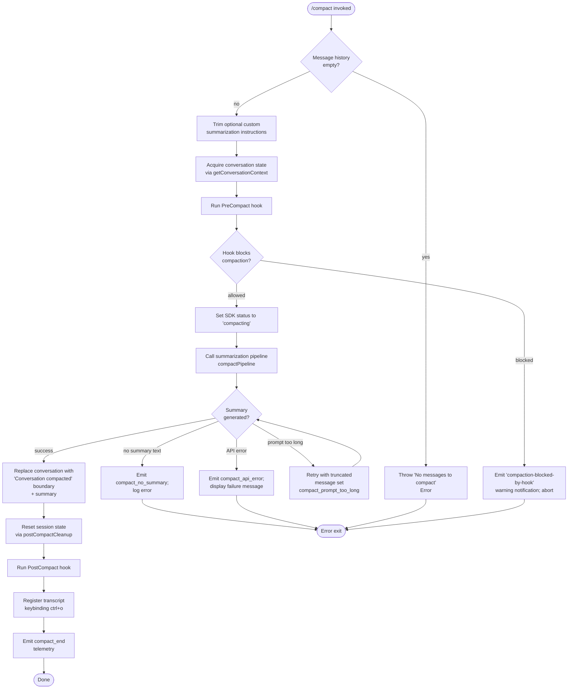

# `/compact`

> Analysis basis: CC v2.1.161 bundle.js (AST extraction + Claude interpretation)
> Minimum version: v2.1.161

---

## Overview

`/compact` frees up context window space by summarizing the current conversation into a condensed representation, replacing the full message history with a structured summary. It supports an optional argument for custom summarization instructions, can run non-interactively, and dispatches through the `post-text` thin-client path. The command fires `PreCompact` and `PostCompact` hooks, emits progress status updates, and terminates by resetting the session state.

---

## Registration

| Field | Value |
|---|---|
| type | `local` |
| name | `compact` |
| description | `Free up context by summarizing the conversation so far` |
| argumentHint | `<optional custom summarization instructions>` |
| supportsNonInteractive | `true` |
| thinClientDispatch | `post-text` |
| module_id | `rR1` |
| load_inline | `true` |
| loc_byte | `10934256` |
| loc_byte_end | `10934569` |
| loc_line | `7282` |
| arbor_handler.name | `rff` |
| arbor_handler.fqn | `claude-2.1.161::rff` |
| arbor_handler.kind | `AsyncFunction` |
| arbor_handler.resolution_path | `module_id` |
| arbor_handler.n_hits | `0` |

Analysis basis: CC v2.1.161 bundle.js:+10934256

---

## Input Branching

The handler contains more than three distinct branches depending on message count, hook outcomes, summarization API results, and error types.



---

## Behavioral Spec

### Handler Entry — `rff` (compactHandler)

Analysis basis: CC v2.1.161 bundle.js:+10933287

```
async function compactHandler(context):
    # Guard: require at least one message
    if conversationMessages is empty:
        raise Error("No messages to compact")

    customInstructions = context.args.trim()   # may be empty string

    # Gather full conversation context
    convCtx = await getConversationContext(context)   # calls jO, H.slice

    # Telemetry span
    span = startCompactionSpan("claude_code.compaction")  # calls q66 → H06

    # Run pre-compact hook
    hookResult = await runPreCompactHook(context)          # calls rc → VL → PreCompact
    if hookResult.blocked:
        emitNotification("compaction-blocked-by-hook",
                         severity="warning",
                         label="immediate")
        return

    # Status update
    setSDKStatus("compacting")                             # calls gkH → mW6.setState

    # Core summarization
    summary = await compactPipeline(convCtx,
                                    customInstructions,
                                    span)                  # calls off

    if summary is null:
        emitEvent("compact_no_summary")
        logError("Failed to generate conversation summary …")
        return

    # Inject compaction boundary into history
    replacedHistory = buildCompactedHistory(summary)
    # Boundary marker uses kind="system", tag="compact_boundary"

    # Post-compact cleanup
    await postCompactCleanup(context, replacedHistory)      # calls xa → various resets
    display("Conversation compacted")

    # Register transcript toggle keybinding
    registerKeybinding(
        action  = "app:toggleTranscript",
        scope   = "Global",
        binding = "ctrl+o")                                # calls nR1

    emitTelemetry("tengu_compact")                         # loc_byte 10076259
```

Analysis basis: CC v2.1.161 bundle.js:+10933287

---

### Summarization Pipeline — `off` (compactionPipelineCore)

Analysis basis: CC v2.1.161 bundle.js:+10929370

```
async function compactionPipelineCore(convCtx, customInstructions, span):
    startTime = performance.now()

    # Build system prompt for the summarization sub-agent
    sysPrompt = buildSummarizationSystemPrompt()   # calls PZ → mHf
    # System prompt instructs: "You are a helpful AI assistant tasked
    # with summarizing conversations."   (literal at +10086170)

    # Assemble message list for the summarization request
    messages = buildContextMessages(convCtx)       # calls iR1 → lG → Im …

    # Launch the summarization query turn
    result = await runSummarizationQuery(           # calls aff
                messages  = messages,
                systemPrompt = sysPrompt,
                customInstructions = customInstructions,
                span = span)

    if result.status == "aborted":
        emitEvent("aborted")
        return null

    if result.status == "miss_not_ready":
        emitEvent("miss_not_ready")
        return null

    if result.status == "prompt_too_long":
        emitEvent("compact_prompt_too_long")
        # Retry with a smaller message window (0.2 fraction; literal +10071909)
        return await retryWithReducedWindow(convCtx, customInstructions, span)

    if result.summaryText is empty:
        emitEvent("compact_no_summary")
        return null

    elapsed = performance.now() - startTime
    emitTelemetry("tengu_compact", {elapsed, tokens: result.usage})

    return result.summaryText
```

Analysis basis: CC v2.1.161 bundle.js:+10929370

---

### Summarization Sub-turn — `aff` (runSummarizationQuery)

Analysis basis: CC v2.1.161 bundle.js:+10931586

```
async function runSummarizationQuery(messages, systemPrompt, customInstructions, span):
    startTime = performance.now()

    # Wait for any pending agent signal
    signal = await waitForAgentSignal()              # sh_ → Promise.race

    turnResult = await executeTurn(                  # eoH → jO8
                    messages  = messages,
                    systemPrompt = systemPrompt,
                    toolUsePolicy = "deny",          # tool use blocked during compaction
                    customInstructions = customInstructions)

    # Validate response
    if turnResult has no text content:
        return {status: "no_summary"}

    # Trim boundary to find first assistant message
    trimmed = findFirstAssistantBoundary(turnResult) # th_

    summaryText = extractSummaryText(turnResult)     # PO8

    return {
        status:      "success",
        summaryText: summaryText,
        usage:       turnResult.usage
    }
```

Analysis basis: CC v2.1.161 bundle.js:+10931586

---

### Context Assembly — `iR1` (assembleCompactionContext)

Analysis basis: CC v2.1.161 bundle.js:+10932774

```
async function assembleCompactionContext(context):
    appState = H.getAppState()

    # Build ordered message list for compaction
    lastBoundary = findLastCompactBoundary(appState)  # C_ → A.findLast
    messages     = Array.from(appState.messages)

    # Build system prompt components
    sysPromptParts = buildSystemPromptParts(context)   # Im → H.getSystemPrompt

    [hooks, memory] = await Promise.all([
        loadHooksContext(context),      # oD
        loadMemoryContext(context)      # mw
    ])

    return {messages, sysPromptParts, hooks, memory}
```

Analysis basis: CC v2.1.161 bundle.js:+10932774

---

### Post-Compact Cleanup — `xa` (postCompactCleanup)

Analysis basis: CC v2.1.161 bundle.js:+10929577

```
function postCompactCleanup(context, compactedHistory):
    # Drain pending streams / tool ops
    drainPendingOperations()   # XO8 → wO8, Uu.get/delete

    # Clear caches
    clearCaches()              # EO8 → lN1.clear; ER9 → pW6.clear, nh_.clear

    # Reset autonomous-loop delivered counter
    Rf7.resetAutonomousLoopDelivered()

    # Restore compacted history into app state
    replaceConversationHistory(compactedHistory)   # JR9 → H; NJH → H, _

    # Emit post_compact event for hook dispatch
    emitEvent("post_compact")   # via CB path at +6734802

    # Reset output-token counters and UI state
    resetDisplayState()         # gkH → mW6.setState
    notifySubscribers(Yj)       # Object.values of subscriber map
```

Analysis basis: CC v2.1.161 bundle.js:+10929577

---

### Compact Boundary Injection — `jO` / `ON8` (buildCompactBoundary)

Analysis basis: CC v2.1.161 bundle.js:+10634450

```
function buildCompactBoundary(summaryText):
    # Marker message inserted at position 0 (number literal +10634509)
    # after the compacted window (position 1, literal +10634504)
    boundaryMessage = {
        role:    "system",          # literal "system"   +10634428
        tag:     "compact_boundary",# literal            +10634450
        content: summaryText
    }
    # Display string: "Conversation compacted"   literal +10634006
    return [boundaryMessage]
```

Analysis basis: CC v2.1.161 bundle.js:+10634450

---

### PreCompact Hook Dispatch — `rc` / `VL` (runPreCompactHook)

Analysis basis: CC v2.1.161 bundle.js:+13143630

```
async function runPreCompactHook(context):
    # Enumerate hooks with type == "PreCompact"   (literal +13143657)
    hooks = filterHooks(context, type="PreCompact")

    results = await Promise.all(hooks.map(h => executeHook(h, context)))

    for result in results:
        if result.decision == "block":
            return {blocked: true, reason: result.reason}

    return {blocked: false}
```

Analysis basis: CC v2.1.161 bundle.js:+13143630

---

### Compaction Agent Tool-Use Guard — `WG1` inner check

Analysis basis: CC v2.1.161 bundle.js:+10083828

```
function compactionAgentToolUseGuard(toolRequest):
    # During compaction the sub-agent must produce only a text summary
    if toolRequest is present:
        return {decision: "deny",
                reason: "Tool use is not allowed during compaction"}
    # If response is not text:
    if responseType != "text":
        logWarning("compaction agent should only produce text summary")
    return {decision: "allow"}
```

Analysis basis: CC v2.1.161 bundle.js:+10083843

---

### Reactive Compact Pathway — `DO8` / `AS_` (reactiveCompactPipeline)

`/compact` shares the `off` pipeline; reactive (automatic) compaction uses `AS_` which itself calls `TO8` → `DO8`. The manual command always sets `trigger="manual"` (literal `+10929446`).

Analysis basis: CC v2.1.161 bundle.js:+10929961

```
function reactiveCompactTrigger(context):
    # Automatic path — distinct from manual /compact
    trigger = "manual"   # for /compact (literal +10929446)
    # trigger = "reactive_compact" for automatic path

    if messageGroups < 2:
        logDebug("Reactive compact: fewer than 2 groups, nothing to compact")
        emitEvent("too_few_groups")
        return

    return compactionPipelineCore(context, trigger=trigger)
```

Analysis basis: CC v2.1.161 bundle.js:+10929961

---

## State & Side Effects

| Item | Detail |
|---|---|
| Telemetry — primary | `tengu_compact` (loc_byte 10076259) |
| Telemetry — span | `claude_code.compaction` span opened via `H06` (loc_byte 10073066) |
| Telemetry — failure | `tengu_compact_failed` (loc_byte 10087449), `tengu_compact_ptl_retry` (loc_byte 10074318) |
| Telemetry — cache sharing | `tengu_compact_cache_prefix` (10073842), `tengu_compact_cache_sharing_success` (10084720), `tengu_compact_cache_sharing_fallback` (10085350) |
| Telemetry — precomputed | `tengu_precomputed_compact_consumed` (6728075), `tengu_precomputed_compact_discarded` (6728694) |
| Telemetry — post-restore | `tengu_post_compact_file_restore_success` (10087935), `tengu_post_compact_file_restore_error` (10087977) |
| Telemetry — reactive | `tengu_reactive_compact_succeeded` (6735398), `tengu_reactive_compact_failed` (6733017), `tengu_reactive_compact_attempt` (6714807) |
| Status string emitted | `"compacting"` set on SDK status channel (loc_byte 10929349) |
| Progress events | `compact_progress`, `hooks_start`, `pre_compact`, `sdk_status`, `compact_start`, `compact_end` (literals at 10929233–10931205) |
| Hook registration | `PreCompact` hook fired before summarization; `PostCompact` hook fired after history replacement |
| appState changes | Conversation history replaced with single `compact_boundary` system message + summary; display state reset |
| Keybinding registered | `app:toggleTranscript` → `ctrl+o` scope `Global` (literal 10932611) |
| Cache operations | LRU caches `lN1`, `pW6`, `nh_` are cleared on cleanup |
| Autonomous-loop counter | `Rf7.resetAutonomousLoopDelivered()` called |
| Tool use during compaction | Blocked — returns `deny` with message `"Tool use is not allowed during compaction"` |
| Sound | <!-- TODO: not found in depth-2 traversal; needs --depth 4 --> |

---

## Version History

| Version | Change |
|---|---|
| v2.1.161 | Initial analysis |

---

## Common Mistakes

1. **Passing instructions that conflict with summarization**: Custom instructions (the optional argument) are forwarded verbatim to the summarization agent. Instructions that tell the agent to use tools will be silently blocked by the tool-use guard (loc_byte 10083843), producing an empty or incomplete summary.
2. **Running `/compact` on an empty session**: If no messages exist the handler immediately throws `"No messages to compact"` (loc_byte 10933318) before any network call is made.
3. **Expecting `/compact` to honour stop-hooks**: The literals at loc_byte 13198511 confirm that prompt stop hooks are not yet supported outside the REPL, so any `Stop`-type hook will not fire around a manual compact.
4. **Interrupting mid-compaction**: Aborting while the summarization sub-turn is running produces `status="aborted"` and leaves the history unchanged — the next `/compact` will restart from the full original history.
5. **Assuming the summary preserves all file content**: The `"Do NOT read this resource again unless you think it may have changed …"` instruction (loc_byte 10624848) is injected for MCP resources but not for local file tool results, so file content referenced during compaction may be paraphrased rather than reproduced exactly.

---

## Appendix — Identifier Mapping

> For bundle debugging only. Identifiers change across versions.

| Identifier | Role |
|---|---|
| `rff` | Main async handler for `/compact` (compactHandler) |
| `jO` | Build compact-boundary history slice |
| `ON8` | Insert compact-boundary message at position 0 |
| `sj` | Serialise message to API wire format |
| `off` | Core compaction pipeline (compactionPipelineCore) |
| `aff` | Summarization sub-turn executor (runSummarizationQuery) |
| `sh_` | Async signal waiter (waitForAgentSignal) |
| `eoH` | Execute turn for summarization agent |
| `jO8` | Inner turn dispatch helper |
| `th_` | Find first assistant message boundary after compaction |
| `PO8` | Extract summary text and token usage from turn result |
| `iR1` | Assemble full compaction context (assembleCompactionContext) |
| `lG` | Build system-prompt component list |
| `Im` | Build system prompt from agent memory and instructions |
| `C_` | Find last compact-boundary message in history |
| `BN8` | Extract working-directory from app state |
| `FN8` | Extract allowed-tools list from app state |
| `rc` | Run PreCompact hook and await results |
| `VL` | Hook execution dispatcher |
| `zLA` | Filter and classify hooks by type |
| `z0` | Execute a single hook (shell/HTTP/MCP) |
| `xa` | Post-compact cleanup (postCompactCleanup) |
| `XO8` | Drain pending stream operations |
| `EO8` | Clear LRU cache `lN1` |
| `ER9` | Clear caches `pW6` and `nh_` |
| `JR9` | Restore compacted history into app state H |
| `NJH` | Reset display state variables H and _ |
| `gkH` | Set `mW6` state (SDK status) |
| `nR1` | Register transcript-toggle keybinding |
| `CaH` | Register keybinding action in global registry |
| `dP` | Keybinding dedup / fallback helper |
| `wjH` | Emit `compact_end` metric with token counts |
| `N4` | OTEL metric emitter |
| `SIH` | Build OTEL resource attributes |
| `q66` | Compaction query loop (runCompactionQueryLoop) |
| `WG1` | Compaction agent query orchestrator |
| `p7K` | Main API query pipeline |
| `Qr_` | Context normalisation and attachment builder |
| `mHf` | Build summarization system-prompt body |
| `lwH` | Inject context-window usage hint into system prompt |
| `PZ` | Prompt-assembly utility |
| `DO8` | Reactive compact message-grouping logic |
| `AS_` | Reactive compact trigger wrapper |
| `Zf7` | Reactive compact summarisation sub-call |
| `TO8` | Post-compact state reconciliation after reactive compact |
| `hJH` | Build compacted message list after reactive compact |
| `bf7` | Parallel context-loader (tools, hooks, memory) |
| `VO8` | Load MCP tool context |
| `kO8` | Load local-agent tool context |
| `NO8` | Load deferred-tool context |
| `IO8` | Load plan-file context |
| `vO8` | Load plan context |
| `x7H` | Load tool-search context |
| `ckH` | Build allowed/disallowed tool sets |
| `lkH` | Build tool display list |
| `CB` | Session-start hook and plugin loader |
| `xG` | Normalise messages for API submission |
| `t38` | Count token usage per message group |
| `e38` | Compute rounded elapsed time |
| `Yf7` | Per-message token tracking map builder |
| `c5` | Round token count helper |
| `mu` | Sanitise sensitive strings from display (path redaction) |
| `iD` | Compute context-efficiency ratio |
| `NG` | Resolve model capability flags (kW + iV) |
| `d$` | Get appState for display |
| `uK` | Retrieve user/auth identity |
| `yq` | Generate random UUID for compaction session |
| `MR9` | Compute max/floor for message-group sizing |
| `bB` | Check if value is an Array |
| `JG1` | Trim conversation to target token window |
| `hnH` | Detect and parse `<summary>` wrapper in responses |
| `RLH` | Check if response contains summary-type content block |
| `WE_` | Extract token count from `<summary>` tag attributes |
| `JI` | Check if message role starts with expected prefix |
| `a66` | Compact-cache-sharing coordinator |
| `Ur_` | Build cache-sharing payload |
| `Hv` | Rotate compaction output-token LRU cache |
| `bgL` | LRU cache get/set wrapper |
| `XG1` | Post-turn summary emitter |
| `Ei` | Emit status or progress event to UI |
| `akH` | Set status string on current session |
| `yr_` | Build display metadata for compact result |
| `roH` | Retrieve current context-utilisation ratio |
| `zO8` | Trim whitespace from summary text |
| `WG1` | (see above) Compaction query orchestrator |
| `vZ` | Retrieve version information |
| `$w6` | Load memory/CLAUDE.md content for system prompt |
| `OR9` | Compute reactive-compact context from signal |
| `Rjq` | Heron-brook flag evaluator |
| `ixf` | Autonomy-append system-prompt injector |
| `sxf` | Context-management instructions injector |
| `txf` | Verified-vs-assumed workflow injector |
| `exf` | Reproduction/verify workflow injector |
| `Huf` | Tool-permission context injector |
| `Duf` | Output-style / scratchpad injector |
| `Yuf` | Context-management reminder injector |
| `juf` | Brief-mode flag checker |
| `Xuf` | Focus-mode system-prompt injector |
| `Luf` | Base system-prompt builder |
| `nxf` | Session-start custom-instruction trimmer |
| `cxf` | Task-continuity prompt injector |
| `axf` | Language/output-style injector |
| `Kuf` | SDK base-prompt selector |
| `quf` | Session-specific guidance injector |
| `Ouf` | Environment-info injector (simple) |
| `$uf` | Environment-info injector (full) |
| `Auf` | Memory-schedule context injector |
| `Wuf` | Worktree-aware system-prompt wrapper |
| `ilq` | Team-memory/memdir loader |
| `RDH` | Anthropic-AWS region resolver |
| `cZ8` | MCP connected-servers enumerator |
| `vLA` | SDK system-prompt base selector |
| `d36` | Task-continuity flag reader |
| `Qxf` | Code-style reminder injector |
| `dxf` | Confirmation-before-action injector |
| `t_` | Retrieve session tool-permission state |
| `C$` | Get current session configuration value |

Note: index built via Arbor fallback; some signals (telemetry, literals) may be missing — see arbor-fallback.js.