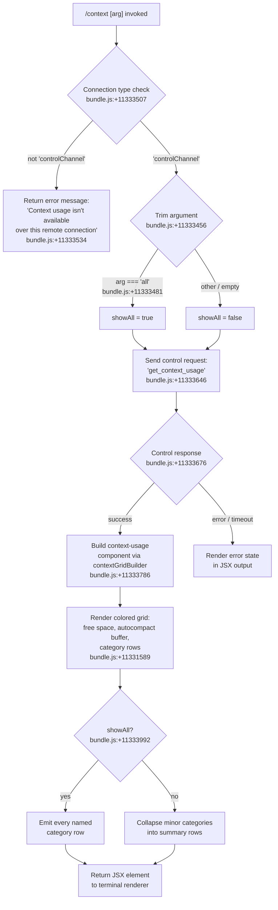

# `/context`

> Analysis basis: CC v2.1.161 bundle.js (AST extraction + Claude interpretation)
> Minimum version: v2.1.161

---

## Overview

The `/context` command visualizes the current context window usage as a colored grid rendered in the terminal. It dispatches a `get_context_usage` control request over the session's control channel, then renders a JSX grid that breaks down token consumption across system prompt, tools, memory files, messages, and other named categories. An optional `all` argument expands the display to show every category individually.

---

## Registration

| Field | Value |
|---|---|
| type | `local-jsx` |
| name | `context` |
| description | `Visualize current context usage as a colored grid` |
| argumentHint | `[all]` |
| thinClientDispatch | `control-request` |
| module_id | `kx1` |
| load_inline | `true` |
| loc_byte | `11334856` |
| loc_byte_end | `11335082` |
| loc_line | `7335` |
| arbor_handler.name | `t3f` |
| arbor_handler.fqn | `claude-2.1.161::t3f` |
| arbor_handler.kind | `AsyncFunction` |
| arbor_handler.resolution_path | `module_id` |
| arbor_handler.n_hits | `0` |

Analysis basis: CC v2.1.161 bundle.js:+11334856

---

## Input Branching

Four distinct execution paths exist depending on connection type, argument value, and control-channel availability, requiring a Mermaid flowchart.



---

## Behavioral Spec

### Handler Entry — `contextCommandHandler` (bundle identifier: `t3f`)

The handler is an `AsyncFunction` resolved by Arbor via the `module_id` path.

```
async function contextCommandHandler(args, sessionContext):
    trimmedArg = args.trim()                          // bundle.js:+11333456

    connectionType = getConnectionType(sessionContext) // bundle.js:+11333507
    if connectionType != "controlChannel":
        return errorMessage(
            "Context usage isn't available over this remote connection"
        )                                              // bundle.js:+11333534

    showAll = (trimmedArg == "all")                   // bundle.js:+11333481

    response = await sessionContext.sendControlRequest(
        "get_context_usage"                           // bundle.js:+11333646
    )

    usageData = parseControlResponse(response)        // bundle.js:+11333676

    gridElement = buildContextGridComponent(
        usageData,
        showAll,
        sessionContext
    )                                                 // bundle.js:+11333786

    systemPromptSection = buildSection("System prompt", usageData.systemPrompt)
                                                      // bundle.js:+10105652
    toolsSections = [
        buildSection("System tools",   usageData.systemTools),    // +10105731
        buildSection("MCP tools",      usageData.mcpTools),       // +10105795
        buildSection("Memory files",   usageData.memoryFiles),    // +10106113
        buildSection("Skills",         usageData.skills),         // +10106175
        buildSection("Messages",       usageData.messages),       // +10106677
    ]

    return renderJSXGrid(systemPromptSection, toolsSections, gridElement)
                                                      // bundle.js:+11333680
```

Analysis basis: CC v2.1.161 bundle.js:+11333450

---

### Context Grid Builder — `contextGridBuilder` (bundle identifier: `uk6`)

Constructs the per-category colored grid. Called from the main handler after the control response is available.

```
function contextGridBuilder(usageData, showAll):
    // Filter to categories with non-zero usage
    activeCategories = usageData.categories.filter(c => c.tokens > 0)
                                                     // bundle.js:+11331554

    // Locate the compact boundary marker
    compactBoundaryCategory = activeCategories.find(
        c => c.name == "compact_boundary"            // bundle.js:+10634450
    )                                                // bundle.js:+11331872

    rows = []
    for category in activeCategories:
        label  = String(category.label)              // bundle.js:+11332790
        pct    = computePercentage(category.tokens, usageData.total)
        color  = assignCategoryColor(category.name)
        rows.append(buildRow(label, pct, color))

    // Special named rows always present
    freeSpaceRow = buildRow("Free space", computeFreeSpace(usageData))
                                                     // bundle.js:+11331589
    autocompactRow = buildRow(
        "Autocompact buffer",
        computeAutocompactBuffer(usageData)
    )                                                // bundle.js:+11331612

    // Setting source labels shown in detail view
    settingsSourceMap = {
        "projectSettings": "Project",               // bundle.js:+11332538/11332558
        "userSettings":    "User",                  // bundle.js:+11332578/11332595
        "localSettings":   "Local",                 // bundle.js:+11332612/11332630
        "plugin":          "Plugin",                // bundle.js:+11332720/11332731
        "built-in":        "Built-in",              // bundle.js:+11332750/11332763
        "mcp":             "MCP",                   // bundle.js:+11332720/11332720
    }

    if not showAll:
        rows = collapseMinorRows(rows)               // bundle.js:+11333992

    return GridComponent(rows, freeSpaceRow, autocompactRow)
```

Analysis basis: CC v2.1.161 bundle.js:+11333786

---

### Percentage Formatter — `formatPercent` (bundle identifier: `Ce`)

Formats token counts as locale-formatted percentage strings for grid display.

```
function formatPercent(usedTokens, totalTokens):
    ratio    = getTokenRatio(usedTokens, totalTokens)  // bundle.js:+210403
    rounded  = Math.round(ratio * 100)                 // bundle.js:+210475
    if rounded < 20:
        label = "< 20"                                 // bundle.js:+210455
    else:
        label = formatLocale(rounded, "en-US", "compact") // bundle.js:+212425/212443
    return label + ".0"                                // bundle.js:+210417
```

Analysis basis: CC v2.1.161 bundle.js:+11333289

---

### Threshold Constants

| Constant | Value | Source |
|---|---|---|
| Low-usage threshold | `20` (percent) | bundle.js:+210446 |
| "< 20" label string | `"< 20"` | bundle.js:+210455 |
| High-usage warning threshold | `80` (percent) | bundle.js:+11333992 |
| Token threshold (1 M context) | `1 000 000` | bundle.js:+2973706 |

---

### Control-Request Dispatch — `sendControlRequest` (bundle identifier: `K.sendControlRequest`)

The command sends a single named control request and awaits a single response via the established control channel.

```
async function sendControlRequest(requestName):
    // requestName = "get_context_usage"         bundle.js:+11333646
    request = {
        type: "control_request",                 // bundle.js:+12528149
        uuid: generateUUID(),                    // bundle.js:+12528900
        request: requestName,
    }
    response = await controlChannel.send(request)
    if response.type != "control_response":      // bundle.js:+12528039
        throw ProtocolError(response)
    return response.data
```

Analysis basis: CC v2.1.161 bundle.js:+11333616

---

### Response Listener / Event Handling — `controlResponseListener` (bundle identifier: `StH`)

Registers a one-shot `data` event listener on the control channel to capture the response JSX element, then creates it via React.

```
function controlResponseListener(controlChannel, onData):
    controlChannel.on("data", function(chunk):    // bundle.js:+7898363/7898368
        payload = chunk.toString()                // bundle.js:+7898400
        element = renderUIComponent(payload)      // bundle.js:+7898427
        onData(element)
    )
    return createElement(vAHComponent, ...)       // bundle.js:+7898430
```

Analysis basis: CC v2.1.161 bundle.js:+11333676

---

### Auto-Compact Window Logic — `compactWindowCalculator` (bundle identifier: `ll`)

Determines the auto-compact window size from environment variable, settings, or experiment flags. The result governs the "Autocompact buffer" row in the grid.

```
function compactWindowCalculator(sessionState):
    // 1. Environment override
    envVal = process.env["CLAUDE_CODE_AUTO_COMPACT_WINDOW"]
                                                  // bundle.js:+10092177
    if envVal is set and valid integer:
        return { value: parseInt(envVal), source: "env" }
                                                  // bundle.js:+10092369

    // 2. Settings override
    settingsVal = getSettingsAutoCompactWindow(sessionState)
    if settingsVal is defined:
        return { value: settingsVal, source: "settings" }
                                                  // bundle.js:+10092439

    // 3. Experiment / feature flag
    experimentVal = getExperimentValue(sessionState)
    if experimentVal is defined:
        return { value: experimentVal, source: "experiment" }
                                                  // bundle.js:+10092526

    // 4. Hard bounds
    result = Math.max(lower, Math.min(upper, defaultWindow))
                                                  // bundle.js:+10092295/10092335
    return { value: result, source: "auto" }      // bundle.js:+10091603
```

Analysis basis: CC v2.1.161 bundle.js:+10092100

---

### Named Grid Category Labels

The following string constants define each labeled section of the context grid (all confirmed in literals):

| Grid Label | Internal Key | Source Byte |
|---|---|---|
| `"System prompt"` | `systemPrompt` | +10105652 |
| `"System tools"` | `systemTools` | +10105731 |
| `"MCP tools"` | `mcpTools` | +10105795 |
| `"MCP tools (deferred)"` | `mcpToolsDeferred` | +10105871 |
| `"System tools (deferred)"` | `systemToolsDeferred` | +10105957 |
| `"Custom agents"` | `customAgents` | +10106046 |
| `"Memory files"` | `memoryFiles` | +10106113 |
| `"Skills"` | `skills` | +10106175 |
| `"Messages"` | `messages` | +10106677 |
| `"Free space"` | derived | +11331589 |
| `"Autocompact buffer"` | derived | +11331612 |

Analysis basis: CC v2.1.161 bundle.js:+11333786

---

## State & Side Effects

| Item | Detail |
|---|---|
| Telemetry | `tengu_amber_creek` (bundle.js:+3419112), `tengu_pewter_brook` (bundle.js:+3419020), `tengu_amber_redwood2` (bundle.js:+10091988), `tengu_amber_redwood3` (bundle.js:+10091873) — fired along the context-usage/auto-compact call graph |
| Control request | Emits a `get_context_usage` control request over the `controlChannel` transport (bundle.js:+11333646) |
| appState changes | Read-only; no mutations to session or conversation state |
| Hook registration | One-shot `data` event listener registered on the control channel during response wait (bundle.js:+7898363); removed after first event |
| Sound | None |
| Rendering | Returns a JSX element; the terminal renderer paints a colored grid inline (type: `local-jsx`) |

---

## Version History

| Version | Change |
|---|---|
| v2.1.161 | Initial analysis |

---

## Common Mistakes

1. **Using `/context` over a non-control-channel connection** (e.g., a plain remote SSH session without the IDE bridge): the command immediately returns "Context usage isn't available over this remote connection" (bundle.js:+11333534) and displays no grid.
2. **Expecting real-time updates**: `/context` is a one-shot snapshot. It dispatches one control request and renders once; it does not stream or auto-refresh.
3. **Misreading the "< 20" label**: categories consuming fewer than 20 % of the context window are labeled `"< 20"` rather than their exact percentage (bundle.js:+210455). This is intentional compact formatting, not a rendering bug.
4. **Ignoring the `[all]` argument**: without `all`, minor-use categories are collapsed into summary rows. Pass `/context all` to see per-category detail for every non-zero entry.
5. **Confusing "Autocompact buffer" with available space**: the autocompact buffer is a reserved window whose size is governed by `CLAUDE_CODE_AUTO_COMPACT_WINDOW`, settings, or experiment flags — it is not freely usable token space.

---

## Appendix — Identifier Mapping

> For bundle debugging only. Identifiers change across versions.

| Identifier | Role |
|---|---|
| `t3f` | Main async handler for `/context` command (`contextCommandHandler`) |
| `qq` | Session/connection state accessor |
| `ne` | Connection-type membership check |
| `pJ_` | Color-support probe (terminal capability) |
| `v1` | Token ratio / numeric formatter helper |
| `pH` | String-to-color mapping utility |
| `Do` | Fullscreen-mode detector |
| `j0L` | Terminal environment resolver (tmux/iTerm detection) |
| `w0L` | Terminal prefix-string checker (`startsWith`) |
| `N` | General settings/config loader |
| `VBK` | Settings object builder |
| `HwA` | Named settings merger |
| `H` | Bootstrap / HTTP fetch utility (also reused as generic local var) |
| `s$` | Session store getter |
| `Ij` | String replacement helper |
| `lq` | Token-counting pipeline entry |
| `t6` | Logging/debug helper |
| `SH` | `JSON.stringify` wrapper |
| `Z4` | Path utilities (basename/extension) |
| `CJA` | Path-segment mapper |
| `imH` | File-write helper |
| `GJA` | Stream-write wrapper |
| `IBK` | Settings persistence layer |
| `WmH` | Debounce/batch timer manager |
| `_3H` | Settings-file path builder |
| `BJA` | Settings directory joiner |
| `UJA` | Atomic file-rename helper |
| `NBK` | Settings append-file writer |
| `Y9` | Hook/event registrar |
| `mJ_` | OS/platform detector |
| `t_` | Context-state accessor |
| `np` | Settings-load orchestrator |
| `ZT` | Settings-load start marker |
| `C9` | Memory-usage sampler |
| `We8` | Settings file reader |
| `TQ` | Merged-settings builder |
| `bx6` | Settings-load end marker |
| `J0L` | Fullscreen/render-mode coordinator |
| `j6` | Message/conversation state accessor |
| `gY6` | Message list initializer |
| `QY6` | Message ID generator |
| `Qx` | Message color/attribute resolver |
| `Lq8` | Message deduplication tracker |
| `y6` | Conversation-turn builder |
| `OL` | Control-channel type resolver |
| `WEH` | Control-channel factory |
| `ei` | Control-channel mode detector |
| `K` | Control-channel send/pad wrapper |
| `L` | Active-connection set manager |
| `f` | Connection closer |
| `StH` | Control-channel response listener (registers `data` event) |
| `aU` | React element factory helper |
| `Q2_` | React `createElement` thin wrapper |
| `So` | Session UI component root |
| `VlH` | Session layout component |
| `uk6` | Context grid builder (`contextGridBuilder`) |
| `u1` | Token-ratio computer |
| `IK` | Token-count accessor |
| `hBK` | Raw token-count getter |
| `LBH` | Category-label formatter |
| `Ce` | Percentage formatter (`formatPercent`) |
| `TH` | String constructor wrapper |
| `s3f` | Compact-boundary locator |
| `jO` | Compact-boundary slice helper |
| `ON8` | Compact-boundary tag extractor |
| `sj` | Compact-boundary sentinel value |
| `CV8` | System-prompt context assembler (main prompt builder) |
| `QT` | Model/provider resolver |
| `xHH` | Provider-string normalizer |
| `NT` | Provider constant (normalized type) |
| `o9H` | Provider-object builder |
| `nQ` | Model-string parser |
| `KG` | Provider-type classifier |
| `UM` | First-party provider builder |
| `Vf` | Bedrock/Vertex/gateway provider builder |
| `PA` | Base provider record constructor |
| `aN` | Fallback provider builder |
| `uG` | Auto-compact config reader |
| `h4` | Legacy global-config reader |
| `JV` | Managed-settings set manager |
| `m8` | Token-limit getter |
| `ll` | Auto-compact window calculator (`compactWindowCalculator`) |
| `_9` | Model capability lookup |
| `Aa6` | Context-state entry builder |
| `bP` | Model-string normalizer |
| `kF8` | Capability key builder |
| `IV` | Context window limit resolver |
| `x0` | Context window lower-bound enforcer |
| `DU` | Claude-3 context window calculator |
| `uHH` | Claude-3 context window builder |
| `Q88` | Context window record constructor |
| `E0` | Empty context-window sentinel |
| `a8H` | Auto-compact env/settings parser |
| `IG1` | Context-window source selector |
| `B_` | Session config reader |
| `vr_` | Numeric string parser (float/int with unit) |
| `lG` | System-prompt assembler (main sub-function) |
| `vLA` | Prompt-header builder |
| `h6` | AsyncLocalStorage context getter |
| `sg6` | Store getter helper |
| `P_` | Cross-platform newline resolver |
| `cZ8` | MCP-server section builder |
| `vZ` | Prompt-section joiner |
| `Qxf` | Code-style rule injector |
| `dxf` | Cautious-action rule injector |
| `d36` | Task-continuity instruction injector |
| `cxf` | Prompt-section cache builder |
| `yLA` | Additive-section builder |
| `Wuf` | Additive-section wrapper |
| `Auf` | Full system-prompt section assembler |
| `Bg` | Session-context reader |
| `sP` | SDK-client-type resolver |
| `_uf` | Disabled-feature section builder |
| `lI_` | Prompt-section list builder |
| `ZC` | Feature-flag reader |
| `iL` | Schedule/routines injector |
| `oF` | Async-hook section injector |
| `IF` | Flat-map section reducer |
| `$w6` | Memory-prompt builder |
| `z4` | Working-directory resolver |
| `Q4H` | Memory-directory creator |
| `Ao` | Memory file/directory classifier |
| `hH` | File-read helper |
| `Sw` | Memory-section formatter |
| `Ulq` | Memory-path joiner |
| `plq` | Memory-file list reader |
| `mlq` | Memory-file content loader |
| `nj_` | Memory-file formatter |
| `d` | Generic file-stat helper |
| `Ouf` | OS/shell environment section builder |
| `Nj` | Model-name display formatter |
| `NLA` | Shell/OS info collector |
| `$uf` | Static environment-info builder |
| `kLA` | OS-version info collector |
| `DM` | Additional-directories formatter |
| `ILA` | Shell-type detector |
| `rxf` | Language/locale section injector |
| `oxf` | Output-style section injector |
| `Duf` | Background-session section builder |
| `uB_` | Worktree detector |
| `Yuf` | Scratchpad section builder |
| `w9H` | Scratchpad message collector |
| `rWH` | Scratchpad path builder |
| `juf` | Brief-mode feature checker |
| `Xuf` | Context-management section builder |
| `Luf` | System-prompt finalizer |
| `nxf` | Heron-Brook section builder |
| `Rjq` | Autonomy-append section builder |
| `ixf` | Reproduce-verify section builder |
| `OR9` | Tool-cache section builder |
| `B$H` | Tool-cache initializer |
| `GF8` | Tool-cache compute helper |
| `Kuf` | System-prompt VLA wrapper |
| `axf` | Custom-agent section builder |
| `sxf` | Auto-compact reminder injector |
| `lxf` | Auto-compact reminder text builder |
| `txf` | Verified-vs-assumed section injector |
| `exf` | Additive section via yLA |
| `Huf` | Tone/style section builder |
| `c0` | CLI/remote client-type builder |
| `quf` | Tool-use instruction section builder |
| `ilq` | Memory-load-prompt section builder |
| `nlq` | Memory-load-prompt inner builder |
| `RDH` | Role/persona section builder |
| `kV` | Persona classifier |
| `l7` | Persona string resolver |
| `Im` | Agent memory loader |
| `uK` | Agent memory store key |
| `G2` | Memory-type classifier |
| `IT` | Memory-type constant |
| `E1` | Memory-object builder |
| `v_` | Module loader bootstrap |
| `rb6` | Module-bind helper |
| `M` | Plugin/staged-file manager |
| `nC6` | Plugin-path normalizer |
| `Vz` | System-prompt getter |
| `OHf` | Per-server MCP tool collector |
| `$Hf` | MCP tool-definition parser |
| `xV8` | Per-MCP-server context builder |
| `zuf` | MCP-server environment-info builder |
| `rlq` | MCP-server memory-prompt builder |
| `_7K` | MCP server-name extractor |
| `x86` | Token counter / message analyzer |
| `tRH` | Token-count API caller |
| `yH` | Tool-use logger |
| `hG1` | Message token counter |
| `zHf` | System-prompt token aggregator |
| `DX6` | Auto-memory filter |
| `DHf` | Conversation history assembler |
| `w2H` | Message-batch processor |
| `uV8` | Per-message token/category annotator |
| `z` | Daemon-stop sequence |
| `RH` | File-read wrapper |
| `ly` | Tool-use queue manager |
| `qp` | Race/all promise combiner |
| `W` | MCP server connection manager |
| `Y16` | Server connection initializer |
| `a_` | Error string builder |
| `P` | Protocol message reader |
| `J` | JSON stream parser |
| `w` | Worker/spawn process manager |
| `e5` | Stream-end helper |
| `Y95` | Session message dispatcher |
| `jHf` | Message context annotator |
| `c5` | Math round helper |
| `O` | Process-output collector |
| `u8` | Output-buffer accumulator |
| `Y` | Forced-shutdown handler |
| `WJ` | Shutdown signal sender |
| `JHf` | MCP-tool context annotator |
| `YHf` | Built-in tool context annotator |
| `tI_` | Tool-type classifier |
| `j_H` | Tool-filter helper |
| `yG1` | Tool-group resolver |
| `kK` | Cached tool-definition getter |
| `EHf` | Category-token accumulator |
| `PHf` | Category-record initializer |
| `XHf` | Category-record updater |
| `WHf` | Category-record finalizer |
| `xG` | Message normalizer for API |
| `d1f` | Thinking-block extractor |
| `ys_` | System-block stripper |
| `o1f` | Media-rejection checker |
| `r1f` | Content-type router |
| `a1f` | Array-type guard |
| `$` | Global key-value store |
| `h` | Focus/blur activity tracker |
| `KN8` | Tool-use validator |
| `$Kf` | UUID generator (randomUUID) |
| `C8` | Conversation-ID builder |
| `tG` | Turn-metadata builder |
| `Ol_` | Orphan-thinking stripper |
| `LN8` | Content-block list builder |
| `gI` | Standard-tool entry builder |
| `bs_` | Multi-part content flattener |
| `c1f` | Tool-result content builder |
| `Z` | Set/collection tracker |
| `V` | Version/capability set |
| `l1f` | Array-type content checker |
| `MKf` | MCP-tool prefix normalizer |
| `v4` | Value-existence guard |
| `vk1` | Content-block validator |
| `t1f` | Deferred-tool collector |
| `Lk1` | Message-list appender |
| `Qr_` | System-block injector (full message normalizer) |
| `OKf` | Tool-name list joiner |
| `G` | Remote-control startup handler |
| `s1f` | Token-block merger |
| `XV6` | Orphaned-thinking block filter |
| `XKf` | Trailing-thinking block filter |
| `PV6` | Whitespace-only assistant filter |
| `WKf` | Empty-assistant-content fixer |
| `e1f` | Content-block slicer |
| `Kk1` | Tool-use reorderer for thinking |
| `fk1` | Content-block push helper |
| `i1f` | Multi-block joiner |
| `wHf` | Built-in tool context builder |
| `eI_` | Built-in tool-type resolver |
| `LG` | Model-display-name helper |
| `s9` | Model-name normalizer |
| `RN6` | Token-count rounded formatter |
| `$r_` | Token-count string builder |
| `YqH` | Context-window limit selector |
| `b7H` | Output-token cap resolver |
| `hDH` | Context-window/output-token boundary calculator |
| `HH` | Connection/session list accumulator |
| `Q` | Voice/recording state manager |
| `g` | Render/draw loop manager |
| `i` | MCP-update applier |
| `cm8` | Connection-result applier |
| `c` | Client-connection manager |
| `KCH` | MCP connection-update handler |
| `w58` | Rate-limit state checker |
| `s8H` | Rate-limit set membership tester |
| `ic` | Context-window overflow checker |
| `BH` | Remote-bridge WebSocket session manager |
| `LH` | MCP connection handler (writeBatch, setOnConnect, etc.) |
| `AH` | Active-connection abort manager |
| `z8` | MCP debug logger |
| `tN6` | MCP message-type router |
| `JhK` | Elicitation-queue getter |
| `eN6` | MCP elicitation response handler |
| `vl` | VL notification sender |
| `y` | Chokidar file-watcher instance |
| `N6` | Cross-platform newline helper |
| `j8` | Append-log file writer |
| `Rf4` | Log-file path builder |
| `B` | Reconnect/backoff controller |
| `r6` | Message-batch writer |
| `V6` | Collapsed-read-search renderer |
| `g6` | AST/expression-type classifier |
| `mH` | Session-state machine |
| `T6` | Batch-end writer |
| `zH` | End-of-stream marker |
| `_H` | Tool-list change notifier |
| `p6K` | Bridge REPL message dispatcher |
| `l38` | Bridge message-type guard |
| `m6` | JSON-parse wrapper |
| `HNf` | Bridge ingress logger |
| `_Nf` | Bridge message validator |
| `u9A` | UUID presence checker |
| `U6K` | Control-request handler (bridge side) |
| `D` | Daemon config-reload handler |
| `j` | Worker process killer |
| `I` | Away-summary generator |
| `u6` | Plugin-prefix router |
| `Zq` | Plugin-route table |
| `k4` | Server-prefix router |
| `q9` | Task/workflow namespace resolver |
| `iq` | Message-selector handler |
| `QA` | CLI error reporter (console.error + process.exit) |
| `jH` | Conversation-message list |
| `JH` | Message-list wrapper |
| `ruf` | Message-list accessor |
| `IH` | Sub-agent context collector |
| `gH` | Terminal-escape processor |
| `_6` | Terminal-emulator state machine |
| `G16` | ANSI/VT sequence parser |
| `K6` | VT-sequence action dispatcher |
| `KuH` | VT-sequence table builder |
| `c3` | Terminal-cell grid |
| `s` | VT-parser finite-state machine |
| `wY` | VT-parser error handler |
| `tM` | VT-parser reset helper |
| `nH` | Message-slice writer |
| `m` | Interval-timer holder |
| `eH` | Message-queue writer |

---

Note: index built via Arbor fallback; some signals (telemetry, literals) may be missing — see arbor-fallback.js.