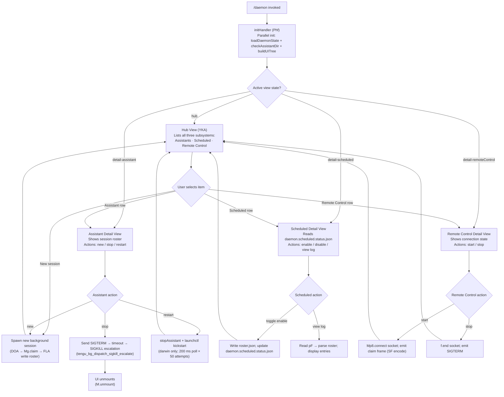

# `/daemon`

> Analysis basis: CC v2.1.161 bundle.js (AST extraction + Claude interpretation)
> Minimum version: v2.1.161

---

## Overview

The `/daemon` command opens an interactive management panel for Claude Code's background service layer. It surfaces three distinct subsystems — **assistant background sessions**, **scheduled tasks**, and **remote control** — and allows the user to inspect their status, start/stop/restart individual services, and view aggregated state. The command resolves its handler via module `wKA` and renders a JSX UI that is mounted immediately (`immediate: true`).

---

## Registration

| Field | Value |
|---|---|
| type | `local-jsx` |
| name | `daemon` |
| description | `Manage background services: assistants, scheduled tasks, and remote control` |
| immediate | `true` |
| module_id | `wKA` |
| load_inline | `true` |
| loc_byte | `12815478` |
| loc_byte_end | `12815682` |
| loc_line | `9310` |
| arbor_handler.name | `Phf` |
| arbor_handler.fqn | `claude-2.1.161::Phf` |
| arbor_handler.kind | `AsyncFunction` |
| arbor_handler.resolution_path | `module_id` |
| arbor_handler.n_hits | `0` |

Analysis basis: CC v2.1.161 bundle.js:+12815478

---

## Input Branching

The daemon command has 4+ distinct top-level view states (hub, detail-assistant, detail-scheduled, detail-remoteControl, and new-session creation), plus multiple sub-action branches within each view. A Mermaid flowchart is used.



---

## Behavioral Spec

### 1. Handler Entry Point (`Phf`)

The Arbor-resolved handler `Phf` is an `AsyncFunction` reached via `module_id → wKA`.

```
async function daemonCommandHandler(commandArgs, appContext):
    // Three parallel initialisation tasks
    [daemonState, assistantDirInfo, uiTree] = await Promise.all([
        loadDaemonState(),          // DKA
        checkAssistantDirectory(),  // $KA
        buildUIRegistration()       // W9K
    ])

    // Render the interactive JSX panel
    mountedPanel = renderPanel(daemonState, assistantDirInfo, uiTree)
    return mountedPanel
```

Analysis basis: CC v2.1.161 bundle.js:+12804228

---

### 2. Daemon State Loader (`DKA`)

Reads several JSON status files and reconciles live process information.

```
async function loadDaemonState():
    // Step 1 — parse background roster
    roster = await parseScheduledTasksFile()   // kq6 → P1A reads "utf8", JSON.parse, Array.isArray check
    // Step 2 — gather background session process records
    [sessionRecords, _] = await Promise.all([
        gatherSessionRecords(),    // Y9K
        Promise.resolve()
    ])
    // Step 3 — read individual status files
    assistantStatus   = await readAssistantStatus()   // L9K → BWH → reads ENOENT-tolerant
    daemonStatus      = await readDaemonStatus()      // S_K → Fh6 reads "daemon.status.json"
    scheduledStatus   = await readScheduledStatus()   // AqK → _qK reads "daemon.scheduled.status.json"
    rosterState       = await readRosterState()       // pF → reads "roster.json", "daemon.json"
    launchctlStatus   = await readLaunchctlStatus()   // Dn → rI8 → Vu1 (process.getuid on darwin)
    return aggregateDaemonState(assistantStatus, daemonStatus, scheduledStatus, rosterState, launchctlStatus)
```

Analysis basis: CC v2.1.161 bundle.js:+12803749

---

### 3. Background Session Gathering (`Y9K`)

```
async function gatherSessionRecords():
    await Promise.all([
        scanScheduledTasks(),   // kq6 — reads "scheduled" tagged entries, calls Array.isArray
        pollProcessHealth()     // yH — checks "essential-traffic" queue, logs errors
    ])
    killStaleSessions()        // K0 — reads PID files via gk6, calls process.kill, uses xHA to parse
    return sessionList
```

Key literal found: `"scheduled"` (bundle.js:+12693358), `"essential-traffic"` (bundle.js:+970808)

Analysis basis: CC v2.1.161 bundle.js:+12798451

---

### 4. Assistant Directory Check (`$KA`)

```
async function checkAssistantDirectory():
    homedir = os.homedir()                                 // _9K.homedir
    assistantPath = path.join(homedir, "assistant")        // vMH.join + literal "assistant" (bundle.js:+12788136)
    stat = await fs.stat(assistantPath)                    // qS6.stat — ENOENT-tolerant (bundle.js:+12786532)
    if stat exists:
        entries = await buildStatusRows(stat)              // N — enumerates rows, pads columns ("  " literal)
        return { path: assistantPath, entries }
    else:
        return { path: assistantPath, entries: [] }
```

Analysis basis: CC v2.1.161 bundle.js:+12788076

---

### 5. Roster State Reader (`pF`)

Parses the daemon roster file and determines each session's current lifecycle state.

```
async function readRosterState():
    raw = await fs.readFile(rosterPath)     // t_6.readFile; rosterPath via l5H → tCH → "roster.json" literal
    parsed = JSON.parse(raw)               // m6 wraps JSON.parse
    if parse fails:
        emit telemetry("tengu_bg_roster_parse_failed")   // bundle.js:+11383471
        return emptyRoster

    for each entry in parsed:
        age = Date.now() - entry.timestamp  // lHA
        state = classifyState(entry)        // yH → maps to: "active","idle","working","bg","blocked","crashed","done","killed","resuming","spare","exec"
        enrichedEntries.push({ ...entry, state, age })

    if rotationNeeded:
        rotateRosterFile()                  // bu1 → t_6.rename + Date.now + yH
    validateSchema(parsed)                 // qzf → Array.isArray + Object.keys
    return enrichedEntries
```

Session state literals (all from literals array):
- `"active"` (+4144388), `"idle"` (+15910650), `"working"` (+15910051), `"bg"` (+15910215)
- `"blocked"` (+15909944), `"crashed"` (+15909890), `"done"` (+15909706), `"killed"` (+15909724)
- `"resuming"` (+15911487), `"spare"` (+15905279), `"exec"` (+15905393)

Stale-entry cleanup timeout: **300 000 ms** (bundle.js:+15911273)

Analysis basis: CC v2.1.161 bundle.js:+11383381

---

### 6. launchctl Status Check (`Dn` / `rI8`)

```
async function readLaunchctlStatus():
    // Darwin-only path
    uid = process.getuid()             // Vu1
    plist = spawnAndCapture(
        "launchctl", ["print", "gui/" + uid + "/claude.daemon"]   // literals "launchctl","print" (bundle.js:+11377282,+11377295)
    )
    // 5000 ms timeout (bundle.js:+11377329)
    return parseLaunchctlOutput(plist)
```

Analysis basis: CC v2.1.161 bundle.js:+11377279

---

### 7. UI Component Tree (`W9K` / `U_6`)

```
function buildUIRegistration():
    // Registers keyboard bindings via Y9 → tYA.register
    // Defines component set a5f (large list):
    //   XI8, sX, da, Qe_, bC1, s7H, CC1, pC1, mC1, yC1, SC1, IC1, kC1, hC1, RC1, uC1,
    //   F5f, d5f, Q5f, l5f, g5f, c5f, i5f, vC1, VC1
    // Attaches model-selector entries (wA, BHH, RzH, xgH) for plan-mode display
    // Builds gateway-model list (vC1 → reads "gateway-models.json")
    // Registers "anthropic." prefix filter (bundle.js:+10979720)
    return componentRegistration
```

Analysis basis: CC v2.1.161 bundle.js:+12804111

---

### 8. Hub View React Component (`YKA`)

```
function HubComponent(props):
    [viewState, setViewState] = useState("hub")   // V1.useState; literal "hub" (bundle.js:+12804566)
    clock  = useClock()                            // _q → $69.useContext — throws if outside ClockProvider
    nowMs  = Date.now()
    daemonData = props.daemonState                 // DKA result
    scrollRef  = useRef()                          // V1.useRef → yK
    historyRef = useRef()

    // Three action groups rendered as focusable rows
    render:
        if viewState == "hub":
            renderHubRows([assistants, scheduled, remoteControl])
        elif viewState == "detail-assistant":
            renderAssistantDetail(daemonData)
        elif viewState == "detail-scheduled":
            renderScheduledDetail(daemonData)
        elif viewState == "detail-remoteControl":
            renderRemoteControlDetail(daemonData)
        elif viewState == "new":
            renderNewSessionForm()
        elif viewState == "uninstall":
            renderUninstallConfirm()

    // Key handler G: intercepts keys, delegates to l_ (main router)
    onKeyPress(key):
        if key matches action:
            l_(key, viewState, setViewState, daemonData)

    return <Panel title="Claude Daemon" ...>
```

Literal `"Claude Daemon"` at bundle.js:+12806592; `"Remote Control"` at +12806307; `"Scheduled"` at +12805986.

Analysis basis: CC v2.1.161 bundle.js:+12804439

---

### 9. Background Session Dispatcher (`w` / `XOA`)

The inner daemon supervisor loop manages session lifecycle.

```
async function supervisorLoop():
    loop:
        sessions = Array.from(A.values())           // live session map
        for session in sessions:
            session.retireIfSettled()               // B.retireIfSettled
        
        memFreeMB = os.freemem() / (1024*1024)      // WOA.freemem; threshold 1024 MB (bundle.js:+12883202)
        if memFreeMB < threshold:
            emit("tengu_bg_low_mem_mb")             // bundle.js:+12883180
            emit("tengu_bg_dispatch_low_mem")       // bundle.js:+15905088
            downsizePool()

        spareSlot = findSpare()
        if spareSlot:
            emit("tengu_bg_spare_enable")           // bundle.js:+15905783
            assignWorkToSpare(spareSlot)
            emit("tengu_bg_spare_claim")            // bundle.js:+15905904

        await sleep(30_000 or 15_000 ms)            // literals +15904464, +15904475
        checkExitConditions()                        // Y → WJ, process.exit, z.abort
```

SIGKILL escalation fired when SIGTERM does not result in exit within grace period:
`emit("tengu_bg_dispatch_sigkill_escalate")` (bundle.js:+15904509)

Analysis basis: CC v2.1.161 bundle.js:+15904391

---

### 10. Service Install / Uninstall (darwin, `o_6` / `lk6`)

```
async function uninstallService():
    agentPlist = path.join(os.homedir(), "Library", "LaunchAgents", "claude.daemon.plist")
    // "Library","LaunchAgents" literals at +11374067,+11374077
    launchctl("bootout", "gui/" + uid)  // literal "bootout" at +11375840
    fs.unlink(agentPlist)               // FqH.unlink
    // On darwin only — "service uninstall not available on darwin" guard
    // literal at +11375972

async function restartService():
    if platform == "darwin":
        // Stop: launchctl stop "claude daemon"  (literal +11373178)
        // Wait: 200 ms × 50 polls              (literals +11376357,+11376496)
        // If not stopped in 10 s → abort with warning  (literal +11376525)
        // Start: launchctl kickstart            (literal "kickstart" +11376203)
```

Analysis basis: CC v2.1.161 bundle.js:+11375812

---

### 11. New Background Session Claim (`DOA`)

```
async function claimNewSession(context):
    frame = buildClaimFrame()           // A95 → Mg.buildClaimFrame
    socket = await net.connect(socketPath)  // Mp8.connect; literal "connect" +15885353
    socket.on("data", ...)
    socket.once("error", ...)
    socket.write(encodeFrame(frame))    // SF: Buffer.from + Buffer.allocUnsafe + writeUInt32BE + writeUInt8

    result = await Promise.race([
        awaitAck(socket),               // q95 → 500 ms timeout literal +15935576
        timeoutError("send-claim timeout")  // literal +15885632
    ])
    if result.error == "ECONNREFUSED":  // literal +15885724
        emit("tengu_bg_sendclaim_failed")
        return null

    // Write session record to disk
    await writeSessionRecord(result)    // FLA → j9H.mkdir + j9H.writeFile + JSON.stringify
    emit("tengu_bg_spare_claim")
    return result
```

Analysis basis: CC v2.1.161 bundle.js:+15885085

---

### 12. Away-Summary Sub-feature (`I` / `h`)

When the daemon UI loses focus and then regains it, an away-summary may be generated.

```
function maybeGenerateAwaySummary(sessionState, focusState):
    if focusState == "blurred":         // literal +15368004
        cacheAge = assessCacheAge()
        if cacheAge == null:
            log("[awaySummary] skipped: cache age unknown")   // literal +15367214
            return
        if cacheAge > 0.9 * MAX_AGE:   // 0.9 threshold literal +15367283; MAX_AGE = 3600000 ms literal +15368065
            log("[awaySummary] skipped: cache stale")
            return
        if atRateLimit:
            log("[awaySummary] skipped: at or near rate limit")
            return
        if draftInputPresent:
            log("[awaySummary] skipped: draft input present")
            return
        emit("away_summary_generate")  // +15367692
        generateSummary()
    elif focusState == "focused":        // literal +15368154
        updateDisplay(latestSummary)
```

Threshold values: `0.8` multiplier (+15368121), `0.9` staleness (+15367283), 3 max retries (+15367767).

Analysis basis: CC v2.1.161 bundle.js:+15367212

---

## State & Side Effects

| Item | Detail |
|---|---|
| Telemetry: `tengu_bg_roster_parse_failed` | Fired when roster.json cannot be parsed (bundle.js:+11383471) |
| Telemetry: `tengu_feature_sad` | Generic feature failure signal (bundle.js:+966732) |
| Telemetry: `tengu_feature_ok` | Generic feature success signal (bundle.js:+966587) |
| Telemetry: `tengu_feature_bad` | Generic feature bad-state signal (bundle.js:+966650) |
| Telemetry: `tengu_daemon_control` | Fired on daemon control actions (start/stop/restart) (bundle.js:+15940522) |
| Telemetry: `tengu_bg_dispatch_sigkill_escalate` | SIGTERM timeout → SIGKILL escalation (bundle.js:+15904509) |
| Telemetry: `tengu_daemon_config_reload` | Fired when daemon config is reloaded live (bundle.js:+15918997) |
| Telemetry: `tengu_daemon_yield` | Fired when supervisor yields to foreground service (bundle.js:+15923216) |
| Telemetry: `tengu_bg_low_mem_mb` | Platform memory dropped below threshold (bundle.js:+12883180) |
| Telemetry: `tengu_bg_dispatch_low_mem` | Dispatcher reacts to low-memory condition (bundle.js:+15905088) |
| Telemetry: `tengu_bg_spare_enable` | Spare worker slot became available (bundle.js:+15905783) |
| Telemetry: `tengu_bg_sendclaim_failed` | Failed to claim a background session slot (bundle.js:+15885155) |
| Telemetry: `tengu_bg_state_read_transient` | Transient state read (bundle.js:+4137751) |
| Telemetry: `tengu_bg_spare_claim` | Spare slot successfully claimed (bundle.js:+15905904) |
| Telemetry: `tengu_bg_spare_claim_fail` | Spare slot claim failure (bundle.js:+15906167) |
| Telemetry: `tengu_skill_file_changed` | A skill/plugin file was modified on disk (bundle.js:+14024383) |
| Telemetry: `tengu_daemon_idle_exit` | Daemon exited due to inactivity (bundle.js:+15924246) |
| Telemetry: `tengu_config_parse_error` | Configuration file parse failure (bundle.js:+3251872) |
| Telemetry: `away_summary_generate` | Away-summary generation attempted (bundle.js:+15367692) |
| Telemetry: `away_summary` | Away-summary result event (bundle.js:+15366323) |
| Telemetry: `api_metrics` | API metrics event (bundle.js:+15366122) |
| Telemetry: `api_bootstrap_fetch` | Bootstrap fetch event (bundle.js:+15504434) |
| Telemetry: `tengu_bg_session_create` | Background session creation event (bundle.js:+15904819) |
| Telemetry: `rate_limit_event` | Rate limit encountered (bundle.js:+15689658) |
| Telemetry: `tengu_daemon_idle_exit` | Daemon idle exit (bundle.js:+15924246) |
| File reads | `daemon.json`, `daemon.status.json`, `daemon.scheduled.status.json`, `roster.json`, `pins.json` |
| File writes | `roster.json` (rotation via `t_6.rename`), session JSON records via `j9H.writeFile` |
| File deletes | Stale PID/socket files via `wSK.unlinkSync`, `DY.unlink`, `FqH.unlink` |
| Process signals | `process.kill` (SIGTERM default, SIGKILL escalation) |
| Socket I/O | Unix domain socket claim via `Mp8.connect`; binary frame encoding (Buffer, writeUInt32BE, writeUInt8) |
| Hook registration | `tYA.register` for keyboard bindings (Y9 path) |
| appState changes | View state transitions: `"hub"`, `"detail-assistant"`, `"detail-scheduled"`, `"detail-remoteControl"`, `"new"`, `"uninstall"` |
| JSX mount/unmount | `M.render` on entry; `M.unmount` on exit (bundle.js:+12814851, +12815065) |
| File watching | `Pq8.watchFile` / `Pq8.unwatchFile` for live config changes (`bXL`) |
| OS-level service | `launchctl print`, `launchctl bootout`, `launchctl kickstart` on darwin (macOS only) |
| Memory threshold | 1024 MB free memory floor for background dispatch (bundle.js:+12883202) |
| Idle timeout | 300 000 ms stale-entry cleanup window (bundle.js:+15911273) |
| Stale session cleanup | `wSK.unlinkSync` on dead PID files |

---

## Version History

| Version | Change |
|---|---|
| v2.1.161 | Initial analysis |

---

## Common Mistakes

1. **Assuming `/daemon` is available on all platforms**: The `launchctl` integration (install, uninstall, restart) is darwin-only. On non-macOS systems the service-management paths are absent; the UI will display an appropriate guard message (literal: `"service uninstall not available on darwin"` bundle.js:+11375972 — this message is shown on non-darwin to indicate the darwin path was skipped).
2. **Expecting synchronous state**: The command fires three `Promise.all` branches in parallel on launch. The UI is rendered before all async state is settled; individual sections may populate progressively.
3. **Confusing `daemon.status.json` with `daemon.scheduled.status.json`**: These are separate files. The former tracks the main daemon process; the latter tracks periodic scheduled tasks. Editing one does not affect the other.
4. **Missing `ClockProvider` context**: The hub component calls `useClock()` which throws `"useClock must be used within a ClockProvider"` (bundle.js:+3810611) if invoked outside the correct React context tree. This will only surface in test/embedding scenarios.
5. **Triggering restart on non-darwin**: The `lk6 → BHA` restart path calls `launchctl kickstart` and has a hard darwin guard. Calling restart on Linux/Windows will produce a no-op or error.
6. **Ignoring the 300 000 ms cleanup window**: Entries older than 5 minutes may be silently removed from the roster. Background tools that rely on polling the roster may observe sessions disappearing unexpectedly.

---

## Appendix — Identifier Mapping

> For bundle debugging only. Identifiers change across versions.

| Identifier | Role |
|---|---|
| `Phf` | Main async handler for `/daemon` command (Arbor-resolved entry point) |
| `vhf` | Outer wrapper / JSX render orchestrator that calls `M.render` and `M.unmount` |
| `YKA` | Hub React component (`useState`, `useRef`, renders all view states) |
| `DKA` | Daemon state aggregator (parallel reads of all status files) |
| `Y9K` | Session record gatherer (scheduled task scan + process health poll) |
| `kq6` | Scheduled task file scanner |
| `P1A` | Status file reader (reads utf8 JSON, calls `Array.isArray`) |
| `d1A` | Array validation helper |
| `yH` | Process health checker / essential-traffic queue checker |
| `a_` | Error constructor helper |
| `pH` | String conversion helper |
| `r9` | Queue drain helper |
| `s44` | Traffic-log shift/push helper |
| `K0` | Stale PID file killer (reads PID via `gk6`, calls `process.kill`) |
| `gk6` | PID file reader (`Qm.readFile`) |
| `xHA` | PID file parser (split/slice operations) |
| `H2` | Post-kill cleanup helper |
| `L9K` | Assistant status reader |
| `BWH` | Assistant directory enumerator (ENOENT-tolerant) |
| `$1` | AsyncLocalStorage `getStore` accessor |
| `v8` | Value-or-default helper |
| `MKA` | Status field mapper |
| `TH` | String coercion helper |
| `K` | Column formatter (padEnd map) |
| `zb` | Path join helper (joins array with separator) |
| `S_K` | Daemon status file reader (`daemon.status.json`) |
| `Fh6` | Status file path builder |
| `AqK` | Scheduled status file reader (`daemon.scheduled.status.json`) |
| `_qK` | Scheduled status path builder |
| `pF` | Roster state reader and lifecycle classifier |
| `m6` | JSON.parse wrapper |
| `l5H` | Roster file path builder |
| `tCH` | Base directory path builder |
| `k8` | Error-kind classifier |
| `lHA` | Timestamp age calculator (`Date.now` delta) |
| `d` | Generic async utility |
| `df` | Value formatter |
| `o$H` | Roster enrichment helper |
| `bu1` | Roster file rotator (`t_6.rename`) |
| `qzf` | Roster schema validator (`Array.isArray`, `Object.keys`) |
| `Dn` | launchctl status reader (darwin) |
| `b8` | launchctl spawn wrapper |
| `h_` | Child process capture helper |
| `h6` | Process output handler |
| `rI8` | UID-based plist path resolver |
| `Vu1` | `process.getuid` wrapper |
| `$KA` | Assistant directory checker (`os.homedir` + `fs.stat`) |
| `P_` | Path/env lookup helper |
| `XN` | Environment variable reader |
| `PQ6` | Stat-result normaliser |
| `F6` | Feature-flag/config accessor |
| `N` | Row builder / column formatter |
| `VBK` | Bootstrap config helper |
| `HwA` | Config key normaliser |
| `H` | Display row / settings row type |
| `s$` | Settings value getter |
| `ne` | Permission-set checker |
| `Ij` | String replacement helper |
| `lq` | Multi-part path constructor |
| `t6` | Display value transformer |
| `SH` | `JSON.stringify` wrapper |
| `Z4` | Redaction helper (replaces secrets with `[REDACTED]`) |
| `CJA` | Key map builder |
| `A` | Lowercase transformer |
| `imH` | Write helper |
| `GJA` | `H.write` executor |
| `IBK` | Settings write-through helper (mkdir, appendFile, rename) |
| `WmH` | Debounce/throttle writer (clearTimeout, setTimeout, setImmediate) |
| `_3H` | Settings path resolver |
| `d46` | Write value normaliser |
| `BJA` | Backup path builder |
| `UJA` | Atomic file replacer (stat, endsWith `.txt`, rename, unlink) |
| `NBK` | Append-and-rotate file writer |
| `Y9` | Keyboard binding registrar (`tYA.register`) |
| `M` | JSX render engine (`M.render`, `M.unmount`) |
| `nC6` | Plugin path resolver (`.staging`, `plugins`, `synced`) |
| `iC6` | Plugin subdirectory builder |
| `L` | Promise wrapper with add/delete/finally |
| `f` | File handle with close/open |
| `W9K` | UI component tree builder |
| `U_6` | Model selector + component registry assembler |
| `a5f` | Component list aggregator |
| `wA` | Model plan resolver |
| `BHH` | "max" plan handler |
| `RzH` | "team" plan handler |
| `xgH` | "enterprise" plan handler |
| `XI8` | Default model picker (Recommended/Default) |
| `sX` | firstParty model option builder |
| `da` | Opus 4.7 option builder |
| `Qe_` | opusplan option builder |
| `bC1` | Opus 4.8 (1M context) option (draws usage credits) |
| `s7H` | Opus 4.7 (1M context) option |
| `CC1` | Opus option builder (standard) |
| `pC1` | Opus 4.8 detailed option builder |
| `mC1` | Opus option (legacy path) |
| `UM` | Model capability resolver |
| `yC1` | Long-session Opus option |
| `SC1` | Opus 4.8 1M context window option |
| `IC1` | Long-session Sonnet option |
| `kC1` | Sonnet standard option |
| `hC1` | Sonnet 1M context option |
| `RC1` | Haiku option builder |
| `uC1` | Haiku standard option |
| `F5f` | Component slot builder (Vf wrapper) |
| `d5f` | Component detail builder |
| `uHH` | Model string builder (claude-opus-4-7, mantle) |
| `Vf` | Model descriptor (MmH, fB4, r7q, _a6, PA) |
| `Q5f` | Simplified model slot |
| `l5f` | Simple Sonnet slot |
| `g5f` | Simple Opus slot |
| `c5f` | Component with IKH extension |
| `i5f` | Composite component (CgH + uC1 + n5f) |
| `y6` | Session record writer (Date.now, nDH file ops) |
| `Dj_` | Record field builder |
| `nDH` | Session directory initialiser (mkdir, readdir, copyFileSync) |
| `bXL` | Config file watcher (`Pq8.watchFile` / `Pq8.unwatchFile`) |
| `vC1` | Gateway model list loader (reads `gateway-models.json`) |
| `TC1` | Gateway model row builder |
| `VC1` | Gateway model path builder |
| `$` | Remote-control socket state accessor (`y_K`) |
| `y_K` | Socket state builder (Zr, Date.now, $1, Fh6, SH) |
| `xHH` | Command argument parser (NT, o9H, VA, nQ) |
| `NT` | Argument token normaliser |
| `o9H` | Argument type resolver |
| `nQ` | Command-line option parser |
| `p_6` | Option filter + normaliser |
| `o5f` | Option slot builder |
| `KG` | Model-group component (UM, Vf, PA) |
| `PA` | Provider capability accessor |
| `s5f` | Model sorting / indexing helper |
| `Nj` | Model name normaliser (toLowerCase) |
| `_9` | Inference profile matcher (`application-inference-profile`) |
| `aN` | Anonymous model builder |
| `CgH` | Composite model descriptor |
| `_q` | Clock context hook (`$69.useContext`) |
| `yK` | Scroll/timer ref hook (`bo.useRef`, `bo.useSyncExternalStore`) |
| `z` | Daemon lifecycle controller |
| `hH` | Session state reader (feature_ok path) |
| `h1H` | Session record accessor |
| `RH` | Session state writer (feature_bad path) |
| `ly` | Event dispatch loop (gx, sVH, rw_) |
| `gx` | Event queue drainer |
| `sVH` | Event subscriber |
| `rw_` | Event emitter (randomUUID, H.emit) |
| `qp` | Shutdown sequencer (Promise.race, process.exit) |
| `Gd` | Graceful shutdown (`I4H.shutdown`) |
| `vd` | Timeout cleanup (clearTimeout, Zj_) |
| `n8` | Abort-with-timeout helper |
| `O` | Utility wrapper (`u8`) |
| `u8` | Async task helper |
| `W` | MCP/SDK connection manager (Y16, OS, jk, sl, DB) |
| `Y16` | Connection initialiser |
| `J` | Session registry (w map) |
| `w` | Session supervisor loop |
| `S` | Session writer (`D.write`) |
| `D` | Session controller (BWH, H9K, G/Z/V start/stop, USK, f.set) |
| `ER8` | Memory pressure monitor |
| `j6` | Background job dispatcher (gY6, QY6, Qx, Lq8, BY6, CU, y6) |
| `rj6` | Pinned-session loader (`pins.json`) |
| `m0_` | Pins file path builder |
| `WbL` | Session directory scanner |
| `B` | Background worker (retire/settle logic) |
| `DOA` | New background session claimer |
| `FLA` | Session record file writer (mkdir + writeFile + JSON.stringify) |
| `q95` | Claim timeout manager |
| `A95` | Claim frame builder |
| `SF` | Binary claim frame encoder (Buffer, writeUInt32BE, writeUInt8) |
| `XOA` | Session lifecycle manager (add/delete/cleanup/state machine) |
| `aK` | Session working-dir path builder |
| `q1` | Session state file reader/writer |
| `lD` | Active session monitor (`nV`) |
| `W5` | Session output recorder (t3, SH, Fj) |
| `e_6` | Scheduled execution driver (pF, Date.now, Kzf) |
| `n5H` | Session log path builder (F3.join, HbH) |
| `AT` | Session log reader (F3.join, HbH, H.split) |
| `mF` | Session metadata writer (gHA, F3.join, s_6) |
| `nk6` | Roster entry writer (F3.join, cHA) |
| `Y` | Forced shutdown handler (WJ, process.exit, z.abort) |
| `WJ` | Shutdown reason recorder |
| `C` | Rate-limit event emitter (_o1, y.enqueue, fj.randomUUID, N6) |
| `_o1` | Rate-limit token builder |
| `y` | Event queue (N, d, S) |
| `N6` | Environment path resolver |
| `X` | Input editor component (p1.fromText, lfA vim handler, C.execute) |
| `j` | Worker kill helper (A.values, y.kill) |
| `h` | History scroller (hd, Date.now, Math.min, I, V, UTK) |
| `hd` | History entry displayer |
| `I` | Away-summary trigger (N, Date.now, FG8, yH5, UTK, V, A38, RH, Jk1) |
| `FG8` | App state accessor (`f5H.getState`) |
| `yH5` | Away-summary params retriever |
| `UTK` | Utility key handler |
| `V` | View state updater |
| `A38` | Away-summary generator (AbortController, tool-deny guard) |
| `Jk1` | UUID generator for summary |
| `g` | Heartbeat writer (setTimeout, D.write, Math.round, u.unref) |
| `lfA` | Vim key-binding loader (ZQf, VQf, vQf, NQf, IQf, kQf, yQf, hQf, SQf, RQf, CQf) |
| `ZQf` | Normal-mode key map (rzK) |
| `rzK` | Normal-mode motion dispatcher |
| `VQf` | Count-prefixed motion handler |
| `vQf` | Text-object motion handler |
| `mfA` | Text manipulation executor (split, slice, setText, setOffset, recordChange) |
| `ozK` | Operator-pending dispatcher |
| `NQf` | Count-prefixed operator handler |
| `IQf` | Find-command handler |
| `ab8` | Find executor (TQf, setLastFind, recordChange) |
| `kQf` | Substitute handler |
| `sb8` | Substitute executor |
| `yQf` | Set-offset helper |
| `hQf` | IxH-based offset calculator |
| `IxH` | Offset equality checker |
| `SQf` | Yank/delete dispatcher (kxH, lzK) |
| `kxH` | Yank executor |
| `lzK` | Delete executor |
| `RQf` | Replace-line handler (eb8) |
| `eb8` | Replace-line executor |
| `CQf` | Copy-line handler (Ax8) |
| `Ax8` | Copy-line executor |
| `o_6` | Service uninstall handler |
| `UHA` | LaunchAgents path builder |
| `lk6` | Service restart handler |
| `BHA` | Start/stop/restart orchestrator (rI8, b8, Zu1.setTimeout) |
| `Z` | Scheduled task controller (stop, updateConfig, start) |
| `G` | Key-press router (remoteControlAtStartup check, m0/l_ dispatch) |
| `b` | Event object (preventDefault) |
| `m0` | Action dispatcher |
| `l_` | Main action router (all view transitions, file writes, error paths) |
| `BO` | Option list builder (jOH, TQ) |
| `Xe8` | Context menu builder |
| `TQ` | Tab/view selector (P_, mK6, BB8, CK6, zEH, DEH, UK6, zOH, DOH, ze8, UCA, Kr, HM6) |
| `mX` | Picker helper |
| `wt8` | Timestamp recorder (`rQ6.set`) |
| `qTH` | Quick-action handler |
| `Y56` | Atomic file writer (lstat, symlink resolution, randomBytes, fchmodSync, fsyncSync, renameSync) |
| `nz` | Cache clear helper (Cx6.clear, IU8.clear) |
| `QQ6` | Git-ignored file tracker (readFile, appendFile, writeFile) |
| `wx` | Settings path helper (`UN.join`, `.claude/settings.json`) |
| `np` | Settings loader (ZT, C9, We8, TQ, bx6) |