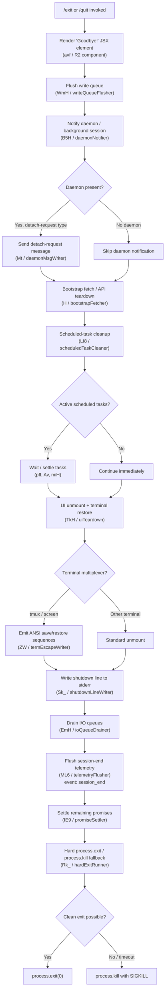

# `/exit`

> Analysis basis: CC v2.1.161 bundle.js (AST extraction + Claude interpretation)
> Minimum version: v2.1.161

---

## Overview

`/exit` (alias: `/quit`) terminates the Claude Code CLI session immediately. When invoked, the command renders a farewell JSX element, flushes all pending I/O and telemetry, saves transcript/conversation data, and then calls `process.exit` to terminate the Node/Bun process. The shutdown sequence is orchestrated by an async handler (`svf`) that coordinates UI teardown, background-daemon notification, session-end telemetry emission, and a hard process kill as a safety fallback.

---

## Registration

| Field | Value |
|---|---|
| type | `local-jsx` |
| name | `exit` |
| description | `null` |
| aliases | `["quit"]` |
| immediate | `true` |
| module_id | `S6K` |
| load_inline | `true` |
| loc_byte | `12527526` |
| loc_byte_end | `12527722` |
| loc_line | `8784` |
| arbor_handler.name | `svf` |
| arbor_handler.fqn | `claude-2.1.161::svf` |
| arbor_handler.kind | `AsyncFunction` |
| arbor_handler.resolution_path | `module_id` |
| arbor_handler.n_hits | `1` |

Analysis basis: CC v2.1.161 bundle.js:+12527526

---

## Input Branching

The handler executes a multi-stage, mostly linear shutdown sequence, but branches meaningfully on background-process state, daemon presence, and abort-signal outcome. Six or more distinct paths are exercised, so a Mermaid flowchart is used.



Analysis basis: CC v2.1.161 bundle.js:+12526775 – +12526958

---

## Behavioral Spec

### 1. Handler Entry — `exitCommandHandler` (`svf`)

```
async function exitCommandHandler(context):
    # Step 1 – render farewell UI
    render JSX element containing "Goodbye!" string
    call goodbyeRenderer(context)          # avf → R2

    # Step 2 – flush pending writes
    await writeQueueFlusher()              # W9 → bzH

    # Step 3 – notify daemon / background process
    await daemonNotifier(context)          # B5H
        if daemon present:
            send message type "detach-request"   # Mt
        if background session active:
            record background session details    # bqH / kR1

    # Step 4 – tear down API/bootstrap connection
    await bootstrapFetcher(context)        # H

    # Step 5 – clean up scheduled tasks
    await scheduledTaskCleaner(context)   # LI8

    # Step 6 – perform full UI + process shutdown
    await shutdownOrchestrator(context)   # O9

    # (process terminates inside shutdownOrchestrator)
```

Analysis basis: CC v2.1.161 bundle.js:+12526775 – +12526958

---

### 2. Write-Queue Flusher — `writeQueueFlusher` (`W9` → `bzH`)

```
function writeQueueFlusher():
    # Drains any buffered stdout/stderr writes
    # Uses a debounce interval of 1000 ms and up to 100 retries
    # (literals: 1000 @ +58707, 100 @ +58728)
    clearTimeout(pendingFlushTimer)
    while writeQueue.length > 0:
        join and emit pending buffer chunks
        setImmediate to yield to event loop
    schedule setImmediate sentinel to confirm drain
```

Analysis basis: CC v2.1.161 bundle.js:+2245418, +58707, +58728

---

### 3. Daemon Notifier — `daemonNotifier` (`B5H`)

```
async function daemonNotifier(context):
    sessionId = getActiveSessionId()          # as6
    if sessionId is null:
        return

    # Sends "detach-request" over the daemon IPC channel
    await daemonMsgWriter(sessionId, "detach-request")    # Mt → ft.write, SH
    record background session request                     # bqH

    workerInfo = fetchWorkerInfo()            # kR1
        workerInfo.type = "task"             # literal @ +10913540
```

Analysis basis: CC v2.1.161 bundle.js:+10918947, +10918972, +10918981

---

### 4. Bootstrap / API Teardown — `bootstrapFetcher` (`H`)

```
async function bootstrapFetcher(config):
    # Logs "[Bootstrap] Fetching" if debug mode active
    # Sets headers: Content-Type: application/json, User-Agent
    # Times out after 5000 ms (literal @ +15504313)
    response = await fetch(endpoint, {
        headers: {
            "Content-Type": "application/json",
            "User-Agent": userAgentString
        },
        signal: AbortSignal.timeout(5000)
    })
    if parse fails:
        record event "api_bootstrap_fetch" / "parse_failed"
    else:
        log "[Bootstrap] Fetch ok"

    # Resolves model preferences through modelSelector chain (lq → s9 → …)
    # Normalises model aliases: "opusplan", "sonnet", "haiku", "opus", "best"
    # Checks for "anthropic." provider prefix (literal @ +2230116)
    return bootstrapPayload
```

Analysis basis: CC v2.1.161 bundle.js:+15504120, +15504122, +15504207, +15504222, +15504313, +15504434

---

### 5. Scheduled-Task Cleanup — `scheduledTaskCleaner` (`LI8`)

```
async function scheduledTaskCleaner(context):
    notify UI of "scheduled task" teardown     # literal @ +10912409
    tasks = gatherActiveTasks()               # pff

    for each task in tasks:
        interval = parseTaskInterval(task)    # kI / iQL
        nextRun  = computeNextRun(task)       # miH
        if task.getTime() ≤ Date.now():
            mark task as due
        if Math.max(remaining, 0) == 0:
            flush task now

    # Time parsing constants found in call graph:
    # "Every minute" label, "Every hour" label
    # Minutes-per-year constant: 527040 (@ +4841034)
    # milliseconds per day: 86400000 (@ +209473)
    # milliseconds per hour: 3600000 (@ +209507)
    waitForAllTasksToSettle()
```

Analysis basis: CC v2.1.161 bundle.js:+10912390, +10912409, +4841034, +209473, +209507

---

### 6. UI + Process Shutdown Orchestrator — `shutdownOrchestrator` (`O9`)

```
async function shutdownOrchestrator(context):
    # Phase A – UI teardown
    uiTeardown(context)                        # TkH
        writeSync cursor-save escape "\x1b7"   # literal @ +3760546
        unmount React/Ink render tree
        restore terminal state
        if multiplexer == "tmux" or "screen":
            emit tmux-compatible escape sequences   # ZW → SJ_
        writeSync cursor-restore escape "\x1b8"    # literal @ +3760557

    # Phase B – write shutdown dim text
    shutdownLineWriter(context)                # Sk_
        replaceAll("\\" → "\\\\", "\"" → "\\\"")
        write dim-styled line to stderr        # w6.dim @ +5413509

    # Phase C – hard-exit runner (runs on a parallel timer)
    hardExitRunner = scheduleHardExit()        # Rk_
        clearTimeout any pending exit timer
        after timeout (3500 ms, literal @ +5415273):
            process.exit()   OR
            process.kill(pid, SIGKILL)  as fallback

    # Phase D – drain I/O
    await ioQueueDrainer()                     # EmH → tYA.drain

    # Phase E – race: normal shutdown vs abort timeout (2000 ms @ +5415451)
    result = await Promise.race([
        normalShutdown(),
        AbortSignal.timeout(2000)
    ])

    # Phase F – flush telemetry
    await telemetryFlusher()                   # ML6 → VQ8 → LPA
        emit event "session_end"               # literal @ +5415660
        write startup-perf report if enabled   # HPA / qPA / KPA
        flush 1 048 576 byte buffer max        # literal @ +215075

    # Phase G – settle remaining promises
    await promiseSettler()                     # IE9
        Promise.allSettled(Array.from(pendingPromises))

    # Phase H – final write and process termination
    writeSync final bytes to stdout            # AJH.writeSync @ +5415729
    clearTimeout(hardExitTimer)
    # hardExitRunner fires process.exit if we never reach here
```

Analysis basis: CC v2.1.161 bundle.js:+5415169, +5415237, +5415243, +5415249, +5415273, +5415362, +5415386, +5415451, +5415511, +5415551, +5415587, +5415600, +5415660, +5415703, +5415729

---

### 7. Prompt-Input Exit Signal

The registration literal `"prompt_input_exit"` (`+12526963`) indicates that the command is also reachable as an exit signal originating directly from the prompt-input layer (e.g. Ctrl-D / EOF), not only via the slash-command menu.

Analysis basis: CC v2.1.161 bundle.js:+12526963

---

## State & Side Effects

| Item | Detail |
|---|---|
| Telemetry: `tengu_feature_sad` | Emitted from `d` / `t6` call chain at `+966732`; records feature-usage sadness signal on exit |
| Telemetry: `tengu_bg_dispatch_sigkill_escalate` | Emitted if background-session SIGKILL escalation occurs during shutdown (`+15904509`) |
| Telemetry: `tengu_bg_dispatch_low_mem` | Emitted if low-memory condition detected in background process during teardown (`+15905088`) |
| Telemetry: `tengu_bg_spare_enable` | Background spare-session enabled event (`+15905783`) |
| Telemetry: `tengu_bg_spare_claim` | Background spare-session claimed event (`+15905904`) |
| Telemetry: `tengu_bg_spare_claim_fail` | Background spare-session claim failure (`+15906167`) |
| Telemetry: `tengu_daemon_config_reload` | Daemon config reload detected during supervisor reconciliation (`+15918997`) |
| Telemetry: `tengu_startup_perf` | Startup profiling report flushed on exit if profiling was active (`+215596`) |
| Telemetry: `tengu_scroll_summary` | Scroll-summary data captured at `r$8` / `EE9` (`+5414569`) |
| Telemetry: `tengu_amber_creek` | UI/fullscreen mode metric recorded during shutdown (`+3419112`) |
| Telemetry: `tengu_pewter_brook` | UI/fullscreen mode metric (alternate branch) recorded during shutdown (`+3419020`) |
| Telemetry: `tengu_cache_eviction_hint` | Cache eviction hint flushed via `XK6` at session end (`+5415625`) |
| Hook registration | `Y9` calls `tYA.register` (`+59405`); I/O drain hook registered during flush phase |
| Terminal state | Cursor-save / cursor-restore escape sequences written synchronously before unmount; tmux/screen escape sequences normalised (`ZW`) |
| appState changes | Supervisor (`D` / `BWH`) stops and restarts heartbeat config, updates remoteControlAtStartup, removes tracked sessions from maps |
| Background daemon IPC | `"detach-request"` message sent over IPC before process exits (`+10918981`) |
| Hard-kill fallback | `process.kill` with `SIGKILL` after 3500 ms safety timeout (`+5415273`) if normal exit stalls |
| Sound | `<!-- TODO: not found in depth-2 traversal; needs --depth 4 -->` |
| Transcript / log flush | `IBK` / `NBK` pipeline: `Ay.mkdir`, `Ay.appendFile`, `Ay.rename`, `Ay.unlink` — conversation log is appended and rotated atomically before exit |

---

## Version History

| Version | Change |
|---|---|
| v2.1.161 | Initial analysis |

---

## Common Mistakes

1. **Using `/exit` during an active tool call**: because `immediate: true` is set, the command fires before the current agent turn resolves. Any in-flight tool result is discarded; no confirmation dialog is shown.
2. **Expecting instant termination**: the shutdown sequence can take up to 3500 ms before the hard-kill timer fires. Pressing Ctrl-C a second time does not accelerate this; only the timer does.
3. **Confusing `/exit` with Ctrl-C**: `SIGINT` triggers a different abort path that may prompt the user before exiting. `/exit` and `/quit` bypass any "are you sure?" prompt.
4. **Daemon sessions not disconnecting**: if the background daemon IPC channel is unavailable (e.g. already crashed), the `"detach-request"` message silently fails and the daemon may keep the session open momentarily until its own heartbeat check fires.
5. **Telemetry loss on forced kill**: if the 3500 ms hard-exit timer fires before `telemetryFlusher` completes, the `session_end` event and startup-perf report may not be persisted to disk.

---

## Appendix — Identifier Mapping

> For bundle debugging only. Identifiers change across versions.

| Identifier | Role |
|---|---|
| `svf` | Main async exit command handler (`exitCommandHandler`) |
| `W9` | Write-queue flusher entry point |
| `bzH` | Write-queue drain implementation |
| `H` | Bootstrap/API teardown and model-config resolver |
| `N` | Log formatter / conversation-history serialiser |
| `VBK` | History entry constructor |
| `HwA` | History metadata writer |
| `SH` | JSON.stringify wrapper utility |
| `Z4` | Path/string normalisation helper |
| `CJA` | Workspace-map iterator |
| `imH` | History file writer |
| `GJA` | Stdio write helper |
| `IBK` | Conversation log persistence orchestrator |
| `WmH` | Buffered write queue manager |
| `_3H` | Log path constructor |
| `F6` | Filesystem path resolver |
| `d46` | Directory entry validator |
| `BJA` | Log file path joiner |
| `UJA` | Log file rotation handler (stat/rename/unlink) |
| `NBK` | Log file append writer (mkdir/appendFile) |
| `Y9` | I/O drain hook registrar |
| `s$` | App-state reader |
| `ne` | Active-session set checker |
| `Ij` | String escape/replace utility |
| `lq` | Model-selection resolver entry |
| `xHH` | Model-list builder |
| `NT` | Default model constant |
| `o9H` | Model capability checker |
| `nQ` | Provider-prefix filter |
| `s9` | Model alias normaliser |
| `x0` | Model key builder |
| `NKH` | Supported-model-list checker |
| `aN` | Model-tier selector |
| `CgH` | Fallback model selector |
| `KG` | Model-object builder |
| `Xwq` | Best-model resolver |
| `UM` | Provider metadata builder |
| `Us6` | Model whitelist checker |
| `bgH` | Model property accessor |
| `xP` | Model-resolution pipeline |
| `b0` | Resolved-model record builder |
| `t6` | Feature-use recorder (calls `tengu_feature_sad`) |
| `d` | Core telemetry emitter |
| `h1H` | Feature-sadness metric wrapper |
| `Xa8` | Telemetry payload constructor |
| `B5H` | Daemon notifier |
| `as6` | Active-session-ID getter |
| `kR1` | Background-worker info fetcher |
| `IN8` | Worker connection resolver |
| `u8` | Worker state accessor |
| `Mt` | Daemon IPC message writer |
| `bqH` | Background-session request recorder |
| `DM` | Detach-request type constant holder |
| `LI8` | Scheduled-task cleanup orchestrator |
| `UE` | Event-emitter helper |
| `XN` | Core event-notification emitter |
| `pff` | Task-list gatherer and scheduler |
| `Av` | Individual task interval parser |
| `K` | Task-pad formatter |
| `w` | Background process manager |
| `L` | Pending-promise tracker |
| `j` | Process-group kill helper |
| `Y` | Forced-shutdown runner (`process.exit` + `z.abort`) |
| `$` | Async-job queue |
| `J` | Date/time utilities holder |
| `kI` | Cron-expression parser |
| `iQL` | Cron-field tokeniser |
| `miH` | Next-run-time calculator |
| `O` | Background session state object |
| `f` | Open-file-handle registry |
| `H9` | Duration formatter (floor/round Math helpers) |
| `y9` | Terminal string width helper |
| `_8` | Bun.stringWidth wrapper |
| `Jq` | Unicode column-width calculator |
| `xD` | ANSI-strip utility |
| `avf` | Goodbye JSX renderer (wraps `R2`) |
| `O9` | Shutdown orchestrator (UI + process exit) |
| `TkH` | UI unmount + terminal-restore handler |
| `rR` | Render-tree cleanup helper |
| `_K8` | Low-level terminal escape writer |
| `mvH` | Terminal-type detector (ghostty/iTerm) |
| `kvH` | Terminal-capabilities checker |
| `ZW` | tmux/screen escape normaliser |
| `S$` | Terminal state store |
| `Sk_` | Shutdown dim-text line writer |
| `IT` | Ink render-instance registry |
| `Qb` | Active-render-instance getter |
| `N6` | Node/Bun fs async wrapper |
| `_W6` | Config-file stat/path helper |
| `tS` | Config path resolver |
| `P_` | Project-root resolver |
| `Q$` | Settings loader |
| `a4` | Hook registrar helper |
| `TE9` | Terminal dim-style formatter |
| `Rk_` | Hard-exit runner (process.exit / SIGKILL fallback) |
| `EmH` | I/O queue drainer (`tYA.drain`) |
| `D` | Supervisor / daemon-config reconciler |
| `BWH` | Daemon-config writer |
| `$1` | AsyncLocalStorage store reader |
| `v8` | Config-store value getter |
| `MKA` | Config-field mapper |
| `TH` | String coercion helper |
| `H9K` | Daemon config key formatter |
| `G` | Remote-control input handler |
| `b` | Input event object |
| `m0` | User-settings accessor |
| `Z` | Heartbeat manager |
| `USK` | Heartbeat updater |
| `h6H` | Heartbeat interval writer |
| `V` | Watcher/supervisor process handle |
| `IE9` | Pending-promise settler (`Promise.allSettled`) |
| `ML6` | Telemetry flush orchestrator |
| `VQ8` | Telemetry batch writer |
| `LPA` | Telemetry record builder / sizer |
| `HPA` | Startup-perf report flusher |
| `qPA` | Perf-report path builder |
| `t$H` | Synchronous file write helper (openSync/writeFileSync/fsyncSync) |
| `aJA` | Profiling checkpoint serialiser |
| `nb` | `perf_hooks` require wrapper |
| `KPA` | Secondary perf-report path builder |
| `r$8` | Scroll-summary and session-end record builder |
| `GE9` | Session-end payload constructor |
| `EE9` | Scroll-metrics calculator |
| `XE9` | Scroll-data aggregator |
| `qq` | Fullscreen-mode resolver |
| `pJ_` | Fullscreen prerequisite checker |
| `pH` | Boolean-string coercer ("yes"/"on") |
| `Do` | iTerm2 detection helper |
| `mJ_` | Windows/SSH detection helper |
| `t_` | Fullscreen config reader |
| `J0L` | Fullscreen mode applicator |
| `j6` | Fullscreen render controller |
| `XK6` | Cache-eviction hint emitter |
| `o$8` | Parallel-shutdown promise racer |
| `n8` | Abort-signal timeout wrapper |