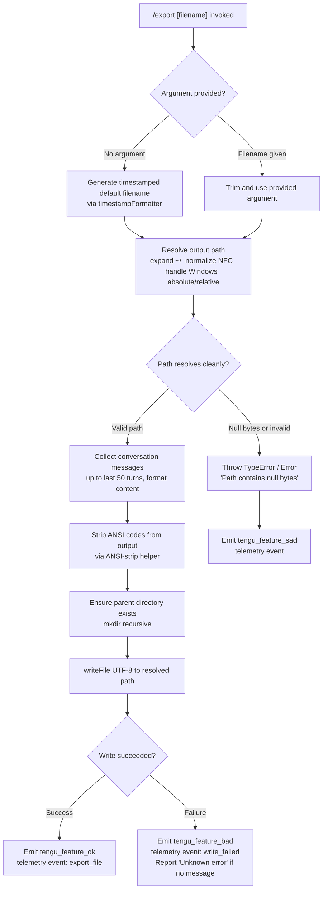

# `/export`

> Analysis basis: CC v2.1.161 bundle.js (AST extraction + Claude interpretation)
> Minimum version: v2.1.161

---

## Overview

The `/export` command serializes the current conversation transcript to a file on disk or (when no filename is provided) to a named default path derived from the current timestamp. It collects all conversation messages, formats them, resolves the output path (expanding `~/`, normalizing Unicode NFC, and handling Windows paths), then writes the resulting content to disk as a UTF-8 file, emitting telemetry on success or failure.

---

## Registration

| Field | Value |
|---|---|
| type | `local-jsx` |
| name | `export` |
| description | `Export the current conversation to a file or clipboard` |
| argumentHint | `[filename]` |
| module_id | `r6K` |
| load_inline | `true` |
| loc_byte | `12543855` |
| loc_byte_end | `12544051` |
| loc_line | `8787` |
| arbor_handler.name | `YNf` |
| arbor_handler.fqn | `claude-2.1.161::YNf` |
| arbor_handler.kind | `AsyncFunction` |
| arbor_handler.resolution_path | `module_id` |
| arbor_handler.n_hits | `0` |

Analysis basis: CC v2.1.161 bundle.js:+12543855

---

## Input Branching

Four distinct execution paths are present based on argument presence, path type, and write outcome:



---

## Behavioral Spec

### Main Handler (`YNf` — `exportCommandHandler`)

The Arbor-resolved handler `YNf` is an `AsyncFunction` reached via `module_id` → `r6K`.

```
async function exportCommandHandler(commandInput, appState):
    rawArg = commandInput.trim()

    // 1. Determine output filename
    if rawArg is empty:
        filename = generateTimestampedFilename(now)   // zNf
    else:
        filename = rawArg

    // 2. Collect and format conversation transcript
    messages = collectConversationMessages(appState)  // n6K, up to 50 user turns
    formattedText = buildTranscriptText(messages)     // DNf → TS8 → ONf
    stripped = stripANSICodes(formattedText)          // S4 / Bun.stripANSI

    // 3. Resolve output path
    resolvedPath = resolveFilePath(filename)          // GS8 → LNf → Pq

    // 4. Ensure parent directory and write
    parentDir = path.dirname(resolvedPath)            // ES8.dirname
    await fs.mkdir(parentDir, { recursive: true })   // WS8.mkdir
    await fs.writeFile(resolvedPath, stripped, "utf-8") // WS8.writeFile

    // 5. Telemetry
    if write succeeded:
        emit tengu_feature_ok  // export_file
    else:
        emit tengu_feature_bad // write_failed, "Unknown error" fallback
```

Analysis basis: CC v2.1.161 bundle.js:+12543287

---

### Timestamp-Based Default Filename Generation (`zNf` — `timestampFormatter`)

When no argument is supplied, a default filename is built from local wall-clock time components.

```
function generateTimestampedFilename(date):
    year    = date.getFullYear()
    month   = String(date.getMonth() + 1).padStart(2, "0")
    day     = String(date.getDate()).padStart(2, "0")
    hours   = String(date.getHours()).padStart(2, "0")
    minutes = String(date.getMinutes()).padStart(2, "0")
    seconds = String(date.getSeconds()).padStart(2, "0")
    return "claude-" + year + month + day + "-" + hours + minutes + seconds
    // e.g. "claude-20260603-142300"
```

Analysis basis: CC v2.1.161 bundle.js:+12543552

---

### Message Collection (`n6K` — `collectConversationMessages`)

Extracts the relevant portion of the conversation transcript for export.

```
function collectConversationMessages(appState):
    messages = appState.messages

    // Find last user-role message
    lastUserMsg = messages.find(m => m.role === "user")

    // Trim text content
    trimmed = lastUserMsg.content?.trim()

    // Guard: ensure content is array
    if Array.isArray(trimmed):
        relevant = trimmed.find(block => block.type === "text")
    
    // Take up to 50 turns, offset by 49 (0-indexed last 50)
    // substring used for text truncation within a block
    subset = messages.slice(-50)   // constants: 50, 49
    return subset
```

Analysis basis: CC v2.1.161 bundle.js:+12542769

---

### Transcript Formatting (`DNf` + `TS8` + `ONf` — `buildTranscriptText`)

Assembles collected messages into a single readable text block.

```
function buildTranscriptText(messages):
    parts = []
    for each message in messages:
        formatted = formatSingleMessage(message)   // ONf
        if formatted is not null:
            parts.push(stripANSICodes(formatted))  // S4
    return parts.join("\n")   // q.join
```

```
function formatSingleMessage(message):
    // Distinguishes export vs prompt block types
    // Handles "export", "prompt", "message", "assistant" roles
    // Applies message-level ANSI stripping (S4 / Bun.stripANSI)
    if message.type === "assistant":
        content = extractAssistantContent(message)  // $Nf, array check
    elif message.type === "message":
        content = extractMessageContent(message)
    // Falls through to plain text for "export"/"prompt" typed blocks
    return content or null
```

Analysis basis: CC v2.1.161 bundle.js:+12542261

---

### File Path Resolution (`GS8` / `LNf` / `Pq` — `resolveFilePath`)

Validates and normalizes the target output path.

```
function resolveFilePath(rawPath):
    ext = path.extname(rawPath)          // ES8.extname
    // If no extension detected, append default (inferred from .txt literal)
    
    validated = validateAndNormalizePath(rawPath)   // Pq

    return validated

function validateAndNormalizePath(inputPath):
    if inputPath contains null bytes:
        throw Error("Path contains null bytes")   // loc_byte: 1009359

    normalized = path.normalize(inputPath)         // xO → H.normalize, NFC
    normalized = normalized.normalize("NFC")       // Unicode normalization

    // Home-dir expansion
    if normalized.startsWith("~/"):
        homeDir = os.homedir()                     // DQ6.homedir
        normalized = path.join(homeDir, normalized.slice(2))  // hN.join, q.slice

    // Windows-style path detection
    if platform === "windows":
        // handle drive-letter paths                // q.match, i6, windows literal
        pass

    if path.isAbsolute(normalized):
        return normalized
    else:
        return path.resolve(normalized)            // hN.resolve
```

Analysis basis: CC v2.1.161 bundle.js:+12538758, +1009106, +1009359

---

### Atomic File-Write with Backup (`IBK` / `NBK` / `UJA` — `atomicWriteWithBackup`)

The actual on-disk write is performed through a helper that protects against partial writes and directory errors.

```
async function atomicWriteWithBackup(resolvedPath, content):
    parentDir = path.dirname(resolvedPath)         // he.dirname / IBK
    await ensureDirectoryExists(parentDir)          // qy

    // Attempt append/write to a temp path
    tempPath = buildTempPath(resolvedPath)          // BJA → he.join, N6
    await fs.mkdir(parentDir, { recursive: true }) // NBK → Ay.mkdir
    await fs.appendFile(tempPath, content)         // Ay.appendFile

    // Handle EISDIR errors
    try:
        stat = await fs.stat(resolvedPath)         // UJA → Ay.stat
        if resolvedPath.endsWith(".txt"):          // H.endsWith, ".txt" literal
            backup = resolvedPath.slice(0, -4)    // H.slice, constant 4
        await fs.rename(tempPath, resolvedPath)    // Ay.rename
    except error if error.code === "EISDIR":       // "EISDIR" literal loc_byte: 174728
        await fs.unlink(resolvedPath)             // Ay.unlink, k8
    
    byteLen = Buffer.byteLength(content)           // Buffer.byteLength
    updateProgressIndicator(byteLen)               // gJA
    scheduleProgressReset(byteLen)                 // vm6.then, NBK.bind
```

Analysis basis: CC v2.1.161 bundle.js:+204086, +203840, +203899, +174728

---

### Progress / Clipboard Hook Registration (`Y9` — `registerClipboardHook`)

After write, a clipboard/hook registration step is triggered.

```
function registerClipboardHook(context):
    tYA.register(context)    // Y9 → tYA.register, loc_byte: 59405
```

Analysis basis: CC v2.1.161 bundle.js:+204448

---

## State & Side Effects

| Item | Detail |
|---|---|
| Telemetry: `tengu_feature_ok` | Emitted on successful file write; paired with event string `export_file` (bundle.js:+12543339) |
| Telemetry: `tengu_feature_bad` | Emitted on write failure; paired with event string `write_failed` (bundle.js:+12543416); falls back to `"Unknown error"` message (bundle.js:+12543497) |
| Telemetry: `tengu_feature_sad` | Emitted on path-resolution or pre-write errors (bundle.js:+966732) |
| File system: `mkdir` | Creates parent directory recursively before write (bundle.js:+12538778) |
| File system: `writeFile` | Writes UTF-8 encoded transcript to resolved path (bundle.js:+12538825, encoding literal `"utf-8"` at +12538853) |
| File system: `appendFile` | Used in atomic write helper for temp path (bundle.js:+203899) |
| File system: `rename` / `unlink` | Atomic swap; removes destination on EISDIR (bundle.js:+203597, +203637) |
| Hook registration | `tYA.register` called post-write for clipboard or notification hook (bundle.js:+59405) |
| Progress indicator | `gJA` and `vm6.then` used to update and reset a write-progress display (bundle.js:+204326, +204343) |
| ANSI stripping | `Bun.stripANSI` / `S4` applied to transcript content before writing (bundle.js:+3818350) |
| appState changes | Reads `appState.messages`; no writes to appState detected in depth-2 traversal |
| Sound | <!-- TODO: not found in depth-2 traversal; needs --depth 4 --> |

---

## Version History

| Version | Change |
|---|---|
| v2.1.161 | Initial analysis |

---

## Common Mistakes

1. **Omitting the file extension**: If no extension is included in the `[filename]` argument and the path resolver does not auto-append `.txt`, the resulting file may have no extension. The `.txt` literal at bundle.js:+203545 suggests the handler normalizes `.txt`-suffixed paths during backup rotation; users should supply an explicit extension when a specific format is desired.

2. **Relative paths resolving unexpectedly**: Relative filenames are resolved against the process working directory via `path.resolve`, not the project root. Use `~/` prefixes or absolute paths to pin the output location.

3. **Running `/export` during an active stream**: The command collects messages at the moment of invocation. Messages still streaming will not be fully captured. Wait for the response to complete before exporting.

4. **Path contains `~/` on Windows**: The home-directory expansion branches on `DQ6.homedir()` and `hN.join`; on Windows, drive-letter path detection is applied separately. A path like `~/Documents/out.txt` should expand correctly, but backslash-heavy Windows paths with special characters may trip the null-byte or normalization guard.

5. **EISDIR collision**: If the target path already exists as a directory, the atomic writer catches `EISDIR` and removes the directory entry before completing the write. This is destructive — do not name the export file the same as an existing directory.

---

## Appendix — Identifier Mapping

> For bundle debugging only. Identifiers change across versions.

| Identifier | Role |
|---|---|
| `YNf` | Main export command handler (`exportCommandHandler`), AsyncFunction, Arbor-resolved |
| `DNf` | Transcript build dispatcher; delegates to `TS8` |
| `TS8` | Transcript assembler; iterates messages, joins with newline |
| `ONf` | Single-message formatter; handles assistant/message/export/prompt types |
| `MNf` | Sub-formatter helper called from `ONf` |
| `$Nf` | Array-check guard for assistant content blocks |
| `GS8` | File-write orchestrator; calls path resolver then `WS8.writeFile` |
| `LNf` | Extension-detection layer; calls `Pq` for full path resolution |
| `Pq` | Core path validator and normalizer (null-byte check, NFC, `~/`, Windows, absolute/resolve) |
| `xO` | Unicode NFC normalizer wrapper |
| `h6` | Path resolution sub-helper called by `Pq` |
| `zNf` | Timestamp-based default filename generator |
| `n6K` | Conversation message collector (up to 50 turns) |
| `i6K` | Argument lowercasing helper (called from main handler entry) |
| `IBK` | Atomic file-write coordinator with backup logic |
| `NBK` | Chunked/append write helper; calls `mkdir`, `appendFile`, `BJA`, `UJA` |
| `UJA` | Stat-and-rename helper; handles `.txt` backup and EISDIR |
| `BJA` | Temp-path builder using `he.join` and `N6` |
| `WmH` | Write-queue / debounce manager using `setTimeout` / `setImmediate` |
| `_3H` | Sub-queue processor within write pipeline |
| `d46` | EISDIR error handler helper |
| `F6` | File handle or descriptor helper |
| `Y9` | Clipboard/hook registration dispatcher → `tYA.register` |
| `imH` | File-write helper calling `GJA` → `H.write` |
| `GJA` | Low-level write call wrapper |
| `S4` | ANSI-strip utility wrapper (`Bun.stripANSI`) |
| `O` | Session-state check (stopped / background session guard) |
| `SH` | JSON serializer helper (`JSON.stringify`) |
| `Z4` | Filename extension extractor and replacement helper |
| `CJA` | Message-map iterator helper |
| `N` | Export format dispatcher (handles `debug`, format branching) |
| `VBK` | Format selector calling `qy`, `ZBK`, `HwA` |
| `HwA` | Format sub-processor calling `NmK`, `ImK` |
| `gc` | Permission / plan-mode guard (checks `isPlanModeRequired`, `isTeammate`) |
| `StH` | JSX element creator for export output UI |
| `hH` | Success notification renderer (calls `d`, `h1H`) |
| `RH` | Failure notification renderer (calls `d`, `h1H`) |
| `t6` | Bootstrap fetch helper |
| `h1H` | Notification display helper using `Xa8` |
| `lq` | Model/provider resolution pipeline |
| `xHH` | Model identifier parser |
| `nQ` | Model prefix/suffix classifier |
| `s9` | Model alias normalizer (opusplan, sonnet, haiku, opus, best) |
| `x0` | Model key lookup (`kKH`) |
| `NKH` | Model inclusion checker (`vKH.includes`) |
| `aN` | Model builder (calls `UM`, `Vf`) |
| `CgH` | Model tier helper (calls `Vf`) |
| `KG` | Provider classifier (firstParty, `UM`, `Vf`, `PA`) |
| `Xwq` | Best-model selector via `KG` |
| `UM` | Provider-type resolver → `PA` |
| `Us6` | Provider allowlist checker (`wHL.includes`) |
| `bgH` | Provider fallback helper → `pH` |
| `xP` | Model pipeline entry calling `s9`, `b0` |
| `b0` | Full model-resolution combinator |
| `W7` | Message substring extractor calling `eq` |
| `eq` | Index-based string slicer (`indexOf`, `slice`) |
| `ne` | Feature-flag checker (`WA4.has`) |
| `Ij` | String replacement utility |
| `L85` | <!-- TODO: not found in depth-2 traversal; needs --depth 4 --> |
| `s$` | <!-- TODO: not found in depth-2 traversal; needs --depth 4 --> |
| `_` | Generic local variable / intermediate (context-dependent) |
| `H` | Generic local variable / intermediate (context-dependent) |
| `A` | Generic local variable / intermediate (context-dependent) |
| `q` | Generic local variable / intermediate (context-dependent) |
| `N6` | Path segment joiner utility |
| `qy` | Directory existence ensurer |
| `gJA` | Progress indicator updater |
| `v8` | EISDIR sub-handler |
| `k8` | Unlink error handler helper |
| `Im6` | Sub-queue item processor |
| `r8` | Queue flush helper |