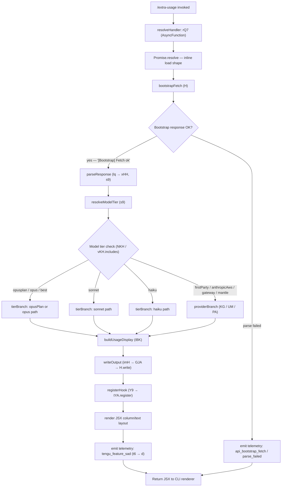

# `/extra-usage`

> Analysis basis: CC v2.1.161 bundle.js (AST extraction + Claude interpretation)
> Minimum version: v2.1.161

---

## Overview

`/extra-usage` is a hidden legacy alias that has been renamed to `/usage-credits`. It is registered as a `local-jsx` command and delegates immediately to the same handler chain that powers the successor command. Users invoking `/extra-usage` will experience identical behavior to `/usage-credits`; the command exists solely for backward compatibility and is intentionally concealed from autocomplete and help listings.

---

## Registration

| Field | Value |
|---|---|
| type | `local-jsx` |
| name | `extra-usage` |
| description | `Renamed to /usage-credits` |
| isHidden | `true` |
| module_id | `Ec_` |
| load_inline | `true` |
| loc_byte | `9254573` |
| loc_byte_end | `9254758` |
| loc_line | `4063` |
| arbor_handler.name | `rQ7` |
| arbor_handler.fqn | `claude-2.1.161::rQ7` |
| arbor_handler.kind | `AsyncFunction` |
| arbor_handler.resolution_path | `module_id` |
| arbor_handler.n_hits | `0` |

Analysis basis: CC v2.1.161 bundle.js:+9254573

---

## Input Branching

The command's entry path involves more than three distinct call branches inside the handler chain (bootstrap fetch, JSX render path, model-tier resolution, file I/O, telemetry). A Mermaid flowchart is therefore required.



Analysis basis: CC v2.1.161 bundle.js:+9253570 – +9254758

---

## Behavioral Spec

### 1. Handler Resolution and Inline Load

The registration uses `load_inline: true`, meaning the handler is delivered via an inline `Promise.resolve({ call: handlerIdent })` shape rather than a separate module boundary. Arbor resolved the handler as `rQ7` (AsyncFunction) by following the `module_id` path (`Ec_` → module exports → `rQ7`).

```
async function resolveExtraUsageHandler():
    return Promise.resolve({ call: asyncUsageHandler })
```

Analysis basis: CC v2.1.161 bundle.js:+9253570

### 2. Bootstrap Fetch

The primary handler `rQ7` immediately invokes the shared bootstrap-fetch utility. This utility emits the log marker `"[Bootstrap] Fetching"` on entry, sets `Content-Type: application/json` and `User-Agent` headers, applies a 5000 ms timeout, and on success emits `"[Bootstrap] Fetch ok"`. On parse failure the utility records `parse_failed` under the `api_bootstrap_fetch` telemetry bucket.

```
async function bootstrapFetch(url, options):
    log("[Bootstrap] Fetching", url)
    set header "Content-Type" = "application/json"
    set header "User-Agent"   = <version string>
    response = await fetch(url, { timeout: 5000, ...options })
    if response is not parseable:
        recordTelemetry("api_bootstrap_fetch", { status: "parse_failed" })
        return error
    log("[Bootstrap] Fetch ok")
    return parsedResponse
```

Analysis basis: CC v2.1.161 bundle.js:+15504120 (timeout: +15504313, headers: +15504207/+15504241)

### 3. Response Parsing and Model-Tier Resolution

After a successful fetch the response is processed through the response-parser chain (`lq → xHH → s9`). The parser trims and lower-cases the raw model identifier, then classifies it against a known-tier inclusion list (`vKH.includes`). Recognised tier tokens are: `opusplan`, `opus`, `best`, `sonnet`, `haiku`. Provider tokens include `firstParty`, `anthropicAws`, `gateway`, and `mantle`.

```
function resolveModelTier(rawModel):
    model = rawModel.trim().toLowerCase()
    model = applyModelAliasSubstitutions(model)   // A.replace
    tier  = checkInclusionList(model)              // NKH → vKH.includes
    if tier in ["opusplan"]:
        return providerGroup("opusPlan", model)    // aN → UM + Vf
    if tier in ["opus", "best"]:
        return providerGroup("opus", model)
    if tier in ["sonnet"]:
        return providerGroup("sonnet", model)      // CgH → Vf
    if tier in ["haiku"]:
        return providerGroup("haiku", model)
    // provider-level resolution
    if provider in ["firstParty"]:
        return KG(UM, Vf, PA)
    if provider in ["anthropicAws", "gateway"]:
        return UM(PA)
    if provider == "mantle":
        return mantle path (b0 → Vf)
    return defaultGroup(model)
```

Analysis basis: CC v2.1.161 bundle.js:+2236058 (trim/lower), +2236133 (NKH inclusion check), +2236154/+2236195/+2236234/+2236273/+2236310 (tier literals), +2232362/+2050606/+2050626/+2233003 (provider literals)

### 4. File I/O — Transcript Logging (IBK chain)

The usage handler participates in the shared transcript-logging subsystem. Key behaviors:

- **Directory resolution**: uses `path.dirname` to locate the target directory (CC v2.1.161 bundle.js:+204119).
- **File existence / rename**: checks whether the target path ends with `.txt`; if so, a rename is attempted with a 4-byte header reservation; on failure the file is unlinked (CC v2.1.161 bundle.js:+203534/+203567/+203597/+203637).
- **EISDIR guard**: if the filesystem returns `EISDIR`, the write is aborted gracefully (CC v2.1.161 bundle.js:+174728).
- **Buffer sizing**: `Buffer.byteLength` is used before every append to guard against oversized writes (CC v2.1.161 bundle.js:+204293).
- **Append path**: `fs.appendFile` writes the payload; `fs.mkdir` ensures parent directory exists first (CC v2.1.161 bundle.js:+203840/+203899).
- **Debounce**: the write queue uses `clearTimeout` / `setTimeout` with a 1000 ms delay and a batch limit of 100 items; `setImmediate` is used for flush (CC v2.1.161 bundle.js:+58707/+58728/+58819/+58983/+59076).

```
async function transcriptAppend(filePath, content):
    dir = path.dirname(filePath)
    await fs.mkdir(dir, { recursive: true })
    byteLen = Buffer.byteLength(content)
    if path ends with ".txt":
        await fs.rename(filePath, renamedPath)   // 4-byte reservation
    try:
        await fs.appendFile(filePath, content)
        triggerRotationCheck(filePath)           // UJA / BJA
    catch err:
        if err.code == "EISDIR": return          // abort silently
        throw err
```

Analysis basis: CC v2.1.161 bundle.js:+204086 (IBK entry), +203545 (".txt" literal), +203567 (4 literal)

### 5. Hook Registration

After the usage display is built, the handler registers a cleanup hook via `tYA.register` (reached through `Y9`). This hook is part of the standard command lifecycle and fires on session teardown.

```
function registerCleanupHook(context):
    tYA.register(context, cleanupCallback)
```

Analysis basis: CC v2.1.161 bundle.js:+59405

### 6. JSX Render Output

The final output is assembled as a JSX tree with `column` and `text` layout primitives, which the CLI renderer converts to terminal output.

Analysis basis: CC v2.1.161 bundle.js:+9253728 ("column"), +9253887 ("text")

### 7. Telemetry Emission

A single telemetry event `tengu_feature_sad` is emitted during rendering, reached via `t6 → d`. This is the standard "feature used" (sad = "slash-command activated / dispatched") instrumentation that every slash command fires.

Analysis basis: CC v2.1.161 bundle.js:+966732

---

## State & Side Effects

| Item | Detail |
|---|---|
| Telemetry | `tengu_feature_sad` (bundle.js:+966732); `api_bootstrap_fetch` / `parse_failed` on bootstrap error (bundle.js:+15504434/+15504456) |
| Hook registration | Cleanup hook registered via `tYA.register` on every invocation (bundle.js:+59405) |
| appState changes | None observed at depth-2 traversal |
| File I/O | Transcript append via `fs.appendFile`; directory creation via `fs.mkdir`; conditional `fs.rename` / `fs.unlink` for `.txt` rotation (bundle.js:+203840–203986) |
| Sound | <!-- TODO: not found in depth-2 traversal; needs --depth 4 --> |
| Debug logging | String literal `"debug"` present in shared path (bundle.js:+204573); conditional debug output active when debug mode is enabled |

---

## Version History

| Version | Change |
|---|---|
| v2.1.161 | Initial analysis; command present as hidden alias, renamed to `/usage-credits` |

---

## Common Mistakes

1. **Invoking `/extra-usage` expecting distinct behavior**: this command is a transparent alias. All logic, output, and telemetry are identical to `/usage-credits`. Prefer `/usage-credits` for forward compatibility.
2. **Assuming the command is interactive or prompts the agent**: `type: local-jsx` means the handler runs locally and renders a static JSX component — no agent round-trip occurs.
3. **Expecting the command in autocomplete**: `isHidden: true` suppresses the command from help listings and tab-completion. It must be typed in full.
4. **Treating the bootstrap timeout as user-configurable**: the 5000 ms fetch timeout (bundle.js:+15504313) is a hardcoded constant and cannot be overridden via CLI flags.
5. **Assuming write failures abort the command**: `EISDIR` errors in the transcript-logging path are silently swallowed (bundle.js:+174728); the JSX render and telemetry still complete normally.

---

## Appendix — Identifier Mapping

> For bundle debugging only. Identifiers change across versions.

| Identifier | Role |
|---|---|
| `rQ7` | Primary async handler for `/extra-usage` (resolved by Arbor via module_id `Ec_`) |
| `oQ7` | Loader shim — inline `Promise.resolve({call: rQ7})` wrapper |
| `H` | Bootstrap fetch utility (shared across commands) |
| `N` | Response processing / dispatch coordinator |
| `VBK` | Sub-dispatch within response processor |
| `HwA` | Nested helper within VBK; calls NmK and ImK |
| `NmK` | Sub-helper within HwA |
| `ImK` | Sub-helper within HwA |
| `SH` | JSON serialization helper (calls JSON.stringify) |
| `_` | String operand / intermediate value (toUpperCase / replace path) |
| `Z4` | Path / string manipulation utility (replace, lastIndexOf, slice) |
| `CJA` | Map-based transform over WBK array |
| `q` | Array/collection operand; also references unlinkSync in a separate path |
| `A` | String or path operand; toLowerCase, slice, replace |
| `imH` | Write-output dispatcher (calls GJA → H.write) |
| `GJA` | Low-level write wrapper |
| `IBK` | Transcript-logging entry point (mkdir, appendFile, rotation) |
| `WmH` | Debounce / batch-write queue (clearTimeout, setTimeout, setImmediate) |
| `_3H` | Sub-helper within IBK; calls Im6, r8, N6 |
| `Im6` | Sub-helper within _3H |
| `r8` | Sub-helper within _3H |
| `N6` | Sub-helper within _3H and BJA |
| `F6` | Helper within IBK file-path logic |
| `d46` | File-error classifier (EISDIR guard) |
| `v8` | Sub-helper within d46 |
| `BJA` | Path-join + N6 helper for transcript rotation |
| `UJA` | File-stat / rename / unlink rotation handler |
| `k8` | Sub-helper within UJA |
| `NBK` | mkdir + appendFile + rotation bound callback |
| `gJA` | Helper called from IBK and NBK |
| `vm6` | Promise chain operand within IBK |
| `Y9` | Hook registration dispatcher (calls tYA.register) |
| `s$` | State accessor within bootstrap path |
| `ne` | Cache/set membership check (WA4.has) |
| `Ij` | String replacement helper within H path |
| `lq` | Response-parser entry point (calls xHH, s9, xP) |
| `xHH` | Parser combinator: NT, o9H, VA, nQ |
| `NT` | Token parser within xHH |
| `o9H` | Token parser within xHH |
| `nQ` | Line-by-line parser; anthropic-prefix check, model token extraction |
| `VA` | Shared value constructor within parser |
| `s9` | Model-tier resolution function (trim, toLowerCase, tier lookup) |
| `x0` | Sub-lookup within s9 (calls kKH) |
| `NKH` | Inclusion-list checker against vKH |
| `aN` | Tier builder for opusPlan (UM + Vf) |
| `CgH` | Tier builder for sonnet (Vf) |
| `KG` | Provider resolver: firstParty (UM, Vf, PA) |
| `Xwq` | Wrapper calling KG |
| `UM` | Provider constructor (calls PA) |
| `Us6` | Inclusion check against wHL |
| `bgH` | Calls pH helper |
| `xP` | Outer parser wrapper (calls s9 and b0) |
| `b0` | Full model-object builder (wA, BHH, RzH, xgH, KG, sX, UM, PA, Vf, aN) |
| `t6` | Telemetry dispatch for tengu_feature_sad (calls d and h1H) |
| `d` | Core telemetry emitter |
| `h1H` | Secondary telemetry helper (calls Xa8) |
| `Xa8` | Telemetry sink / formatter |

---

Note: index built via Arbor fallback; some signals (telemetry, literals) may be missing — see arbor-fallback.js.