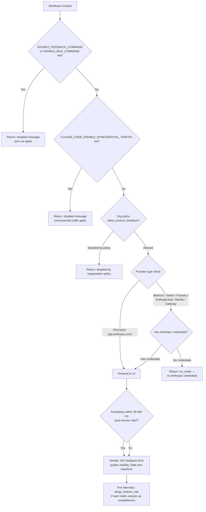

# `/feedback`

> Analysis basis: CC v2.1.161 bundle.js (AST extraction + Claude interpretation)
> Minimum version: v2.1.161

---

## Overview

The `/feedback` command (also aliased as `/share` and `/bug`) allows users to submit product feedback, file bug reports, or share conversation context with Anthropic. Before opening the feedback UI, the command evaluates a multi-stage gate: environment-variable overrides, organizational policy flags, provider compatibility, and credential availability. If all gates pass, a JSX-rendered submission form is presented to the user.

---

## Registration

| Field | Value |
|---|---|
| type | `local-jsx` |
| name | `feedback` |
| description | `Submit feedback, report a bug, or share your conversation` |
| aliases | `["share", "bug"]` |
| argumentHint | `[report]` |
| module_id | `mS1` |
| load_inline | `true` |
| loc_byte | `10884910` |
| loc_byte_end | `10885133` |
| loc_line | `7151` |
| arbor_handler.name | `Hff` |
| arbor_handler.fqn | `claude-2.1.161::Hff` |
| arbor_handler.kind | `AsyncFunction` |
| arbor_handler.resolution_path | `module_id` |
| arbor_handler.n_hits | `0` |

Analysis basis: CC v2.1.161 bundle.js:+10884910

---

## Input Branching

The command implementation contains six or more distinct conditional branches (environment variables, organizational policy, provider type, credential state). A Mermaid flowchart is mandatory here.



Analysis basis: CC v2.1.161 bundle.js:+10862886, +10863045, +10863163, +10863327, +10863934, +10884299

---

## Behavioral Spec

### Gate 1 — Environment Variable Disable Check

The handler (resolved via Arbor as `Hff`, an `AsyncFunction` in module `mS1`) first inspects process environment variables.

```
function checkEnvDisable(commandName):
    if env["DISABLE_FEEDBACK_COMMAND"] is set:
        return DisabledResult("/feedback has been disabled via the DISABLE_FEEDBACK_COMMAND environment variable")
    if env["DISABLE_BUG_COMMAND"] is set:
        return DisabledResult("/feedback has been disabled via the DISABLE_BUG_COMMAND environment variable")
    return null  // not disabled
```

Analysis basis: CC v2.1.161 bundle.js:+10862886, +10862904, +10863045

---

### Gate 2 — Nonessential Traffic Disable Check

```
function checkNonessentialTrafficDisable():
    if env["CLAUDE_CODE_DISABLE_NONESSENTIAL_TRAFFIC"] is set:
        return DisabledResult("/feedback has been disabled via the CLAUDE_CODE_DISABLE_NONESSENTIAL_TRAFFIC environment variable")
    return null
```

The telemetry subsystem itself recognizes `"essential-traffic"` and `"no-telemetry"` modes (bundle.js:+970636, +970695), which downstream affects whether the feedback endpoint can be reached at all.

Analysis basis: CC v2.1.161 bundle.js:+10863163

---

### Gate 3 — Organizational Policy Check

The handler calls the org-settings resolver (`G9` → `I19`) and inspects the `allow_product_feedback` flag. The check queries whether the current account belongs to an `"enterprise"` or `"team"` plan tier.

```
function checkOrgPolicy(orgSettings):
    planTier = orgSettings.plan  // "enterprise" | "team" | other
    if orgSettings.allow_product_feedback == false:
        return DisabledResult("/feedback has been disabled by your organization's policy")
    return null
```

Analysis basis: CC v2.1.161 bundle.js:+4155678, +10863327, +4155402, +4155437

---

### Gate 4 — Provider Compatibility Check

The provider resolver (`PA`) maps the active API provider to a human-readable label and decides whether Anthropic-issued credentials are required.

```
function resolveProviderLabel(providerConfig):
    switch providerConfig.type:
        case "bedrock":      return "Amazon Bedrock"
        case "vertex":       return "Vertex AI"
        case "foundry":      return "Microsoft Foundry"
        case "anthropicAws": return "Claude Platform on AWS"
        case "mantle":       return "Amazon Bedrock (Mantle)"
        case "gateway":      return "an API gateway"
        case "firstParty":   return null  // direct Anthropic; no extra gate
```

Analysis basis: CC v2.1.161 bundle.js:+10863459, +10863534, +10863605, +10863689, +10863772, +10863857

---

### Gate 5 — Credential Availability Check

For non-first-party providers, the handler checks whether Anthropic credentials (OAuth token, API key) are present. The credential checker (`yU` → `jd` / `wA`) inspects:

- OAuth token availability; absence yields `"No OAuth token available"`.
- API key availability; absence yields `"No API key available"`.
- Cloud gateway path yields `"Not available when using a Cloud gateway"`.

```
function checkCredentials(providerLabel, authContext):
    if authContext is third-party provider:
        // "Anthropic auth not used on third-party providers"
        return CredentialResult.thirdParty
    if authContext.oauthToken is absent:
        if providerLabel is cloud gateway:
            return CredentialResult.unavailable("Not available when using a Cloud gateway")
        return CredentialResult.missing("No OAuth token available")
    if authContext.apiKey is absent:
        return CredentialResult.missing("No API key available")
    if neither credential exists:
        return DisabledResult("no_creds", "no Anthropic credentials")
    return CredentialResult.ok
```

The `x-api-key` header and `anthropic-beta` header are referenced in the credential assembly path.

Analysis basis: CC v2.1.161 bundle.js:+10863934, +10863951, +3024835, +3024950, +3025100, +3025185, +3025225

---

### Main Handler — Feedback Form Rendering

Entry point is `Hff` (AsyncFunction, `module_id` resolution). It delegates UI rendering to `uS1`, which calls `Me_.createElement` to produce the JSX form.

```
async function feedbackCommandHandler(args, appState):
    // Gate evaluation (see Gates 1–5 above)
    disabledReason = checkEnvDisable() 
                  ?? checkNonessentialTrafficDisable()
                  ?? checkOrgPolicy(appState.orgSettings)
    if disabledReason:
        return renderDisabledMessage(disabledReason)

    providerLabel = resolveProviderLabel(appState.provider)
    credResult = checkCredentials(providerLabel, appState.auth)
    if credResult.isDisabled:
        return renderDisabledMessage(credResult.message)

    // Session timestamp gate
    sessionAge = Date.now() - appState.sessionStartTime
    // 30 000 ms constant used as submission window reference
    submissionContext = buildSubmissionContext(sessionAge, 30000)

    // Render JSX form (visibility: "public")
    return renderFeedbackForm({
        visibility: "public",
        providerLabel: providerLabel,
        submissionContext: submissionContext,
        method: "post"
    })
```

Analysis basis: CC v2.1.161 bundle.js:+10884741, +10884523, +10884280, +10884299, +10884716, +10863991

---

### Conversation Log Export Sub-flow

The `/share` alias triggers the same handler but the conversation log serialization path (`N` → `imH` → `GJA`) is engaged. It:

1. Serializes conversation messages via `JSON.stringify` (called through `SH`).
2. Writes output via `H.write` path (`GJA`).
3. Sanitizes authorization headers — values are replaced with `"[REDACTED]"` to avoid credential leakage in shared content.
4. Truncates long model-name suffixes: path segments beyond a `lastIndexOf` threshold (length limit: 40 chars, bundle.js:+15930336) are trimmed.

```
function serializeConversationForShare(messages, headers):
    sanitized = headers.map(h =>
        isSensitiveHeader(h.name) ? { ...h, value: "[REDACTED]" } : h
    )
    payload = JSON.stringify({ messages, headers: sanitized })
    writeToLogFile(payload)
    return payload
```

Analysis basis: CC v2.1.161 bundle.js:+196705, +15930336, +184155

---

### Transcript / Log Persistence Sub-flow

The log persistence helper (`IBK`) manages append-only transcript files:

1. Resolves the log directory via `he.dirname`.
2. Checks for an existing `.txt` file and may rename it (rotation via `UJA` → `Ay.rename`).
3. Creates the directory if absent (`Ay.mkdir`).
4. Appends new content (`Ay.appendFile`).
5. Checks `Buffer.byteLength` before each write.
6. Uses `setTimeout` / `clearTimeout` / `setImmediate` for debounced flush (`WmH`).
   - Debounce delay: 1000 ms (bundle.js:+58707); batch size limit: 100 entries (bundle.js:+58728).
7. Registers a cleanup hook via `tYA.register` (`Y9`).

```
async function persistTranscript(content, logDir):
    dir = path.dirname(logDir)
    await fs.mkdir(dir, { recursive: true })
    existing = await checkExistingFile(dir)
    if existing.endsWith(".txt"):
        await fs.rename(existing, rotatedName(existing))
    byteLen = Buffer.byteLength(content)
    await fs.appendFile(logPath, content)
    scheduleFlush(debounceMs=1000, batchLimit=100)
```

Analysis basis: CC v2.1.161 bundle.js:+204119, +203545, +203597, +203840, +203899, +203992, +58707, +58728, +59405

---

### Bootstrap Fetch Sub-flow

When the feedback form requires fetching remote configuration (e.g., updated submission endpoints), the bootstrap fetcher (`H` → `N`) runs:

- Issues an HTTP GET with `Content-Type: application/json` and a `User-Agent` header identifying `@anthropic-ai/claude-code` v`2.1.161`.
- Timeout: 5000 ms (bundle.js:+15504313).
- On parse failure emits event label `"parse_failed"` under telemetry key `"api_bootstrap_fetch"`.
- On success logs `"[Bootstrap] Fetch ok"`.

```
async function bootstrapFetch(url):
    response = await fetch(url, {
        timeout: 5000,
        headers: {
            "Content-Type": "application/json",
            "User-Agent": buildUserAgent("@anthropic-ai/claude-code", "2.1.161")
        }
    })
    if not response.ok:
        emitTelemetry("api_bootstrap_fetch", { status: "parse_failed" })
        throw new Error("[Bootstrap] Fetching failed")
    log("[Bootstrap] Fetch ok")
    return response.json()
```

Analysis basis: CC v2.1.161 bundle.js:+15504207, +15504222, +15504241, +15504313, +15504434, +15504456, +15504486

---

## State & Side Effects

| Item | Detail |
|---|---|
| Telemetry | `tengu_feature_sad` — fired when user marks the session as unsatisfactory (bundle.js:+966732) |
| Telemetry modes | `"essential-traffic"` (bundle.js:+970636) and `"no-telemetry"` (bundle.js:+970695) affect whether the feedback endpoint is reachable |
| Bootstrap telemetry | `"api_bootstrap_fetch"` / `"parse_failed"` emitted on remote config fetch failure (bundle.js:+15504434) |
| Log persistence | Transcript appended to an append-only `.txt` log file in the configured log directory; file is rotated when present |
| Hook registration | `tYA.register` called by `Y9` to register a cleanup/finalization hook (bundle.js:+59405) |
| Debounce flush | Log writes are debounced with a 1000 ms delay and a 100-entry batch limit (bundle.js:+58707, +58728) |
| Credential sanitization | Authorization header values replaced with `"[REDACTED]"` before any share/export (bundle.js:+196705) |
| appState changes | Session start timestamp captured via `Date.now()` (bundle.js:+10884280); `"public"` visibility flag set on submission context (bundle.js:+10884716) |
| Sound | <!-- TODO: not found in depth-2 traversal; needs --depth 4 --> |
| JSX render | `Me_.createElement` used to build the feedback form component (bundle.js:+10884523) |

---

## Version History

| Version | Change |
|---|---|
| v2.1.161 | Initial analysis |

---

## Common Mistakes

1. **Expecting `/feedback` to work on all providers without credentials.** On third-party providers (Bedrock, Vertex, Foundry, Mantle, Claude Platform on AWS, gateway), the command requires valid Anthropic credentials (OAuth token or API key). Without them the command returns a `no_creds` disabled message rather than opening the form.

2. **Assuming `/bug` and `/share` are separate commands.** Both are aliases registered on the same handler. They go through identical gating logic; the alias name does not change behavior.

3. **Setting `DISABLE_FEEDBACK_COMMAND` but not `DISABLE_BUG_COMMAND`.** Both environment variables must be set to suppress all invocation paths because they are checked independently (bundle.js:+10862904, +10863045).

4. **Expecting the command to be available when `CLAUDE_CODE_DISABLE_NONESSENTIAL_TRAFFIC` is set.** This variable causes an early-exit disabled message before any provider or credential check occurs.

5. **Misunderstanding organizational policy scope.** The `allow_product_feedback` policy flag is only consulted for `"enterprise"` and `"team"` plan tiers; other tiers bypass this check entirely (bundle.js:+4155678, +4155402, +4155437).

6. **Assuming shared conversation logs contain raw headers.** All sensitive headers are replaced with `"[REDACTED]"` before serialization; downstream consumers should not rely on raw credential values being present in exported transcripts.

---

## Appendix — Identifier Mapping

> For bundle debugging only. Identifiers change across versions.

| Identifier | Role |
|---|---|
| `Hff` | Main async handler for `/feedback` command (Arbor-resolved entry point) |
| `uS1` | JSX feedback form renderer; called by `Hff` |
| `CCH` | Disable-gate evaluator; checks env vars and org policy |
| `r9` | Telemetry mode resolver (essential-traffic / no-telemetry / default) |
| `qkA` | Telemetry mode lookup helper |
| `pH` | String normalization / primitive coercion utility |
| `G9` | Organizational policy fetcher and `allow_product_feedback` checker |
| `I19` | Org settings inner resolver |
| `_J6` | Org settings data transformer |
| `qC` | Auth context builder |
| `PA` | Provider-type-to-label mapper |
| `l7` | Locale / language helper used in auth context |
| `e3` | Auth credential assembler (API key, OAuth, WIF) |
| `Sj` | OAuth token resolver |
| `Z4H` | Provider string formatter |
| `q` | File unlink helper (transcript cleanup) |
| `yU` | Credential availability checker |
| `jd` | Third-party provider auth guard |
| `pM` | Provider config accessor |
| `wA` | OAuth token retriever |
| `KD` | Full credential assembler (combines key + OAuth) |
| `SR` | Array/header inclusion checker |
| `JW` | Auth error wrapper |
| `H` | Bootstrap fetch orchestrator |
| `N` | HTTP fetch executor with header assembly |
| `VBK` | Fetch request builder |
| `HwA` | Node module importer pair (NmK / ImK) |
| `SH` | JSON serializer for conversation export |
| `_` | String utility (toUpperCase, trim, replace, toLowerCase) |
| `Z4` | URL/path sanitizer; redacts sensitive segments |
| `CJA` | Header map processor |
| `A` | String/array utility (lastIndexOf, slice, toLowerCase) |
| `imH` | Conversation write dispatcher |
| `GJA` | Low-level file write helper |
| `IBK` | Append-only log persistence manager |
| `WmH` | Debounced flush scheduler (setTimeout/clearTimeout/setImmediate) |
| `_3H` | Log path builder (joins segments, resolves root) |
| `F6` | Log file path config reader |
| `d46` | EISDIR-safe file existence checker |
| `BJA` | Log file path joiner |
| `UJA` | Log file rotation handler (stat / rename / unlink) |
| `NBK` | Log write executor (mkdir + appendFile + rotation) |
| `Y9` | Cleanup hook registrar (tYA.register) |
| `s$` | Session state accessor |
| `ne` | Active session set membership checker (WA4.has) |
| `Ij` | String replacement utility |
| `lq` | Conversation message formatter |
| `xHH` | Message structure builder |
| `NT` | Message type normalizer |
| `o9H` | Message ordering helper |
| `nQ` | Model-name parser / extractor |
| `s9` | Model alias resolver (opusplan / sonnet / haiku / opus / best) |
| `x0` | Model ID key builder (kKH) |
| `NKH` | Supported model inclusion checker |
| `aN` | Model capability flag pair (UM / Vf) |
| `CgH` | Model capability single-flag resolver (Vf) |
| `KG` | Model resolution with provider mapping (UM / Vf / PA) |
| `Xwq` | Model alias expansion via KG |
| `UM` | Primary model config accessor |
| `Us6` | Model whitelist inclusion checker |
| `bgH` | Model string formatter (pH) |
| `xP` | Full conversation turn processor (s9 + b0) |
| `b0` | Turn context builder (wA / BHH / RzH / xgH / KG / sX / UM / PA / Vf / aN) |
| `t6` | Session timing helper |
| `d` | Low-level timer/date primitive |
| `h1H` | Session start time accessor (Xa8) |
| `Xa8` | Session timestamp store |
| `xS1` | Submission timestamp recorder (Date.now) |

---

Note: index built via Arbor fallback; some signals (telemetry, literals) may be missing — see arbor-fallback.js.