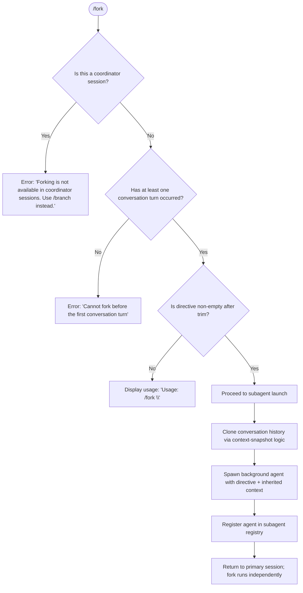

# `/fork`

> Analysis basis: CC v2.1.161 bundle.js (AST extraction + Claude interpretation)
> Minimum version: v2.1.161

---

## Overview

`/fork` spawns a background agent that inherits the full current conversation history. The user supplies a short directive (the goal for the forked agent), and the command launches a new subagent process that runs independently while the primary session continues. The forked agent operates with the same conversation context as its parent at the moment of invocation.

---

## Registration

| Field | Value |
|---|---|
| type | `local-jsx` |
| name | `fork` |
| description | `Spawn a background agent that inherits the full conversation` |
| argumentHint | `<directive>` |
| module_id | `ft1` |
| load_inline | `true` |
| loc_byte | `12361818` |
| loc_byte_end | `12362021` |
| loc_line | `8645` |
| arbor_handler.name | `zZf` |
| arbor_handler.fqn | `claude-2.1.161::zZf` |
| arbor_handler.kind | `AsyncFunction` |
| arbor_handler.resolution_path | `module_id` |
| arbor_handler.n_hits | `0` |

Analysis basis: CC v2.1.161 bundle.js:+12361818

---

## Input Branching

Four distinct execution paths exist based on session state and directive content, requiring a flowchart.



Analysis basis: CC v2.1.161 bundle.js:+12361377 (directive trim), +12361515 (coordinator guard), +12361588 (first-turn guard), +12361401 (usage string)

---

## Behavioral Spec

### Handler Entry — `forkCommandHandler` (`zZf`)

```
async function forkCommandHandler(input, context):
    directive = input.trim()                        // +12361377

    if session is coordinator mode:
        return error("Forking is not available in coordinator sessions. Use /branch instead.")
                                                    // +12361515

    if no conversation turns have occurred yet:
        return error("Cannot fork before the first conversation turn")
                                                    // +12361588

    if directive is empty:
        show("Usage: /fork \\<directive\\>")         // +12361401
        return

    launch subagent with directive
```

### Coordinator-Mode Guard

The guard reads a session flag. When the flag indicates `coordinator` mode, the command is blocked with the literal message `"Forking is not available in coordinator sessions. Use /branch instead."` The alternative suggested is `/branch`.

Analysis basis: CC v2.1.161 bundle.js:+12361515

### First-Turn Guard

Before spawning, the handler verifies that at least one prior conversation turn exists. If the conversation is empty (the user is attempting to fork before any exchange has happened), the command stops with `"Cannot fork before the first conversation turn"`.

Analysis basis: CC v2.1.161 bundle.js:+12361588

### System-Prompt Construction (`buildSystemPrompt`, mapped to `H`)

```
function buildSystemPrompt(config):
    fetch remote config via bootstrapFetch    // +15504122 "[Bootstrap] Fetching"
    assemble system prompt sections:
        - task_continuity block               // +13255772
        - env_info_static or env_info_simple  // +13256004 / +13256041
        - language section                    // +13256079
        - output_style section                // +13256114
        - bg-session section                  // +13256144
        - scratchpad section                  // +13256171
        - context_management section          // +13256198
        - brief section                       // +13256237
        - reproduce_verify_workflow           // +13256291
        - heron_brook feature flag block      // +13256342
        - autonomy_append section             // +13256389
    return assembled prompt
```

The forked agent receives a `system`-role prompt (literal `"system"` at +12361441). Sections include worktree guidance when applicable: `"This is a git worktree — an isolated copy of the repository..."` (+13257884) and `"Additional working directories:"` (+13258082). Agent threads always use absolute file paths: `"- Agent threads always have their cwd reset between bash calls..."` (+13261499).

Analysis basis: CC v2.1.161 bundle.js:+12361399 (call to `H`), +12361441

### Subagent Launch (`spawnSubagent`, mapped to `gt_`)

```
async function spawnSubagent(directive, conversationSnapshot, config):
    sessionId = generateRandomHex(8)             // +6817211, +6817223
    timestamp  = Date.now()                      // +10847830

    // Slice conversation to at most 50 messages from the end
    messages = conversationSnapshot.slice(-50)   // +10847773 (50), +10847776

    // Retrieve REPL contexts
    replContexts = context.getReplContexts()     // +10847628

    // Prepare context package
    contextPackage = buildContextPackage(messages, replContexts)

    // Determine coordinator mode (fork always uses "fork" type)
    agentMode = "fork"                           // +10847588

    // If directive is absent at this stage, record telemetry and abort
    if directive missing:
        emit("subagent_fork_prompt_missing")     // literal at +10847539
        return

    // Launch
    taskHandle = launchLocalAgent(contextPackage, directive, config)
    register(taskHandle)

    emit("subagent_launch")                      // +10847397
    emit("subagent_fork_coordinator_mode")       // +10847415

    return taskHandle
```

Analysis basis: CC v2.1.161 bundle.js:+12361469 (call to `gt_`), +10847382, +10847501

### Conversation History Snapshot (`buildContextSnapshot`, mapped to `C_`)

```
function buildContextSnapshot(appState):
    messages = appState.getAppState().messages    // +10823513
    lastAssistant = messages.findLast(isAssistant) // +10823593

    workingDirectory = config.working_directory   // +10823618
    allowedTools     = config.allowed_tools       // +10823673
    disallowedTools  = config.disallowed_tools    // +10823728
    avoidPrompts     = config.avoid_prompts       // +10823789
    sessionConfig    = config.session             // +10824088
    effort           = config.effort              // +10824113
    model            = config.model               // +10824126
    maxThinkingTokens= config.max_thinking_tokens // +10824138
    flagSettings     = config.flag_settings       // +10824164

    return snapshot
```

Analysis basis: CC v2.1.161 bundle.js:+10848074 (call to `C_`), +10823513

### Message Truncation and Type Filtering (`filterMessages`, mapped to `tT8`)

```
function filterMessages(messages):
    // Preserve assistant turns
    assistantMsgs = messages.filter(m => m.role === "assistant")  // +9519547
    // Preserve user turns
    userMsgs      = messages.filter(m => m.role === "user")       // +9519569
    // Handle tool_use blocks                                       // +9518877
    // Handle tool_result blocks                                    // +9519036
    // err / ok result coding                                      // +9519081, +9519152
    // Strip error-type tool results                               // +9519394

    return filteredMessages
```

Slice limit: 50 messages from tail, then 49 characters of head trimmed (`+10847773`, `+10847786`).

Analysis basis: CC v2.1.161 bundle.js:+10847723

### Local Agent Runner (`runLocalAgent`, mapped to `IaH`)

The local agent runner executes the forked agent loop:

```
async function runLocalAgent(taskHandle, directive, context):
    timeout   = parseInt(env) || 600000          // 10 min default (+6906792, +6906858)
    startTime = Date.now()

    while running:
        response = await callModel(prompt)        // +10781976
        process response events
        if stopCondition:
            emit("subagent_complete")             // +6907986
            break
        if stall detected (watchdog):
            emit("watchdog_stall")               // +6907344
            emit("tengu_async_agent_stall_timeout")
            break

    // Finalize
    recordCompletion(taskHandle)
    emit("subagent_complete" or "subagent_stall_timeout")
```

Stall timeout literal: `600000` ms (10 minutes) at +6906858. Watchdog prefix: `"watchdog_stall"` at +6907344.

Analysis basis: CC v2.1.161 bundle.js:+10848347

### Subagent Registry (`registerSubagent`, mapped to `g66`)

```
function registerSubagent(taskHandle):
    agentType = "local_agent"                    // +10380210
    status    = "running"                        // +10380255
    purpose   = "general-purpose"               // +10380329

    subagentStore.add(taskHandle)
    K.register(taskHandle)                       // +10380521

    emit("tengu_forked_agent_default_turns_exceeded") when turn cap hit
```

Analysis basis: CC v2.1.161 bundle.js:+10847843

### Safety Classifier Handoff (`safetyClassifier`, mapped to `vz8`)

Before returning forked-agent output to the parent session:

```
function classifyHandoff(agentOutput):
    if classifierUnavailable:
        warn("Handoff classifier unavailable, allowing sub-agent output with warning")
        // +6905928
        addNotice("Note: The safety classifier was unavailable when reviewing this subagent's work...")
        // +6906017
    else:
        classify output
        if result is "blocked":
            suppress output
        if result is "success":
            return output
```

Analysis basis: CC v2.1.161 bundle.js:+6904601, +6905928, +6906017

### OTel Span Tracing

Fork spawns an OpenTelemetry child span:

- Tracer namespace: `"com.anthropic.claude_code.tracing"` (+6807223), version `"1.0.0"` (+6807259)
- Span name: `"claude_code.subagent.spawn"` (+6815387)
- Span type attribute: `"subagent.spawn"` (+6815254)

Analysis basis: CC v2.1.161 bundle.js:+6815224

---

## State & Side Effects

| Item | Detail |
|---|---|
| Telemetry — subagent_launch | Emitted when subagent successfully dispatched (+10847397) |
| Telemetry — subagent_fork_coordinator_mode | Emitted with coordinator mode flag (+10847415) |
| Telemetry — subagent_fork_prompt_missing | Emitted when directive is absent at launch time (+10847539) |
| Telemetry — tengu_async_agent_stall_timeout | Emitted when forked agent stalls beyond watchdog window (+6907749) |
| Telemetry — tengu_forked_agent_default_turns_exceeded | Emitted when turn cap is reached (+10822391) |
| Telemetry — tengu_agent_tool_completed | Emitted on forked-agent tool completion (+6903850) |
| Telemetry — tengu_agent_tool_terminated | Emitted on forked-agent tool termination (+6909994) |
| Telemetry — tengu_auto_mode_decision | Emitted by safety auto-mode classifier (+6905495) |
| Telemetry — tengu_agent_summary_skipped | Emitted when summary step is skipped (+9424621) |
| OTel span | `claude_code.subagent.spawn` span opened, closed on completion (+6815387) |
| appState changes | Subagent entry added to subagent registry; parent session continues unblocked |
| File system | Subagent working directory resolved via absolute path; `bg-session` symlink created under `subagents/` directory (+6695887) |
| Hook registration | `tYA.register` called for subagent lifecycle hook (+59405); hooks fire on `SubagentStart` (+13148253) and `SubagentStop` (+13189501) |
| Sound | <!-- TODO: not found in depth-2 traversal; needs --depth 4 --> |
| Stall timeout | 600 000 ms (10 minutes) hard cap (+6906858) |
| Turn slice | At most 50 messages from conversation tail passed to fork (+10847773) |

---

## Version History

| Version | Change |
|---|---|
| v2.1.161 | Initial analysis |

---

## Common Mistakes

1. **Invoking `/fork` in a coordinator session** — The command is blocked outright. Use `/branch` instead, as indicated by the error message.
2. **Invoking `/fork` on an empty conversation** — The guard requires at least one completed turn. Provide an initial prompt first.
3. **Omitting the directive argument** — Without a non-empty directive after trimming, the command only prints the usage string and does not launch an agent.
4. **Expecting synchronous completion** — The forked agent runs in the background; results are not immediately visible in the primary session.
5. **Assuming the fork has access to future messages** — The snapshot is taken at invocation time. Messages added to the parent after `/fork` is issued are not visible to the forked agent.

---

## Appendix — Identifier Mapping

> For bundle debugging only. Identifiers change across versions.

| Identifier | Role |
|---|---|
| `zZf` | Main `/fork` command handler (AsyncFunction) |
| `gt_` | Subagent spawn orchestrator |
| `H` | System prompt builder / bootstrap fetch wrapper |
| `C_` | Conversation context snapshot builder |
| `v7f` | Context packaging and message preparation |
| `tT8` | Message type filter (assistant/user/tool_use/tool_result) |
| `IaH` | Local agent runner loop |
| `g66` | Subagent registry registration |
| `oh` | Full REPL session runner (parent context) |
| `lG` | System prompt section assembler |
| `vz8` | Safety/handoff classifier |
| `Nm` | Subagent lifecycle coordinator |
| `nLf` | Agent query/model-call loop |
| `M06` | Agent summary and result packaging |
| `Jb9` | OTel span lifecycle manager |
| `FJH` | OTel context enter-with handler |
| `Sh` | Span activity accessor |
| `skH` | Span status setter |
| `qS1` | Directive trim/validate helper |
| `Rh` | Random bytes generator (session ID) |
| `VZ` | Subagent directory path builder |
| `hRH` | Filesystem subagent slot manager |
| `OC8` | Active-subagent set tracker |
| `t4A` | Subagent directory creator |
| `c$` | Subagent path join helper |
| `p2` | Subagent pending-state recorder |
| `WC` | AbortController factory for subagent |
| `sO` | Agent flush/log helper |
| `Ya_` | Agent timestamp updater |
| `NaH` | Subagent status update handler |
| `b_H` | Speculation abort handler |
| `iJH` | Agent state update helper |
| `yz8` | Agent completion state recorder |
| `kz8` | Classifier result handler |
| `q06` | Auto-mode classifier executor |
| `nb9` | Classifier sub-router |
| `cM7` | Classifier availability checker |
| `EaH` | Task progress event emitter |
| `Iz8` | Error recovery router |
| `T8` | Terminal output helper |
| `hH` | Logging/display helper |
| `dM` | Debug/metrics emitter |
| `pH` | String coercion utility |
| `N6` | Path join (XN wrapper) |
| `P_` | Path resolve (XN wrapper) |
| `tS` | Transport factory (XN wrapper) |
| `XN` | Node.js path module reference |
| `IBK` | Transcript / append-file writer |
| `WmH` | Batched write manager |
| `_3H` | Line writer helper |
| `BJA` | Transcript path builder |
| `UJA` | Transcript rotation handler |
| `NBK` | Directory-and-append writer |
| `d46` | EISDIR error handler |
| `Y9` | Hook registration (tYA.register) |
| `s$` | Session state getter |
| `ne` | Permission set checker |
| `Ij` | Path replacement helper |
| `lq` | Context token resolution |
| `xHH` | Token model resolver |
| `nQ` | Provider prefix handler |
| `s9` | Model string normaliser |
| `NKH` | Model category classifier |
| `aN` | Upstream/firstParty model selector |
| `KG` | Model override applier |
| `Xwq` | Composite model selector |
| `UM` | Provider PA wrapper |
| `Us6` | Model allowlist checker |
| `bgH` | Background-model selector |
| `xP` | Model resolution pipeline |
| `b0` | Full model config builder |
| `t6` | Session config accessor |
| `h1H` | Session sub-accessor |
| `Xa8` | Logging emitter |
| `G2` | pH-wrapper utility |
| `IT` | Identifier table lookup |
| `E1` | Error type factory |
| `RH` | Debug/trace logger |
| `BN8` | Context builder step A |
| `FN8` | Context builder step B |
| `vLA` | pH-based formatter |
| `h6` | Section renderer |
| `cZ8` | Plugin section builder |
| `t_` | np (path) helper |
| `vZ` | Subagent directory layout |
| `Qxf` | Code-style section builder |
| `dxf` | Irreversible-action confirmation section |
| `d36` | Section delimiter |
| `cxf` | Additional section builder |
| `yLA` | Model/effort section builder |
| `Wuf` | yLA wrapper |
| `Auf` | Schedule/routine section injector |
| `$w6` | Memory prompt builder |
| `Ouf` | Environment info (static) builder |
| `$uf` | Environment info (simple/worktree) builder |
| `rxf` | Language section builder |
| `oxf` | Output-style section builder |
| `Duf` | Background-session section builder |
| `Yuf` | Scratchpad section builder |
| `juf` | Brief-mode checker |
| `Xuf` | Context-management section builder |
| `Luf` | Section header formatter |
| `nxf` | Focus/reproduce section builder |
| `Rjq` | heron_brook section builder |
| `ixf` | autonomy_append section builder |
| `OR9` | Attachment/image section builder |
| `Kuf` | VLA formatter wrapper |
| `axf` | Auxiliary section builder |
| `sxf` | System-compress notice builder |
| `txf` | Tool documentation injector |
| `exf` | yLA section wrapper |
| `Huf` | Tool-use section builder |
| `quf` | IF section wrapper |
| `ilq` | Memory section injector |
| `RDH` | Rate-limit / PA injector |
| `Im` | Main-thread agent launcher |
| `uK` | uK context helper |
| `v_` | Module loader bootstrap |
| `M` | Temp-file cleanup helper |
| `Vz` | Callback dispatcher |
| `Vn7` | Assistant-message validator |
| `vn7` | Array-type validator |
| `Zn7` | Code-block message filter |
| `$j1` | Content block classifier |
| `Nn7` | Tool-use presence checker |
| `qS1` | Directive trim validator |
| `Rh` | Random bytes hex generator |
| `g66` | Subagent slot runner |
| `hRH` | Filesystem slot initialiser |
| `OC8` | Active set add/delete wrapper |
| `t4A` | Mkdir + peH helper |
| `c$` | Path join + peH helper |
| `v8` | EEXIST/ENOSPC handler |
| `yH` | Error logger (ri.logError) |
| `mH6` | Slot re-open helper |
| `VZ` | Subagent path struct |
| `tS` | Transport (XN) |
| `P_` | Path resolve (XN) |
| `N6` | Path join (XN) |
| `dM` | Metrics emitter |
| `WC` | AbortController builder |
| `c1` | MaxListeners setter |
| `QgL` | WeakRef deref callback A |
| `dgL` | WeakRef deref callback B |
| `p2` | Pending-state writer |
| `K` | Pad-end formatter |
| `Ua` | Context token pipeline |
| `QT` | xHH/KG/aN pipeline |
| `eo6` | Provider prefix extractor |
| `qB4` | ARN-prefix parser |
| `IY` | Model-type classifier |
| `d$6` | PA/pH classifier helper |
| `KB4` | startsWith gate |
| `PA` | pH-based provider wrapper |
| `Ha6` | Case-normalise provider |
| `AgH` | Provider replace + i1_ |
| `i1_` | startsWith gate B |
| `gC9` | Model family includes-check |
| `_9` | Aa6/Ij includes checker |
| `FC9` | _9/DU/sX/x0 chained check |
| `DU` | kKH/_9/Iy/IY check |
| `sX` | kKH/yKH/PA/wA/a9 builder |
| `hS_` | Context state accessor |
| `iQ` | Ewq.run wrapper |
| `Nw` | Ewq.getStore wrapper |
| `rQ` | cL_.getStore accessor |
| `u0` | cL_.getStore helper |
| `Q` | Stream reader |
| `g` | Write/timeout loop |
| `y` | Watchdog handler |
| `S` | D.write / d helper |
| `h` | Blur/focus heuristic |
| `hd` | hd helper |
| `I` | Rate-limit / FG8 tracker |
| `V` | V variant |
| `UTK` | UTK helper |
| `sO` | Flush/log |
| `b_H` | abortSpeculation + c$ + Z7 |
| `Z7` | replaceAll HTML-entity encoder |
| `AyH` | hK filter wrapper |
| `hK` | Message filter |
| `qyH` | qyH helper |
| `KyH` | kK turn-cache accessor |
| `kK` | Turn cache recursive lookup |
| `M06` | Model response processor |
| `Dl_` | Array set-intersection helper |
| `E` | EI6/Y16 stream events |
| `t0` | Model stream processor |
| `C8` | UUID generator |
| `jl7` | jl7 helper |
| `xY1` | State update + Ee + EaH |
| `P` | Buffer concat / indexOf reader |
| `O` | u8 abort helper |
| `Z` | Z set helper |
| `D` | Output writer / display |
| `BWH` | Event decoder |
| `H9K` | Key-width display helper |
| `G` | Keyboard stop handler |
| `USK` | h6H heartbeat helper |
| `hz8` | findLastIndex filter |
| `nJH` | fCH tool classifier |
| `fCH` | Tool-call JAf/qq/kK/D5H |
| `O06` | A.update wrapper |
| `r7H` | $06 helper |
| `$06` | $06 implementation |
| `Nz8` | Nz8 helper |
| `Iz8` | r7H/EaH router |
| `EaH` | Hv / Date.now task-progress |
| `vz8` | Classifier+handoff |
| `ZZ` | findLast assistant msg |
| `Ka` | Ka helper |
| `dM7` | Debug metrics |
| `Y` | Exit/abort handler |
| `u$` | pH user-message formatter |
| `CI` | $HH.has / toLowerCase gate |
| `N4` | Event emitter (SIH/nK6) |
| `L7H` | toLowerCase / m58 |
| `T8` | Xa8 terminal writer |
| `cM7` | wz8.has / jz8 availability |
| `yz8` | Update/flush completion |
| `hH` | d / h1H display helper |
| `kz8` | nb9 / q06 / ZZ / N classifier |
| `nb9` | db9/Qb9/lb9 sub-router |
| `q06` | Full auto-mode classifier |
| `Vp` | Vp helper |
| `TH` | String coercer |
| `iJH` | Update / Ya_ / sO state |
| `m` | clearInterval stream |
| `U$H` | U$H helper |
| `kW6` | r38.delete cleanup |
| `oh` | Full REPL turn runner |
| `E7H` | j6 event emitter |
| `j6` | gY6/QY6/Qx/Lq8/BY6 emitter |
| `AR9` | Fh_.set subagent map setter |
| `g7H` | g7H helper |
| `Mz8` | lC9/cC9/Lz8 parent tracker |
| `lC9` | CS_.get/set cache |
| `cC9` | Math.abs / d3H delta |
| `_M7` | SS_.push process recorder |
| `TT8` | TT8 helper |
| `H7H` | IC / _.load / H.dump |
| `IC` | IC helper |
| `MH` | Main REPL UI component |
| `XxH` | XxH helper |
| `wR6` | wR6 helper |
| `jH` | jH stream |
| `R` | gSK / S$ / N / yH / S95 writer |
| `HH` | G.current / Q.setTimeout |
| `u` | clearTimeout / $.write |
| `t` | Full voice/input handler |
| `eH` | N / zH.push / yq hook events |
| `e` | M / addNotification / OD / L |
| `$H` | aI1 / Vx / m.push / y.enqueue |
| `u8` | u8 helper |
| `CH` | j6 channel handler |
| `jR6` | wR6 / eBf |
| `_H` | fH.has/add / z8 / jk / d / T8 |
| `P9H` | P9H helper |
| `N96` | N96 helper |
| `JR6` | N96 / HFf |
| `wH` | MCP send/cleanup helper |
| `X` | Input editor component |
| `bH` | bbH helper |
| `a` | E.current / Q.setTimeout |
| `qH` | e / $H / Z / I queue |
| `ga` | Subagent adoption/filter manager |
| `qR_` | Filter/set membership checks |
| `o3` | fM4/uT/MM4/LM4 formatter |
| `z` | hH / RH / ly / qp daemon |
| `$` | y_K filter |
| `w` | Process spawn/kill manager |
| `c0` | QQ / v1 / pH / j6 builder |
| `j` | A.values / y.kill process table |
| `W` | Y16 / OS / jk / Promise.all |
| `sP` | pH session-path helper |
| `v4` | v4 helper |
| `Xx9` | j6 context ref |
| `YH` | Voice/input handler (full) |
| `MR8` | Voice stream WebSocket |
| `zH` | zH drop/start stream |
| `crf` | crf helper |
| `o` | Promise.all / MB / X.filter |
| `GMA` | X0H.push / Date.now |
| `c` | gk6 / Eu1 process helper |
| `l` | Full turn-loop controller |
| `VH` | MCP server config/render |
| `i` | W / cm8 / c.applyMcpUpdate |
| `Dl7` | H.getSystemPrompt / jv6 |
| `jv6` | Muf system-prompt helper |
| `Jv6` | VL / $X / XC8.randomUUID |
| `VL` | N6/WN/kW/iV/cv/h6 section |
| `$X` | Full agent execution session |
| `yq` | WW1.randomUUID |
| `bj` | m8 / Array.isArray / _.includes |
| `m8` | xd6 / TQ module |
| `u4H` | G2L.has gate |
| `UC9` | Object.keys / N / H.add |
| `tK` | XN helper |
| `XN` | Node path module |
| `Yl7` | u66 / eq / _.find |
| `u66` | zJ helper |
| `eq` | indexOf/slice extractor |
| `PRH` | zJ / ReferenceError / _.map / iL |
| `zJ` | _.find / A4K resolver |
| `iL` | iL helper |
| `d6` | z6 / S_._createElementNS |
| `z6` | Session tear-down runner |
| `S_` | DOM _createElementNS |
| `z_` | DOM _setAttribute / _setAttributeNS |
| `D8` | Plugin/prompt command dispatcher |
| `RWH` | Plugin refresh runner |
| `cWH` | gb / H.filter command filter |
| `KX` | Command list builder |
| `JH` | jH / ruf command renderer |
| `$1H` | Object.assign helper |
| `G6` | Stall-timeout controller |
| `l6` | HH.push / BH / gH abort |
| `Ol7` | MCP server loader |
| `qmH` | qmH helper |
| `eK` | pH bare-mode helper |
| `xB` | HX / bj / uJH server resolver |
| `zrH` | DjH / FDH server type router |
| `sc` | Object.entries / mJH / A.push |
| `x7H` | gI / S7H / CRH / Pi_ tool search |
| `gI` | ur_ / N / PA / l7 tool search core |
| `S7H` | toLowerCase / vHf / _.includes |
| `CRH` | H.some / v4 |
| `Pi_` | Deferred tool pool manager |
| `GT8` | App-state setter / WC / H7H |
| `eYH` | eYH helper |
| `Zz9` | Zz9 helper |
| `ev8` | ev8 helper |
| `WT8` | Turn-state manager |
| `gb` | gb helper |
| `ON6` | gb / Tv / H.filter / dR8 |
| `Rl` | dR8 / _.add / H.filter / _.has |
| `j_H` | H.filter / _.some / A4K |
| `Bg` | Bg feature flag |
| `xW1` | FZ8 get/set cache |
| `IV` | pH / parseInt / isNaN / x0 / DU |
| `E0` | E0 helper |
| `sI_` | Tool permission set builder |
| `NkH` | Backoff calculator |
| `LG` | s9 / _9 / YHL.has model gate |
| `J` | w session writer |
| `jl_` | a4 fork-context ref builder |
| `a4` | Y9 fork context |
| `fqH` | a4 / aRH query helper |
| `aRH` | H.filter / lR8 / AC8 / Rbf |
| `U66` | j4K / PL.mkdir / PL.writeFile |
| `j4K` | VZ path helper |
| `E6` | Subagent REPL bridge session |
| `LH` | AH.has / z8 / SH / eN6 stream |
| `g7A` | Bridge event dispatcher |
| `th6` | H.replace path formatter |
| `BH` | LH.setOnConnect / clearTimeout |
| `aH` | Headless managed-settings waiter |
| `T6` | zH.end / _H.add / LH.writeBatch |
| `Jb9` | OTel span lifecycle |
| `d7H` | d7H helper |
| `Sh` | Q7H.active span accessor |
| `skH` | SIH span-status setter |
| `Wv` | Wv helper |
| `FJH` | BJH.set / Q7H.enterWith |
| `Nm` | Subagent coordinator |
| `nLf` | Agent query engine |
| `XO8` | Subagent exit handler |
| `wl_` | wl_ helper |
| `m7H` | sj / xf7 / H.filter / H.push |
| `sj` | sj helper |
| `xf7` | H.find tool lookup |
| `zl7` | zl7 helper |
| `IS9` | IS9 helper |
| `aW` | g1f / A.get / K.push / Q1f |
| `g1f` | pI6 accessor |
| `pI6` | pI6 helper |
| `Q1f` | pI6 / xI6 / C8 builder |
| `ET8` | K / q turn helper |
| `m66` | aW / sv6 / N6 / pH / Date.now |
| `sv6` | _.trim tool-name normaliser |
| `CY1` | _.get / OX / MCH metrics |
| `OX` | OX helper |
| `MCH` | MCH metrics helper |
| `w5H` | N6 / xv / ZZ / hK / VLK / VL / VZ / $X |
| `xv` | uU / CY / Zp / db context |
| `VLK` | Object.values / MJ / uEH / _.push |
| `vLK` | UE / H.map / uEH |
| `nH` | Math.min / m.slice / eH.writeMessages |
| `cc` | pH / uS9 |
| `uS9` | uS9 helper |
| `dS9` | RB.delete / UkH |
| `UkH` | mS9 / pS9 / SH / SS9 / a38 |
| `Yl_` | FZ8.delete |
| `rkH` | Lz8.delete / CS_.delete |
| `Pb9` | BJH.get / H.setAttribute / akH |
| `akH` | H.setStatus |
| `gJH` | Sh / Q7H.enterWith |
| `qR9` | Fh_.delete |
| `pC9` | Object.entries / _.all / NZ / N / ikH |
| `NZ` | NZ helper |
| `ikH` | _.update / NZ / N / yH / sO |
| `oP6` | oP6 helper |
| `JJH` | JJH helper |