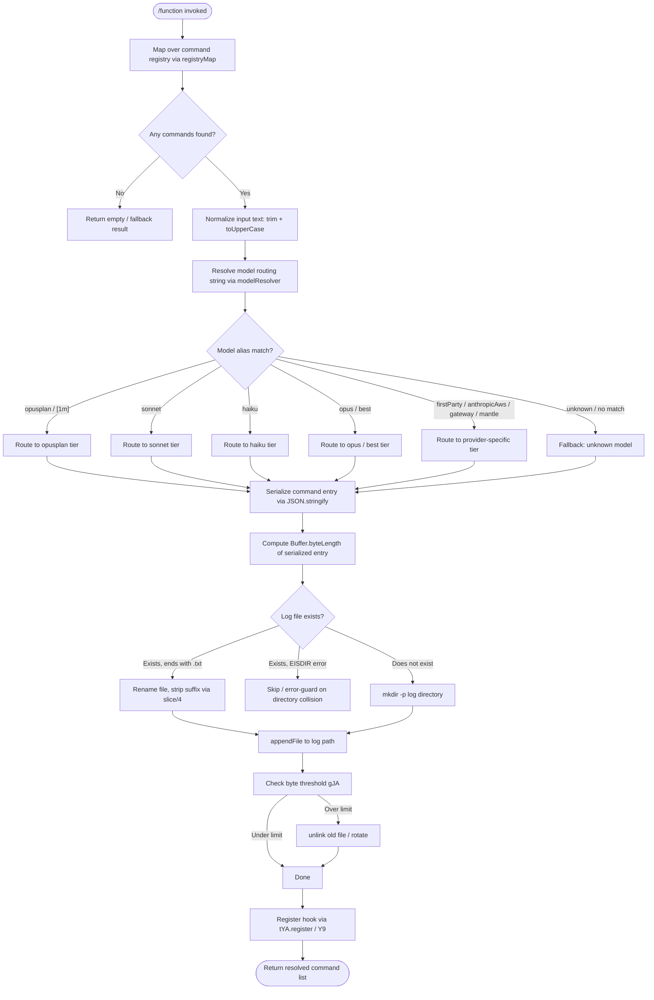

# `/function`

> Analysis basis: CC v2.1.161 bundle.js (AST extraction + Claude interpretation)
> Minimum version: v2.1.161

---

## Overview

The `/function` command is a registration-type `"function"` slash command whose handler (`Cxf`) produces a list of callable command entries by mapping over an internal command registry. Its core mechanism involves iterating available commands, resolving model routing context, normalizing input text, and persisting structured output to a log file — functioning as an internal introspection or command-enumeration utility.

---

## Registration

| Field | Value |
|---|---|
| type | `function` |
| name | `function` |
| description | `null` |
| loc_byte | `13206426` |
| loc_byte_end | `13206459` |
| loc_line | `10540` |
| arbor_handler.name | `Cxf` |
| arbor_handler.fqn | `claude-2.1.161::Cxf` |
| arbor_handler.kind | `Function` |
| arbor_handler.resolution_path | `direct` |
| arbor_handler.n_hits | `1` |

Analysis basis: CC v2.1.161 bundle.js:+13206426

---

## Input Branching

The handler exhibits four or more distinct execution paths depending on: (1) whether the command registry map produces entries, (2) whether the resolved model string matches known shorthand aliases, (3) whether a `.txt`-suffixed log file exists and must be renamed/unlinked, and (4) whether byte-length thresholds are met during file append. A Mermaid flowchart is used.



---

## Behavioral Spec

### 1. Handler Entry Point — Command Registry Map

The primary handler `Cxf` begins by iterating the internal command registry (`registryMap`). Each entry in the registry is projected into a normalized structure. The string literal `"command"` (Analysis basis: CC v2.1.161 bundle.js:+13206138) appears in the mapping logic, indicating that the resulting objects are tagged with a type discriminator of `"command"`.

```
function commandFunctionHandler(context):
    entries = registryMap.map(entry => normalizeCommandEntry(entry))
    return entries
```

Analysis basis: CC v2.1.161 bundle.js:+13206107

### 2. Secondary Entry — Bootstrap Fetch Dispatcher (`H`)

The call-graph shows that `Cxf` also invokes `H` (the bootstrap-fetch dispatcher). This function performs an HTTP GET to an internal endpoint, logging `"[Bootstrap] Fetching"` at start and `"[Bootstrap] Fetch ok"` on success (Analysis basis: CC v2.1.161 bundle.js:+15504122, +15504486). The request is made with a 5000 ms timeout (Analysis basis: CC v2.1.161 bundle.js:+15504313) and carries headers `Content-Type: application/json` and `User-Agent` (Analysis basis: CC v2.1.161 bundle.js:+15504207, +15504241). On parse failure, the telemetry property `"parse_failed"` is set within the `"api_bootstrap_fetch"` event (Analysis basis: CC v2.1.161 bundle.js:+15504434, +15504456).

```
function bootstrapFetchDispatcher(url):
    log("[Bootstrap] Fetching", url)
    response = fetch(url, {
        timeout: 5000,
        headers: {
            "Content-Type": "application/json",
            "User-Agent": userAgentString
        }
    })
    if response.ok:
        log("[Bootstrap] Fetch ok")
        data = parse(response)
        if parseFailed:
            emit telemetry("api_bootstrap_fetch", {result: "parse_failed"})
        return data
    else:
        emit telemetry("api_bootstrap_fetch", {result: "error"})
```

Analysis basis: CC v2.1.161 bundle.js:+15504120

### 3. Input Normalizer (`N`)

The input normalizer trims whitespace, converts to uppercase, resolves the log path extension via `Z4`, checks debug mode (string literal `"debug"`, Analysis basis: CC v2.1.161 bundle.js:+204573), performs an `H.includes` membership check, serializes the payload via `JSON.stringify` (through `SH`), and then dispatches to the file-persistence pipeline (`imH`) and the log-file rotation pipeline (`IBK`).

```
function inputNormalizer(rawInput, options):
    trimmed = rawInput.trim()
    upper = trimmed.toUpperCase()
    if options.includes("debug"):
        enableDebugMode()
    serialized = serializeToJSON(upper)            // via SH → JSON.stringify
    logPath = resolveLogPath(upper)                // via Z4
    writeToStream(serialized)                      // via imH → GJA → H.write
    rotateAndPersist(logPath, serialized)          // via IBK
```

Analysis basis: CC v2.1.161 bundle.js:+204597

### 4. Log Path Resolver (`Z4`)

Resolves the full log file path from a normalized string. It maps over a set of known path components (`CJA` → `WBK.map`), applies a `.replace` on the candidate path, accesses the last element via `.at(2)` (literal `2`, Analysis basis: CC v2.1.161 bundle.js:+196734), finds the last separator index via `.lastIndexOf`, and slices the result. The string `"[REDACTED]"` appears as a placeholder token for a sensitive path segment (Analysis basis: CC v2.1.161 bundle.js:+196705).

```
function resolveLogPath(normalizedInput):
    components = pathComponentMap(normalizedInput)   // CJA
    candidate = components.replace(pattern, "[REDACTED]")
    segment = candidate.at(2)
    sepIndex = candidate.lastIndexOf(separator)
    return candidate.slice(sepIndex)
```

Analysis basis: CC v2.1.161 bundle.js:+196626

### 5. File Persistence and Rotation Pipeline (`IBK`)

This is the most complex sub-function. It:

1. Clears any pending timeout (Analysis basis: CC v2.1.161 bundle.js:+58819) and queues writes via `setImmediate` / `setTimeout` with a 1000 ms debounce and a batch cap of 100 items (Analysis basis: CC v2.1.161 bundle.js:+58707, +58728).
2. Resolves the parent directory via `path.dirname`.
3. Checks for an existing `.txt`-suffixed file and, if found, renames it by slicing off the last 4 characters (literal `4`, Analysis basis: CC v2.1.161 bundle.js:+203567), then calls `fs.rename` and `fs.unlink` as needed.
4. Guards against `EISDIR` errors (Analysis basis: CC v2.1.161 bundle.js:+174728) when the target path is a directory.
5. Creates the directory with `fs.mkdir` if absent, then appends with `fs.appendFile`.
6. Computes `Buffer.byteLength` of the serialized entry (Analysis basis: CC v2.1.161 bundle.js:+204293) and passes it to the size-gate function (`gJA`).
7. Registers a cleanup/shutdown hook via `tYA.register` (through `Y9`).

```
function rotatePersistenceHandler(logPath, serialized, state):
    clearTimeout(state.pendingTimer)
    state.queue.push(serialized)
    if state.queue.length >= 100:
        flush(state)
    else:
        state.pendingTimer = setTimeout(() => flush(state), 1000)

function flush(state):
    dir = path.dirname(state.logPath)
    if fileExists(state.logPath + ".txt"):
        newPath = state.logPath + ".txt"
        trimmedPath = newPath.slice(0, -4)
        fs.rename(newPath, trimmedPath)
    try:
        fs.mkdir(dir, { recursive: true })
        for item in state.queue:
            bytes = Buffer.byteLength(item)
            if sizeGate(bytes):                    // gJA
                rotateFile(state.logPath)          // UJA: stat, rename, unlink
            fs.appendFile(state.logPath, item)
        state.queue = []
    catch err:
        if err.code == "EISDIR": skip
    registerShutdownHook(flush)                    // Y9 → tYA.register
```

Analysis basis: CC v2.1.161 bundle.js:+204086, +204238, +204255, +204287, +204293, +204326, +204343, +204352, +204448

### 6. Model Routing Resolver (`lq` → `xHH` → `s9`)

Resolves the effective model identifier from a raw model string. The resolution pipeline:

1. Trims and lower-cases the raw string.
2. Checks for known shorthand aliases in this precedence order: `"opusplan"`, `"[1m]"`, `"sonnet"`, `"haiku"`, `"opus"`, `"best"` (Analysis basis: CC v2.1.161 bundle.js:+2236154, +2236180, +2236195, +2236234, +2236273, +2236310).
3. Checks for provider prefixes: `"anthropic."`, `"firstParty"`, `"anthropicAws"`, `"gateway"`, `"mantle"` (Analysis basis: CC v2.1.161 bundle.js:+2230116, +2232362, +2050606, +2050626, +2233003).
4. Falls back to `"unknown"` (Analysis basis: CC v2.1.161 bundle.js:+13206540).
5. Applies string replacement and normalization via `s9`, then routes through `KG`, `UM`, `Vf`, `aN`, `CgH`, `Xwq`, and `bgH` sub-resolvers.

```
function resolveModelRoute(rawModel):
    normalized = rawModel.trim().toLowerCase()
    if normalized includes "opusplan" or "[1m]":   return routeOpusPlan()
    if normalized includes "sonnet":               return routeSonnet()
    if normalized includes "haiku":                return routeHaiku()
    if normalized includes "opus" or "best":       return routeOpus()
    if normalized startsWith "anthropic.":         return routeFirstParty()
    if model in {"firstParty","anthropicAws","gateway","mantle"}:
                                                   return routeProvider(model)
    return "unknown"
```

Analysis basis: CC v2.1.161 bundle.js:+2232138, +2236058, +2236087

### 7. Telemetry — Feature Sad Event (`t6` / `d`)

A `tengu_feature_sad` telemetry event is emitted from function `t6` (calling `d`) under error or degraded-path conditions.

```
function emitFeatureSad(reason):
    telemetry.emit("tengu_feature_sad", { reason: reason })
```

Analysis basis: CC v2.1.161 bundle.js:+966730, +966732

---

## State & Side Effects

| Item | Detail |
|---|---|
| Telemetry | `tengu_feature_sad` (bundle.js:+966732); `api_bootstrap_fetch` with `parse_failed` result (bundle.js:+15504434) |
| Hook registration | `tYA.register` called via `Y9` to register a shutdown/cleanup hook for flush (bundle.js:+59405) |
| appState changes | `s_.get` read (bundle.js:+15504158); `ne` checks `WA4.has` for set membership (bundle.js:+840982) |
| File I/O | `fs.mkdir`, `fs.appendFile`, `fs.rename`, `fs.unlink`, `fs.stat` — all via the `IBK`/`NBK`/`UJA` pipeline |
| Timer state | `clearTimeout` / `setTimeout` (1000 ms debounce) / `setImmediate` managed in `WmH` |
| Network | HTTP fetch with 5000 ms timeout, `Content-Type: application/json`, `User-Agent` header |
| Sound | <!-- TODO: not found in depth-2 traversal; needs --depth 4 --> |

---

## Version History

| Version | Change |
|---|---|
| v2.1.161 | Initial analysis |

---

## Common Mistakes

1. **Assuming `/function` is user-facing in the typical sense.** The `description` field is `null`, which means this command has no help text exposed in the UI and is likely an internal or developer-facing introspection command.
2. **Ignoring the 1000 ms debounce / 100-item batch cap.** Rapidly invoking logic that triggers the persistence pipeline will batch writes; callers expecting immediate file I/O will see delays.
3. **Overlooking the `.txt` suffix rename logic.** If a prior crash left a `.txt`-suffixed log file, the handler silently renames it before appending. Manually placed `.txt` files in the log directory may be consumed unexpectedly.
4. **Confusing the `"unknown"` model fallback with an error.** The model router returns the string `"unknown"` as a valid sentinel, not an exception. Code downstream that checks for truthiness will incorrectly treat it as a resolved model.
5. **Expecting a `module_id` import path.** The Arbor resolver found `Cxf` via `direct` resolution (the symbol falls inside the registration byte range), not via a module import. There is no stable import path to reference across bundle versions.

---

## Appendix — Identifier Mapping

> For bundle debugging only. Identifiers change across versions.

| Identifier | Role |
|---|---|
| `Cxf` | Primary handler function for `/function` command (arbor_handler) |
| `H` | Bootstrap fetch dispatcher / general-purpose utility reference |
| `N` | Input normalizer — trims, uppercases, serializes, dispatches to persistence |
| `VBK` | Intermediate normalizer helper called by `N` |
| `HwA` | Sub-helper within `VBK`; calls `NmK` and `ImK` |
| `SH` | JSON serializer wrapper (delegates to `JSON.stringify`) |
| `Z4` | Log path resolver — maps components, replaces tokens, slices path |
| `CJA` | Path component mapper (uses `WBK.map`) |
| `q` | File reference with `unlinkSync` capability |
| `A` | String operand with `toLowerCase` / `lastIndexOf` / `slice` |
| `imH` | Write-to-stream dispatcher; calls `GJA` → `H.write` |
| `GJA` | Stream write executor |
| `IBK` | File persistence and log-rotation pipeline (main) |
| `WmH` | Debounce/batch timer manager (`clearTimeout`, `setTimeout`, `setImmediate`) |
| `_3H` | Sub-function within `IBK`; calls `Im6`, `he.join`, `r8`, `N6` |
| `F6` | Helper called by `IBK` during path resolution |
| `d46` | Error-code guard helper (handles `EISDIR`) |
| `BJA` | Path join helper using `he.join` and `N6` |
| `UJA` | File-rotation executor (`fs.stat`, `fs.rename`, `fs.unlink`) |
| `NBK` | Alternate persistence path: `mkdir` + `appendFile` + rotation |
| `Y9` | Shutdown hook registrar; calls `tYA.register` |
| `s$` | State or config accessor called by bootstrap dispatcher |
| `ne` | Set-membership checker using `WA4.has` |
| `Ij` | String replacer (calls `H.replace`) |
| `lq` | Model route resolver entry point; calls `xHH`, `s9`, `xP` |
| `xHH` | Model alias dispatcher; calls `NT`, `o9H`, `VA`, `nQ` |
| `NT` | Sub-node in model resolution chain |
| `o9H` | Sub-node in model resolution chain |
| `nQ` | Model alias matcher (checks `anthropic.` prefix, `Aa6`, `RgH`, `Pwq`, etc.) |
| `s9` | Core model string normalizer (trim, toLowerCase, replace, alias matching) |
| `x0` | Model normalization helper calling `kKH` |
| `NKH` | Model inclusion checker using `vKH.includes` |
| `aN` | Model sub-resolver using `UM` and `Vf` |
| `CgH` | Haiku-tier model resolver using `Vf` |
| `KG` | Model tier router using `UM`, `Vf`, `PA`; sets `"firstParty"` |
| `Xwq` | Best-model resolver; delegates to `KG` |
| `UM` | Provider-type resolver using `PA`; handles `anthropicAws`, `gateway` |
| `Us6` | Provider inclusion checker using `wHL.includes` |
| `bgH` | Mantle provider resolver using `pH` |
| `xP` | Model pipeline combinator calling `s9` and `b0` |
| `b0` | Composite model resolver calling `wA`, `BHH`, `RzH`, `xgH`, `KG`, `sX`, `UM`, `PA`, `Vf`, `aN` |
| `t6` | Telemetry dispatcher for `tengu_feature_sad`; calls `d` and `h1H` |
| `d` | Core telemetry emitter |
| `h1H` | Telemetry helper; calls `Xa8` |
| `Xa8` | Low-level telemetry sink |
| `JMH` | Secondary function called directly by `Cxf` (purpose: <!-- TODO: not found in depth-2 traversal; needs --depth 4 -->) |

---

Note: index built via Arbor fallback; some signals (telemetry, literals) may be missing — see arbor-fallback.js.